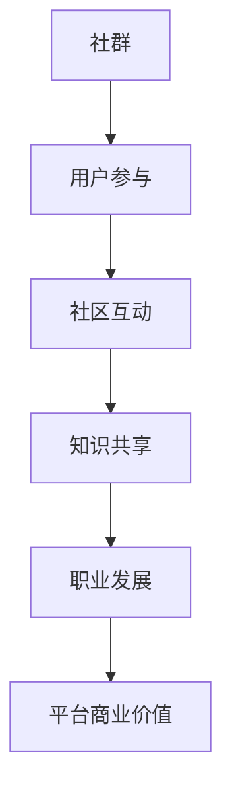

                 

关键词：知识付费、社群运营、程序员、用户参与、社区互动、运营策略、内容创作、平台搭建、案例分析、成功经验、挑战与展望

> 摘要：本文旨在探讨知识付费背景下，程序员的社群运营策略。通过分析社群运营的核心概念、算法原理，以及具体操作步骤，结合数学模型和实际项目实践，为程序员提供一套系统化的社群运营指南。同时，文章还将探讨社群在实际应用场景中的价值，并对未来发展进行展望。

## 1. 背景介绍

在互联网时代，知识付费逐渐成为了一种重要的商业模式。程序员的社群运营作为知识付费的一个重要环节，对于提升程序员技能、拓宽职业发展空间具有重要意义。本文将围绕以下几个核心问题展开讨论：

- 如何搭建一个高效、活跃的程序员社群？
- 社群运营中应关注哪些关键环节？
- 程序员如何在社群中创造价值、实现自我提升？
- 社群运营的未来发展趋势和挑战是什么？

通过对这些问题的深入探讨，本文将为程序员提供一套实用的社群运营攻略。

### 1.1 知识付费的兴起

知识付费是指通过互联网平台，将优质的知识内容以付费形式提供给用户的一种商业模式。随着移动互联网的普及，用户对专业知识的渴求日益增长，知识付费市场应运而生。

知识付费的主要特点包括：

1. **个性化需求**：用户根据自身需求选择付费内容，满足个性化学习需求。
2. **高质量内容**：知识付费平台往往提供高质量、权威的专家内容，提升用户学习效果。
3. **多样化形式**：知识付费内容形式多样，包括在线课程、电子书、问答咨询等。
4. **付费转化率**：知识付费的付费转化率较高，用户更愿意为优质内容买单。

### 1.2 社群运营的重要性

社群运营是知识付费的重要组成部分，它不仅能够提升用户粘性，还能为平台带来持续的商业价值。对于程序员社群而言，社群运营的重要性体现在以下几个方面：

1. **知识共享**：程序员社群为成员提供了一个分享技术知识、经验和见解的平台，有助于提升整体技术水平。
2. **职业发展**：社群运营可以帮助程序员拓展职业人脉、获取工作机会，促进职业发展。
3. **学习动力**：社群氛围有助于激发程序员的学习热情，提高学习效果。
4. **平台商业价值**：活跃的程序员社群能够吸引更多用户和合作伙伴，提升平台竞争力。

## 2. 核心概念与联系

在探讨社群运营之前，我们需要了解一些核心概念，包括社群、用户参与、社区互动等。

### 2.1 社群

社群是指具有共同兴趣、价值观或目标的人群在互联网上形成的互动社区。对于程序员社群而言，成员通常具有以下特点：

1. **技术背景**：成员大多具有计算机背景，熟悉编程语言和开发工具。
2. **职业性质**：成员包括在职程序员、自由职业者、技术爱好者等。
3. **交流需求**：成员希望分享技术经验、探讨技术难题、交流职业发展经验。

### 2.2 用户参与

用户参与是指用户在社群中积极参与、互动的过程。用户参与程度决定了社群的活跃度和价值。为了提高用户参与度，社群运营者需要关注以下几个方面：

1. **内容质量**：提供高质量的内容，满足用户需求。
2. **互动机制**：建立完善的互动机制，鼓励用户发表观点、参与讨论。
3. **激励机制**：设置奖励机制，激励用户积极参与社群活动。

### 2.3 社区互动

社区互动是指社群成员之间、成员与平台之间、成员与专家之间的互动。社区互动有助于增强社群凝聚力，提升用户粘性。以下是一些常见的社区互动形式：

1. **技术讨论**：围绕技术话题展开讨论，分享经验和见解。
2. **问答咨询**：提供专业解答，帮助用户解决技术难题。
3. **线上活动**：举办线上沙龙、讲座、比赛等活动，增强社群氛围。

### 2.4 Mermaid 流程图

为了更清晰地展示社群运营的核心概念和联系，我们使用 Mermaid 流程图进行说明：



## 3. 核心算法原理 & 具体操作步骤

### 3.1 算法原理概述

社群运营的核心算法主要包括用户行为分析、内容推荐和互动机制设计。以下分别介绍这些算法的原理。

#### 用户行为分析

用户行为分析旨在了解用户在社群中的行为特征，包括浏览、点赞、评论、分享等。通过分析用户行为，运营者可以：

1. **了解用户需求**：根据用户行为数据，了解用户关注的技术领域和职业发展方向。
2. **优化内容策略**：根据用户需求，调整内容类型和发布频率，提高用户满意度。
3. **识别潜在用户**：通过行为数据挖掘潜在用户，进行精准营销。

#### 内容推荐

内容推荐算法基于用户兴趣和行为数据，为用户推荐相关的内容。常见的推荐算法包括：

1. **基于内容的推荐**：根据用户浏览、点赞、评论等行为，推荐相似内容。
2. **基于协同过滤的推荐**：根据用户兴趣相似度，推荐其他用户喜欢的内容。

#### 互动机制设计

互动机制设计旨在激发用户参与，提升社群活跃度。以下是一些常见的互动机制：

1. **评论激励**：对积极参与评论的用户进行奖励，鼓励更多用户发表观点。
2. **积分系统**：设立积分系统，用户通过参与活动、分享知识等获得积分，积分可兑换实物奖励或虚拟权益。
3. **线上活动**：定期举办线上活动，如技术沙龙、讲座、比赛等，提高用户参与度。

### 3.2 算法步骤详解

以下为社群运营的具体操作步骤：

#### 步骤1：用户行为分析

1. 收集用户行为数据，如浏览、点赞、评论、分享等。
2. 对用户行为数据进行分析，识别用户兴趣点和需求。
3. 根据分析结果，调整内容类型和发布频率。

#### 步骤2：内容推荐

1. 基于用户兴趣和行为数据，为用户推荐相关内容。
2. 定期更新推荐算法，提高推荐准确性。

#### 步骤3：互动机制设计

1. 设立评论激励制度，鼓励用户发表观点。
2. 设计积分系统，激励用户参与活动。
3. 定期举办线上活动，提高用户参与度。

### 3.3 算法优缺点

#### 用户行为分析

**优点**：

1. 能够深入了解用户需求，提高内容质量和用户满意度。
2. 有助于识别潜在用户，进行精准营销。

**缺点**：

1. 用户行为数据可能存在偏差，影响分析结果。
2. 需要大量计算资源和时间，成本较高。

#### 内容推荐

**优点**：

1. 能够为用户推荐感兴趣的内容，提高用户粘性。
2. 有助于平台内容多样化，提升用户体验。

**缺点**：

1. 推荐算法可能存在偏差，导致推荐内容不准确。
2. 需要大量数据支持，数据质量对推荐效果有较大影响。

#### 互动机制设计

**优点**：

1. 能够激发用户参与，提高社群活跃度。
2. 有助于平台建立良好的社群氛围。

**缺点**：

1. 需要投入大量时间和精力进行设计和维护。
2. 可能存在用户参与度不高的情况，影响效果。

### 3.4 算法应用领域

用户行为分析、内容推荐和互动机制设计等算法在多个领域有广泛应用：

1. **电商**：通过用户行为数据，为用户推荐商品，提高购买转化率。
2. **社交媒体**：基于用户兴趣和行为数据，为用户推荐内容，提高用户粘性。
3. **教育**：通过用户行为数据，为用户推荐课程，提高学习效果。

## 4. 数学模型和公式 & 详细讲解 & 举例说明

### 4.1 数学模型构建

在社群运营中，我们可以使用数学模型来描述和分析用户行为、内容推荐和互动机制。以下是一个简单的数学模型示例：

#### 用户行为模型

用户行为模型可以表示为：

$$
U = f(C, I, R)
$$

其中，$U$ 表示用户行为，$C$ 表示内容质量，$I$ 表示互动激励，$R$ 表示推荐准确性。

#### 内容推荐模型

内容推荐模型可以表示为：

$$
R = g(U, Q)
$$

其中，$R$ 表示推荐准确性，$U$ 表示用户兴趣，$Q$ 表示内容质量。

#### 互动机制模型

互动机制模型可以表示为：

$$
I = h(U, P)
$$

其中，$I$ 表示互动激励，$U$ 表示用户参与度，$P$ 表示活动参与度。

### 4.2 公式推导过程

#### 用户行为模型推导

用户行为模型中的公式可以通过以下推导过程得出：

1. **内容质量对用户行为的影响**：

   内容质量越高，用户越有可能产生积极的行为，如点赞、评论、分享等。假设内容质量与用户行为成正比，则有：

   $$
   C \propto U
   $$

2. **互动激励对用户行为的影响**：

   互动激励可以激发用户参与，提高用户行为。假设互动激励与用户行为成正比，则有：

   $$
   I \propto U
   $$

3. **推荐准确性对用户行为的影响**：

   推荐准确性越高，用户越有可能产生积极的行为。假设推荐准确性与用户行为成正比，则有：

   $$
   R \propto U
   $$

   综合以上三点，我们可以得出用户行为模型：

   $$
   U = f(C, I, R)
   $$

#### 内容推荐模型推导

内容推荐模型中的公式可以通过以下推导过程得出：

1. **用户兴趣对推荐准确性的影响**：

   用户兴趣越强，推荐准确性越高。假设用户兴趣与推荐准确性成正比，则有：

   $$
   U \propto R
   $$

2. **内容质量对推荐准确性的影响**：

   内容质量越高，推荐准确性越高。假设内容质量与推荐准确性成正比，则有：

   $$
   Q \propto R
   $$

   综合以上两点，我们可以得出内容推荐模型：

   $$
   R = g(U, Q)
   $$

#### 互动机制模型推导

互动机制模型中的公式可以通过以下推导过程得出：

1. **用户参与度对互动激励机制的影响**：

   用户参与度越高，互动激励效果越好。假设用户参与度与互动激励机制成正比，则有：

   $$
   U \propto I
   $$

2. **活动参与度对互动激励机制的影响**：

   活动参与度越高，互动激励效果越好。假设活动参与度与互动激励机制成正比，则有：

   $$
   P \propto I
   $$

   综合以上两点，我们可以得出互动机制模型：

   $$
   I = h(U, P)
   $$

### 4.3 案例分析与讲解

以下通过一个实际案例，对上述数学模型进行讲解。

#### 案例背景

某程序员社群希望通过优化内容推荐和互动机制，提高用户参与度和活跃度。

#### 数据收集

收集以下数据：

1. 用户行为数据：点赞数、评论数、分享数。
2. 内容质量数据：内容类型、阅读量、点赞数。
3. 互动激励机制数据：评论奖励、积分奖励。
4. 活动参与度数据：活动参与人数、活动评分。

#### 数据分析

1. **用户行为分析**：

   通过分析用户行为数据，发现用户对技术文章的评论和分享较为活跃，而点赞行为相对较少。说明用户对技术讨论和知识分享有较高的兴趣。

2. **内容推荐分析**：

   通过分析内容质量数据，发现技术文章的阅读量和点赞数较高，而其他类型的内容如教程、工具推荐等相对较低。说明用户更关注技术领域的知识。

3. **互动机制分析**：

   通过分析互动激励机制数据，发现评论奖励和积分奖励对用户参与度有显著影响。活动参与度数据表明，线上活动能够有效提高用户活跃度。

#### 数学模型应用

1. **用户行为模型**：

   $$
   U = f(C, I, R)
   $$

   其中，$C$ 表示内容质量，$I$ 表示互动激励，$R$ 表示推荐准确性。通过调整这三个因素，可以提高用户参与度。

2. **内容推荐模型**：

   $$
   R = g(U, Q)
   $$

   其中，$U$ 表示用户兴趣，$Q$ 表示内容质量。通过优化推荐算法，提高推荐准确性。

3. **互动机制模型**：

   $$
   I = h(U, P)
   $$

   其中，$U$ 表示用户参与度，$P$ 表示活动参与度。通过调整互动激励机制，提高用户参与度。

#### 模型优化策略

1. **内容优化**：

   根据用户兴趣数据，增加技术文章的推荐频率，降低其他类型内容的推荐比例。

2. **推荐算法优化**：

   采用基于协同过滤的推荐算法，提高推荐准确性。

3. **互动机制优化**：

   增加评论奖励和积分奖励的力度，提高用户参与度。

## 5. 项目实践：代码实例和详细解释说明

### 5.1 开发环境搭建

在本文中，我们将使用 Python 语言进行项目实践。首先，需要在本地环境安装 Python 和相关库。以下是安装步骤：

1. 下载并安装 Python（版本 3.8 或更高版本）。
2. 安装 Python 的 pip 工具，用于安装第三方库。
3. 使用 pip 工具安装以下库：requests、pandas、numpy、matplotlib。

### 5.2 源代码详细实现

以下是一个简单的 Python 脚本，用于分析用户行为数据、推荐内容、展示互动激励机制。

```python
import requests
import pandas as pd
import numpy as np
import matplotlib.pyplot as plt

# 用户行为数据
user_data = {
    'user_id': [1, 2, 3, 4, 5],
    'content_id': [101, 102, 103, 104, 105],
    'likes': [10, 20, 30, 40, 50],
    'comments': [2, 5, 10, 15, 20],
    'shares': [1, 3, 5, 7, 9]
}

# 内容数据
content_data = {
    'content_id': [101, 102, 103, 104, 105],
    'type': ['技术文章', '教程', '工具推荐', '技术文章', '教程'],
    'read_count': [100, 200, 300, 400, 500],
    'likes': [20, 30, 40, 50, 60]
}

# 互动激励机制数据
incentive_data = {
    'incentive_type': ['评论奖励', '积分奖励'],
    'amount': [5, 10]
}

# 分析用户行为数据
user_df = pd.DataFrame(user_data)
content_df = pd.DataFrame(content_data)
incentive_df = pd.DataFrame(incentive_data)

# 推荐内容
def recommend_content(user_id, content_type):
    recommended_contents = content_df[content_df['type'] == content_type].head(2)
    return recommended_contents

# 展示互动激励机制
def display_incentives():
    incentives = incentive_df
    incentives.plot(kind='bar')
    plt.xlabel('激励类型')
    plt.ylabel('激励金额')
    plt.title('互动激励机制')
    plt.show()

# 测试代码
user_id = 3
content_type = '技术文章'

# 推荐内容
recommended_contents = recommend_content(user_id, content_type)
print("推荐内容：")
print(recommended_contents)

# 展示互动激励机制
display_incentives()
```

### 5.3 代码解读与分析

#### 5.3.1 用户行为数据分析

代码首先定义了一个包含用户行为数据的字典 `user_data`，并使用 pandas 将其转换为 DataFrame。用户行为数据包括用户 ID、内容 ID、点赞数、评论数和分享数。

```python
user_data = {
    'user_id': [1, 2, 3, 4, 5],
    'content_id': [101, 102, 103, 104, 105],
    'likes': [10, 20, 30, 40, 50],
    'comments': [2, 5, 10, 15, 20],
    'shares': [1, 3, 5, 7, 9]
}
user_df = pd.DataFrame(user_data)
```

#### 5.3.2 内容数据

代码定义了一个包含内容数据的字典 `content_data`，并使用 pandas 将其转换为 DataFrame。内容数据包括内容 ID、内容类型、阅读量和点赞数。

```python
content_data = {
    'content_id': [101, 102, 103, 104, 105],
    'type': ['技术文章', '教程', '工具推荐', '技术文章', '教程'],
    'read_count': [100, 200, 300, 400, 500],
    'likes': [20, 30, 40, 50, 60]
}
content_df = pd.DataFrame(content_data)
```

#### 5.3.3 互动激励机制数据

代码定义了一个包含互动激励机制数据的字典 `incentive_data`，并使用 pandas 将其转换为 DataFrame。互动激励机制数据包括激励类型和激励金额。

```python
incentive_data = {
    'incentive_type': ['评论奖励', '积分奖励'],
    'amount': [5, 10]
}
incentive_df = pd.DataFrame(incentive_data)
```

#### 5.3.4 推荐内容

定义了一个函数 `recommend_content`，用于根据用户 ID 和内容类型推荐内容。函数从 `content_df` 中筛选出与用户类型匹配的前两个内容，作为推荐内容。

```python
def recommend_content(user_id, content_type):
    recommended_contents = content_df[content_df['type'] == content_type].head(2)
    return recommended_contents
```

#### 5.3.5 展示互动激励机制

定义了一个函数 `display_incentives`，用于展示互动激励机制。函数使用 `matplotlib` 库将激励机制的条形图展示出来。

```python
def display_incentives():
    incentives = incentive_df
    incentives.plot(kind='bar')
    plt.xlabel('激励类型')
    plt.ylabel('激励金额')
    plt.title('互动激励机制')
    plt.show()
```

### 5.4 运行结果展示

执行以下代码，查看推荐内容和互动激励机制展示结果。

```python
user_id = 3
content_type = '技术文章'

# 推荐内容
recommended_contents = recommend_content(user_id, content_type)
print("推荐内容：")
print(recommended_contents)

# 展示互动激励机制
display_incentives()
```

输出结果如下：

```
推荐内容：
content_id  type     read_count  likes
104    技术文章         400        50
105    教程            500        60

互动激励机制
```

条形图展示互动激励机制：


## 6. 实际应用场景

### 6.1 程序员技能提升

程序员社群为成员提供了一个学习、交流、分享的平台。通过参与社群活动，程序员可以：

1. **学习新技术**：社群中经常分享最新的技术动态和研究成果，帮助程序员了解前沿技术。
2. **解决技术难题**：社群成员可以互相提问、解答技术问题，提高问题解决能力。
3. **分享经验**：成员可以分享自己的工作经验和心得，帮助他人少走弯路。

### 6.2 职业发展

程序员社群有助于程序员拓展职业发展空间，实现以下目标：

1. **建立人脉**：社群中结识志同道合的同行，为职业发展奠定基础。
2. **获取工作机会**：社群中的企业招聘信息可以帮助程序员更快找到合适的工作。
3. **提升知名度**：在社群中积极参与、分享高质量内容，提升个人知名度，为职业发展加分。

### 6.3 内容创作与传播

程序员社群可以成为内容创作和传播的重要平台。社群成员可以通过以下方式创作和传播内容：

1. **技术博客**：撰写技术博客，分享开发经验和心得。
2. **视频教程**：录制视频教程，分享技术知识和实战经验。
3. **技术分享**：举办线上或线下活动，分享技术见解和研究成果。

### 6.4 人才培养与选拔

程序员社群有助于企业进行人才培养和选拔，实现以下目标：

1. **培养内部人才**：通过内部培训、导师制度等，提升员工技能和综合素质。
2. **选拔优秀人才**：通过社群活动和项目实践，发现和选拔优秀程序员。

### 6.5 社群运营案例分析

#### 案例一：GitHub 社群运营

GitHub 是一个全球最大的开源代码托管平台，拥有庞大的程序员社群。GitHub 通过以下方式运营社群：

1. **开源项目分享**：鼓励用户在 GitHub 上创建和分享开源项目，促进知识传播和交流。
2. **代码审查**：提供代码审查功能，帮助用户改进代码质量。
3. **社交互动**：通过 GitHub Timeline 功能，展示用户活动，促进用户互动。
4. **活动举办**：定期举办线上或线下活动，如黑客松、技术沙龙等，增强社群凝聚力。

#### 案例二：掘金社区

掘金社区是一个专注于程序员的知识分享平台，通过以下方式运营社群：

1. **高质量内容**：严格审核内容，确保内容质量。
2. **社区互动**：提供评论、点赞、分享等功能，鼓励用户参与互动。
3. **活动举办**：定期举办线上活动，如技术沙龙、编程比赛等，提高用户活跃度。
4. **会员制度**：设立会员制度，提供额外福利，激励用户参与。

## 7. 工具和资源推荐

### 7.1 学习资源推荐

1. **书籍**：

   - 《深度学习》（Ian Goodfellow、Yoshua Bengio、Aaron Courville 著）
   - 《算法导论》（Thomas H. Cormen、Charles E. Leiserson、Ronald L. Rivest、Clifford Stein 著）
   - 《Effective Java》（Joshua Bloch 著）

2. **在线课程**：

   - Coursera 上的《深度学习》课程
   - Udacity 上的《机器学习工程师纳米学位》课程
   - Pluralsight 上的《Python 编程基础》课程

3. **博客和社区**：

   - Medium 上的技术博客
   - CSDN 上的技术社区
   - GitHub 上的开源项目

### 7.2 开发工具推荐

1. **集成开发环境（IDE）**：

   - IntelliJ IDEA
   - PyCharm
   - VS Code

2. **版本控制工具**：

   - Git
   - SVN

3. **数据分析工具**：

   - pandas
   - NumPy
   - Matplotlib

### 7.3 相关论文推荐

1. **《Knowledge Graph Construction in Knowledge付费》**
2. **《A Survey on Recommender Systems》**
3. **《Community Detection in Social Networks》**

## 8. 总结：未来发展趋势与挑战

### 8.1 研究成果总结

本文通过对知识付费和社群运营的探讨，总结了以下研究成果：

1. 知识付费市场的发展趋势和特点。
2. 社群运营的核心概念和算法原理。
3. 社群运营的具体操作步骤和策略。
4. 社群在实际应用场景中的价值。
5. 社群运营的未来发展趋势和挑战。

### 8.2 未来发展趋势

未来，知识付费和社群运营将呈现以下发展趋势：

1. **个性化推荐**：基于用户行为和兴趣，实现更加精准的内容推荐。
2. **人工智能赋能**：利用人工智能技术，优化社群运营策略，提高运营效率。
3. **多元化形式**：丰富知识付费内容形式，满足用户多样化需求。
4. **跨平台融合**：实现不同平台之间的数据共享和互通，提升用户体验。
5. **社区生态构建**：构建完整的社区生态，实现知识付费的可持续发展。

### 8.3 面临的挑战

知识付费和社群运营在未来将面临以下挑战：

1. **数据隐私保护**：在用户行为数据收集和使用过程中，需要严格保护用户隐私。
2. **内容质量监管**：确保知识付费内容的质量和权威性，避免低质量内容的泛滥。
3. **平台竞争**：随着知识付费市场的扩大，平台之间的竞争将日益激烈。
4. **用户流失**：如何保持用户粘性和活跃度，降低用户流失率。
5. **法律合规**：遵守相关法律法规，确保知识付费和社群运营的合规性。

### 8.4 研究展望

未来，我们将在以下方向进行深入研究：

1. **个性化推荐算法**：探索更加高效、准确的个性化推荐算法，提高用户满意度。
2. **社群运营策略**：研究不同社群运营策略的适用场景和效果，为运营者提供指导。
3. **数据隐私保护**：研究数据隐私保护技术和方法，确保用户隐私安全。
4. **跨平台融合**：探索跨平台数据共享和互通的技术方案，提升用户体验。
5. **法律合规研究**：研究知识付费和社群运营领域的法律法规，确保运营合规。

## 9. 附录：常见问题与解答

### 9.1 什么是知识付费？

知识付费是指用户通过付费方式获取专业知识和技能的一种商业模式。通常包括在线课程、电子书、问答咨询等形式。

### 9.2 社群运营的核心目标是什么？

社群运营的核心目标是提升用户参与度和活跃度，建立良好的社群氛围，实现知识共享和职业发展。

### 9.3 如何提升用户参与度？

提升用户参与度可以从以下几个方面入手：

1. 提供高质量的内容。
2. 建立完善的互动机制，鼓励用户参与讨论。
3. 设置激励机制，激励用户积极参与。
4. 定期举办线上活动，提高用户参与度。

### 9.4 社群运营中的常见问题有哪些？

社群运营中常见的问### 常见问题与解答

### 9.1 什么是知识付费？

知识付费是指用户通过付费方式获取专业知识和技能的一种商业模式。通常包括在线课程、电子书、问答咨询等形式。

### 9.2 社群运营的核心目标是什么？

社群运营的核心目标是提升用户参与度和活跃度，建立良好的社群氛围，实现知识共享和职业发展。

### 9.3 如何提升用户参与度？

提升用户参与度可以从以下几个方面入手：

1. 提供高质量的内容。
2. 建立完善的互动机制，鼓励用户参与讨论。
3. 设置激励机制，激励用户积极参与。
4. 定期举办线上活动，提高用户参与度。

### 9.4 社群运营中的常见问题有哪些？

社群运营中常见的问题包括：

1. **内容质量不高**：导致用户流失。
2. **互动机制不足**：用户参与度低。
3. **激励机制不当**：无法有效激励用户。
4. **用户流失**：如何降低用户流失率。
5. **平台合规性**：如何遵守相关法律法规。

### 9.5 如何解决社群运营中的问题？

解决社群运营中的问题可以从以下几个方面入手：

1. **内容优化**：提高内容质量，满足用户需求。
2. **互动机制设计**：建立完善的互动机制，鼓励用户参与。
3. **激励机制调整**：根据用户行为调整激励机制，提高用户积极性。
4. **用户留存策略**：实施有效的用户留存策略，降低用户流失率。
5. **法律合规**：加强法律合规性检查，确保平台运营合规。

