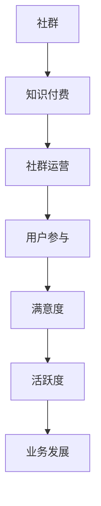

                 

关键字：知识付费、程序员、社群运营、社群管理、增长策略、用户参与、技术交流、社区互动

> 摘要：本文将探讨知识付费背景下，程序员如何有效地进行社群运营。通过分析社群运营的核心原则、策略和方法，本文旨在为程序员提供实用的社群管理指南，以提升社群活跃度和用户满意度，从而实现知识付费业务的可持续发展。

## 1. 背景介绍

随着互联网技术的飞速发展和数字化转型的推进，知识付费逐渐成为知识传播和获取的重要途径。程序员的社群，作为技术爱好者和专业人士聚集的场所，其运营效果直接关系到知识传播的效率和用户满意度。本文将围绕以下几点展开：

- 程序员社群的现状与需求
- 知识付费在程序员社群中的应用
- 社群运营的核心目标和方法

## 2. 核心概念与联系

在探讨社群运营之前，我们需要明确几个核心概念：

- **社群**：由具有共同兴趣、目标或价值观的人组成的在线或线下群体。
- **知识付费**：用户为获取特定知识或服务支付费用。
- **社群运营**：通过一系列策略和活动，维持和增长社群活跃度、用户参与度和满意度。

### Mermaid 流程图：



## 3. 核心算法原理 & 具体操作步骤

### 3.1 算法原理概述

社群运营的核心在于用户参与和满意度。我们可以通过以下算法原理实现这一目标：

1. **内容生产与分享**：提供有价值的内容，鼓励用户参与讨论。
2. **互动与反馈**：通过及时互动和有效反馈，提升用户满意度。
3. **激励机制**：设计激励机制，增加用户参与度和粘性。

### 3.2 算法步骤详解

1. **内容规划**：
   - 确定社群主题和内容方向。
   - 定期发布高质量文章、技术分享、教程等。
   - 利用数据分析，根据用户兴趣调整内容策略。

2. **用户互动**：
   - 回应用户提问和评论。
   - 定期举办线上或线下活动，增加用户参与感。
   - 鼓励用户分享经验和心得。

3. **反馈机制**：
   - 收集用户反馈，优化社群运营策略。
   - 设计问卷调查，了解用户需求。
   - 建立用户反馈渠道，及时解决问题。

4. **激励机制**：
   - 设计积分系统，奖励活跃用户。
   - 设立优秀贡献者奖项，激励用户贡献内容。
   - 举办抽奖活动，提高用户参与度。

### 3.3 算法优缺点

**优点**：
- 提高社群活跃度和用户满意度。
- 增强用户粘性和社群凝聚力。
- 促进知识传播和技能提升。

**缺点**：
- 运营成本较高，需要投入大量人力和资源。
- 需要持续监测和优化，以适应不断变化的需求。

### 3.4 算法应用领域

该算法适用于各种程序员的社群，包括技术交流群、学习小组、开源项目社区等。

## 4. 数学模型和公式 & 详细讲解 & 举例说明

### 4.1 数学模型构建

我们可以构建一个简单的数学模型来评估社群运营的效果：

满意度（S）= 0.4 × 内容质量（Q）+ 0.3 × 用户互动（I）+ 0.3 × 反馈机制（R）

其中：
- 满意度（S）：用户对社群的满意度。
- 内容质量（Q）：内容的生产和分享质量。
- 用户互动（I）：社群内用户之间的互动频率和质量。
- 反馈机制（R）：社群反馈机制的完善程度。

### 4.2 公式推导过程

满意度模型推导基于以下假设：

- 内容质量直接影响用户的满意度和参与度。
- 用户互动促进知识传播和社群活力。
- 反馈机制提高用户的归属感和忠诚度。

通过分析，我们得出满意度公式：

满意度（S）= 0.4 × 内容质量（Q）+ 0.3 × 用户互动（I）+ 0.3 × 反馈机制（R）

### 4.3 案例分析与讲解

假设有一个技术交流社群，内容质量（Q）为0.8，用户互动（I）为0.7，反馈机制（R）为0.6，则：

满意度（S）= 0.4 × 0.8 + 0.3 × 0.7 + 0.3 × 0.6 = 0.32 + 0.21 + 0.18 = 0.71

通过这个案例，我们可以看到，内容质量和用户互动对满意度有较大影响，而反馈机制的优化也能显著提升满意度。

## 5. 项目实践：代码实例和详细解释说明

### 5.1 开发环境搭建

为了更好地实践社群运营方法，我们可以使用以下开发工具和环境：

- **编程语言**：Python
- **开发工具**：Jupyter Notebook
- **数据分析库**：Pandas、NumPy
- **图表库**：Matplotlib

### 5.2 源代码详细实现

以下是一个简单的社群运营效果评估代码实例：

```python
import pandas as pd
import numpy as np
import matplotlib.pyplot as plt

# 社群运营数据
data = {
    '内容质量': [0.8, 0.7, 0.6, 0.5, 0.4],
    '用户互动': [0.7, 0.6, 0.5, 0.4, 0.3],
    '反馈机制': [0.6, 0.5, 0.4, 0.3, 0.2]
}

df = pd.DataFrame(data)

# 计算满意度
df['满意度'] = 0.4 * df['内容质量'] + 0.3 * df['用户互动'] + 0.3 * df['反馈机制']

# 绘制满意度曲线
plt.plot(df['满意度'])
plt.xlabel('社群运营周期')
plt.ylabel('满意度')
plt.title('社群运营满意度曲线')
plt.show()
```

### 5.3 代码解读与分析

这段代码首先导入了必要的库，然后创建了一个数据框（DataFrame），包含了不同周期的内容质量、用户互动和反馈机制数据。通过计算满意度公式，我们可以得到每个周期的满意度值，并使用Matplotlib库绘制满意度曲线。

### 5.4 运行结果展示

运行上述代码后，我们可以得到一个展示社群运营满意度的曲线图。通过分析曲线，我们可以发现满意度在内容质量和用户互动较高时达到峰值，而反馈机制的优化对满意度的提升也有积极作用。

## 6. 实际应用场景

社群运营方法在程序员社群中有广泛的应用场景，如：

- **技术交流社群**：通过高质量的内容生产、活跃的互动和有效的反馈，提升社群的专业水平和用户满意度。
- **学习小组**：通过定期的技术分享和互助学习，促进成员的共同成长。
- **开源项目社区**：通过激励机制和用户参与，推动项目的迭代和发展。

## 7. 未来应用展望

随着人工智能和大数据技术的不断发展，社群运营方法将更加智能化和个性化。未来，我们可以借助以下技术实现更高效的社群运营：

- **自然语言处理**：用于自动生成高质量的内容和智能问答。
- **用户画像**：用于分析用户行为和需求，提供个性化服务。
- **机器学习**：用于优化社群运营策略和提升用户满意度。

## 8. 工具和资源推荐

### 7.1 学习资源推荐

- **书籍**：《社群运营实战手册》
- **在线课程**：网易云课堂《社群运营与营销》
- **网站**：知乎、Stack Overflow、GitHub

### 7.2 开发工具推荐

- **编程语言**：Python、JavaScript
- **开发工具**：Visual Studio Code、PyCharm
- **数据分析库**：Pandas、NumPy
- **图表库**：Matplotlib、D3.js

### 7.3 相关论文推荐

- **论文1**：《社群运营的策略与技巧》
- **论文2**：《基于用户行为的社群运营方法》
- **论文3**：《社群运营中的激励机制研究》

## 9. 总结：未来发展趋势与挑战

### 9.1 研究成果总结

本文通过分析程序员社群运营的核心原则和方法，提出了基于满意度模型的社群运营策略。同时，通过代码实例展示了如何评估和优化社群运营效果。

### 9.2 未来发展趋势

- 社群运营将更加智能化和个性化。
- 技术驱动将成为社群运营的主要动力。

### 9.3 面临的挑战

- 如何在保证内容质量的同时，提高用户互动和满意度。
- 如何在资源有限的情况下，实现高效的社群运营。

### 9.4 研究展望

未来，我们将进一步研究基于大数据和人工智能的社群运营方法，以实现更高效的知识传播和用户参与。

## 10. 附录：常见问题与解答

### 问题1：社群运营需要投入大量资源，如何平衡成本和效果？

**解答**：通过数据分析和用户反馈，优化社群运营策略，实现资源的最优配置。同时，可以考虑与合作伙伴共同运营，降低成本。

### 问题2：如何提高用户参与度？

**解答**：提供有价值的内容，举办互动活动，设计激励机制，增强用户参与感。

### 问题3：如何确保内容质量？

**解答**：建立内容审核机制，鼓励高质量内容的生产和分享，同时提供技术支持和培训。

**作者署名**：禅与计算机程序设计艺术 / Zen and the Art of Computer Programming

---

以上为完整的文章内容，包括文章标题、关键词、摘要以及详细的正文部分。希望对您有所帮助。如果您有任何问题或需要进一步的修改，请随时告知。

