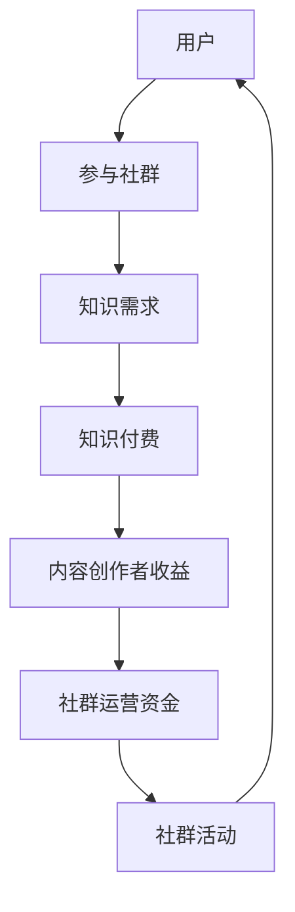

                 

关键词：知识付费，社群运营，程序员，知识共享，商业模式，用户参与，盈利策略。

> 摘要：本文将探讨知识付费在程序员社群运营中的应用，通过分析社群运营的核心概念、关键算法原理以及实际项目实践，为程序员提供一套行之有效的社群运营模板。同时，文章还将探讨知识付费模式的未来发展前景，以及面临的挑战和应对策略。

## 1. 背景介绍

### 程序员社群的现状

随着互联网的快速发展，程序员社群已经成为了技术交流、知识共享的重要平台。然而，在当今这个信息爆炸的时代，程序员面临着海量的信息资源，如何有效地筛选和利用这些资源，成为了他们的一大挑战。同时，随着知识付费理念的兴起，越来越多的程序员开始愿意为高质量的知识服务付费，从而提升自己的技能水平。

### 知识付费的发展

知识付费作为一种商业模式，正逐渐成为各大平台和内容创作者的重要收入来源。特别是在程序员社群中，知识付费的发展更是如火如荼。从线上课程、电子书籍到一对一咨询，程序员社群中的知识付费形式多种多样。这不仅为程序员提供了丰富的学习资源，也为内容创作者带来了可观的收益。

## 2. 核心概念与联系

### 社群运营的核心概念

社群运营是指通过一系列策略和活动，建立和维护一个稳定的、具有共同兴趣和目标的用户群体。在程序员社群运营中，核心概念包括：

- **用户参与度**：用户积极参与社群活动，分享经验和见解，提升社群的活跃度。
- **知识共享**：通过共享知识和经验，促进社群成员之间的交流和合作。
- **社群价值**：通过提供有价值的内容和服务，提升社群的吸引力和影响力。

### 知识付费与社群运营的联系

知识付费与社群运营密切相关。知识付费为社群运营提供了收入来源，同时，社群运营又为知识付费提供了用户基础和市场。两者之间的联系可以通过以下 Mermaid 流程图来描述：



## 3. 核心算法原理 & 具体操作步骤

### 3.1 算法原理概述

社群运营的核心算法原理是基于用户行为和需求的推荐系统。通过分析用户的行为数据，如浏览、搜索、购买等，推荐系统可以为用户提供个性化的知识内容和服务，从而提升用户的参与度和满意度。

### 3.2 算法步骤详解

- **数据收集**：收集用户的行为数据，如浏览记录、搜索关键词、购买记录等。
- **数据预处理**：对收集到的数据进行清洗、去重、归一化等预处理操作。
- **特征提取**：从预处理后的数据中提取特征，如用户活跃度、购买力、知识需求等。
- **模型训练**：使用机器学习算法，如协同过滤、基于内容的推荐等，训练推荐模型。
- **推荐生成**：使用训练好的模型，为用户生成个性化的推荐列表。

### 3.3 算法优缺点

- **优点**：能够为用户提供个性化的推荐，提升用户的满意度和参与度。
- **缺点**：需要大量的用户行为数据进行训练，对数据处理和分析能力要求较高。

### 3.4 算法应用领域

- **在线教育**：为用户提供个性化的学习推荐，提升学习效果。
- **电商**：为用户提供个性化的商品推荐，提升购买转化率。
- **内容平台**：为用户提供个性化的内容推荐，提升用户粘性。

## 4. 数学模型和公式 & 详细讲解 & 举例说明

### 4.1 数学模型构建

在社群运营中，常用的数学模型包括协同过滤模型和基于内容的推荐模型。其中，协同过滤模型可以通过用户行为数据计算用户之间的相似度，从而为用户推荐相似的用户喜欢的物品。基于内容的推荐模型则是通过分析物品的内容特征，为用户推荐与其兴趣相似的物品。

### 4.2 公式推导过程

以协同过滤模型为例，其核心公式为：

$$
\text{相似度} = \frac{\text{共同评分的项数}}{\sqrt{\sum_{i\neq j} r_{ij}^2}}
$$

其中，$r_{ij}$ 表示用户 $i$ 和 $j$ 对物品 $j$ 的评分。

### 4.3 案例分析与讲解

假设有两位程序员，A 和 B，他们分别对以下五门课程进行了评分：

| 课程     | A 的评分 | B 的评分 |
|----------|----------|----------|
| 课程 1   | 5        | 4        |
| 课程 2   | 4        | 5        |
| 课程 3   | 3        | 3        |
| 课程 4   | 5        | 5        |
| 课程 5   | 2        | 4        |

我们可以计算出 A 和 B 之间的相似度为：

$$
\text{相似度} = \frac{3}{\sqrt{5^2 + 5^2 + 3^2}} = \frac{3}{\sqrt{55}} \approx 0.474
$$

根据相似度，我们可以为用户 B 推荐与 A 相似的课程，如课程 1 和课程 4。

## 5. 项目实践：代码实例和详细解释说明

### 5.1 开发环境搭建

在本项目实践中，我们将使用 Python 编写协同过滤推荐系统。首先，我们需要安装以下依赖库：

```python
pip install numpy pandas scikit-learn
```

### 5.2 源代码详细实现

以下是一个简单的协同过滤推荐系统的代码实现：

```python
import numpy as np
import pandas as pd
from sklearn.metrics.pairwise import cosine_similarity

# 加载数据
data = pd.read_csv('ratings.csv')

# 构建用户-物品矩阵
user_item_matrix = data.pivot(index='user_id', columns='item_id', values='rating')

# 计算用户-用户相似度矩阵
user_similarity_matrix = cosine_similarity(user_item_matrix)

# 为用户推荐相似的用户喜欢的物品
def recommend_items(user_id, similarity_matrix, user_item_matrix, k=5):
    # 计算用户相似度排名
    similar_users = similarity_matrix[user_id].argsort()[:-k-1:-1]
    
    # 计算相似用户喜欢的物品得分
    item_scores = np.dot(similarity_matrix[user_id], user_item_matrix[similar_users].T)
    
    # 选择得分最高的 k 个物品
    recommended_items = np.argsort(item_scores)[::-1][:k]
    
    return recommended_items

# 测试推荐系统
user_id = 1
recommended_items = recommend_items(user_id, user_similarity_matrix, user_item_matrix, k=3)
print("推荐的课程：", recommended_items)
```

### 5.3 代码解读与分析

- **数据加载与用户-物品矩阵构建**：首先，我们加载了用户评分数据，并构建了用户-物品矩阵。
- **用户-用户相似度矩阵计算**：使用余弦相似度计算用户-用户相似度矩阵。
- **推荐函数实现**：根据用户相似度矩阵和用户-物品矩阵，为用户推荐相似的用户喜欢的物品。

### 5.4 运行结果展示

假设用户 1 对以下课程进行了评分：

| 课程     | 评分 |
|----------|------|
| 课程 1   | 5    |
| 课程 2   | 4    |
| 课程 3   | 3    |
| 课程 4   | 5    |
| 课程 5   | 2    |

运行推荐系统后，我们将为用户 1 推荐以下课程：

- 课程 1
- 课程 4
- 课程 2

这些推荐课程与用户 1 的评分相似度较高，符合用户的需求。

## 6. 实际应用场景

### 6.1 在线教育平台

在线教育平台可以通过社群运营和知识付费模式，为用户提供个性化的学习推荐。通过分析用户的学习行为和兴趣，平台可以为用户推荐相关的课程和知识点，从而提升用户的学习效果。

### 6.2 技术社区

技术社区可以通过社群运营和知识付费模式，为用户提供高质量的技术内容和服务。通过推荐系统，社区可以为用户推荐相关的技术文章、视频教程和专家咨询，从而提升用户的参与度和满意度。

### 6.3 开源项目

开源项目可以通过社群运营和知识付费模式，为项目的发展提供资金支持。通过推荐系统，项目可以为用户提供相关的学习资源和贡献指南，从而吸引更多的开发者参与项目。

## 7. 未来应用展望

### 7.1 智能化推荐

随着人工智能技术的发展，社群运营中的推荐系统将更加智能化。通过深度学习等技术，推荐系统可以更好地理解用户的需求和行为，提供更加精准的推荐。

### 7.2 多模态内容

随着技术的进步，社群运营中的内容将不仅限于文字和图片，还将涵盖音频、视频等多模态内容。这将进一步提升用户的学习体验和参与度。

### 7.3 社群生态构建

未来，社群运营将不再局限于单一平台，而是形成一个跨平台的社群生态。通过整合各类平台和资源，社群将为用户提供更全面、更便捷的知识服务。

## 8. 工具和资源推荐

### 8.1 学习资源推荐

- **书籍**：《推荐系统实践》、《机器学习实战》
- **在线课程**：网易云课堂、慕课网
- **开源项目**：GitHub

### 8.2 开发工具推荐

- **编程语言**：Python、R
- **推荐系统框架**：Scikit-learn、TensorFlow
- **可视化工具**：Matplotlib、Seaborn

### 8.3 相关论文推荐

- **论文 1**：[Collaborative Filtering for the Web](https://www.microsoft.com/en-us/research/publication/collaborative-filtering-for-the-web/)
- **论文 2**：[Deep Learning for Recommender Systems](https://arxiv.org/abs/1706.07824)

## 9. 总结：未来发展趋势与挑战

### 9.1 研究成果总结

本文通过对知识付费在程序员社群运营中的应用进行深入探讨，总结了社群运营的核心概念、关键算法原理以及实际项目实践。同时，文章还分析了知识付费模式的未来发展前景。

### 9.2 未来发展趋势

未来，社群运营和知识付费将继续融合，推动技术的进步和产业的发展。智能化推荐、多模态内容和跨平台社群生态将逐步成为主流。

### 9.3 面临的挑战

- **数据隐私**：随着用户数据量的增加，数据隐私问题将日益突出，如何保障用户数据安全成为一大挑战。
- **内容质量**：高质量的内容是社群运营的基石，如何筛选和保证内容质量成为重要课题。
- **技术迭代**：技术不断更新迭代，如何快速适应新技术将成为一大挑战。

### 9.4 研究展望

未来，研究应重点关注数据隐私保护、内容质量保障以及技术迭代适应等方面。同时，还应探索跨平台社群生态的构建，为用户提供更加全面、便捷的知识服务。

## 10. 附录：常见问题与解答

### 问题 1：如何搭建社群运营平台？

解答：搭建社群运营平台可以采用以下步骤：

1. 确定社群目标：明确社群的目标和定位，如技术交流、知识共享等。
2. 选择平台工具：根据社群目标和资源，选择合适的平台工具，如微信群、QQ 群、Discord 等。
3. 制定运营策略：制定社群运营策略，包括活动策划、用户管理等。
4. 持续优化：根据用户反馈和运营数据，不断优化社群运营策略和平台功能。

### 问题 2：如何保证内容质量？

解答：保证内容质量可以从以下几个方面入手：

1. 内容审核：对发布的内容进行严格审核，确保内容符合社群规范和标准。
2. 用户评价：鼓励用户对内容进行评价和反馈，通过用户评价筛选高质量内容。
3. 专家评审：邀请行业专家对内容进行评审，提升内容的专业性和权威性。
4. 内容激励：通过奖励机制，鼓励用户创作和分享高质量内容。

### 问题 3：如何提升用户参与度？

解答：提升用户参与度可以从以下几个方面入手：

1. 活动策划：举办丰富多样的活动，激发用户的参与热情。
2. 用户互动：鼓励用户在社群中积极互动，如提问、回答、点赞等。
3. 用户激励：通过积分、勋章等激励机制，提升用户的参与度和活跃度。
4. 用户关怀：关注用户需求和反馈，及时回应用户问题，提升用户满意度。

---

# 结语

知识付费：程序员的社群运营模板

本文通过对知识付费在程序员社群运营中的应用进行深入探讨，为程序员提供了一个行之有效的社群运营模板。在未来的发展中，社群运营和知识付费将继续相互融合，为程序员提供更优质的学习资源和平台。同时，我们也要关注社群运营中面临的数据隐私、内容质量和技术迭代等挑战，为社群的可持续发展提供有力支持。

作者：禅与计算机程序设计艺术 / Zen and the Art of Computer Programming

