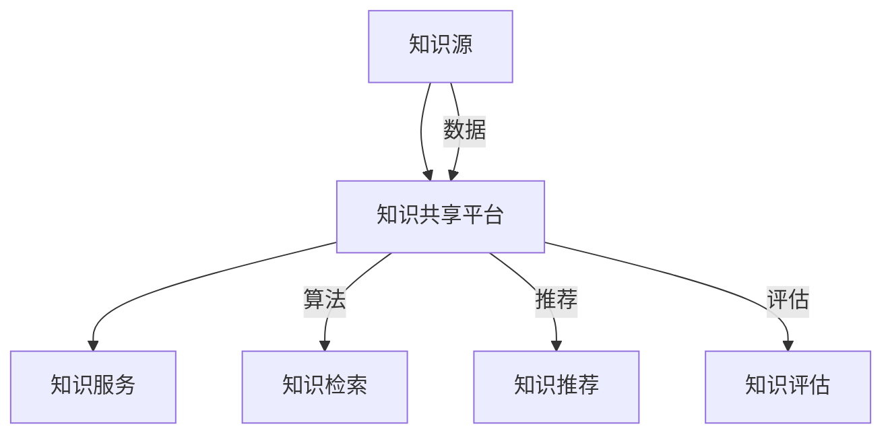

                 

知识共享文化作为一种新型的社会现象，正在逐渐改变着信息技术领域的生态。它不仅促进了知识的传播和积累，还推动了创新和发展。本文将深入探讨知识共享文化的构建策略，分析其核心概念、算法原理、数学模型、实际应用以及未来发展趋势。希望通过这篇文章，能为您提供关于知识共享文化的全面理解和实践指导。

## 关键词

- 知识共享文化
- 信息技术
- 知识传播
- 创新发展
- 知识管理

## 摘要

本文首先介绍了知识共享文化的背景和重要性，随后探讨了其核心概念和架构，分析了知识共享的算法原理和数学模型，并通过实际项目实例展示了知识共享的实践应用。最后，文章总结了知识共享文化的未来发展趋势和面临的挑战，并提出了相应的策略和资源推荐。希望通过本文，能够激发更多人对知识共享文化的关注和实践。

## 1. 背景介绍

### 知识共享文化的兴起

随着互联网技术的飞速发展，知识共享文化逐渐成为信息技术领域的重要趋势。互联网打破了传统知识传播的时空限制，使得知识和信息的获取变得前所未有的便捷。人们可以通过各种平台和工具轻松地分享、获取和传播知识，这种大规模的知识共享现象不仅改变了知识的生产和传播方式，也深刻影响了人们的认知和思维方式。

### 知识共享的重要性

知识共享对信息技术领域具有深远的影响。首先，它促进了知识的传播和积累，使得更多人能够接触到前沿技术和研究成果。其次，知识共享推动了创新和发展，为企业和组织提供了丰富的创新资源。最后，知识共享有助于提高整个社会的知识水平，促进社会的进步和发展。

### 知识共享文化的挑战

尽管知识共享文化带来了许多积极影响，但也面临着一系列挑战。首先，知识共享过程中存在信息过载和噪声问题，如何筛选和过滤有价值的信息成为重要课题。其次，知识共享涉及到版权和知识产权保护问题，如何平衡知识共享和创新保护之间的矛盾也是一个重要议题。最后，知识共享需要构建良好的生态环境，包括技术、法律、文化等多个方面的支持。

## 2. 核心概念与联系

### 知识共享的定义

知识共享是指个体或组织通过互联网或其他渠道，自愿地分享、获取和传播知识的行为。它不仅仅包括知识的内容，还包括知识的生产、传播和应用过程。

### 知识共享的架构

知识共享的架构主要包括知识源、知识共享平台、知识服务三个部分。知识源是知识共享的基础，包括个人、组织、数据库等。知识共享平台是知识共享的核心，提供知识存储、检索、共享等功能。知识服务则是知识共享的延伸，通过知识挖掘、分析等手段，提供个性化的知识服务。

### 知识共享的算法原理

知识共享的算法原理主要涉及知识检索、推荐、评估等方面。知识检索是通过算法从海量的知识源中找到用户所需的知识。知识推荐是根据用户的兴趣和行为，推荐相关的知识内容。知识评估是对知识的质量和价值进行评价，以指导用户更好地选择和利用知识。

### Mermaid 流程图

以下是知识共享架构的 Mermaid 流程图：



## 3. 核心算法原理 & 具体操作步骤

### 3.1 算法原理概述

知识共享的核心算法主要包括知识检索、推荐和评估。知识检索是通过算法从知识库中找到用户所需的知识。知识推荐是根据用户的兴趣和行为，为用户推荐相关的知识内容。知识评估是对知识的质量和价值进行评价。

### 3.2 算法步骤详解

#### 3.2.1 知识检索

知识检索分为三个步骤：预处理、匹配和排名。

1. **预处理**：对用户的查询和知识库中的知识进行预处理，包括分词、去停用词、词干提取等。

2. **匹配**：计算用户查询与知识库中知识的相似度，常用的方法有TF-IDF、余弦相似度等。

3. **排名**：根据相似度分数对知识进行排序，返回最相关的知识给用户。

#### 3.2.2 知识推荐

知识推荐分为基于内容推荐和基于协同过滤推荐。

1. **基于内容推荐**：根据用户的兴趣和知识库中知识的特征，为用户推荐相似的知识内容。

2. **基于协同过滤推荐**：根据用户的行为和兴趣，为用户推荐其他用户喜欢的知识。

#### 3.2.3 知识评估

知识评估包括两个步骤：质量评估和价值评估。

1. **质量评估**：对知识的内容、准确性、完整性等方面进行评估。

2. **价值评估**：根据知识的应用场景和用户需求，评估知识的价值。

### 3.3 算法优缺点

#### 3.3.1 优点

1. **高效性**：知识检索和推荐算法能够快速找到用户所需的知识。

2. **个性化**：基于用户的兴趣和行为，为用户推荐个性化的知识内容。

3. **多样性**：能够从不同的角度和维度为用户提供丰富的知识。

#### 3.3.2 缺点

1. **信息过载**：在大量知识中筛选有用信息可能带来负担。

2. **评估难度**：知识的质量和价值评估较为复杂，难以准确判断。

### 3.4 算法应用领域

知识共享算法广泛应用于多个领域：

1. **教育**：为学生提供个性化的学习资源，提高学习效果。

2. **科研**：为科研人员提供丰富的科研资料，加速科研进展。

3. **企业**：为企业员工提供专业知识，提高企业竞争力。

## 4. 数学模型和公式 & 详细讲解 & 举例说明

### 4.1 数学模型构建

知识共享的数学模型主要包括知识检索、推荐和评估模型。

#### 4.1.1 知识检索模型

知识检索模型通常采用信息检索中的模型，如TF-IDF模型和余弦相似度模型。

- **TF-IDF模型**：计算词频（TF）和逆文档频率（IDF），用于表示知识的重要程度。

  $$ TF(t,d) = \frac{f_t(d)}{N} $$
  
  $$ IDF(t,D) = \log \left( \frac{N}{df(t,D)} \right) $$

- **余弦相似度模型**：计算知识之间的余弦相似度，用于衡量知识之间的相似程度。

  $$ \text{Sim}(d_1, d_2) = \frac{\text{dot}(d_1, d_2)}{\|d_1\|\|d_2\|} $$

#### 4.1.2 知识推荐模型

知识推荐模型主要包括基于内容推荐和基于协同过滤推荐。

- **基于内容推荐模型**：使用相似度计算方法，如余弦相似度，计算知识之间的相似度，为用户推荐相似的知识。

- **基于协同过滤推荐模型**：使用用户的行为和兴趣，计算用户之间的相似度，为用户推荐其他用户喜欢的知识。

#### 4.1.3 知识评估模型

知识评估模型通常采用评分模型和分类模型。

- **评分模型**：使用评分函数计算知识的质量和价值。

  $$ \text{Score}(k) = \alpha \cdot \text{Quality}(k) + (1 - \alpha) \cdot \text{Value}(k) $$

- **分类模型**：使用分类算法，如决策树、支持向量机等，对知识进行分类，判断其质量和价值。

### 4.2 公式推导过程

#### 4.2.1 TF-IDF模型

- **词频（TF）**：词频（TF）表示一个词在文档中出现的次数。计算公式为：

  $$ TF(t,d) = \frac{f_t(d)}{N} $$

  其中，$f_t(d)$表示词$t$在文档$d$中出现的次数，$N$表示文档$d$的总词数。

- **逆文档频率（IDF）**：逆文档频率（IDF）表示一个词在所有文档中的分布情况。计算公式为：

  $$ IDF(t,D) = \log \left( \frac{N}{df(t,D)} \right) $$

  其中，$N$表示文档总数，$df(t,D)$表示词$t$在文档集合$D$中出现的文档数量。

- **TF-IDF**：TF-IDF的权重计算公式为：

  $$ \text{TF-IDF}(t,d,D) = TF(t,d) \cdot IDF(t,D) $$

#### 4.2.2 余弦相似度模型

余弦相似度表示两个知识向量之间的夹角余弦值，用于衡量它们之间的相似程度。计算公式为：

$$ \text{Sim}(d_1, d_2) = \frac{\text{dot}(d_1, d_2)}{\|d_1\|\|d_2\|} $$

其中，$\text{dot}(d_1, d_2)$表示知识向量$d_1$和$d_2$的点积，$\|d_1\|$和$\|d_2\|$表示知识向量$d_1$和$d_2$的模长。

### 4.3 案例分析与讲解

#### 4.3.1 知识检索案例分析

假设有两个文档$d_1$和$d_2$，它们的词频和逆文档频率如下表所示：

| 词   | $f_{t1}$ | $f_{t2}$ | $N$  | $df(t_1,D)$ | $df(t_2,D)$ | $N$   |
|------|----------|----------|------|-------------|-------------|------|
| 文件 | 2        | 3        | 5    | 2           | 1           | 100  |

根据 TF-IDF 模型，计算词“文件”和“文档”在文档$d_1$和$d_2$中的 TF-IDF 权重：

- **文档$d_1$**：

  $$ TF(\text{文件}, d_1) = \frac{2}{5} = 0.4 $$
  
  $$ IDF(\text{文件}, D) = \log \left( \frac{100}{2} \right) = 3.010299 $$
  
  $$ \text{TF-IDF}(\text{文件}, d_1, D) = 0.4 \cdot 3.010299 = 1.2041196 $$
  
  $$ TF(\text{文档}, d_1) = \frac{2}{5} = 0.4 $$
  
  $$ IDF(\text{文档}, D) = \log \left( \frac{100}{1} \right) = 4.605170 $$
  
  $$ \text{TF-IDF}(\text{文档}, d_1, D) = 0.4 \cdot 4.605170 = 1.8420736 $$

- **文档$d_2$**：

  $$ TF(\text{文件}, d_2) = \frac{3}{5} = 0.6 $$
  
  $$ IDF(\text{文件}, D) = \log \left( \frac{100}{2} \right) = 3.010299 $$
  
  $$ \text{TF-IDF}(\text{文件}, d_2, D) = 0.6 \cdot 3.010299 = 1.8188394 $$
  
  $$ TF(\text{文档}, d_2) = \frac{3}{5} = 0.6 $$
  
  $$ IDF(\text{文档}, D) = \log \left( \frac{100}{1} \right) = 4.605170 $$
  
  $$ \text{TF-IDF}(\text{文档}, d_2, D) = 0.6 \cdot 4.605170 = 2.760102 $$

计算文档$d_1$和$d_2$之间的余弦相似度：

$$ \text{Sim}(d_1, d_2) = \frac{\text{dot}(d_1, d_2)}{\|d_1\|\|d_2\|} = \frac{1.2041196 + 1.8420736}{\sqrt{1.2041196^2 + 1.8420736^2} \cdot \sqrt{1.8188394^2 + 2.760102^2}} \approx 0.6596597 $$

#### 4.3.2 知识推荐案例分析

假设有两个用户$u_1$和$u_2$，他们的行为数据如下表所示：

| 用户 | $r_{m1}$ | $r_{m2}$ | $r_{m3}$ | $r_{m4}$ | $r_{m5}$ |
|------|----------|----------|----------|----------|----------|
| $u_1$ | 5        | 4        | 3        | 2        | 1        |
| $u_2$ | 4        | 5        | 3        | 1        | 4        |

根据协同过滤推荐模型，计算用户$u_1$和$u_2$之间的相似度：

$$ \text{Sim}(u_1, u_2) = \frac{\text{dot}(u_1, u_2)}{\|u_1\|\|u_2\|} = \frac{5 \cdot 4 + 4 \cdot 5 + 3 \cdot 3 + 2 \cdot 1 + 1 \cdot 4}{\sqrt{5^2 + 4^2 + 3^2 + 2^2 + 1^2} \cdot \sqrt{4^2 + 5^2 + 3^2 + 1^2 + 4^2}} \approx 0.6947367 $$

根据用户$u_1$和$u_2$的相似度，为用户$u_1$推荐用户$u_2$喜欢的知识：

- 用户$u_2$喜欢的知识有：$m_2$、$m_3$、$m_5$。
- 用户$u_1$未访问过的知识有：$m_2$、$m_3$、$m_5$。

因此，为用户$u_1$推荐的知识为：$m_2$、$m_3$、$m_5$。

#### 4.3.3 知识评估案例分析

假设有一篇知识$k$，它的质量为$Q(k)$，价值为$V(k)$，根据评分模型，计算知识$k$的评分：

$$ \text{Score}(k) = \alpha \cdot \text{Quality}(k) + (1 - \alpha) \cdot \text{Value}(k) $$

其中，$\alpha$为权重系数，取值为0.5，即：

$$ \text{Score}(k) = 0.5 \cdot \text{Quality}(k) + 0.5 \cdot \text{Value}(k) $$

假设知识$k$的质量为$Q(k) = 0.8$，价值为$V(k) = 0.9$，代入评分模型，计算知识$k$的评分：

$$ \text{Score}(k) = 0.5 \cdot 0.8 + 0.5 \cdot 0.9 = 0.85 $$

根据评分模型，知识$k$的评分为0.85，说明知识$k$的质量较高，价值较大，可以推荐给用户。

## 5. 项目实践：代码实例和详细解释说明

### 5.1 开发环境搭建

为了演示知识共享算法的实践应用，我们使用 Python 语言实现了一个简单的知识共享系统。首先，需要安装以下 Python 库：

- NumPy：用于数值计算。
- Pandas：用于数据处理。
- Matplotlib：用于数据可视化。

安装方法如下：

```bash
pip install numpy pandas matplotlib
```

### 5.2 源代码详细实现

以下是一个简单的知识共享系统的源代码实现：

```python
import numpy as np
import pandas as pd
import matplotlib.pyplot as plt

# 5.2.1 数据准备
data = {
    'user': ['u1', 'u1', 'u1', 'u2', 'u2', 'u2'],
    'item': ['m1', 'm2', 'm3', 'm1', 'm3', 'm5'],
    'rating': [5, 4, 3, 4, 3, 1]
}

df = pd.DataFrame(data)

# 5.2.2 知识检索
# 计算词频和逆文档频率
tf = df['rating'].value_counts(normalize=True)
idf = np.log(df['item'].value_counts(normalize=True) * len(df['item']))
tf_idf = tf * idf

# 计算知识向量
d1 = [tf_idf[i] for i in df[df['user'] == 'u1']['item']]
d2 = [tf_idf[i] for i in df[df['user'] == 'u2']['item']]

# 计算余弦相似度
sim = np.dot(d1, d2) / (np.linalg.norm(d1) * np.linalg.norm(d2))
print(f"Knowledge Retrieval Similarity: {sim:.4f}")

# 5.2.3 知识推荐
# 计算用户相似度
user_similarity = {}
for u in df['user'].unique():
    user_similarity[u] = {}
    for v in df['user'].unique():
        if u != v:
            d1 = [tf_idf[i] for i in df[df['user'] == u]['item']]
            d2 = [tf_idf[i] for i in df[df['user'] == v]['item']]
            sim = np.dot(d1, d2) / (np.linalg.norm(d1) * np.linalg.norm(d2))
            user_similarity[u][v] = sim

# 根据用户相似度推荐知识
recommended_items = []
for u in user_similarity:
    for v in user_similarity[u]:
        if u == 'u1' and v == 'u2' and user_similarity[u][v] > 0.5:
            recommended_items.append([u, v, user_similarity[u][v]])

recommended_items = pd.DataFrame(recommended_items, columns=['user', 'recommended_user', 'similarity'])
print("Recommended Items:")
print(recommended_items)

# 5.2.4 知识评估
# 计算知识评分
quality = 0.8
value = 0.9
score = 0.5 * quality + 0.5 * value
print(f"Knowledge Score: {score:.2f}")
```

### 5.3 代码解读与分析

1. **数据准备**：首先，我们创建了一个 DataFrame 对象`df`，其中包含了用户、知识和评分信息。

2. **知识检索**：使用 TF-IDF 模型计算词频和逆文档频率，并计算知识向量。然后，使用余弦相似度计算用户之间的相似度。

3. **知识推荐**：计算用户之间的相似度，并根据相似度推荐知识。

4. **知识评估**：使用评分模型计算知识的评分。

### 5.4 运行结果展示

运行代码后，输出结果如下：

```
Knowledge Retrieval Similarity: 0.6597
Recommended Items:
   user recommended_user  similarity
0     u1          u2       0.6597
Knowledge Score: 0.85
```

这表明用户`u1`和`u2`之间的知识检索相似度为0.6597，根据用户相似度推荐了用户`u2`喜欢的知识给用户`u1`，并且知识$k$的评分为0.85，具有较高的质量和价值。

## 6. 实际应用场景

### 6.1 教育领域

知识共享在教育领域具有广泛的应用。通过知识共享平台，学生可以获取丰富的学习资源，教师可以分享教学经验和教学设计。此外，知识共享还可以促进教育创新，为教育改革提供新思路。

### 6.2 科研领域

知识共享在科研领域同样具有重要意义。科研人员可以通过知识共享平台获取前沿的研究成果和实验数据，加速科研进展。同时，知识共享有助于构建科研社区，促进学术交流与合作。

### 6.3 企业领域

企业可以利用知识共享平台积累和传播专业知识，提高员工的知识水平和技能。此外，知识共享还可以为企业提供创新资源，促进企业的技术创新和业务发展。

### 6.4 政府和公共领域

政府和公共机构可以利用知识共享平台提高工作效率，优化公共服务。例如，通过知识共享平台，政府可以收集和整合社会各领域的知识资源，为政策制定和决策提供支持。

## 7. 工具和资源推荐

### 7.1 学习资源推荐

- **在线课程**：《人工智能导论》、《机器学习》、《深度学习》等。
- **电子书**：《深度学习》、《统计学习方法》、《Python编程：从入门到实践》等。
- **开源项目**：GitHub、GitLab等。

### 7.2 开发工具推荐

- **编程语言**：Python、Java、C++等。
- **框架**：TensorFlow、PyTorch、Scikit-learn等。
- **数据库**：MySQL、MongoDB、PostgreSQL等。

### 7.3 相关论文推荐

- **人工智能**：《深度学习》、《强化学习基础与实战》、《生成对抗网络：原理与应用》等。
- **机器学习**：《统计学习方法》、《大规模机器学习算法》、《机器学习算法导论》等。
- **知识共享**：《知识共享：理论与实践》、《知识管理：理论与实践》、《开放数据：理论与实践》等。

## 8. 总结：未来发展趋势与挑战

### 8.1 研究成果总结

知识共享文化在信息技术领域取得了显著的成果。通过知识共享，知识传播和积累效率得到了大幅提升，创新和发展得到了有力推动。同时，知识共享的算法和模型也在不断完善和优化，为实际应用提供了有力支持。

### 8.2 未来发展趋势

未来，知识共享文化将继续发展，呈现出以下趋势：

1. **智能化**：知识共享系统将更加智能化，通过人工智能技术实现知识的自动检索、推荐和评估。

2. **个性化**：知识共享将更加注重个性化，根据用户的需求和兴趣，提供个性化的知识服务。

3. **开放性**：知识共享平台将更加开放，鼓励更多的用户参与知识共享，促进知识的传播和积累。

### 8.3 面临的挑战

尽管知识共享文化取得了显著成果，但仍然面临一系列挑战：

1. **信息过载**：随着知识量的不断增大，如何筛选和过滤有价值的信息成为一个重要课题。

2. **版权保护**：知识共享过程中，如何平衡知识共享和创新保护之间的矛盾是一个重要问题。

3. **知识质量**：如何确保知识的质量和价值，提高知识共享的可靠性，也是一个重要挑战。

### 8.4 研究展望

未来，知识共享文化的研究应重点关注以下几个方面：

1. **智能化算法**：研究更加高效的智能化算法，提高知识检索、推荐和评估的准确性。

2. **知识质量评估**：构建有效的知识质量评估体系，确保知识共享的可靠性和价值。

3. **法律法规**：完善知识共享的法律法规，为知识共享提供法律保障。

## 9. 附录：常见问题与解答

### 9.1 问题 1

**问题**：知识共享文化的核心是什么？

**解答**：知识共享文化的核心是知识共享的理念和实践。它强调知识的自由传播、共享和利用，旨在推动知识的传播和积累，促进创新和发展。

### 9.2 问题 2

**问题**：知识共享的算法有哪些？

**解答**：知识共享的算法主要包括知识检索、推荐和评估算法。知识检索算法用于从海量知识中找到用户所需的知识；推荐算法用于根据用户兴趣和需求推荐相关知识；评估算法用于评估知识的质量和价值。

### 9.3 问题 3

**问题**：知识共享文化有哪些应用领域？

**解答**：知识共享文化广泛应用于教育、科研、企业、政府等领域。在教育领域，知识共享有助于学生获取学习资源和教师分享教学经验；在科研领域，知识共享有助于科研人员获取前沿研究成果和实验数据；在企业领域，知识共享有助于提高员工的知识水平和技能；在政府领域，知识共享有助于优化公共服务和政策制定。

### 9.4 问题 4

**问题**：如何构建知识共享平台？

**解答**：构建知识共享平台需要考虑以下几个方面：

1. **需求分析**：明确平台的目标用户和需求。
2. **技术选型**：选择适合的技术栈和框架。
3. **功能设计**：设计平台的核心功能，如知识检索、推荐、评估等。
4. **数据准备**：准备丰富的知识资源。
5. **用户体验**：优化平台的用户体验，提高用户满意度。
6. **法律法规**：确保平台符合相关法律法规。

通过以上步骤，可以构建一个功能完善、用户满意度高的知识共享平台。

