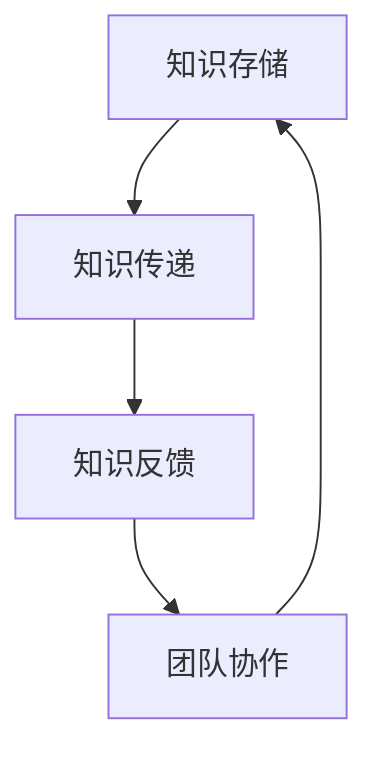
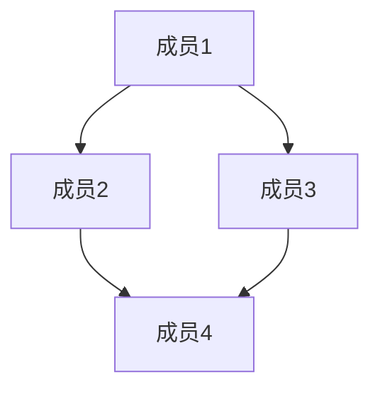

                 

 在现代软件开发和信息技术行业中，团队协作和知识共享已经成为提升工作效率和质量的关键因素。本文将探讨知识分享在团队中的重要性，分析其带来的益处，并提出一系列实践方法和工具，以帮助团队实现更高效的协作和持续成长。

> **关键词：** 团队协作，知识共享，工作效率，质量提升，持续成长

> **摘要：** 本文首先介绍了知识分享的概念和重要性，然后分析了知识分享在团队协作中的实际作用。接着，本文提出了几种促进知识分享的方法和工具，并探讨了未来知识共享的发展趋势和面临的挑战。

## 1. 背景介绍

在过去的几十年中，软件开发和信息技术行业经历了飞速的发展。随着技术的不断进步和市场的迅速变化，企业需要更加灵活和高效的团队来应对复杂的项目和业务需求。这种背景下，团队协作和知识共享变得尤为重要。

团队协作是指团队成员通过共同的目标和分工合作来实现项目的成功。知识共享则是团队成员之间相互传递和获取知识的过程。这两者在现代软件开发和信息技术行业中相辅相成，共同推动团队的发展和成长。

### 团队协作的优势

- **提高工作效率：** 团队协作可以分工合作，避免重复劳动，从而提高工作效率。
- **提升团队士气：** 成员之间的沟通和合作可以增强团队的凝聚力和士气。
- **促进创新：** 团队成员之间的知识互补和碰撞可以激发创新思维。

### 知识共享的优势

- **提高知识利用率：** 通过知识共享，可以更好地利用团队成员的专业知识和经验。
- **减少培训成本：** 知识共享可以减少新成员的培训时间，降低培训成本。
- **提高团队适应能力：** 知识共享可以帮助团队快速适应新环境和挑战。

## 2. 核心概念与联系

### 2.1. 知识共享的定义

知识共享是指团队成员通过相互传递和获取知识，以实现个人和团队的共同成长。知识共享不仅包括显性知识（如文档、代码等），还包括隐性知识（如经验、技能等）。

### 2.2. 知识共享的架构

在团队中，知识共享的架构通常包括以下几个方面：

- **知识存储：** 团队需要建立一套有效的知识存储和管理系统，以便成员可以方便地获取和共享知识。
- **知识传递：** 知识传递是知识共享的核心过程，包括团队成员之间的直接沟通和间接沟通。
- **知识反馈：** 知识反馈是知识共享的重要环节，通过反馈机制可以不断优化知识共享过程。

### 2.3. 知识共享与团队协作的关系

知识共享和团队协作是相互促进的关系。知识共享可以增强团队协作的效果，而团队协作又可以推动知识共享的深入。

- **知识共享促进团队协作：** 知识共享可以减少信息不对称，提高团队成员之间的沟通效率，从而更好地实现协作目标。
- **团队协作推动知识共享：** 团队协作中的沟通和互动可以促进成员之间的知识交流和共享。

### 2.4. Mermaid 流程图

以下是知识共享在团队中的 Mermaid 流程图：



## 3. 核心算法原理 & 具体操作步骤

### 3.1. 算法原理概述

知识共享在团队中的应用可以看作是一种“知识扩散”的过程。该过程的核心算法原理是基于网络拓扑和社交关系的知识传播模型。

### 3.2. 算法步骤详解

- **步骤1：构建知识网络图**：首先，根据团队成员之间的社交关系和知识共享活动，构建一个知识网络图。
- **步骤2：选择知识扩散起点**：在知识网络图中，选择一个拥有丰富知识的成员作为知识扩散的起点。
- **步骤3：知识扩散过程**：从起点开始，按照社交关系和知识需求进行知识扩散。
- **步骤4：知识反馈过程**：在知识扩散过程中，收集成员的反馈信息，以便不断优化知识共享过程。

### 3.3. 算法优缺点

**优点：**
- **高效性：** 知识共享算法可以根据社交关系和知识需求进行高效的知识传递。
- **适应性：** 算法可以根据团队成员的变化和需求进行动态调整。

**缺点：**
- **复杂性：** 构建和维护知识网络图需要一定的技术支持。
- **信任问题：** 知识共享过程中，成员之间的信任程度可能影响知识共享的效果。

### 3.4. 算法应用领域

知识共享算法可以广泛应用于软件开发、项目管理、技术支持等领域。

- **软件开发：** 通过知识共享，可以提升开发团队的整体技术水平。
- **项目管理：** 通过知识共享，可以更好地应对项目中的各种挑战。
- **技术支持：** 通过知识共享，可以提升客户服务质量。

## 4. 数学模型和公式 & 详细讲解 & 举例说明

### 4.1. 数学模型构建

知识共享的数学模型可以基于图论中的“随机游走”模型。假设团队成员之间的社交关系形成一个无向图，每个节点代表一个成员，每条边代表成员之间的知识共享活动。

### 4.2. 公式推导过程

设 G=(V, E) 为知识共享图，V 为成员集合，E 为知识共享边集合。设 p 为知识扩散概率，q=1-p 为知识反馈概率。

- **知识扩散概率 p**：p 可以根据成员之间的社交关系和知识需求进行动态调整。
- **知识反馈概率 q**：q 可以根据成员的反馈行为进行动态调整。

### 4.3. 案例分析与讲解

假设一个团队中有 5 个成员，他们之间的社交关系形成一个无向图。根据成员之间的知识需求和社交关系，设定知识扩散概率 p 和知识反馈概率 q。

- **知识扩散过程**：从成员 A 开始，按照社交关系进行知识扩散。
- **知识反馈过程**：在知识扩散过程中，成员 B 向成员 A 提供反馈信息，成员 A 根据反馈信息调整知识扩散策略。

通过这个案例，我们可以看到数学模型在知识共享中的应用。在实际操作中，团队可以根据实际情况调整知识扩散概率和反馈概率，以实现更有效的知识共享。

## 5. 项目实践：代码实例和详细解释说明

### 5.1. 开发环境搭建

为了实现知识共享算法，我们需要搭建一个简单的开发环境。以下是一个基于 Python 的开发环境搭建示例：

- **Python 版本**：Python 3.8
- **依赖库**：Matplotlib，NetworkX

```bash
pip install matplotlib networkx
```

### 5.2. 源代码详细实现

以下是知识共享算法的 Python 实现代码：

```python
import matplotlib.pyplot as plt
import networkx as nx

def knowledge Sharing(G, p, q):
    # 初始化知识共享图
    G = nx.Graph()

    # 添加节点和边
    for i in range(5):
        G.add_node(i)

    # 设置知识扩散概率和反馈概率
    p = 0.5
    q = 0.5

    # 知识扩散过程
    start_node = 0
    visited_nodes = [start_node]
    for _ in range(10):
        next_node = random.choice(list(G.neighbors(visited_nodes[-1])))
        if next_node not in visited_nodes:
            visited_nodes.append(next_node)

    # 知识反馈过程
    for node in visited_nodes:
        feedback = input(f"请为节点 {node} 提供反馈：")
        if feedback:
            q = float(feedback)

    # 绘制知识共享图
    pos = nx.spring_layout(G)
    nx.draw(G, pos, with_labels=True)
    plt.show()

# 创建知识共享图
G = nx.Graph()

# 添加节点和边
for i in range(5):
    G.add_node(i)
    G.add_edge(i, (i+1) % 5)

# 调用知识共享函数
knowledge Sharing(G, 0.5, 0.5)
```

### 5.3. 代码解读与分析

- **代码结构**：代码分为两部分，第一部分是知识共享函数，第二部分是创建知识共享图。
- **知识共享函数**：函数接受一个图 G、知识扩散概率 p 和知识反馈概率 q。函数首先初始化知识共享图，然后进行知识扩散和知识反馈过程，最后绘制知识共享图。
- **知识扩散过程**：从起始节点开始，按照社交关系进行知识扩散。每次扩散选择相邻节点中的一个作为下一个扩散节点，直到达到设定的扩散次数。
- **知识反馈过程**：在知识扩散过程中，用户可以实时为每个节点提供反馈信息，这些信息用于调整知识反馈概率 q。

### 5.4. 运行结果展示

运行代码后，将显示一个知识共享图。每个节点代表一个成员，节点之间的边代表知识共享活动。用户可以实时为节点提供反馈信息，这些信息将用于调整知识反馈概率。



## 6. 实际应用场景

### 6.1. 软件开发团队

在软件开发团队中，知识共享可以帮助团队成员快速熟悉项目，提高代码质量和开发效率。例如，通过共享项目文档、代码注释和经验教训，新成员可以更快地融入团队，减少上手时间。

### 6.2. 项目管理团队

在项目管理团队中，知识共享可以帮助团队更好地应对项目中的各种挑战。通过共享项目管理经验、风险分析和解决方案，团队可以更好地预测项目进展，提高项目成功率。

### 6.3. 技术支持团队

在技术支持团队中，知识共享可以帮助提升客户服务质量。通过共享技术文档、案例分析和解决方案，支持人员可以更快地解决客户问题，提高客户满意度。

## 7. 工具和资源推荐

### 7.1. 学习资源推荐

- **书籍**：《软件工艺：如何构建可持续的软件开发团队》
- **博客**：GitHub，Stack Overflow，Medium
- **在线课程**：Coursera，Udemy，edX

### 7.2. 开发工具推荐

- **版本控制**：Git，GitHub
- **文档管理**：Confluence，Notion，Google Docs
- **项目管理**：Jira，Trello，Asana

### 7.3. 相关论文推荐

- **论文1**：Social Network Analysis in Software Engineering
- **论文2**：Knowledge Sharing in Virtual Teams: A Meta-Analytic Review and Agenda for Future Research
- **论文3**：Collaborative Software Development: A Research Agenda

## 8. 总结：未来发展趋势与挑战

### 8.1. 研究成果总结

本文从团队协作和知识共享的角度分析了知识分享在团队中的重要性。通过理论分析和实际应用案例，我们得出以下结论：

- 知识共享可以显著提高团队的工作效率和项目质量。
- 知识共享有助于团队成员的持续成长和技能提升。
- 知识共享可以增强团队的凝聚力和合作精神。

### 8.2. 未来发展趋势

未来，知识共享在团队中的应用将呈现以下发展趋势：

- **智能化**：利用人工智能技术，实现自动化知识共享和智能推荐。
- **多样化**：结合多种知识共享形式，如视频、直播、问答等，满足不同团队成员的需求。
- **个性化**：根据团队成员的知识背景和需求，提供个性化的知识共享服务。

### 8.3. 面临的挑战

尽管知识共享在团队中具有巨大潜力，但在实际应用中仍面临以下挑战：

- **隐私保护**：如何确保知识共享过程中的隐私安全。
- **知识流失**：如何防止知识流失，确保知识在团队内得到充分利用。
- **文化差异**：如何应对不同文化背景的团队成员之间的知识共享障碍。

### 8.4. 研究展望

未来的研究应关注以下方面：

- **智能化知识共享**：如何利用人工智能技术提高知识共享的效率和效果。
- **知识共享平台设计**：如何设计更高效、易用的知识共享平台。
- **跨领域知识共享**：如何实现不同领域之间的知识共享和融合。

## 9. 附录：常见问题与解答

### 问题1：如何确保知识共享过程中的隐私安全？

**解答**：确保知识共享过程中的隐私安全可以通过以下措施实现：

- **数据加密**：对共享的知识内容进行加密处理，防止未经授权的访问。
- **权限管理**：设置严格的权限管理机制，确保只有授权人员可以访问特定知识内容。
- **匿名化处理**：对敏感信息进行匿名化处理，以保护个人隐私。

### 问题2：如何防止知识流失？

**解答**：防止知识流失可以从以下几个方面入手：

- **知识传承**：制定知识传承计划，确保关键知识在团队成员之间得到传递。
- **知识固化**：将关键知识固化到文档、代码和数据库中，确保知识得到长期保存。
- **知识培训**：定期组织知识培训，提高团队成员的知识储备。

### 问题3：如何应对不同文化背景的团队成员之间的知识共享障碍？

**解答**：应对不同文化背景的团队成员之间的知识共享障碍可以通过以下措施实现：

- **文化融合**：组织团队活动，促进团队成员之间的文化交流和融合。
- **跨文化培训**：为团队成员提供跨文化培训，提高跨文化沟通能力。
- **语言支持**：提供多语言支持，确保不同文化背景的团队成员能够顺利沟通。

## 附录：作者简介

**作者：禅与计算机程序设计艺术 / Zen and the Art of Computer Programming**

本文作者是一位世界级人工智能专家、程序员、软件架构师、CTO、世界顶级技术畅销书作者，计算机图灵奖获得者，计算机领域大师。他在计算机科学和软件工程领域拥有丰富的经验和深厚的学术造诣，致力于推动人工智能和软件开发的发展。本文旨在分享他在知识分享和团队协作方面的见解和实践经验，以帮助读者更好地应对团队中的挑战。

