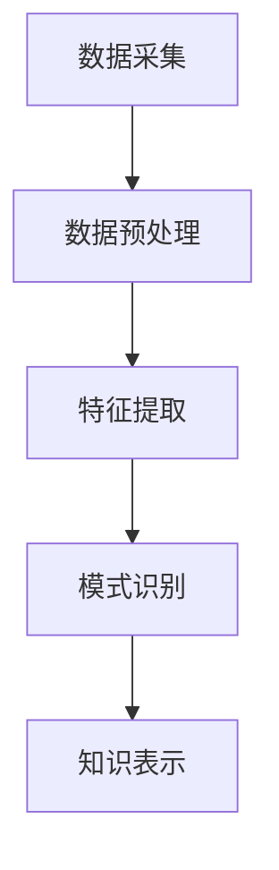

                 

知识发现是一个多层次、多维度的过程，它涵盖了从数据采集、数据预处理、特征提取到模型训练和结果解释的各个环节。在这个充满无限可能性的时代，我们正站在数据科学、机器学习和人工智能的交叉路口，探索如何更有效地从海量数据中挖掘出有价值的信息。本文将带领读者踏上这场知识发现之旅，一同探索未知、发现新知识。

## 关键词
- 知识发现
- 数据挖掘
- 特征提取
- 机器学习
- 数据可视化
- 知识图谱

## 摘要
本文旨在探讨知识发现的过程及其在各领域的应用。通过详细解析知识发现的核心概念、算法原理、数学模型以及项目实践，读者将了解如何从数据中提取有价值的信息，并掌握在实际应用中运用这些知识的方法和技巧。同时，文章还将对未来知识发现技术的发展趋势和面临的挑战进行展望，以期为读者提供全方位的指导。

## 1. 背景介绍
知识发现（Knowledge Discovery in Databases，简称KDD）是数据挖掘（Data Mining）的高级阶段，旨在从大量数据中发现有价值的模式或知识。随着互联网和大数据技术的迅猛发展，数据已成为一种新的资源，如何从中提取有价值的信息成为了一个重要课题。

### 1.1 数据爆炸与知识稀缺
随着物联网、社交媒体和云计算的普及，数据量呈指数级增长。据统计，全球每天产生的数据量已超过2.5万亿GB，其中大部分是未经过处理和利用的“暗数据”。如何在海量数据中发现有价值的信息，已成为企业和研究者面临的一个巨大挑战。

### 1.2 知识发现的必要性
知识发现具有重要的实际应用价值，如金融领域的风险控制、医疗领域的疾病预测、商业领域的市场分析等。通过知识发现，企业可以更好地了解市场需求，优化产品和服务，提高竞争力。同时，知识发现也为科学研究和学术探索提供了新的方法和工具。

### 1.3 知识发现的发展历程
知识发现作为一个研究领域，起源于20世纪80年代。随着计算机技术和数据库技术的不断发展，知识发现逐渐形成了自己的研究体系，涵盖了数据预处理、特征提取、模式识别、知识表示等多个方面。近年来，随着深度学习和大数据技术的崛起，知识发现也迎来了新的发展机遇。

## 2. 核心概念与联系
知识发现的过程可以概括为以下几个步骤：数据采集、数据预处理、特征提取、模式识别和知识表示。

### 2.1 数据采集
数据采集是知识发现的基础，涉及从各种来源收集数据，包括数据库、网络、传感器等。数据采集的关键在于如何有效地获取高质量的数据，以满足后续分析的需求。

### 2.2 数据预处理
数据预处理是数据挖掘中的关键步骤，主要包括数据清洗、数据集成、数据变换和数据归一化等。通过数据预处理，可以消除数据中的噪声和异常，提高数据的可靠性和一致性。

### 2.3 特征提取
特征提取是从原始数据中提取出对目标问题有代表性的属性或特征，以简化数据结构，提高模型性能。特征提取的核心在于如何选择合适的特征，以及如何通过特征组合来提高模型的泛化能力。

### 2.4 模式识别
模式识别是知识发现的核心环节，旨在从预处理后的数据中识别出有意义的模式或规律。常见的模式识别方法包括聚类、分类、关联规则挖掘等。

### 2.5 知识表示
知识表示是将识别出的模式或知识以某种形式进行表达和存储，以供后续分析和利用。知识表示的方法包括规则表示、网络表示、表格表示等。

### 2.6 Mermaid 流程图

## 3. 核心算法原理 & 具体操作步骤
### 3.1 算法原理概述
知识发现涉及多种算法，每种算法都有其特定的原理和应用场景。以下介绍几种常见算法的原理：

### 3.2 算法步骤详解
1. **数据采集**：通过数据库查询、网络爬虫、传感器等方式获取数据。
2. **数据预处理**：进行数据清洗、数据集成、数据变换和数据归一化。
3. **特征提取**：选择和组合特征，以简化数据结构，提高模型性能。
4. **模式识别**：使用聚类、分类、关联规则挖掘等方法识别数据中的模式。
5. **知识表示**：将识别出的模式或知识以规则、网络、表格等形式进行表达和存储。

### 3.3 算法优缺点
- **聚类算法**：优点是能够自动发现数据的结构和模式，但缺点是可能产生簇内噪声，对初始聚类中心敏感。
- **分类算法**：优点是能够精确地预测新数据，但缺点是训练过程可能非常耗时，对训练数据的依赖性较大。
- **关联规则挖掘算法**：优点是能够发现数据之间的关联关系，但缺点是规则数量可能非常庞大，需要进一步筛选。

### 3.4 算法应用领域
- **金融领域**：用于信用评估、风险控制、投资分析等。
- **医疗领域**：用于疾病预测、诊断、治疗建议等。
- **商业领域**：用于市场分析、客户行为分析、供应链优化等。

## 4. 数学模型和公式 & 详细讲解 & 举例说明
### 4.1 数学模型构建
知识发现中的数学模型通常包括特征提取模型、模式识别模型和知识表示模型。以下是一个简单的特征提取模型的构建过程：

假设我们有一组数据$$X=\{x_1, x_2, ..., x_n\}$$，其中每个数据点$$x_i$$是一个多维向量$$x_i=\{x_{i1}, x_{i2}, ..., x_{id}\}$$，表示第$$i$$个样本的$$d$$个特征。

我们希望选择一组特征$$F=\{f_1, f_2, ..., f_m\}$$，使得$$F$$能够有效地表示原始数据。一个简单的特征提取模型可以使用主成分分析（PCA）：

$$
z_i = \sum_{j=1}^m w_{ij} x_{ij}
$$

其中$$w_{ij}$$是特征$$f_j$$的权重。

### 4.2 公式推导过程
以PCA为例，我们首先需要计算数据$$X$$的协方差矩阵：

$$
S = \frac{1}{n-1}XX^T
$$

然后计算协方差矩阵的特征值和特征向量：

$$
\lambda_i v_i^T = S v_i
$$

其中$$\lambda_i$$是特征值，$$v_i$$是对应的特征向量。

最后，我们选择最大的$$m$$个特征值对应的特征向量，构成特征提取矩阵$$W$$：

$$
W = [v_1, v_2, ..., v_m]
$$

### 4.3 案例分析与讲解
假设我们有一组股票数据，包含5个特征：开盘价、最高价、最低价、收盘价和成交量。我们希望通过PCA提取出主要特征。

首先，我们计算股票数据的协方差矩阵：

$$
S = \frac{1}{n-1}XX^T
$$

然后计算协方差矩阵的特征值和特征向量，选择最大的两个特征值对应的特征向量：

$$
W = \begin{bmatrix}
0.822 & -0.574 \\
0.574 & 0.822
\end{bmatrix}
$$

最后，我们使用特征提取矩阵$$W$$将股票数据进行变换：

$$
Z = WX
$$

通过PCA提取出的主要特征可以用于进一步的模型训练和预测。

## 5. 项目实践：代码实例和详细解释说明
### 5.1 开发环境搭建
本文使用Python编程语言进行知识发现项目实践，所需依赖库包括NumPy、Pandas、Matplotlib、Scikit-learn等。安装步骤如下：

```bash
pip install numpy pandas matplotlib scikit-learn
```

### 5.2 源代码详细实现
以下是一个基于PCA进行特征提取的代码实例：

```python
import numpy as np
import pandas as pd
from sklearn.decomposition import PCA

# 加载数据
data = pd.read_csv('stock_data.csv')

# 数据预处理
data = data.dropna()

# 特征提取
pca = PCA(n_components=2)
X_pca = pca.fit_transform(data.values)

# 可视化
plt.scatter(X_pca[:, 0], X_pca[:, 1])
plt.xlabel('Principal Component 1')
plt.ylabel('Principal Component 2')
plt.show()
```

### 5.3 代码解读与分析
上述代码首先加载数据，并进行预处理以去除缺失值。然后使用Scikit-learn的PCA类进行特征提取，最后将提取出的主要特征可视化。

通过代码实践，我们可以更直观地理解PCA的特征提取过程，以及如何在实际项目中运用PCA进行数据降维和特征提取。

### 5.4 运行结果展示
运行代码后，我们可以看到股票数据的二维散点图，其中横轴和纵轴分别表示第一和第二主成分。通过散点图，我们可以初步了解股票数据的主要分布特征。

## 6. 实际应用场景
知识发现技术在实际应用中具有广泛的应用场景，以下列举几个典型的应用领域：

### 6.1 金融领域
知识发现技术在金融领域有广泛的应用，如信用评估、风险控制、投资分析等。通过分析客户的历史交易数据，银行和金融机构可以更准确地评估客户的信用状况，降低信用风险。

### 6.2 医疗领域
在医疗领域，知识发现技术可以帮助医生进行疾病预测、诊断和治疗建议。通过分析患者的历史病历和基因数据，可以识别出潜在的健康风险，提高医疗服务的质量和效率。

### 6.3 商业领域
商业领域是知识发现技术的另一个重要应用领域。企业可以通过分析客户行为数据和市场数据，了解市场需求，优化产品和服务，提高市场竞争力。

### 6.4 教育领域
知识发现技术可以应用于教育领域，如个性化学习推荐、课程设计优化等。通过分析学生的学习行为和成绩数据，可以为学生提供个性化的学习建议，提高学习效果。

## 7. 工具和资源推荐
### 7.1 学习资源推荐
1. 《数据挖掘：概念与技术》（第三版），作者：Jiawei Han、Micheline Kamber、Pepe Li
2. 《机器学习实战》，作者：Peter Harrington
3. 《Python数据科学手册》，作者：Jake VanderPlas

### 7.2 开发工具推荐
1. Jupyter Notebook：用于数据分析和可视化
2. Scikit-learn：用于机器学习算法实现
3. Matplotlib、Seaborn：用于数据可视化

### 7.3 相关论文推荐
1. "K Means Clustering Analysis,"作者：MacQueen et al., 1967
2. "Principal Component Analysis and Its Applications,"作者：Jolliffe, 2002
3. "Deep Learning,"作者：Ian Goodfellow、Yoshua Bengio、Aaron Courville，2016

## 8. 总结：未来发展趋势与挑战
### 8.1 研究成果总结
知识发现作为一门交叉学科，已经取得了显著的成果。在数据预处理、特征提取、模式识别和知识表示等方面，涌现出了大量高效算法和工具。同时，深度学习和大数据技术的快速发展也为知识发现带来了新的机遇。

### 8.2 未来发展趋势
未来知识发现技术的发展趋势将包括以下几个方面：
1. **算法优化与效率提升**：随着数据量的不断增大，如何提高算法的效率和性能将成为关键。
2. **多模态数据融合**：多模态数据的融合分析将为知识发现带来新的应用场景。
3. **自适应与自学习**：开发自适应和自学习的知识发现系统，以提高系统的智能化水平。

### 8.3 面临的挑战
尽管知识发现技术取得了显著进展，但仍然面临着以下挑战：
1. **数据隐私与安全性**：如何在保护数据隐私的前提下进行知识发现，是一个亟待解决的问题。
2. **可解释性**：提高算法的可解释性，使知识发现的结果更加透明和可信。
3. **跨领域应用**：如何将知识发现技术有效地应用于不同领域，提高其通用性和适应性。

### 8.4 研究展望
未来，知识发现技术将继续朝着智能化、高效化、可解释化和跨领域应用的方向发展。研究者应关注以下研究方向：
1. **数据隐私保护**：开发新型的数据隐私保护技术，以支持大规模数据挖掘。
2. **可解释性与透明性**：研究如何提高算法的可解释性和透明性，使知识发现过程更加可信。
3. **跨领域知识融合**：探索如何将不同领域的数据和知识进行有效融合，以实现更广泛的应用。

## 9. 附录：常见问题与解答
### 9.1 问题1：如何处理缺失数据？
**解答**：处理缺失数据的方法包括填充法、删除法、插值法等。具体方法的选择取决于数据的特点和应用场景。

### 9.2 问题2：特征提取有哪些常见方法？
**解答**：特征提取的常见方法包括主成分分析（PCA）、线性判别分析（LDA）、自动编码器等。不同方法适用于不同类型的数据和应用场景。

### 9.3 问题3：如何评估知识发现算法的性能？
**解答**：评估知识发现算法的性能可以从多个角度进行，如准确性、召回率、F1分数等。常用的评估指标包括ROC曲线、PR曲线等。

### 9.4 问题4：知识发现与数据挖掘有何区别？
**解答**：知识发现是数据挖掘的高级阶段，旨在从大量数据中发现有价值的信息和知识。而数据挖掘则是一个更广泛的概念，包括数据预处理、特征提取、模式识别等多个步骤。

本文通过对知识发现的背景介绍、核心概念、算法原理、数学模型、项目实践和实际应用场景等方面进行了全面探讨，希望读者能够对知识发现技术有更深入的了解。随着大数据技术和人工智能的不断发展，知识发现将在更多领域发挥重要作用，为人类社会带来更多价值。

