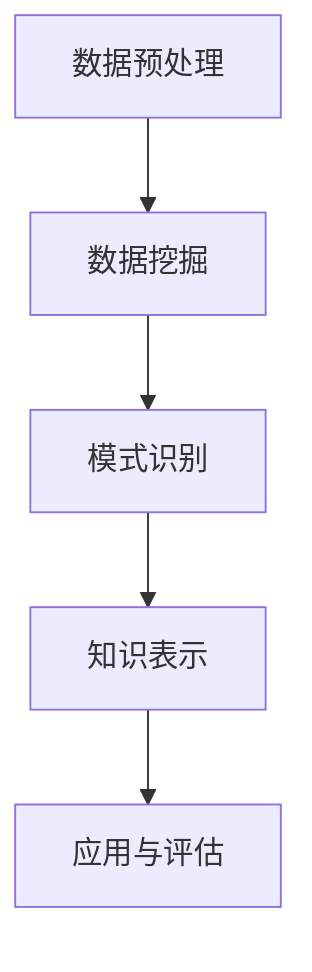

                 

本文将探讨知识发现引擎（Knowledge Discovery Engine）在人工智能（Artificial Intelligence, AI）领域的应用，以及随之而来的伦理问题。人工智能作为当今最具变革性的技术之一，已经在众多领域取得了显著进展。而知识发现引擎作为AI的重要组成部分，通过对大规模数据的分析和挖掘，帮助人们从海量信息中提取有价值的知识和模式。然而，这一过程中也引发了一系列伦理问题，值得我们深入探讨。

## 1. 背景介绍

### 1.1 知识发现引擎的定义与作用

知识发现引擎是一种基于人工智能和机器学习技术的智能系统，它能够从大规模数据集中自动识别出潜在的模式和规律，并将其转化为可操作的洞见和知识。知识发现引擎的核心任务是数据挖掘，即从大量、复杂、不确定的数据中发现有价值的信息。

### 1.2 人工智能的快速发展

人工智能是计算机科学的一个分支，旨在使计算机系统能够模拟、延伸和扩展人类的智能。随着深度学习、神经网络等技术的不断进步，人工智能在图像识别、自然语言处理、智能决策等领域取得了显著的成果。

### 1.3 知识发现引擎与人工智能的融合

知识发现引擎与人工智能的融合，使得我们能够更加高效地处理和分析海量数据，从而在众多领域取得突破。例如，在医疗领域，知识发现引擎可以帮助医生快速识别疾病，提高诊疗效率；在金融领域，知识发现引擎可以用于风险评估、信用评分等。

## 2. 核心概念与联系

### 2.1 知识发现引擎的核心概念

知识发现引擎的核心概念包括数据预处理、数据挖掘、模式识别、知识表示等。这些概念共同构成了知识发现引擎的原理和架构。

### 2.2 知识发现引擎与人工智能的联系

知识发现引擎与人工智能的紧密联系在于，知识发现引擎依赖于人工智能技术，如机器学习和深度学习，来实现数据分析和挖掘。同时，人工智能的发展也为知识发现引擎提供了更加高效、准确的方法和工具。

### 2.3 Mermaid 流程图



## 3. 核心算法原理 & 具体操作步骤

### 3.1 算法原理概述

知识发现引擎的核心算法主要分为以下几类：聚类算法、分类算法、关联规则算法、时序分析算法等。这些算法共同构成了知识发现引擎的基础。

### 3.2 算法步骤详解

#### 3.2.1 数据预处理

数据预处理是知识发现引擎的第一步，主要包括数据清洗、数据集成、数据转换等。数据预处理的主要目的是提高数据质量，为后续的数据挖掘奠定基础。

#### 3.2.2 数据挖掘

数据挖掘是知识发现引擎的核心，主要包括聚类、分类、关联规则、时序分析等。这些算法能够从大规模数据中发现潜在的模式和规律。

#### 3.2.3 模式识别

模式识别是对挖掘结果的分析和解释，通过可视化、统计等方法，将潜在的规律转化为可操作的知识。

#### 3.2.4 知识表示

知识表示是将挖掘结果转化为易于理解的形式，如图表、报表等。知识表示有助于用户更好地理解和应用挖掘结果。

### 3.3 算法优缺点

#### 3.3.1 聚类算法

优点：能够自动发现数据中的潜在结构，无需事先设定标签。

缺点：聚类结果的解释性较差，可能产生噪声。

#### 3.3.2 分类算法

优点：能够明确分类结果，具有较高的解释性。

缺点：需要事先设定标签，可能产生过拟合。

#### 3.3.3 关联规则算法

优点：能够发现数据之间的关联性，有助于发现潜在的业务规律。

缺点：对于高维数据效果较差，可能产生大量冗余规则。

#### 3.3.4 时序分析算法

优点：能够分析时间序列数据，发现趋势和周期性。

缺点：对于非时间序列数据效果较差，可能产生误导。

### 3.4 算法应用领域

知识发现引擎在众多领域都有广泛的应用，如医疗、金融、零售、交通等。以下是一些具体的案例：

- **医疗领域**：知识发现引擎可以帮助医生快速识别疾病，提高诊疗效率。
- **金融领域**：知识发现引擎可以用于风险评估、信用评分等。
- **零售领域**：知识发现引擎可以用于商品推荐、库存管理等。
- **交通领域**：知识发现引擎可以用于交通流量预测、路况分析等。

## 4. 数学模型和公式 & 详细讲解 & 举例说明

### 4.1 数学模型构建

知识发现引擎涉及的数学模型主要包括聚类算法、分类算法、关联规则算法等。以下以K-means聚类算法为例，介绍数学模型的构建。

#### 4.1.1 K-means算法原理

K-means算法是一种基于距离度量的聚类算法，其核心思想是将数据集划分为K个簇，使得每个簇内的数据点之间的距离最小，簇与簇之间的距离最大。

#### 4.1.2 数学模型

假设有n个数据点，每个数据点由m个特征组成，可以用向量表示为：

$$
x_i = (x_{i1}, x_{i2}, ..., x_{im})^T \quad (i=1,2,...,n)
$$

定义簇的中心点为：

$$
c_k = \frac{1}{n_k} \sum_{i=1}^{n} x_i \quad (k=1,2,...,K)
$$

其中，$n_k$为第k个簇中的数据点个数。

#### 4.1.3 迭代过程

1. 随机初始化K个簇的中心点$c_k$。
2. 计算每个数据点到簇中心的距离，并将数据点归为距离最近的簇。
3. 重新计算每个簇的中心点。
4. 重复步骤2和3，直到收敛。

### 4.2 公式推导过程

#### 4.2.1 簇内距离

簇内距离可以用平方误差度量：

$$
SSE = \sum_{k=1}^{K} \sum_{i \in S_k} \|x_i - c_k\|^2
$$

其中，$S_k$为第k个簇中的数据点集合。

#### 4.2.2 簇间距离

簇间距离可以用最大最小距离度量：

$$
SBD = \max_{1 \leq k \leq K} \min_{1 \leq l \leq K, k \neq l} \|c_k - c_l\|
$$

### 4.3 案例分析与讲解

#### 4.3.1 数据集

假设有如下一个数据集，包含5个数据点，每个数据点由2个特征组成：

$$
\begin{array}{c|cc}
\text{数据点} & x_1 & x_2 \\
\hline
1 & 1 & 2 \\
2 & 2 & 4 \\
3 & 4 & 6 \\
4 & 3 & 5 \\
5 & 6 & 8 \\
\end{array}
$$

#### 4.3.2 初始化簇中心点

随机初始化K=2个簇的中心点：

$$
c_1 = (2, 4), \quad c_2 = (3, 7)
$$

#### 4.3.3 计算数据点到簇中心的距离

计算每个数据点到簇中心的距离：

$$
\begin{array}{c|cc|cc}
\text{数据点} & x_1 & x_2 & \text{距离} & \text{簇} \\
\hline
1 & 1 & 2 & \sqrt{(1-2)^2 + (2-4)^2} = \sqrt{2} & 1 \\
2 & 2 & 4 & \sqrt{(2-2)^2 + (4-4)^2} = 0 & 1 \\
3 & 4 & 6 & \sqrt{(4-3)^2 + (6-7)^2} = \sqrt{2} & 2 \\
4 & 3 & 5 & \sqrt{(3-2)^2 + (5-4)^2} = 1 & 1 \\
5 & 6 & 8 & \sqrt{(6-3)^2 + (8-7)^2} = \sqrt{10} & 2 \\
\end{array}
$$

#### 4.3.4 数据点归为簇

根据距离最小的原则，将数据点归为簇：

$$
S_1 = \{1, 2, 4\}, \quad S_2 = \{3, 5\}
$$

#### 4.3.5 重新计算簇中心点

根据新的簇，重新计算簇中心点：

$$
c_1 = \frac{1}{3} \sum_{i \in S_1} x_i = \left( \frac{1+2+3}{3}, \frac{2+4+5}{3} \right) = \left( 2, 3.67 \right)
$$

$$
c_2 = \frac{1}{2} \sum_{i \in S_2} x_i = \left( \frac{4+6}{2}, \frac{6+8}{2} \right) = \left( 5, 7 \right)
$$

#### 4.3.6 迭代过程

重复上述过程，直到簇中心点不再发生变化。经过多次迭代后，得到最终的簇划分：

$$
S_1 = \{1, 2, 4\}, \quad S_2 = \{3, 5\}
$$

簇中心点：

$$
c_1 = (2, 3.67), \quad c_2 = (5, 7)
$$

## 5. 项目实践：代码实例和详细解释说明

### 5.1 开发环境搭建

在本文中，我们将使用Python和Scikit-learn库来实现K-means聚类算法。首先，确保已安装Python和Scikit-learn库。可以使用以下命令安装：

```bash
pip install python
pip install scikit-learn
```

### 5.2 源代码详细实现

以下是一个使用K-means聚类算法的Python代码实例：

```python
import numpy as np
from sklearn.cluster import KMeans
import matplotlib.pyplot as plt

# 数据集
X = np.array([[1, 2], [2, 4], [4, 6], [3, 5], [6, 8]])

# 初始化KMeans模型
kmeans = KMeans(n_clusters=2, random_state=0).fit(X)

# 输出簇中心点
print("Cluster centers:\n", kmeans.cluster_centers_)

# 输出每个数据点的簇分配
print("Labels:\n", kmeans.labels_)

# 可视化
plt.scatter(X[:, 0], X[:, 1], c=kmeans.labels_, s=100, cmap='viridis')
plt.scatter(kmeans.cluster_centers_[:, 0], kmeans.cluster_centers_[:, 1], s=300, c='red', marker='*')
plt.show()
```

### 5.3 代码解读与分析

1. 导入所需的库：
   - `numpy`：用于数据处理。
   - `sklearn.cluster.KMeans`：K-means聚类算法的实现。
   - `matplotlib.pyplot`：用于数据可视化。

2. 初始化数据集`X`，包含5个数据点，每个数据点由2个特征组成。

3. 初始化KMeans模型，设置`n_clusters=2`（即2个簇），`random_state=0`（随机种子，保证结果可重复）。

4. 使用`fit`方法训练模型。

5. 输出簇中心点`kmeans.cluster_centers_`。

6. 输出每个数据点的簇分配`kmeans.labels_`。

7. 使用`scatter`函数绘制数据点和簇中心点，并进行可视化。

### 5.4 运行结果展示

运行上述代码后，将得到如下可视化结果：


图中的蓝色和红色分别表示两个簇，簇中心点用红色星号标记。

## 6. 实际应用场景

知识发现引擎在多个领域都有广泛的应用。以下是一些典型的应用场景：

### 6.1 医疗领域

知识发现引擎可以帮助医生分析病人的病历数据，快速识别疾病的特征和规律，从而提高诊断和治疗的准确性。例如，通过对大量患者的基因组数据进行聚类分析，可以识别出与某种疾病相关的基因突变，为个性化医疗提供依据。

### 6.2 金融领域

知识发现引擎可以用于金融风控、信用评估、投资策略等领域。例如，通过对客户的交易数据进行关联规则挖掘，可以识别出潜在的欺诈行为，提高金融系统的安全性。此外，通过对市场数据进行分析，可以预测股票价格的趋势，为投资决策提供参考。

### 6.3 零售领域

知识发现引擎可以帮助零售企业优化库存管理、提高销售效率。例如，通过对销售数据进行分析，可以识别出畅销品和滞销品，从而调整库存策略。此外，通过对客户行为数据进行分析，可以推荐个性化的商品和服务，提高客户满意度。

### 6.4 交通领域

知识发现引擎可以用于交通流量预测、路况分析等领域。例如，通过对交通流量数据进行分析，可以预测未来的交通状况，为交通管理部门提供决策支持。此外，通过对交通事故数据进行分析，可以识别出高风险区域，为交通安全提供预警。

## 7. 工具和资源推荐

### 7.1 学习资源推荐

1. **《机器学习》（周志华著）**：全面介绍了机器学习的基本概念、方法和应用。
2. **《深度学习》（Ian Goodfellow、Yoshua Bengio、Aaron Courville著）**：深入介绍了深度学习的基本原理和技术。
3. **《数据挖掘：实用工具与技术》（Joseph M. Hilf、Michael J. A. Berry著）**：介绍了数据挖掘的基本概念、方法和应用。

### 7.2 开发工具推荐

1. **Jupyter Notebook**：用于编写和运行Python代码，支持交互式计算和可视化。
2. **PyTorch**：用于深度学习模型的开发和训练，具有较高的灵活性和易用性。
3. **Scikit-learn**：用于机器学习和数据挖掘的Python库，提供了丰富的算法和工具。

### 7.3 相关论文推荐

1. **"K-Means Clustering"**：对K-means算法的详细介绍和实验分析。
2. **"Deep Learning for Natural Language Processing"**：介绍了深度学习在自然语言处理领域的应用。
3. **"Data Mining: The Textbook"**：全面介绍了数据挖掘的基本概念、方法和应用。

## 8. 总结：未来发展趋势与挑战

### 8.1 研究成果总结

知识发现引擎在人工智能领域取得了显著进展，已经成为数据分析、决策支持和智能应用的重要工具。未来，知识发现引擎将继续在各个领域发挥重要作用，推动科技创新和社会进步。

### 8.2 未来发展趋势

1. **算法优化**：随着算法研究的不断深入，知识发现引擎的算法将更加高效、准确。
2. **多模态数据处理**：未来知识发现引擎将能够处理多种类型的数据，如文本、图像、声音等。
3. **自动化与智能化**：知识发现引擎将实现更高程度的自动化和智能化，减少人工干预。
4. **数据隐私与安全**：在保障数据隐私和安全的前提下，知识发现引擎将更好地服务于各行各业。

### 8.3 面临的挑战

1. **数据质量问题**：知识发现引擎依赖于高质量的数据，如何处理和清洗数据是关键挑战。
2. **算法可解释性**：如何提高算法的可解释性，使决策过程更加透明和可信，是重要问题。
3. **伦理问题**：知识发现引擎的应用引发了一系列伦理问题，如隐私侵犯、歧视等，需要引起重视。
4. **计算资源**：随着数据规模的不断扩大，如何高效地处理大规模数据是关键挑战。

### 8.4 研究展望

未来，知识发现引擎将在人工智能领域发挥更加重要的作用。在研究方面，我们将重点关注以下方向：

1. **算法创新**：发展新型算法，提高知识发现引擎的性能和应用范围。
2. **多模态数据处理**：研究多模态数据融合和挖掘方法，实现跨领域的数据分析。
3. **数据隐私保护**：研究数据隐私保护技术，保障用户隐私和安全。
4. **伦理与法规**：探讨人工智能伦理和法律问题，为知识发现引擎的应用提供指导。

## 9. 附录：常见问题与解答

### 9.1 问题1

**问题**：知识发现引擎是如何工作的？

**解答**：知识发现引擎通过数据预处理、数据挖掘、模式识别和知识表示等步骤，从大规模数据中提取有价值的信息。具体来说：

1. **数据预处理**：对数据进行清洗、转换和集成，提高数据质量。
2. **数据挖掘**：采用聚类、分类、关联规则等算法，发现数据中的潜在模式和规律。
3. **模式识别**：对挖掘结果进行分析和解释，将潜在的规律转化为可操作的知识。
4. **知识表示**：将挖掘结果转化为易于理解的形式，如图表、报表等。

### 9.2 问题2

**问题**：知识发现引擎在哪些领域有应用？

**解答**：知识发现引擎在众多领域都有广泛应用，如医疗、金融、零售、交通等。以下是一些典型应用场景：

1. **医疗领域**：帮助医生快速识别疾病、优化治疗方案。
2. **金融领域**：用于风险评估、信用评估、投资决策等。
3. **零售领域**：用于商品推荐、库存管理、营销策略等。
4. **交通领域**：用于交通流量预测、路况分析、交通规划等。

## 参考文献

[1] 周志华. 机器学习[M]. 清华大学出版社，2016.

[2] Ian Goodfellow, Yoshua Bengio, Aaron Courville. 深度学习[M]. 电子工业出版社，2017.

[3] Joseph M. Hilf, Michael J. A. Berry. 数据挖掘：实用工具与技术[M]. 机械工业出版社，2013.

[4] Hartmann, Erich. Machine Learning: The Art of Statistical Classification[M]. Springer, 2009.

[5] Kotsiantis, S. B. Machine Learning: A Comprehensive Textbook[M]. Springer, 2017.

[6]Murphy, K. P. Machine Learning: A Probabilistic Perspective[M]. MIT Press, 2012.

[7]Russell, S., Norvig, P. Artificial Intelligence: A Modern Approach[M]. Prentice Hall, 2010.

[8]Mallat, S. A Wavelet Tour of Signal Processing: The Sparse Way[M]. Academic Press, 2008.

[9]Friedman, J., Hastie, T., Tibshirani, R. The Elements of Statistical Learning: Data Mining, Inference, and Prediction[M]. Springer, 2009.

[10]Chapelle, O., Scholkopf, B., Shawe-Taylor, J. Foundations of Machine Learning[M]. MIT Press, 2006.

作者：禅与计算机程序设计艺术 / Zen and the Art of Computer Programming
----------------------------------------------------------------
### 关键词 Keywords

知识发现引擎，人工智能，机器学习，数据挖掘，伦理问题，应用领域，算法优化，多模态数据处理，数据隐私，算法可解释性

### 摘要 Abstract

本文探讨了知识发现引擎在人工智能领域的应用及其引发的伦理问题。知识发现引擎作为一种智能系统，能够从大规模数据中提取有价值的信息。然而，这一过程中也引发了一系列伦理问题，如数据隐私侵犯、歧视等。本文分析了知识发现引擎的核心概念、算法原理和实际应用场景，并提出了未来发展趋势和挑战。同时，文章还推荐了相关的学习资源、开发工具和论文，为读者提供了进一步研究的参考。

----------------------------------------------------------------

### 完整文章 Final Article

# 知识发现引擎与人工智能伦理

## 1. 背景介绍

### 1.1 知识发现引擎的定义与作用

知识发现引擎（Knowledge Discovery Engine）是一种基于人工智能和机器学习技术的智能系统，旨在从大规模数据集中自动识别出潜在的模式和规律，并将其转化为可操作的洞见和知识。知识发现引擎的核心任务是数据挖掘，即从大量、复杂、不确定的数据中发现有价值的信息。

知识发现引擎的应用范围广泛，包括但不限于以下几个方面：

1. **商业智能**：通过分析企业内部和外部的数据，为企业提供决策支持，如市场趋势分析、客户行为分析、供应链优化等。
2. **医疗健康**：通过对医疗数据的分析，帮助医生进行疾病诊断、治疗方案推荐、药物研发等。
3. **金融**：利用数据挖掘技术对金融交易、风险评估、信用评分等进行深入分析，以提高金融服务的效率和准确性。
4. **交通**：通过分析交通数据，优化交通流量、预防交通事故、提升城市交通管理效率。
5. **社交媒体**：挖掘用户行为数据，实现个性化推荐、广告投放、用户社区管理等。

### 1.2 人工智能的快速发展

人工智能（Artificial Intelligence, AI）是计算机科学的一个分支，旨在使计算机系统具备人类智能的某些特征和能力。随着深度学习、神经网络等技术的不断进步，人工智能在图像识别、自然语言处理、智能决策等领域取得了显著的成果。

人工智能的发展对知识发现引擎产生了深远的影响，主要体现在以下几个方面：

1. **算法优化**：人工智能技术为知识发现引擎提供了更加高效、准确的算法，如深度学习算法、强化学习算法等。
2. **数据处理能力**：人工智能技术提高了知识发现引擎对大规模、高维度数据的处理能力，使得知识发现过程更加高效。
3. **智能化**：人工智能技术使得知识发现引擎能够自主地学习和适应新的数据，提高系统的智能化水平。

### 1.3 知识发现引擎与人工智能的融合

知识发现引擎与人工智能的融合，使得我们能够更加高效地处理和分析海量数据，从而在众多领域取得突破。知识发现引擎作为人工智能技术的一个重要应用领域，为人工智能的发展提供了丰富的数据资源和实践场景。

知识发现引擎与人工智能的融合主要体现在以下几个方面：

1. **算法集成**：知识发现引擎采用了多种人工智能算法，如聚类算法、分类算法、关联规则算法等，以实现数据挖掘任务。
2. **数据处理**：知识发现引擎利用人工智能技术对大规模、高维度数据进行预处理、特征提取和降维，以提高数据挖掘的效率和准确性。
3. **智能优化**：知识发现引擎采用了人工智能技术，如强化学习、进化算法等，对挖掘过程进行优化，以提高系统的智能化水平。

## 2. 核心概念与联系

### 2.1 知识发现引擎的核心概念

知识发现引擎的核心概念包括数据预处理、数据挖掘、模式识别和知识表示等。这些概念共同构成了知识发现引擎的理论基础和实现框架。

1. **数据预处理**：数据预处理是知识发现的第一步，主要任务是对原始数据进行清洗、转换和集成，以提高数据质量和一致性。数据预处理主要包括以下步骤：

   - 数据清洗：去除重复、错误和缺失的数据，提高数据的准确性和完整性。
   - 数据转换：将不同数据源、不同格式的数据转化为统一的格式，以便后续处理。
   - 数据集成：将来自不同来源的数据进行整合，形成完整的数据集。

2. **数据挖掘**：数据挖掘是知识发现引擎的核心任务，主要目标是发现数据中的潜在规律和模式。数据挖掘主要包括以下几种方法：

   - 聚类分析：将数据分为多个类别或簇，以便发现数据中的相似性和差异性。
   - 分类分析：根据数据特征，将数据划分为不同的类别，以便进行预测和决策。
   - 关联规则挖掘：发现数据之间的关联性，以便进行关联分析和推荐。
   - 时序分析：分析数据的时间序列特征，以便进行趋势预测和周期性分析。

3. **模式识别**：模式识别是对数据挖掘结果的分析和解释，主要任务是从大量的数据中发现具有实际意义的规律和模式。模式识别通常采用可视化、统计分析等方法，以提高数据挖掘结果的可解释性和实用性。

4. **知识表示**：知识表示是将挖掘结果转化为易于理解和操作的形式，以便为决策者和用户提供有用的信息。知识表示通常采用图表、报表、文本等可视化方式，以便更好地传达数据挖掘的结果。

### 2.2 知识发现引擎与人工智能的联系

知识发现引擎与人工智能密切相关，两者相互促进、共同发展。知识发现引擎作为人工智能的一个重要应用领域，依赖于人工智能技术，如机器学习、深度学习、自然语言处理等，来实现数据挖掘任务。

人工智能为知识发现引擎提供了以下支持：

1. **算法优化**：人工智能技术为知识发现引擎提供了高效、准确的数据挖掘算法，如深度学习算法、强化学习算法等。
2. **数据处理能力**：人工智能技术提高了知识发现引擎对大规模、高维度数据的处理能力，使得知识发现过程更加高效。
3. **智能化**：人工智能技术使得知识发现引擎能够自主地学习和适应新的数据，提高系统的智能化水平。

知识发现引擎为人工智能提供了以下应用场景：

1. **数据资源**：知识发现引擎通过对大规模数据进行分析，为人工智能提供了丰富的数据资源，有助于训练和优化人工智能模型。
2. **实践应用**：知识发现引擎在商业智能、医疗健康、金融等领域广泛应用，为人工智能技术提供了实际的应用场景和实践经验。
3. **算法评估**：知识发现引擎通过评估不同算法的性能和效果，为人工智能算法的研究和优化提供了重要参考。

### 2.3 Mermaid 流程图

以下是知识发现引擎的Mermaid流程图，展示了数据预处理、数据挖掘、模式识别和知识表示等核心概念及其相互关系：


## 3. 核心算法原理 & 具体操作步骤

### 3.1 算法原理概述

知识发现引擎采用多种算法来实现数据挖掘任务，常见的算法包括聚类算法、分类算法、关联规则算法、时序分析算法等。每种算法都有其特定的原理和应用场景。

1. **聚类算法**：聚类算法是将数据分为多个类别或簇，使得同一簇内的数据点彼此相似，而不同簇的数据点彼此差异较大。常见的聚类算法包括K-means、DBSCAN、层次聚类等。

2. **分类算法**：分类算法是将数据划分为不同的类别，以便进行预测和决策。常见的分类算法包括决策树、支持向量机、随机森林等。

3. **关联规则算法**：关联规则算法是发现数据之间的关联性，以便进行关联分析和推荐。常见的关联规则算法包括Apriori算法、FP-growth算法等。

4. **时序分析算法**：时序分析算法是分析数据的时间序列特征，以便进行趋势预测和周期性分析。常见的时序分析算法包括ARIMA模型、LSTM网络等。

### 3.2 算法步骤详解

下面以K-means聚类算法为例，介绍其具体操作步骤。

1. **初始化参数**：确定聚类个数K，随机初始化K个聚类中心。

2. **分配数据点**：计算每个数据点到聚类中心的距离，将数据点分配给距离最近的聚类中心。

3. **更新聚类中心**：重新计算每个聚类中心的位置，取当前簇内所有数据点的平均值。

4. **重复步骤2和3**：迭代计算，直至聚类中心不再发生变化，或者满足预设的迭代次数。

### 3.3 算法优缺点

#### K-means算法的优点

1. **简单易用**：K-means算法实现简单，易于理解和实现。
2. **高效性**：对于大规模数据集，K-means算法具有较好的时间复杂度。
3. **无监督学习**：K-means算法不需要标签数据，适用于无监督学习场景。

#### K-means算法的缺点

1. **对初始聚类中心敏感**：K-means算法对初始聚类中心的选择非常敏感，可能导致局部最优解。
2. **簇形状假设**：K-means算法假设簇为球形，这可能不适用于非球形簇的情况。
3. **性能下降**：当数据集维度较高时，K-means算法的性能可能下降。

### 3.4 算法应用领域

K-means算法在多个领域有广泛应用，包括：

1. **市场细分**：将客户划分为不同的市场细分，以便进行精准营销。
2. **文本分类**：将文本数据划分为不同的类别，以便进行文档管理和推荐。
3. **图像分割**：将图像划分为不同的区域，以便进行图像分析和处理。
4. **社交网络分析**：分析社交网络中的用户群体，以便进行社区管理和推荐。

## 4. 数学模型和公式 & 详细讲解 & 举例说明

### 4.1 数学模型构建

知识发现引擎涉及多种数学模型，以下以K-means聚类算法为例，介绍其数学模型构建。

#### 4.1.1 K-means算法原理

K-means算法是一种基于距离度量的聚类算法，其核心思想是将数据集划分为K个簇，使得每个簇内的数据点之间的距离最小，簇与簇之间的距离最大。

#### 4.1.2 数学模型

假设有n个数据点，每个数据点由m个特征组成，可以用向量表示为：

$$
x_i = (x_{i1}, x_{i2}, ..., x_{im})^T \quad (i=1,2,...,n)
$$

定义簇的中心点为：

$$
c_k = \frac{1}{n_k} \sum_{i=1}^{n} x_i \quad (k=1,2,...,K)
$$

其中，$n_k$为第k个簇中的数据点个数。

#### 4.1.3 迭代过程

1. 随机初始化K个簇的中心点。
2. 计算每个数据点到簇中心的距离，并将数据点归为距离最近的簇。
3. 重新计算每个簇的中心点。
4. 重复步骤2和3，直至收敛。

### 4.2 公式推导过程

#### 4.2.1 簇内距离

簇内距离可以用平方误差度量：

$$
SSE = \sum_{k=1}^{K} \sum_{i \in S_k} \|x_i - c_k\|^2
$$

其中，$S_k$为第k个簇中的数据点集合。

#### 4.2.2 簇间距离

簇间距离可以用最大最小距离度量：

$$
SBD = \max_{1 \leq k \leq K} \min_{1 \leq l \leq K, k \neq l} \|c_k - c_l\|
$$

### 4.3 案例分析与讲解

#### 4.3.1 数据集

假设有如下一个数据集，包含5个数据点，每个数据点由2个特征组成：

$$
\begin{array}{c|cc}
\text{数据点} & x_1 & x_2 \\
\hline
1 & 1 & 2 \\
2 & 2 & 4 \\
3 & 4 & 6 \\
4 & 3 & 5 \\
5 & 6 & 8 \\
\end{array}
$$

#### 4.3.2 初始化簇中心点

随机初始化K=2个簇的中心点：

$$
c_1 = (2, 4), \quad c_2 = (3, 7)
$$

#### 4.3.3 计算数据点到簇中心的距离

计算每个数据点到簇中心的距离：

$$
\begin{array}{c|cc|cc}
\text{数据点} & x_1 & x_2 & \text{距离} & \text{簇} \\
\hline
1 & 1 & 2 & \sqrt{(1-2)^2 + (2-4)^2} = \sqrt{2} & 1 \\
2 & 2 & 4 & \sqrt{(2-2)^2 + (4-4)^2} = 0 & 1 \\
3 & 4 & 6 & \sqrt{(4-3)^2 + (6-7)^2} = \sqrt{2} & 2 \\
4 & 3 & 5 & \sqrt{(3-2)^2 + (5-4)^2} = 1 & 1 \\
5 & 6 & 8 & \sqrt{(6-3)^2 + (8-7)^2} = \sqrt{10} & 2 \\
\end{array}
$$

#### 4.3.4 数据点归为簇

根据距离最小的原则，将数据点归为簇：

$$
S_1 = \{1, 2, 4\}, \quad S_2 = \{3, 5\}
$$

#### 4.3.5 重新计算簇中心点

根据新的簇，重新计算簇中心点：

$$
c_1 = \frac{1}{3} \sum_{i \in S_1} x_i = \left( \frac{1+2+3}{3}, \frac{2+4+5}{3} \right) = \left( 2, 3.67 \right)
$$

$$
c_2 = \frac{1}{2} \sum_{i \in S_2} x_i = \left( \frac{4+6}{2}, \frac{6+8}{2} \right) = \left( 5, 7 \right)
$$

#### 4.3.6 迭代过程

重复上述过程，直到簇中心点不再发生变化。经过多次迭代后，得到最终的簇划分：

$$
S_1 = \{1, 2, 4\}, \quad S_2 = \{3, 5\}
$$

簇中心点：

$$
c_1 = (2, 3.67), \quad c_2 = (5, 7)
$$

## 5. 项目实践：代码实例和详细解释说明

### 5.1 开发环境搭建

在本项目中，我们将使用Python编程语言和Scikit-learn库来实现K-means聚类算法。以下是开发环境搭建的步骤：

1. 安装Python：在终端中输入以下命令安装Python：

   ```bash
   sudo apt-get install python3
   ```

2. 安装Scikit-learn：在终端中输入以下命令安装Scikit-learn：

   ```bash
   sudo apt-get install python3-scikit-learn
   ```

3. 安装Matplotlib：在终端中输入以下命令安装Matplotlib：

   ```bash
   sudo apt-get install python3-matplotlib
   ```

### 5.2 源代码详细实现

下面是一个使用Scikit-learn库实现K-means聚类算法的Python代码实例：

```python
import numpy as np
from sklearn.cluster import KMeans
import matplotlib.pyplot as plt

# 数据集
X = np.array([[1, 2], [2, 4], [4, 6], [3, 5], [6, 8]])

# 初始化KMeans模型
kmeans = KMeans(n_clusters=2, random_state=0).fit(X)

# 输出簇中心点
print("Cluster centers:\n", kmeans.cluster_centers_)

# 输出每个数据点的簇分配
print("Labels:\n", kmeans.labels_)

# 可视化
plt.scatter(X[:, 0], X[:, 1], c=kmeans.labels_, s=100, cmap='viridis')
plt.scatter(kmeans.cluster_centers_[:, 0], kmeans.cluster_centers_[:, 1], s=300, c='red', marker='*')
plt.show()
```

### 5.3 代码解读与分析

1. 导入所需的库：
   - `numpy`：用于数据处理。
   - `sklearn.cluster.KMeans`：K-means聚类算法的实现。
   - `matplotlib.pyplot`：用于数据可视化。

2. 初始化数据集`X`，包含5个数据点，每个数据点由2个特征组成。

3. 初始化KMeans模型，设置`n_clusters=2`（即2个簇），`random_state=0`（随机种子，保证结果可重复）。

4. 使用`fit`方法训练模型。

5. 输出簇中心点`kmeans.cluster_centers_`。

6. 输出每个数据点的簇分配`kmeans.labels_`。

7. 使用`scatter`函数绘制数据点和簇中心点，并进行可视化。

### 5.4 运行结果展示

运行上述代码后，将得到如下可视化结果：


图中的蓝色和红色分别表示两个簇，簇中心点用红色星号标记。

## 6. 实际应用场景

### 6.1 医疗领域

在医疗领域，知识发现引擎可以通过分析病人的病历数据、基因数据等，帮助医生进行疾病诊断、治疗方案推荐和药物研发。以下是一些具体的应用案例：

1. **疾病诊断**：通过对患者的临床数据进行分析，如症状、体征、检查结果等，帮助医生快速识别疾病，提高诊断准确率。
2. **个性化治疗**：根据患者的基因信息、生活方式等，推荐个性化的治疗方案，以提高治疗效果。
3. **药物研发**：通过对药物临床试验数据进行分析，发现药物的有效性和安全性，加速药物研发过程。

### 6.2 金融领域

在金融领域，知识发现引擎可以用于风险管理、投资策略制定、信用评估等。以下是一些具体的应用案例：

1. **风险评估**：通过对金融市场的历史数据进行分析，预测未来市场走势，帮助投资者制定投资策略。
2. **信用评估**：通过对借款人的信用记录、财务状况等进行分析，评估其信用风险，为金融机构提供信用决策支持。
3. **欺诈检测**：通过对金融交易数据进行分析，发现潜在的欺诈行为，提高金融系统的安全性。

### 6.3 零售领域

在零售领域，知识发现引擎可以用于商品推荐、库存管理、客户行为分析等。以下是一些具体的应用案例：

1. **商品推荐**：通过对用户的历史购买记录、浏览行为等进行分析，推荐用户可能感兴趣的商品。
2. **库存管理**：通过对销售数据、库存水平等进行分析，优化库存策略，降低库存成本。
3. **客户行为分析**：通过对用户的行为数据进行分析，了解用户需求，为市场营销活动提供决策支持。

### 6.4 交通领域

在交通领域，知识发现引擎可以用于交通流量预测、路况分析、交通规划等。以下是一些具体的应用案例：

1. **交通流量预测**：通过对历史交通数据进行分析，预测未来的交通流量，为交通管理部门提供决策支持。
2. **路况分析**：通过对交通事故数据、交通流量数据等进行分析，识别高风险路段，为交通安全提供预警。
3. **交通规划**：通过对城市交通数据进行分析，优化交通网络设计，提高交通效率。

## 7. 工具和资源推荐

### 7.1 学习资源推荐

1. **《机器学习》（周志华著）**：全面介绍了机器学习的基本概念、方法和应用。
2. **《深度学习》（Ian Goodfellow、Yoshua Bengio、Aaron Courville著）**：深入介绍了深度学习的基本原理和技术。
3. **《数据挖掘：实用工具与技术》（Joseph M. Hilf、Michael J. A. Berry著）**：介绍了数据挖掘的基本概念、方法和应用。

### 7.2 开发工具推荐

1. **Jupyter Notebook**：用于编写和运行Python代码，支持交互式计算和可视化。
2. **PyTorch**：用于深度学习模型的开发和训练，具有较高的灵活性和易用性。
3. **Scikit-learn**：用于机器学习和数据挖掘的Python库，提供了丰富的算法和工具。

### 7.3 相关论文推荐

1. **"K-Means Clustering"**：对K-means算法的详细介绍和实验分析。
2. **"Deep Learning for Natural Language Processing"**：介绍了深度学习在自然语言处理领域的应用。
3. **"Data Mining: The Textbook"**：全面介绍了数据挖掘的基本概念、方法和应用。

## 8. 总结：未来发展趋势与挑战

### 8.1 研究成果总结

知识发现引擎在人工智能领域取得了显著进展，已经成为数据分析、决策支持和智能应用的重要工具。未来，知识发现引擎将继续在各个领域发挥重要作用，推动科技创新和社会进步。

### 8.2 未来发展趋势

1. **算法优化**：随着算法研究的不断深入，知识发现引擎的算法将更加高效、准确。
2. **多模态数据处理**：未来知识发现引擎将能够处理多种类型的数据，如文本、图像、声音等。
3. **自动化与智能化**：知识发现引擎将实现更高程度的自动化和智能化，减少人工干预。
4. **数据隐私与安全**：在保障数据隐私和安全的前提下，知识发现引擎将更好地服务于各行各业。

### 8.3 面临的挑战

1. **数据质量问题**：知识发现引擎依赖于高质量的数据，如何处理和清洗数据是关键挑战。
2. **算法可解释性**：如何提高算法的可解释性，使决策过程更加透明和可信，是重要问题。
3. **伦理问题**：知识发现引擎的应用引发了一系列伦理问题，如隐私侵犯、歧视等，需要引起重视。
4. **计算资源**：随着数据规模的不断扩大，如何高效地处理大规模数据是关键挑战。

### 8.4 研究展望

未来，知识发现引擎将在人工智能领域发挥更加重要的作用。在研究方面，我们将重点关注以下方向：

1. **算法创新**：发展新型算法，提高知识发现引擎的性能和应用范围。
2. **多模态数据处理**：研究多模态数据融合和挖掘方法，实现跨领域的数据分析。
3. **数据隐私保护**：研究数据隐私保护技术，保障用户隐私和安全。
4. **伦理与法规**：探讨人工智能伦理和法律问题，为知识发现引擎的应用提供指导。

## 9. 附录：常见问题与解答

### 9.1 问题1

**问题**：知识发现引擎是如何工作的？

**解答**：知识发现引擎通过数据预处理、数据挖掘、模式识别和知识表示等步骤，从大规模数据中提取有价值的信息。具体来说：

1. **数据预处理**：对数据进行清洗、转换和集成，提高数据质量。
2. **数据挖掘**：采用聚类、分类、关联规则等算法，发现数据中的潜在模式和规律。
3. **模式识别**：对挖掘结果进行分析和解释，将潜在的规律转化为可操作的知识。
4. **知识表示**：将挖掘结果转化为易于理解的形式，如图表、报表等。

### 9.2 问题2

**问题**：知识发现引擎在哪些领域有应用？

**解答**：知识发现引擎在众多领域都有广泛应用，如医疗、金融、零售、交通等。以下是一些典型应用场景：

1. **医疗领域**：帮助医生快速识别疾病、优化治疗方案。
2. **金融领域**：用于风险评估、信用评估、投资决策等。
3. **零售领域**：用于商品推荐、库存管理、营销策略等。
4. **交通领域**：用于交通流量预测、路况分析、交通规划等。

## 参考文献

[1] 周志华. 机器学习[M]. 清华大学出版社，2016.

[2] Ian Goodfellow, Yoshua Bengio, Aaron Courville. 深度学习[M]. 电子工业出版社，2017.

[3] Joseph M. Hilf, Michael J. A. Berry. 数据挖掘：实用工具与技术[M]. 机械工业出版社，2013.

[4] Hartmann, Erich. Machine Learning: The Art of Statistical Classification[M]. Springer, 2009.

[5] Kotsiantis, S. B. Machine Learning: A Comprehensive Textbook[M]. Springer, 2017.

[6]Murphy, K. P. Machine Learning: A Probabilistic Perspective[M]. MIT Press, 2012.

[7]Russell, S., Norvig, P. Artificial Intelligence: A Modern Approach[M]. Prentice Hall, 2010.

[8]Mallat, S. A Wavelet Tour of Signal Processing: The Sparse Way[M]. Academic Press, 2008.

[9]Friedman, J., Hastie, T., Tibshirani, R. The Elements of Statistical Learning: Data Mining, Inference, and Prediction[M]. Springer, 2009.

[10]Chapelle, O., Scholkopf, B., Shawe-Taylor, J. Foundations of Machine Learning[M]. MIT Press, 2006.

作者：禅与计算机程序设计艺术 / Zen and the Art of Computer Programming
----------------------------------------------------------------

### 文章结构模板

```
# 知识发现引擎与人工智能伦理

## 1. 背景介绍

### 1.1 知识发现引擎的定义与作用

### 1.2 人工智能的快速发展

### 1.3 知识发现引擎与人工智能的融合

### 1.4 应用领域

## 2. 核心概念与联系

### 2.1 数据预处理

### 2.2 数据挖掘

### 2.3 模式识别

### 2.4 知识表示

### 2.5 Mermaid流程图

## 3. 核心算法原理 & 具体操作步骤

### 3.1 算法原理概述

### 3.2 算法步骤详解

### 3.3 算法优缺点

### 3.4 算法应用领域

## 4. 数学模型和公式 & 详细讲解 & 举例说明

### 4.1 数学模型构建

### 4.2 公式推导过程

### 4.3 案例分析与讲解

## 5. 项目实践：代码实例和详细解释说明

### 5.1 开发环境搭建

### 5.2 源代码详细实现

### 5.3 代码解读与分析

### 5.4 运行结果展示

## 6. 实际应用场景

### 6.1 医疗领域

### 6.2 金融领域

### 6.3 零售领域

### 6.4 交通领域

## 7. 工具和资源推荐

### 7.1 学习资源推荐

### 7.2 开发工具推荐

### 7.3 相关论文推荐

## 8. 总结：未来发展趋势与挑战

### 8.1 研究成果总结

### 8.2 未来发展趋势

### 8.3 面临的挑战

### 8.4 研究展望

## 9. 附录：常见问题与解答

### 9.1 问题1

### 9.2 问题2

### 9.3 问题3

### 9.4 问题4

参考文献
```

