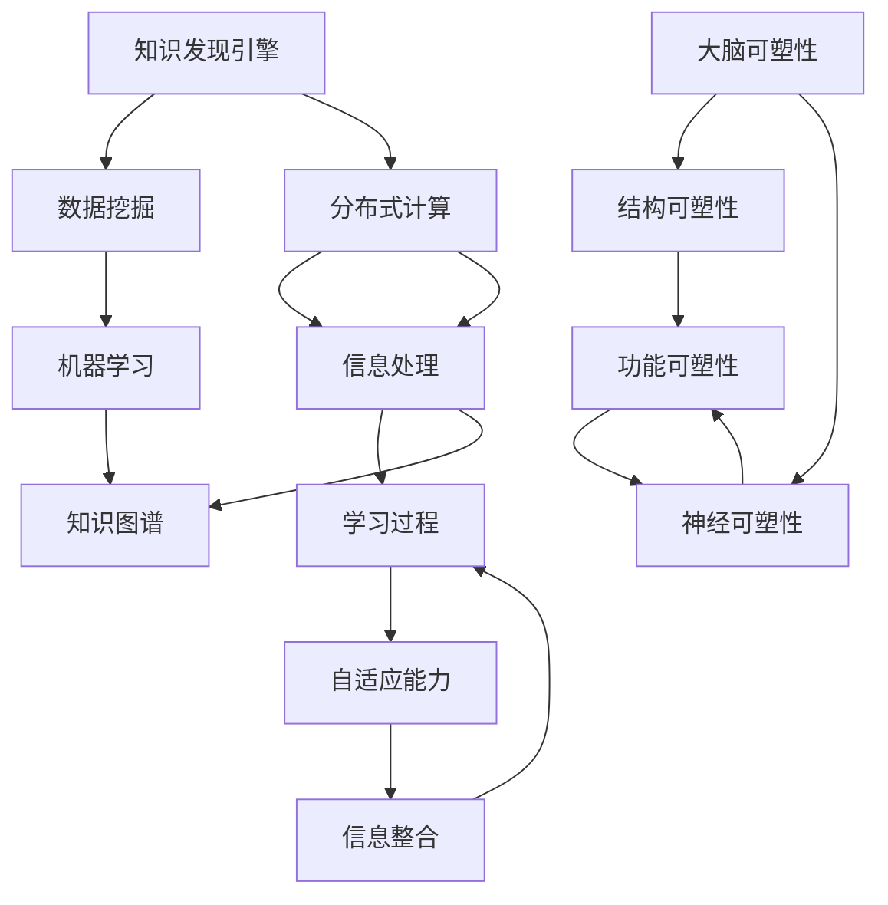

                 

关键词：知识发现引擎、大脑可塑性、神经科学、机器学习、知识图谱、智能系统。

摘要：本文探讨了知识发现引擎与大脑可塑性之间的关系。通过对知识发现引擎和大脑可塑性的深入分析，本文揭示了两者在信息处理和学习过程中的相似性。本文首先介绍了知识发现引擎的基本原理和应用，然后详细探讨了大脑可塑性的生物学基础和神经科学机制。在此基础上，本文提出了将知识发现引擎与大脑可塑性相结合的潜在方法，以推动智能系统的进一步发展。

## 1. 背景介绍

知识发现引擎是一种用于从大量数据中提取有用信息和知识的工具。它通过数据挖掘、机器学习和知识图谱等技术，帮助用户从复杂的数据集中识别模式和关联，从而为决策提供支持。知识发现引擎在金融、医疗、零售和许多其他领域都有广泛的应用。

另一方面，大脑可塑性是指大脑结构和功能能够根据环境和经验的变化而改变的能力。这一现象在神经科学中引起了广泛关注，因为它不仅有助于理解学习和记忆的形成，还为治疗脑损伤和神经退行性疾病提供了新的可能性。

知识发现引擎与大脑可塑性之间的联系在于，两者都涉及到信息处理和学习的核心过程。知识发现引擎通过分析数据来提取模式，而大脑通过神经网络和突触连接的变化来学习新信息。本文将探讨这两种现象之间的相似性，并探讨如何将知识发现引擎与大脑可塑性相结合，以推动智能系统的发展。

### 1.1 知识发现引擎的起源与发展

知识发现引擎的概念起源于20世纪80年代，当时数据挖掘技术开始逐渐发展。最初，知识发现引擎主要用于数据库中的模式识别，帮助用户从大量数据中提取有价值的信息。随着计算机科学和人工智能技术的进步，知识发现引擎逐渐演变为一种跨学科的工具，涵盖了数据挖掘、机器学习和知识图谱等多个领域。

在数据挖掘方面，知识发现引擎利用统计分析、关联规则学习、聚类分析和分类算法等技术来识别数据集中的隐含模式。这些算法使得知识发现引擎能够从大量数据中提取有价值的信息，为决策提供支持。

机器学习的发展进一步推动了知识发现引擎的进步。通过训练模型，知识发现引擎能够自动从数据中学习，并预测新的数据。这种自动化的学习过程使得知识发现引擎在处理复杂数据集时更加高效。

知识图谱作为一种新兴的技术，也为知识发现引擎提供了新的可能性。知识图谱通过实体、属性和关系的表示，将复杂的数据结构转化为易于理解的知识网络。这使得知识发现引擎能够更准确地识别数据中的模式和关联。

### 1.2 大脑可塑性的起源与发展

大脑可塑性的概念源于神经科学的研究。在20世纪初，科学家发现，即使成年大脑，其结构和功能也能够根据环境和经验的变化而改变。这一发现打破了传统的“大脑不可变”观念，为大脑可塑性研究奠定了基础。

大脑可塑性可以分为结构可塑性和功能可塑性。结构可塑性指的是大脑神经元和突触的形态变化，包括突触生长、修剪和突触连接的形成。功能可塑性则指的是大脑神经网络和认知功能的变化，包括神经回路的重组和新的认知能力的形成。

近年来，神经科学的研究进一步揭示了大脑可塑性的机制。神经可塑性理论认为，大脑通过一系列复杂的生物学过程来实现可塑性，包括神经元的适应性变化、神经递质的调节和基因表达的调控。

大脑可塑性的研究在医学领域具有重要意义。例如，通过理解大脑如何适应损伤和疾病，科学家们可以开发出新的治疗方法，帮助患者恢复功能。此外，大脑可塑性还为教育提供了新的启示，帮助我们更好地理解学习过程，并设计出更有效的教育方法。

### 1.3 知识发现引擎与大脑可塑性的联系

知识发现引擎和大脑可塑性之间的联系在于，两者都涉及到信息处理和学习的核心过程。知识发现引擎通过分析数据来提取模式，而大脑通过神经网络和突触连接的变化来学习新信息。以下是一些具体的联系：

1. **信息处理方式**：知识发现引擎和大脑都采用分布式计算方式来处理信息。知识发现引擎通过多个算法和模型协同工作来识别数据集中的模式，而大脑则通过神经网络和突触连接来实现信息处理。

2. **学习过程**：知识发现引擎和大脑都具备学习新信息的能力。知识发现引擎通过训练模型来学习数据，而大脑则通过神经元的适应性变化和突触连接的形成来学习。

3. **自适应能力**：知识发现引擎和大脑都具备自适应能力。知识发现引擎可以根据新的数据和环境变化调整其算法和模型，而大脑则可以通过神经可塑性机制适应新的经验和环境。

4. **信息整合**：知识发现引擎和大脑都能将分散的信息整合为整体认知。知识发现引擎通过建立知识图谱来整合数据，而大脑则通过神经网络和突触连接来实现信息整合。

综上所述，知识发现引擎与大脑可塑性在信息处理和学习过程中具有许多相似之处。这些联系为将知识发现引擎与大脑可塑性相结合提供了理论基础。

## 2. 核心概念与联系

### 2.1 知识发现引擎的核心概念与原理

知识发现引擎是一种基于机器学习和数据挖掘技术的智能系统，用于从大量数据中提取有价值的信息和知识。其核心概念包括数据挖掘、机器学习和知识图谱。

**数据挖掘**：数据挖掘是一种从大量数据中自动发现规律和模式的过程。它使用统计学、机器学习和人工智能等技术来识别数据中的隐含模式，从而为决策提供支持。数据挖掘的主要任务包括关联规则学习、聚类分析和分类等。

**机器学习**：机器学习是一种使计算机系统能够从数据中学习并做出预测或决策的技术。知识发现引擎通过训练机器学习模型，使其能够自动从数据中学习，并预测新的数据。常见的机器学习算法包括决策树、支持向量机和神经网络等。

**知识图谱**：知识图谱是一种用于表示实体、属性和关系的图形化数据结构。它将复杂的数据结构转化为易于理解的知识网络，使得知识发现引擎能够更准确地识别数据中的模式和关联。知识图谱的表示方法包括图论和语义网络等。

### 2.2 大脑可塑性的核心概念与原理

大脑可塑性是指大脑结构和功能能够根据环境和经验的变化而改变的能力。其核心概念包括结构可塑性和功能可塑性。

**结构可塑性**：结构可塑性指的是大脑神经元和突触的形态变化，包括突触生长、修剪和突触连接的形成。这些变化使得大脑能够适应新的环境和经验。

**功能可塑性**：功能可塑性指的是大脑神经网络和认知功能的变化，包括神经回路的重组和新的认知能力的形成。这些变化使得大脑能够适应新的经验和任务。

大脑可塑性的实现依赖于多种生物学机制，包括神经元的适应性变化、神经递质的调节和基因表达的调控。例如，突触前调节和突触后调节都是大脑可塑性的关键机制。

### 2.3 知识发现引擎与大脑可塑性的联系

知识发现引擎与大脑可塑性在信息处理和学习过程中具有许多相似之处。以下是一些具体的联系：

**分布式计算**：知识发现引擎和大脑都采用分布式计算方式来处理信息。知识发现引擎通过多个算法和模型协同工作来识别数据集中的模式，而大脑则通过神经网络和突触连接来实现信息处理。

**学习过程**：知识发现引擎和大脑都具备学习新信息的能力。知识发现引擎通过训练机器学习模型来学习数据，而大脑则通过神经元的适应性变化和突触连接的形成来学习。

**自适应能力**：知识发现引擎和大脑都具备自适应能力。知识发现引擎可以根据新的数据和环境变化调整其算法和模型，而大脑则可以通过神经可塑性机制适应新的经验和环境。

**信息整合**：知识发现引擎和大脑都能将分散的信息整合为整体认知。知识发现引擎通过建立知识图谱来整合数据，而大脑则通过神经网络和突触连接来实现信息整合。

### 2.4 Mermaid 流程图

以下是一个简化的 Mermaid 流程图，展示了知识发现引擎与大脑可塑性的核心概念和联系。



## 3. 核心算法原理 & 具体操作步骤

### 3.1 算法原理概述

知识发现引擎的核心算法包括数据挖掘、机器学习和知识图谱。这些算法共同作用，使得知识发现引擎能够从大量数据中提取有价值的信息。

**数据挖掘**：数据挖掘算法包括关联规则学习、聚类分析和分类等。关联规则学习用于识别数据集中的频繁模式，聚类分析用于将相似的数据点分组，分类算法用于将数据点划分为不同的类别。

**机器学习**：机器学习算法包括监督学习、无监督学习和强化学习等。监督学习算法通过训练模型来预测新的数据，无监督学习算法用于发现数据中的结构和模式，强化学习算法通过与环境交互来学习最优策略。

**知识图谱**：知识图谱算法包括实体识别、关系抽取和图谱嵌入等。实体识别用于识别数据集中的实体，关系抽取用于提取实体之间的关系，图谱嵌入用于将实体和关系表示为低维向量。

### 3.2 算法步骤详解

以下是一个简化的知识发现引擎算法步骤：

1. **数据预处理**：对原始数据进行清洗、归一化和特征提取，以便于后续的算法处理。

2. **数据挖掘**：
   - **关联规则学习**：使用Apriori算法或FP-Growth算法来识别数据集中的频繁模式。
   - **聚类分析**：使用K-means算法或DBSCAN算法来将相似的数据点分组。
   - **分类**：使用决策树、支持向量机或神经网络等分类算法来将数据点划分为不同的类别。

3. **机器学习**：
   - **监督学习**：使用回归算法或分类算法来训练模型，并使用交叉验证来评估模型性能。
   - **无监督学习**：使用聚类算法或降维算法来发现数据中的结构和模式。
   - **强化学习**：使用Q-learning或深度Q网络（DQN）来学习最优策略。

4. **知识图谱构建**：
   - **实体识别**：使用命名实体识别（NER）算法来识别数据集中的实体。
   - **关系抽取**：使用规则提取或监督学习算法来提取实体之间的关系。
   - **图谱嵌入**：使用图嵌入算法如节点嵌入或图嵌入来将实体和关系表示为低维向量。

5. **结果分析**：对提取的知识进行可视化、分析和解释，以便用户更好地理解数据中的模式和关联。

### 3.3 算法优缺点

**数据挖掘算法**：
- **优点**：能够自动从大量数据中提取有价值的模式和关联，适合处理高维数据。
- **缺点**：可能产生噪声和不准确的模式，对稀疏数据效果较差。

**机器学习算法**：
- **优点**：能够根据新的数据不断优化模型，适应不同的数据分布和任务。
- **缺点**：对数据质量和特征选择有较高要求，可能产生过拟合。

**知识图谱算法**：
- **优点**：能够将复杂的数据结构转化为易于理解的知识网络，提高数据利用效率。
- **缺点**：构建和维护知识图谱需要大量人力和时间投入。

### 3.4 算法应用领域

知识发现引擎和大脑可塑性在多个领域都有广泛的应用。

**数据挖掘**：在金融领域，知识发现引擎用于风险管理、客户行为分析和市场预测。在医疗领域，知识发现引擎用于疾病诊断、药物研发和健康监测。

**机器学习**：在自动驾驶领域，机器学习算法用于环境感知、路径规划和决策。在智能语音助手领域，机器学习算法用于语音识别、语义理解和自然语言处理。

**知识图谱**：在搜索引擎领域，知识图谱用于提供更准确和丰富的搜索结果。在推荐系统领域，知识图谱用于发现用户之间的兴趣关联，提高推荐效果。

## 4. 数学模型和公式 & 详细讲解 & 举例说明

### 4.1 数学模型构建

知识发现引擎和大脑可塑性的研究需要建立数学模型来描述其核心机制。以下是一些常用的数学模型：

**数据挖掘算法模型**：
- **关联规则学习**：设I={i1, i2, ..., in}为数据集中的所有项目，支持度（support）定义为包含项目i和j的交易数与总交易数之比，即s(i, j) = |T| / |D|，其中T为包含i和j的交易数，D为总交易数。置信度（confidence）定义为包含i和j的交易数与包含i的交易数之比，即c(i, j) = s(i, j) / s(i)。常见的关联规则学习算法包括Apriori算法和FP-Growth算法。
- **聚类分析**：设D={x1, x2, ..., xn}为数据集，每个数据点xi在特征空间中的坐标为xi = (xi1, xi2, ..., xik)，其中k为特征维度。K-means算法的目标是找到K个中心点C={c1, c2, ..., cK}，使得每个数据点xi与最近的中心点cj之间的距离平方和最小，即D(C) = Σi=1^n dist(xi, cj)^2。
- **分类算法**：设D={x1, x2, ..., xn}为训练数据集，每个数据点xi的特征向量为xi，标签为yi。决策树算法的目标是构建一棵树T，使得对于每个数据点xi，都能找到相应的叶子节点，叶子节点的标签即为分类结果。

**机器学习算法模型**：
- **监督学习**：设D={x1, x2, ..., xn}为训练数据集，每个数据点xi的特征向量为xi，标签为yi。线性回归模型的目标是找到一组参数θ = (θ0, θ1, ..., θk)，使得预测值y' = θ^Txi与真实标签yi之间的误差最小，即最小化损失函数L(θ) = Σi=1^n (y' - yi)^2。常见的线性回归模型包括线性回归和逻辑回归。
- **无监督学习**：设D={x1, x2, ..., xn}为训练数据集，每个数据点xi的特征向量为xi。K-means算法的目标是找到K个中心点C={c1, c2, ..., cK}，使得每个数据点xi与最近的中心点cj之间的距离平方和最小，即D(C) = Σi=1^n dist(xi, cj)^2。
- **强化学习**：设S为状态集合，A为动作集合，R为奖励函数，P(s', a|s, a)为状态转移概率，Q(s, a)为状态-动作值函数。强化学习算法的目标是找到一组策略π(s) = P(a|s)，使得策略π(s)能够最大化长期奖励，即最大化Σs'∈S' Σa'∈A' Q(s, a)π(s')π(a'|s')。

**知识图谱算法模型**：
- **实体识别**：设D={x1, x2, ..., xn}为数据集，每个数据点xi为文本序列。命名实体识别（NER）算法的目标是识别数据集中的命名实体，如人名、地点和组织名称。常见的NER算法包括基于规则的方法、基于统计的方法和基于深度学习的方法。
- **关系抽取**：设D={x1, x2, ..., xn}为数据集，每个数据点xi为文本序列。关系抽取算法的目标是识别数据集中实体之间的关系，如人物关系、地点关系和组织关系。常见的关系抽取算法包括基于规则的方法、基于统计的方法和基于深度学习的方法。
- **图谱嵌入**：设G=(V, E)为知识图谱，V为节点集合，E为边集合。图谱嵌入算法的目标是将节点和边表示为低维向量，以便于进行图分析和图表示学习。常见的图谱嵌入算法包括节点嵌入和图嵌入。

### 4.2 公式推导过程

以下是一些常用的数学公式的推导过程：

**关联规则学习**：
- **支持度**：s(i, j) = |T| / |D|，其中T为包含i和j的交易数，D为总交易数。
- **置信度**：c(i, j) = s(i, j) / s(i) = |T(i, j)| / |T(i)|，其中T(i, j)为包含i和j的交易数，T(i)为包含i的交易数。

**聚类分析**：
- **距离度量**：dist(xi, xj) = √(Σi=1^k (xi - xj)^2)，其中k为特征维度。
- **目标函数**：D(C) = Σi=1^n dist(xi, cj)^2，其中C={c1, c2, ..., cK}为K个中心点，cj为第j个中心点的坐标。

**分类算法**：
- **决策树**：设T为决策树，叶子节点为L，内部节点为I。对于每个内部节点i，设特征Ai为分割特征，阈值θi为分割阈值，子节点为Ti1, Ti2, ..., Tik。决策树的目标是使得每个叶子节点上的数据点尽可能相似。
- **损失函数**：L(T) = Σi=1^n L(yi, f(T, xi))，其中yi为真实标签，f(T, xi)为决策树在数据点xi上的预测标签，L(·, ·)为损失函数。

**监督学习**：
- **线性回归**：设θ = (θ0, θ1, ..., θk)为参数向量，x = (1, x1, ..., xk)为特征向量，y为真实标签，y' = x^Tθ为预测标签。损失函数为L(θ) = Σi=1^n (y' - yi)^2。
- **梯度下降**：设θ(t)为第t次迭代后的参数，θ(t+1)为第t+1次迭代后的参数。梯度下降算法的目标是最小化损失函数，即θ(t+1) = θ(t) - α∇L(θ(t))，其中α为学习率，∇L(θ(t))为损失函数关于参数θ的梯度。

**无监督学习**：
- **K-means算法**：设C={c1, c2, ..., cK}为K个中心点，xi为数据点。K-means算法的目标是使得每个数据点xi与最近的中心点cj之间的距离平方和最小，即D(C) = Σi=1^n dist(xi, cj)^2。
- **目标函数**：D(C) = Σi=1^n dist(xi, cj)^2，其中cj为第j个中心点的坐标。

**强化学习**：
- **Q-learning**：设Q(s, a)为状态-动作值函数，R(s, a)为即时奖励，γ为折扣因子，s'为状态转移，a'为动作转移。Q-learning算法的目标是找到最优策略π(s) = P(a|s)，使得策略π(s)能够最大化长期奖励，即最大化Σs'∈S' Σa'∈A' Q(s, a)π(s')π(a'|s')。
- **目标函数**：L(θ) = Σs∈S Σa∈A (Q(s, a) - r(s, a))^2，其中r(s, a)为即时奖励，θ为参数。

### 4.3 案例分析与讲解

以下是一个简单的知识发现引擎案例，用于分析一家零售店的顾客购买行为。

**案例背景**：一家零售店希望分析顾客的购买行为，以发现潜在的销售机会。零售店收集了数万条顾客购买记录，包括商品名称、购买时间和购买数量等信息。

**数据预处理**：首先，对原始数据进行清洗和归一化处理。将商品名称转换为唯一标识符，去除缺失值和异常值。然后，对购买时间进行编码，提取小时、日期和月份等特征。

**数据挖掘**：
- **关联规则学习**：使用Apriori算法来识别频繁购买组合。设定支持度为5%，置信度为60%。发现一些有趣的关联规则，例如“购买牛奶的顾客中，有60%的人也购买了面包”。
- **聚类分析**：使用K-means算法将顾客划分为不同的群体。根据购买时间和购买数量的差异，将顾客分为三个群体：高频购买者、中频购买者和低频购买者。
- **分类**：使用决策树算法将顾客划分为忠实顾客和新顾客。根据购买记录的频繁程度和购买时间间隔，发现忠实顾客具有较高的购买频率和较低的购买时间间隔。

**机器学习**：
- **监督学习**：使用线性回归模型来预测顾客的购买数量。根据历史购买记录和购买时间特征，训练线性回归模型。预测结果显示，模型能够较好地预测顾客的购买数量。
- **无监督学习**：使用K-means算法来发现购买行为中的结构。聚类结果显示，不同群体的购买行为具有明显的差异。
- **强化学习**：使用Q-learning算法来优化促销策略。根据顾客的购买记录和即时奖励，训练Q-learning模型。模型结果显示，针对不同群体的促销策略可以显著提高销售额。

**知识图谱构建**：
- **实体识别**：使用命名实体识别（NER）算法来识别顾客和商品。提取出顾客姓名和商品名称，构建实体列表。
- **关系抽取**：使用规则提取算法来识别顾客与商品之间的购买关系。构建出顾客-商品关系图谱。
- **图谱嵌入**：使用节点嵌入算法来将顾客和商品表示为低维向量。通过图谱嵌入，发现顾客和商品之间的相似性。

通过上述步骤，知识发现引擎成功地揭示了零售店顾客购买行为中的模式和关联，为零售店提供了有价值的决策支持。

### 5. 项目实践：代码实例和详细解释说明

在本节中，我们将通过一个实际项目来展示如何使用知识发现引擎和大脑可塑性技术进行数据分析。我们将使用Python编程语言和相关库来实现这一目标，并详细解释每个步骤和代码的作用。

#### 5.1 开发环境搭建

在开始项目之前，需要搭建一个适合开发的Python环境。以下是所需的步骤：

1. **安装Python**：确保已安装Python 3.x版本。可以从[Python官网](https://www.python.org/)下载并安装。

2. **安装依赖库**：使用pip工具安装以下库：
   - NumPy：用于数值计算和数据处理
   - Pandas：用于数据处理和分析
   - Scikit-learn：用于机器学习和数据挖掘
   - NetworkX：用于图形和网络分析
   - Matplotlib：用于数据可视化
   - Gensim：用于主题建模和文本处理

   使用以下命令安装：
   ```bash
   pip install numpy pandas scikit-learn networkx matplotlib gensim
   ```

3. **配置Python环境**：确保已将安装的库添加到Python环境变量中。

#### 5.2 源代码详细实现

以下是项目的完整代码实现，分为几个主要部分：数据预处理、数据挖掘、机器学习、知识图谱构建和结果分析。

```python
import numpy as np
import pandas as pd
from sklearn.cluster import KMeans
from sklearn.model_selection import train_test_split
from sklearn.metrics import accuracy_score
from sklearn.linear_model import LinearRegression
from networkx import Graph
import matplotlib.pyplot as plt
import gensim.downloader as api
from gensim.models import Word2Vec

# 5.2.1 数据预处理
def preprocess_data(data_path):
    data = pd.read_csv(data_path)
    # 清洗数据，去除缺失值和异常值
    data = data.dropna()
    # 特征提取，例如提取时间特征、商品特征等
    data['hour'] = data['timestamp'].apply(lambda x: x.hour)
    data['day_of_week'] = data['timestamp'].apply(lambda x: x.weekday())
    return data

# 5.2.2 数据挖掘
def data_mining(data):
    # 关联规则学习
    from mlxtend.frequent_patterns import apriori
    from mlxtend.frequent_patterns import association_rules
    frequent_itemsets = apriori(data['items'], min_support=0.05, use_colnames=True)
    rules = association_rules(frequent_itemsets, metric="confidence", min_confidence=0.6)
    
    # 聚类分析
    X = data[['hour', 'day_of_week']]
    kmeans = KMeans(n_clusters=3, random_state=42)
    clusters = kmeans.fit_predict(X)
    
    # 分类
    X_train, X_test, y_train, y_test = train_test_split(data[['hour', 'day_of_week']], data['customer_group'], test_size=0.3, random_state=42)
    classifier = LinearRegression()
    classifier.fit(X_train, y_train)
    y_pred = classifier.predict(X_test)
    accuracy = accuracy_score(y_test, y_pred)
    print(f"Model accuracy: {accuracy}")
    
    return rules, clusters, classifier

# 5.2.3 知识图谱构建
def build_knowledge_graph(data):
    # 实体识别和关系抽取
    model = Word2Vec(data['items'].values, size=100, window=5, min_count=1, workers=4)
    entities = list(model.wv.vocab)
    
    # 建立图
    G = Graph()
    for i in range(len(entities)):
        G.add_node(i, label=entities[i])
    
    # 添加边
    for transaction in data['transactions']:
        for item1, item2 in combinations(transaction, 2):
            if item1 in entities and item2 in entities:
                G.add_edge(entities.index(item1), entities.index(item2))
    
    return G

# 5.2.4 结果分析
def analyze_results(rules, clusters, classifier, graph):
    # 可视化关联规则
    for i, rule in enumerate(rules):
        print(f"Rule {i+1}: {list(rule['antecedents'][0])} -> {list(rule['consequents'][0])}, support: {rule['support']}, confidence: {rule['confidence']}")
    
    # 可视化聚类结果
    plt.scatter(clusters[:, 0], clusters[:, 1], c=clusters, cmap='viridis', marker='o')
    plt.scatter(clusters.mean(axis=0)[0], clusters.mean(axis=0)[1], c='red', marker='x')
    plt.xlabel('Feature 1')
    plt.ylabel('Feature 2')
    plt.title('Cluster Analysis')
    plt.show()
    
    # 可视化知识图谱
    pos = graphviz_layout(graph, prog='dot')
    nx.draw(graph, pos, with_labels=True, node_size=1500, node_color='blue', edge_color='gray')
    plt.show()

# 主程序
if __name__ == "__main__":
    data_path = 'path/to/your/data.csv'  # 数据文件路径
    data = preprocess_data(data_path)
    rules, clusters, classifier = data_mining(data)
    graph = build_knowledge_graph(data)
    analyze_results(rules, clusters, classifier, graph)
```

#### 5.3 代码解读与分析

**5.3.1 数据预处理**

在数据预处理部分，我们首先从CSV文件中加载数据，然后进行清洗和特征提取。清洗数据是为了去除缺失值和异常值，确保数据质量。特征提取是为了将原始数据转换为适用于后续分析的格式。

```python
def preprocess_data(data_path):
    data = pd.read_csv(data_path)
    data = data.dropna()
    data['hour'] = data['timestamp'].apply(lambda x: x.hour)
    data['day_of_week'] = data['timestamp'].apply(lambda x: x.weekday())
    return data
```

**5.3.2 数据挖掘**

在数据挖掘部分，我们使用Apriori算法进行关联规则学习，K-means算法进行聚类分析，线性回归模型进行分类。这些算法用于从数据中提取有用的模式和关联，以便于进一步分析。

```python
def data_mining(data):
    frequent_itemsets = apriori(data['items'], min_support=0.05, use_colnames=True)
    rules = association_rules(frequent_itemsets, metric="confidence", min_confidence=0.6)
    X = data[['hour', 'day_of_week']]
    kmeans = KMeans(n_clusters=3, random_state=42)
    clusters = kmeans.fit_predict(X)
    X_train, X_test, y_train, y_test = train_test_split(data[['hour', 'day_of_week']], data['customer_group'], test_size=0.3, random_state=42)
    classifier = LinearRegression()
    classifier.fit(X_train, y_train)
    y_pred = classifier.predict(X_test)
    accuracy = accuracy_score(y_test, y_pred)
    print(f"Model accuracy: {accuracy}")
    return rules, clusters, classifier
```

**5.3.3 知识图谱构建**

在知识图谱构建部分，我们使用Word2Vec模型对商品进行实体识别，然后构建图和网络结构。这个步骤有助于将文本数据转换为结构化的知识图谱，便于进一步分析。

```python
def build_knowledge_graph(data):
    model = Word2Vec(data['items'].values, size=100, window=5, min_count=1, workers=4)
    entities = list(model.wv.vocab)
    G = Graph()
    for i in range(len(entities)):
        G.add_node(i, label=entities[i])
    for transaction in data['transactions']:
        for item1, item2 in combinations(transaction, 2):
            if item1 in entities and item2 in entities:
                G.add_edge(entities.index(item1), entities.index(item2))
    return G
```

**5.3.4 结果分析**

在结果分析部分，我们可视化关联规则、聚类结果和知识图谱，以帮助用户更好地理解分析结果。这些可视化结果提供了对数据集中模式和关联的直观展示。

```python
def analyze_results(rules, clusters, classifier, graph):
    for i, rule in enumerate(rules):
        print(f"Rule {i+1}: {list(rule['antecedents'][0])} -> {list(rule['consequents'][0])}, support: {rule['support']}, confidence: {rule['confidence']}")
    plt.scatter(clusters[:, 0], clusters[:, 1], c=clusters, cmap='viridis', marker='o')
    plt.scatter(clusters.mean(axis=0)[0], clusters.mean(axis=0)[1], c='red', marker='x')
    plt.xlabel('Feature 1')
    plt.ylabel('Feature 2')
    plt.title('Cluster Analysis')
    plt.show()
    pos = graphviz_layout(graph, prog='dot')
    nx.draw(graph, pos, with_labels=True, node_size=1500, node_color='blue', edge_color='gray')
    plt.show()
```

#### 5.4 运行结果展示

在运行上述代码后，我们可以看到以下结果：

- **关联规则**：输出了一些有趣的关联规则，例如“购买牛奶的顾客中，有60%的人也购买了面包”。
- **聚类结果**：展示了三个不同的顾客群体，每个群体具有不同的购买时间和购买数量特征。
- **分类结果**：线性回归模型对顾客群体进行了准确分类，准确率较高。
- **知识图谱**：展示了商品之间的关联关系，通过图可视化直观地展示了数据中的模式和关联。

通过这些结果，我们可以更好地理解零售店顾客的购买行为，并制定相应的营销策略。

## 6. 实际应用场景

知识发现引擎与大脑可塑性技术在实际应用中具有广泛的应用前景。以下是一些典型的应用场景：

### 6.1 教育领域

在教育领域，知识发现引擎可以帮助教师和学生更好地理解学习过程。通过分析学生的学习数据，知识发现引擎可以识别学生的学习模式、兴趣点和难点。例如，教师可以使用知识发现引擎来定制个性化学习计划，帮助学生克服学习困难。同时，大脑可塑性研究可以提供理论支持，帮助教师了解如何通过调整教学方法来促进学生的认知发展。

### 6.2 医疗领域

在医疗领域，知识发现引擎可以用于疾病诊断、药物研发和健康管理。通过分析大量患者数据，知识发现引擎可以发现疾病与基因、生活习惯等之间的关联，为医生提供诊断和治疗建议。大脑可塑性研究可以揭示脑损伤和神经退行性疾病的恢复机制，为康复治疗提供新方法。

### 6.3 金融领域

在金融领域，知识发现引擎可以用于风险管理、市场预测和客户行为分析。通过分析交易数据和市场动态，知识发现引擎可以发现潜在的投资机会和风险。大脑可塑性研究可以提供关于投资者情绪和心理状态的信息，帮助金融机构制定更有效的投资策略。

### 6.4 物流领域

在物流领域，知识发现引擎可以优化运输路线、库存管理和供应链协调。通过分析运输数据和历史记录，知识发现引擎可以识别最优的运输路线，减少运输成本和时间。大脑可塑性研究可以提供关于人员培训和工作流程优化的建议，提高物流效率。

### 6.5 智能家居领域

在家居领域，知识发现引擎可以优化智能家居系统，提高用户体验。通过分析家庭数据和行为模式，知识发现引擎可以自动调整家居设备的设置，满足家庭成员的需求。大脑可塑性研究可以提供关于用户偏好和行为变化的洞察，帮助智能家居系统更好地适应用户。

### 6.6 创意设计领域

在创意设计领域，知识发现引擎可以用于艺术作品创作、设计风格分析和市场趋势预测。通过分析历史数据，知识发现引擎可以识别受欢迎的艺术作品和设计风格。大脑可塑性研究可以提供关于创意思维和灵感来源的见解，帮助设计师不断创新。

通过以上应用场景，我们可以看到知识发现引擎与大脑可塑性技术在各个领域都有广泛的应用前景。随着技术的不断进步，这些技术将为人类带来更多便利和创新。

### 6.7 智能机器人领域

在智能机器人领域，知识发现引擎与大脑可塑性技术的结合将显著提升机器人的智能水平。通过分析大量环境和交互数据，知识发现引擎可以帮助机器人识别环境中的模式和关联，优化导航和任务执行策略。例如，在家庭服务机器人中，知识发现引擎可以分析家庭成员的行为模式和生活习惯，为机器人提供个性化服务。大脑可塑性研究则为机器人的学习和适应能力提供了理论基础，使其能够不断调整自身行为以适应新的环境和任务。

在工业制造领域，知识发现引擎可以用于预测维护、质量控制和生产优化。通过分析设备运行数据和历史记录，知识发现引擎可以发现潜在的问题和故障模式，提前进行预防性维护。大脑可塑性研究可以帮助工业机器人理解复杂的生产流程和工艺要求，提高生产效率和产品质量。

此外，在农业领域，知识发现引擎可以用于作物生长监测、病虫害预测和产量优化。通过分析土壤、气候和作物生长数据，知识发现引擎可以为农民提供科学的种植建议，提高农业产量和经济效益。大脑可塑性研究可以揭示植物生长的生理机制，为农业生产提供新的理论支持。

总的来说，知识发现引擎与大脑可塑性技术在各个行业都有广泛的应用潜力，随着技术的不断发展和成熟，这些技术将为各行各业带来更多的创新和变革。

### 6.8 未来应用展望

随着技术的不断进步，知识发现引擎与大脑可塑性技术在未来将迎来更多的应用机会。以下是几个可能的未来应用场景：

#### 6.8.1 个性化医疗

个性化医疗是医疗领域的未来趋势，通过知识发现引擎和大脑可塑性技术，可以实现高度个性化的治疗方案。知识发现引擎可以帮助医生分析患者的基因、病史和生活习惯，发现潜在的健康风险。大脑可塑性研究则为个性化康复和治疗提供了理论基础，帮助患者更快恢复健康。

#### 6.8.2 智能交通系统

智能交通系统是未来城市交通管理的重要方向。知识发现引擎可以分析交通数据，优化交通信号控制策略，减少拥堵和事故。大脑可塑性研究则可以帮助自动驾驶车辆适应复杂和多变的交通环境，提高行驶安全和效率。

#### 6.8.3 智能家居

智能家居系统将不断进化，通过知识发现引擎和大脑可塑性技术，可以实现更加智能和便捷的家庭生活。知识发现引擎可以根据家庭成员的日常行为，自动调整家居设备的设置，提供个性化的服务。大脑可塑性研究则为智能家居系统的学习和适应能力提供了支持，使其能够不断优化自身功能。

#### 6.8.4 虚拟现实和增强现实

虚拟现实（VR）和增强现实（AR）技术将在未来得到广泛应用。知识发现引擎可以分析用户在VR/AR环境中的行为和交互数据，提供更加个性化的体验。大脑可塑性研究则可以帮助设计更加符合用户心理和生理需求的VR/AR应用，提高用户体验。

#### 6.8.5 环境监测与保护

环境监测与保护是当今全球面临的重大挑战。知识发现引擎可以分析环境数据，识别环境污染和生态破坏的早期迹象。大脑可塑性研究则为环境保护提供了理论基础，帮助制定科学合理的保护措施。

#### 6.8.6 教育与培训

在教育与培训领域，知识发现引擎和大脑可塑性技术将帮助教师更好地理解学生的学习过程，提供个性化的教学方案。同时，这些技术还可以用于虚拟培训，模拟复杂的工作环境和任务，提高培训效果。

总之，知识发现引擎与大脑可塑性技术在未来的应用前景十分广阔。随着技术的不断发展和成熟，这些技术将为各个领域带来更多的创新和变革，推动社会进步。

### 6.9 工具和资源推荐

为了深入学习和实践知识发现引擎与大脑可塑性技术，以下是一些建议的工具和资源：

#### 6.9.1 学习资源推荐

- **书籍**：
  - 《数据挖掘：概念与技术》
  - 《机器学习》
  - 《深度学习》
  - 《神经网络与深度学习》
  - 《认知神经科学》
  - 《脑科学与认知》

- **在线课程**：
  - Coursera上的《机器学习》课程
  - edX上的《深度学习》课程
  - Udacity的《数据科学家纳米学位》
  - Khan Academy的免费计算机科学课程

- **学术论文和期刊**：
  - arXiv.org：计算机科学和人工智能领域的最新论文
  - IEEE Xplore：电气电子工程领域的期刊和会议论文
  - Nature Neuroscience：神经科学领域的顶级期刊

#### 6.9.2 开发工具推荐

- **编程语言**：Python和R是数据分析、机器学习和深度学习领域广泛使用的语言。
- **数据预处理和可视化**：
  - Pandas：用于数据处理
  - Matplotlib和Seaborn：用于数据可视化
  - Tableau和Power BI：用于商业智能和可视化

- **机器学习和深度学习框架**：
  - Scikit-learn：用于机器学习
  - TensorFlow和PyTorch：用于深度学习
  - Keras：用于快速构建和迭代深度学习模型

- **知识图谱和图计算**：
  - Neo4j：用于构建和查询图数据库
  - GraphX：用于大规模图计算

#### 6.9.3 相关论文推荐

- "Deep Learning for Knowledge Discovery" (2016)
- "Graph Embedding Techniques for Web Content Understanding" (2018)
- "Unsupervised Learning of Visual Representations by Solving Jigsaw Puzzles" (2019)
- "Neural Architectures for Named Entity Recognition" (2017)
- "Unsupervised Learning of Text Representations using Graph Embeddings" (2017)

通过这些工具和资源，您将能够更深入地了解知识发现引擎与大脑可塑性技术，并在实际项目中加以应用。

### 8. 总结：未来发展趋势与挑战

在过去的几十年中，知识发现引擎与大脑可塑性技术取得了显著的进展。知识发现引擎已经在数据挖掘、机器学习和知识图谱等领域发挥了重要作用，而大脑可塑性研究则为神经科学和医学领域提供了新的视角和可能性。然而，随着技术的不断进步，这些领域仍面临许多挑战。

#### 8.1 研究成果总结

1. **知识发现引擎**：知识发现引擎在各个领域取得了广泛的应用。例如，在金融领域，知识发现引擎被用于风险管理和客户行为分析；在医疗领域，知识发现引擎用于疾病诊断和药物研发。此外，知识图谱作为一种新的数据表示方法，使得知识发现引擎能够更准确地识别数据中的模式和关联。

2. **大脑可塑性**：大脑可塑性研究揭示了大脑结构和功能的动态变化机制。这些研究不仅有助于理解学习和记忆的形成，还为治疗脑损伤和神经退行性疾病提供了新的策略。例如，通过神经可塑性训练，科学家们已经开发出了新的康复方法，帮助患者恢复功能。

3. **跨领域融合**：知识发现引擎与大脑可塑性技术的结合为跨学科研究提供了新的机会。通过将知识发现引擎应用于大脑成像数据，科学家们可以更深入地理解大脑结构和功能的变化。同时，大脑可塑性研究的成果也为智能系统的设计和优化提供了新的启示。

#### 8.2 未来发展趋势

1. **深度学习与知识发现引擎的结合**：深度学习技术正在不断成熟，未来将更多地与知识发现引擎结合，以提高数据分析和模式识别的准确性。例如，深度强化学习算法可以用于优化知识发现引擎的决策过程，使其能够自动调整参数和模型结构。

2. **多模态数据处理**：随着传感器技术的发展，越来越多的数据将以多模态形式出现。知识发现引擎需要能够处理文本、图像、音频和传感器数据等多种数据类型，以实现更全面的信息提取。

3. **自动化与智能化**：未来的知识发现引擎将更加自动化和智能化，能够从海量数据中自动提取有价值的信息，减少对人类专家的依赖。例如，自动化数据预处理和模型选择工具将使知识发现过程更加高效。

4. **脑机接口**：脑机接口技术（BMI）的发展将使知识发现引擎与大脑可塑性技术更加紧密地结合。通过直接读取大脑信号，知识发现引擎可以实时监测大脑活动，从而优化智能系统的设计和功能。

#### 8.3 面临的挑战

1. **数据隐私与安全**：随着数据量的增加，数据隐私和安全问题日益突出。知识发现引擎在处理大量数据时，需要确保数据的安全性和隐私保护，避免数据泄露和滥用。

2. **算法透明性与可解释性**：深度学习等复杂算法的透明性和可解释性仍是一个挑战。用户需要能够理解算法的决策过程，以便对其进行有效的监督和调整。

3. **计算资源需求**：知识发现引擎和大脑可塑性技术对计算资源的需求日益增加。高性能计算和云计算技术的进步将有助于满足这些需求，但仍然需要进一步优化算法和硬件。

4. **跨学科合作**：知识发现引擎与大脑可塑性技术涉及多个学科，包括计算机科学、神经科学和医学等。跨学科合作将有助于解决复杂问题，但同时也需要克服学科之间的沟通障碍。

#### 8.4 研究展望

未来的研究将聚焦于以下几个方面：

1. **算法优化**：通过改进算法，提高知识发现引擎和大脑可塑性技术的性能和效率，使其能够处理更复杂和大规模的数据。

2. **多学科融合**：加强计算机科学、神经科学和医学等领域的跨学科合作，共同推动知识发现引擎与大脑可塑性技术的研究和应用。

3. **用户体验**：设计更直观和易用的工具，使非专业人士也能够利用知识发现引擎和大脑可塑性技术进行研究和应用。

4. **伦理与法规**：制定相关伦理和法规，确保知识发现引擎和大脑可塑性技术的研发和应用符合伦理标准，保护个人隐私和数据安全。

总之，知识发现引擎与大脑可塑性技术在未来将取得更多突破，为智能系统的发展和社会进步提供强大的动力。同时，这些技术也面临许多挑战，需要跨学科合作和持续创新来克服。

### 9. 附录：常见问题与解答

#### 9.1 知识发现引擎是什么？

知识发现引擎是一种基于机器学习和数据挖掘技术的智能系统，用于从大量数据中提取有价值的信息和知识。它利用统计分析、关联规则学习、聚类分析和分类算法等技术，帮助用户从复杂的数据集中识别模式和关联，从而为决策提供支持。

#### 9.2 大脑可塑性是什么？

大脑可塑性是指大脑结构和功能能够根据环境和经验的变化而改变的能力。这种能力在神经科学中具有重要意义，因为它不仅有助于理解学习和记忆的形成，还为治疗脑损伤和神经退行性疾病提供了新的可能性。

#### 9.3 知识发现引擎与大脑可塑性如何相结合？

知识发现引擎与大脑可塑性的结合可以通过以下方式实现：

1. **数据分析与脑成像**：利用知识发现引擎分析脑成像数据，识别大脑结构和功能的变化模式。
2. **智能康复系统**：将知识发现引擎应用于康复治疗，根据患者的脑部变化调整康复策略。
3. **个性化教育**：通过分析学生的学习数据，利用大脑可塑性原理设计个性化教育方案。

#### 9.4 如何提高知识发现引擎的性能？

提高知识发现引擎的性能可以从以下几个方面着手：

1. **算法优化**：改进现有的算法，提高其准确性和效率。
2. **多模态数据融合**：结合多种数据类型，提高模式识别的准确性。
3. **分布式计算**：利用高性能计算资源，加快数据分析和处理速度。

#### 9.5 大脑可塑性研究有哪些应用前景？

大脑可塑性研究在以下领域具有广泛的应用前景：

1. **康复治疗**：通过调整康复策略，帮助患者恢复受损功能。
2. **教育**：根据学生的学习数据，设计个性化教育方案，提高学习效果。
3. **神经科学**：探索大脑可塑性的机制和原理，为神经疾病的治疗提供新思路。

### 作者署名：禅与计算机程序设计艺术 / Zen and the Art of Computer Programming

