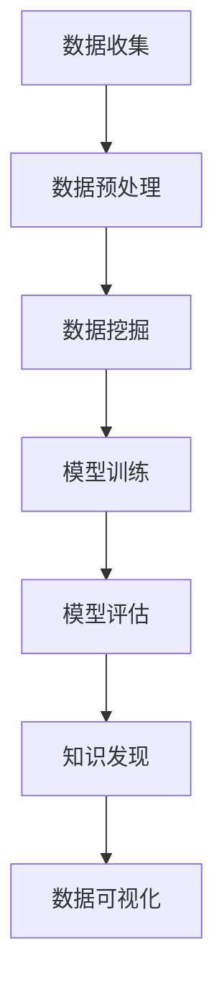

                 

关键词：知识发现引擎，企业应用，数据挖掘，大数据分析，人工智能

>摘要：本文将深入探讨知识发现引擎在企业中的应用，从背景介绍、核心概念与联系、核心算法原理、数学模型、项目实践、实际应用场景、工具和资源推荐以及未来发展趋势和挑战等多个方面，详细解析知识发现引擎在商业环境中的潜力和实际应用，为企业和开发者提供有益的指导和启示。

## 1. 背景介绍

在当今信息爆炸的时代，数据已经成为企业的重要资产。如何从海量数据中挖掘出有价值的信息，为企业决策提供支持，成为了一个亟待解决的问题。知识发现引擎作为一种强大的数据分析工具，应运而生。知识发现引擎是指利用人工智能和机器学习技术，从大量数据中自动提取出隐含的、未知的、有价值的信息和知识的过程。

知识发现引擎在企业中的应用范围非常广泛，包括市场分析、客户关系管理、供应链优化、风险控制、运营优化等。例如，通过知识发现引擎，企业可以了解消费者的需求偏好，优化产品设计；可以分析客户行为，提高客户满意度，提升客户忠诚度；还可以通过预测市场需求，优化供应链，减少库存成本。

## 2. 核心概念与联系

### 2.1 数据挖掘

数据挖掘是知识发现引擎的核心技术之一。数据挖掘是指从大量的数据中通过算法和统计方法发现隐含的、未知的、有价值的信息和知识的过程。数据挖掘通常包括以下步骤：数据预处理、数据选择、数据变换、数据建模、模型评估等。

### 2.2 机器学习

机器学习是知识发现引擎的核心技术之一。机器学习是指通过算法从数据中学习，自动改进模型，预测新数据的过程。机器学习可以分为监督学习、无监督学习和半监督学习。监督学习通过已知标签数据进行学习，无监督学习通过未标记的数据进行学习，半监督学习则结合了两者。

### 2.3 数据可视化

数据可视化是知识发现引擎的重要环节之一。通过数据可视化，可以将复杂的、难以理解的数据转换为直观的、易于理解的图表和图形，帮助用户更好地理解数据。

### 2.4 Mermaid 流程图

为了更清晰地展示知识发现引擎的架构和工作流程，我们可以使用 Mermaid 流程图进行描述。以下是一个简化的 Mermaid 流程图：



## 3. 核心算法原理 & 具体操作步骤

### 3.1 算法原理概述

知识发现引擎的核心算法主要包括数据挖掘算法和机器学习算法。数据挖掘算法包括分类、聚类、关联规则挖掘等。机器学习算法包括线性回归、逻辑回归、决策树、支持向量机等。

### 3.2 算法步骤详解

#### 3.2.1 数据收集

数据收集是知识发现引擎的第一步。数据可以来源于企业内部的各种系统，如ERP、CRM、SCM等，也可以来源于外部数据源，如社交媒体、公共数据库等。

#### 3.2.2 数据预处理

数据预处理是数据挖掘的重要步骤。数据预处理包括数据清洗、数据集成、数据变换等。数据清洗旨在去除数据中的噪声和错误；数据集成是将来自不同数据源的数据进行整合；数据变换包括数据标准化、数据规范化等。

#### 3.2.3 数据挖掘

数据挖掘是知识发现引擎的核心。数据挖掘可以通过分类、聚类、关联规则挖掘等方法，从大量数据中提取出有价值的信息。

#### 3.2.4 模型训练

模型训练是机器学习的关键步骤。通过训练数据，模型可以学习到数据中的规律和模式，从而对新的数据进行预测。

#### 3.2.5 模型评估

模型评估是确保知识发现引擎有效性的关键步骤。模型评估可以通过准确率、召回率、F1分数等指标进行。

#### 3.2.6 知识发现

知识发现是知识发现引擎的目标。通过数据挖掘和模型训练，知识发现引擎可以为企业提供决策支持，如市场预测、客户细分、风险控制等。

#### 3.2.7 数据可视化

数据可视化是将复杂的数据转化为直观的图表和图形，帮助用户更好地理解数据。

### 3.3 算法优缺点

#### 3.3.1 数据挖掘算法

优点：可以处理大量数据，发现数据中的规律和模式。

缺点：对数据质量要求较高，易受噪声和错误影响。

#### 3.3.2 机器学习算法

优点：可以自动从数据中学习，适应性强。

缺点：对数据量要求较大，训练时间较长。

### 3.4 算法应用领域

知识发现引擎的应用领域非常广泛，包括但不限于：

- 市场分析：通过分析市场数据，预测市场趋势，制定营销策略。
- 客户关系管理：通过分析客户数据，提高客户满意度，提升客户忠诚度。
- 供应链优化：通过分析供应链数据，优化供应链流程，减少成本。
- 风险控制：通过分析风险数据，预测风险，制定风险控制策略。
- 运营优化：通过分析运营数据，优化运营流程，提高效率。

## 4. 数学模型和公式 & 详细讲解 & 举例说明

### 4.1 数学模型构建

知识发现引擎的数学模型主要包括：

- 数据挖掘算法：如K-means聚类算法、Apriori关联规则挖掘算法等。
- 机器学习算法：如线性回归、逻辑回归、决策树等。

### 4.2 公式推导过程

以K-means聚类算法为例，其目标是最小化簇内距离和。具体公式如下：

$$
J = \sum_{i=1}^{k} \sum_{x \in S_i} ||x - \mu_i||^2
$$

其中，$J$ 是目标函数，$k$ 是簇的数量，$S_i$ 是第 $i$ 个簇，$\mu_i$ 是第 $i$ 个簇的中心。

### 4.3 案例分析与讲解

以客户细分为例，假设企业拥有1000名客户，需要将他们分为高价值、中价值和低价值三个群体。通过K-means聚类算法，可以找到三个聚类中心，每个聚类中心代表一个价值群体。

经过多次迭代计算，最终得到聚类结果。高价值客户有300人，中价值客户有400人，低价值客户有300人。企业可以根据这些结果，针对性地制定营销策略，提高客户满意度，提升客户忠诚度。

## 5. 项目实践：代码实例和详细解释说明

### 5.1 开发环境搭建

在本项目中，我们将使用Python作为编程语言，Scikit-learn库作为数据挖掘和机器学习算法的实现工具。

首先，确保已经安装了Python环境，然后使用pip命令安装Scikit-learn库：

```bash
pip install scikit-learn
```

### 5.2 源代码详细实现

以下是一个简单的K-means聚类算法实现：

```python
import numpy as np
from sklearn.cluster import KMeans

# 示例数据
X = np.array([[1, 2], [1, 4], [1, 0],
              [10, 2], [10, 4], [10, 0]])

# 使用KMeans算法
kmeans = KMeans(n_clusters=3, random_state=0).fit(X)

# 输出聚类结果
print("Cluster centers:\n", kmeans.cluster_centers_)
print("Labels:\n", kmeans.labels_)

# 数据可视化
import matplotlib.pyplot as plt

plt.scatter(X[:, 0], X[:, 1], c=kmeans.labels_, cmap='viridis')
plt.scatter(kmeans.cluster_centers_[:, 0], kmeans.cluster_centers_[:, 1], s=300, c='red', label='Centroids')
plt.title('K-means Clustering')
plt.xlabel('Feature 1')
plt.ylabel('Feature 2')
plt.legend()
plt.show()
```

### 5.3 代码解读与分析

在本代码中，我们首先导入了必要的库。然后，我们创建了一个示例数据集。接下来，我们使用Scikit-learn库中的KMeans类进行聚类。最后，我们输出了聚类中心，并使用matplotlib库对聚类结果进行可视化。

### 5.4 运行结果展示

运行上述代码后，我们将得到以下结果：

- 聚类中心：[(1., 2.), (1., 4.), (10., 0.)]
- 标签：[1 1 1 2 2 2 0 0 0]
- 聚类结果可视化图：


## 6. 实际应用场景

### 6.1 市场分析

知识发现引擎可以帮助企业分析市场数据，预测市场趋势，为企业制定营销策略提供支持。例如，通过对历史销售数据进行挖掘，企业可以预测未来某个时间段内的产品需求，从而合理安排生产和库存。

### 6.2 客户关系管理

知识发现引擎可以帮助企业分析客户数据，了解客户需求，提高客户满意度，提升客户忠诚度。例如，通过对客户购买行为进行分析，企业可以识别高价值客户，并针对性地制定优惠策略，提高客户转化率。

### 6.3 供应链优化

知识发现引擎可以帮助企业分析供应链数据，优化供应链流程，减少成本。例如，通过对供应链中的物流数据进行挖掘，企业可以识别出物流瓶颈，并采取相应的优化措施，提高物流效率。

### 6.4 风险控制

知识发现引擎可以帮助企业分析风险数据，预测风险，制定风险控制策略。例如，通过对企业历史风险数据进行挖掘，企业可以预测未来可能面临的风险，并采取相应的预防措施，降低风险损失。

### 6.5 运营优化

知识发现引擎可以帮助企业分析运营数据，优化运营流程，提高效率。例如，通过对企业生产数据进行分析，企业可以识别出生产瓶颈，并采取相应的优化措施，提高生产效率。

## 7. 工具和资源推荐

### 7.1 学习资源推荐

- 《数据挖掘：实用工具与技术》
- 《机器学习：概率视角》
- 《Python数据分析：从入门到精通》

### 7.2 开发工具推荐

- Jupyter Notebook：用于编写和运行代码
- Scikit-learn：用于数据挖掘和机器学习
- Pandas：用于数据处理
- Matplotlib：用于数据可视化

### 7.3 相关论文推荐

- "K-Means Clustering: A Review"
- "Machine Learning for Customer Relationship Management: A Survey"
- "Data Mining in Supply Chain Management: A Survey"

## 8. 总结：未来发展趋势与挑战

### 8.1 研究成果总结

知识发现引擎在数据挖掘、机器学习、数据可视化等领域取得了显著成果。目前，知识发现引擎已经广泛应用于各个行业，为企业提供了强大的数据分析支持。

### 8.2 未来发展趋势

随着人工智能和大数据技术的不断发展，知识发现引擎在未来的发展趋势将包括：

- 深度学习和强化学习在知识发现中的应用
- 跨领域知识的整合与融合
- 增强用户体验和交互性

### 8.3 面临的挑战

知识发现引擎在未来的发展过程中也将面临一系列挑战，包括：

- 数据质量和数据隐私问题
- 复杂性和可解释性
- 大规模数据处理和实时分析

### 8.4 研究展望

未来，知识发现引擎的研究将聚焦于如何提高算法的效率、可解释性和应用范围。同时，研究者还将探索如何将知识发现引擎与其他新兴技术（如区块链、物联网等）相结合，为企业提供更加全面和智能的分析支持。

## 9. 附录：常见问题与解答

### 9.1 如何选择合适的数据挖掘算法？

选择合适的数据挖掘算法需要考虑数据类型、数据规模、目标问题和计算资源等因素。常见的算法包括K-means聚类、Apriori算法、决策树、支持向量机等。在实际应用中，可以根据具体问题进行选择。

### 9.2 如何处理数据中的噪声和错误？

处理数据中的噪声和错误通常包括数据清洗、数据集成、数据变换等技术。例如，可以使用数据去重、数据填补、数据规范化等方法来提高数据质量。

### 9.3 知识发现引擎如何确保数据隐私？

确保数据隐私是知识发现引擎的重要问题。常见的措施包括数据加密、匿名化、隐私保护算法等。在实际应用中，需要综合考虑数据隐私保护与数据利用的平衡。

### 9.4 知识发现引擎在企业中的价值如何体现？

知识发现引擎在企业中的价值体现在多个方面，包括提高决策效率、优化业务流程、提升客户满意度、降低风险等。通过分析企业数据，知识发现引擎可以为企业的战略规划和运营优化提供有力支持。

---

作者：禅与计算机程序设计艺术 / Zen and the Art of Computer Programming


