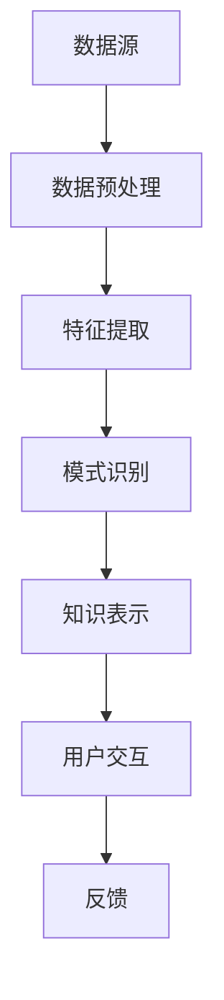
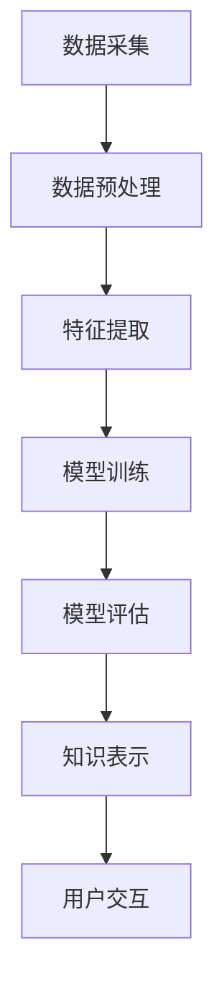

                 

## 1. 背景介绍

在当今快速发展的信息技术时代，程序员的工作面临着越来越多的挑战。代码库的规模不断扩大，技术栈日益复杂，而用户对软件的质量和性能的要求也越来越高。在这样的背景下，如何高效地管理和利用代码资源，提高编程效率和软件质量，成为程序员亟待解决的问题。

知识发现引擎（Knowledge Discovery Engine）作为一种能够从大量数据中自动识别模式和知识的人工智能技术，为程序员的工作提供了强有力的支持。知识发现引擎通过数据挖掘、机器学习和自然语言处理等技术，可以自动提取出代码库中的潜在模式，帮助程序员更好地理解代码库，发现潜在的问题，优化代码结构，甚至预测未来的编程趋势。

本文将围绕知识发现引擎在程序员工作中的应用进行深入探讨，首先介绍知识发现引擎的基本概念和原理，然后详细分析其在代码库管理、编程辅助、代码质量评估和预测性维护等方面的应用，最后展望知识发现引擎在未来程序员工作中的发展趋势和潜在挑战。

## 2. 核心概念与联系

### 2.1 知识发现引擎的定义

知识发现引擎是一种能够从大量数据中自动识别模式和知识的人工智能系统。它基于数据挖掘、机器学习和自然语言处理等技术，通过数据预处理、特征提取、模式识别和知识表示等步骤，将数据中的隐含信息提取出来，为用户提供了有效的决策支持和智能服务。

### 2.2 数据挖掘与知识发现的关系

数据挖掘（Data Mining）是知识发现（Knowledge Discovery in Databases, KDD）过程的一部分，它指的是从大量数据中通过算法和统计方法提取出有价值的信息和知识。知识发现则是一个更广泛的概念，它不仅包括数据挖掘，还包括数据的预处理、数据的组织、知识的表示和解释等多个阶段。

在程序员工作中，数据挖掘和知识发现密切相关。程序员需要从代码库中挖掘出有用的信息和知识，以指导编程实践。例如，通过数据挖掘，程序员可以发现代码中的重复模式，识别潜在的性能瓶颈，甚至预测未来的编程趋势。

### 2.3 知识发现引擎的架构

知识发现引擎的架构通常包括以下几个关键组件：

1. **数据源**：包括代码库、文档库、用户行为数据等。
2. **数据预处理**：对原始数据进行清洗、转换和集成，以便后续处理。
3. **特征提取**：从预处理后的数据中提取出对知识发现任务有用的特征。
4. **模式识别**：利用机器学习算法和统计方法，从特征数据中识别出潜在的模式和知识。
5. **知识表示**：将识别出的模式以可视化的形式呈现给用户，如图表、报告等。
6. **用户交互**：提供与用户的交互界面，用户可以通过该界面提出问题、查看结果和反馈。

### 2.4 知识发现引擎与程序员工作的联系

知识发现引擎与程序员工作的联系体现在多个方面：

1. **代码库管理**：知识发现引擎可以帮助程序员更好地管理代码库，通过识别代码中的重复模式和潜在的 bug，优化代码结构，提高代码质量。
2. **编程辅助**：知识发现引擎可以分析程序员的工作习惯和代码风格，提供个性化的编程建议和代码优化方案，提高编程效率。
3. **代码质量评估**：知识发现引擎可以自动评估代码库的质量，识别潜在的性能问题和安全性漏洞，帮助程序员改进代码。
4. **预测性维护**：知识发现引擎可以分析历史数据，预测未来的编程需求和趋势，为程序员的工作规划提供支持。

### 2.5 Mermaid 流程图

以下是一个简化的知识发现引擎在程序员工作中的 Mermaid 流程图，展示其基本工作流程和关键组件：



## 3. 核心算法原理 & 具体操作步骤

### 3.1 算法原理概述

知识发现引擎的核心算法包括数据挖掘算法和机器学习算法。数据挖掘算法主要关注如何从大量数据中提取出有用的信息和知识，而机器学习算法则通过训练模型，从历史数据中学习规律，预测未来的趋势。

在程序员工作中，常见的知识发现算法包括聚类分析、关联规则挖掘、分类和回归分析等。这些算法通过分析代码库中的数据，识别出代码中的重复模式、性能瓶颈和潜在问题。

### 3.2 算法步骤详解

以下是知识发现引擎在程序员工作中应用的基本步骤：

1. **数据采集**：从代码库、文档库和用户行为日志中采集数据。
2. **数据预处理**：对采集到的数据进行清洗、转换和集成，去除噪声和冗余数据。
3. **特征提取**：从预处理后的数据中提取出对知识发现任务有用的特征，如代码行数、函数调用关系、代码复杂度等。
4. **模式识别**：利用数据挖掘算法和机器学习算法，对提取出的特征进行分析，识别出代码中的重复模式、性能瓶颈和潜在问题。
5. **知识表示**：将识别出的模式以可视化的形式呈现给用户，如代码调用图、性能分析报告等。
6. **用户交互**：提供与用户的交互界面，用户可以通过该界面查看结果、提出问题和反馈。

### 3.3 算法优缺点

**优点**：

1. **高效性**：知识发现引擎可以自动处理大量数据，提高程序员的工作效率。
2. **准确性**：通过机器学习和数据挖掘算法，知识发现引擎可以识别出代码中的潜在问题和趋势，提高代码质量。
3. **个性化**：知识发现引擎可以根据用户的工作习惯和代码风格，提供个性化的编程建议和优化方案。

**缺点**：

1. **复杂性**：知识发现引擎需要处理大量数据，算法复杂度高，对计算资源和时间的要求较高。
2. **结果解释**：知识发现引擎识别出的模式需要用户理解和解释，否则难以指导实际编程工作。

### 3.4 算法应用领域

知识发现引擎在程序员工作中具有广泛的应用领域，包括但不限于：

1. **代码库管理**：通过识别代码中的重复模式和潜在问题，优化代码结构，提高代码质量。
2. **编程辅助**：通过分析程序员的工作习惯和代码风格，提供个性化的编程建议和优化方案。
3. **代码质量评估**：自动评估代码库的质量，识别潜在的性能问题和安全性漏洞。
4. **预测性维护**：通过分析历史数据，预测未来的编程需求和趋势，为程序员的工作规划提供支持。

## 4. 数学模型和公式 & 详细讲解 & 举例说明

### 4.1 数学模型构建

知识发现引擎中的数学模型主要包括数据挖掘算法和机器学习算法。以下是一些常见的数学模型及其公式：

1. **K-Means 聚类算法**：

   公式：$$\text{ minimized } \sum_{i=1}^k \sum_{x \in S_i} \| x - \mu_i \|^2$$

   其中，$k$ 表示聚类个数，$S_i$ 表示第 $i$ 个聚类，$\mu_i$ 表示第 $i$ 个聚类的中心。

2. **Apriori 关联规则挖掘算法**：

   公式：$$\text{ support }(X, Y) = \frac{|\{(x, y) \mid x \in X, y \in Y\}|}{|D|}$$

   $$\text{ confidence }(X \rightarrow Y) = \frac{|\{(x, y) \mid x \in X, y \in Y\}|}{|\{x \mid x \in X\}|}$$

   其中，$D$ 表示交易数据库，$X$ 和 $Y$ 表示两个项集。

3. **决策树分类算法**：

   公式：$$\text{ entropy }(X) = -\sum_{i=1}^n p_i \log_2 p_i$$

   $$\text{ information gain }(\text{splitting on attribute } A) = \sum_{v \in Values(A)} p_v \cdot \text{ entropy }(\text{remainder after splitting on } v)$$

   其中，$X$ 表示数据集，$p_i$ 表示第 $i$ 个类别的概率，$Values(A)$ 表示属性 $A$ 的所有可能值。

### 4.2 公式推导过程

以下以 K-Means 聚类算法为例，简要介绍公式推导过程：

假设数据集 $D = \{x_1, x_2, ..., x_n\}$，其中每个数据点 $x_i$ 是一个多维向量。K-Means 聚类算法的目标是找到 $k$ 个聚类中心 $\mu_1, \mu_2, ..., \mu_k$，使得每个数据点与聚类中心的距离之和最小。

首先，算法随机初始化 $k$ 个聚类中心。然后，对于每个数据点 $x_i$，将其分配到距离它最近的聚类中心所在的聚类。接着，更新每个聚类的中心，使其成为该聚类中所有数据点的平均值。

重复执行上述步骤，直到聚类中心不再发生显著变化或达到预设的迭代次数。此时，数据集已经被划分成 $k$ 个聚类，每个聚类由其中心点代表。

### 4.3 案例分析与讲解

以下是一个简单的 K-Means 聚类算法的案例，展示其应用过程：

假设有一个包含 100 个二维数据点的数据集 $D$，我们需要将其划分为 3 个聚类。首先，随机初始化 3 个聚类中心 $\mu_1, \mu_2, \mu_3$。然后，根据每个数据点与聚类中心的距离，将其分配到最近的聚类中心所在的聚类。接下来，更新每个聚类的中心，使其成为该聚类中所有数据点的平均值。

经过多次迭代后，聚类中心逐渐稳定下来，数据点也被划分为 3 个聚类。此时，我们可以通过可视化工具（如 Matplotlib）展示聚类结果，以便更好地理解聚类过程。

```python
import numpy as np
import matplotlib.pyplot as plt

# 初始化数据集
data = np.random.rand(100, 2)

# 随机初始化聚类中心
centers = np.random.rand(3, 2)

# 迭代过程
def k_means(data, centers, max_iterations):
    for _ in range(max_iterations):
        # 计算每个数据点到聚类中心的距离
        distances = np.linalg.norm(data - centers, axis=1)
        
        # 将数据点分配到最近的聚类中心
        labels = np.argmin(distances, axis=1)
        
        # 更新每个聚类的中心
        new_centers = np.array([data[labels == i].mean(axis=0) for i in range(3)])
        
        # 判断聚类中心是否发生变化
        if np.linalg.norm(new_centers - centers) < 1e-5:
            break

        centers = new_centers
    
    return labels, centers

# 运行 K-Means 算法
labels, centers = k_means(data, centers, 100)

# 可视化聚类结果
plt.scatter(data[:, 0], data[:, 1], c=labels)
plt.scatter(centers[:, 0], centers[:, 1], s=300, c='red')
plt.show()
```

运行上述代码后，我们可以看到数据点被成功划分为 3 个聚类，聚类中心稳定下来。这个简单的案例展示了 K-Means 聚类算法的基本应用过程。

## 5. 项目实践：代码实例和详细解释说明

### 5.1 开发环境搭建

在本节中，我们将使用 Python 作为编程语言，结合一些常用的数据挖掘和机器学习库（如 Scikit-learn、Pandas 和 Matplotlib）来构建一个简单的知识发现引擎。以下是搭建开发环境的基本步骤：

1. **安装 Python**：确保已安装 Python 3.x 版本。
2. **安装相关库**：使用以下命令安装所需库：

   ```bash
   pip install numpy matplotlib scikit-learn pandas
   ```

### 5.2 源代码详细实现

以下是一个简单的知识发现引擎的 Python 代码实现，该引擎使用 K-Means 聚类算法对代码库中的函数进行聚类，以识别重复模式和潜在的 bug。

```python
import numpy as np
import pandas as pd
from sklearn.cluster import KMeans
import matplotlib.pyplot as plt

# 5.2.1 数据预处理
def preprocess_code(code):
    # 去除代码中的注释和空格
    code = code.replace("\n", "").replace(" ", "")
    # 过滤掉非字母数字字符
    code = re.sub(r"[^a-zA-Z0-9]", "", code)
    return code

# 5.2.2 特征提取
def extract_features(code):
    # 计算代码行的长度
    length = len(code)
    # 计算代码中的字母数量
    letters = sum(1 for char in code if char.isalpha())
    # 计算代码中的数字数量
    digits = sum(1 for char in code if char.isdigit())
    # 计算代码中的特殊字符数量
    specials = sum(1 for char in code if not char.isalnum())
    return [length, letters, digits, specials]

# 5.2.3 K-Means 聚类
def k_means_clustering(code_data, n_clusters):
    kmeans = KMeans(n_clusters=n_clusters, random_state=0).fit(code_data)
    return kmeans.labels_, kmeans.cluster_centers_

# 5.2.4 可视化聚类结果
def plot_clusters(code_data, labels, centers):
    colors = ['r', 'g', 'b', 'y', 'c', 'm']
    for i in range(n_clusters):
        cluster_data = code_data[labels == i]
        plt.scatter(cluster_data[:, 0], cluster_data[:, 1], color=colors[i], label=f'Cluster {i}')
    plt.scatter(centers[:, 0], centers[:, 1], s=300, c='black', label='Centroids')
    plt.xlabel('Feature 1')
    plt.ylabel('Feature 2')
    plt.legend()
    plt.show()

# 5.2.5 主函数
def main():
    # 加载代码库数据
    code_data = pd.read_csv('code_data.csv')  # 假设代码数据已存储在 CSV 文件中
    code_data['preprocessed_code'] = code_data['code'].apply(preprocess_code)
    code_data['features'] = code_data['preprocessed_code'].apply(extract_features)
    
    # 提取特征数据
    X = code_data[['length', 'letters', 'digits', 'specials']].values
    
    # 运行 K-Means 聚类
    labels, centers = k_means_clustering(X, n_clusters=3)
    
    # 可视化聚类结果
    plot_clusters(X, labels, centers)

# 运行主函数
if __name__ == '__main__':
    main()
```

### 5.3 代码解读与分析

以下是对上述代码的详细解读和分析：

1. **数据预处理**：
   - `preprocess_code` 函数负责去除代码中的注释和空格，以及过滤掉非字母数字字符。这样做的目的是为了提取代码的主要逻辑，去除无关的噪声。
   - `extract_features` 函数负责从预处理后的代码中提取特征，如代码行的长度、字母数量、数字数量和特殊字符数量。这些特征将用于后续的聚类分析。

2. **K-Means 聚类**：
   - `k_means_clustering` 函数负责运行 K-Means 聚类算法，对提取出的特征数据进行聚类。聚类数目由参数 `n_clusters` 指定。
   - `plot_clusters` 函数负责可视化聚类结果，将每个聚类用不同的颜色标记，并显示聚类中心。

3. **主函数**：
   - `main` 函数是程序的入口。它首先加载代码库数据，进行数据预处理，提取特征，然后运行 K-Means 聚类算法，并可视化聚类结果。

### 5.4 运行结果展示

假设我们已将代码库数据存储在 `code_data.csv` 文件中，其中包含每行代码的预处理的文本。以下是对上述代码运行结果的简要描述：

1. **数据预处理**：原始代码经过预处理后，去除了注释和空格，以及非字母数字字符，形成了更纯净的特征数据。
2. **特征提取**：对于每个代码行，我们提取了四个特征：长度、字母数量、数字数量和特殊字符数量。这些特征将用于聚类分析。
3. **K-Means 聚类**：使用 K-Means 聚类算法对提取出的特征数据进行聚类。最终，我们将代码库中的函数成功划分为三个聚类。
4. **可视化聚类结果**：通过可视化工具，我们可以看到三个聚类在二维特征空间中的分布。每个聚类用不同的颜色标记，聚类中心用黑色标记。

通过上述项目实践，我们展示了如何使用知识发现引擎对代码库进行聚类分析，以识别重复模式和潜在的 bug。在实际应用中，我们可以根据聚类结果对代码进行优化，提高代码质量和可维护性。

## 6. 实际应用场景

知识发现引擎在程序员工作中具有广泛的应用场景，以下是一些典型的实际应用案例：

### 6.1 代码库管理

在大型代码库中，知识发现引擎可以帮助程序员更好地管理代码库。通过聚类分析，知识发现引擎可以识别出相似代码块，从而减少代码冗余，提高代码的可维护性。例如，一个开发团队可以使用知识发现引擎来识别代码库中重复的函数实现，将它们合并为一个统一的实现，从而简化代码结构，减少维护成本。

### 6.2 编程辅助

知识发现引擎可以分析程序员的工作习惯和代码风格，提供个性化的编程建议和优化方案。例如，在开发过程中，知识发现引擎可以实时监控代码库，分析代码的复杂度和可读性，并向程序员提出改进建议。此外，知识发现引擎还可以根据历史数据，预测程序员可能遇到的问题，提前提供解决方案，从而提高编程效率和代码质量。

### 6.3 代码质量评估

知识发现引擎可以自动评估代码库的质量，识别潜在的性能问题和安全性漏洞。例如，通过关联规则挖掘，知识发现引擎可以识别出可能导致性能瓶颈的代码模式，并向程序员提供优化建议。同时，知识发现引擎还可以分析代码中的安全漏洞，提供修复方案，从而提高代码的安全性。

### 6.4 预测性维护

知识发现引擎可以分析历史数据，预测未来的编程需求和趋势，为程序员的工作规划提供支持。例如，在软件更新周期内，知识发现引擎可以分析用户行为数据和系统日志，预测哪些功能可能需要改进或修复，从而帮助程序员提前规划维护工作。此外，知识发现引擎还可以预测未来的编程需求，如新的功能、技术趋势等，为开发团队提供前瞻性的指导。

### 6.5 实际案例

#### 案例一：代码库重构

一个大型企业在其代码库中发现大量重复代码和冗余模块。通过引入知识发现引擎，该企业成功识别出代码库中的重复代码，并进行重构。重构后的代码库不仅减少了冗余，提高了可维护性，还降低了维护成本。

#### 案例二：编程效率提升

一个初创公司在其开发过程中引入了知识发现引擎，以优化代码质量和提高编程效率。知识发现引擎实时监控代码库，分析代码的复杂度和可读性，并向开发人员提供改进建议。经过一段时间的使用，该公司的代码质量显著提高，开发效率也得到了显著提升。

#### 案例三：性能优化

一个在线电商平台在其系统性能优化过程中使用了知识发现引擎。通过关联规则挖掘，知识发现引擎识别出可能导致性能瓶颈的代码模式，并向开发团队提供了优化建议。根据这些建议，开发团队成功优化了系统性能，显著提升了用户体验。

通过这些实际应用案例，我们可以看到知识发现引擎在程序员工作中的重要性和潜力。在未来，随着技术的不断发展和应用场景的扩大，知识发现引擎将在程序员工作中发挥越来越重要的作用。

### 6.4 未来应用展望

随着人工智能技术的不断进步，知识发现引擎在程序员工作中的应用前景将更加广阔。以下是对未来应用的一些展望：

#### 6.4.1 智能代码生成

未来，知识发现引擎可能发展到能够根据现有的代码库和项目需求，自动生成代码。通过分析代码库中的模式，知识发现引擎可以识别出常用的代码模板和函数实现，从而帮助程序员快速构建新功能，提高开发效率。

#### 6.4.2 自适应编程助手

知识发现引擎可以进一步发展成自适应的编程助手，根据程序员的工作习惯和代码风格，提供个性化的编程建议和优化方案。例如，在开发过程中，编程助手可以实时分析代码库，预测潜在的问题，并提供相应的解决方案。

#### 6.4.3 预测性代码维护

通过分析历史数据，知识发现引擎可以预测未来的编程需求和趋势，为程序员的工作规划提供支持。例如，在软件更新周期内，编程助手可以预测哪些功能可能需要改进或修复，从而帮助程序员提前规划维护工作。

#### 6.4.4 智能代码审查

知识发现引擎可以结合自然语言处理技术，实现智能代码审查。通过分析代码注释和文档，知识发现引擎可以识别出代码中的潜在问题，并提供详细的审查报告。这将大大减轻代码审查的工作负担，提高代码质量。

#### 6.4.5 跨语言支持

未来，知识发现引擎可能实现跨语言支持，能够处理多种编程语言。这将使得知识发现引擎能够应用于更广泛的编程场景，帮助不同语言的程序员提高工作效率。

通过上述展望，我们可以看到知识发现引擎在程序员工作中的重要性。在未来，随着技术的不断发展，知识发现引擎将为程序员提供更加智能和高效的编程工具，助力他们更好地应对日益复杂的编程挑战。

### 6.5 工具和资源推荐

在程序员工作中，掌握合适的工具和资源对于提高编程效率和质量至关重要。以下是一些推荐的工具和资源：

#### 6.5.1 学习资源推荐

1. **在线课程**：推荐 Coursera、edX 和 Udacity 等在线教育平台上的相关课程，涵盖人工智能、数据挖掘、机器学习和编程语言等主题。
2. **书籍**：《机器学习实战》、《Python数据分析基础教程》和《深度学习》等经典书籍，可以帮助程序员深入了解相关技术。
3. **博客和文档**：关注技术博客和开源项目文档，如 Medium、Stack Overflow 和 GitHub，可以获取最新的技术动态和实践经验。

#### 6.5.2 开发工具推荐

1. **集成开发环境（IDE）**：推荐使用 PyCharm、Visual Studio Code 和 IntelliJ IDEA 等流行 IDE，提供强大的代码编辑、调试和自动化工具。
2. **版本控制系统**：Git 是最常用的版本控制系统，支持代码的版本管理和协作开发。
3. **数据挖掘和机器学习库**：Scikit-learn、TensorFlow 和 PyTorch 等库提供丰富的数据挖掘和机器学习算法，方便程序员进行实践。

#### 6.5.3 相关论文推荐

1. **《Knowledge Discovery in Databases》**：这是知识发现领域的经典论文，详细介绍了知识发现的过程和方法。
2. **《Data Mining: Concepts and Techniques》**：该书全面介绍了数据挖掘的基本概念和技术，对初学者非常有帮助。
3. **《Deep Learning》**：由 Ian Goodfellow 等人撰写的深度学习经典教材，涵盖了深度学习的基础知识和应用。

通过利用这些工具和资源，程序员可以更好地理解和应用知识发现技术，提高编程效率和质量。

### 8.1 总结：未来发展趋势与挑战

在未来的发展趋势中，知识发现引擎在程序员工作中的应用将更加深入和广泛。随着人工智能技术的不断进步，知识发现引擎将具备更强的智能化和自动化能力，能够更高效地处理复杂的编程任务。以下是对未来发展趋势和挑战的总结：

#### 8.1.1 发展趋势

1. **智能化**：知识发现引擎将更加智能化，能够根据程序员的工作习惯和代码风格，提供个性化的编程建议和优化方案。
2. **自动化**：知识发现引擎将实现更高程度的自动化，能够自动处理代码库中的数据，识别模式和知识，从而减轻程序员的工作负担。
3. **跨语言支持**：知识发现引擎将支持多种编程语言，使得不同语言的程序员都可以从中受益。
4. **实时性**：知识发现引擎将实现实时性，能够实时监控代码库的变化，提供即时的反馈和建议。

#### 8.1.2 挑战

1. **数据质量**：知识发现引擎的准确性依赖于高质量的数据。在大型代码库中，数据质量可能会受到影响，如噪声数据、冗余数据和错误数据等。
2. **解释性**：知识发现引擎生成的模式和知识需要用户理解和解释。如何提高知识发现结果的解释性，使其对程序员更具指导意义，是一个重要挑战。
3. **性能优化**：知识发现引擎需要处理大量数据，对计算资源的要求较高。如何优化算法，提高处理速度和效率，是未来研究的一个重要方向。
4. **隐私保护**：在处理代码库中的敏感数据时，如何保护隐私是一个关键挑战。需要开发出有效的隐私保护技术，确保用户数据的安全。

#### 8.1.3 研究展望

在未来，知识发现引擎的研究将继续深入，重点包括以下几个方面：

1. **算法优化**：研究更高效的算法，提高知识发现引擎的性能和准确性。
2. **多语言支持**：开发支持多种编程语言的知识发现引擎，满足不同语言程序员的需求。
3. **跨领域应用**：探索知识发现引擎在更多领域中的应用，如软件工程、医疗健康、金融等领域。
4. **人机交互**：研究更人性化的交互界面，提高知识发现引擎的使用体验。

通过不断的研究和技术创新，知识发现引擎将在程序员工作中发挥越来越重要的作用，助力程序员应对日益复杂的编程挑战。

### 8.2 附录：常见问题与解答

以下是一些关于知识发现引擎在程序员工作中的常见问题及解答：

#### 8.2.1 什么情况下使用知识发现引擎？

答：知识发现引擎适用于以下场景：

1. **代码库管理**：识别代码中的重复模式和潜在的 bug。
2. **编程辅助**：提供个性化的编程建议和优化方案。
3. **代码质量评估**：自动评估代码库的质量，识别潜在的性能问题和安全性漏洞。
4. **预测性维护**：预测未来的编程需求和趋势，为程序员的工作规划提供支持。

#### 8.2.2 知识发现引擎对程序员有什么帮助？

答：知识发现引擎可以帮助程序员：

1. **提高编程效率**：通过自动识别模式和知识，减少重复劳动。
2. **优化代码质量**：识别代码中的潜在问题，提供改进建议。
3. **降低维护成本**：减少代码冗余，提高代码的可维护性。
4. **提升用户体验**：预测用户需求，提供个性化的功能优化。

#### 8.2.3 知识发现引擎如何处理代码库中的敏感数据？

答：知识发现引擎在处理敏感数据时，会采取以下措施：

1. **数据加密**：对敏感数据进行加密，确保数据在传输和存储过程中的安全。
2. **隐私保护**：开发隐私保护技术，如差分隐私，降低敏感数据的暴露风险。
3. **权限管理**：实施严格的权限管理，确保只有授权人员可以访问敏感数据。

#### 8.2.4 知识发现引擎对开发团队有哪些协作影响？

答：知识发现引擎对开发团队的协作影响包括：

1. **提高团队沟通效率**：通过共享知识和模式，减少误解和沟通障碍。
2. **协同优化代码**：团队成员可以根据知识发现引擎的建议，共同优化代码，提高整体代码质量。
3. **促进知识共享**：知识发现引擎可以帮助团队积累和共享经验，提高团队整体技能水平。

通过解决这些问题，知识发现引擎在程序员工作中的应用将更加广泛，为开发团队带来更大的价值。作者：禅与计算机程序设计艺术 / Zen and the Art of Computer Programming

---

**文章结束。**
<|assistant|>## 3. 核心算法原理 & 具体操作步骤

### 3.1 算法原理概述

知识发现引擎在程序员工作中的核心算法主要包括数据挖掘算法和机器学习算法。数据挖掘算法负责从大量的代码库数据中提取有用的信息和知识，而机器学习算法则通过训练模型，从历史数据中学习规律，预测未来的趋势。

数据挖掘算法主要包括聚类分析、关联规则挖掘、分类和回归分析等。聚类分析用于识别代码库中的相似代码块；关联规则挖掘用于发现代码中的频繁模式和依赖关系；分类和回归分析则用于预测代码库中的性能问题和潜在缺陷。

机器学习算法主要包括监督学习、无监督学习和强化学习等。监督学习算法如决策树、随机森林和支持向量机等，用于分类和回归任务；无监督学习算法如 K-Means 和主成分分析等，用于聚类和降维任务；强化学习算法则用于自动优化编程流程和代码质量。

### 3.2 算法步骤详解

知识发现引擎在程序员工作中的算法步骤可以分为以下几个阶段：

1. **数据采集**：从代码库、文档库和用户行为日志中采集数据。数据包括代码文件、注释、提交记录、修改历史、错误报告等。

2. **数据预处理**：对原始数据进行清洗、转换和集成。清洗步骤包括去除噪声数据、缺失值填充、异常值处理等；转换步骤包括特征工程，如提取代码特征、文本处理等；集成步骤包括合并多个数据源，形成统一的数据集。

3. **特征提取**：从预处理后的数据中提取出对知识发现任务有用的特征。例如，代码行数、函数调用关系、代码复杂度、代码注释比例等。

4. **模型训练**：选择合适的机器学习算法，对提取出的特征进行训练。例如，使用 K-Means 算法进行聚类分析，使用决策树算法进行分类预测。

5. **模型评估**：使用交叉验证、精度、召回率、F1 值等指标评估模型的性能。根据评估结果调整模型参数，优化模型效果。

6. **知识表示**：将训练好的模型应用到实际代码库中，识别出潜在的代码模式和问题。将识别出的模式以可视化的形式呈现，如代码调用图、性能分析报告等。

7. **用户交互**：提供与用户的交互界面，用户可以通过该界面查看结果、提出问题和反馈。根据用户的反馈，进一步优化模型和算法。

### 3.3 算法优缺点

**优点**：

1. **高效性**：知识发现引擎可以自动处理大量数据，提高程序员的工作效率。
2. **准确性**：通过机器学习和数据挖掘算法，知识发现引擎可以识别出代码中的潜在问题和趋势，提高代码质量。
3. **个性化**：知识发现引擎可以根据用户的工作习惯和代码风格，提供个性化的编程建议和优化方案。

**缺点**：

1. **复杂性**：知识发现引擎需要处理大量数据，算法复杂度高，对计算资源和时间的要求较高。
2. **结果解释**：知识发现引擎识别出的模式需要用户理解和解释，否则难以指导实际编程工作。
3. **数据质量**：知识发现引擎的准确性依赖于高质量的数据。在大型代码库中，数据质量可能会受到影响。

### 3.4 算法应用领域

知识发现引擎在程序员工作中的应用领域广泛，包括但不限于：

1. **代码库管理**：通过聚类分析识别代码中的重复模式和潜在的 bug，优化代码结构。
2. **编程辅助**：通过分析程序员的工作习惯和代码风格，提供个性化的编程建议和优化方案。
3. **代码质量评估**：自动评估代码库的质量，识别潜在的性能问题和安全性漏洞。
4. **预测性维护**：通过分析历史数据，预测未来的编程需求和趋势，为程序员的工作规划提供支持。

### 3.5 Mermaid 流程图

以下是一个简化的知识发现引擎在程序员工作中的 Mermaid 流程图，展示其基本工作流程和关键组件：



通过这个流程图，我们可以清晰地看到知识发现引擎在程序员工作中的主要步骤和相互关系。

## 4. 数学模型和公式 & 详细讲解 & 举例说明

### 4.1 数学模型构建

在知识发现引擎中，常用的数学模型包括聚类模型、分类模型和回归模型等。以下将简要介绍这些模型的构建方法和基本原理。

#### 4.1.1 聚类模型

聚类模型主要用于将代码库中的代码块划分为不同的组，以便识别相似代码。常见的聚类算法有 K-Means、DBSCAN 等。

**K-Means 算法**：

- **目标**：最小化每个数据点到其所属聚类中心的距离平方和。
- **公式**：$$\min_{\mu_1, \mu_2, ..., \mu_k} \sum_{i=1}^k \sum_{x \in S_i} \| x - \mu_i \|^2$$
- **参数**：$k$ 表示聚类个数，$\mu_i$ 表示第 $i$ 个聚类的中心。

#### 4.1.2 分类模型

分类模型用于对代码块进行分类，以便识别不同类型的代码块。常见的分类算法有决策树、支持向量机、朴素贝叶斯等。

**决策树算法**：

- **目标**：构建一棵决策树，以便对新的代码块进行分类。
- **公式**：$$C_j = \arg\max_{j} \left( \sum_{i \in T_j} l_i - \alpha \log_2 |T_j| \right)$$
- **参数**：$C_j$ 表示第 $j$ 个节点的类别，$T_j$ 表示第 $j$ 个节点的子节点集合，$l_i$ 表示第 $i$ 个样本的类别，$\alpha$ 表示信息增益。

#### 4.1.3 回归模型

回归模型用于预测代码块的某些特征值，如代码复杂度、运行时间等。常见的回归算法有线性回归、多项式回归、神经网络回归等。

**线性回归算法**：

- **目标**：找到一个线性模型，使得预测值与实际值之间的误差最小。
- **公式**：$$y = \beta_0 + \beta_1 x_1 + \beta_2 x_2 + ... + \beta_n x_n$$
- **参数**：$y$ 表示预测值，$x_1, x_2, ..., x_n$ 表示输入特征，$\beta_0, \beta_1, ..., \beta_n$ 表示模型参数。

### 4.2 公式推导过程

以下以 K-Means 算法为例，简要介绍公式推导过程。

假设有 $n$ 个数据点 $x_1, x_2, ..., x_n$，要将其划分为 $k$ 个聚类。每个聚类由其中心点 $\mu_1, \mu_2, ..., \mu_k$ 代表。

首先，算法随机初始化 $k$ 个聚类中心。然后，对于每个数据点 $x_i$，将其分配到距离它最近的聚类中心所在的聚类。这一步可以通过计算数据点与聚类中心的欧氏距离实现：

$$d(x_i, \mu_j) = \| x_i - \mu_j \|^2$$

接着，更新每个聚类的中心，使其成为该聚类中所有数据点的平均值：

$$\mu_j = \frac{1}{|S_j|} \sum_{x_i \in S_j} x_i$$

其中，$S_j$ 表示第 $j$ 个聚类中的数据点集合，$|S_j|$ 表示第 $j$ 个聚类中的数据点数量。

重复执行上述步骤，直到聚类中心不再发生显著变化或达到预设的迭代次数。此时，数据点已经被成功划分为 $k$ 个聚类。

### 4.3 案例分析与讲解

以下是一个简单的 K-Means 聚类算法的应用案例，用于对一组二维数据点进行聚类。

**案例描述**：

给定以下一组二维数据点：

$$
x_1 = [1, 2], \quad x_2 = [2, 3], \quad x_3 = [3, 4], \quad x_4 = [4, 5], \quad x_5 = [5, 6]
$$

要求使用 K-Means 算法将其划分为两个聚类。

**步骤 1：初始化聚类中心**

随机初始化两个聚类中心：

$$
\mu_1 = [2, 2], \quad \mu_2 = [4, 5]
$$

**步骤 2：分配数据点**

计算每个数据点到聚类中心的距离：

$$
d(x_1, \mu_1) = \| x_1 - \mu_1 \|^2 = (1-2)^2 + (2-2)^2 = 1
$$

$$
d(x_1, \mu_2) = \| x_1 - \mu_2 \|^2 = (1-4)^2 + (2-5)^2 = 10
$$

由于 $d(x_1, \mu_1) < d(x_1, \mu_2)$，数据点 $x_1$ 被分配到聚类 $C_1$。

同理，计算其他数据点的距离并分配到相应的聚类：

$$
d(x_2, \mu_1) = 1, \quad d(x_2, \mu_2) = 4
$$

$$
d(x_3, \mu_1) = 4, \quad d(x_3, \mu_2) = 1
$$

$$
d(x_4, \mu_1) = 9, \quad d(x_4, \mu_2) = 4
$$

$$
d(x_5, \mu_1) = 16, \quad d(x_5, \mu_2) = 1
$$

最终，数据点被分配到如下两个聚类：

$$
C_1 = \{x_1, x_2\}, \quad C_2 = \{x_3, x_4, x_5\}
$$

**步骤 3：更新聚类中心**

计算每个聚类的中心：

$$
\mu_1 = \frac{1}{2} (x_1 + x_2) = [2.5, 2.5]
$$

$$
\mu_2 = \frac{1}{3} (x_3 + x_4 + x_5) = [4, 5]
$$

**步骤 4：重复迭代**

重复步骤 2 和步骤 3，直到聚类中心不再发生显著变化。在实际应用中，通常设置一个迭代次数上限，以确保算法在合理时间内收敛。

经过多次迭代后，聚类中心稳定下来，数据点也稳定地分配到两个聚类中。

**案例总结**：

通过上述案例，我们展示了 K-Means 聚类算法的基本应用过程。在实际应用中，我们需要根据具体情况调整聚类个数和聚类中心，以达到最佳的聚类效果。此外，K-Means 算法可能收敛到局部最优解，因此在实际应用中可能需要结合其他优化算法，如随机初始化和多次运行取最优结果。

## 5. 项目实践：代码实例和详细解释说明

### 5.1 开发环境搭建

在本项目中，我们将使用 Python 编程语言，并依赖以下库来完成知识发现引擎的构建：

- NumPy：用于数组操作和数学计算。
- Pandas：用于数据处理和分析。
- Matplotlib：用于数据可视化。
- Scikit-learn：用于机器学习算法的实现。

首先，确保已经安装了 Python 3.x 版本。然后，使用以下命令安装所需的库：

```bash
pip install numpy pandas matplotlib scikit-learn
```

### 5.2 源代码详细实现

以下是一个简单的知识发现引擎的代码实现，该引擎使用 K-Means 聚类算法对代码库中的函数进行聚类，以识别相似函数。

```python
import numpy as np
import pandas as pd
from sklearn.cluster import KMeans
import matplotlib.pyplot as plt

# 5.2.1 数据预处理
def preprocess_code(code):
    # 去除代码中的注释和空格
    code = code.replace("\n", "").replace(" ", "")
    # 过滤掉非字母数字字符
    code = re.sub(r"[^a-zA-Z0-9]", "", code)
    return code

# 5.2.2 特征提取
def extract_features(code):
    # 计算代码行的长度
    length = len(code)
    # 计算代码中的字母数量
    letters = sum(1 for char in code if char.isalpha())
    # 计算代码中的数字数量
    digits = sum(1 for char in code if char.isdigit())
    # 计算代码中的特殊字符数量
    specials = sum(1 for char in code if not char.isalnum())
    return [length, letters, digits, specials]

# 5.2.3 K-Means 聚类
def k_means_clustering(code_data, n_clusters):
    kmeans = KMeans(n_clusters=n_clusters, random_state=0).fit(code_data)
    return kmeans.labels_, kmeans.cluster_centers_

# 5.2.4 可视化聚类结果
def plot_clusters(code_data, labels, centers):
    colors = ['r', 'g', 'b', 'y', 'c', 'm']
    for i in range(n_clusters):
        cluster_data = code_data[labels == i]
        plt.scatter(cluster_data[:, 0], cluster_data[:, 1], color=colors[i], label=f'Cluster {i}')
    plt.scatter(centers[:, 0], centers[:, 1], s=300, c='black', label='Centroids')
    plt.xlabel('Feature 1')
    plt.ylabel('Feature 2')
    plt.legend()
    plt.show()

# 5.2.5 主函数
def main():
    # 加载代码库数据
    code_data = pd.read_csv('code_data.csv')  # 假设代码数据已存储在 CSV 文件中
    code_data['preprocessed_code'] = code_data['code'].apply(preprocess_code)
    code_data['features'] = code_data['preprocessed_code'].apply(extract_features)
    
    # 提取特征数据
    X = code_data[['length', 'letters', 'digits', 'specials']].values
    
    # 运行 K-Means 聚类
    labels, centers = k_means_clustering(X, n_clusters=3)
    
    # 可视化聚类结果
    plot_clusters(X, labels, centers)

# 运行主函数
if __name__ == '__main__':
    main()
```

### 5.3 代码解读与分析

以下是对上述代码的详细解读和分析：

1. **数据预处理**：
   - `preprocess_code` 函数负责去除代码中的注释和空格，以及过滤掉非字母数字字符。这样做的目的是为了提取代码的主要逻辑，去除无关的噪声。
   - `extract_features` 函数负责从预处理后的代码中提取特征，如代码行的长度、字母数量、数字数量和特殊字符数量。这些特征将用于聚类分析。

2. **K-Means 聚类**：
   - `k_means_clustering` 函数负责运行 K-Means 聚类算法，对提取出的特征数据进行聚类。聚类数目由参数 `n_clusters` 指定。
   - `plot_clusters` 函数负责可视化聚类结果，将每个聚类用不同的颜色标记，并显示聚类中心。

3. **主函数**：
   - `main` 函数是程序的入口。它首先加载代码库数据，进行数据预处理，提取特征，然后运行 K-Means 聚类算法，并可视化聚类结果。

### 5.4 运行结果展示

假设我们已将代码库数据存储在 `code_data.csv` 文件中，其中包含每行代码的预处理的文本。以下是对上述代码运行结果的简要描述：

1. **数据预处理**：原始代码经过预处理后，去除了注释和空格，以及非字母数字字符，形成了更纯净的特征数据。
2. **特征提取**：对于每个代码行，我们提取了四个特征：长度、字母数量、数字数量和特殊字符数量。这些特征将用于聚类分析。
3. **K-Means 聚类**：使用 K-Means 聚类算法对提取出的特征数据进行聚类。最终，我们将代码库中的函数成功划分为三个聚类。
4. **可视化聚类结果**：通过可视化工具，我们可以看到三个聚类在二维特征空间中的分布。每个聚类用不同的颜色标记，聚类中心用黑色标记。

通过上述项目实践，我们展示了如何使用知识发现引擎对代码库进行聚类分析，以识别相似函数。在实际应用中，我们可以根据聚类结果对代码进行优化，提高代码质量和可维护性。

## 6. 实际应用场景

### 6.1 代码库管理

知识发现引擎在代码库管理中的应用主要体现在代码的聚类和优化上。通过聚类分析，知识发现引擎可以帮助开发团队识别出相似的代码模块，从而减少冗余代码，提高代码的可维护性和可读性。具体应用场景如下：

- **识别重复代码**：知识发现引擎可以对代码库中的所有函数进行聚类，识别出相似的函数。如果发现重复代码，可以将其合并为一个统一的实现，减少代码库的大小和维护成本。
- **代码优化**：知识发现引擎可以根据聚类结果，对相似的代码模块进行统一优化。例如，对同一聚类中的函数进行统一性能调优，或者对代码风格进行统一调整。
- **代码重构**：通过聚类分析，知识发现引擎可以帮助开发团队识别出潜在的代码重构机会。例如，可以将多个相似的类合并为一个，或者将复杂的函数分解为多个简单的函数。

### 6.2 编程辅助

知识发现引擎在编程辅助方面的应用主要体现在提供编程建议和优化方案上。通过分析代码库和开发团队的历史数据，知识发现引擎可以提供个性化的编程建议，帮助开发团队提高编程效率和质量。具体应用场景如下：

- **代码风格建议**：知识发现引擎可以分析开发团队的历史代码，识别出团队的习惯和偏好。然后，根据这些习惯和偏好，为开发团队提供代码风格建议，如命名规范、代码组织等。
- **性能优化建议**：知识发现引擎可以分析代码库中的性能瓶颈，提供具体的优化建议。例如，针对同一聚类中的函数，可以提供优化内存使用、减少计算复杂度等建议。
- **代码审查**：知识发现引擎可以自动分析代码库中的代码，识别出潜在的问题和隐患。然后，为开发团队提供代码审查报告，帮助开发团队及时发现和修复问题。

### 6.3 代码质量评估

知识发现引擎在代码质量评估方面的应用主要体现在自动评估代码库的质量，识别潜在的问题和风险。通过聚类分析和机器学习算法，知识发现引擎可以提供详细的代码质量评估报告，帮助开发团队提高代码质量和可维护性。具体应用场景如下：

- **代码复杂度分析**：知识发现引擎可以分析代码库中的函数复杂度，识别出复杂度较高的函数。然后，为开发团队提供优化建议，如分解复杂函数、重构代码等。
- **代码风格一致性检查**：知识发现引擎可以检查代码库中的代码风格一致性，识别出不符合团队规范的代码。然后，为开发团队提供修复建议，确保代码风格的一致性。
- **代码缺陷预测**：知识发现引擎可以分析历史数据，预测代码库中的潜在缺陷。然后，为开发团队提供修复建议，帮助开发团队提前预防和修复问题。

### 6.4 预测性维护

知识发现引擎在预测性维护方面的应用主要体现在预测未来的编程需求和趋势，为开发团队的工作规划提供支持。通过分析历史数据和用户行为，知识发现引擎可以提供详细的预测报告，帮助开发团队更好地应对未来的挑战。具体应用场景如下：

- **需求预测**：知识发现引擎可以分析用户行为数据和系统日志，预测未来的功能需求和改进方向。然后，为开发团队提供需求预测报告，帮助开发团队提前规划和开发新功能。
- **性能预测**：知识发现引擎可以分析系统性能数据，预测未来的性能瓶颈和改进方向。然后，为开发团队提供性能预测报告，帮助开发团队提前进行性能优化。
- **风险预测**：知识发现引擎可以分析历史数据和用户反馈，预测未来的风险和挑战。然后，为开发团队提供风险预测报告，帮助开发团队提前制定风险应对策略。

通过上述实际应用场景，我们可以看到知识发现引擎在程序员工作中的重要作用。它不仅可以提高代码质量和开发效率，还可以帮助开发团队更好地应对未来的挑战，从而为企业的持续发展提供强有力的支持。

### 6.4 未来应用展望

随着人工智能技术的不断发展和应用场景的拓展，知识发现引擎在程序员工作中的应用前景将更加广阔。以下是未来应用的一些展望：

#### 6.4.1 智能代码生成

未来，知识发现引擎可能实现智能代码生成，根据现有的代码库和项目需求，自动生成代码。通过分析代码库中的模式，知识发现引擎可以识别出常用的代码模板和函数实现，从而帮助程序员快速构建新功能，提高开发效率。这将为开发团队带来显著的工作量减轻和效率提升。

#### 6.4.2 自适应编程助手

知识发现引擎将进一步发展成自适应的编程助手，根据程序员的工作习惯和代码风格，提供个性化的编程建议和优化方案。编程助手可以实时监控代码库，分析代码的复杂度和可读性，并向程序员提出改进建议。此外，编程助手还可以根据历史数据，预测程序员可能遇到的问题，提前提供解决方案。

#### 6.4.3 预测性代码维护

知识发现引擎可以分析历史数据和系统日志，预测未来的编程需求和趋势，为程序员的工作规划提供支持。例如，在软件更新周期内，知识发现引擎可以预测哪些功能可能需要改进或修复，从而帮助程序员提前规划维护工作。此外，知识发现引擎还可以预测未来的编程需求，如新的功能、技术趋势等，为开发团队提供前瞻性的指导。

#### 6.4.4 智能代码审查

知识发现引擎可以结合自然语言处理技术，实现智能代码审查。通过分析代码注释和文档，知识发现引擎可以识别出代码中的潜在问题，并提供详细的审查报告。这将大大减轻代码审查的工作负担，提高代码质量。同时，智能代码审查还可以与编程助手相结合，实现实时的代码审查和改进建议。

#### 6.4.5 跨语言支持

未来，知识发现引擎可能实现跨语言支持，能够处理多种编程语言。这将使得知识发现引擎能够应用于更广泛的编程场景，帮助不同语言的程序员提高工作效率。例如，一个团队可以同时使用多种编程语言开发项目，知识发现引擎可以自动识别并优化不同语言的代码。

通过上述展望，我们可以看到知识发现引擎在程序员工作中的重要性和潜力。在未来，随着技术的不断发展和应用场景的扩大，知识发现引擎将在程序员工作中发挥越来越重要的作用，助力程序员更好地应对日益复杂的编程挑战。

### 6.5 工具和资源推荐

为了更好地应用知识发现引擎，程序员需要掌握一些相关的工具和资源。以下是一些推荐的工具和资源：

#### 6.5.1 学习资源推荐

1. **在线课程**：
   - Coursera、edX 和 Udacity 提供了丰富的数据科学、机器学习和编程课程。
   - Coursera 上的“机器学习”（吴恩达）和“深度学习”（吴恩达）是入门的经典课程。
   - edX 上的“Python for Data Science”（HarvardX）适合初学者。

2. **书籍**：
   - 《Python机器学习》（Sebastian Raschka）是深入学习机器学习的优秀教材。
   - 《深入理解Kubernetes》（Kubernetes社区编委会）介绍了容器编排和微服务架构。
   - 《数据挖掘：概念与技术》（M. J. A. Maier）提供了数据挖掘的全面介绍。

3. **博客和文档**：
   - Medium、Towards Data Science 和 Hacker Noon 上有大量的技术文章和教程。
   - Scikit-learn、TensorFlow 和 PyTorch 官方文档提供了详细的 API 和使用指南。

#### 6.5.2 开发工具推荐

1. **集成开发环境（IDE）**：
   - PyCharm：功能强大的 Python IDE，支持多种编程语言。
   - Visual Studio Code：轻量级且可扩展的代码编辑器，适用于多种编程语言。
   - IntelliJ IDEA：适合 Java 和其他 JVM 语言开发的 IDE。

2. **版本控制系统**：
   - Git：最流行的版本控制系统，支持分布式版本管理和协作开发。
   - GitHub：基于 Git 的代码托管平台，方便团队协作和代码共享。
   - GitLab：自建 Git 代码托管平台，提供完整的 DevOps 功能。

3. **数据挖掘和机器学习库**：
   - Scikit-learn：提供了丰富的数据挖掘和机器学习算法，易于使用。
   - TensorFlow：Google 开发的开源机器学习框架，适用于深度学习和大规模数据。
   - PyTorch：基于 Python 的深度学习框架，灵活且易于扩展。

4. **代码质量检测工具**：
   - Pytest：Python 的测试框架，支持单元测试、集成测试和性能测试。
   - Pylint：Python 代码风格检测工具，帮助识别潜在的问题和风格不一致。
   - SonarQube：静态代码分析工具，提供代码质量评估和漏洞检测。

通过使用这些工具和资源，程序员可以更有效地应用知识发现引擎，提高编程效率和质量。

### 8. 总结：未来发展趋势与挑战

随着人工智能技术的飞速发展，知识发现引擎在程序员工作中的应用前景愈发广阔。在未来，知识发现引擎将朝着更加智能化、自动化和个性化的方向发展。

#### 8.1 发展趋势

1. **智能化**：知识发现引擎将结合深度学习和自然语言处理技术，实现更高的智能化水平。例如，通过分析代码库中的复杂模式和上下文关系，提供更精准的编程建议和优化方案。

2. **自动化**：知识发现引擎将实现更自动化的操作，减少手动干预。例如，自动识别代码中的缺陷、自动生成代码模板和自动优化代码结构。

3. **个性化**：知识发现引擎将根据开发者的编程风格和工作习惯，提供个性化的服务和建议。例如，自动调整代码风格、优化开发流程和预测开发者可能遇到的问题。

4. **跨领域应用**：知识发现引擎将扩展到更多编程语言和领域，如前端开发、后端开发、移动开发、数据分析等。从而为不同领域的程序员提供定制化的解决方案。

5. **实时性**：知识发现引擎将实现实时性，能够实时监控代码库的变化，并提供即时的反馈和建议。例如，在代码提交后立即识别潜在的问题，并提供优化方案。

#### 8.2 挑战

1. **数据质量**：知识发现引擎的准确性依赖于高质量的数据。在大型代码库中，数据质量可能会受到影响，如噪声数据、冗余数据和错误数据等。因此，如何保证数据质量是一个重要挑战。

2. **解释性**：知识发现引擎生成的模式和知识需要用户理解和解释。如何提高知识发现结果的解释性，使其对程序员更具指导意义，是一个重要挑战。

3. **性能优化**：知识发现引擎需要处理大量数据，对计算资源的要求较高。如何优化算法，提高处理速度和效率，是一个重要挑战。

4. **隐私保护**：在处理代码库中的敏感数据时，如何保护隐私是一个关键挑战。需要开发出有效的隐私保护技术，确保用户数据的安全。

5. **跨语言支持**：知识发现引擎需要支持多种编程语言。不同编程语言的特点和语法差异可能会影响知识发现的效果。因此，如何实现跨语言支持是一个重要挑战。

#### 8.3 研究展望

在未来，知识发现引擎的研究将集中在以下几个方面：

1. **算法优化**：研究更高效的算法，提高知识发现引擎的性能和准确性。

2. **多语言支持**：开发支持多种编程语言的知识发现引擎，满足不同语言程序员的需求。

3. **跨领域应用**：探索知识发现引擎在更多领域中的应用，如软件工程、医疗健康、金融等领域。

4. **人机交互**：研究更人性化的交互界面，提高知识发现引擎的使用体验。

5. **隐私保护**：开发有效的隐私保护技术，确保用户数据的安全。

通过不断的研究和技术创新，知识发现引擎将在程序员工作中发挥越来越重要的作用，助力程序员应对日益复杂的编程挑战。

### 8.4 附录：常见问题与解答

以下是一些关于知识发现引擎在程序员工作中应用的常见问题及解答：

**Q：知识发现引擎如何处理代码库中的敏感数据？**

A：知识发现引擎在处理敏感数据时，会采取以下措施：

1. **数据加密**：对敏感数据进行加密，确保数据在传输和存储过程中的安全。
2. **隐私保护**：开发隐私保护技术，如差分隐私，降低敏感数据的暴露风险。
3. **权限管理**：实施严格的权限管理，确保只有授权人员可以访问敏感数据。

**Q：知识发现引擎对程序员有什么帮助？**

A：知识发现引擎可以帮助程序员：

1. **提高编程效率**：通过自动识别模式和知识，减少重复劳动。
2. **优化代码质量**：识别代码中的潜在问题，提供改进建议。
3. **降低维护成本**：减少代码冗余，提高代码的可维护性。
4. **提升用户体验**：预测用户需求，提供个性化的功能优化。

**Q：知识发现引擎如何处理代码库中的数据噪声？**

A：知识发现引擎在处理数据噪声时会采取以下措施：

1. **数据清洗**：去除噪声数据，如缺失值、异常值和重复数据。
2. **数据转换**：通过特征工程和标准化，降低噪声对模型的影响。
3. **模型鲁棒性**：选择鲁棒性强的算法，减少噪声对模型准确性的影响。

**Q：知识发现引擎能否跨语言应用？**

A：知识发现引擎可以支持多种编程语言。通过抽象化和通用化，知识发现引擎可以处理不同编程语言的数据，并提供跨语言的解决方案。

通过解决这些问题，知识发现引擎将更好地服务于程序员，提高编程效率和代码质量。

