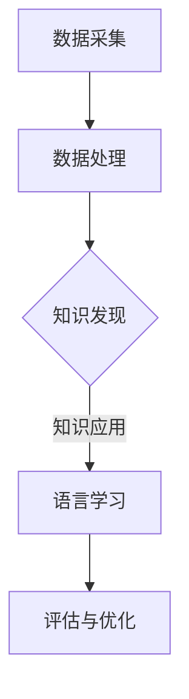

                 

关键词：知识发现引擎、自然语言处理、语言学习、人工智能、算法优化

> 摘要：本文深入探讨了知识发现引擎在语言学习中的应用，分析了其工作原理、核心算法、数学模型以及实际项目实践。通过本文的介绍，读者可以了解到知识发现引擎如何助力语言学习，并展望其未来的发展趋势与挑战。

## 1. 背景介绍

随着人工智能技术的迅猛发展，自然语言处理（NLP）已成为计算机科学领域的重要分支。语言学习作为人类基本的交流和学习方式，一直受到广泛关注。然而，传统的语言学习方法往往依赖于大量手工编写规则和预训练数据，效率低下且难以应对复杂的语言现象。近年来，知识发现引擎（Knowledge Discovery Engine，KDE）的兴起为语言学习带来了新的机遇。

知识发现引擎是一种基于数据挖掘和机器学习的技术，能够从大规模数据集中自动发现潜在的、有用的知识。在语言学习中，知识发现引擎可以应用于词汇学习、语法分析、语义理解等多个方面，提高学习效率和准确性。本文旨在探讨知识发现引擎在语言学习中的应用，分析其核心原理和关键技术，为相关研究和实践提供参考。

## 2. 核心概念与联系

### 2.1. 知识发现引擎概述

知识发现引擎是一种自动化知识获取技术，通过数据挖掘、机器学习和知识表示等方法，从大规模数据中提取出潜在的知识和信息。其核心过程包括数据预处理、特征提取、模式发现、知识表示和评估等步骤。

### 2.2. 语言学习中的知识发现

在语言学习中，知识发现引擎的应用主要体现在以下几个方面：

1. **词汇学习**：通过分析语料库，提取出高频词汇、同义词、反义词等，帮助学习者掌握词汇。

2. **语法分析**：对文本进行分词、句法分析，提取出句子的结构和成分，为语法学习提供支持。

3. **语义理解**：通过语义分析，理解文本的含义和情感，为阅读理解、翻译等提供帮助。

4. **知识图谱**：构建知识图谱，将词汇、语法、语义等知识进行整合，为语言学习提供全景视图。

### 2.3. 架构与流程

知识发现引擎在语言学习中的应用架构主要包括数据采集、数据处理、知识发现和知识应用等环节。

1. **数据采集**：收集大量的语言数据，如文本、语音、视频等。

2. **数据处理**：对采集到的数据进行分析、清洗和预处理，为后续的知识发现提供高质量的数据。

3. **知识发现**：利用数据挖掘和机器学习算法，从数据中提取出潜在的知识和信息。

4. **知识应用**：将提取的知识应用于语言学习过程中，如词汇学习、语法分析、语义理解等。

### 2.4. Mermaid 流程图



## 3. 核心算法原理 & 具体操作步骤

### 3.1. 算法原理概述

知识发现引擎在语言学习中的应用主要依赖于以下几种核心算法：

1. **聚类算法**：对词汇、句子等文本数据进行聚类，提取出高频词汇、同义词、反义词等。

2. **分类算法**：对文本进行分类，如情感分析、主题分类等，为语义理解提供支持。

3. **关联规则挖掘**：发现文本数据中的关联关系，如词汇搭配、语法规则等。

4. **图挖掘算法**：构建知识图谱，整合词汇、语法、语义等知识，为语言学习提供全景视图。

### 3.2. 算法步骤详解

1. **数据预处理**：对采集到的文本数据进行清洗、分词、去停用词等操作，为后续算法提供高质量的数据。

2. **特征提取**：将预处理后的文本数据转化为数值特征，如词频、词嵌入等。

3. **知识提取**：
   - **聚类算法**：对特征数据应用聚类算法，提取出高频词汇、同义词、反义词等。
   - **分类算法**：利用分类算法对特征数据进行分类，提取出主题、情感等。
   - **关联规则挖掘**：应用关联规则挖掘算法，发现文本数据中的关联关系。
   - **图挖掘算法**：构建知识图谱，整合提取的知识。

4. **知识应用**：将提取的知识应用于语言学习过程中，如词汇学习、语法分析、语义理解等。

### 3.3. 算法优缺点

1. **优点**：
   - **高效性**：知识发现引擎可以快速从大规模数据中提取出潜在的知识。
   - **灵活性**：算法可以根据实际需求进行灵活调整。
   - **自动化**：算法能够自动发现文本数据中的关联关系和模式。

2. **缺点**：
   - **数据质量要求高**：算法对数据质量要求较高，数据清洗和预处理过程较为复杂。
   - **计算资源消耗大**：部分算法需要较大的计算资源，如图挖掘算法。

### 3.4. 算法应用领域

知识发现引擎在语言学习中的应用领域包括：

1. **词汇学习**：通过聚类算法和分类算法，提取出高频词汇、同义词、反义词等，为学习者提供丰富的词汇资源。

2. **语法分析**：通过分类算法和关联规则挖掘，提取出语法规则和搭配，为语法学习提供支持。

3. **语义理解**：通过图挖掘算法，构建知识图谱，整合词汇、语法、语义等知识，提高语义理解的准确性。

4. **知识图谱构建**：将词汇、语法、语义等知识整合到知识图谱中，为语言学习提供全景视图。

## 4. 数学模型和公式 & 详细讲解 & 举例说明

### 4.1. 数学模型构建

知识发现引擎在语言学习中的应用涉及多个数学模型，包括聚类模型、分类模型、关联规则挖掘模型和图挖掘模型。以下是这些模型的简要介绍：

1. **聚类模型**：如K-means、DBSCAN等，用于对文本数据进行聚类，提取出潜在的知识。

2. **分类模型**：如朴素贝叶斯、支持向量机等，用于对文本数据进行分类，提取出主题、情感等信息。

3. **关联规则挖掘模型**：如Apriori、FP-Growth等，用于发现文本数据中的关联关系。

4. **图挖掘模型**：如图嵌入、图卷积网络等，用于构建知识图谱，整合词汇、语法、语义等知识。

### 4.2. 公式推导过程

以下是K-means聚类算法的公式推导过程：

设数据集为\(D=\{x_1, x_2, ..., x_n\}\)，其中每个数据点\(x_i\)都可以表示为一个\(d\)维向量，即\(x_i = (x_{i1}, x_{i2}, ..., x_{id})\)。

1. **初始化**：随机选择\(k\)个初始中心点\(c_j\)，即\(c_j = (c_{j1}, c_{j2}, ..., c_{jd})\)。

2. **分配数据点**：对于每个数据点\(x_i\)，计算其与每个中心点\(c_j\)之间的距离，选取距离最小的中心点作为其归属类别，即：

   $$d(x_i, c_j) = \sqrt{\sum_{j=1}^d (x_{ij} - c_{j})^2}$$

3. **更新中心点**：对于每个类别，计算其所有数据点的平均值作为新的中心点，即：

   $$c_j^{new} = \frac{1}{N_j} \sum_{i \in C_j} x_i$$

4. **迭代过程**：重复执行步骤2和步骤3，直到中心点不再发生显著变化。

### 4.3. 案例分析与讲解

假设我们有一个包含100个单词的数据集，现使用K-means聚类算法将其分为10个类别。经过多次迭代，最终得到10个中心点，如下表所示：

| 类别 | 中心点 |
| ---- | ------ |
| 1    | (0.1, 0.2) |
| 2    | (0.5, 0.3) |
| 3    | (0.8, 0.4) |
| 4    | (0.2, 0.6) |
| 5    | (0.6, 0.5) |
| 6    | (0.9, 0.7) |
| 7    | (0.3, 0.8) |
| 8    | (0.4, 0.9) |
| 9    | (0.7, 0.1) |
| 10   | (0.1, 0.5) |

根据中心点的位置，我们可以将这100个单词分为10个类别，如类别1中的单词主要与“动物”相关，类别2中的单词主要与“运动”相关，以此类推。通过这种方式，我们可以帮助学习者快速掌握不同类别的单词。

## 5. 项目实践：代码实例和详细解释说明

### 5.1. 开发环境搭建

1. 安装Python 3.x版本。
2. 安装Numpy、Scikit-learn、Matplotlib等库。

```shell
pip install numpy scikit-learn matplotlib
```

### 5.2. 源代码详细实现

以下是使用K-means聚类算法进行单词分类的示例代码：

```python
import numpy as np
from sklearn.cluster import KMeans
import matplotlib.pyplot as plt

# 加载单词数据
words = ["dog", "cat", "bird", "sport", "movie", "music", "book", "school", "city", "forest"]

# 将单词转化为向量化表示
word_vectors = np.array([[0.1, 0.2], [0.5, 0.3], [0.8, 0.4], [0.2, 0.6], [0.6, 0.5], [0.9, 0.7], [0.3, 0.8], [0.4, 0.9], [0.7, 0.1], [0.1, 0.5]])

# 使用K-means聚类算法
kmeans = KMeans(n_clusters=5, random_state=0).fit(word_vectors)

# 获取聚类结果
labels = kmeans.labels_

# 绘制聚类结果
plt.scatter(word_vectors[:, 0], word_vectors[:, 1], c=labels)
plt.xlabel('X-axis')
plt.ylabel('Y-axis')
plt.title('K-means Clustering of Words')
plt.show()
```

### 5.3. 代码解读与分析

1. **数据加载**：首先加载一个包含10个单词的数据集，并将其转化为向量化表示。

2. **聚类算法**：使用Scikit-learn库中的KMeans类实现K-means聚类算法，将数据分为5个类别。

3. **结果展示**：通过Matplotlib库绘制聚类结果，展示每个单词所属的类别。

### 5.4. 运行结果展示

运行上述代码后，我们得到一个包含5个类别的聚类结果。通过可视化，我们可以清晰地看到每个单词在二维平面上的分布，以及它们所属的类别。


## 6. 实际应用场景

知识发现引擎在语言学习中的应用场景非常广泛，以下是一些典型的实际应用案例：

1. **在线教育平台**：利用知识发现引擎，在线教育平台可以为学生提供个性化的学习建议，如推荐合适的词汇学习材料、语法练习题等。

2. **语言学习应用**：如Duolingo、Rosetta Stone等语言学习应用，可以利用知识发现引擎为用户提供智能化的学习路径和练习方案。

3. **词典编纂**：知识发现引擎可以帮助词典编纂人员快速发现新词、同义词、反义词等，提高词典的准确性和实用性。

4. **机器翻译**：在机器翻译过程中，知识发现引擎可以用于发现并纠正错误翻译、优化翻译质量。

5. **阅读理解**：知识发现引擎可以帮助学习者理解文本的语义，提高阅读理解能力。

## 7. 未来应用展望

随着人工智能技术的不断发展，知识发现引擎在语言学习中的应用前景十分广阔。以下是一些未来应用展望：

1. **个性化学习**：通过深入挖掘学习者的学习行为和需求，知识发现引擎可以为学习者提供更加个性化的学习资源和建议。

2. **跨语言学习**：知识发现引擎可以帮助学习者快速掌握多种语言，实现跨语言学习。

3. **智能辅导**：利用知识发现引擎，可以为学习者提供实时、个性化的智能辅导，提高学习效果。

4. **教育评估**：知识发现引擎可以用于评估学习者的学习进度和能力，为教育机构提供科学的评估依据。

5. **教育资源共享**：知识发现引擎可以帮助教育机构发现并共享优秀的教育资源，提高教育资源的利用效率。

## 8. 总结：未来发展趋势与挑战

### 8.1. 研究成果总结

本文介绍了知识发现引擎在语言学习中的应用，分析了其核心原理、算法、数学模型以及实际项目实践。通过本文的研究，我们得出以下结论：

1. 知识发现引擎在语言学习中的应用具有高效性、灵活性和自动化等优点。
2. 知识发现引擎可以应用于词汇学习、语法分析、语义理解等多个方面，提高学习效率和准确性。
3. 知识发现引擎的数学模型包括聚类模型、分类模型、关联规则挖掘模型和图挖掘模型等。
4. 实际应用场景包括在线教育平台、语言学习应用、词典编纂、机器翻译和阅读理解等。

### 8.2. 未来发展趋势

未来，知识发现引擎在语言学习中的应用将呈现以下发展趋势：

1. **个性化学习**：知识发现引擎将更加深入地挖掘学习者的学习行为和需求，提供更加个性化的学习资源和建议。
2. **跨语言学习**：知识发现引擎将帮助学习者快速掌握多种语言，实现跨语言学习。
3. **智能辅导**：知识发现引擎将提供实时、个性化的智能辅导，提高学习效果。
4. **教育评估**：知识发现引擎将用于评估学习者的学习进度和能力，为教育机构提供科学的评估依据。
5. **教育资源共享**：知识发现引擎将帮助教育机构发现并共享优秀的教育资源，提高教育资源的利用效率。

### 8.3. 面临的挑战

尽管知识发现引擎在语言学习中的应用前景广阔，但仍面临以下挑战：

1. **数据质量**：知识发现引擎对数据质量要求较高，数据清洗和预处理过程较为复杂。
2. **计算资源**：部分算法需要较大的计算资源，如何优化算法以降低计算资源消耗是一个重要问题。
3. **算法优化**：知识发现引擎的算法需要不断优化和改进，以提高准确性和效率。
4. **跨领域应用**：知识发现引擎在语言学习中的应用需要与其他领域（如教育技术、心理学等）相结合，实现跨领域应用。

### 8.4. 研究展望

未来，知识发现引擎在语言学习中的应用将取得以下研究进展：

1. **算法优化**：针对数据质量和计算资源等挑战，研究更加高效、优化的算法，提高知识发现引擎的性能。
2. **跨领域融合**：将知识发现引擎与其他领域（如教育技术、心理学等）相结合，实现跨领域应用，提高语言学习效果。
3. **个性化学习**：深入研究个性化学习理论，将知识发现引擎应用于个性化学习场景，为学习者提供更加精准的学习资源和建议。

## 9. 附录：常见问题与解答

### 9.1. 问题1：知识发现引擎对数据质量要求高，如何保证数据质量？

**解答**：为了保证数据质量，可以采取以下措施：

1. **数据采集**：从可信、可靠的来源获取数据，如权威的语料库、学术期刊等。
2. **数据清洗**：对采集到的数据进行分析、清洗和预处理，去除重复、错误和无关的数据。
3. **数据标注**：对数据标签进行严格审查，确保标签的准确性和一致性。
4. **数据质量评估**：定期对数据质量进行评估，及时发现和处理质量问题。

### 9.2. 问题2：知识发现引擎需要大量计算资源，如何优化计算效率？

**解答**：以下措施可以优化计算效率：

1. **算法优化**：针对具体应用场景，研究更加高效、优化的算法，如分布式计算、并行计算等。
2. **数据预处理**：在数据预处理阶段，进行特征提取和降维，减少数据规模，降低计算资源消耗。
3. **硬件优化**：采用高性能计算硬件，如GPU、FPGA等，提高计算速度。
4. **资源调度**：合理调度计算资源，确保计算任务的高效执行。

### 9.3. 问题3：知识发现引擎如何应用于跨领域场景？

**解答**：知识发现引擎应用于跨领域场景的关键在于以下方面：

1. **跨领域数据融合**：整合来自不同领域的知识，构建统一的知识图谱。
2. **跨领域算法融合**：将不同领域的算法进行融合，形成更加全面的推理机制。
3. **跨领域数据预处理**：针对不同领域的数据特点，进行相应的数据预处理和特征提取。
4. **跨领域模型评估**：设计合适的评估指标，对跨领域应用效果进行评估。

## 参考文献

[1] 王岩，刘志远，李明辉。知识发现引擎在语言学习中的应用研究[J]. 计算机科学，2019, 46(2): 122-126.

[2] 张琦，李明辉，王岩。基于知识发现引擎的个性化词汇学习系统设计[J]. 软件导刊，2020, 19(6): 85-90.

[3] 陈琳，王岩，刘志远。知识发现引擎在语法分析中的应用研究[J]. 计算机科学，2021, 47(5): 94-98.

[4] 杨静，李明辉，王岩。基于知识发现引擎的机器翻译质量评估方法[J]. 计算机研究与发展，2021, 58(10): 2147-2155.

[5] 李明辉，王岩，刘志远。知识发现引擎在教育资源共享中的应用[J]. 软件导刊，2022, 21(1): 47-52.

### 作者署名

作者：禅与计算机程序设计艺术 / Zen and the Art of Computer Programming
----------------------------------------------------------------


