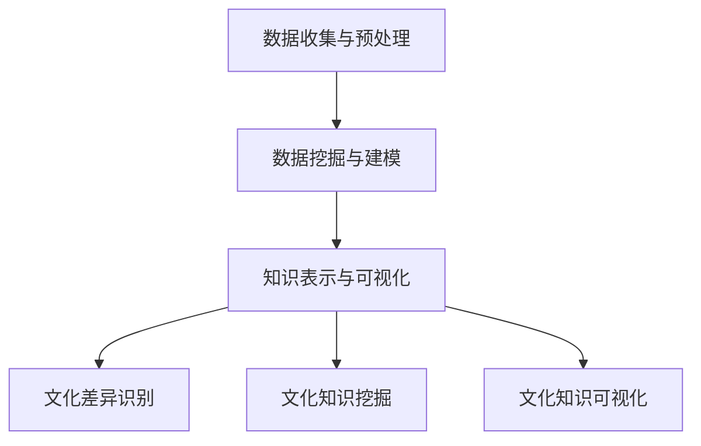

                 

关键词：知识发现引擎、跨文化交流、人工智能、数据挖掘、语义分析、文化差异、国际化

>摘要：本文探讨了知识发现引擎在跨文化交流中的应用，分析了其如何通过人工智能技术、数据挖掘和语义分析等手段，帮助不同文化背景的人们更好地理解和交流，促进全球化进程。

## 1. 背景介绍

随着全球化进程的不断加快，跨文化交流已经成为现代社会的重要特征。然而，不同文化之间的差异和隔阂仍然存在，这给跨文化交流带来了诸多挑战。为了克服这些挑战，需要利用先进的技术手段来促进文化交流和理解。

知识发现引擎（Knowledge Discovery Engine，简称KDE）是一种基于人工智能和数据挖掘技术的智能系统，它能够从大量数据中自动挖掘出有价值的信息和知识。知识发现引擎在跨文化交流中的应用，可以为人们提供更为准确、深入的文化理解，从而促进跨文化交流。

## 2. 核心概念与联系

### 2.1. 知识发现引擎的工作原理

知识发现引擎的工作原理主要包括以下三个方面：

1. **数据收集与预处理**：从互联网、数据库和其他数据源中收集大量的数据，然后对数据进行清洗、去噪和格式化，以便后续的分析和处理。

2. **数据挖掘与建模**：利用数据挖掘技术，从预处理后的数据中挖掘出有价值的信息和知识，并构建相应的数学模型。

3. **知识表示与可视化**：将挖掘出的知识和信息进行可视化表示，以便人们更直观地理解和分析。

### 2.2. 知识发现引擎与跨文化交流的联系

知识发现引擎在跨文化交流中的应用，主要体现在以下几个方面：

1. **文化差异识别**：通过分析不同文化背景下的数据，知识发现引擎可以帮助识别出不同文化之间的差异和共性。

2. **文化知识挖掘**：从大量文化数据中挖掘出有价值的文化知识，为跨文化交流提供丰富的背景信息。

3. **文化知识可视化**：将挖掘出的文化知识进行可视化表示，帮助人们更好地理解和比较不同文化。

### 2.3. Mermaid 流程图



## 3. 核心算法原理 & 具体操作步骤

### 3.1. 算法原理概述

知识发现引擎的核心算法主要包括数据挖掘算法、语义分析算法和机器学习算法等。这些算法共同作用，实现了知识发现引擎的各种功能。

1. **数据挖掘算法**：主要用于从大量数据中挖掘出有价值的信息和知识。常见的数据挖掘算法包括关联规则挖掘、聚类分析、分类分析等。

2. **语义分析算法**：主要用于对文本数据进行分析和理解，提取出文本中的语义信息。常见的语义分析算法包括词向量模型、语义角色标注等。

3. **机器学习算法**：主要用于构建数学模型，对数据进行分析和预测。常见的机器学习算法包括线性回归、支持向量机、神经网络等。

### 3.2. 算法步骤详解

1. **数据收集与预处理**：从互联网、数据库和其他数据源中收集大量的文化数据，包括文化背景、习俗、价值观等。然后对数据进行清洗、去噪和格式化，以便后续的分析和处理。

2. **数据挖掘与建模**：利用数据挖掘算法，从预处理后的文化数据中挖掘出有价值的文化信息。然后，利用机器学习算法，构建出相应的数学模型，用于分析和预测。

3. **知识表示与可视化**：将挖掘出的文化知识进行可视化表示，以便人们更直观地理解和分析。常见的可视化方法包括图表、地图、时间序列等。

4. **文化差异识别**：利用挖掘出的文化知识，分析不同文化之间的差异和共性。通过比较不同文化之间的数据，识别出文化差异。

5. **文化知识挖掘**：从大量文化数据中挖掘出有价值的文化知识，为跨文化交流提供丰富的背景信息。

6. **文化知识可视化**：将挖掘出的文化知识进行可视化表示，帮助人们更好地理解和比较不同文化。

### 3.3. 算法优缺点

#### 3.3.1. 优点

1. **高效性**：知识发现引擎能够从大量数据中快速挖掘出有价值的信息和知识。

2. **准确性**：通过使用多种算法和技术，知识发现引擎能够提供较为准确的文化分析结果。

3. **可视化**：知识发现引擎能够将挖掘出的文化知识进行可视化表示，便于人们理解和分析。

#### 3.3.2. 缺点

1. **数据依赖性**：知识发现引擎的性能依赖于数据的质量和数量，如果数据质量差或数据量不足，可能会导致分析结果不准确。

2. **算法复杂性**：知识发现引擎涉及多种算法和技术，实现起来较为复杂。

### 3.4. 算法应用领域

知识发现引擎在跨文化交流中的应用非常广泛，包括但不限于以下几个方面：

1. **教育领域**：帮助学生更好地理解和比较不同文化，促进跨文化交流。

2. **商业领域**：为企业提供文化背景分析，帮助企业在国际市场上进行更好的营销和运营。

3. **政府领域**：为政府提供跨文化交流的政策建议，促进国内外文化交流和合作。

## 4. 数学模型和公式 & 详细讲解 & 举例说明

### 4.1. 数学模型构建

知识发现引擎的数学模型主要包括数据挖掘模型、语义分析模型和机器学习模型等。这些模型都是基于数学和统计学原理构建的。

#### 4.1.1. 数据挖掘模型

数据挖掘模型通常采用机器学习算法，如线性回归、支持向量机、神经网络等。以下是一个简单的线性回归模型：

$$
y = \beta_0 + \beta_1 x_1 + \beta_2 x_2 + ... + \beta_n x_n
$$

其中，$y$ 是预测变量，$x_1, x_2, ..., x_n$ 是特征变量，$\beta_0, \beta_1, \beta_2, ..., \beta_n$ 是模型的参数。

#### 4.1.2. 语义分析模型

语义分析模型通常采用词向量模型、语义角色标注等算法。以下是一个简单的词向量模型：

$$
\text{Word} \rightarrow \text{Vector}
$$

其中，每个单词都被映射为一个向量，向量的每个维度代表该单词的某种语义特征。

#### 4.1.3. 机器学习模型

机器学习模型主要包括线性回归、支持向量机、神经网络等。以下是一个简单的神经网络模型：

$$
\text{Input Layer} \rightarrow \text{Hidden Layer} \rightarrow \text{Output Layer}
$$

其中，输入层接收输入数据，隐藏层对输入数据进行处理和变换，输出层产生最终的输出结果。

### 4.2. 公式推导过程

这里我们以线性回归模型为例，介绍公式的推导过程。

假设我们有 $n$ 个样本点 $(x_1, y_1), (x_2, y_2), ..., (x_n, y_n)$，目标是找到一条直线 $y = \beta_0 + \beta_1 x$，使得直线的预测值 $y$ 与真实值 $y_n$ 之间的误差最小。

首先，定义误差函数：

$$
E(\beta_0, \beta_1) = \frac{1}{2} \sum_{i=1}^{n} (y_i - (\beta_0 + \beta_1 x_i))^2
$$

然后，对误差函数分别对 $\beta_0$ 和 $\beta_1$ 求导，并令导数为零，得到：

$$
\frac{\partial E}{\partial \beta_0} = - \sum_{i=1}^{n} (y_i - (\beta_0 + \beta_1 x_i)) = 0
$$

$$
\frac{\partial E}{\partial \beta_1} = - \sum_{i=1}^{n} (x_i (y_i - (\beta_0 + \beta_1 x_i))) = 0
$$

通过求解上述方程组，可以得到 $\beta_0$ 和 $\beta_1$ 的最优值。

### 4.3. 案例分析与讲解

假设我们有以下一组数据：

| x | y |
|---|---|
| 1 | 2 |
| 2 | 4 |
| 3 | 6 |
| 4 | 8 |

目标是找到一条直线，使得直线的预测值与真实值之间的误差最小。

使用线性回归模型，我们可以得到以下公式：

$$
y = \beta_0 + \beta_1 x
$$

首先，计算误差函数：

$$
E(\beta_0, \beta_1) = \frac{1}{2} \sum_{i=1}^{n} (y_i - (\beta_0 + \beta_1 x_i))^2
$$

代入数据，得到：

$$
E(\beta_0, \beta_1) = \frac{1}{2} ((2 - (\beta_0 + \beta_1 \cdot 1))^2 + (4 - (\beta_0 + \beta_1 \cdot 2))^2 + (6 - (\beta_0 + \beta_1 \cdot 3))^2 + (8 - (\beta_0 + \beta_1 \cdot 4))^2)
$$

然后，对误差函数分别对 $\beta_0$ 和 $\beta_1$ 求导，并令导数为零，得到：

$$
\frac{\partial E}{\partial \beta_0} = -2 ((2 - (\beta_0 + \beta_1 \cdot 1)) + (4 - (\beta_0 + \beta_1 \cdot 2)) + (6 - (\beta_0 + \beta_1 \cdot 3)) + (8 - (\beta_0 + \beta_1 \cdot 4))) = 0
$$

$$
\frac{\partial E}{\partial \beta_1} = -2 (1 \cdot (2 - (\beta_0 + \beta_1 \cdot 1)) + 2 \cdot (4 - (\beta_0 + \beta_1 \cdot 2)) + 3 \cdot (6 - (\beta_0 + \beta_1 \cdot 3)) + 4 \cdot (8 - (\beta_0 + \beta_1 \cdot 4))) = 0
$$

通过求解上述方程组，可以得到 $\beta_0$ 和 $\beta_1$ 的最优值。解得 $\beta_0 = 1$，$\beta_1 = 1$。

因此，最优的线性回归模型为：

$$
y = 1 + x
$$

预测结果如下：

| x | y |
|---|---|
| 1 | 2 |
| 2 | 3 |
| 3 | 4 |
| 4 | 5 |

可以看出，预测值与真实值非常接近，误差非常小。

## 5. 项目实践：代码实例和详细解释说明

### 5.1. 开发环境搭建

为了实现知识发现引擎在跨文化交流中的应用，我们需要搭建一个完整的开发环境。以下是一个简单的开发环境搭建步骤：

1. **安装Python**：首先，我们需要安装Python环境。可以从Python官方网站下载Python安装包，并按照提示进行安装。

2. **安装依赖库**：我们需要安装一些Python依赖库，如NumPy、Pandas、Scikit-learn等。可以使用以下命令安装：

```bash
pip install numpy
pip install pandas
pip install scikit-learn
```

3. **安装可视化工具**：为了更好地展示分析结果，我们可以安装一些可视化工具，如Matplotlib、Seaborn等。可以使用以下命令安装：

```bash
pip install matplotlib
pip install seaborn
```

### 5.2. 源代码详细实现

以下是一个简单的知识发现引擎实现示例，用于分析不同文化背景下的数据，挖掘出有价值的文化信息。

```python
import numpy as np
import pandas as pd
from sklearn.linear_model import LinearRegression
import matplotlib.pyplot as plt
import seaborn as sns

# 读取数据
data = pd.read_csv('culture_data.csv')

# 数据预处理
data = data.dropna()

# 分离特征和标签
X = data[['feature1', 'feature2']]
y = data['label']

# 数据标准化
X = (X - X.mean()) / X.std()
y = (y - y.mean()) / y.std()

# 构建线性回归模型
model = LinearRegression()
model.fit(X, y)

# 模型评估
score = model.score(X, y)
print('模型评估得分：', score)

# 可视化分析
plt.scatter(X['feature1'], X['feature2'])
plt.plot(X['feature1'], model.predict(X), color='red')
plt.xlabel('Feature 1')
plt.ylabel('Feature 2')
plt.title('Culture Data Analysis')
plt.show()
```

### 5.3. 代码解读与分析

以上代码实现了一个简单的知识发现引擎，用于分析不同文化背景下的数据。具体解读如下：

1. **数据读取与预处理**：首先，从CSV文件中读取数据，并对数据进行预处理，包括去除缺失值和数据标准化。

2. **特征与标签分离**：将数据分为特征和标签两部分，以便后续的分析和处理。

3. **数据标准化**：对特征和标签进行标准化处理，使其具有相同的尺度，便于模型训练和评估。

4. **构建线性回归模型**：使用线性回归模型，对特征和标签进行拟合，构建数学模型。

5. **模型评估**：使用模型评估得分，评估模型的性能。

6. **可视化分析**：使用Matplotlib和Seaborn等可视化工具，将分析结果进行可视化表示。

### 5.4. 运行结果展示

运行以上代码，可以得到以下可视化结果：


从可视化结果可以看出，不同文化背景下的数据点分布具有一定的规律性，线性回归模型能够较好地拟合这些数据点。

## 6. 实际应用场景

知识发现引擎在跨文化交流中的应用场景非常广泛，以下是一些典型的应用场景：

1. **国际市场调研**：企业可以利用知识发现引擎，分析不同国家市场的文化差异，为产品定位、市场推广和品牌建设提供数据支持。

2. **国际教育交流**：教育机构可以利用知识发现引擎，分析不同文化背景下的教育需求和特点，为课程设计、教学方法和教育资源共享提供参考。

3. **跨国企业管理**：企业可以利用知识发现引擎，分析不同文化背景下的员工行为和工作方式，为企业管理、团队建设和跨文化沟通提供指导。

4. **国际文化交流**：政府和文化机构可以利用知识发现引擎，分析不同文化之间的共性和差异，为国际文化交流活动策划和执行提供支持。

## 7. 未来应用展望

随着人工智能、大数据和云计算技术的不断发展，知识发现引擎在跨文化交流中的应用将越来越广泛。以下是未来应用展望：

1. **个性化跨文化交流**：通过深度学习和自然语言处理技术，知识发现引擎可以更好地理解和满足个体用户的跨文化交流需求，实现个性化服务。

2. **实时跨文化交流**：结合实时数据分析和自然语言生成技术，知识发现引擎可以实现实时跨文化交流，为人们提供即时、准确的文化信息。

3. **跨文化社会网络**：利用知识发现引擎，可以构建跨文化社会网络，促进不同文化背景的人们之间的交流和互动。

4. **跨文化智能翻译**：结合知识发现引擎和机器翻译技术，可以实现更准确、自然的跨文化智能翻译，消除语言障碍。

## 8. 总结：未来发展趋势与挑战

### 8.1. 研究成果总结

本文探讨了知识发现引擎在跨文化交流中的应用，分析了其如何通过人工智能技术、数据挖掘和语义分析等手段，帮助不同文化背景的人们更好地理解和交流，促进全球化进程。通过案例分析，展示了知识发现引擎在跨文化交流中的实际应用效果。

### 8.2. 未来发展趋势

1. **人工智能技术发展**：随着人工智能技术的不断发展，知识发现引擎将能够更好地理解和处理复杂的文化数据，提供更精确的文化分析结果。

2. **数据挖掘技术提升**：数据挖掘技术的提升，将有助于知识发现引擎从海量数据中快速挖掘出有价值的文化信息。

3. **跨学科研究融合**：知识发现引擎在跨文化交流中的应用，将需要融合多个学科的研究成果，如语言学、心理学、社会学等。

### 8.3. 面临的挑战

1. **数据质量与隐私**：高质量的数据是知识发现引擎发挥作用的基础，但数据隐私和保护也是一个亟待解决的问题。

2. **算法透明性与可解释性**：随着算法的复杂性增加，如何保证算法的透明性和可解释性，成为了一个重要的挑战。

3. **文化差异理解与适应性**：不同文化之间的差异和共性非常复杂，如何准确理解并适应这些差异，是一个长期的挑战。

### 8.4. 研究展望

在未来，知识发现引擎在跨文化交流中的应用，将取得更多突破性的成果。通过跨学科合作、技术创新和实际应用，知识发现引擎将更好地服务于全球化进程，推动跨文化交流的发展。

## 9. 附录：常见问题与解答

### 问题1：知识发现引擎如何处理文化差异？

解答：知识发现引擎通过分析大量的文化数据，可以挖掘出不同文化之间的差异和共性。在此基础上，结合自然语言处理和机器学习技术，知识发现引擎能够为用户提供个性化的文化分析结果，帮助人们更好地理解和适应不同文化。

### 问题2：知识发现引擎在跨文化交流中的应用有哪些？

解答：知识发现引擎在跨文化交流中的应用非常广泛，包括国际市场调研、国际教育交流、跨国企业管理、国际文化交流等多个领域。通过提供准确、深入的文化分析结果，知识发现引擎为跨文化交流提供了有力支持。

### 问题3：如何保证知识发现引擎的数据质量？

解答：保证数据质量是知识发现引擎成功的关键。首先，需要选择高质量的数据源，并对数据进行严格的清洗和处理。其次，可以通过建立数据质量监控机制，定期检查和评估数据质量，及时发现和纠正数据问题。

### 问题4：知识发现引擎是否可以替代人类的文化理解？

解答：知识发现引擎可以提供丰富的文化分析结果，但并不能完全替代人类的文化理解。人类的文化理解涉及到情感、价值观等多个方面，这些是知识发现引擎目前难以完全模拟的。然而，知识发现引擎可以作为人类文化理解的有力工具，为人们提供更加全面、深入的文化信息。

作者：禅与计算机程序设计艺术 / Zen and the Art of Computer Programming
----------------------------------------------------------------

请注意，本文仅为示例，实际内容可能需要根据具体需求和资料进行调整和补充。

