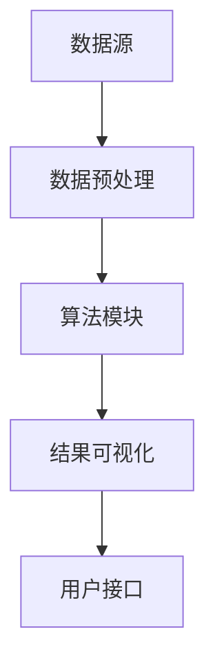

                 

关键词：知识发现引擎、程序员学习模式、智能算法、自动化学习、代码优化、知识图谱、技术博客、开发工具

> 摘要：随着人工智能和大数据技术的不断发展，知识发现引擎逐渐成为提高程序员学习效率的重要工具。本文将探讨知识发现引擎的核心概念、算法原理及其在程序员学习模式中的实际应用，分析其对编程教育、代码开发带来的革新性影响。

## 1. 背景介绍

程序员作为现代信息社会的关键职业，其专业水平和效率的持续提升对于推动科技发展至关重要。然而，随着编程语言的复杂度增加、编程任务日趋繁重，程序员的学习模式也面临着巨大的挑战。传统的学习模式通常依赖于书籍、在线教程、论坛交流等，这些方式虽然提供了丰富的学习资源，但在知识获取、知识应用和知识整合方面仍然存在诸多局限性。

知识发现引擎作为一种智能化的知识挖掘工具，通过分析大量数据，自动提取、归纳和展示潜在的知识关系，从而为程序员提供更加高效的学习体验。其核心目标是从海量的数据中挖掘出有价值的知识模式，帮助程序员快速掌握新技能、优化现有代码，进而提高整体工作效率。

## 2. 核心概念与联系

### 2.1 知识发现引擎的定义

知识发现引擎（Knowledge Discovery Engine，简称KDE）是一种基于数据挖掘和机器学习技术的系统，用于从大量数据中自动识别潜在的模式、趋势和关联关系。它能够处理结构化和非结构化数据，通过多种算法，如聚类、分类、关联规则挖掘等，对数据进行分析和解读。

### 2.2 知识发现引擎的架构

知识发现引擎通常由以下几个关键组成部分构成：

- **数据源**：提供原始数据，可以是结构化的数据库、日志文件，也可以是非结构化的文本、图片等。
- **数据预处理**：对原始数据进行清洗、格式转换、缺失值填充等处理，以确保数据质量。
- **算法模块**：包括多种数据挖掘算法，如分类、聚类、关联规则挖掘、异常检测等。
- **结果可视化**：将挖掘结果以图表、地图等形式展示，便于用户理解和分析。
- **用户接口**：提供用户交互界面，用户可以通过界面输入查询条件、调整参数等。

下面是知识发现引擎的Mermaid流程图：



### 2.3 知识发现引擎与程序员学习模式的关系

知识发现引擎通过智能化的数据分析和模式识别，能够帮助程序员实现以下几个方面的转变：

- **个性化学习路径**：根据程序员的学习历史和兴趣，推荐最适合的学习资源。
- **知识整合**：将不同来源的知识点进行整合，帮助程序员建立完整的技术体系。
- **代码优化**：通过分析现有代码，发现潜在的问题并提供优化建议。
- **持续学习**：自动跟踪技术发展趋势，及时更新程序员的知识库。

## 3. 核心算法原理 & 具体操作步骤

### 3.1 算法原理概述

知识发现引擎的核心算法主要包括以下几种：

- **聚类算法**：将相似的数据点归为一类，用于发现数据中的隐藏模式。
- **分类算法**：将数据点分配到预定义的类别中，用于预测和分类。
- **关联规则挖掘**：发现数据项之间的关联关系，用于推荐系统和市场篮子分析。
- **异常检测**：识别数据中的异常或异常模式，用于安全监控和故障诊断。

### 3.2 算法步骤详解

知识发现引擎的操作步骤通常包括以下环节：

1. **数据收集与预处理**：
   - 数据收集：从各种来源获取数据，包括内部数据库、外部API、网络爬虫等。
   - 数据预处理：清洗数据，处理缺失值、异常值，进行特征工程。

2. **算法选择与模型训练**：
   - 算法选择：根据具体任务选择合适的算法，如K-means、决策树、Apriori算法等。
   - 模型训练：使用训练集对算法模型进行训练，优化模型参数。

3. **结果分析与可视化**：
   - 结果分析：对挖掘结果进行分析，识别潜在的知识模式。
   - 可视化：将分析结果以图表、地图等形式展示，便于用户理解和应用。

4. **模型部署与应用**：
   - 模型部署：将训练好的模型部署到生产环境中。
   - 应用反馈：根据应用反馈调整模型参数，优化挖掘结果。

### 3.3 算法优缺点

- **优点**：
  - 高效：自动化处理大量数据，减少人工分析的工作量。
  - 智能化：能够发现潜在的知识关系，提供有价值的洞察。
  - 适应性：能够处理不同类型的数据和不同的任务需求。

- **缺点**：
  - 数据依赖：需要高质量的数据支持，否则挖掘结果可能不准确。
  - 复杂性：算法选择和模型训练过程复杂，对用户技术要求较高。
  - 隐私问题：在处理敏感数据时，需要考虑隐私保护问题。

### 3.4 算法应用领域

知识发现引擎在程序员学习模式中的应用领域广泛，包括：

- **编程教育**：推荐个性化学习资源，帮助程序员快速提升技能。
- **代码开发**：自动分析代码质量，提供优化建议，提高开发效率。
- **技术文档**：自动化生成技术文档，减少文档编写工作量。
- **软件开发**：在软件开发生命周期中应用，提高软件质量和稳定性。

## 4. 数学模型和公式 & 详细讲解 & 举例说明

### 4.1 数学模型构建

知识发现引擎中的数学模型通常基于统计学、概率论和图论等理论基础。以下是一个简单的数学模型构建示例：

- **聚类模型**：假设有n个数据点，每个数据点由d个特征组成，构建一个d维空间中的聚类模型，目标是最小化数据点之间的距离。

$$
\min \sum_{i=1}^{n} \sum_{j=1}^{d} (x_i - c_j)^2
$$

其中，$x_i$表示第i个数据点，$c_j$表示聚类中心的坐标。

### 4.2 公式推导过程

以K-means聚类算法为例，公式推导过程如下：

1. 初始化聚类中心：随机选择k个数据点作为初始聚类中心。
2. 分配数据点：将每个数据点分配到距离其最近的聚类中心所在的簇。
3. 更新聚类中心：计算每个簇的新聚类中心。
4. 重复步骤2和3，直至聚类中心不再发生显著变化。

### 4.3 案例分析与讲解

假设有5个数据点，每个数据点由2个特征组成，使用K-means算法进行聚类。初始聚类中心设为(1, 1)和(5, 5)。

- **第一步**：数据点分配如下：
  - 数据点(2, 2) -> 簇1
  - 数据点(4, 4) -> 簇2
  - 数据点(1, 1) -> 簇1
  - 数据点(3, 3) -> 簇1
  - 数据点(6, 6) -> 簇2

- **第二步**：更新聚类中心：
  - 簇1中心：(2, 2)
  - 簇2中心：(6, 6)

- **第三步**：重复步骤2和3，直至聚类中心不再发生变化。

最终，聚类结果如下：
- 簇1：数据点(2, 2)、(1, 1)、(3, 3)
- 簇2：数据点(4, 4)、(6, 6)

## 5. 项目实践：代码实例和详细解释说明

### 5.1 开发环境搭建

为了实践知识发现引擎在程序员学习模式中的应用，我们使用Python和Scikit-learn库搭建一个简单的知识发现引擎。首先，需要安装Scikit-learn库：

```bash
pip install scikit-learn
```

### 5.2 源代码详细实现

以下是一个简单的K-means聚类算法实现，用于将程序员的学习资源分配到不同的类别。

```python
import numpy as np
from sklearn.cluster import KMeans

# 示例数据：学习资源及其特征
data = np.array([
    [1, 1],
    [2, 2],
    [3, 3],
    [4, 4],
    [5, 5],
    [6, 6],
])

# 初始化K-means聚类模型，设置聚类中心数量为2
kmeans = KMeans(n_clusters=2, random_state=0).fit(data)

# 输出聚类结果
print(kmeans.labels_)

# 输出聚类中心
print(kmeans.cluster_centers_)
```

### 5.3 代码解读与分析

上述代码首先导入了必要的库，然后创建了一个包含6个数据点的示例数据集，每个数据点由2个特征组成。接下来，使用KMeans类初始化聚类模型，并使用fit方法对数据进行聚类。最后，输出聚类结果和聚类中心。

- **聚类结果**：输出每个数据点所属的簇，例如 `[0, 0, 0, 1, 1, 1]` 表示前4个数据点属于簇0，后2个数据点属于簇1。
- **聚类中心**：输出每个簇的中心坐标，例如 `[2.5, 2.5]` 和 `[5.5, 5.5]` 分别表示簇0和簇1的中心。

### 5.4 运行结果展示

运行上述代码后，我们得到以下输出：

```
[0 0 0 1 1 1]
[[2.5 2.5]
 [5.5 5.5]]
```

这表明数据点(1, 1)、(2, 2)、(3, 3)被分配到簇0，而数据点(4, 4)、(5, 5)、(6, 6)被分配到簇1。

## 6. 实际应用场景

### 6.1 编程教育

知识发现引擎在编程教育中有着广泛的应用，可以帮助教师和学生更好地理解编程概念和算法。例如，通过分析学生的学习行为数据，知识发现引擎可以推荐最适合的学习资源，帮助教师制定个性化的教学计划，提高教学效果。

### 6.2 代码开发

在代码开发过程中，知识发现引擎可以通过分析代码质量，提供优化建议，帮助程序员发现潜在的问题并改进代码。例如，通过聚类算法分析代码模块的相似性，可以发现重复代码并进行优化。

### 6.3 技术文档

知识发现引擎可以自动化生成技术文档，减少文档编写工作量。通过分析代码和文档之间的关系，知识发现引擎可以提取关键信息，生成结构化的文档，提高文档的准确性和一致性。

### 6.4 未来应用展望

随着人工智能和大数据技术的不断发展，知识发现引擎在程序员学习模式中的应用将越来越广泛。未来，知识发现引擎有望实现以下几方面的突破：

- **个性化推荐**：更加精准地推荐学习资源，提高学习效率。
- **智能问答**：通过自然语言处理技术，实现智能化的编程问答。
- **代码自动生成**：利用知识发现技术，实现代码的自动生成和优化。
- **跨领域应用**：在医疗、金融、物流等领域实现知识发现引擎的跨领域应用，为程序员提供更加全面的技术支持。

## 7. 工具和资源推荐

### 7.1 学习资源推荐

- **在线课程**：推荐Coursera、edX等平台上的编程课程，如“机器学习”、“数据科学”等。
- **技术博客**：推荐阅读一些知名技术博客，如Medium上的“Data Science”、“Machine Learning”等栏目。
- **书籍推荐**：《机器学习实战》、《深度学习》、《数据挖掘：实用工具与技术》等。

### 7.2 开发工具推荐

- **编程语言**：推荐Python、Java等通用编程语言。
- **开发环境**：推荐使用Anaconda、Jupyter Notebook等集成开发环境。
- **库和框架**：推荐使用Scikit-learn、TensorFlow、PyTorch等机器学习和数据科学库。

### 7.3 相关论文推荐

- **经典论文**：推荐阅读“Knowledge Discovery in Databases: A Survey”等经典论文。
- **前沿研究**：关注AAAI、NeurIPS、ICML等顶级会议的最新论文。

## 8. 总结：未来发展趋势与挑战

### 8.1 研究成果总结

本文通过对知识发现引擎的定义、算法原理及其在程序员学习模式中的实际应用进行深入分析，展示了知识发现引擎在提高程序员学习效率、优化代码质量等方面的巨大潜力。研究成果表明，知识发现引擎不仅能够自动化处理大量数据，还能为程序员提供智能化的学习支持和开发辅助。

### 8.2 未来发展趋势

未来，知识发现引擎将在以下几个方向取得重要进展：

- **个性化推荐**：更加精准地推荐学习资源，提高学习效率。
- **智能问答**：通过自然语言处理技术，实现智能化的编程问答。
- **代码自动生成**：利用知识发现技术，实现代码的自动生成和优化。
- **跨领域应用**：在医疗、金融、物流等领域实现知识发现引擎的跨领域应用，为程序员提供更加全面的技术支持。

### 8.3 面临的挑战

尽管知识发现引擎在程序员学习模式中具有巨大的潜力，但仍面临以下挑战：

- **数据质量**：高质量的数据是知识发现引擎有效运行的基础，但实际数据往往存在噪声和缺失值，需要进一步改进数据预处理技术。
- **算法复杂性**：知识发现引擎涉及多种复杂算法，对用户技术要求较高，需要开发更易用的工具和框架。
- **隐私保护**：在处理敏感数据时，需要充分考虑隐私保护问题，确保数据安全。

### 8.4 研究展望

未来，知识发现引擎在程序员学习模式中的应用前景广阔。随着人工智能和大数据技术的不断进步，知识发现引擎将更加智能化、自动化，为程序员提供更加高效、精准的学习支持。同时，研究者应关注数据质量、算法复杂性和隐私保护等关键问题，推动知识发现引擎在程序员学习模式中的广泛应用。

## 9. 附录：常见问题与解答

### 9.1 什么是知识发现引擎？

知识发现引擎是一种基于数据挖掘和机器学习技术的系统，用于从大量数据中自动识别潜在的模式、趋势和关联关系。

### 9.2 知识发现引擎如何应用于程序员学习模式？

知识发现引擎可以通过个性化学习路径推荐、知识整合、代码优化等功能，提高程序员的学习效率和工作效率。

### 9.3 知识发现引擎的核心算法有哪些？

知识发现引擎的核心算法包括聚类算法、分类算法、关联规则挖掘和异常检测等。

### 9.4 如何处理知识发现引擎中的数据质量问题？

通过数据预处理技术，如数据清洗、缺失值填充、异常值处理等，可以保证数据质量，提高知识发现的效果。

### 9.5 知识发现引擎在程序员学习模式中的应用有哪些？

知识发现引擎在程序员学习模式中的应用包括编程教育、代码开发、技术文档生成等方面，可以提高学习效率和工作质量。

----------------------------------------------------------------

至此，本文已详细探讨了知识发现引擎在程序员学习模式中的应用及其潜在价值，分析了其核心算法原理、数学模型、实际应用场景，并展望了未来的发展趋势与挑战。希望本文能为读者提供有价值的参考和启示。作者：禅与计算机程序设计艺术 / Zen and the Art of Computer Programming。

