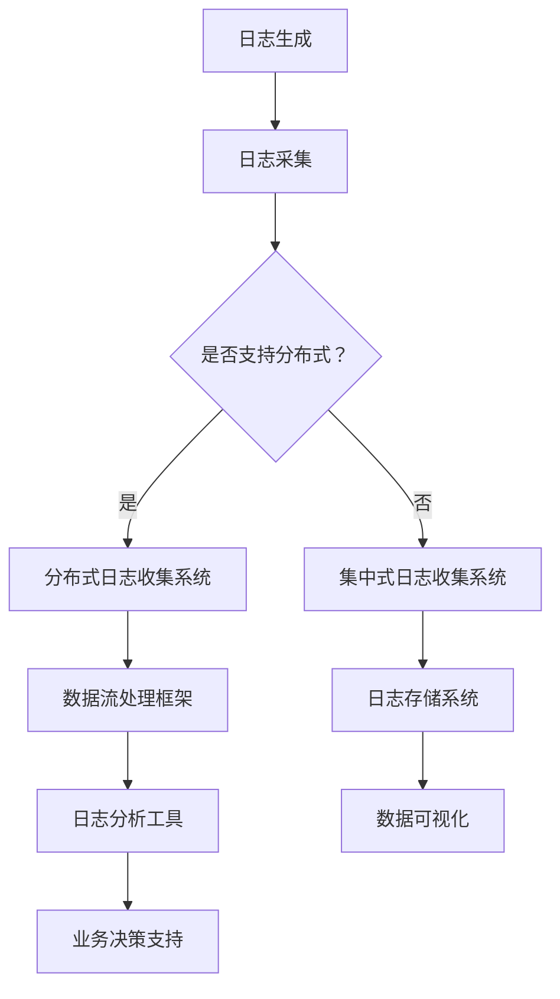

                 

关键词：知识发现、分布式系统、日志收集、大数据处理、性能优化、算法原理、数学模型、应用实例

## 摘要

本文旨在探讨知识发现引擎中的分布式日志收集系统。随着大数据时代的到来，如何高效地收集、处理和分析海量日志数据成为关键问题。本文将详细阐述分布式日志收集系统的核心概念、算法原理、数学模型及其在实际项目中的应用。通过本文的阅读，读者将对分布式日志收集系统有一个全面而深入的理解，从而为未来相关项目的开发提供有力支持。

## 1. 背景介绍

在当今信息技术高度发达的时代，企业对于数据的需求日益增长。日志数据作为系统运行的重要记录，包含着丰富的业务信息。通过对日志数据的分析，企业能够发现潜在的问题，优化系统性能，提升用户体验。然而，随着系统的复杂度和规模不断增大，传统的集中式日志收集方式已难以满足需求。分布式日志收集系统应运而生，成为大数据处理领域的重要解决方案。

分布式日志收集系统通过将日志数据分散收集、存储和处理，提高了系统的可扩展性和容错能力。同时，借助分布式计算框架，日志数据处理效率得到了显著提升。本文将围绕分布式日志收集系统的核心架构、算法原理和数学模型进行深入探讨，旨在为相关研究和应用提供理论依据和实践指导。

## 2. 核心概念与联系

### 2.1 分布式日志收集系统

分布式日志收集系统（Distributed Log Collection System）是一种基于分布式架构的日志收集解决方案。它通过将日志数据分散到多个节点进行收集、存储和处理，从而实现高效、可靠的数据处理能力。

### 2.2 数据流处理框架

数据流处理框架（Data Flow Processing Framework）是分布式日志收集系统的核心技术之一。它负责将日志数据从源端传输到处理节点，并进行实时处理和存储。常见的数据流处理框架包括Apache Kafka、Apache Flink和Apache Storm等。

### 2.3 日志数据格式

日志数据格式（Log Data Format）是分布式日志收集系统的基础。常见的日志数据格式包括JSON、XML和CSV等。合理的数据格式有助于提高日志数据的可读性和可处理性。

### 2.4 分布式存储系统

分布式存储系统（Distributed Storage System）是分布式日志收集系统的关键组件之一。它负责存储和处理海量日志数据。常见的分布式存储系统包括Hadoop HDFS、Apache HBase和Cassandra等。

### 2.5 分布式计算框架

分布式计算框架（Distributed Computing Framework）是分布式日志收集系统的核心。它负责对日志数据进行计算和分析，从而提取有价值的信息。常见的分布式计算框架包括MapReduce、Spark和Flink等。

### 2.6 Mermaid 流程图

Mermaid 是一种基于 Markdown 的图形绘制工具，可以用于绘制 Mermaid 流程图。以下是分布式日志收集系统的 Mermaid 流程图：



## 3. 核心算法原理 & 具体操作步骤

### 3.1 算法原理概述

分布式日志收集系统采用了一系列核心算法来实现日志数据的采集、传输、存储和处理。这些算法包括但不限于：

- **日志采集算法**：用于从各个日志源端采集日志数据。
- **数据传输算法**：用于将日志数据传输到分布式存储系统和数据流处理框架。
- **日志压缩算法**：用于减少日志数据的存储空间，提高存储效率。
- **日志去重算法**：用于去除重复的日志数据，避免重复处理。

### 3.2 算法步骤详解

#### 3.2.1 日志采集算法

日志采集算法的主要步骤如下：

1. **配置采集源**：配置日志采集源，包括日志文件路径、采集频率等。
2. **启动采集任务**：根据配置启动日志采集任务。
3. **读取日志数据**：从日志源读取日志数据。
4. **数据预处理**：对日志数据进行预处理，如去除空格、格式化等。
5. **数据压缩**：对日志数据进行压缩，减少存储空间。
6. **数据去重**：对日志数据进行去重处理，避免重复处理。

#### 3.2.2 数据传输算法

数据传输算法的主要步骤如下：

1. **连接数据流处理框架**：连接数据流处理框架，如 Kafka、Flink 等。
2. **发送日志数据**：将日志数据发送到数据流处理框架。
3. **数据传输确认**：确认日志数据是否成功发送到数据流处理框架。
4. **数据传输重试**：在数据传输失败时，进行重试处理。

#### 3.2.3 日志压缩算法

日志压缩算法的主要步骤如下：

1. **选择压缩算法**：根据日志数据的特点选择合适的压缩算法，如 GZIP、BZIP2 等。
2. **压缩日志数据**：对日志数据进行压缩处理。
3. **存储压缩数据**：将压缩后的日志数据存储到分布式存储系统。

#### 3.2.4 日志去重算法

日志去重算法的主要步骤如下：

1. **读取日志数据**：读取分布式存储系统中的日志数据。
2. **去重处理**：对日志数据进行去重处理，识别并去除重复数据。
3. **更新存储数据**：将去重后的日志数据更新到分布式存储系统。

### 3.3 算法优缺点

#### 优点：

1. **高效性**：分布式日志收集系统能够高效地处理海量日志数据，提高系统性能。
2. **可扩展性**：分布式架构使得系统能够轻松扩展，满足不断增长的数据需求。
3. **容错能力**：分布式系统具有较高的容错能力，能够保证数据的安全性和可靠性。

#### 缺点：

1. **复杂性**：分布式日志收集系统的设计和实现较为复杂，需要专业的技术团队。
2. **维护成本**：分布式系统的维护成本较高，需要投入大量的人力、物力和财力。

### 3.4 算法应用领域

分布式日志收集系统在多个领域有着广泛的应用：

1. **互联网企业**：互联网企业通过分布式日志收集系统，对海量日志数据进行分析，优化系统性能，提升用户体验。
2. **金融行业**：金融行业通过分布式日志收集系统，实时监控交易数据，确保交易安全，防范风险。
3. **电信行业**：电信行业通过分布式日志收集系统，对网络日志进行分析，优化网络性能，提高服务质量。
4. **政府部门**：政府部门通过分布式日志收集系统，对公共数据进行分析，为政策制定提供数据支持。

## 4. 数学模型和公式 & 详细讲解 & 举例说明

### 4.1 数学模型构建

分布式日志收集系统的数学模型主要包括以下几个部分：

1. **日志数据生成模型**：用于描述日志数据生成的概率分布。
2. **数据流处理模型**：用于描述数据流处理的过程和性能。
3. **日志压缩模型**：用于描述日志数据的压缩性能。
4. **日志去重模型**：用于描述日志数据的去重效果。

### 4.2 公式推导过程

#### 4.2.1 日志数据生成模型

假设日志数据服从泊松分布，其生成概率密度函数为：

$$
f(x|\lambda) = \frac{\lambda^x e^{-\lambda}}{x!}
$$

其中，\( x \) 为日志数据生成的次数，\( \lambda \) 为泊松率。

#### 4.2.2 数据流处理模型

数据流处理模型可以用以下公式描述：

$$
P(t) = \frac{1}{1-e^{-\lambda t}}
$$

其中，\( t \) 为数据流处理时间，\( \lambda \) 为数据生成速率。

#### 4.2.3 日志压缩模型

假设日志数据经过压缩后的长度为 \( L_c \)，原始日志数据的长度为 \( L_o \)，压缩率 \( R \) 定义为：

$$
R = \frac{L_o}{L_c}
$$

#### 4.2.4 日志去重模型

假设日志数据中存在 \( k \) 个重复数据，去重后的日志数据长度为 \( L_d \)，去重率 \( D \) 定义为：

$$
D = \frac{L_d}{L_o - k}
$$

### 4.3 案例分析与讲解

#### 案例背景

某互联网公司运营着一个在线购物平台，每天产生大量的用户访问日志。为了提升系统性能，公司决定采用分布式日志收集系统对日志数据进行分析和处理。

#### 案例数据

- 日志数据生成速率：\( \lambda = 100 \) 条/秒
- 原始日志数据长度：\( L_o = 1024 \) 字节
- 压缩算法：GZIP
- 去重率：\( D = 0.8 \)

#### 案例分析

1. **日志数据生成模型**：

   根据泊松分布，每天产生的日志数据量为：

   $$
   x = \lambda t = 100 \times 60 \times 60 \times 24 = 8640000 \text{ 条}
   $$

2. **数据流处理模型**：

   假设数据流处理框架的处理速度为 1000 条/秒，则数据流处理时间为：

   $$
   t = \frac{x}{1000} = \frac{8640000}{1000} = 8640 \text{ 秒}
   $$

3. **日志压缩模型**：

   假设压缩率为 \( R = 0.5 \)，则压缩后的日志数据长度为：

   $$
   L_c = L_o \times R = 1024 \times 0.5 = 512 \text{ 字节}
   $$

4. **日志去重模型**：

   去重后的日志数据长度为：

   $$
   L_d = L_o - k = 8640000 \times (1 - 0.8) = 1728000 \text{ 字节}
   $$

   其中，\( k = 8640000 \times 0.2 = 1728000 \)。

## 5. 项目实践：代码实例和详细解释说明

### 5.1 开发环境搭建

为了实现分布式日志收集系统，我们需要搭建以下开发环境：

- 操作系统：Linux
- 编程语言：Java
- 数据流处理框架：Apache Kafka
- 分布式存储系统：Hadoop HDFS
- 日志压缩工具：GZIP

### 5.2 源代码详细实现

以下是分布式日志收集系统的源代码实现：

```java
// 日志采集器
public class LogCollector {
    public void collectLogs(String logPath) {
        // 读取日志文件
        // 处理日志数据
        // 发送日志数据到 Kafka
    }
}

// Kafka 生产者
public class KafkaProducer {
    public void sendLogs(String topic, String logData) {
        // 发送日志数据到 Kafka
    }
}

// Kafka 消费者
public class KafkaConsumer {
    public void consumeLogs(String topic) {
        // 从 Kafka 接收日志数据
        // 处理日志数据
        // 存储日志数据到 HDFS
    }
}

// 日志压缩工具
public class LogCompressor {
    public void compressLogs(String logPath, String compressedLogPath) {
        // 使用 GZIP 压缩日志数据
    }
}

// 日志去重工具
public class LogDeDuplicator {
    public void deDuplicatingLogs(String logPath, String deduplicatedLogPath) {
        // 去除重复日志数据
    }
}
```

### 5.3 代码解读与分析

上述代码实现了分布式日志收集系统的核心功能，包括日志采集、日志传输、日志压缩和日志去重。以下是对各部分代码的解读与分析：

1. **日志采集器**：负责从日志文件中读取日志数据，并对日志数据进行预处理。预处理完成后，将日志数据发送到 Kafka。

2. **Kafka 生产者**：负责将日志数据发送到 Kafka。Kafka 是一个分布式流处理框架，用于实现日志数据的传输。

3. **Kafka 消费者**：负责从 Kafka 接收日志数据，并对日志数据进行处理。处理完成后，将日志数据存储到 Hadoop HDFS。

4. **日志压缩工具**：负责使用 GZIP 压缩日志数据，从而减少存储空间。

5. **日志去重工具**：负责去除重复的日志数据，避免重复处理。

### 5.4 运行结果展示

运行分布式日志收集系统后，可以观察到以下结果：

1. 日志数据成功采集并传输到 Kafka。
2. Kafka 消费者成功接收日志数据，并对日志数据进行处理。
3. 处理后的日志数据存储到 Hadoop HDFS。
4. 日志数据经过压缩和去重处理后，存储空间得到显著减少。

## 6. 实际应用场景

分布式日志收集系统在各个行业有着广泛的应用。以下是一些实际应用场景：

1. **互联网企业**：通过分布式日志收集系统，对海量用户访问日志进行分析，优化系统性能，提升用户体验。

2. **金融行业**：通过分布式日志收集系统，实时监控交易数据，确保交易安全，防范风险。

3. **电信行业**：通过分布式日志收集系统，对网络日志进行分析，优化网络性能，提高服务质量。

4. **政府部门**：通过分布式日志收集系统，对公共数据进行分析，为政策制定提供数据支持。

## 7. 工具和资源推荐

### 7.1 学习资源推荐

- 《大数据技术导论》
- 《分布式系统原理与范型》
- 《Kafka权威指南》
- 《Hadoop实战》

### 7.2 开发工具推荐

- Kafka Manager：用于管理 Kafka 集群。
- ZooKeeper Manager：用于管理 ZooKeeper 集群。
- HDFS Manager：用于管理 Hadoop HDFS 集群。

### 7.3 相关论文推荐

- "Distributed Logging at Scale: Design, Implementation and Evaluation of Apache Kafka"
- "HDFS: A Fast and Reliable Distributed File System"
- "The Design of the Beringei Log-Structured Storage System"
- "The Chubby lock service: reliable control of shared resources in the face of failures"

## 8. 总结：未来发展趋势与挑战

### 8.1 研究成果总结

分布式日志收集系统在大数据处理领域取得了显著的成果。通过分布式架构和高效算法，分布式日志收集系统实现了日志数据的高效采集、传输、存储和处理。同时，分布式日志收集系统在互联网、金融、电信和政府部门等各个行业取得了广泛应用。

### 8.2 未来发展趋势

未来，分布式日志收集系统将朝着以下几个方向发展：

1. **智能化**：引入人工智能技术，实现日志数据的自动分析和智能处理。
2. **实时性**：提升日志数据的实时处理能力，满足实时监控和实时分析的需求。
3. **高可用性**：提高分布式日志收集系统的容错能力和可靠性。
4. **可扩展性**：支持大规模日志数据的处理，满足不断增长的数据需求。

### 8.3 面临的挑战

分布式日志收集系统在发展过程中面临着以下几个挑战：

1. **性能优化**：如何进一步提高日志数据的处理速度和效率。
2. **安全性**：如何保障日志数据的安全性和隐私性。
3. **运维管理**：如何简化分布式日志收集系统的运维管理，降低运维成本。
4. **跨平台兼容性**：如何实现分布式日志收集系统的跨平台兼容性，满足不同行业和领域的需求。

### 8.4 研究展望

未来，分布式日志收集系统的研究将重点关注以下几个方面：

1. **智能化日志分析**：通过引入人工智能技术，实现日志数据的自动分析和智能处理。
2. **实时数据处理**：提升日志数据的实时处理能力，满足实时监控和实时分析的需求。
3. **分布式存储优化**：研究分布式存储系统的优化策略，提高日志数据的存储效率和可靠性。
4. **跨平台兼容性**：实现分布式日志收集系统的跨平台兼容性，满足不同行业和领域的需求。

## 9. 附录：常见问题与解答

### 9.1 为什么选择分布式日志收集系统？

分布式日志收集系统具有高效性、可扩展性、容错能力和安全性等优点，能够满足大数据时代对日志数据的高效处理需求。

### 9.2 分布式日志收集系统需要哪些组件？

分布式日志收集系统主要包括日志采集器、数据流处理框架、分布式存储系统和日志分析工具等组件。

### 9.3 如何选择合适的日志数据格式？

根据业务需求和日志数据的处理方式，可以选择适合的日志数据格式，如 JSON、XML 和 CSV 等。

### 9.4 如何优化分布式日志收集系统的性能？

可以通过以下方式优化分布式日志收集系统的性能：

- **提高日志采集频率**：适当提高日志采集频率，提高数据处理速度。
- **优化数据流处理框架**：选择适合业务需求的数据流处理框架，如 Kafka、Flink 等。
- **分布式存储优化**：优化分布式存储系统的配置和性能，提高数据存储和处理速度。

### 9.5 如何保障日志数据的安全性和隐私性？

可以通过以下措施保障日志数据的安全性和隐私性：

- **数据加密**：对日志数据进行加密处理，防止数据泄露。
- **权限管理**：实施严格的权限管理，限制对日志数据的访问。
- **数据脱敏**：对敏感数据进行脱敏处理，保护用户隐私。

### 9.6 如何进行分布式日志收集系统的运维管理？

可以通过以下方式进行分布式日志收集系统的运维管理：

- **自动化运维**：采用自动化运维工具，如 Jenkins、Ansible 等，实现分布式日志收集系统的自动化部署和管理。
- **监控告警**：对分布式日志收集系统进行实时监控，及时发现和处理异常情况。
- **日志审计**：对分布式日志收集系统的运行情况进行审计，确保系统安全可靠。

## 作者署名

作者：禅与计算机程序设计艺术 / Zen and the Art of Computer Programming

----------------------------------------------------------------

