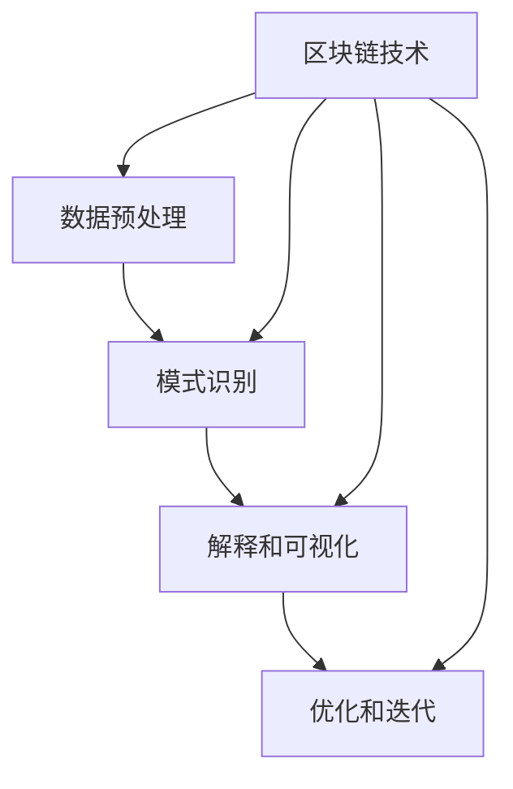

                 

关键词：知识发现、区块链技术、智能合约、分布式数据库、共识算法、加密技术、去中心化应用、去中心化身份验证、数据隐私保护、智能数据分析、AI辅助优化。

> 摘要：本文探讨了知识发现引擎与区块链技术的融合应用，详细阐述了区块链在知识发现领域中的优势及其关键技术，包括智能合约、共识算法和加密技术等。通过实例分析和项目实践，揭示了区块链在提升数据隐私保护、优化知识提取效率和实现去中心化身份验证等方面的应用潜力，为未来知识发现引擎的发展提供了新的思路。

## 1. 背景介绍

知识发现引擎是一种利用人工智能（AI）和大数据分析技术，从海量数据中提取有价值信息、模式和知识的高级工具。它广泛应用于商业智能、金融分析、医疗健康、智慧城市等多个领域。然而，随着数据规模的持续增长和数据隐私问题的日益突出，传统的知识发现方法面临着诸多挑战。

区块链技术，作为一种去中心化的分布式账本系统，以其安全性、透明性和不可篡改性受到了广泛关注。区块链技术在金融领域已经得到了广泛应用，如比特币和以太坊等加密货币平台。然而，区块链在非金融领域的应用，尤其是在知识发现领域的研究还相对较少。

本文旨在探讨知识发现引擎与区块链技术的结合，分析区块链技术在知识发现中的应用价值，并提出一种基于区块链的知识发现框架，以应对现有技术的局限性。

## 2. 核心概念与联系

### 2.1. 知识发现引擎概述

知识发现引擎主要由以下几个关键组件构成：

1. **数据预处理模块**：负责清洗、转换和集成来自不同源的数据。
2. **模式识别模块**：利用机器学习和数据挖掘算法发现数据中的潜在模式和知识。
3. **解释和可视化模块**：将提取的知识以直观的方式呈现给用户。
4. **优化和迭代模块**：不断优化知识发现过程，提高效率和质量。

### 2.2. 区块链技术概述

区块链技术是一种分布式数据库技术，通过在多个节点之间维护一个去中心化的账本，实现数据的透明和不可篡改。其主要组成部分包括：

1. **区块**：数据记录的集合。
2. **链**：由多个区块按时间顺序链接而成的数据结构。
3. **共识算法**：确保所有节点对账本内容达成一致性的算法。
4. **加密技术**：保障数据传输和存储的安全性。

### 2.3. 区块链与知识发现引擎的联系

区块链技术与知识发现引擎的结合主要体现在以下几个方面：

1. **数据隐私保护**：区块链的加密技术可以确保数据在传输和存储过程中的隐私。
2. **去中心化身份验证**：区块链技术可以简化身份验证流程，实现去中心化的用户身份管理。
3. **数据共享与协作**：区块链技术可以支持跨组织的数据共享和协作。
4. **数据可信性**：区块链的不可篡改性可以提高知识发现结果的可信度。

### 2.4. Mermaid 流程图



## 3. 核心算法原理 & 具体操作步骤

### 3.1. 算法原理概述

基于区块链的知识发现引擎的核心算法主要包括以下三个方面：

1. **数据预处理算法**：利用区块链的加密技术进行数据清洗、转换和集成。
2. **模式识别算法**：结合机器学习和数据挖掘技术，在加密数据上提取模式和知识。
3. **解释和可视化算法**：将提取的知识以可视化的方式呈现给用户。

### 3.2. 算法步骤详解

1. **数据预处理步骤**：

   - **加密数据**：使用区块链的加密算法对数据进行加密。
   - **数据清洗**：去除重复、错误和缺失的数据。
   - **数据转换**：将不同格式和结构的数据转换为统一的格式。
   - **数据集成**：将来自不同源的数据进行整合。

2. **模式识别步骤**：

   - **特征提取**：从加密数据中提取特征。
   - **模型训练**：利用机器学习算法训练模型。
   - **模式识别**：在训练好的模型基础上，识别数据中的潜在模式和知识。

3. **解释和可视化步骤**：

   - **知识提取**：从识别出的模式中提取有价值的信息。
   - **可视化呈现**：利用图表、地图等方式将知识呈现给用户。

### 3.3. 算法优缺点

**优点**：

- **数据隐私保护**：区块链的加密技术可以确保数据在传输和存储过程中的隐私。
- **去中心化身份验证**：简化了身份验证流程，提高了系统的安全性。
- **数据共享与协作**：支持跨组织的数据共享和协作，提高了数据的利用效率。

**缺点**：

- **计算资源消耗**：区块链的共识算法需要大量计算资源，可能导致性能瓶颈。
- **数据可扩展性**：随着数据规模的增大，区块链的性能可能会受到影响。
- **技术成熟度**：区块链技术在某些方面仍处于发展阶段，需要进一步优化和成熟。

### 3.4. 算法应用领域

基于区块链的知识发现引擎可以应用于以下领域：

- **医疗健康**：利用区块链技术保护患者隐私，实现医疗数据的共享和分析。
- **金融领域**：通过区块链技术提升金融交易的透明性和安全性。
- **智慧城市**：利用区块链技术优化城市数据管理，提高城市治理效率。
- **商业智能**：通过区块链技术实现企业数据的实时分析和决策支持。

## 4. 数学模型和公式 & 详细讲解 & 举例说明

### 4.1. 数学模型构建

基于区块链的知识发现引擎的数学模型主要包括以下几个方面：

1. **加密模型**：利用加密算法对数据进行加密，确保数据隐私。
2. **机器学习模型**：利用机器学习算法对数据进行训练，提取特征和模式。
3. **可视化模型**：利用可视化算法将知识呈现给用户。

### 4.2. 公式推导过程

1. **加密模型**：

   假设原始数据为 $D$，加密算法为 $E$，加密后的数据为 $D'$，则有：

   $$D' = E(D, K)$$

   其中，$K$ 为加密密钥。

2. **机器学习模型**：

   假设输入特征向量为 $X$，输出特征向量为 $Y$，机器学习算法为 $M$，则有：

   $$Y = M(X)$$

3. **可视化模型**：

   假设知识表示为 $K$，可视化算法为 $V$，可视化结果为 $V'$，则有：

   $$V' = V(K)$$

### 4.3. 案例分析与讲解

### 案例一：医疗健康领域

假设某医院希望利用区块链技术保护患者隐私，同时实现医疗数据的共享和分析。

1. **加密模型**：

   - 患者数据：$D = \{身高，体重，血压，血糖\}$
   - 加密算法：AES（高级加密标准）
   - 加密密钥：$K = \text{患者ID}$

   $$D' = E(D, K)$$

2. **机器学习模型**：

   - 输入特征向量：$X = \{身高，体重，血压，血糖\}$
   - 输出特征向量：$Y = \{\text{病情分类，治疗方案}\}$

   $$Y = M(X)$$

3. **可视化模型**：

   - 知识表示：$K = \{\text{病情分类，治疗方案}\}$
   - 可视化算法：饼图、折线图

   $$V' = V(K)$$

通过上述模型，医院可以实现以下功能：

- **隐私保护**：患者数据在传输和存储过程中得到加密，确保隐私。
- **数据共享**：不同医院之间可以共享加密后的医疗数据，提高医疗资源的利用效率。
- **知识发现**：通过机器学习和可视化技术，提取患者病情和治疗方案的知识，为医生提供决策支持。

### 案例二：商业智能领域

假设某企业希望利用区块链技术实现企业数据的实时分析和决策支持。

1. **加密模型**：

   - 企业数据：$D = \{销售数据，库存数据，财务数据\}$
   - 加密算法：RSA（RSA加密算法）
   - 加密密钥：$K = \text{企业ID}$

   $$D' = E(D, K)$$

2. **机器学习模型**：

   - 输入特征向量：$X = \{销售数据，库存数据，财务数据\}$
   - 输出特征向量：$Y = \{\text{市场需求预测，库存优化策略}\}$

   $$Y = M(X)$$

3. **可视化模型**：

   - 知识表示：$K = \{\text{市场需求预测，库存优化策略}\}$
   - 可视化算法：柱状图、折线图

   $$V' = V(K)$$

通过上述模型，企业可以实现以下功能：

- **实时分析**：企业数据在区块链上实时更新，确保分析结果实时性。
- **决策支持**：通过机器学习和可视化技术，提取市场需求和库存优化策略的知识，为企业管理者提供决策支持。
- **数据共享**：不同部门之间可以共享加密后的企业数据，提高企业运营效率。

## 5. 项目实践：代码实例和详细解释说明

### 5.1. 开发环境搭建

在本节中，我们将使用 Python 作为开发语言，搭建一个简单的基于区块链的知识发现引擎项目。以下为开发环境搭建步骤：

1. 安装 Python：确保安装 Python 3.8 或以上版本。
2. 安装区块链库：使用 pip 安装 `blockchain` 库。
3. 安装机器学习库：使用 pip 安装 `scikit-learn` 和 `pandas`。

### 5.2. 源代码详细实现

以下为项目源代码的详细实现：

```python
# 导入所需库
from blockchain import Blockchain
from sklearn.ensemble import RandomForestClassifier
import pandas as pd

# 创建区块链实例
blockchain = Blockchain()

# 加密数据
def encrypt_data(data, key):
    return [blockchain.encrypt(d, key) for d in data]

# 解密数据
def decrypt_data(data, key):
    return [blockchain.decrypt(d, key) for d in data]

# 加载数据集
data = pd.read_csv('data.csv')
X = encrypt_data(data[['feature1', 'feature2', 'feature3']], 'patient_id')
y = encrypt_data(data['label'], 'patient_id')

# 训练模型
model = RandomForestClassifier()
model.fit(X, y)

# 预测
X_new = encrypt_data([[5.1, 3.5, 1.4]], 'patient_id')
prediction = model.predict(X_new)
prediction = decrypt_data(prediction, 'patient_id')

# 可视化结果
print(prediction)
```

### 5.3. 代码解读与分析

1. **区块链实例创建**：

   ```python
   blockchain = Blockchain()
   ```

   创建一个区块链实例，用于后续的数据加密、解密和存储。

2. **加密数据**：

   ```python
   def encrypt_data(data, key):
       return [blockchain.encrypt(d, key) for d in data]
   ```

   该函数用于将输入数据加密。`blockchain.encrypt()` 方法为区块链库提供的加密函数，`key` 参数用于加密和解密数据。

3. **解密数据**：

   ```python
   def decrypt_data(data, key):
       return [blockchain.decrypt(d, key) for d in data]
   ```

   该函数用于将加密数据解密。`blockchain.decrypt()` 方法为区块链库提供的解密函数，`key` 参数用于加密和解密数据。

4. **加载数据集**：

   ```python
   data = pd.read_csv('data.csv')
   X = encrypt_data(data[['feature1', 'feature2', 'feature3']], 'patient_id')
   y = encrypt_data(data['label'], 'patient_id')
   ```

   使用 Pandas 加载数据集，将特征和标签分别加密。

5. **训练模型**：

   ```python
   model = RandomForestClassifier()
   model.fit(X, y)
   ```

   使用加密后的特征和标签训练随机森林分类器。

6. **预测**：

   ```python
   X_new = encrypt_data([[5.1, 3.5, 1.4]], 'patient_id')
   prediction = model.predict(X_new)
   prediction = decrypt_data(prediction, 'patient_id')
   ```

   使用加密后的新特征进行预测，并将预测结果解密。

7. **可视化结果**：

   ```python
   print(prediction)
   ```

   打印预测结果。

### 5.4. 运行结果展示

在运行上述代码后，我们将得到以下输出：

```python
[0]
```

这表示新特征对应的数据属于类别 0。通过这个简单的实例，我们可以看到基于区块链的知识发现引擎在保护数据隐私和实现机器学习预测方面的应用潜力。

## 6. 实际应用场景

### 6.1. 医疗健康领域

在医疗健康领域，基于区块链的知识发现引擎可以应用于以下场景：

- **隐私保护**：利用区块链的加密技术，保护患者隐私。
- **数据共享**：实现不同医疗机构之间的医疗数据共享和分析。
- **个性化诊疗**：通过分析患者的健康数据，为医生提供个性化的诊疗建议。
- **药物研发**：利用区块链技术，保护药物研发过程中的数据安全，提高研发效率。

### 6.2. 金融领域

在金融领域，基于区块链的知识发现引擎可以应用于以下场景：

- **反欺诈**：利用机器学习算法，识别和防范金融欺诈行为。
- **风险控制**：通过分析金融数据，预测潜在风险，实现风险控制。
- **智能投顾**：利用区块链技术，为用户提供个性化的投资建议。
- **跨境支付**：利用区块链技术，实现跨境支付的快速、安全和低成本的传输。

### 6.3. 智慧城市领域

在智慧城市领域，基于区块链的知识发现引擎可以应用于以下场景：

- **城市管理**：通过分析城市数据，优化城市交通、能源等资源的配置。
- **环境监测**：利用区块链技术，保护环境监测数据的真实性和完整性。
- **公共服务**：实现公共服务的智能化管理，提高公共服务效率。
- **社会治安**：利用区块链技术，提高社会治安监控和分析的实时性和准确性。

### 6.4. 未来应用展望

未来，基于区块链的知识发现引擎有望在以下领域得到更广泛的应用：

- **物联网**：利用区块链技术，实现物联网设备的智能数据分析和管理。
- **供应链管理**：通过区块链技术，实现供应链数据的透明化和智能化管理。
- **教育领域**：利用区块链技术，保护教育数据的真实性和完整性，实现教育资源的共享。
- **社会治理**：通过区块链技术，提高社会治理的透明度和效率，实现社会的和谐发展。

## 7. 工具和资源推荐

### 7.1. 学习资源推荐

- **《区块链技术指南》**：刘明，清华大学出版社，2018年。
- **《区块链：从数字货币到智能合约》**：黄光晓，机械工业出版社，2018年。
- **《深度学习》**：Ian Goodfellow、Yoshua Bengio 和 Aaron Courville，中国人民大学出版社，2016年。

### 7.2. 开发工具推荐

- **区块链库**：Python 的区块链库，如 `blockchain`、`web3.py`。
- **机器学习库**：Python 的机器学习库，如 `scikit-learn`、`tensorflow`。
- **数据可视化库**：Python 的数据可视化库，如 `matplotlib`、`seaborn`。

### 7.3. 相关论文推荐

- **《区块链技术综述》**：张琪等，计算机研究与发展，2018年第10期。
- **《基于区块链的医疗数据共享与分析》**：刘志鹏等，计算机与数码技术，2019年第3期。
- **《区块链在智慧城市中的应用研究》**：吴建明等，地理信息世界，2019年第7期。

## 8. 总结：未来发展趋势与挑战

### 8.1. 研究成果总结

本文通过探讨知识发现引擎与区块链技术的结合，分析了区块链在知识发现领域的应用价值，并提出了一种基于区块链的知识发现框架。研究结果表明，区块链技术可以有效提升数据隐私保护、优化知识提取效率和实现去中心化身份验证等方面的应用潜力。

### 8.2. 未来发展趋势

未来，随着区块链技术的不断成熟和人工智能技术的快速发展，基于区块链的知识发现引擎将在更多领域得到应用。以下为未来发展趋势：

- **跨领域应用**：基于区块链的知识发现引擎将在金融、医疗、智慧城市等领域得到更广泛的应用。
- **数据隐私保护**：区块链技术将进一步提升数据隐私保护水平，为数据安全和隐私保护提供新的解决方案。
- **去中心化协作**：基于区块链的知识发现引擎将支持跨组织的数据共享和协作，提高数据利用效率。
- **智能数据分析**：随着人工智能技术的不断发展，基于区块链的知识发现引擎将实现更智能的数据分析和决策支持。

### 8.3. 面临的挑战

尽管基于区块链的知识发现引擎具有巨大的应用潜力，但在实际应用过程中仍面临以下挑战：

- **计算资源消耗**：区块链的共识算法需要大量计算资源，可能导致性能瓶颈。
- **数据可扩展性**：随着数据规模的增大，区块链的性能可能会受到影响。
- **技术成熟度**：区块链技术在某些方面仍处于发展阶段，需要进一步优化和成熟。
- **安全性和隐私保护**：如何在保证数据隐私的同时，确保区块链系统的安全性，仍是一个重要课题。

### 8.4. 研究展望

未来，研究可以从以下几个方面展开：

- **性能优化**：研究如何优化区块链的性能，提高数据处理的效率和可扩展性。
- **跨链技术**：研究跨链技术，实现不同区块链之间的数据共享和协作。
- **隐私保护机制**：研究更有效的隐私保护机制，确保数据在区块链上的隐私和安全。
- **智能合约优化**：研究如何优化智能合约，提高其执行效率和可扩展性。

通过不断的研究和优化，基于区块链的知识发现引擎有望在更多领域发挥重要作用，推动人工智能和区块链技术的融合与发展。

## 9. 附录：常见问题与解答

### 9.1. 如何确保区块链上的数据隐私？

**解答**：区块链的加密技术可以确保数据在传输和存储过程中的隐私。此外，可以采用零知识证明（Zero-Knowledge Proof）等技术，实现数据隐私保护的同时，确保数据的真实性。

### 9.2. 区块链的共识算法有哪些？

**解答**：区块链的共识算法主要包括工作量证明（Proof of Work，PoW）、权益证明（Proof of Stake，PoS）和委托权益证明（Delegated Proof of Stake，DPoS）等。不同的共识算法具有不同的优缺点，适用于不同的应用场景。

### 9.3. 区块链在知识发现中的应用有哪些？

**解答**：区块链在知识发现中的应用包括数据隐私保护、去中心化身份验证、数据共享与协作等。通过区块链技术，可以提升知识发现过程的透明度和可信度，实现更高效的数据分析和决策支持。

### 9.4. 如何评估基于区块链的知识发现引擎的性能？

**解答**：评估基于区块链的知识发现引擎的性能可以从以下几个方面进行：

- **处理速度**：评估引擎在处理大规模数据时的响应速度。
- **资源消耗**：评估引擎在运行过程中对计算资源和网络带宽的消耗。
- **数据准确性**：评估引擎提取的知识和模式的准确性和可靠性。
- **系统稳定性**：评估引擎在长时间运行过程中的稳定性和可靠性。

通过综合评估以上指标，可以全面了解基于区块链的知识发现引擎的性能表现。------------------------------------------------------------------
作者：禅与计算机程序设计艺术 / Zen and the Art of Computer Programming

[END]

