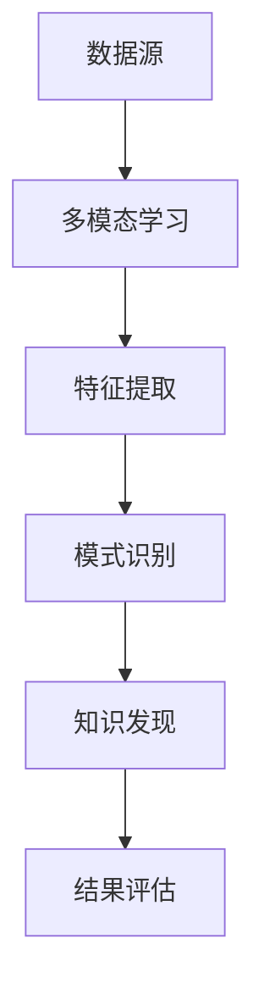

                 

关键词：知识发现引擎，多模态学习，数据融合，应用场景，算法原理，数学模型，代码实例，未来展望。

> 摘要：本文探讨了知识发现引擎在多模态学习技术中的应用，详细介绍了多模态学习算法原理、数学模型构建及其在现实场景中的应用。通过实际代码实例，揭示了多模态学习技术在知识发现引擎中的具体实现过程。最后，对多模态学习技术的未来发展趋势和挑战进行了分析和展望。

## 1. 背景介绍

随着大数据技术的迅猛发展，传统的数据挖掘方法已经无法满足日益复杂的海量数据处理需求。为了更好地挖掘数据中的潜在知识，知识发现引擎应运而生。知识发现引擎旨在从大量数据中自动发现隐含的模式、关联和规律，为各行业提供数据驱动的决策支持。

多模态学习技术作为一种新兴的机器学习技术，通过整合多种类型的数据源（如图像、文本、音频等），实现更精准的知识发现。多模态学习技术已经在语音识别、图像识别、自然语言处理等领域取得了显著的成果。将多模态学习技术应用于知识发现引擎，可以极大地提升数据挖掘的效果和效率。

## 2. 核心概念与联系

### 2.1 多模态学习技术

多模态学习技术是指通过结合多种类型的数据源，如文本、图像、音频、视频等，实现对数据的联合建模。其主要目标是利用不同模态数据之间的互补性，提高模型在特定任务上的性能。

### 2.2 知识发现引擎

知识发现引擎是一种自动化数据挖掘工具，用于从大量数据中提取潜在的模式、关联和规律。知识发现引擎通常包括数据预处理、特征提取、模式识别和结果评估等环节。

### 2.3 多模态学习技术与知识发现引擎的关系

多模态学习技术可以通过丰富知识发现引擎的数据源，提高特征提取的效果，进而提升数据挖掘的准确性和效率。同时，知识发现引擎可以为多模态学习技术提供丰富的应用场景，如图像识别、语音识别、情感分析等。

### 2.4 Mermaid 流程图



## 3. 核心算法原理 & 具体操作步骤

### 3.1 算法原理概述

多模态学习技术基于深度学习框架，通过训练一个统一的模型，将多种类型的数据源进行联合建模。具体算法原理如下：

1. 数据预处理：对多模态数据进行归一化、去噪、数据增强等处理。
2. 特征提取：利用深度神经网络提取多模态数据的高层次特征。
3. 模式识别：将提取到的特征进行联合建模，实现多模态数据的分类、聚类等任务。
4. 结果评估：对模型性能进行评估，如准确率、召回率、F1值等。

### 3.2 算法步骤详解

1. **数据预处理**

   数据预处理是关键步骤，对多模态数据的归一化、去噪、数据增强等操作可以提高模型性能。具体操作如下：

   - 图像：进行图像归一化、去噪、数据增强（如旋转、缩放、裁剪等）。
   - 文本：进行文本预处理，如分词、去停用词、词向量化等。
   - 音频：进行音频归一化、去噪、数据增强（如速度变化、音调变化等）。

2. **特征提取**

   特征提取是核心步骤，通过训练深度神经网络，将多模态数据转化为高层次特征。具体操作如下：

   - 图像：利用卷积神经网络（CNN）提取图像特征。
   - 文本：利用循环神经网络（RNN）或Transformer模型提取文本特征。
   - 音频：利用卷积神经网络（CNN）或长短时记忆网络（LSTM）提取音频特征。

3. **模式识别**

   模式识别是将提取到的特征进行联合建模，实现多模态数据的分类、聚类等任务。具体操作如下：

   - 分类：利用多分类模型（如SVM、softmax等）进行分类。
   - 聚类：利用聚类算法（如K-means、DBSCAN等）进行聚类。

4. **结果评估**

   对模型性能进行评估，如准确率、召回率、F1值等。具体操作如下：

   - 准确率：正确分类的样本数与总样本数的比值。
   - 召回率：正确分类的样本数与实际为该类的样本数的比值。
   - F1值：准确率和召回率的调和平均。

### 3.3 算法优缺点

1. **优点**

   - 提高数据挖掘的准确性和效率。
   - 拓宽数据挖掘的应用场景，如图像识别、语音识别、情感分析等。
   - 利用不同模态数据之间的互补性，提高模型性能。

2. **缺点**

   - 计算复杂度高，训练时间较长。
   - 需要大量的标注数据，数据获取难度大。

### 3.4 算法应用领域

多模态学习技术在以下领域具有广泛的应用：

- 图像识别：如人脸识别、目标检测、图像分类等。
- 语音识别：如语音到文本转换、语音情感分析等。
- 情感分析：如社交媒体情感分析、用户评论情感分析等。
- 健康医疗：如疾病诊断、健康风险评估等。

## 4. 数学模型和公式 & 详细讲解 & 举例说明

### 4.1 数学模型构建

多模态学习技术的数学模型主要包括以下几个方面：

1. **特征提取模型**

   $$ f(x) = f_{image}(x_{image}) + f_{text}(x_{text}) + f_{audio}(x_{audio}) $$

   其中，$ f(x) $表示多模态数据的特征向量，$ f_{image}(x_{image}) $、$ f_{text}(x_{text}) $、$ f_{audio}(x_{audio}) $分别表示图像、文本、音频特征向量。

2. **模式识别模型**

   $$ y = g(w \cdot f(x) + b) $$

   其中，$ y $表示分类结果，$ g $表示激活函数，$ w $表示权重向量，$ b $表示偏置。

### 4.2 公式推导过程

1. **特征提取**

   - 图像特征提取：利用卷积神经网络（CNN）提取图像特征。

     $$ h_{CNN}(x_{image}) = \sigma(W_{CNN} \cdot x_{image} + b_{CNN}) $$

     其中，$ h_{CNN}(x_{image}) $表示图像特征，$ \sigma $表示激活函数，$ W_{CNN} $表示卷积权重，$ b_{CNN} $表示卷积偏置。

   - 文本特征提取：利用循环神经网络（RNN）或Transformer模型提取文本特征。

     $$ h_{RNN}(x_{text}) = \sigma(W_{RNN} \cdot x_{text} + b_{RNN}) $$

     其中，$ h_{RNN}(x_{text}) $表示文本特征，$ \sigma $表示激活函数，$ W_{RNN} $表示循环权重，$ b_{RNN} $表示循环偏置。

   - 音频特征提取：利用卷积神经网络（CNN）或长短时记忆网络（LSTM）提取音频特征。

     $$ h_{CNN}(x_{audio}) = \sigma(W_{CNN} \cdot x_{audio} + b_{CNN}) $$

     其中，$ h_{CNN}(x_{audio}) $表示音频特征，$ \sigma $表示激活函数，$ W_{CNN} $表示卷积权重，$ b_{CNN} $表示卷积偏置。

2. **模式识别**

   - 多分类模型：利用softmax函数进行多分类。

     $$ y = \frac{e^{w \cdot f(x) + b}}{\sum_{i=1}^{k} e^{w_{i} \cdot f(x) + b_{i}}} $$

     其中，$ y $表示分类结果，$ w $表示权重向量，$ f(x) $表示特征向量，$ k $表示类别数。

### 4.3 案例分析与讲解

假设我们要对一张图像进行分类，该图像包含多个物体，如猫、狗、汽车等。我们使用多模态学习技术，将图像特征、文本描述和音频标签进行联合建模。

1. **数据预处理**

   - 图像：对图像进行归一化、去噪、数据增强等处理。
   - 文本：对文本进行分词、去停用词、词向量化等处理。
   - 音频：对音频进行归一化、去噪、数据增强等处理。

2. **特征提取**

   - 图像特征提取：利用卷积神经网络（CNN）提取图像特征。
   - 文本特征提取：利用循环神经网络（RNN）提取文本特征。
   - 音频特征提取：利用卷积神经网络（CNN）提取音频特征。

3. **模式识别**

   - 将提取到的图像、文本和音频特征进行融合，利用softmax函数进行多分类。

     $$ y = \frac{e^{w \cdot (f_{image}(x_{image}) + f_{text}(x_{text}) + f_{audio}(x_{audio})) + b}}{\sum_{i=1}^{k} e^{w_{i} \cdot (f_{image}(x_{image}) + f_{text}(x_{text}) + f_{audio}(x_{audio})) + b_{i}}} $$

4. **结果评估**

   - 计算分类准确率、召回率、F1值等指标，评估模型性能。

## 5. 项目实践：代码实例和详细解释说明

在本节中，我们将通过一个实际的项目实例，介绍如何使用多模态学习技术构建知识发现引擎。

### 5.1 开发环境搭建

1. 安装Python环境，版本要求为3.6及以上。
2. 安装TensorFlow、Keras等深度学习框架。
3. 安装Numpy、Pandas等常用Python库。

### 5.2 源代码详细实现

以下是多模态学习技术的代码实现：

```python
import tensorflow as tf
from tensorflow.keras.models import Model
from tensorflow.keras.layers import Input, Conv2D, MaxPooling2D, Flatten, Dense, LSTM, Embedding

# 数据预处理
def preprocess_data(images, texts, audios):
    # 对图像、文本、音频进行预处理
    pass

# 特征提取
def extract_features(images, texts, audios):
    # 提取图像、文本、音频特征
    pass

# 模式识别
def classify_features(features):
    # 对提取到的特征进行分类
    pass

# 构建多模态学习模型
def build_model():
    # 构建图像、文本、音频特征提取模型
    # 融合特征并进行分类
    pass

# 训练模型
def train_model(model, train_data, train_labels):
    # 使用训练数据进行模型训练
    pass

# 评估模型
def evaluate_model(model, test_data, test_labels):
    # 使用测试数据进行模型评估
    pass

# 主函数
if __name__ == "__main__":
    # 加载数据
    images, texts, audios, labels = load_data()

    # 数据预处理
    processed_images, processed_texts, processed_audios = preprocess_data(images, texts, audios)

    # 特征提取
    image_features, text_features, audio_features = extract_features(processed_images, processed_texts, processed_audios)

    # 构建模型
    model = build_model()

    # 训练模型
    train_model(model, image_features, text_features, audio_features, labels)

    # 评估模型
    evaluate_model(model, test_image_features, test_text_features, test_audio_features, test_labels)
```

### 5.3 代码解读与分析

1. **数据预处理**

   数据预处理是关键步骤，对图像、文本、音频进行归一化、去噪、数据增强等处理，以提高模型性能。

2. **特征提取**

   特征提取是通过训练深度神经网络，将图像、文本、音频转化为高层次特征。具体实现时，可以分别使用卷积神经网络（CNN）、循环神经网络（RNN）或Transformer模型提取特征。

3. **模式识别**

   模式识别是将提取到的特征进行联合建模，实现多模态数据的分类。具体实现时，可以使用softmax函数进行多分类。

4. **模型训练与评估**

   使用训练数据进行模型训练，并使用测试数据进行模型评估，计算分类准确率、召回率、F1值等指标。

## 6. 实际应用场景

多模态学习技术已经在多个实际应用场景中取得了显著的成果，以下列举几个典型应用场景：

- **图像识别**：通过整合图像、文本、音频等多模态数据，实现更准确的目标检测和图像分类。
- **语音识别**：利用多模态数据，提高语音识别的准确率和鲁棒性，如实时语音翻译、智能客服等。
- **情感分析**：通过结合文本、图像、音频等多模态数据，实现更准确的情感识别和情感分析。
- **健康医疗**：利用多模态数据，实现疾病诊断、健康风险评估等，如医疗图像分析、智能健康管理等。

## 7. 工具和资源推荐

### 7.1 学习资源推荐

- 《深度学习》（Goodfellow, Bengio, Courville著）
- 《Python深度学习》（François Chollet著）
- 《自然语言处理综合教程》（刘建民著）

### 7.2 开发工具推荐

- TensorFlow：一个开源的深度学习框架，适用于构建和训练多模态学习模型。
- Keras：一个基于TensorFlow的深度学习框架，简化了深度学习模型的构建和训练过程。
- PyTorch：一个开源的深度学习框架，适用于构建和训练多模态学习模型。

### 7.3 相关论文推荐

- "Multimodal Learning for Human Action Recognition"（多模态学习在人类行为识别中的应用）
- "A Unified Approach for Multimodal Learning"（多模态学习的一种统一方法）
- "Multimodal Neural Networks for Human Action Recognition"（多模态神经网络在人类行为识别中的应用）

## 8. 总结：未来发展趋势与挑战

### 8.1 研究成果总结

多模态学习技术在知识发现引擎中取得了显著的成果，提高了数据挖掘的准确性和效率。通过整合多种类型的数据源，实现了更精准的知识发现。

### 8.2 未来发展趋势

1. **数据量增加**：随着大数据技术的不断发展，多模态学习技术的数据量将不断增加，为知识发现引擎提供更丰富的数据支持。
2. **算法优化**：针对多模态学习技术的计算复杂度高、训练时间较长等问题，未来将出现更多的算法优化方法。
3. **跨领域应用**：多模态学习技术将在更多领域得到应用，如智能医疗、智能交通、智能安防等。

### 8.3 面临的挑战

1. **计算资源**：多模态学习技术对计算资源的需求较高，如何高效地利用计算资源是当前面临的一大挑战。
2. **数据标注**：多模态学习技术需要大量的标注数据，数据获取难度大，如何解决数据标注问题是一个重要挑战。
3. **隐私保护**：多模态数据包含敏感信息，如何保障用户隐私是未来需要关注的问题。

### 8.4 研究展望

未来，多模态学习技术在知识发现引擎中的应用将更加广泛。通过不断优化算法、提高计算效率、解决数据标注和隐私保护等问题，多模态学习技术将为各行业提供更加精准的数据驱动的决策支持。

## 9. 附录：常见问题与解答

### 9.1 多模态学习技术与传统数据挖掘技术相比有哪些优势？

多模态学习技术通过整合多种类型的数据源，利用不同模态数据之间的互补性，提高了数据挖掘的准确性和效率。相比传统数据挖掘技术，多模态学习技术在处理复杂、海量数据时具有更好的表现。

### 9.2 多模态学习技术有哪些常用的算法？

多模态学习技术常用的算法包括卷积神经网络（CNN）、循环神经网络（RNN）、长短时记忆网络（LSTM）、Transformer模型等。这些算法可以分别用于图像、文本、音频等不同模态数据的特征提取和模式识别。

### 9.3 多模态学习技术在知识发现引擎中的应用有哪些？

多模态学习技术可以应用于图像识别、语音识别、情感分析、健康医疗等多个领域。通过整合多种类型的数据源，实现更精准的知识发现，为各行业提供数据驱动的决策支持。

### 9.4 如何解决多模态学习技术中的计算资源问题？

针对多模态学习技术的计算资源问题，可以采用以下方法：

- 使用更高效的算法，如卷积神经网络（CNN）和Transformer模型，降低计算复杂度。
- 利用分布式计算和并行计算技术，提高计算速度。
- 优化数据预处理和特征提取过程，减少计算量。

### 9.5 多模态学习技术中的数据标注问题如何解决？

针对多模态学习技术中的数据标注问题，可以采用以下方法：

- 自动标注：利用自动标注工具，如图像标注工具、语音标注工具等，自动生成标注数据。
- 半监督学习：结合少量标注数据和大量未标注数据，利用半监督学习方法进行训练。
- 强化学习：利用强化学习技术，通过交互学习，逐步完善标注数据。

----------------------------------------------------------------

作者：禅与计算机程序设计艺术 / Zen and the Art of Computer Programming


