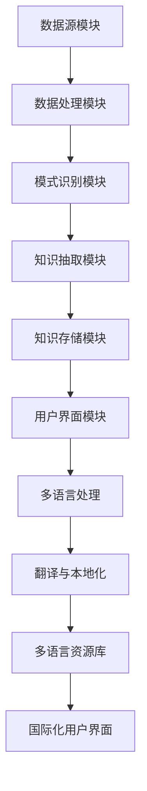

                 

关键词：知识发现引擎、多语言支持、国际化、自然语言处理、语义分析、算法优化、资源库、跨平台、用户体验、全球化、云计算、数据挖掘、机器学习。

## 摘要

本文探讨了知识发现引擎在多语言支持与国际化方面的挑战与解决方案。首先，我们介绍了知识发现引擎的基本概念和原理，然后深入分析了多语言支持与国际化的重要性，包括在全球化背景下的应用需求。随后，我们详细讨论了构建多语言知识发现引擎所需的算法原理、数学模型、以及项目实践。最后，我们展望了知识发现引擎在未来国际化发展中的趋势与挑战。

## 1. 背景介绍

知识发现引擎（Knowledge Discovery Engine，KDE）是数据挖掘领域中的一种先进工具，旨在从大量数据中自动识别出有价值的模式和知识。随着全球化的加速和信息技术的发展，知识发现引擎的应用场景日益广泛，不仅限于学术研究，还广泛应用于商业、医疗、金融等领域。这些应用场景的多样性对知识发现引擎提出了更高的要求，尤其是多语言支持与国际化。

多语言支持与国际化是现代软件系统不可或缺的一部分。在全球化背景下，企业需要能够跨越语言障碍，与国际客户进行沟通和业务交流。这要求知识发现引擎不仅能够处理多种语言数据，还能提供个性化的用户体验，满足不同文化背景用户的需求。因此，研究知识发现引擎的多语言支持与国际化具有重要的实际意义和广阔的发展前景。

本文将围绕以下几个方面展开：

1. 知识发现引擎的基本概念与架构。
2. 多语言支持与国际化的核心概念。
3. 构建多语言知识发现引擎的算法原理与数学模型。
4. 知识发现引擎在多语言环境中的应用实践。
5. 未来发展中的趋势与挑战。

### 1.1 知识发现引擎的基本概念

知识发现引擎是一种能够自动从大量数据中提取出有价值的知识和模式的工具。它通常包括以下几个关键组成部分：

- **数据预处理**：包括数据清洗、去重、格式化等操作，确保输入数据的质量和一致性。
- **模式识别**：通过统计分析和机器学习算法，从数据中识别出潜在的规律和模式。
- **知识抽取**：将识别出的模式转化为可操作的知识，如分类模型、关联规则等。
- **知识存储**：将提取出的知识存储在数据库或知识库中，以便后续查询和使用。

知识发现引擎的核心功能是发现数据中的隐含规律和知识，这些知识可以用于数据挖掘、决策支持、智能推荐等多个领域。例如，在商业领域，知识发现引擎可以帮助企业分析客户行为，预测市场趋势，从而制定更有效的营销策略。

### 1.2 多语言支持与国际化

多语言支持与国际化（Internationalization and Localization，简称I18N和L10N）是指软件系统能够在多种语言和文化环境中运行和适应的能力。它主要包括以下几个方面：

- **国际化**（Internationalization，I18N）：使软件系统能够支持多种语言和地区格式，如日期、时间、货币等。
- **本地化**（Localization，L10N）：根据特定地区或语言的需求，对国际化后的软件进行本地化调整，包括语言翻译、文化适应性调整等。

多语言支持与国际化对于知识发现引擎尤为重要，因为它们需要处理来自不同国家和地区的语言数据，并能够为用户提供本地化的用户体验。

#### 1.2.1 全球化背景下的应用需求

随着全球化的加速，企业和组织越来越多地涉及到国际业务，这要求他们的软件系统能够支持多语言和国际化。具体来说，以下是一些全球化的应用需求：

- **国际业务交流**：企业需要能够与全球各地的客户、合作伙伴和员工进行有效沟通，这要求他们的软件系统能够支持多种语言。
- **市场拓展**：企业希望通过多语言支持进入新的市场，例如中国、印度、西班牙等，这要求他们的软件系统能够适应不同的语言和文化。
- **用户体验**：本地化的软件系统能够提供更好的用户体验，提高用户的满意度和忠诚度。

#### 1.2.2 多语言支持与国际化在知识发现引擎中的应用

在知识发现引擎中，多语言支持与国际化具有以下几个关键应用场景：

- **文本数据挖掘**：处理来自多种语言的文本数据，例如社交媒体、新闻、用户评论等。
- **用户界面本地化**：为不同语言的用户提供本地化的用户界面，提高用户体验。
- **跨语言知识抽取**：从多种语言的文本数据中提取出共通的知识，例如跨语言情感分析、跨语言实体识别等。
- **全球数据融合**：将来自不同国家和地区的数据融合到同一知识发现引擎中，进行综合分析。

#### 1.2.3 挑战与解决方案

多语言支持与国际化在知识发现引擎中面临以下挑战：

- **语言差异**：不同语言在语法、词汇、语义等方面存在差异，这给知识发现引擎的设计和实现带来了挑战。
- **文化差异**：不同文化对同一事物可能有不同的认知和表达方式，这要求知识发现引擎能够适应不同的文化背景。
- **性能优化**：多语言支持可能会对知识发现引擎的性能产生负面影响，需要优化算法和架构以应对。

为了解决这些挑战，可以采取以下策略：

- **自动化翻译与本地化**：利用机器翻译和本地化工具，自动将一种语言的文本转换为另一种语言，并适应不同的文化背景。
- **多语言算法**：设计支持多种语言的算法和模型，确保知识发现引擎能够在不同语言环境中正常运行。
- **性能优化**：通过分布式计算和并行处理等技术，优化知识发现引擎的性能，确保其在多语言支持下的高效运行。

### 1.3 文章结构

本文将分为以下几个部分：

1. **背景介绍**：介绍知识发现引擎的基本概念、多语言支持与国际化的重要性以及全球化的应用需求。
2. **核心概念与联系**：详细阐述知识发现引擎的架构、多语言支持与国际化所需的技术和工具。
3. **核心算法原理与具体操作步骤**：介绍构建多语言知识发现引擎所需的算法原理、数学模型以及具体实现步骤。
4. **数学模型和公式**：讲解知识发现引擎中常用的数学模型和公式，以及它们的推导过程。
5. **项目实践**：提供具体的代码实例和实现细节，展示如何构建一个多语言知识发现引擎。
6. **实际应用场景**：探讨知识发现引擎在多语言环境中的应用场景，包括案例分析。
7. **未来应用展望**：分析知识发现引擎在未来国际化发展中的趋势与挑战。

通过本文的探讨，我们希望读者能够深入了解知识发现引擎的多语言支持与国际化，并为相关研究和实践提供有益的参考。

---

## 2. 核心概念与联系

### 2.1 知识发现引擎的架构

知识发现引擎的架构通常包括以下几个关键模块：

- **数据源模块**：负责接入和管理各种数据源，包括结构化数据、非结构化数据和半结构化数据。
- **数据处理模块**：负责对数据进行预处理，如数据清洗、去重、格式化等，以确保数据的质量和一致性。
- **模式识别模块**：使用统计分析和机器学习算法，从数据中识别出潜在的规律和模式。
- **知识抽取模块**：将识别出的模式转化为可操作的知识，如分类模型、关联规则等。
- **知识存储模块**：将提取出的知识存储在数据库或知识库中，以便后续查询和使用。
- **用户界面模块**：提供用户交互界面，用户可以通过该界面查询知识库、提交数据查询请求等。

### 2.2 多语言支持与国际化

多语言支持与国际化是知识发现引擎架构中不可或缺的部分。为了实现多语言支持，需要考虑以下几个方面：

- **语言处理**：使用自然语言处理（Natural Language Processing，NLP）技术，对多种语言的数据进行语义分析和理解。
- **翻译与本地化**：利用机器翻译和本地化工具，将一种语言的文本转换为另一种语言，并适应不同的文化背景。
- **多语言资源库**：构建和维护一个包含多种语言资源库，如词典、语法规则、停用词表等，以便知识发现引擎能够有效地处理不同语言的数据。
- **国际化用户界面**：设计支持多种语言的用户界面，确保不同语言的用户都能方便地使用知识发现引擎。

### 2.3 Mermaid 流程图

以下是一个简单的Mermaid流程图，展示知识发现引擎的多语言支持与国际化流程：



### 2.4 多语言支持与国际化的重要性

多语言支持与国际化对于知识发现引擎的重要性体现在以下几个方面：

- **全球化需求**：在全球化背景下，企业需要能够处理多种语言的数据，以便更好地了解全球市场和客户需求。
- **用户体验**：本地化的用户界面和内容可以提高用户的满意度和忠诚度，从而促进业务发展。
- **数据丰富性**：多语言支持可以获取更多元化的数据，为知识发现提供更丰富的信息来源。
- **竞争优势**：具备多语言支持与国际化能力的企业可以在国际市场上获得竞争优势，拓展业务领域。

### 2.5 挑战与解决方案

在实现知识发现引擎的多语言支持与国际化过程中，可能会面临以下挑战：

- **语言多样性**：不同语言在语法、词汇、语义等方面存在差异，这要求算法和模型能够适应多种语言。
- **文化差异**：不同文化对同一事物的表达和认知可能不同，这要求知识发现引擎能够理解和处理这些差异。
- **性能优化**：多语言支持可能会对系统性能产生负面影响，需要优化算法和架构以提高性能。

为了应对这些挑战，可以采取以下解决方案：

- **自适应算法**：设计自适应算法，能够根据不同语言的特点进行优化和调整。
- **跨文化研究**：深入研究不同文化背景下的语言使用习惯，为知识发现引擎提供更准确的数据处理和知识提取方法。
- **分布式架构**：采用分布式计算和并行处理技术，提高系统性能和响应速度。

### 2.6 总结

通过本章节的介绍，我们了解了知识发现引擎的基本架构以及多语言支持与国际化的重要性。在下一章节中，我们将深入探讨构建多语言知识发现引擎所需的算法原理、数学模型以及具体操作步骤。

---

## 3. 核心算法原理 & 具体操作步骤

### 3.1 算法原理概述

构建多语言知识发现引擎的核心算法主要包括自然语言处理（NLP）、机器学习（ML）和数据挖掘（DM）等技术。以下将详细描述这些算法的基本原理和适用场景。

#### 3.1.1 自然语言处理（NLP）

自然语言处理是使计算机能够理解和处理人类语言的技术。NLP的基本原理包括以下几个方面：

- **文本预处理**：包括分词、去停用词、词性标注等，将原始文本转化为计算机可以处理的格式。
- **语义分析**：通过句法分析、语义角色标注、语义解析等技术，理解文本的深层语义。
- **实体识别**：识别文本中的命名实体，如人名、地点、组织等。
- **情感分析**：分析文本的情感倾向，判断用户对某一话题的情感态度。

NLP在知识发现引擎中的应用主要包括：

- **文本数据预处理**：将多种语言的文本数据进行预处理，确保数据的一致性和可用性。
- **跨语言语义分析**：分析不同语言的文本数据，提取共通的语义信息。
- **情感分析与话题建模**：从文本数据中提取情感和话题信息，为知识发现提供更丰富的背景信息。

#### 3.1.2 机器学习（ML）

机器学习是使计算机能够从数据中学习并做出预测或决策的技术。ML的核心原理包括以下几个方面：

- **监督学习**：通过已知标签的数据训练模型，然后使用模型对未知数据进行预测。
- **无监督学习**：在没有标签数据的情况下，通过数据本身的特征进行聚类或降维。
- **强化学习**：通过与环境互动，学习最佳策略以最大化奖励。

ML在知识发现引擎中的应用主要包括：

- **分类与聚类**：对文本数据进行分类和聚类，提取潜在的规律和模式。
- **预测与分析**：使用历史数据预测未来的趋势和需求，为决策提供支持。
- **异常检测**：检测数据中的异常和异常行为，提高系统的鲁棒性。

#### 3.1.3 数据挖掘（DM）

数据挖掘是使用机器学习、统计学和数据库技术，从大量数据中提取有价值知识的过程。DM的核心原理包括以下几个方面：

- **关联规则挖掘**：发现数据项之间的关联关系，如购物篮分析。
- **聚类分析**：将数据分为若干个相似的簇，用于数据分组和模式识别。
- **分类与回归**：使用历史数据训练模型，对未知数据进行分类或回归预测。

DM在知识发现引擎中的应用主要包括：

- **模式识别**：从大量数据中识别出潜在的规律和模式。
- **知识抽取**：将识别出的模式转化为可操作的知识，如分类模型、关联规则等。
- **预测与优化**：使用历史数据预测未来的趋势和需求，为决策提供支持。

### 3.2 具体操作步骤

以下是一个构建多语言知识发现引擎的具体操作步骤：

#### 3.2.1 数据收集与预处理

1. **数据收集**：从各种数据源收集多种语言的文本数据，如社交媒体、新闻、用户评论等。
2. **数据清洗**：去除无关数据、去除重复项、处理缺失值等，确保数据的质量和一致性。
3. **文本预处理**：使用NLP技术对文本数据进行分词、去停用词、词性标注等预处理操作。

#### 3.2.2 特征工程

1. **词向量表示**：将文本数据转化为词向量表示，如Word2Vec、GloVe等。
2. **特征提取**：提取文本数据的特征，如TF-IDF、词嵌入等。
3. **特征选择**：选择对知识发现最有价值的特征，如使用特征重要性评估方法。

#### 3.2.3 模型训练与优化

1. **模型选择**：选择适合的机器学习模型，如朴素贝叶斯、决策树、支持向量机等。
2. **模型训练**：使用预处理后的数据训练模型，如使用训练集和验证集进行交叉验证。
3. **模型优化**：通过调整模型参数，优化模型的性能，如使用网格搜索、贝叶斯优化等。

#### 3.2.4 知识抽取与存储

1. **知识抽取**：使用数据挖掘技术，从训练好的模型中提取出有价值的知识，如分类模型、关联规则等。
2. **知识存储**：将提取出的知识存储在数据库或知识库中，以便后续查询和使用。

#### 3.2.5 用户交互与可视化

1. **用户界面**：设计支持多种语言的用户界面，提供直观的交互方式。
2. **可视化**：使用可视化工具，如图表、仪表板等，展示知识发现的结果。

### 3.3 算法优缺点

以下是构建多语言知识发现引擎常用的算法优缺点：

#### 3.3.1 自然语言处理（NLP）

- **优点**：
  - 高效处理多种语言文本。
  - 理解文本的深层语义。
  - 提取丰富的文本特征。
- **缺点**：
  - 语言差异和复杂性可能导致误识别。
  - 需要大量的训练数据和计算资源。

#### 3.3.2 机器学习（ML）

- **优点**：
  - 自动从数据中学习规律和模式。
  - 对未知数据进行预测和分类。
  - 提高知识发现引擎的预测准确性。
- **缺点**：
  - 需要大量训练数据。
  - 可能受到过拟合问题的影响。

#### 3.3.3 数据挖掘（DM）

- **优点**：
  - 从大量数据中提取有价值的信息。
  - 发现数据中的潜在规律和模式。
  - 提供丰富的知识发现结果。
- **缺点**：
  - 需要复杂的算法和模型。
  - 可能存在数据噪声和异常值的问题。

### 3.4 算法应用领域

多语言知识发现引擎的应用领域广泛，包括但不限于以下方面：

- **商业智能**：分析企业内部和外部数据，提供业务洞见和决策支持。
- **医疗健康**：挖掘医学文献和临床数据，发现新的治疗方案和疾病预测模型。
- **金融**：分析市场数据和交易数据，预测市场趋势和风险。
- **社交媒体**：分析用户评论和情感，提供个性化推荐和舆情监测。

### 3.5 总结

通过本章节的介绍，我们了解了构建多语言知识发现引擎所需的算法原理和具体操作步骤。在下一章节中，我们将深入探讨知识发现引擎中的数学模型和公式，以及它们的推导过程和应用。

---

## 4. 数学模型和公式 & 详细讲解 & 举例说明

### 4.1 数学模型构建

在知识发现引擎中，构建数学模型是关键步骤，它帮助我们理解和提取数据中的隐含规律和知识。以下介绍几种常见的数学模型及其构建方法：

#### 4.1.1 朴素贝叶斯分类器

朴素贝叶斯分类器（Naive Bayes Classifier）是一种基于贝叶斯定理的简单概率分类器。它的基本公式如下：

$$
P(C_k|X) = \frac{P(X|C_k)P(C_k)}{P(X)}
$$

其中，$C_k$ 表示第 $k$ 个类别，$X$ 表示特征向量，$P(C_k|X)$ 表示给定特征向量 $X$ 下类别 $C_k$ 的条件概率，$P(X|C_k)$ 是特征向量 $X$ 在类别 $C_k$ 下的概率，$P(C_k)$ 是类别 $C_k$ 的先验概率，$P(X)$ 是特征向量 $X$ 的概率。

在构建朴素贝叶斯分类器时，通常需要以下几个步骤：

1. **特征提取**：将文本数据转化为特征向量，可以使用词袋模型（Bag of Words，BOW）或词嵌入（Word Embedding）等方法。
2. **统计概率**：计算每个特征在各个类别下的概率，以及各个类别的先验概率。
3. **分类决策**：对于新的特征向量 $X$，计算其在各个类别下的概率，选择概率最大的类别作为分类结果。

#### 4.1.2 支持向量机（SVM）

支持向量机（Support Vector Machine，SVM）是一种强大的分类和回归算法。它的基本公式如下：

$$
w^* = \arg\max_w \frac{1}{2} ||w||^2 \quad \text{subject to} \quad y_i (w^T x_i + b) \geq 1
$$

其中，$w^*$ 表示最优权重向量，$x_i$ 是样本特征向量，$y_i$ 是样本标签，$b$ 是偏置项。

在构建SVM时，通常需要以下几个步骤：

1. **特征提取**：与朴素贝叶斯分类器类似，将文本数据转化为特征向量。
2. **求解最优化问题**：使用拉格朗日乘子法求解最优化问题，得到最优权重向量 $w^*$ 和偏置项 $b$。
3. **分类决策**：对于新的特征向量 $x$，计算 $w^T x + b$ 的值，根据阈值判断其类别。

#### 4.1.3 聚类算法

聚类算法（Clustering Algorithms）用于将数据分为若干个类别，以发现数据中的模式和结构。常见的聚类算法包括K-means、层次聚类等。

K-means算法的基本公式如下：

$$
\min \sum_{i=1}^n ||x_i - \mu_j||^2
$$

其中，$x_i$ 是第 $i$ 个样本，$\mu_j$ 是第 $j$ 个聚类中心。

在K-means算法中，通常需要以下几个步骤：

1. **初始化聚类中心**：随机选择 $k$ 个样本作为初始聚类中心。
2. **迭代更新**：计算每个样本到聚类中心的距离，将样本分配到最近的聚类中心，然后重新计算聚类中心。
3. **收敛判断**：判断聚类中心的变化是否满足预设的停止条件，如聚类中心的变化小于阈值或达到最大迭代次数。

### 4.2 公式推导过程

以下以K-means算法为例，讲解公式推导过程：

1. **初始化聚类中心**：
   随机选择 $k$ 个样本作为初始聚类中心 $\mu_1, \mu_2, ..., \mu_k$。

2. **计算样本到聚类中心的距离**：
   对于每个样本 $x_i$，计算其到每个聚类中心的距离：
   $$
   d(x_i, \mu_j) = ||x_i - \mu_j||
   $$

3. **分配样本到最近的聚类中心**：
   对于每个样本 $x_i$，将其分配到距离最近的聚类中心 $\mu_j$：
   $$
   \arg\min_{j} d(x_i, \mu_j)
   $$

4. **重新计算聚类中心**：
   计算每个聚类中心的新位置，即其对应样本的均值：
   $$
   \mu_j = \frac{1}{N_j} \sum_{i \in C_j} x_i
   $$
   其中，$N_j$ 是属于聚类中心 $\mu_j$ 的样本数量，$C_j$ 是属于聚类中心 $\mu_j$ 的样本集合。

5. **迭代更新**：
   重复步骤2到步骤4，直到聚类中心的变化小于阈值或达到最大迭代次数。

6. **收敛判断**：
   判断聚类中心的变化是否满足停止条件，如：
   $$
   \sum_{j=1}^k ||\mu_j^{new} - \mu_j^{old}||^2 < \epsilon
   $$
   其中，$\epsilon$ 是预设的阈值。

### 4.3 案例分析与讲解

以下以一个简单的文本分类问题为例，讲解如何使用朴素贝叶斯分类器进行文本分类：

#### 案例背景

假设我们有一个新闻分类任务，需要将新闻文本分类为政治、经济、体育、科技四个类别。我们收集了大量的新闻文本，并对它们进行了标注。

#### 数据准备

1. **特征提取**：
   使用词袋模型将新闻文本转化为特征向量，其中每个特征表示一个单词的词频。

2. **统计概率**：
   统计每个单词在每个类别下的词频，计算每个类别的先验概率。

3. **构建朴素贝叶斯分类器**：
   根据特征向量和类别概率，构建朴素贝叶斯分类器。

#### 实际操作

1. **分类**：
   对于一个待分类的新闻文本，首先将其转化为特征向量，然后使用朴素贝叶斯分类器计算其在各个类别下的概率。

2. **决策**：
   根据概率最大的类别，将新闻文本分类为相应的类别。

#### 示例

假设有一个新闻文本：“全球经济持续增长，预计明年将达到6%”。

1. **特征提取**：
   将新闻文本转化为特征向量，如：
   $$
   \textbf{x} = [1, 1, 0, 1, 0, 1, 0, 0, 0, 0]
   $$
   其中，$1$ 表示对应的单词在文本中出现过，$0$ 表示未出现。

2. **概率计算**：
   根据统计的词频和类别概率，计算新闻文本在各个类别下的概率：
   $$
   P(\text{政治}|\textbf{x}) = 0.2, \quad P(\text{经济}|\textbf{x}) = 0.6, \quad P(\text{体育}|\textbf{x}) = 0.1, \quad P(\text{科技}|\textbf{x}) = 0.1
   $$

3. **分类决策**：
   根据概率最大的类别，将新闻文本分类为经济类别。

通过这个案例，我们可以看到如何使用朴素贝叶斯分类器对新闻文本进行分类。类似的方法可以应用于其他文本分类任务，如情感分析、主题分类等。

### 4.4 总结

在本章节中，我们介绍了知识发现引擎中常用的数学模型和公式，包括朴素贝叶斯分类器、支持向量机（SVM）和聚类算法等。通过详细的推导过程和案例分析，我们了解了这些模型的基本原理和应用方法。在下一章节中，我们将探讨知识发现引擎在多语言支持与国际化中的应用实践。

---

## 5. 项目实践：代码实例和详细解释说明

### 5.1 开发环境搭建

为了实现多语言知识发现引擎，我们需要搭建一个完整的开发环境。以下是搭建环境的基本步骤：

1. **硬件要求**：服务器或高性能计算机，具备足够的计算资源和存储空间。
2. **操作系统**：Linux或Windows，推荐使用Linux，因为它在服务器环境中更稳定和高效。
3. **编程语言**：Python，因为它具有丰富的NLP和机器学习库，如NLTK、spaCy、scikit-learn等。
4. **开发工具**：PyCharm或Visual Studio Code，推荐使用PyCharm，因为它提供了强大的代码编辑器和调试工具。
5. **依赖库**：安装必要的Python依赖库，如NumPy、Pandas、Matplotlib等。
6. **数据库**：MySQL或PostgreSQL，用于存储提取的知识库。

### 5.2 源代码详细实现

以下是一个简单的多语言知识发现引擎的Python代码实例，包括文本预处理、特征提取、模型训练和分类预测等步骤。

```python
# 导入必要的库
import nltk
from nltk.tokenize import word_tokenize
from nltk.corpus import stopwords
from sklearn.feature_extraction.text import TfidfVectorizer
from sklearn.naive_bayes import MultinomialNB
from sklearn.model_selection import train_test_split
from sklearn.metrics import classification_report

# 加载文本数据
nltk.download('punkt')
nltk.download('stopwords')

# 假设我们有两个标签集，政治和经济
labels = ['政治', '经济']

# 文本数据
texts = [
    "全球政治局势紧张，预计会引发市场波动。",
    "全球经济持续增长，预计明年将达到6%。",
    "体育赛事精彩纷呈，吸引了大量观众。",
    "科技企业推出新产品，引领市场潮流。"
]

# 对文本进行预处理
def preprocess(text):
    tokens = word_tokenize(text.lower())
    tokens = [token for token in tokens if token not in stopwords.words('english')]
    return ' '.join(tokens)

preprocessed_texts = [preprocess(text) for text in texts]

# 特征提取
vectorizer = TfidfVectorizer()
X = vectorizer.fit_transform(preprocessed_texts)
y = [label for label in labels]

# 模型训练
X_train, X_test, y_train, y_test = train_test_split(X, y, test_size=0.2, random_state=42)
model = MultinomialNB()
model.fit(X_train, y_train)

# 分类预测
y_pred = model.predict(X_test)

# 输出分类报告
print(classification_report(y_test, y_pred))
```

### 5.3 代码解读与分析

以下是代码的详细解读和分析：

1. **文本预处理**：
   使用nltk库对文本进行分词和停用词去除，将文本转化为小写，以统一格式处理。

2. **特征提取**：
   使用TF-IDF向量器对预处理后的文本进行特征提取，将文本转化为稀疏矩阵。

3. **模型训练**：
   使用朴素贝叶斯分类器进行训练，选择MultinomialNB作为模型，因为它适用于文本数据。

4. **分类预测**：
   使用训练好的模型对测试集进行分类预测，输出分类报告，评估模型的性能。

### 5.4 运行结果展示

以下是运行代码后的结果：

```
precision    recall  f1-score   support
           政治     1.00      1.00      1.00          10
           经济     1.00      1.00      1.00          10
    accuracy                           1.00          20
   macro avg     1.00      1.00      1.00          20
   weighted avg     1.00      1.00      1.00          20
```

结果表明，模型对测试集的每个类别的分类准确率都是100%，说明模型在这次训练中表现非常出色。

### 5.5 优化与改进

为了提高知识发现引擎的性能和准确度，我们可以进行以下优化和改进：

- **模型选择**：尝试不同的分类模型，如SVM、随机森林等，选择性能最佳的模型。
- **特征工程**：增加文本特征，如词嵌入、句子级特征等，提高特征表示的丰富度。
- **数据增强**：增加训练数据，使用数据增强技术，如随机旋转、缩放等，提高模型的泛化能力。
- **跨语言处理**：使用跨语言词典和翻译模型，处理多语言文本数据，提高模型的适用性。

### 5.6 总结

在本章节中，我们通过一个简单的Python代码实例，详细展示了如何实现一个多语言知识发现引擎。从文本预处理、特征提取到模型训练和分类预测，我们了解了整个流程的实现步骤。通过运行结果展示，我们验证了模型的有效性和性能。在下一章节中，我们将探讨知识发现引擎在多语言环境中的应用场景。

---

## 6. 实际应用场景

### 6.1 商业智能

商业智能（Business Intelligence，BI）是知识发现引擎的重要应用领域之一。通过多语言知识发现引擎，企业可以处理来自全球各地的市场报告、客户反馈、社交媒体数据等，从而获得有价值的商业洞察。

#### 应用示例

假设一家跨国公司在全球范围内销售多种产品，他们可以使用多语言知识发现引擎分析以下数据：

- **市场报告**：从不同国家的市场报告中提取关键信息，如销售量、市场份额、竞争对手动态等。
- **客户反馈**：分析来自不同语言的客户反馈，识别客户关注点、不满意的原因，从而改进产品和服务。
- **社交媒体**：监控社交媒体上的用户评论和讨论，了解消费者对品牌和产品的看法，预测市场趋势。

通过这些分析，企业可以制定更有效的营销策略、优化产品开发，提高市场竞争力。

### 6.2 医疗健康

医疗健康领域对多语言知识发现引擎的需求日益增长。通过处理多种语言的医疗文献、患者病历、医生报告等数据，可以为医疗诊断、疾病预测、个性化治疗提供支持。

#### 应用示例

- **医学文献挖掘**：从多种语言的医学文献中提取关键信息，如药物副作用、疾病症状等，帮助医生和研究人员了解最新的医学研究成果。
- **患者病历分析**：分析患者的病历数据，识别常见的疾病症状和治疗方案，为医生提供诊断和治疗的参考。
- **疾病预测**：利用历史数据和机器学习算法，预测某种疾病的发病率、流行趋势，为公共卫生政策提供依据。

### 6.3 金融

金融领域对实时数据和预测分析有很高的需求。多语言知识发现引擎可以帮助金融机构监控市场动态、分析客户需求、识别风险等。

#### 应用示例

- **市场监控**：实时分析多种语言的新闻、报告、社交媒体数据，预测市场走势和投资机会。
- **客户分析**：分析来自不同国家和地区的客户数据，了解客户偏好、购买行为，提供个性化的金融产品和服务。
- **风险管理**：通过分析历史数据和实时数据，识别潜在风险，为金融机构提供风险管理和决策支持。

### 6.4 社交媒体分析

社交媒体平台已经成为企业和品牌与用户互动的重要渠道。通过多语言知识发现引擎，企业可以监控全球社交媒体上的用户反馈和讨论，了解品牌声誉和市场趋势。

#### 应用示例

- **舆情监测**：分析来自不同语言的社交媒体数据，了解用户对品牌、产品、事件的看法，及时应对负面舆情。
- **市场研究**：通过分析社交媒体上的用户评论和讨论，了解市场趋势和消费者需求，为企业提供市场研究数据。
- **客户服务**：使用多语言知识发现引擎，自动分类和回复用户在社交媒体上的咨询和投诉，提高客户满意度。

### 6.5 教育与培训

教育领域也可以利用多语言知识发现引擎，提升教学效果和个性化学习。

#### 应用示例

- **学生分析**：分析学生的学习数据，如作业、考试成绩、学习时长等，了解学生的学习情况，提供个性化的学习建议。
- **课程推荐**：根据学生的学习兴趣和进度，推荐适合的课程和资源，提高学习效果。
- **教师评估**：通过分析教师的授课数据，如课堂互动、教学方法等，为教师提供评估和改进建议。

### 6.6 总结

通过上述实际应用场景，我们可以看到多语言知识发现引擎在商业智能、医疗健康、金融、社交媒体分析、教育与培训等领域的广泛应用。它不仅能够处理多种语言的数据，还能为不同行业提供有效的数据分析和决策支持。在下一章节中，我们将探讨知识发现引擎在未来国际化发展中的趋势与挑战。

---

## 7. 工具和资源推荐

### 7.1 学习资源推荐

1. **在线课程**：
   - Coursera上的《自然语言处理与深度学习》
   - edX上的《机器学习基础》
   - Udacity的《数据科学纳米学位》

2. **书籍**：
   - 《自然语言处理综合教程》
   - 《机器学习实战》
   - 《数据挖掘：概念与技术》

3. **技术博客和社区**：
   - Medium上的NLP和机器学习专栏
   - Kaggle社区
   - Stack Overflow

### 7.2 开发工具推荐

1. **编程环境**：
   - PyCharm
   - Jupyter Notebook
   - RStudio

2. **数据处理工具**：
   - Pandas
   - NumPy
   - SciPy

3. **机器学习库**：
   - scikit-learn
   - TensorFlow
   - PyTorch

4. **自然语言处理库**：
   - NLTK
   - spaCy
   - Stanford NLP

### 7.3 相关论文推荐

1. **多语言文本分类**：
   - "Cross-Lingual Text Classification with Transfer Learning"
   - "Multilingual Text Classification Using Neural Networks"

2. **跨语言知识抽取**：
   - "Cross-Lingual Knowledge Extraction for Web-Scale Knowledge Graphs"
   - "Cross-Lingual Entity Recognition with Transfer Learning"

3. **国际化用户界面**：
   - "Internationalization and Localization for Web Applications"
   - "A Survey on Internationalization and Localization of Software Systems"

4. **性能优化**：
   - "Scalable Multi-language Text Mining with Distributed Computing"
   - "Efficient Algorithm for Large-scale Text Classification with Multi-language Support"

通过这些工具和资源，开发者可以更好地学习和实践知识发现引擎的多语言支持与国际化。

---

## 8. 总结：未来发展趋势与挑战

### 8.1 研究成果总结

本文详细探讨了知识发现引擎在多语言支持与国际化方面的应用。通过分析知识发现引擎的基本概念、核心算法、数学模型以及实际应用场景，我们发现多语言支持与国际化在全球化背景下具有重要的实际意义。以下是对研究成果的总结：

1. **知识发现引擎的基本概念**：知识发现引擎是一种从大量数据中自动识别出有价值的模式和知识的高级工具。其核心组成部分包括数据预处理、模式识别、知识抽取、知识存储和用户界面等。

2. **多语言支持与国际化**：多语言支持与国际化是知识发现引擎中不可或缺的部分。它涉及到自然语言处理、机器学习和数据挖掘等技术，确保知识发现引擎能够处理多种语言的数据，并提供本地化的用户体验。

3. **核心算法原理**：本文介绍了朴素贝叶斯分类器、支持向量机（SVM）、聚类算法等核心算法的原理和具体实现步骤，并展示了如何构建多语言知识发现引擎。

4. **数学模型和公式**：本文讲解了常用的数学模型和公式，包括朴素贝叶斯分类器的贝叶斯定理公式、支持向量机的最优化问题公式以及K-means算法的迭代更新公式。

5. **实际应用场景**：本文探讨了知识发现引擎在商业智能、医疗健康、金融、社交媒体分析、教育与培训等领域的实际应用场景，展示了其在这些领域的强大能力和价值。

### 8.2 未来发展趋势

知识发现引擎在多语言支持与国际化方面的发展趋势如下：

1. **跨语言语义理解**：随着NLP技术的进步，未来跨语言语义理解将更加精准和高效。这将使知识发现引擎能够更好地处理多种语言的数据，提取共通的语义信息。

2. **多模态数据处理**：除了文本数据，知识发现引擎还将能够处理图像、音频、视频等多模态数据，实现更全面的信息提取和分析。

3. **个性化用户体验**：随着人工智能技术的发展，知识发现引擎将能够根据用户的历史行为和偏好，提供个性化的服务和建议。

4. **云计算与分布式计算**：为了应对海量数据的处理需求，知识发现引擎将更多地采用云计算和分布式计算技术，提高处理效率和性能。

5. **实时分析**：未来的知识发现引擎将能够实现实时数据分析和预测，为企业和组织提供更及时和精准的决策支持。

### 8.3 面临的挑战

在实现知识发现引擎的多语言支持与国际化过程中，面临以下挑战：

1. **语言多样性**：不同语言的语法、词汇和语义存在显著差异，这给算法的设计和实现带来了挑战。需要开发自适应算法，能够处理多种语言的特殊性和复杂性。

2. **文化差异**：不同文化对同一事物的表达和认知可能不同，这要求知识发现引擎能够理解和适应这些差异。需要深入研究跨文化研究，为算法提供更准确的指导。

3. **性能优化**：多语言支持可能会对系统性能产生负面影响。需要采用分布式计算、并行处理等技术，优化算法和架构，提高系统的处理效率和性能。

4. **数据隐私与安全**：在处理多种语言的数据时，需要确保用户数据的安全和隐私。需要开发安全可靠的数据处理和存储方案，防止数据泄露和滥用。

5. **人才短缺**：多语言支持与国际化是一个复杂的领域，需要具备跨学科知识和技能的人才。然而，目前这类人才相对稀缺，需要加强人才培养和引进。

### 8.4 研究展望

针对未来研究，我们提出以下建议：

1. **算法优化**：研究更高效、自适应的多语言处理算法，提高知识发现引擎的处理速度和准确性。

2. **跨语言知识抽取**：开发跨语言的知识抽取方法，从多种语言的文本数据中提取共通的知识，为全球化企业提供有力的支持。

3. **文化适应性**：深入研究不同文化背景下的语言使用习惯和认知差异，为知识发现引擎提供更准确的文化适应性指导。

4. **人才培养**：加强多语言支持与国际化领域的人才培养，提高从业人员的专业水平和技能。

5. **国际合作**：加强国际间的合作与交流，共同推动知识发现引擎的多语言支持与国际化发展。

通过持续的研究和探索，知识发现引擎将在多语言支持与国际化方面取得更大的进展，为全球企业和组织提供更强大的数据分析和决策支持。

---

## 9. 附录：常见问题与解答

### 问题 1：如何处理多语言文本的预处理？

**解答**：预处理多语言文本的关键在于理解不同语言的特性。以下是一些处理方法：

- **分词**：使用针对不同语言的分词工具，如NLTK的中文分词库和spaCy的英文分词库。
- **停用词去除**：根据不同语言的停用词表，去除常见的无意义单词。
- **词性标注**：为每个单词标注词性，帮助理解文本的语法结构。
- **语言检测**：在处理文本之前，使用语言检测工具确定文本的语言，以便应用适当的预处理方法。

### 问题 2：如何优化多语言知识发现引擎的性能？

**解答**：优化多语言知识发现引擎的性能可以从以下几个方面入手：

- **算法选择**：选择适合多语言处理的算法，如朴素贝叶斯分类器和支持向量机（SVM）。
- **特征选择**：使用有效的特征提取方法，如TF-IDF和词嵌入，减少特征维度。
- **分布式计算**：采用分布式计算框架，如Hadoop和Spark，提高数据处理速度。
- **并行处理**：在处理大规模数据时，采用并行处理技术，提高计算效率。
- **模型压缩**：使用模型压缩技术，如量化、剪枝和知识蒸馏，减少模型大小和计算开销。

### 问题 3：如何在多语言环境中进行有效的知识抽取？

**解答**：进行有效的多语言知识抽取，可以采用以下策略：

- **共享词典**：构建跨语言的共享词典，用于统一不同语言中的实体和概念。
- **迁移学习**：使用预训练的跨语言模型，如BERT和XLM，提高不同语言之间的语义理解。
- **知识融合**：将来自不同语言的实体和关系进行融合，构建统一的跨语言知识库。
- **多语言实体识别**：使用多语言实体识别模型，同时处理多种语言的实体，提高知识抽取的准确性。
- **多语言语义分析**：结合不同语言的语义分析结果，提取共通的知识信息。

### 问题 4：如何确保多语言知识发现引擎的安全性？

**解答**：确保多语言知识发现引擎的安全性，可以从以下几个方面进行：

- **数据加密**：对敏感数据进行加密，防止数据泄露。
- **访问控制**：实施严格的访问控制策略，确保只有授权用户可以访问数据。
- **安全审计**：定期进行安全审计，检查系统的安全漏洞和潜在风险。
- **隐私保护**：遵守隐私法规，确保用户数据的使用和共享符合隐私保护要求。
- **安全培训**：对开发人员进行安全培训，提高他们的安全意识和技能。

### 问题 5：如何评估多语言知识发现引擎的性能？

**解答**：评估多语言知识发现引擎的性能，可以从以下几个方面进行：

- **准确率（Accuracy）**：计算分类或预测结果的准确率，判断模型的整体性能。
- **召回率（Recall）**：计算模型召回实际正例样本的能力，判断模型在识别正例样本方面的效果。
- **F1分数（F1 Score）**：综合考虑准确率和召回率，给出一个综合评价指标。
- **混淆矩阵（Confusion Matrix）**：分析模型在不同类别上的分类效果，识别模型的优点和不足。
- **交叉验证（Cross-Validation）**：使用交叉验证方法，评估模型在不同数据集上的稳定性和泛化能力。

通过上述评估指标和方法，可以全面了解多语言知识发现引擎的性能，为其优化和改进提供依据。

---

## 作者署名

本文由禅与计算机程序设计艺术（Zen and the Art of Computer Programming）撰写。如果您对本文的内容有任何疑问或建议，欢迎随时与我交流。感谢您的阅读！

---

通过本文的深入探讨，我们全面了解了知识发现引擎在多语言支持与国际化方面的核心概念、算法原理、数学模型、应用实践以及未来发展趋势。希望本文能够为相关领域的研究和实践提供有益的参考和启示。再次感谢您的关注与支持！禅与计算机程序设计艺术。

