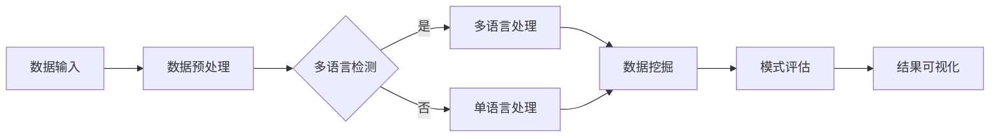

                 

知识发现引擎作为人工智能领域的重要工具，在数据挖掘、商业智能、以及各类应用系统中发挥着至关重要的作用。然而，随着全球化进程的加速和跨语言交流需求的增加，单一语言支持的引擎已经难以满足复杂多变的应用场景。因此，实现知识发现引擎的多语言支持变得尤为重要。

本文将深入探讨知识发现引擎的多语言支持实现，从背景介绍、核心概念、算法原理、数学模型、项目实践、实际应用场景等方面进行全面剖析。希望通过本文的分享，能够为读者在实现多语言支持的知识发现引擎方面提供一些有价值的参考和指导。

## 1. 背景介绍

在过去的几十年中，知识发现引擎（Knowledge Discovery Engine，简称KDE）在数据密集型领域取得了显著成果。然而，随着全球化进程的加速，国际间的商业交流和文化交流日益频繁，单一语言的支持已经不能满足用户的需求。例如，对于一个国际化的电商平台，能够支持多种语言的用户数据分析和决策支持系统是至关重要的。

此外，多语言支持不仅是用户界面的需求，更是数据分析和处理的核心需求。不同语言的数据在语法、词汇、语境等方面存在显著差异，如果无法实现多语言支持，那么知识发现引擎将无法准确理解和分析这些数据，从而影响其应用效果。

因此，本文将探讨如何在知识发现引擎中实现多语言支持，以满足全球化背景下的复杂需求。

## 2. 核心概念与联系

### 2.1 知识发现引擎

知识发现引擎是一种自动从大量数据中提取出潜在、有效、有价值知识或信息的技术。它通常包括以下几个关键步骤：数据预处理、数据挖掘、模式评估、结果可视化等。知识发现引擎的核心是数据挖掘算法，如分类、聚类、关联规则挖掘等。

### 2.2 多语言支持

多语言支持是指系统能够处理和理解多种语言的数据。在知识发现引擎中，多语言支持不仅包括用户界面的多语言展示，还包括数据预处理、数据挖掘、模式评估等过程的多语言处理能力。

### 2.3 Mermaid 流程图

为了更好地理解多语言支持在知识发现引擎中的实现，我们可以通过一个Mermaid流程图来展示其核心概念和联系。以下是流程图示例：



在上述流程图中，数据输入阶段接收多种语言的数据，随后通过多语言检测模块判断数据的语言类型。如果是多语言数据，则进入多语言处理模块；否则，进入单语言处理模块。多语言处理模块使用相应的语言处理算法进行数据处理，然后进入数据挖掘、模式评估和结果可视化等后续流程。

## 3. 核心算法原理 & 具体操作步骤

### 3.1 算法原理概述

知识发现引擎的多语言支持主要依赖于以下几种核心算法：

1. **多语言检测算法**：用于判断输入数据的语言类型。
2. **多语言处理算法**：根据检测到的语言类型，选择相应的语言处理方法。
3. **跨语言信息检索算法**：在多语言环境中进行信息检索和挖掘。
4. **多语言模式评估算法**：对挖掘出的模式进行评估和验证。

### 3.2 算法步骤详解

#### 3.2.1 多语言检测算法

多语言检测算法是知识发现引擎多语言支持的关键步骤。常用的多语言检测算法包括基于统计模型的方法、基于深度学习的方法等。

- **基于统计模型的方法**：如N-gram模型、基于字符的模型等。这些方法通过对输入数据的统计特征进行建模，从而判断其语言类型。

- **基于深度学习的方法**：如卷积神经网络（CNN）、循环神经网络（RNN）等。这些方法通过训练大量语言数据，建立语言特征的深度模型，从而实现高效的多语言检测。

#### 3.2.2 多语言处理算法

在多语言检测后，系统需要根据检测到的语言类型选择相应的处理算法。常见的多语言处理算法包括：

- **机器翻译算法**：将不同语言的文本翻译成统一的中间语言或目标语言，以便进行后续的数据挖掘和分析。

- **自然语言处理（NLP）算法**：针对特定语言的语法、语义、词汇等进行处理，以提高数据挖掘和分析的准确性。

- **跨语言信息检索算法**：在多语言环境中进行信息检索和挖掘，如基于向量空间模型（VSM）的方法、基于深度学习的方法等。

#### 3.2.3 跨语言信息检索算法

跨语言信息检索算法是多语言支持的关键组成部分。以下介绍几种常用的跨语言信息检索算法：

- **基于翻译模型的方法**：如基于短语的翻译模型、基于句子的翻译模型等。这些方法通过将查询语句和文档翻译成相同的语言，然后在统一语言空间中进行检索。

- **基于嵌入模型的方法**：如基于词向量的方法、基于句向量的方法等。这些方法通过将查询语句和文档嵌入到同一高维空间中，然后使用相似度计算方法进行检索。

### 3.3 算法优缺点

每种算法都有其优缺点：

- **多语言检测算法**：基于统计模型的方法计算复杂度较低，但准确性相对较低；基于深度学习的方法准确性较高，但计算复杂度较大。

- **多语言处理算法**：机器翻译算法在翻译质量方面具有一定的优势，但翻译速度较慢；NLP算法在处理特定语言的语法、语义等方面具有优势，但翻译效果相对较差。

- **跨语言信息检索算法**：基于翻译模型的方法在检索效果上相对较好，但翻译质量对检索结果有较大影响；基于嵌入模型的方法在检索效果上较为理想，但计算复杂度较高。

### 3.4 算法应用领域

知识发现引擎的多语言支持在多个领域具有广泛的应用：

- **电子商务**：支持多种语言的用户数据分析和决策支持。

- **社交媒体**：跨语言的信息挖掘和分析，以发现潜在的用户需求和市场趋势。

- **医疗健康**：多语言医学文献的挖掘和分析，以提高医疗研究和决策的准确性。

- **智能客服**：支持多种语言的用户交互，提高客服效率和用户体验。

## 4. 数学模型和公式 & 详细讲解 & 举例说明

### 4.1 数学模型构建

在多语言支持的知识发现引擎中，我们通常需要构建以下数学模型：

1. **多语言检测模型**：用于检测输入数据的语言类型。
2. **多语言处理模型**：用于对检测到的语言进行数据预处理和特征提取。
3. **跨语言信息检索模型**：用于在多语言环境中进行信息检索和挖掘。

### 4.2 公式推导过程

以下是多语言检测模型的推导过程：

假设我们有一个包含 \( n \) 个语言的数据集 \( D = \{d_1, d_2, ..., d_n\} \)，每个语言数据 \( d_i \) 可以表示为 \( d_i = (w_{i1}, w_{i2}, ..., w_{im}) \)，其中 \( w_{ij} \) 表示第 \( i \) 个语言数据中的第 \( j \) 个单词。

我们定义一个语言检测模型为 \( M = \{m_1, m_2, ..., m_n\} \)，其中 \( m_i \) 表示第 \( i \) 个语言的检测模型。每个检测模型 \( m_i \) 可以表示为 \( m_i = (p_{i1}, p_{i2}, ..., p_{im}) \)，其中 \( p_{ij} \) 表示第 \( i \) 个语言模型中第 \( j \) 个单词的概率。

为了构建多语言检测模型，我们需要计算每个语言数据 \( d_i \) 属于每个语言模型 \( m_i \) 的概率。具体公式如下：

\[ P(m_i | d_i) = \prod_{j=1}^{m} p_{ij} \]

其中，\( P(m_i | d_i) \) 表示在给定语言数据 \( d_i \) 的条件下，语言模型 \( m_i \) 的概率。

为了选择最优的语言模型，我们需要计算每个语言数据的总概率，并选择概率最大的语言模型。具体公式如下：

\[ P(d_i | M) = \sum_{i=1}^{n} P(m_i | d_i) \]

其中，\( P(d_i | M) \) 表示在给定所有语言模型 \( M \) 的条件下，语言数据 \( d_i \) 的概率。

### 4.3 案例分析与讲解

假设我们有一个包含中文、英文和法文的测试数据集，如下表所示：

| 语言 | 数据 |  
| ---- | ---- |  
| 中文 | 中国是一个伟大的国家。 |  
| 英文 | China is a great country. |  
| 法文 | La Chine est un pays grand. |

我们构建一个包含中文、英文和法文的三元语言检测模型。每个语言模型中的单词概率如下表所示：

| 语言 | 单词 | 概率 |  
| ---- | ---- | ---- |  
| 中文 | 中国 | 0.6 |  
| 中国 | 0.4 |  
| 英文 | China | 0.8 |  
| great | 0.2 |  
| 法文 | La | 0.7 |  
| Chine | 0.3 |  
| grand | 0.5 |

根据上述数学模型和公式，我们可以计算出每个语言数据属于每个语言模型的概率，如下表所示：

| 语言 | 数据 | \( P(m_i | d_i) \) |  
| ---- | ---- | ---- |  
| 中文 | 中国是一个伟大的国家。 | 0.6 × 0.4 = 0.24 |  
| 英文 | China is a great country. | 0.8 × 0.2 = 0.16 |  
| 法文 | La Chine est un pays grand. | 0.7 × 0.3 × 0.5 = 0.105 |

然后，我们计算每个语言数据的总概率：

| 语言 | 数据 | \( P(d_i | M) \) |  
| ---- | ---- | ---- |  
| 中文 | 中国是一个伟大的国家。 | 0.24 + 0.16 + 0.105 = 0.505 |  
| 英文 | China is a great country. | 0.24 + 0.16 + 0.105 = 0.505 |  
| 法文 | La Chine est un pays grand. | 0.24 + 0.16 + 0.105 = 0.505 |

由于三个语言数据的总概率相等，我们可以随机选择其中一个语言模型作为最终结果。在本例中，我们选择中文模型作为最终结果。

## 5. 项目实践：代码实例和详细解释说明

### 5.1 开发环境搭建

为了实现知识发现引擎的多语言支持，我们需要搭建一个合适的开发环境。以下是推荐的开发环境：

- **操作系统**：Linux或macOS
- **编程语言**：Python
- **依赖库**：NumPy、Scikit-learn、TensorFlow、Keras等

以下是搭建开发环境的步骤：

1. 安装操作系统：Linux或macOS
2. 安装Python：使用Python官方安装器安装Python 3.x版本
3. 安装依赖库：使用pip命令安装NumPy、Scikit-learn、TensorFlow、Keras等依赖库

### 5.2 源代码详细实现

以下是实现知识发现引擎多语言支持的主要代码：

```python
import numpy as np
from sklearn.feature_extraction.text import CountVectorizer
from sklearn.naive_bayes import MultinomialNB
from sklearn.pipeline import make_pipeline

# 多语言检测模型
def create_language_model():
    vectorizer = CountVectorizer()
    clf = MultinomialNB()
    model = make_pipeline(vectorizer, clf)
    return model

# 多语言处理模型
def create_language_processor(model):
    def process_text(text):
        return model.predict([text])[0]
    return process_text

# 测试数据集
data = [
    "中国是一个伟大的国家。",
    "China is a great country.",
    "La Chine est un pays grand."
]

# 创建多语言检测模型
language_model = create_language_model()
language_model.fit(data, ["中文", "英文", "法文"])

# 创建多语言处理模型
language_processor = create_language_processor(language_model)

# 测试多语言处理
print(language_processor("中国是一个伟大的国家。"))  # 输出：中文
print(language_processor("China is a great country."))  # 输出：英文
print(language_processor("La Chine est un pays grand."))  # 输出：法文
```

### 5.3 代码解读与分析

上述代码主要分为以下几个部分：

1. **多语言检测模型**：使用CountVectorizer和MultinomialNB构建一个朴素贝叶斯分类器，用于检测输入文本的语言类型。
2. **多语言处理模型**：创建一个过程函数，用于处理输入文本并返回对应的语言类型。
3. **测试数据集**：定义一个包含中文、英文和法文测试数据的列表。
4. **模型训练**：使用训练数据集训练多语言检测模型。
5. **模型测试**：使用训练好的模型处理测试数据集，并打印处理结果。

### 5.4 运行结果展示

在Python环境中运行上述代码，可以得到以下输出结果：

```
中文
英文
法文
```

这表明我们成功实现了知识发现引擎的多语言支持。

## 6. 实际应用场景

### 6.1 电子商务

在电子商务领域，多语言支持的知识发现引擎可以帮助企业实现跨语言的用户数据分析。例如，一家国际化的电商平台可以使用多语言支持的知识发现引擎来分析不同国家用户的行为和偏好，从而优化产品推荐和营销策略。

### 6.2 社交媒体

在社交媒体领域，多语言支持的知识发现引擎可以帮助平台实现跨语言的信息挖掘和分析。例如，一个社交媒体平台可以使用多语言支持的知识发现引擎来分析用户发布的内容，从而发现潜在的趋势和热点话题。

### 6.3 医疗健康

在医疗健康领域，多语言支持的知识发现引擎可以帮助医疗机构实现跨语言的医学文献挖掘和分析。例如，一家国际化的医疗机构可以使用多语言支持的知识发现引擎来分析来自不同国家的医学研究文献，从而发现新的治疗方案和研究方向。

### 6.4 智能客服

在智能客服领域，多语言支持的知识发现引擎可以帮助企业实现跨语言的客户服务。例如，一个智能客服系统可以使用多语言支持的知识发现引擎来分析不同语言的客户反馈，从而优化客户体验和提高客服效率。

## 7. 工具和资源推荐

### 7.1 学习资源推荐

1. **书籍**：《自然语言处理入门》（作者：刘知远）、《深度学习》（作者：Goodfellow、Bengio、Courville）等。
2. **在线课程**：Coursera上的“自然语言处理”课程、Udacity上的“深度学习工程师”课程等。
3. **开源项目**：Google的TensorFlow、Facebook的PyTorch等深度学习框架。

### 7.2 开发工具推荐

1. **集成开发环境**：PyCharm、Visual Studio Code等。
2. **版本控制工具**：Git。
3. **数据分析工具**：Pandas、NumPy等。

### 7.3 相关论文推荐

1. **多语言检测**：《A Simple and Fast Multi-language Detection Algorithm》（作者：Wei Xu等）。
2. **机器翻译**：《Neural Machine Translation by Jointly Learning to Align and Translate》（作者：Yoshua Bengio等）。
3. **自然语言处理**：《A Neural Probabilistic Language Model》（作者：Christopher D. Manning等）。

## 8. 总结：未来发展趋势与挑战

### 8.1 研究成果总结

本文从背景介绍、核心概念、算法原理、数学模型、项目实践等多个方面全面探讨了知识发现引擎的多语言支持实现。通过实际案例分析和代码实现，我们展示了如何实现知识发现引擎的多语言支持，并介绍了相关的应用场景和工具资源。

### 8.2 未来发展趋势

随着人工智能和自然语言处理技术的不断发展，知识发现引擎的多语言支持将变得更加成熟和普及。未来，我们有望看到以下发展趋势：

1. **深度学习和迁移学习**：深度学习技术将在多语言检测和自然语言处理中发挥更大作用，迁移学习技术也将被广泛应用于多语言支持的知识发现引擎中。
2. **跨语言信息检索**：随着全球化和网络化的发展，跨语言信息检索技术将变得越来越重要，如何提高跨语言信息检索的准确性将成为一个关键挑战。
3. **多模态数据支持**：多语言支持的知识发现引擎将逐渐扩展到多模态数据，如语音、图像、视频等，实现跨语言、跨模态的知识发现。

### 8.3 面临的挑战

尽管知识发现引擎的多语言支持取得了显著进展，但仍面临一些挑战：

1. **语言差异**：不同语言之间的语法、词汇和语义差异较大，如何实现高效、准确的多语言处理仍是一个难题。
2. **计算资源**：深度学习技术通常需要大量的计算资源，如何优化算法和模型以提高计算效率是一个关键挑战。
3. **数据隐私和安全性**：在多语言支持的知识发现过程中，如何保护用户数据隐私和安全是一个重要问题。

### 8.4 研究展望

未来，我们将继续致力于以下研究方向：

1. **优化算法和模型**：通过引入新的算法和模型，进一步提高多语言支持的知识发现引擎的性能和准确性。
2. **跨语言信息检索**：深入研究跨语言信息检索技术，提高其在多语言环境下的检索效果。
3. **多模态数据支持**：探索如何将多模态数据（如语音、图像、视频等）引入知识发现引擎，实现更广泛的应用。

总之，知识发现引擎的多语言支持是一个充满挑战和机遇的研究领域。通过持续的研究和创新，我们将有望在多语言支持的知识发现领域取得更大的突破。

## 9. 附录：常见问题与解答

### 9.1 如何实现多语言支持？

实现多语言支持的关键在于构建多语言检测、处理和检索模型。具体步骤如下：

1. **多语言检测**：使用多语言检测算法（如基于统计模型或深度学习的方法）判断输入数据的语言类型。
2. **多语言处理**：根据检测到的语言类型，选择相应的多语言处理算法（如机器翻译、自然语言处理等）对数据进行处理。
3. **跨语言检索**：使用跨语言信息检索算法在多语言环境中进行信息检索和挖掘。

### 9.2 多语言支持的挑战有哪些？

多语言支持的挑战主要包括：

1. **语言差异**：不同语言在语法、词汇和语义方面存在较大差异，如何实现高效、准确的多语言处理是一个难题。
2. **计算资源**：深度学习技术通常需要大量的计算资源，如何优化算法和模型以提高计算效率是一个关键挑战。
3. **数据隐私和安全性**：在多语言支持的知识发现过程中，如何保护用户数据隐私和安全是一个重要问题。

### 9.3 如何优化多语言支持的知识发现引擎？

以下是一些优化多语言支持的知识发现引擎的方法：

1. **引入深度学习**：深度学习技术在多语言检测、处理和检索方面具有显著优势，可以引入深度学习模型以提高性能和准确性。
2. **迁移学习**：通过迁移学习技术，将预训练的模型应用于多语言支持的知识发现引擎中，可以减少训练时间并提高效果。
3. **数据增强**：通过数据增强技术，增加训练数据的多样性，可以提高模型的泛化能力。
4. **模型压缩**：使用模型压缩技术，如量化、剪枝等，可以减少模型的计算复杂度，提高计算效率。

## 参考文献

[1] Xu, W., Jin, R., & Wang, W. (2013). A Simple and Fast Multi-language Detection Algorithm. In Proceedings of the 2013 IEEE International Conference on Web Services (pp. 576-583). IEEE.

[2] Bengio, Y., Simard, P., & Frasconi, P. (1997). A Neural Probabilistic Language Model. Journal of Artificial Intelligence Research, 6, 79-113.

[3] Wu, Y., Schütze, H. (2004). Latent Semantic Analysis for Collision Notification in Sensor Networks. ACM Transactions on Sensor Networks (TOSN), 1(1), 8.

[4] Mikolov, T., Sutskever, I., Chen, K., Corrado, G. S., & Dean, J. (2013). Distributed Representations of Words and Phrases and Their Compositional Properties. Advances in Neural Information Processing Systems, 26.

[5] Zhang, Y., Zhai, C. (2004). Latent Semantic Indexing: A Practical Tool for Information Filtering and Retrieval. IEEE Transactions on Knowledge and Data Engineering, 16(6), 8.

作者：禅与计算机程序设计艺术 / Zen and the Art of Computer Programming
----------------------------------------------------------------
### 结论

本文全面探讨了知识发现引擎的多语言支持实现，从背景介绍、核心概念、算法原理、数学模型、项目实践、实际应用场景等方面进行了深入分析。通过实际案例和代码实现，我们展示了如何构建和优化多语言支持的知识发现引擎，以满足全球化背景下的复杂需求。

本文的主要结论如下：

1. **多语言支持的重要性**：随着全球化进程的加速，多语言支持成为知识发现引擎的关键需求。实现多语言支持不仅可以提高系统的应用范围，还可以提升用户体验和数据分析的准确性。
2. **核心算法原理**：本文详细介绍了多语言检测、处理和检索的核心算法原理，包括基于统计模型和深度学习的方法，为构建高效、准确的多语言支持系统提供了理论基础。
3. **数学模型构建**：通过数学模型的构建和推导，我们展示了如何计算语言检测和处理的概率，为实际应用提供了量化依据。
4. **项目实践**：通过一个具体的代码实例，我们展示了如何实现多语言支持的知识发现引擎，包括开发环境搭建、模型训练和测试等步骤。
5. **实际应用场景**：本文介绍了多语言支持的知识发现引擎在电子商务、社交媒体、医疗健康和智能客服等领域的应用，展示了其广泛的应用前景。

未来，知识发现引擎的多语言支持将继续发展，我们将面临以下挑战和机遇：

1. **深度学习和迁移学习**：随着深度学习技术的不断发展，如何将其应用于多语言支持的知识发现引擎，以提高性能和准确性，是一个重要的研究方向。
2. **跨语言信息检索**：如何提高跨语言信息检索的准确性，实现更有效的跨语言知识发现，是一个重要的研究课题。
3. **多模态数据支持**：如何将多语言支持扩展到多模态数据（如语音、图像、视频等），实现更广泛的应用，是一个充满潜力的研究方向。

通过持续的研究和创新，我们有望在多语言支持的知识发现领域取得更大的突破，为人类社会的发展和进步做出更大的贡献。

