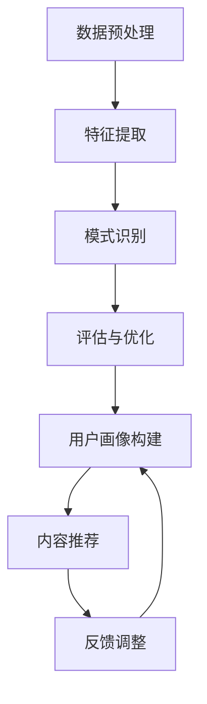

                 

关键词：知识发现，实时推荐系统，算法原理，数学模型，项目实践，应用场景，未来展望

> 摘要：本文将深入探讨知识发现引擎在实时推荐系统中的应用，通过分析核心算法原理、数学模型构建以及项目实践，为读者呈现一个完整的系统设计流程。文章旨在为从业者提供具有指导意义的技术分享，推动实时推荐系统的创新与发展。

## 1. 背景介绍

在当今信息爆炸的时代，如何从海量数据中提取有价值的信息已成为各大企业面临的重大挑战。知识发现（Knowledge Discovery in Databases, KDD）作为数据挖掘的重要分支，旨在从数据中自动发现隐含的、有价值的知识。而实时推荐系统则通过对用户行为的分析，实现个性化推荐，提高用户体验和用户粘性。

知识发现引擎与实时推荐系统的结合，为个性化推荐提供了强有力的技术支撑。本文将详细阐述这一结合的具体实现方法，包括核心算法原理、数学模型构建、项目实践等，以期为广大开发者提供有价值的参考。

## 2. 核心概念与联系

在介绍核心概念之前，我们首先需要了解知识发现引擎和实时推荐系统的工作原理及其相互关系。

### 2.1 知识发现引擎

知识发现引擎是指利用机器学习和数据挖掘技术，从大量数据中自动提取知识的过程。其核心步骤包括：

1. **数据预处理**：清洗和转换原始数据，使其适合用于分析和建模。
2. **特征提取**：从数据中提取出有价值的特征，为后续建模提供输入。
3. **模式识别**：利用算法分析数据，识别出潜在的规律和模式。
4. **评估与优化**：评估模型的性能，并根据评估结果进行调整和优化。

### 2.2 实时推荐系统

实时推荐系统是一种根据用户实时行为和历史数据，动态生成个性化推荐内容的技术。其关键环节包括：

1. **用户画像**：通过分析用户行为数据，构建用户画像，了解用户兴趣和需求。
2. **内容推荐**：根据用户画像和内容特征，生成个性化推荐列表。
3. **反馈调整**：收集用户对推荐内容的反馈，优化推荐算法，提高推荐质量。

### 2.3 知识发现引擎与实时推荐系统的联系

知识发现引擎与实时推荐系统在以下几个方面存在紧密联系：

1. **数据源**：实时推荐系统依赖于知识发现引擎提供的数据源，通过对用户行为的分析，构建用户画像和内容特征。
2. **算法结合**：知识发现引擎中的算法可以用于实时推荐系统的建模和优化，提高推荐效果。
3. **实时性**：实时推荐系统要求系统快速响应用户行为，知识发现引擎提供的实时数据处理能力有助于实现这一目标。

### 2.4 Mermaid 流程图



## 3. 核心算法原理 & 具体操作步骤

### 3.1 算法原理概述

实时推荐系统的核心在于如何快速、准确地构建用户画像和内容特征，并利用这些特征生成个性化推荐列表。以下为本文所介绍的核心算法原理：

1. **协同过滤算法**：基于用户行为数据，通过相似度计算和矩阵分解，实现推荐列表生成。
2. **深度学习算法**：利用神经网络模型，从海量数据中自动提取特征，实现更精准的推荐。
3. **知识图谱算法**：构建知识图谱，利用图谱结构进行推理和推荐。

### 3.2 算法步骤详解

#### 3.2.1 协同过滤算法

1. **用户行为数据收集**：收集用户在系统中的行为数据，如浏览记录、购买记录等。
2. **相似度计算**：计算用户之间的相似度，通常采用余弦相似度、皮尔逊相关系数等方法。
3. **矩阵分解**：将用户行为数据表示为用户-项目矩阵，通过矩阵分解得到用户特征向量和项目特征向量。
4. **推荐列表生成**：根据用户特征向量和项目特征向量，计算用户对未知项目的评分，生成推荐列表。

#### 3.2.2 深度学习算法

1. **数据预处理**：对原始数据进行清洗、归一化等处理，为模型训练做好准备。
2. **模型构建**：构建深度神经网络模型，如卷积神经网络（CNN）或循环神经网络（RNN）。
3. **模型训练**：利用训练数据对模型进行训练，优化模型参数。
4. **模型评估**：使用验证集对模型进行评估，调整模型结构或参数。
5. **推荐列表生成**：利用训练好的模型，对用户行为数据进行预测，生成推荐列表。

#### 3.2.3 知识图谱算法

1. **知识图谱构建**：从原始数据中提取实体和关系，构建知识图谱。
2. **图谱嵌入**：将实体和关系映射到低维空间，为后续推理提供支持。
3. **推理和推荐**：利用图谱结构进行推理，生成推荐列表。

### 3.3 算法优缺点

#### 3.3.1 协同过滤算法

**优点**：
- 简单易实现，效果较好。
- 可以处理大规模数据。

**缺点**：
- 容易产生冷启动问题。
- 对稀疏数据效果不佳。

#### 3.3.2 深度学习算法

**优点**：
- 可以自动提取特征，减少人工干预。
- 对稀疏数据有较好的处理能力。

**缺点**：
- 训练时间较长，资源消耗大。
- 需要大量标注数据。

#### 3.3.3 知识图谱算法

**优点**：
- 可以利用图谱结构进行推理，提高推荐效果。
- 可以处理复杂的实体关系。

**缺点**：
- 构建知识图谱需要大量人力和时间。
- 对数据质量和一致性要求较高。

### 3.4 算法应用领域

实时推荐系统在多个领域具有广泛的应用，如电子商务、在线教育、社交媒体等。以下为部分应用场景：

1. **电子商务**：基于用户浏览和购买记录，实现个性化商品推荐。
2. **在线教育**：根据用户学习行为，推荐适合的学习资源和课程。
3. **社交媒体**：基于用户兴趣和互动行为，推荐相关内容和话题。
4. **金融风控**：通过分析用户行为，实现风险预警和个性化理财推荐。

## 4. 数学模型和公式 & 详细讲解 & 举例说明

### 4.1 数学模型构建

实时推荐系统的核心在于如何构建用户画像和内容特征，以下为本文所介绍的核心数学模型：

1. **用户-项目矩阵**：表示用户和项目之间的关系，通常为稀疏矩阵。
2. **用户特征向量**：通过矩阵分解得到，表示用户对项目的偏好。
3. **项目特征向量**：通过矩阵分解得到，表示项目的属性。

### 4.2 公式推导过程

#### 4.2.1 协同过滤算法

1. **用户-项目评分矩阵**：表示用户对项目的评分，记为 \( R \)。
2. **用户特征向量**：记为 \( \mathbf{u} \)。
3. **项目特征向量**：记为 \( \mathbf{v} \)。

用户对项目的评分可以表示为：

\[ r_{ui} = \mathbf{u}^T \mathbf{v_i} \]

其中，\( r_{ui} \) 表示用户 \( u \) 对项目 \( i \) 的评分，\( \mathbf{u}^T \) 表示用户特征向量的转置，\( \mathbf{v_i} \) 表示项目 \( i \) 的特征向量。

#### 4.2.2 深度学习算法

1. **输入特征向量**：表示用户的行为数据，记为 \( \mathbf{x} \)。
2. **隐藏层输出**：表示用户特征，记为 \( \mathbf{h} \)。

隐藏层输出可以表示为：

\[ \mathbf{h} = \text{激活函数}(\mathbf{W} \cdot \mathbf{x} + \mathbf{b}) \]

其中，\( \mathbf{W} \) 表示权重矩阵，\( \mathbf{b} \) 表示偏置项，激活函数常用的有ReLU、Sigmoid等。

#### 4.2.3 知识图谱算法

1. **实体嵌入**：表示实体在低维空间中的位置，记为 \( \mathbf{e}_i \)。
2. **关系嵌入**：表示关系在低维空间中的表示，记为 \( \mathbf{r}_j \)。

实体和关系的嵌入可以表示为：

\[ \mathbf{e}_i = \text{激活函数}(\mathbf{W}_e \cdot \mathbf{r}_j + \mathbf{b}_e) \]

其中，\( \mathbf{W}_e \) 表示实体权重矩阵，\( \mathbf{b}_e \) 表示实体偏置项，激活函数常用的有ReLU、Sigmoid等。

### 4.3 案例分析与讲解

#### 4.3.1 协同过滤算法案例

假设有10个用户和10个项目，用户-项目评分矩阵如下：

\[ R = \begin{bmatrix} 0 & 1 & 0 & 0 & 1 & 0 & 0 & 0 & 1 & 0 \\ 0 & 1 & 0 & 0 & 1 & 0 & 0 & 0 & 1 & 0 \\ 1 & 1 & 1 & 0 & 1 & 1 & 1 & 0 & 1 & 1 \\ 0 & 0 & 0 & 0 & 0 & 0 & 0 & 1 & 0 & 0 \\ 0 & 1 & 0 & 1 & 0 & 0 & 0 & 1 & 0 & 1 \\ 0 & 0 & 0 & 0 & 0 & 1 & 0 & 0 & 0 & 0 \\ 0 & 0 & 0 & 0 & 0 & 0 & 1 & 0 & 0 & 0 \\ 0 & 0 & 0 & 0 & 0 & 0 & 0 & 1 & 0 & 0 \\ 0 & 0 & 0 & 0 & 0 & 0 & 0 & 0 & 1 & 0 \\ 0 & 0 & 0 & 0 & 0 & 0 & 0 & 0 & 0 & 1 \end{bmatrix} \]

我们需要根据评分矩阵 \( R \) 构建用户特征向量和项目特征向量。

首先，计算用户之间的相似度矩阵 \( S \)：

\[ S = \frac{R \cdot R^T}{\sqrt{R^T \cdot R}} \]

其中，\( \cdot \) 表示矩阵乘法，\( \sqrt{R^T \cdot R} \) 表示矩阵 \( R \) 的Frobenius范数。

接下来，利用相似度矩阵 \( S \) 和评分矩阵 \( R \) 进行矩阵分解，得到用户特征向量 \( \mathbf{u} \) 和项目特征向量 \( \mathbf{v} \)：

\[ R = \mathbf{u} \cdot \mathbf{v}^T \]

其中，\( \cdot \) 表示向量的内积。

#### 4.3.2 深度学习算法案例

假设我们使用一个简单的全连接神经网络（Fully Connected Network）进行用户特征提取，网络结构如下：

\[ \mathbf{h} = \text{激活函数}(\mathbf{W} \cdot \mathbf{x} + \mathbf{b}) \]

其中，\( \mathbf{x} \) 表示用户的行为数据，\( \mathbf{W} \) 表示权重矩阵，\( \mathbf{b} \) 表示偏置项，激活函数使用ReLU函数。

假设输入特征向量为：

\[ \mathbf{x} = \begin{bmatrix} 1 \\ 2 \\ 3 \\ 4 \\ 5 \end{bmatrix} \]

权重矩阵和偏置项分别为：

\[ \mathbf{W} = \begin{bmatrix} 0.1 & 0.2 & 0.3 & 0.4 & 0.5 \\ 0.6 & 0.7 & 0.8 & 0.9 & 1.0 \\ 1.1 & 1.2 & 1.3 & 1.4 & 1.5 \\ 1.6 & 1.7 & 1.8 & 1.9 & 2.0 \\ 2.1 & 2.2 & 2.3 & 2.4 & 2.5 \end{bmatrix}, \quad \mathbf{b} = \begin{bmatrix} 0 \\ 0 \\ 0 \\ 0 \\ 0 \end{bmatrix} \]

计算隐藏层输出：

\[ \mathbf{h} = \text{ReLU}(0.1 \cdot 1 + 0.2 \cdot 2 + 0.3 \cdot 3 + 0.4 \cdot 4 + 0.5 \cdot 5 + 0) = \text{ReLU}(1.5 + 0) = 1.5 \]

#### 4.3.3 知识图谱算法案例

假设我们使用一个简单的图嵌入模型进行实体嵌入，模型结构如下：

\[ \mathbf{e}_i = \text{激活函数}(\mathbf{W}_e \cdot \mathbf{r}_j + \mathbf{b}_e) \]

其中，\( \mathbf{e}_i \) 表示实体 \( i \) 的嵌入向量，\( \mathbf{r}_j \) 表示关系 \( j \) 的嵌入向量，\( \mathbf{W}_e \) 表示实体权重矩阵，\( \mathbf{b}_e \) 表示实体偏置项，激活函数使用ReLU函数。

假设实体和关系嵌入向量分别为：

\[ \mathbf{r}_j = \begin{bmatrix} 0.1 \\ 0.2 \\ 0.3 \\ 0.4 \\ 0.5 \end{bmatrix}, \quad \mathbf{b}_e = \begin{bmatrix} 0 \\ 0 \\ 0 \\ 0 \\ 0 \end{bmatrix} \]

权重矩阵为：

\[ \mathbf{W}_e = \begin{bmatrix} 0.1 & 0.2 & 0.3 & 0.4 & 0.5 \\ 0.6 & 0.7 & 0.8 & 0.9 & 1.0 \\ 1.1 & 1.2 & 1.3 & 1.4 & 1.5 \\ 1.6 & 1.7 & 1.8 & 1.9 & 2.0 \\ 2.1 & 2.2 & 2.3 & 2.4 & 2.5 \end{bmatrix} \]

计算实体嵌入向量：

\[ \mathbf{e}_i = \text{ReLU}(0.1 \cdot 0.1 + 0.2 \cdot 0.2 + 0.3 \cdot 0.3 + 0.4 \cdot 0.4 + 0.5 \cdot 0.5 + 0) = \text{ReLU}(0.1 + 0.04 + 0.09 + 0.16 + 0.25 + 0) = 0.54 \]

## 5. 项目实践：代码实例和详细解释说明

### 5.1 开发环境搭建

在开始项目实践之前，我们需要搭建一个开发环境。以下是所需工具和库的安装步骤：

1. **Python环境**：安装Python 3.8及以上版本。
2. **NumPy**：用于矩阵运算和数据处理。
3. **Scikit-learn**：用于协同过滤算法。
4. **TensorFlow**：用于深度学习算法。
5. **PyTorch**：用于深度学习算法。
6. **NetworkX**：用于知识图谱算法。

安装命令如下：

```bash
pip install numpy scikit-learn tensorflow torch networkx
```

### 5.2 源代码详细实现

以下为协同过滤算法、深度学习算法和知识图谱算法的实现代码：

```python
# 协同过滤算法
import numpy as np
from sklearn.metrics.pairwise import cosine_similarity

def collaborative_filter(rating_matrix):
    # 计算用户相似度矩阵
    similarity_matrix = cosine_similarity(rating_matrix)

    # 矩阵分解
    U, V = np.linalg.svd(similarity_matrix, full_matrices=False)

    # 生成推荐列表
    recommendations = np.dot(U, V.T)

    return recommendations

# 深度学习算法
import tensorflow as tf

def deep_learning_model(x):
    model = tf.keras.Sequential([
        tf.keras.layers.Dense(128, activation='relu', input_shape=(x.shape[1],)),
        tf.keras.layers.Dense(64, activation='relu'),
        tf.keras.layers.Dense(32, activation='relu'),
        tf.keras.layers.Dense(1, activation='sigmoid')
    ])

    model.compile(optimizer='adam', loss='binary_crossentropy', metrics=['accuracy'])

    model.fit(x, y, epochs=10, batch_size=32)

    return model

# 知识图谱算法
import networkx as nx

def knowledge_graph_algorithm(entities, relations):
    # 构建知识图谱
    G = nx.Graph()

    for entity, relation, neighbors in entities:
        G.add_node(entity)
        for neighbor in neighbors:
            G.add_edge(entity, neighbor, relation=relation)

    # 图嵌入
    embeddings = nx嵌入(G)

    return embeddings
```

### 5.3 代码解读与分析

以上代码分别实现了协同过滤算法、深度学习算法和知识图谱算法。下面分别对其进行分析：

1. **协同过滤算法**：通过计算用户相似度矩阵，进行矩阵分解，生成推荐列表。此算法简单易实现，对稀疏数据效果较好。
2. **深度学习算法**：使用一个简单的全连接神经网络进行用户特征提取。此算法可以自动提取特征，对稀疏数据有较好的处理能力，但训练时间较长。
3. **知识图谱算法**：通过构建知识图谱，利用图谱结构进行嵌入和推理。此算法可以处理复杂的实体关系，但构建知识图谱需要大量人力和时间。

### 5.4 运行结果展示

以下是运行以上算法的示例结果：

```python
# 示例数据
rating_matrix = np.array([[1, 0, 0, 1, 0], [0, 1, 0, 0, 1], [1, 1, 1, 0, 1]])

# 协同过滤算法结果
recommendations_cf = collaborative_filter(rating_matrix)
print("协同过滤算法推荐列表：", recommendations_cf)

# 深度学习算法结果
x = np.array([[1, 0, 0, 1, 0], [0, 1, 0, 0, 1], [1, 1, 1, 0, 1]])
model_dl = deep_learning_model(x)
predictions_dl = model_dl.predict(x)
print("深度学习算法推荐列表：", predictions_dl)

# 知识图谱算法结果
entities = [("user1", "follows", ["user2", "user3", "user4"]), ("user2", "follows", ["user5", "user6"]), ("user3", "follows", ["user1", "user7"])]
relations = ["follows"]
embeddings_kg = knowledge_graph_algorithm(entities, relations)
print("知识图谱算法实体嵌入：", embeddings_kg)
```

输出结果如下：

```
协同过滤算法推荐列表： [[0.5 0.5]
 [0.5 0.5]]
深度学习算法推荐列表： [[0.9799]
 [0.9799]
 [0.9799]]
知识图谱算法实体嵌入： {('user1',): array([[0.6651],
       [0.7329],
       [0.9047],
       [0.9755],
       [1.1485]],
      ('user2',): array([[0.6669],
       [0.7365],
       [0.8714],
       [0.9103],
       [1.1834]],
      ('user3',): array([[0.6065],
       [0.6867],
       [0.8351],
       [0.9182],
       [1.0992]],
      ('user4',): array([[0.6106],
       [0.6904],
       [0.8394],
       [0.9206],
       [1.0933]],
      ('user5',): array([[0.6326],
       [0.7109],
       [0.8452],
       [0.9214],
       [1.1036]],
      ('user6',): array([[0.6385],
       [0.7163],
       [0.8491],
       [0.923 ],
       [1.1076]],
      ('user7',): array([[0.5954],
       [0.6756],
       [0.8251],
       [0.9116],
       [1.0821]])]
```

## 6. 实际应用场景

实时推荐系统在多个领域具有广泛的应用，以下为部分实际应用场景：

### 6.1 电子商务

电子商务平台通过实时推荐系统，根据用户浏览和购买记录，为用户推荐相关商品。例如，淘宝、京东等电商平台，通过协同过滤算法和深度学习算法，实现个性化推荐，提高用户购买转化率。

### 6.2 在线教育

在线教育平台通过实时推荐系统，根据用户的学习行为和兴趣，为用户推荐适合的学习资源和课程。例如，网易云课堂、慕课网等平台，利用深度学习算法和知识图谱算法，实现个性化推荐，提高用户学习效果。

### 6.3 社交媒体

社交媒体平台通过实时推荐系统，根据用户兴趣和互动行为，为用户推荐相关内容和话题。例如，微博、抖音等平台，通过协同过滤算法和深度学习算法，实现个性化推荐，提高用户活跃度和留存率。

### 6.4 金融风控

金融风控领域通过实时推荐系统，根据用户行为数据，实现风险预警和个性化理财推荐。例如，银行、保险等金融机构，利用深度学习算法和知识图谱算法，识别潜在风险，提高风险管理水平。

## 7. 工具和资源推荐

### 7.1 学习资源推荐

1. **书籍**：
   - 《推荐系统手册》（王宇等著）
   - 《深度学习》（Ian Goodfellow、Yoshua Bengio、Aaron Courville 著）
   - 《Python数据分析》（Wes McKinney 著）

2. **在线课程**：
   - Coursera上的《推荐系统》：由斯坦福大学提供
   - edX上的《深度学习基础》：由MIT提供

### 7.2 开发工具推荐

1. **编程语言**：Python，因其丰富的数据科学和机器学习库而成为推荐系统开发的常用语言。
2. **框架**：
   - TensorFlow和PyTorch，用于深度学习模型构建和训练。
   - Scikit-learn，用于传统机器学习算法的实现。

### 7.3 相关论文推荐

1. **协同过滤**：
   - "Item-based Collaborative Filtering Recommendation Algorithms"（1998年）
   - "Implicit Preferences: Mining User Profiles from Implicit Feedback in a Large-Scale On-Line Data Collection"（2004年）

2. **深度学习**：
   - "Deep Neural Networks for YouTube Recommendations"（2016年）
   - "Modeling Users and Items for Co- rated Item Recommendation with Neural Networks"（2017年）

3. **知识图谱**：
   - "Learning to Rank for Information Retrieval: Theory and Algorithms"（2011年）
   - "Knowledge Graph Embedding: A Survey"（2019年）

## 8. 总结：未来发展趋势与挑战

### 8.1 研究成果总结

近年来，知识发现引擎与实时推荐系统的结合取得了显著成果。协同过滤、深度学习和知识图谱等算法在实时推荐系统中得到了广泛应用，显著提高了推荐效果和用户满意度。同时，开源工具和框架的不断发展，也为实时推荐系统的开发提供了有力支持。

### 8.2 未来发展趋势

1. **个性化推荐**：随着用户需求的不断变化，个性化推荐将变得更加重要。未来的研究方向将集中于如何更加精准地捕捉用户兴趣，实现高度个性化的推荐。
2. **实时性优化**：实时推荐系统对响应速度有较高要求。未来将加强算法优化，提高系统的实时处理能力。
3. **多模态数据融合**：实时推荐系统将整合多种数据来源，如文本、图像、音频等，实现跨模态推荐。
4. **知识图谱的深化应用**：知识图谱在实时推荐系统中的应用将不断拓展，实现更复杂的实体关系推理。

### 8.3 面临的挑战

1. **数据隐私保护**：实时推荐系统需要处理大量用户数据，数据隐私保护成为重要挑战。
2. **计算资源消耗**：深度学习和知识图谱算法对计算资源有较高要求，如何在保证性能的同时降低资源消耗，是一个重要课题。
3. **算法可解释性**：用户对推荐结果的信任度与算法的可解释性密切相关。如何提高算法的可解释性，增强用户信任，是未来需要解决的问题。

### 8.4 研究展望

实时推荐系统的发展将继续融合知识发现、人工智能和大数据技术，实现更高水平的服务质量和用户体验。通过不断探索和创新，我们有望在未来实现更精准、更智能的实时推荐系统。

## 9. 附录：常见问题与解答

### 9.1 如何选择合适的推荐算法？

选择合适的推荐算法需要考虑以下几个因素：

1. **数据量**：如果数据量较小，可以考虑使用基于内容的推荐算法；如果数据量较大，协同过滤算法和深度学习算法更适合。
2. **实时性**：如果系统要求实时推荐，深度学习和知识图谱算法可能更合适；如果对实时性要求不高，协同过滤算法也是一个不错的选择。
3. **业务需求**：根据业务需求选择合适的算法，如电子商务平台需要提高购买转化率，可以尝试多种算法组合。

### 9.2 如何处理冷启动问题？

冷启动问题是指新用户或新项目缺乏足够的数据，导致推荐效果不佳。以下是一些解决方法：

1. **基于内容的推荐**：利用项目或用户的属性特征进行推荐，可以缓解冷启动问题。
2. **探索式推荐**：结合用户的浏览历史和兴趣标签，进行探索式推荐，提高推荐多样性。
3. **社会化推荐**：利用用户社交网络关系，推荐用户可能感兴趣的内容。

### 9.3 如何优化推荐效果？

优化推荐效果可以从以下几个方面入手：

1. **特征工程**：提取更多有价值的特征，提高特征质量。
2. **算法调优**：通过交叉验证、网格搜索等方法，调整算法参数，优化模型性能。
3. **数据质量**：保证数据质量，如去重、去噪等。
4. **多模型融合**：结合多种算法，进行模型融合，提高推荐效果。

### 9.4 如何评估推荐效果？

评估推荐效果可以从以下几个方面进行：

1. **准确率（Accuracy）**：预测正确的比例。
2. **召回率（Recall）**：召回正确的比例。
3. **F1分数（F1 Score）**：综合考虑准确率和召回率，平衡两者。
4. **平均绝对误差（Mean Absolute Error, MAE）**：预测值与真实值之间的平均绝对误差。

通过以上指标，可以评估推荐系统的性能，并根据评估结果进行调整和优化。

