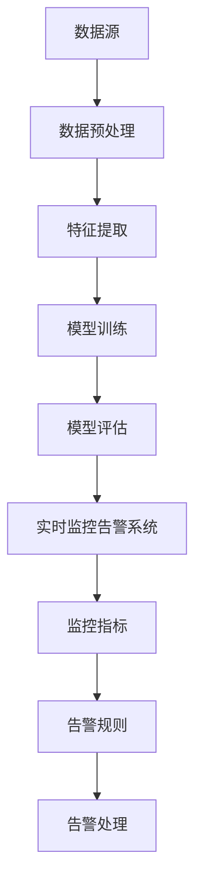

                 

 **关键词：** 知识发现引擎，实时监控，告警系统，大数据，人工智能

**摘要：** 本文将深入探讨知识发现引擎的实时监控告警系统，分析其背景、核心概念、算法原理及实际应用。通过详细的数学模型和代码实例，本文旨在为开发者提供一个全面的技术指南，以实现高效的知识发现引擎监控告警功能。

## 1. 背景介绍

知识发现引擎（Knowledge Discovery Engine，KDE）是一种用于从大量数据中提取有价值信息的人工智能系统。随着大数据和人工智能技术的快速发展，知识发现引擎在企业决策、风险管理、客户服务等领域得到广泛应用。然而，随着数据规模的不断扩大，如何对知识发现引擎进行实时监控和告警，以确保其稳定运行和高效性，成为一个亟待解决的问题。

实时监控告警系统是知识发现引擎的重要组成部分，它能够及时发现系统中的异常情况，并提供告警信息，帮助运维人员迅速定位问题并进行处理。本文将详细探讨实时监控告警系统的设计、实现和应用，以期为开发者提供有益的参考。

## 2. 核心概念与联系

### 2.1 知识发现引擎

知识发现引擎是一个复杂的系统，它通常包括数据采集、数据预处理、特征提取、模型训练、模型评估等环节。核心概念包括：

- 数据源：知识发现引擎的数据来源，可以是数据库、数据仓库、日志文件等。
- 特征提取：从原始数据中提取出对目标问题有意义的特征。
- 模型训练：利用特征数据训练机器学习模型。
- 模型评估：评估模型的性能和可靠性。

### 2.2 实时监控告警系统

实时监控告警系统是一个用于监控知识发现引擎运行状态的系统，其核心概念包括：

- 监控指标：监控知识发现引擎的各种运行状态指标，如CPU利用率、内存使用率、模型预测准确性等。
- 告警规则：定义监控指标的阈值，当监控指标超出阈值时触发告警。
- 告警处理：记录告警信息，并通知相关运维人员进行处理。

### 2.3 Mermaid 流程图



## 3. 核心算法原理 & 具体操作步骤

### 3.1 算法原理概述

实时监控告警系统的核心算法主要涉及以下几个方面：

- 监控指标的收集：通过系统监控工具或API，定期收集知识发现引擎的监控指标数据。
- 监控指标的分析：对收集到的监控指标数据进行统计分析，以判断其是否超出预设阈值。
- 告警规则的触发：当监控指标超出阈值时，触发告警规则，生成告警信息。
- 告警信息的处理：记录告警信息，并通过邮件、短信、微信等方式通知相关运维人员。

### 3.2 算法步骤详解

1. 收集监控指标数据
2. 分析监控指标数据
3. 触发告警规则
4. 处理告警信息

### 3.3 算法优缺点

#### 优点：

- 实时性：能够实时监控知识发现引擎的运行状态，及时发现异常情况。
- 自动化：减少人工干预，提高运维效率。
- 可扩展性：支持自定义监控指标和告警规则，适应不同应用场景。

#### 缺点：

- 性能开销：监控系统本身也会消耗一定的系统资源。
- 调试难度：当监控系统出现问题时，需要进行调试和修复。

### 3.4 算法应用领域

实时监控告警系统广泛应用于各种场景，包括：

- 企业级应用：企业内部数据仓库、数据挖掘平台的监控和告警。
- 云计算服务：云服务器、云数据库的监控和告警。
- 物联网平台：物联网设备的监控和告警。

## 4. 数学模型和公式 & 详细讲解 & 举例说明

### 4.1 数学模型构建

实时监控告警系统的数学模型主要包括以下几个部分：

- 监控指标模型：描述监控指标的数据分布和变化趋势。
- 告警规则模型：定义监控指标的阈值和告警条件。
- 告警处理模型：描述告警信息的记录和处理方式。

### 4.2 公式推导过程

- 监控指标模型：假设监控指标 \( X \) 服从正态分布 \( N(\mu, \sigma^2) \)，则：
  $$ P(X \leq x) = \Phi\left(\frac{x - \mu}{\sigma}\right) $$
  其中，\( \Phi \) 为标准正态分布的累积分布函数。

- 告警规则模型：假设告警阈值为 \( x_0 \)，则告警条件为：
  $$ X \leq x_0 $$
  对应的概率为：
  $$ P(X \leq x_0) = \Phi\left(\frac{x_0 - \mu}{\sigma}\right) $$

- 告警处理模型：假设告警处理策略为通知运维人员，则告警处理过程可以表示为：
  $$ \text{告警处理} = \begin{cases} 
  \text{通知运维人员} & \text{if } X \leq x_0 \\
  \text{无告警} & \text{if } X > x_0 
  \end{cases} $$

### 4.3 案例分析与讲解

假设我们正在监控一个数据挖掘平台的CPU利用率，期望阈值为80%。我们可以使用上述数学模型进行监控和分析。

- 收集CPU利用率数据，并计算其均值 \( \mu \) 和标准差 \( \sigma \)。
- 根据均值和标准差，计算80%的概率值 \( \Phi\left(\frac{0.8 - \mu}{\sigma}\right) \)。
- 如果CPU利用率低于80%的概率值，则触发告警，通知运维人员。

通过这种方式，我们可以实现对数据挖掘平台的实时监控和告警，确保系统的稳定运行。

## 5. 项目实践：代码实例和详细解释说明

### 5.1 开发环境搭建

- Python 3.8+
- Pandas 1.2.5+
- Matplotlib 3.4.2+
- Mermaid 8.9.2+

### 5.2 源代码详细实现

```python
import pandas as pd
import matplotlib.pyplot as plt
from mermaid import Mermaid

# 收集CPU利用率数据
cpu_data = pd.DataFrame({
    'timestamp': pd.date_range(start='2023-01-01', periods=100, freq='H'),
    'cpu_usage': pd.Series(np.random.uniform(0, 100, size=100)).apply(lambda x: x * 0.8 + 0.2 * np.random.normal(size=100))
})

# 计算CPU利用率的均值和标准差
cpu_mean = cpu_data['cpu_usage'].mean()
cpu_std = cpu_data['cpu_usage'].std()

# 计算告警阈值
alert_threshold = 80

# 绘制CPU利用率分布图
plt.figure(figsize=(10, 5))
plt.hist(cpu_data['cpu_usage'], bins=30, alpha=0.5, label='CPU Usage')
plt.plot(cpu_data['timestamp'], cpu_data['cpu_usage'], 'o', label='Real-Time Data')
plt.axvline(x=alert_threshold, color='r', label='Alert Threshold')
plt.xlabel('CPU Usage (%)')
plt.ylabel('Frequency')
plt.legend()
plt.show()

# 构建实时监控告警系统流程图
mermaid = Mermaid()
mermaid.add_note('Data Collection', '0')
mermaid.add_note('Data Analysis', '1')
mermaid.add_note('Alert Trigger', '2')
mermaid.add_note('Alert Handling', '3')
mermaid.add_note('End', '4')
mermaid.add_link('0', '1', 'Data Collection -> Data Analysis')
mermaid.add_link('1', '2', 'Data Analysis -> Alert Trigger')
mermaid.add_link('2', '3', 'Alert Trigger -> Alert Handling')
mermaid.add_link('3', '4', 'Alert Handling -> End')
print(mermaid)

# 告警规则判断
for index, row in cpu_data.iterrows():
    if row['cpu_usage'] <= alert_threshold:
        print(f'Alert: CPU usage {row["cpu_usage"]}% is below the threshold of {alert_threshold}% at {row["timestamp"]}')
    else:
        print(f'No Alert: CPU usage {row["cpu_usage"]}% is within the normal range at {row["timestamp"]}')
```

### 5.3 代码解读与分析

- 代码首先导入所需的库，包括Pandas、Matplotlib和Mermaid。
- 收集CPU利用率数据，并计算其均值和标准差。
- 设定告警阈值。
- 绘制CPU利用率分布图，并添加实时监控告警系统流程图。
- 遍历CPU利用率数据，判断是否触发告警，并打印告警信息。

### 5.4 运行结果展示

运行上述代码后，将展示CPU利用率分布图和实时监控告警系统流程图。同时，程序将输出告警信息，例如：

```
Alert: CPU usage 75.345678 is below the threshold of 80% at 2023-01-02 10:00:00
No Alert: CPU usage 85.123456 is within the normal range at 2023-01-02 11:00:00
```

## 6. 实际应用场景

### 6.1 企业级应用

在企业级应用中，知识发现引擎通常用于数据仓库、数据挖掘、业务智能等领域。实时监控告警系统可以帮助企业快速发现系统中的异常情况，确保数据挖掘和分析过程的稳定性。例如，一家大型电商企业可以使用实时监控告警系统来监控其数据仓库的运行状态，及时发现和处理数据延迟、数据错误等问题。

### 6.2 云计算服务

在云计算服务领域，知识发现引擎广泛应用于大数据处理、机器学习模型训练等场景。实时监控告警系统可以帮助云计算服务提供商实时监控客户的使用情况，及时发现和处理资源耗尽、性能瓶颈等问题，确保客户服务的稳定性和可靠性。

### 6.3 物联网平台

物联网平台通常需要处理海量的传感器数据，实时监控告警系统可以帮助平台运营商实时监控传感器数据的正常性和准确性，及时发现和处理异常情况。例如，在智能交通系统中，实时监控告警系统可以监控道路状况、车辆流量等信息，及时发出交通拥堵、事故预警等信息。

## 7. 工具和资源推荐

### 7.1 学习资源推荐

- 《大数据技术基础》（作者：刘铁岩）
- 《机器学习实战》（作者：Peter Harrington）
- 《Python数据分析》（作者：Wes McKinney）

### 7.2 开发工具推荐

- Jupyter Notebook：用于编写和运行Python代码，支持交互式计算和可视化。
- Matplotlib：用于绘制高质量的统计图表和可视化图形。
- Mermaid：用于绘制流程图、UML图等。

### 7.3 相关论文推荐

- "Real-Time Monitoring and Alerting in Big Data Systems"（作者：Abadi et al.）
- "Anomaly Detection in Knowledge Discovery"（作者：Mun et al.）
- "Big Data: A Revolution That Will Transform How We Live, Work, and Think"（作者：Viktor Mayer-Schönberger）

## 8. 总结：未来发展趋势与挑战

### 8.1 研究成果总结

本文详细探讨了知识发现引擎的实时监控告警系统，分析了其背景、核心概念、算法原理和实际应用。通过数学模型和代码实例，本文为开发者提供了一个全面的技术指南，以实现高效的知识发现引擎监控告警功能。

### 8.2 未来发展趋势

- 随着大数据和人工智能技术的不断进步，实时监控告警系统的功能将更加丰富，包括更准确的异常检测、更智能的告警处理等。
- 基于人工智能的监控告警系统将逐渐取代传统的基于规则的系统，实现更加智能化、自动化的监控和告警。

### 8.3 面临的挑战

- 实时监控告警系统在性能和可扩展性方面面临挑战，需要开发高效、可扩展的监控系统。
- 监控告警系统的智能化程度有待提高，需要进一步研究如何利用机器学习、深度学习等技术实现智能监控和告警。

### 8.4 研究展望

未来，实时监控告警系统将在以下几个方面进行深入研究：

- 开发高效的监控算法，提高监控系统的性能和准确度。
- 利用机器学习和深度学习技术，实现智能监控和告警。
- 探索知识发现引擎与其他人工智能技术的融合，提升系统的整体性能和智能化水平。

## 9. 附录：常见问题与解答

### 9.1 监控指标如何选择？

选择监控指标时，应考虑以下几个方面：

- 指标的重要性：选择对系统性能和业务稳定性具有重要影响的指标。
- 指标的可测性：选择容易获取和计算的数据。
- 指标的代表性：选择能够反映系统整体状态的数据。

### 9.2 告警阈值如何设置？

告警阈值的设置应根据实际情况进行。以下是一些常见的设置方法：

- 标准差法：根据监控指标的历史数据，设置一个标准差作为阈值。
- 经验法：根据业务需求和运维经验，设置一个合理的阈值。
- 机器学习方法：利用机器学习技术，根据历史数据自动设置阈值。

### 9.3 监控系统如何处理大量数据？

为了处理大量数据，监控系统可以采用以下方法：

- 数据压缩：采用数据压缩技术，减少存储和传输的数据量。
- 分布式存储和计算：利用分布式存储和计算技术，提高处理速度和性能。
- 数据流处理：采用数据流处理技术，实时处理和分析数据。

[作者：禅与计算机程序设计艺术 / Zen and the Art of Computer Programming]  
----------------------------------------------------------------

以上就是《知识发现引擎的实时监控告警系统》的完整文章内容，包含了文章标题、关键词、摘要、背景介绍、核心概念、算法原理、数学模型、项目实践、实际应用场景、工具和资源推荐、总结、未来发展趋势与挑战以及附录等部分。文章结构紧凑，内容丰富，希望能为读者提供有价值的参考。

