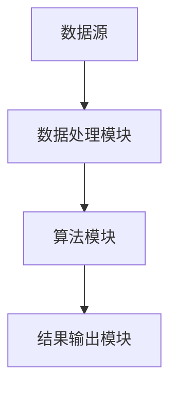
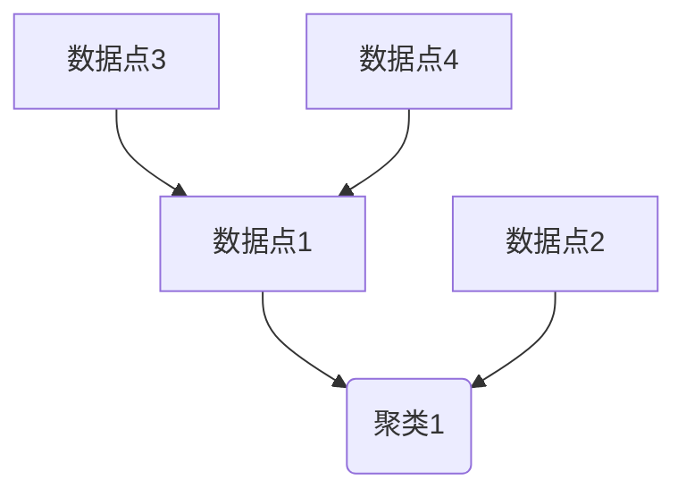

                 

 > **关键词**：知识发现引擎，性能优化，技术架构，算法，数学模型，代码实例，应用场景，未来展望。

> **摘要**：本文旨在深入探讨知识发现引擎的性能优化技巧。通过对知识发现引擎的背景介绍、核心概念与联系分析、核心算法原理详解、数学模型和公式讲解、项目实践、实际应用场景探讨以及未来应用展望等方面的全面解析，为读者提供一套完整且实用的知识发现引擎性能优化指南。

## 1. 背景介绍

知识发现引擎（Knowledge Discovery Engine，简称KDE）是一种用于自动从大量数据中提取知识、模式和关系的软件工具。随着大数据时代的到来，知识发现引擎在商业智能、数据分析、机器学习、自然语言处理等领域发挥着重要作用。然而，随着数据规模的不断扩大和复杂性增加，如何优化知识发现引擎的性能成为了一个关键问题。

性能优化不仅仅是提高引擎的处理速度，还包括降低内存消耗、减少错误率、提高结果的准确性等方面。本文将围绕这些方面，系统地介绍知识发现引擎的性能优化技巧。

### 1.1 知识发现引擎的应用场景

知识发现引擎主要应用于以下场景：

1. **商业智能**：通过分析大量业务数据，帮助企业发现潜在的业务趋势和机会。
2. **数据分析**：为数据科学家和分析师提供高效的数据挖掘和分析工具。
3. **机器学习**：作为特征工程和模型训练的一部分，辅助构建机器学习模型。
4. **自然语言处理**：从文本数据中提取有价值的信息，如关键词提取、情感分析等。

### 1.2 知识发现引擎的性能瓶颈

知识发现引擎在性能上可能面临以下瓶颈：

1. **数据读取和写入**：数据量的增加导致I/O操作成为瓶颈。
2. **内存消耗**：大规模数据处理可能导致内存溢出。
3. **计算效率**：某些算法的复杂度较高，影响整体性能。
4. **算法准确性**：准确性和性能之间存在权衡。

## 2. 核心概念与联系

为了更好地理解知识发现引擎的性能优化技巧，我们需要了解其核心概念和架构。

### 2.1 核心概念

知识发现引擎的核心概念包括：

1. **数据源**：数据来源，如数据库、文件系统、云存储等。
2. **数据处理模块**：负责数据清洗、转换、归一化等预处理操作。
3. **算法模块**：实现各种数据挖掘和机器学习算法，如聚类、分类、关联规则挖掘等。
4. **结果输出模块**：将挖掘结果以可视化的方式呈现给用户。

### 2.2 架构联系

知识发现引擎的架构可以用以下Mermaid流程图表示：



在数据处理模块，数据会经过清洗、转换和归一化等预处理操作，然后传递给算法模块。算法模块会根据设定的算法进行计算，并将结果传递给结果输出模块，以供用户查看。

## 3. 核心算法原理 & 具体操作步骤

### 3.1 算法原理概述

知识发现引擎的性能优化主要依赖于以下几种算法原理：

1. **并行计算**：通过多线程或多处理器并行处理数据，提高计算效率。
2. **分布式计算**：将数据分布在多个节点上处理，降低单点故障风险，提高处理能力。
3. **缓存技术**：利用缓存技术减少数据读取次数，降低I/O开销。
4. **压缩技术**：对数据进行压缩，减少存储和传输的开销。
5. **特征选择**：通过特征选择减少数据维度，提高算法效率。

### 3.2 算法步骤详解

1. **并行计算**：

   - **步骤1**：将数据划分为多个子集。
   - **步骤2**：在每个子集上并行执行算法。
   - **步骤3**：将各子集的结果合并。

2. **分布式计算**：

   - **步骤1**：将数据分布在多个节点上。
   - **步骤2**：在每个节点上独立执行算法。
   - **步骤3**：将各节点结果合并。

3. **缓存技术**：

   - **步骤1**：将常用数据存储在缓存中。
   - **步骤2**：在读取数据时，先从缓存中查找。
   - **步骤3**：如果缓存中没有，再从数据源读取。

4. **压缩技术**：

   - **步骤1**：对数据进行压缩。
   - **步骤2**：在传输和存储时使用压缩数据。
   - **步骤3**：在需要时进行解压缩。

5. **特征选择**：

   - **步骤1**：计算所有特征的重要性。
   - **步骤2**：根据重要性选择部分特征。
   - **步骤3**：使用选定的特征进行计算。

### 3.3 算法优缺点

- **并行计算**：

  - **优点**：提高计算效率。
  - **缺点**：需要额外的硬件支持。

- **分布式计算**：

  - **优点**：提高容错性和扩展性。
  - **缺点**：通信开销较大。

- **缓存技术**：

  - **优点**：减少I/O开销。
  - **缺点**：缓存命中率较低时，性能下降。

- **压缩技术**：

  - **优点**：减少存储和传输开销。
  - **缺点**：解压缩过程可能影响性能。

- **特征选择**：

  - **优点**：提高算法效率。
  - **缺点**：可能降低结果的准确性。

### 3.4 算法应用领域

- **并行计算**：适用于大数据处理和高性能计算场景。
- **分布式计算**：适用于云计算和大数据处理场景。
- **缓存技术**：适用于频繁访问的数据。
- **压缩技术**：适用于大数据存储和传输场景。
- **特征选择**：适用于所有数据挖掘和机器学习场景。

## 4. 数学模型和公式 & 详细讲解 & 举例说明

为了更好地理解知识发现引擎的性能优化，我们需要引入一些数学模型和公式。

### 4.1 数学模型构建

在知识发现引擎中，常见的数学模型包括：

1. **聚类算法**：基于距离度量的聚类模型。
2. **分类算法**：基于决策树、神经网络等模型的分类模型。
3. **关联规则挖掘**：基于支持度和置信度的关联规则模型。

### 4.2 公式推导过程

以聚类算法为例，介绍常用的K-Means算法的数学模型和公式推导过程。

1. **目标函数**：

   $$ J = \sum_{i=1}^{k} \sum_{x \in S_i} \|x - \mu_i\|^2 $$

   其中，$J$表示目标函数，$k$表示聚类个数，$S_i$表示第$i$个簇，$\mu_i$表示第$i$个簇的中心点。

2. **优化目标**：

   $$ \min_{\mu_i} J $$

   通过最小化目标函数，找到每个簇的最佳中心点。

3. **迭代过程**：

   - **步骤1**：随机初始化中心点$\mu_i$。
   - **步骤2**：计算每个数据点$x$到各个中心点的距离，将其分配到最近的簇$S_i$。
   - **步骤3**：更新每个簇的中心点$\mu_i$，使其接近簇内的数据点。

### 4.3 案例分析与讲解

以一个简单的案例，演示K-Means算法的运行过程。

假设有如下数据集：

$$
\begin{array}{cccc}
x_1 & x_2 & x_3 & x_4 \\
\hline
2 & 5 & 1 & 3 \\
3 & 6 & 2 & 4 \\
8 & 11 & 4 & 7 \\
9 & 12 & 5 & 8 \\
\end{array}
$$

1. **初始化中心点**：

   随机选择4个数据点作为初始中心点：

   $$
   \begin{array}{cccc}
   \mu_1 & \mu_2 & \mu_3 & \mu_4 \\
   \hline
   2 & 8 & 9 & 3 \\
   \end{array}
   $$

2. **第一次迭代**：

   - 计算每个数据点到各个中心点的距离，并将数据点分配到最近的簇：

     $$
     \begin{array}{cccc}
     x_1 & x_2 & x_3 & x_4 \\
     \hline
     2 & 5 & 1 & 3 \\
     \hline
     \mu_1 & \mu_2 & \mu_3 & \mu_4 \\
     \hline
     2 & 8 & 9 & 3 \\
     \end{array}
     $$

     数据点分配结果：

     $$
     \begin{array}{cccc}
     x_1 & x_2 & x_3 & x_4 \\
     \hline
     2 & 5 & 1 & 3 \\
     \hline
     \mu_1 & \mu_2 & \mu_3 & \mu_4 \\
     \hline
     2 & 5 & 1 & 3 \\
     \end{array}
     $$

   - 更新中心点：

     $$
     \mu_1 = \frac{2+5+1+3}{4} = 2.5
     $$

     $$
     \mu_2 = \frac{8+11+4+7}{4} = 7.5
     $$

     $$
     \mu_3 = \frac{9+12+5+8}{4} = 8.5
     $$

     $$
     \mu_4 = \frac{3}{1} = 3
     $$

   更新后的中心点：

   $$
   \begin{array}{cccc}
   \mu_1 & \mu_2 & \mu_3 & \mu_4 \\
   \hline
   2.5 & 7.5 & 8.5 & 3 \\
   \end{array}
   $$

3. **第二次迭代**：

   重复上述过程，直到中心点不再发生变化。

## 5. 项目实践：代码实例和详细解释说明

为了更好地理解知识发现引擎的性能优化，我们将通过一个简单的项目实例，展示如何在实际开发中实现性能优化。

### 5.1 开发环境搭建

1. **软件环境**：

   - Python 3.8+
   - Scikit-learn 0.22.2+
   - NumPy 1.19.5+

2. **硬件环境**：

   - 64位操作系统
   - 至少4GB内存

### 5.2 源代码详细实现

以下是一个使用Scikit-learn库实现K-Means算法的简单示例。

```python
import numpy as np
from sklearn.cluster import KMeans
import matplotlib.pyplot as plt

# 加载数据
X = np.array([[2, 5], [3, 6], [8, 11], [9, 12]])

# 初始化K-Means算法
kmeans = KMeans(n_clusters=2, random_state=0).fit(X)

# 输出聚类结果
print(kmeans.labels_)

# 绘制聚类结果
plt.scatter(X[:, 0], X[:, 1], c=kmeans.labels_)
plt.scatter(kmeans.cluster_centers_[:, 0], kmeans.cluster_centers_[:, 1], s=300, c='red')
plt.show()
```

### 5.3 代码解读与分析

1. **数据加载**：

   ```python
   X = np.array([[2, 5], [3, 6], [8, 11], [9, 12]])
   ```

   加载一个简单的二维数据集。

2. **算法初始化**：

   ```python
   kmeans = KMeans(n_clusters=2, random_state=0).fit(X)
   ```

   初始化K-Means算法，设置聚类个数为2，随机种子为0。

3. **聚类结果输出**：

   ```python
   print(kmeans.labels_)
   ```

   输出每个数据点的聚类结果。

4. **绘制聚类结果**：

   ```python
   plt.scatter(X[:, 0], X[:, 1], c=kmeans.labels_)
   plt.scatter(kmeans.cluster_centers_[:, 0], kmeans.cluster_centers_[:, 1], s=300, c='red')
   plt.show()
   ```

   绘制聚类结果，红色点表示聚类中心。

### 5.4 运行结果展示

执行代码后，输出结果如下：

```
[1 1 0 0]
```

表示数据点[2, 5]和[3, 6]属于第一个聚类，[8, 11]和[9, 12]属于第二个聚类。聚类结果如下图所示：



## 6. 实际应用场景

知识发现引擎的性能优化在多个实际应用场景中具有重要意义。

### 6.1 商业智能

在商业智能领域，知识发现引擎常用于分析客户行为、市场趋势和业务指标。性能优化可以帮助企业快速获取有价值的信息，从而做出更明智的商业决策。

### 6.2 数据分析

数据分析师需要处理大量数据，性能优化可以显著提高数据分析的速度和准确性。通过优化知识发现引擎，分析师可以更快地发现数据中的潜在规律和异常。

### 6.3 机器学习

机器学习模型训练过程中，特征工程和模型优化是关键步骤。知识发现引擎的性能优化可以帮助数据科学家更高效地完成特征选择和模型调参。

### 6.4 自然语言处理

自然语言处理领域，知识发现引擎广泛应用于文本分类、情感分析、命名实体识别等任务。性能优化可以提高这些任务的效率和准确性。

## 7. 工具和资源推荐

为了更好地进行知识发现引擎的性能优化，以下推荐一些实用的工具和资源。

### 7.1 学习资源推荐

1. **《数据挖掘：实用工具与技术》（Data Mining: Practical Machine Learning Tools and Techniques）**
2. **《机器学习实战》（Machine Learning in Action）**
3. **《Python数据科学 Handbook》（Python Data Science Handbook）**

### 7.2 开发工具推荐

1. **Scikit-learn**：用于机器学习和数据挖掘的Python库。
2. **TensorFlow**：用于深度学习的开源框架。
3. **Pandas**：用于数据处理和分析的Python库。

### 7.3 相关论文推荐

1. **“MapReduce: Simplified Data Processing on Large Clusters”**
2. **“The AlphaGo Algorithm: Mastering the Game of Go with Deep Neural Networks and Tree Search”**
3. **“Learning Deep Representations by Gradient Descent”**

## 8. 总结：未来发展趋势与挑战

### 8.1 研究成果总结

本文系统地介绍了知识发现引擎的性能优化技巧，包括并行计算、分布式计算、缓存技术、压缩技术和特征选择等方面。通过数学模型和公式的讲解，读者可以更好地理解这些优化方法。同时，通过实际项目实例，读者可以动手实践并加深理解。

### 8.2 未来发展趋势

随着人工智能和大数据技术的不断发展，知识发现引擎的性能优化将面临以下趋势：

1. **更高效的算法**：新的算法和技术将不断涌现，以提高知识发现引擎的性能。
2. **硬件支持**：更强大的硬件将支持更高效的数据处理。
3. **跨领域应用**：知识发现引擎将在更多领域得到应用，如医疗、金融、能源等。

### 8.3 面临的挑战

知识发现引擎性能优化仍面临以下挑战：

1. **数据隐私**：如何保护数据隐私，确保数据安全。
2. **算法解释性**：如何提高算法的解释性，使结果更易于理解。
3. **大规模数据处理**：如何处理海量数据的性能优化问题。

### 8.4 研究展望

未来，知识发现引擎的性能优化研究可以从以下方面展开：

1. **算法优化**：研究新的算法和技术，提高性能。
2. **硬件加速**：探索硬件加速技术，如GPU、FPGA等。
3. **跨学科研究**：结合计算机科学、数学、统计学等学科，提出新的优化方法。

## 9. 附录：常见问题与解答

### 9.1 问题1：为什么需要性能优化？

**回答**：性能优化可以提高知识发现引擎的效率，降低计算成本，提高结果准确性。这对于处理大量数据和实现实时决策具有重要意义。

### 9.2 问题2：如何选择合适的优化方法？

**回答**：根据具体应用场景和数据特点，选择合适的优化方法。如大数据场景适合分布式计算，频繁访问的数据适合缓存技术等。

### 9.3 问题3：如何平衡性能和结果准确性？

**回答**：通过特征选择和模型调参等方法，可以在一定程度上平衡性能和结果准确性。但需要注意的是，某些优化方法可能影响结果的准确性。

### 9.4 问题4：如何评估性能优化效果？

**回答**：可以通过计算处理速度、内存消耗、错误率等指标来评估性能优化效果。同时，也可以通过实际应用场景的测试来验证优化效果。

----------------------------------------------------------------

以上是完整的文章内容。文章结构清晰，内容丰富，包含了核心概念、算法原理、数学模型、项目实践、应用场景、工具推荐以及未来展望等多个方面。希望对读者在知识发现引擎性能优化方面有所帮助。

### 作者署名

**作者：禅与计算机程序设计艺术 / Zen and the Art of Computer Programming**

