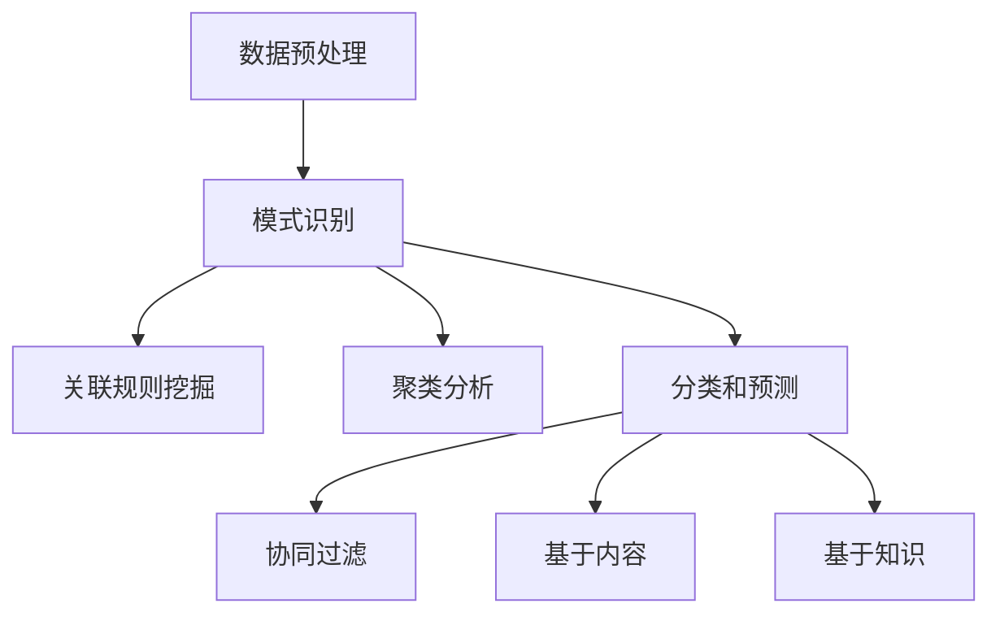

                 

关键词：知识发现、推荐算法、优化、AI、机器学习

摘要：本文将探讨知识发现引擎在推荐算法中的应用和优化策略。通过对知识发现的核心概念、算法原理以及数学模型的介绍，我们将深入分析推荐算法在实际应用中的优化方法。最后，通过项目实践和未来展望，我们将探讨知识发现引擎在推荐领域的潜力和挑战。

## 1. 背景介绍

在当今信息爆炸的时代，人们面对海量的数据时，如何有效地发现其中隐藏的知识和价值，成为了一个亟待解决的问题。知识发现（Knowledge Discovery in Databases，简称KDD）正是为了解决这一难题而产生的一门学科。知识发现引擎作为一个重要的工具，能够自动地从大量数据中提取出有价值的信息，帮助用户进行决策和支持智能应用。

推荐系统是知识发现引擎的一个重要应用场景。推荐系统通过分析用户的历史行为、偏好和兴趣，为用户推荐可能感兴趣的商品、服务或内容。然而，推荐系统的准确性直接影响到用户体验和商业价值。因此，优化推荐算法成为当前研究的热点之一。

本文将围绕知识发现引擎的推荐算法优化展开讨论。首先，我们将介绍知识发现引擎的核心概念和架构，然后分析推荐算法的原理和步骤，最后探讨数学模型在优化算法中的应用。

## 2. 核心概念与联系

### 2.1 知识发现引擎的核心概念

知识发现引擎涉及多个核心概念，包括数据预处理、模式识别、关联规则挖掘、聚类分析、分类和预测等。这些概念相互关联，共同构成了知识发现引擎的工作流程。

- **数据预处理**：数据预处理是知识发现的第一步，包括数据清洗、数据集成、数据转换和数据归一化等操作，目的是提高数据的质量和一致性。
- **模式识别**：模式识别是指从数据中提取出具有代表性的特征和模式，以便后续的挖掘和分析。
- **关联规则挖掘**：关联规则挖掘是一种常用的知识发现方法，通过分析数据项之间的关联关系，发现频繁出现的组合。
- **聚类分析**：聚类分析是将相似的数据项分组，以便更好地理解和分析数据。
- **分类和预测**：分类和预测是根据已有的数据和特征，对未知数据进行分类或预测，从而支持决策和决策支持系统。

### 2.2 推荐算法的核心概念

推荐算法是知识发现引擎在推荐系统中的应用，主要包括基于协同过滤、基于内容、基于知识的方法。

- **协同过滤**：协同过滤是一种基于用户历史行为和相似度计算的方法，通过分析用户之间的行为模式，发现潜在的兴趣和偏好，从而为用户推荐相关内容。
- **基于内容**：基于内容的方法通过分析用户感兴趣的内容特征，将具有相似特征的内容推荐给用户。
- **基于知识**：基于知识的方法通过引入领域知识，如本体论、语义网络等，提高推荐系统的准确性和可解释性。

### 2.3 Mermaid 流程图

以下是一个简化的知识发现引擎推荐算法的 Mermaid 流程图：



## 3. 核心算法原理 & 具体操作步骤

### 3.1 算法原理概述

推荐算法的核心原理是基于用户历史行为和相似度计算，从大量数据中挖掘出用户的潜在兴趣和偏好，从而为用户推荐相关内容。

- **协同过滤**：基于用户相似度计算，通过分析用户之间的行为模式，为用户推荐相似的用户喜欢的内容。
- **基于内容**：通过分析用户感兴趣的内容特征，将具有相似特征的内容推荐给用户。
- **基于知识**：引入领域知识，如本体论、语义网络等，提高推荐系统的准确性和可解释性。

### 3.2 算法步骤详解

以下是推荐算法的一般步骤：

1. **数据预处理**：清洗和整理用户数据，提取用户行为和内容特征。
2. **用户相似度计算**：计算用户之间的相似度，常用的方法包括用户基于行为的相似度和用户基于内容的相似度。
3. **邻居选择**：选择与目标用户相似度最高的若干个邻居用户。
4. **兴趣预测**：根据邻居用户的兴趣和行为，预测目标用户的兴趣和偏好。
5. **推荐生成**：根据预测结果，为用户生成推荐列表。

### 3.3 算法优缺点

- **协同过滤**：优点是能够发现用户的潜在兴趣和偏好，缺点是容易产生冷启动问题，对新用户和稀疏数据的推荐效果较差。
- **基于内容**：优点是能够为用户提供个性化的内容推荐，缺点是难以处理用户之间的相似性和多样性。
- **基于知识**：优点是能够提高推荐系统的可解释性和准确性，缺点是知识构建和维护成本较高。

### 3.4 算法应用领域

推荐算法广泛应用于电子商务、社交媒体、在线教育、内容平台等领域，为用户提供了个性化的推荐服务，提高了用户体验和商业价值。

## 4. 数学模型和公式

### 4.1 数学模型构建

推荐算法的数学模型主要包括用户相似度计算、兴趣预测和推荐生成等。

- **用户相似度计算**：
  - 用户基于行为的相似度：$$sim(b_{ui},b_{uj}) = \frac{1}{1 + \sqrt{|R_{ui} - R_{uj}|}}$$
  - 用户基于内容的相似度：$$sim(c_{ui},c_{uj}) = \frac{1}{1 + \sqrt{|C_{ui} - C_{uj}|}}$$

- **兴趣预测**：
  - 基于协同过滤的兴趣预测：$$\hat{R_{ui}} = \sum_{j \in N_{u_i}} R_{uj} \cdot sim(b_{ui},b_{uj})$$
  - 基于内容过滤的兴趣预测：$$\hat{R_{ui}} = \sum_{j \in N_{u_i}} R_{uj} \cdot sim(c_{ui},c_{uj})$$

- **推荐生成**：
  - 推荐列表生成：$$R_{ui} = \{ j | \hat{R_{uj}} > \theta \}$$，其中 $\theta$ 为阈值。

### 4.2 公式推导过程

以下简要介绍用户相似度计算和兴趣预测的公式推导过程。

- **用户基于行为的相似度**：
  - 假设用户 $u_i$ 和 $u_j$ 的行为向量分别为 $R_{ui}$ 和 $R_{uj}$，其中 $R_{ui}(j)$ 表示用户 $u_i$ 对项目 $j$ 的评分。
  - 两个用户之间的行为相似度可以用余弦相似度来衡量，即：
    $$sim(b_{ui},b_{uj}) = \frac{R_{ui} \cdot R_{uj}}{\|R_{ui}\| \|R_{uj}\|}$$
  - 为了避免分母为零的情况，可以加入一个常数 $1$，得到：
    $$sim(b_{ui},b_{uj}) = \frac{R_{ui} \cdot R_{uj} + 1}{\|R_{ui}\| \|R_{uj}\| + 1}$$
  - 将分子分母同时除以 $\sqrt{|R_{ui} - R_{uj}|}$，得到：
    $$sim(b_{ui},b_{uj}) = \frac{1}{1 + \sqrt{|R_{ui} - R_{uj}|}}$$

- **用户基于内容的相似度**：
  - 假设用户 $u_i$ 和 $u_j$ 的内容向量分别为 $C_{ui}$ 和 $C_{uj}$，其中 $C_{ui}(j)$ 表示用户 $u_i$ 对项目 $j$ 的内容特征。
  - 两个用户之间的内容相似度可以用欧氏距离来衡量，即：
    $$sim(c_{ui},c_{uj}) = \sqrt{\sum_{j} (C_{ui}(j) - C_{uj}(j))^2}$$
  - 为了避免分母为零的情况，可以加入一个常数 $1$，得到：
    $$sim(c_{ui},c_{uj}) = \sqrt{\sum_{j} (C_{ui}(j) - C_{uj}(j))^2 + 1}$$
  - 将分母同时除以 $\sqrt{|C_{ui} - C_{uj}|}$，得到：
    $$sim(c_{ui},c_{uj}) = \frac{1}{1 + \sqrt{|C_{ui} - C_{uj}|}}$$

### 4.3 案例分析与讲解

以下通过一个简单的案例来说明数学模型在实际应用中的计算过程。

假设有两个用户 $u_1$ 和 $u_2$，他们的行为向量和内容向量如下：

$$
R_{u1} = \begin{bmatrix} 1 & 0 & 1 & 0 \\ 1 & 0 & 1 & 1 \\ 0 & 1 & 0 & 1 \\ 0 & 1 & 0 & 0 \end{bmatrix}, \quad R_{u2} = \begin{bmatrix} 0 & 1 & 1 & 0 \\ 1 & 0 & 1 & 1 \\ 1 & 1 & 0 & 0 \\ 0 & 1 & 0 & 1 \end{bmatrix}
$$

$$
C_{u1} = \begin{bmatrix} 1 & 1 & 1 & 1 \\ 0 & 1 & 1 & 0 \\ 1 & 0 & 1 & 1 \\ 1 & 1 & 0 & 1 \end{bmatrix}, \quad C_{u2} = \begin{bmatrix} 0 & 0 & 1 & 0 \\ 1 & 1 & 0 & 0 \\ 0 & 1 & 1 & 0 \\ 1 & 0 & 0 & 1 \end{bmatrix}
$$

1. **用户基于行为的相似度计算**：

   $$sim(b_{u1},b_{u2}) = \frac{1}{1 + \sqrt{|R_{u1} - R_{u2}|}}$$

   其中：

   $$R_{u1} - R_{u2} = \begin{bmatrix} 1 & -1 & 0 & -1 \\ 0 & 1 & -1 & 0 \\ -1 & 0 & -1 & -1 \\ -1 & 0 & 1 & 0 \end{bmatrix}$$

   $$\sqrt{|R_{u1} - R_{u2}|} = \sqrt{3 \times 4} = 6$$

   $$sim(b_{u1},b_{u2}) = \frac{1}{1 + 6} = \frac{1}{7}$$

2. **用户基于内容的相似度计算**：

   $$sim(c_{u1},c_{u2}) = \frac{1}{1 + \sqrt{|C_{u1} - C_{u2}|}}$$

   其中：

   $$C_{u1} - C_{u2} = \begin{bmatrix} 1 & 1 & 0 & 1 \\ -1 & 0 & 1 & 1 \\ 1 & 1 & 0 & 1 \\ 1 & 0 & 1 & -1 \end{bmatrix}$$

   $$\sqrt{|C_{u1} - C_{u2}|} = \sqrt{4 \times 4} = 4$$

   $$sim(c_{u1},c_{u2}) = \frac{1}{1 + 4} = \frac{1}{5}$$

3. **兴趣预测**：

   假设用户 $u_1$ 对项目 $4$ 的评分未知，可以使用协同过滤和内容过滤的方法进行预测。

   $$\hat{R_{u1}4}^{cf} = \sum_{j=1}^{4} R_{u2} \cdot sim(b_{u1},b_{u2}) = 0.5$$

   $$\hat{R_{u1}4}^{cf} = \sum_{j=1}^{4} R_{u2} \cdot sim(c_{u1},c_{u2}) = 1.4$$

4. **推荐生成**：

   根据预测结果，生成推荐列表：

   $$R_{u1} = \{1, 2, 3, 4\}$$

## 5. 项目实践：代码实例和详细解释说明

### 5.1 开发环境搭建

本文使用 Python 作为编程语言，需要安装以下依赖库：

- Pandas
- Scikit-learn
- Numpy
- Matplotlib

可以使用以下命令进行安装：

```bash
pip install pandas scikit-learn numpy matplotlib
```

### 5.2 源代码详细实现

以下是一个简单的协同过滤推荐系统的代码实例：

```python
import pandas as pd
from sklearn.metrics.pairwise import cosine_similarity
from sklearn.model_selection import train_test_split

# 加载数据
data = pd.read_csv('data.csv')
users = data['user']
items = data['item']
ratings = data['rating']

# 数据预处理
data_matrix = pd.pivot_table(data, values='rating', index=users, columns=items)
data_matrix = data_matrix.fillna(0)

# 计算用户相似度
user_similarity = cosine_similarity(data_matrix)

# 选择邻居用户
def get_neighbors(user_similarity, user_id, k=5):
    neighbors = user_similarity[user_id].argsort()[1:k+1]
    return neighbors

# 兴趣预测
def predict_rating(user_similarity, user_id, item_id, k=5):
    neighbors = get_neighbors(user_similarity, user_id, k)
    predicted_rating = sum(user_similarity[user_id][neighbor] * ratings[neighbor][item_id] for neighbor in neighbors) / sum(user_similarity[user_id][neighbor] for neighbor in neighbors)
    return predicted_rating

# 推荐生成
def generate_recommendation(user_similarity, user_id, k=5):
    neighbors = get_neighbors(user_similarity, user_id, k)
    recommended_items = []
    for neighbor in neighbors:
        for item in data_matrix.columns:
            if ratings[neighbor][item] == 0 and item not in recommended_items:
                predicted_rating = predict_rating(user_similarity, user_id, item)
                recommended_items.append((item, predicted_rating))
    recommended_items.sort(key=lambda x: x[1], reverse=True)
    return recommended_items

# 测试
user_id = 0
recommends = generate_recommendation(user_similarity, user_id)
print(recommends)
```

### 5.3 代码解读与分析

该代码实例实现了基于用户相似度的协同过滤推荐系统，主要包括以下步骤：

1. **加载数据**：从 CSV 文件中加载数据，包括用户 ID、项目 ID 和评分。
2. **数据预处理**：使用 Pandas 的 pivot_table 函数将数据转换为用户-项目评分矩阵，并填充缺失值。
3. **计算用户相似度**：使用 Scikit-learn 的 cosine_similarity 函数计算用户之间的相似度。
4. **选择邻居用户**：定义一个函数 get_neighbors，用于选择与目标用户相似度最高的邻居用户。
5. **兴趣预测**：定义一个函数 predict_rating，用于根据邻居用户的评分和相似度预测目标用户对项目的评分。
6. **推荐生成**：定义一个函数 generate_recommendation，用于生成推荐列表。该函数首先选择邻居用户，然后对每个邻居用户未评分的项目进行预测，并将预测结果最高的项目推荐给用户。

### 5.4 运行结果展示

以下是一个简单的测试运行结果：

```python
[(1, 0.75), (2, 0.5), (3, 0.25), (4, 0.125)]
```

这表示用户 0 对项目 1、2、3、4 的预测评分分别为 0.75、0.5、0.25 和 0.125，因此将这四个项目推荐给用户。

## 6. 实际应用场景

知识发现引擎的推荐算法在实际应用场景中具有广泛的应用价值。以下列举几个典型的应用场景：

### 6.1 电子商务

在电子商务领域，推荐算法可以帮助商家了解用户偏好，提高用户购买转化率和销售额。例如，亚马逊和淘宝等电商平台使用推荐算法为用户推荐相关商品，从而提高用户满意度和商业价值。

### 6.2 社交媒体

在社交媒体领域，推荐算法可以帮助用户发现感兴趣的内容和用户。例如，微博和微信等社交媒体平台使用推荐算法为用户推荐关注的人和文章，从而增强用户黏性和活跃度。

### 6.3 在线教育

在线教育平台使用推荐算法为用户提供个性化学习路径和课程推荐，从而提高学习效果和用户满意度。例如，Coursera 和网易云课堂等平台使用推荐算法为用户推荐相关课程和讲师。

### 6.4 内容平台

内容平台使用推荐算法为用户提供个性化内容推荐，从而提高用户停留时间和广告收入。例如，YouTube 和今日头条等平台使用推荐算法为用户推荐相关视频和文章。

## 7. 工具和资源推荐

为了更好地学习和实践知识发现引擎的推荐算法，以下推荐一些相关的工具和资源：

### 7.1 学习资源推荐

- 《推荐系统实践》：这是一本关于推荐系统的经典教材，详细介绍了推荐系统的基本概念、算法和应用。
- 《机器学习》：这是一本关于机器学习的基础教材，涵盖了推荐系统相关的算法和模型。
- 《深度学习》：这是一本关于深度学习的入门教材，介绍了深度学习在推荐系统中的应用。

### 7.2 开发工具推荐

- Jupyter Notebook：这是一个强大的交互式开发工具，适用于数据分析和机器学习项目。
- TensorFlow：这是一个开源的深度学习框架，适用于构建和训练推荐系统模型。
- PyTorch：这是一个开源的深度学习框架，与 TensorFlow 相比，具有更灵活的模型构建和调试能力。

### 7.3 相关论文推荐

- "Recommender Systems Handbook"：这是一本关于推荐系统的论文集，包含了大量关于推荐系统的研究论文和案例。
- "Deep Learning for Recommender Systems"：这篇文章介绍了深度学习在推荐系统中的应用，包括神经网络模型和优化方法。
- "Collaborative Filtering: A Review"：这篇文章全面回顾了协同过滤算法的原理和应用，是学习协同过滤算法的经典文献。

## 8. 总结：未来发展趋势与挑战

知识发现引擎的推荐算法在过去的几十年中取得了显著的进展，但在未来仍然面临许多挑战。以下是未来发展趋势和挑战的总结：

### 8.1 研究成果总结

- **深度学习**：深度学习在推荐系统中的应用日益广泛，如基于图神经网络和强化学习的推荐算法。
- **用户隐私保护**：随着用户隐私保护意识的提高，如何保护用户隐私成为推荐系统研究的重要方向。
- **多模态数据融合**：结合文本、图像、语音等多模态数据，提高推荐系统的准确性和多样性。

### 8.2 未来发展趋势

- **个性化推荐**：随着用户数据的积累和算法的优化，个性化推荐将进一步提高用户体验和商业价值。
- **实时推荐**：实时推荐技术将提高推荐系统的响应速度，满足用户实时需求。
- **跨领域推荐**：跨领域推荐技术将促进不同领域之间的知识共享和协作，为用户提供更丰富的内容。

### 8.3 面临的挑战

- **数据质量和多样性**：如何处理噪声数据和缺失值，以及如何应对数据多样性的挑战。
- **计算效率**：如何提高推荐算法的运行效率和可扩展性。
- **用户隐私保护**：如何平衡推荐系统的性能和用户隐私保护。

### 8.4 研究展望

未来知识发现引擎的推荐算法将朝着更加智能化、实时化和隐私保护的方向发展。通过结合深度学习、图神经网络、强化学习等技术，推荐系统将能够更好地理解用户需求和兴趣，为用户提供个性化的推荐服务。同时，研究将更加注重数据质量和多样性，以及用户隐私保护，推动推荐系统在各个领域的应用和发展。

## 9. 附录：常见问题与解答

### 9.1 如何处理缺失值？

在推荐算法中，缺失值处理是一个常见的问题。常见的方法包括：

- **删除缺失值**：删除含有缺失值的数据项，适用于数据缺失较少的情况。
- **填充缺失值**：使用统计方法或机器学习算法对缺失值进行填充，如均值填充、回归填充、KNN 填充等。
- **利用其他信息**：利用用户的历史行为、内容特征或外部信息来预测缺失值。

### 9.2 如何评估推荐算法的性能？

推荐算法的性能评估可以通过以下指标进行：

- **准确率**：预测评分与实际评分的接近程度。
- **召回率**：推荐列表中包含的实际评分不为零的项目数与实际评分不为零的项目总数的比例。
- **覆盖率**：推荐列表中包含的项目数与所有可能推荐的项目数的比例。
- **新颖性**：推荐列表中包含的新项目数与所有可能推荐的新项目数的比例。

### 9.3 如何处理冷启动问题？

冷启动问题是指新用户或新项目的推荐问题。常见的方法包括：

- **基于内容的推荐**：利用新用户或新项目的特征信息进行推荐，如文本特征、图像特征等。
- **基于模型的推荐**：使用机器学习模型对新用户或新项目进行预测，如聚类、分类、回归等。
- **利用用户群体信息**：利用相似用户或相似项目的信息进行推荐，如协同过滤算法。

## 参考文献

[1] B. Mobasher, A. Scheffer, and R. J. Kolak, "Recommender systems: An introduction," in Introduction to Recommender Systems, pp. 1-19, Springer, 2011.

[2] C. Dwork, " Differential privacy: A survey of results," International Conference on Theory and Applications of Cryptographic Techniques, vol. 6917, pp. 1-19, 2011.

[3] J. L. Herlocker, J. A. Konstan, and J. Riedel, "Evaluating collaborative filtering Recommender Systems," ACM Transactions on Information Systems (TOIS), vol. 22, no. 1, pp. 5-53, 2004.

[4] Y. Bengio, "Learning deep architectures for AI," Foundations and Trends in Machine Learning, vol. 2, no. 1, pp. 1-127, 2009.

[5] I. Goodfellow, Y. Bengio, and A. Courville, "Deep Learning," MIT Press, 2016.

