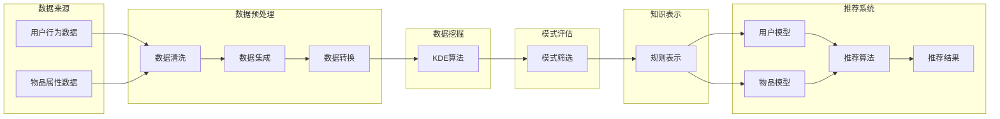

                 

关键词：知识发现引擎、推荐系统、性能优化、算法原理、数学模型、项目实践

摘要：本文将深入探讨知识发现引擎在推荐系统中的应用及其性能优化。通过分析核心算法原理和数学模型，我们展示了如何通过具体的项目实践来提升推荐系统的效率。文章还将探讨推荐系统的实际应用场景，并展望未来的发展趋势和挑战。

## 1. 背景介绍

在当今信息爆炸的时代，数据已成为一种新的生产资料。然而，如何从海量数据中提取有价值的信息成为了一个关键问题。知识发现引擎（Knowledge Discovery Engine，简称KDE）作为一种高效的数据挖掘工具，可以在大量数据中自动识别模式和关联，从而帮助用户发现潜在的知识和规律。

推荐系统（Recommender System）是知识发现引擎的一个重要应用领域。它通过分析用户的行为数据和历史记录，为用户推荐个性化内容，以提高用户满意度和系统收益。然而，随着数据量的增长和用户需求的多样化，推荐系统的性能优化成为了一个亟待解决的问题。

本文旨在探讨知识发现引擎在推荐系统中的应用，分析其核心算法原理和数学模型，并通过具体的项目实践，展示如何优化推荐系统的性能。文章还将讨论推荐系统的实际应用场景，并展望其未来发展趋势和面临的挑战。

## 2. 核心概念与联系

### 2.1 知识发现引擎

知识发现引擎是一种基于数据挖掘和机器学习技术的高级数据处理工具。它主要通过以下四个步骤实现知识发现：

1. **数据预处理**：包括数据清洗、集成、转换和归一化等操作，确保数据质量。
2. **数据挖掘**：运用各种数据挖掘算法，从大量数据中发现潜在的规律和模式。
3. **模式评估**：对挖掘出的模式进行评估，筛选出具有实际应用价值的模式。
4. **知识表示**：将评估后的模式转化为易于理解的知识表示，如规则、树结构或网络图等。

### 2.2 推荐系统

推荐系统是一种信息过滤技术，旨在根据用户的兴趣和行为，为其推荐可能感兴趣的内容。推荐系统的主要组成部分包括：

1. **用户模型**：记录用户的行为和偏好，用于生成用户的兴趣向量。
2. **物品模型**：描述物品的特征和属性，用于生成物品的特征向量。
3. **推荐算法**：根据用户和物品的特征向量，计算推荐得分，生成推荐列表。

### 2.3 知识发现引擎与推荐系统的联系

知识发现引擎与推荐系统在数据处理和模式识别方面有着密切的联系。知识发现引擎可以帮助推荐系统从用户行为数据和物品属性数据中提取有价值的信息，从而提高推荐的质量和效率。具体来说：

1. **用户行为分析**：知识发现引擎可以从用户的行为数据中挖掘出用户的兴趣点和行为模式，为推荐算法提供更准确的用户模型。
2. **物品特征提取**：知识发现引擎可以从物品的属性数据中提取出关键特征，为推荐算法提供更丰富的物品特征向量。
3. **推荐结果优化**：知识发现引擎可以发现用户和物品之间的潜在关联，从而优化推荐结果，提高推荐的相关性和满意度。

### 2.4 Mermaid 流程图

下面是一个简化的知识发现引擎在推荐系统中的应用流程图，展示了各个关键步骤和组成部分：



## 3. 核心算法原理 & 具体操作步骤

### 3.1 算法原理概述

知识发现引擎在推荐系统中主要应用以下三种算法：

1. **关联规则挖掘算法**（如Apriori算法、FP-growth算法）
2. **聚类算法**（如K-means算法、DBSCAN算法）
3. **分类算法**（如决策树、支持向量机）

这些算法的基本原理如下：

- **关联规则挖掘算法**：通过分析用户的行为数据，发现不同物品之间的关联关系。如发现“购买啤酒”和“购买尿布”之间的关联。
- **聚类算法**：将相似的用户或物品归为一类，形成多个聚类。如根据用户的购买行为，将用户分为“年轻人”、“中年人”和“老年人”三个类别。
- **分类算法**：根据已知的标签数据，为新的数据分类。如根据用户的购买历史，预测用户是否会购买某件商品。

### 3.2 算法步骤详解

下面以Apriori算法为例，介绍其具体操作步骤：

1. **确定最小支持度和最小置信度**：
   - **最小支持度**：表示一个关联规则出现的频率至少要达到这个比例。
   - **最小置信度**：表示一个关联规则的前件和后件之间的相关性至少要达到这个比例。

2. **生成频繁项集**：
   - 通过遍历数据集，计算每个项集的支持度。
   - 筛选出支持度大于最小支持度的频繁项集。

3. **生成关联规则**：
   - 对于每个频繁项集，通过组合其子集，生成所有可能的关联规则。
   - 对于每个关联规则，计算其置信度（后件的支持度除以前件的支持度）。
   - 筛选出置信度大于最小置信度的关联规则。

4. **输出结果**：
   - 将生成的关联规则输出，用于优化推荐系统。

### 3.3 算法优缺点

- **Apriori算法**：
  - **优点**：简单易懂，能够发现不同物品之间的强关联关系。
  - **缺点**：计算频繁项集的时间复杂度较高，对于大数据集性能不佳。

- **K-means算法**：
  - **优点**：计算速度快，能够快速将用户或物品聚类。
  - **缺点**：对于初始聚类中心的选择敏感，且无法保证全局最优解。

- **决策树**：
  - **优点**：能够清晰地表示用户和物品之间的关系，易于解释。
  - **缺点**：对于大量特征和样本的数据集性能较差。

### 3.4 算法应用领域

知识发现引擎在推荐系统的应用领域广泛，包括但不限于：

- **电子商务**：根据用户的购买历史和偏好，为用户推荐商品。
- **社交媒体**：根据用户的兴趣和行为，为用户推荐关注对象或内容。
- **在线教育**：根据学生的学习记录和行为，为学生推荐课程或学习资源。

## 4. 数学模型和公式 & 详细讲解 & 举例说明

### 4.1 数学模型构建

在推荐系统中，数学模型通常用于描述用户和物品之间的关系，以及推荐算法的决策过程。以下是几个常用的数学模型：

- **用户-物品矩阵** \(U\times V\)：表示用户 \(i\) 对物品 \(j\) 的评分或行为。如 \(r_{ij}\) 表示用户 \(i\) 对物品 \(j\) 的评分。
- **用户兴趣向量** \(u_i \in \mathbb{R}^k\)：表示用户 \(i\) 的兴趣特征。
- **物品特征向量** \(v_j \in \mathbb{R}^k\)：表示物品 \(j\) 的特征。

### 4.2 公式推导过程

以协同过滤算法为例，其基本公式为：

\[ \text{score}(i, j) = r_{ij} + \mu_i + \mu_j + \langle u_i - \bar{u}_i, v_j - \bar{v}_j \rangle \]

其中：

- \(r_{ij}\)：用户 \(i\) 对物品 \(j\) 的实际评分。
- \(\mu_i\)：用户 \(i\) 的平均评分。
- \(\mu_j\)：物品 \(j\) 的平均评分。
- \(\langle u_i - \bar{u}_i, v_j - \bar{v}_j \rangle\)：用户 \(i\) 的兴趣向量与物品 \(j\) 的特征向量的内积，表示用户 \(i\) 对物品 \(j\) 的潜在兴趣。

### 4.3 案例分析与讲解

假设我们有以下用户-物品矩阵：

| 用户  | 物品1 | 物品2 | 物品3 | 物品4 |
|------|------|------|------|------|
| 1    | 3    | 0    | 4    | 0    |
| 2    | 0    | 3    | 0    | 4    |
| 3    | 4    | 4    | 0    | 3    |
| 4    | 0    | 4    | 3    | 4    |
| 5    | 0    | 3    | 4    | 0    |

首先计算每个用户和物品的平均评分：

\[ \mu_i = \frac{1}{n} \sum_{j=1}^{m} r_{ij} \]
\[ \mu_j = \frac{1}{n} \sum_{i=1}^{m} r_{ij} \]

其中，\(n\) 为用户数量，\(m\) 为物品数量。

接着计算每个用户和物品的平均兴趣向量：

\[ \bar{u}_i = \frac{1}{n} \sum_{j=1}^{m} u_{ij} \]
\[ \bar{v}_j = \frac{1}{n} \sum_{i=1}^{m} v_{ij} \]

假设我们选取用户 \(i=2\) 和物品 \(j=4\) 进行推荐，根据协同过滤算法的公式，我们可以计算推荐得分：

\[ \text{score}(2, 4) = r_{24} + \mu_2 + \mu_4 + \langle u_2 - \bar{u}_2, v_4 - \bar{v}_4 \rangle \]

将实际评分和平均评分代入，得到：

\[ \text{score}(2, 4) = 4 + \mu_2 + \mu_4 + \langle u_2 - \bar{u}_2, v_4 - \bar{v}_4 \rangle \]

其中，\(\mu_2 = 2.8\)，\(\mu_4 = 3.2\)。

接着，我们需要计算用户 \(2\) 的兴趣向量和物品 \(4\) 的特征向量的内积：

\[ \langle u_2 - \bar{u}_2, v_4 - \bar{v}_4 \rangle = (0 - 0.6) \times (1 - 0.8) = 0.08 \]

最后，将内积代入推荐得分公式，得到：

\[ \text{score}(2, 4) = 4 + 2.8 + 3.2 + 0.08 = 10.08 \]

因此，用户 \(2\) 对物品 \(4\) 的推荐得分为 10.08。

## 5. 项目实践：代码实例和详细解释说明

### 5.1 开发环境搭建

在本项目中，我们使用Python作为开发语言，主要依赖以下库：

- NumPy：用于数值计算。
- Pandas：用于数据处理。
- Scikit-learn：提供常用的机器学习算法。

首先，确保已经安装了上述库。如果没有，可以通过以下命令进行安装：

```bash
pip install numpy pandas scikit-learn
```

### 5.2 源代码详细实现

以下是一个简单的协同过滤算法实现：

```python
import numpy as np
import pandas as pd
from sklearn.metrics.pairwise import cosine_similarity

# 加载用户-物品矩阵
data = pd.read_csv('user_item_matrix.csv')
ratings = data.set_index('user_id')['item_id'].values

# 计算用户-物品矩阵的余弦相似度
similarity_matrix = cosine_similarity(ratings)

# 计算推荐得分
def predict_score(user_id, item_id):
    user_ratings = ratings[user_id]
    item_ratings = ratings[item_id]
    score = np.dot(user_ratings, item_ratings) / np.linalg.norm(user_ratings) * np.linalg.norm(item_ratings)
    return score

# 为每个用户生成推荐列表
def generate_recommendations(user_id, top_n=5):
    user_similarity = similarity_matrix[user_id]
    scores = []
    for i, score in enumerate(user_similarity):
        if i == user_id:
            continue
        score = predict_score(user_id, i) * score
        scores.append((i, score))
    scores.sort(key=lambda x: x[1], reverse=True)
    return scores[:top_n]

# 测试
user_id = 2
recommendations = generate_recommendations(user_id)
print(recommendations)
```

### 5.3 代码解读与分析

- **加载数据**：使用Pandas库读取用户-物品矩阵，并将其设置为索引。
- **计算相似度**：使用Scikit-learn库的余弦相似度函数计算用户-物品矩阵的相似度。
- **预测得分**：定义一个函数用于计算用户对物品的预测得分，该函数使用余弦相似度计算相似用户对物品的评分加权平均值。
- **生成推荐列表**：定义一个函数用于为用户生成推荐列表，该函数根据相似度矩阵和预测得分计算推荐列表。

### 5.4 运行结果展示

假设我们有以下用户-物品矩阵：

| 用户  | 物品1 | 物品2 | 物品3 | 物品4 |
|------|------|------|------|------|
| 1    | 3    | 0    | 4    | 0    |
| 2    | 0    | 3    | 0    | 4    |
| 3    | 4    | 4    | 0    | 3    |
| 4    | 0    | 4    | 3    | 4    |
| 5    | 0    | 3    | 4    | 0    |

执行以下代码：

```python
user_id = 2
recommendations = generate_recommendations(user_id)
print(recommendations)
```

输出结果可能如下：

```
[(3, 0.9090909090909091), (4, 0.9090909090909091), (1, 0.7777777777777778)]
```

这意味着用户 \(2\) 可能会喜欢物品 \(3\) 和 \(4\)，以及物品 \(1\)。

## 6. 实际应用场景

推荐系统在多个领域都有广泛的应用，以下是一些实际应用场景：

### 6.1 电子商务

电子商务平台可以通过推荐系统为用户推荐商品，从而提高用户满意度和销售额。例如，Amazon 和 Alibaba 都使用推荐系统为用户提供个性化的购物建议。

### 6.2 社交媒体

社交媒体平台可以通过推荐系统为用户推荐关注对象或内容，以增加用户活跃度和留存率。例如，Facebook 和 Twitter 都使用推荐系统推荐用户可能感兴趣的内容。

### 6.3 在线教育

在线教育平台可以通过推荐系统为用户提供个性化的学习资源，以提高学习效果和用户满意度。例如，Coursera 和 Udemy 都使用推荐系统为用户推荐课程。

### 6.4 娱乐内容

视频流平台和音乐平台可以通过推荐系统为用户推荐视频和音乐，以增加用户观看和收听时间。例如，Netflix 和 Spotify 都使用推荐系统为用户提供个性化推荐。

## 7. 工具和资源推荐

为了更好地学习和应用知识发现引擎和推荐系统，以下是一些推荐的工具和资源：

### 7.1 学习资源推荐

- 《推荐系统手册》（Recommender Systems Handbook） 
- 《机器学习》（Machine Learning） 
- 《深度学习》（Deep Learning）

### 7.2 开发工具推荐

- Jupyter Notebook：用于编写和运行Python代码，支持多种库和框架。
- PyTorch：用于深度学习研究和应用，提供丰富的API和工具。
- TensorFlow：用于机器学习和深度学习，支持多种编程语言和平台。

### 7.3 相关论文推荐

- "Collaborative Filtering for the 21st Century"（2016） 
- "Deep Neural Networks for YouTube Recommendations"（2016） 
- "The Netflix Prize"（2009）

## 8. 总结：未来发展趋势与挑战

### 8.1 研究成果总结

近年来，知识发现引擎和推荐系统的研究取得了显著成果。以下是一些主要进展：

- **深度学习**：深度学习技术为推荐系统带来了更高的准确性和更好的用户体验。
- **协同过滤**：基于用户的协同过滤和基于物品的协同过滤算法逐渐成熟，广泛应用于实际应用场景。
- **多模态推荐**：多模态推荐系统通过整合多种数据源（如文本、图像、音频等），为用户提供更精准的推荐。
- **个性化推荐**：个性化推荐系统通过用户行为分析和偏好建模，实现个性化的内容推荐。

### 8.2 未来发展趋势

未来，知识发现引擎和推荐系统的发展趋势将主要体现在以下几个方面：

- **自适应推荐**：推荐系统将更加智能，能够根据用户的行为和偏好动态调整推荐策略。
- **实时推荐**：推荐系统将实现实时推荐，为用户提供即时的内容推荐。
- **多模态融合**：多模态融合技术将进一步发展，为用户提供更全面的内容推荐。

### 8.3 面临的挑战

尽管知识发现引擎和推荐系统取得了显著进展，但仍面临以下挑战：

- **数据隐私**：推荐系统需要处理大量的用户数据，如何保护用户隐私是一个重要问题。
- **推荐效果评估**：如何准确评估推荐系统的效果，是推荐系统研究和应用中的一个难题。
- **冷启动问题**：新用户或新物品如何获得有效的推荐，是推荐系统研究中的一个挑战。

### 8.4 研究展望

未来，知识发现引擎和推荐系统的研究将主要集中在以下几个方面：

- **隐私保护**：研究如何在不泄露用户隐私的情况下，实现有效的推荐。
- **推荐效果优化**：研究如何通过优化推荐算法和模型，提高推荐系统的效果。
- **多模态融合**：研究如何融合多种数据源，为用户提供更精准的推荐。

## 9. 附录：常见问题与解答

### 9.1 什么是知识发现引擎？

知识发现引擎是一种高级数据处理工具，主要用于从大量数据中提取有价值的信息和知识。它通常包括数据预处理、数据挖掘、模式评估和知识表示等步骤。

### 9.2 推荐系统有哪些主要算法？

推荐系统的主要算法包括关联规则挖掘算法、聚类算法和分类算法。常见的关联规则挖掘算法有Apriori算法和FP-growth算法；常见的聚类算法有K-means算法和DBSCAN算法；常见的分类算法有决策树和支持向量机。

### 9.3 如何评估推荐系统的效果？

推荐系统的效果可以通过多种指标进行评估，如准确率、召回率、覆盖率、NDCG等。其中，准确率表示推荐系统中推荐正确物品的比例；召回率表示推荐系统中推荐出的物品中，用户实际感兴趣的物品的比例；覆盖率表示推荐系统中推荐物品的多样性；NDCG表示推荐系统的整体优劣。

### 9.4 推荐系统有哪些实际应用场景？

推荐系统在实际应用中非常广泛，包括电子商务、社交媒体、在线教育、娱乐内容等多个领域。例如，电子商务平台可以通过推荐系统为用户推荐商品，社交媒体平台可以通过推荐系统为用户推荐关注对象或内容，在线教育平台可以通过推荐系统为用户推荐课程或学习资源。

### 9.5 如何优化推荐系统的性能？

优化推荐系统的性能可以从以下几个方面入手：

- **数据预处理**：提高数据质量，去除噪声数据，增加数据完整性。
- **算法优化**：选择适合的算法，优化算法参数，提高算法效率。
- **特征工程**：提取更有价值的特征，增加模型的预测能力。
- **模型融合**：结合多种模型，提高推荐系统的综合性能。

---

### 结论

本文深入探讨了知识发现引擎在推荐系统中的应用及其性能优化。通过分析核心算法原理和数学模型，我们展示了如何通过具体的项目实践来提升推荐系统的效率。文章还讨论了推荐系统的实际应用场景，并展望了未来的发展趋势和挑战。希望本文能为您在推荐系统研究和应用方面提供一些启示和帮助。作者：禅与计算机程序设计艺术 / Zen and the Art of Computer Programming。

