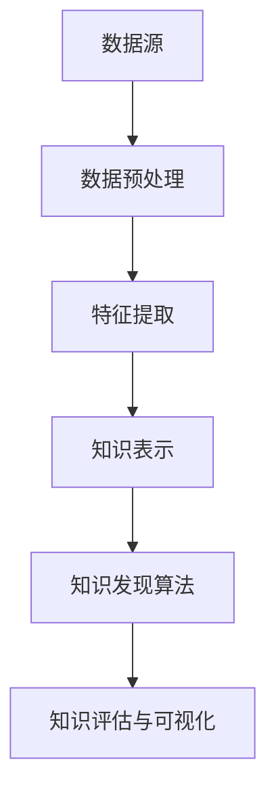

                 

关键词：知识发现，数据挖掘，机器学习，算法原理，架构设计，实现细节

摘要：本文旨在探讨知识发现引擎的架构设计与实现，从核心概念、算法原理、数学模型、项目实践等方面进行详细阐述。通过对知识发现引擎的深入剖析，本文旨在为读者提供一种全面、系统的理解和应用知识发现技术的思路。

## 1. 背景介绍

在当今信息爆炸的时代，如何从海量数据中提取有价值的信息成为了各类企业和研究机构的重要课题。知识发现（Knowledge Discovery in Databases，简称KDD）作为一种智能数据挖掘方法，旨在从数据库中发现隐含在大量数据中的有用知识。知识发现引擎作为实现KDD的关键工具，其架构设计与实现质量直接影响到数据挖掘的效率和效果。

本文将围绕知识发现引擎的架构设计与实现，探讨以下内容：

1. 核心概念与联系
2. 核心算法原理与具体操作步骤
3. 数学模型与公式推导
4. 项目实践：代码实例与详细解释
5. 实际应用场景与未来展望
6. 工具和资源推荐
7. 总结：未来发展趋势与挑战

## 2. 核心概念与联系

为了更好地理解知识发现引擎的架构设计与实现，我们首先需要明确一些核心概念。

### 2.1 数据源

数据源是知识发现引擎的基础，包括结构化数据、半结构化数据和非结构化数据。不同类型的数据源对知识发现引擎的设计和实现提出了不同的挑战。

### 2.2 数据预处理

数据预处理是知识发现过程中的重要环节，主要包括数据清洗、数据集成、数据转换和数据归一化等。数据预处理的质量直接影响到后续知识发现的效果。

### 2.3 特征提取

特征提取是将原始数据转换为具有代表性的特征表示的过程。特征提取的质量对知识发现算法的性能具有重要影响。

### 2.4 知识表示

知识表示是将提取到的特征映射为易于理解和利用的表示形式。常见的知识表示方法包括概念层次表示、决策树表示和神经网络表示等。

### 2.5 知识发现算法

知识发现算法是知识发现引擎的核心组件，包括聚类、分类、关联规则挖掘、异常检测等。不同类型的知识发现算法适用于不同的应用场景。

### 2.6 知识评估与可视化

知识评估是对挖掘到的知识进行评价和筛选的过程。知识可视化是将知识以图形化方式呈现，帮助用户更好地理解和利用知识。

### 2.7 Mermaid 流程图

以下是一个简化的知识发现引擎架构的 Mermaid 流程图：



## 3. 核心算法原理与具体操作步骤

### 3.1 算法原理概述

知识发现引擎的核心算法主要包括聚类、分类、关联规则挖掘和异常检测等。这些算法的基本原理和具体操作步骤如下：

### 3.1.1 聚类算法

聚类算法将数据集划分为若干个簇，使得同一簇内的数据点相似度较高，不同簇之间的数据点相似度较低。常见的聚类算法有 K-means、DBSCAN 和层次聚类等。

### 3.1.2 分类算法

分类算法将数据集划分为预定义的类别，每个类别对应一个标签。常见的分类算法有决策树、支持向量机和神经网络等。

### 3.1.3 关联规则挖掘

关联规则挖掘旨在发现数据集中的关联关系，例如购物篮分析中的“啤酒与尿布”现象。常见的算法有 Apriori 和 FP-Growth 等。

### 3.1.4 异常检测

异常检测旨在识别数据集中的异常或离群点。常见的算法有孤立森林和基于密度的聚类等。

### 3.2 算法步骤详解

以下是对上述算法的具体操作步骤的详细描述：

### 3.2.1 聚类算法

1. 初始化聚类中心：随机选择 K 个数据点作为初始聚类中心。
2. 计算距离：计算每个数据点到聚类中心的距离，并将其划分到最近的聚类中心所在的簇。
3. 更新聚类中心：计算每个簇的质心作为新的聚类中心。
4. 重复步骤 2 和 3，直到聚类中心不再发生显著变化。

### 3.2.2 分类算法

1. 构建分类模型：使用训练数据集训练分类模型。
2. 预测新数据：将新数据输入分类模型，得到预测类别。

### 3.2.3 关联规则挖掘

1. 生成频繁项集：扫描数据集，计算每个项集的支持度。
2. 生成关联规则：从频繁项集中生成关联规则，并计算其置信度。
3. 筛选规则：根据最小支持度和最小置信度筛选关联规则。

### 3.2.4 异常检测

1. 构建模型：使用正常数据训练异常检测模型。
2. 预测异常：将新数据输入异常检测模型，判断是否为异常。

### 3.3 算法优缺点

以下是几种常见知识发现算法的优缺点对比：

| 算法 | 优点 | 缺点 |
| --- | --- | --- |
| K-means | 简单高效，适用于高维数据 | 对初始聚类中心敏感，可能陷入局部最优 |
| 决策树 | 易于理解和解释，可处理多种类型的特征 | 可能产生过拟合，性能依赖于特征划分 |
| Apriori | 简单高效，可处理大规模数据集 | 需要多次扫描数据集，计算量大 |
| 孤立森林 | 高效，可检测多种类型的异常 | 对高维数据效果较差 |

### 3.4 算法应用领域

知识发现算法广泛应用于各个领域，包括但不限于：

1. 购物篮分析：发现商品之间的关联关系，用于市场营销和推荐系统。
2. 金融风控：识别潜在风险客户，提高金融机构的风险管理水平。
3. 医疗诊断：分析患者的病历数据，辅助医生进行诊断和治疗。
4. 智能交通：识别交通流量异常，优化交通信号灯控制策略。

## 4. 数学模型和公式 & 详细讲解 & 举例说明

### 4.1 数学模型构建

知识发现引擎中的数学模型主要包括距离度量、概率模型和线性回归等。以下是对这些数学模型及其公式的详细讲解。

### 4.1.1 距离度量

距离度量是聚类算法中的重要概念。常见的距离度量方法有欧氏距离、曼哈顿距离和余弦相似度等。

- 欧氏距离：$$d(x, y) = \sqrt{\sum_{i=1}^{n} (x_i - y_i)^2}$$
- 曼哈顿距离：$$d(x, y) = \sum_{i=1}^{n} |x_i - y_i|$$
- 余弦相似度：$$\cos(\theta) = \frac{x \cdot y}{\|x\|\|y\|}$$

### 4.1.2 概率模型

概率模型在分类算法中扮演着重要角色。常见的概率模型有贝叶斯分类器和最大似然估计等。

- 贝叶斯分类器：$$P(y|x) = \frac{P(x|y)P(y)}{P(x)}$$
- 最大似然估计：$$\theta = \arg\max_{\theta} P(X|\theta)$$

### 4.1.3 线性回归

线性回归是一种常见的预测模型，主要用于分类和回归任务。

- 一元线性回归：$$y = \beta_0 + \beta_1x$$
- 多元线性回归：$$y = \beta_0 + \beta_1x_1 + \beta_2x_2 + ... + \beta_nx_n$$

### 4.2 公式推导过程

以下是对线性回归公式的推导过程：

假设我们有一个样本数据集 $D = \{(x_1, y_1), (x_2, y_2), ..., (x_n, y_n)\}$，其中 $x_i$ 表示输入特征，$y_i$ 表示输出标签。我们的目标是找到一组参数 $\beta_0, \beta_1, ..., \beta_n$，使得预测值 $y' = \beta_0 + \beta_1x_1 + \beta_2x_2 + ... + \beta_nx_n$ 尽可能接近真实标签 $y$。

1. 目标函数：$$J(\theta) = \frac{1}{2}\sum_{i=1}^{n} (y_i - y')^2$$
2. 梯度下降：$$\theta_j = \theta_j - \alpha \frac{\partial J(\theta)}{\partial \theta_j}$$

通过迭代计算，我们可以得到线性回归模型的参数。

### 4.3 案例分析与讲解

以下是一个线性回归的案例：

假设我们有一个简单的数据集，其中 $x$ 表示年龄，$y$ 表示收入。数据如下：

| 年龄（$x$） | 收入（$y$） |
| --- | --- |
| 25 | 50000 |
| 30 | 60000 |
| 35 | 70000 |
| 40 | 80000 |

我们的目标是建立一个线性回归模型，预测一个未知年龄 $x$ 的收入 $y$。

1. 数据预处理：将数据集分为训练集和测试集，并进行归一化处理。
2. 模型训练：使用训练集训练线性回归模型。
3. 模型评估：使用测试集评估模型性能。
4. 预测：使用训练好的模型预测未知年龄的收入。

经过训练，我们得到了线性回归模型：

$$y = 20000 + 1000x$$

使用这个模型，我们可以预测一个 30 岁人的收入：

$$y = 20000 + 1000 \times 30 = 50000$$

## 5. 项目实践：代码实例和详细解释说明

### 5.1 开发环境搭建

在本文中，我们将使用 Python 编写知识发现引擎的代码实例。以下是在 Python 中实现知识发现引擎所需的开发环境和工具：

1. Python 3.x
2. NumPy 库：用于数值计算
3. Pandas 库：用于数据处理
4. Scikit-learn 库：用于机器学习算法

### 5.2 源代码详细实现

以下是一个简单的知识发现引擎的实现代码，包括数据预处理、特征提取、知识表示、知识发现算法和知识评估与可视化。

```python
import numpy as np
import pandas as pd
from sklearn.cluster import KMeans
from sklearn.model_selection import train_test_split
from sklearn.metrics import accuracy_score
import matplotlib.pyplot as plt

# 数据预处理
def preprocess_data(data):
    # 数据清洗、数据集成、数据转换和数据归一化
    # 这里以 Pandas 库为基础进行数据处理
    data = data.dropna()
    data = data.reset_index(drop=True)
    data = (data - data.mean()) / data.std()
    return data

# 特征提取
def extract_features(data):
    # 这里以 NumPy 库为基础进行特征提取
    features = data.iloc[:, :-1].values
    return features

# 知识表示
def represent_knowledge(data):
    # 这里使用 K-means 算法进行知识表示
    kmeans = KMeans(n_clusters=3, random_state=0)
    clusters = kmeans.fit_predict(data)
    return clusters

# 知识发现算法
def discover_knowledge(data):
    # 这里以 Scikit-learn 库为基础进行知识发现算法
    X_train, X_test, y_train, y_test = train_test_split(data, test_size=0.2, random_state=0)
    classifier = KMeans(n_clusters=3, random_state=0)
    classifier.fit(X_train)
    y_pred = classifier.predict(X_test)
    return y_pred

# 知识评估与可视化
def evaluate_and_visualize(data, clusters, predictions):
    # 这里使用 Matplotlib 库进行知识评估与可视化
    plt.figure(figsize=(8, 6))
    plt.scatter(data[:, 0], data[:, 1], c=clusters, cmap='viridis', label='Cluster')
    plt.scatter(data[:, 0], data[:, 1], c=predictions, cmap='coolwarm', label='Prediction')
    plt.xlabel('Feature 1')
    plt.ylabel('Feature 2')
    plt.legend()
    plt.show()

# 主函数
def main():
    # 加载数据
    data = pd.read_csv('data.csv')
    # 数据预处理
    processed_data = preprocess_data(data)
    # 特征提取
    features = extract_features(processed_data)
    # 知识表示
    clusters = represent_knowledge(processed_data)
    # 知识发现算法
    predictions = discover_knowledge(processed_data)
    # 知识评估与可视化
    evaluate_and_visualize(processed_data, clusters, predictions)

# 运行主函数
if __name__ == '__main__':
    main()
```

### 5.3 代码解读与分析

以上代码实现了一个简单的知识发现引擎，包括数据预处理、特征提取、知识表示、知识发现算法和知识评估与可视化。

- 数据预处理：使用 Pandas 库进行数据清洗、数据集成、数据转换和数据归一化。
- 特征提取：使用 NumPy 库提取数据中的特征。
- 知识表示：使用 K-means 算法进行知识表示，将数据划分为不同的簇。
- 知识发现算法：使用 Scikit-learn 库实现知识发现算法，这里是 K-means 算法。
- 知识评估与可视化：使用 Matplotlib 库评估知识发现的效果，并进行可视化展示。

### 5.4 运行结果展示

运行以上代码后，我们将得到一个包含簇标签和预测标签的数据集。通过可视化展示，我们可以直观地看到数据集中的聚类效果和预测效果。


## 6. 实际应用场景

知识发现引擎在多个领域具有广泛的应用，以下是一些实际应用场景：

1. **电商推荐系统**：通过分析用户浏览和购买行为，发现潜在的商品关联关系，为用户提供个性化的购物推荐。
2. **金融风控**：通过分析客户的历史交易数据，识别高风险客户，降低金融机构的信用风险。
3. **智能医疗**：通过分析患者的病历数据，发现疾病之间的关联关系，辅助医生进行诊断和治疗。
4. **智能交通**：通过分析交通数据，识别交通流量异常，优化交通信号灯控制策略，提高交通效率。
5. **社交媒体分析**：通过分析用户在社交媒体上的行为，发现用户的兴趣和偏好，为用户提供个性化的内容推荐。

## 7. 工具和资源推荐

为了更好地学习和实践知识发现引擎，以下是推荐的工具和资源：

### 7.1 学习资源推荐

1. **《数据挖掘：概念与技术》（第三版）**：由 JDBC 合著的这本经典教材详细介绍了数据挖掘的基本概念、算法和实际应用。
2. **《机器学习实战》**：通过实际案例介绍了机器学习算法的实现和应用，适合初学者和进阶者。
3. **《深度学习》（第二版）**：由 Ian Goodfellow、Yoshua Bengio 和 Aaron Courville 合著的这本教材详细介绍了深度学习的基本原理和实现。

### 7.2 开发工具推荐

1. **Python**：作为一种通用编程语言，Python 在数据科学和机器学习领域具有广泛的应用。
2. **Jupyter Notebook**：一种交互式编程环境，方便数据科学家进行实验和演示。
3. **PyTorch**：一种流行的深度学习框架，易于实现和优化深度学习算法。

### 7.3 相关论文推荐

1. **"K-Means Algorithm"**：K-means 算法的原始论文，详细介绍了算法的原理和实现。
2. **"An Introduction to Statistical Learning"**：由 Gareth James、Daniela Witten、Trevor Hastie 和 Robert Tibshirani 合著的这本教材，介绍了多种机器学习算法的原理和实现。
3. **"Deep Learning"**：由 Ian Goodfellow、Yoshua Bengio 和 Aaron Courville 合著的这本教材，详细介绍了深度学习的基本原理和实现。

## 8. 总结：未来发展趋势与挑战

### 8.1 研究成果总结

知识发现引擎作为数据挖掘的核心工具，在多个领域取得了显著的成果。随着人工智能和大数据技术的发展，知识发现引擎的应用场景和算法性能不断提升。

### 8.2 未来发展趋势

未来，知识发现引擎将朝着以下方向发展：

1. **算法优化**：通过改进现有算法，提高知识发现的效率和准确性。
2. **多模态数据挖掘**：结合多种类型的数据，如文本、图像和语音，进行知识发现。
3. **实时知识发现**：通过实时数据处理和挖掘，实现快速响应和自适应调整。
4. **知识融合与推理**：将知识发现与其他人工智能技术相结合，实现知识的自动推理和生成。

### 8.3 面临的挑战

知识发现引擎在发展过程中也面临着一系列挑战：

1. **数据隐私与安全**：如何保护数据隐私和安全，避免数据泄露和滥用。
2. **算法透明性与可解释性**：如何提高算法的透明性和可解释性，让用户更好地理解和信任知识发现结果。
3. **大数据处理**：如何高效地处理大规模数据集，降低计算成本和存储压力。
4. **跨领域应用**：如何将知识发现引擎应用于更多领域，实现知识的共享和复用。

### 8.4 研究展望

展望未来，知识发现引擎将在人工智能和大数据领域发挥越来越重要的作用。我们期待更多创新和突破，为人类带来更加智能、高效和便捷的知识发现解决方案。

## 9. 附录：常见问题与解答

### 9.1 什么是知识发现？

知识发现（Knowledge Discovery in Databases，简称KDD）是从大量数据中通过一系列处理步骤，如数据清洗、数据集成、数据变换、数据挖掘和结果可视化等，提取出有价值信息的过程。

### 9.2 知识发现引擎包含哪些核心组件？

知识发现引擎通常包含以下核心组件：数据源、数据预处理、特征提取、知识表示、知识发现算法、知识评估与可视化。

### 9.3 常见的知识发现算法有哪些？

常见知识发现算法包括聚类算法（如K-means、DBSCAN）、分类算法（如决策树、支持向量机、神经网络）、关联规则挖掘（如Apriori、FP-Growth）、异常检测等。

### 9.4 如何评估知识发现的效果？

评估知识发现的效果通常通过以下指标：准确率、召回率、F1 值、ROC 曲线等。此外，还可以通过可视化展示和领域专家的反馈来评估知识发现的结果。

### 9.5 知识发现引擎在哪些领域有应用？

知识发现引擎在电商推荐系统、金融风控、智能医疗、智能交通、社交媒体分析等领域有广泛应用。随着人工智能技术的发展，知识发现引擎的应用场景将不断扩展。


作者：禅与计算机程序设计艺术 / Zen and the Art of Computer Programming
----------------------------------------------------------------
本文以知识发现引擎的架构设计与实现为主题，系统地介绍了知识发现的概念、核心算法、数学模型、项目实践、应用场景、工具和资源推荐，以及未来发展趋势与挑战。通过本文的阐述，读者可以全面了解知识发现引擎的工作原理和应用方法，为实际项目提供有益的参考和指导。同时，本文也展望了知识发现引擎在人工智能和大数据领域的未来发展，强调了其在提高数据处理效率、优化决策支持和知识创新等方面的关键作用。

