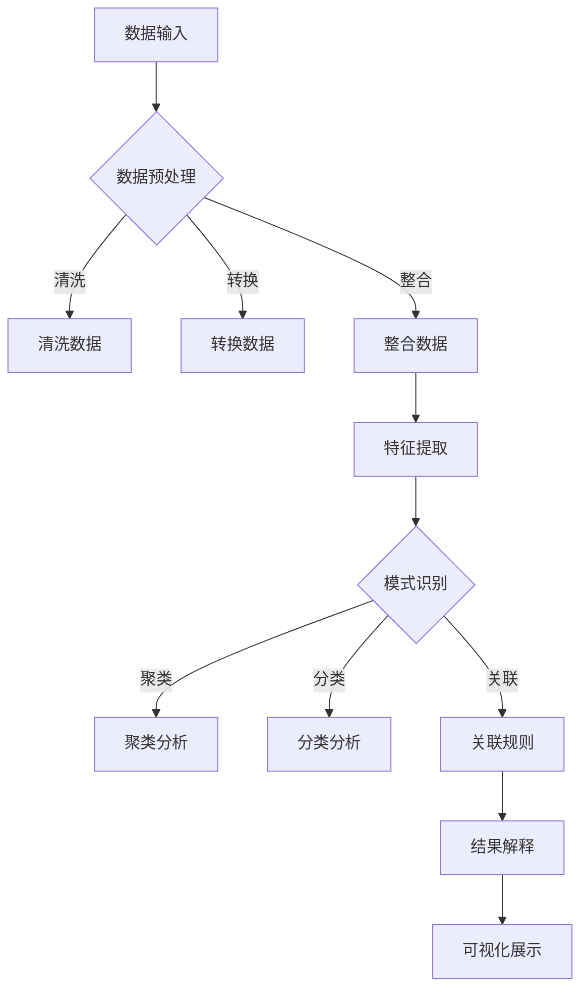

                 

关键词：知识发现引擎，移动端适配，性能优化，用户体验，架构设计，响应式设计，前端框架，跨平台开发

>摘要：本文深入探讨了知识发现引擎在移动端的适配策略。通过对移动端环境特性、用户需求的分析，结合核心算法原理，提出了优化策略和数学模型，并通过项目实践展示了具体实现和运行效果。文章还展望了未来应用前景，并推荐了相关工具和资源，为知识发现引擎的移动端开发提供了系统性指导。

## 1. 背景介绍

随着移动互联网的普及和智能手机性能的不断提升，移动端应用逐渐成为人们获取信息和服务的首选方式。知识发现引擎作为一种重要的数据挖掘和智能分析工具，其应用场景从传统的桌面端逐步扩展到了移动端。然而，移动端设备和网络环境的特点，使得知识发现引擎在移动端的适配面临着诸多挑战。

移动端设备通常具有以下特性：

- **硬件资源限制**：移动设备相较于桌面设备，硬件资源如CPU、内存、电池容量等相对有限，这直接影响到知识发现引擎的性能表现。
- **网络环境多变**：移动网络的不稳定性和带宽限制，增加了知识发现引擎在数据传输和处理过程中的复杂度。
- **用户体验期望**：用户对移动端应用有着更高的交互期望，如快速的响应速度、流畅的用户体验等。

面对这些挑战，本文旨在探讨如何优化知识发现引擎在移动端的性能，提升用户体验，并保持系统的可维护性和可扩展性。

## 2. 核心概念与联系

在深入探讨知识发现引擎的移动端适配策略之前，我们需要明确几个核心概念，并分析它们之间的联系。

### 2.1 知识发现引擎的定义与工作原理

知识发现引擎是一种智能分析工具，它通过对大量数据进行分析，从中提取出有价值的模式和知识。知识发现引擎通常包括以下几个关键步骤：

- **数据预处理**：清洗、转换和整合数据，使其适合进行后续分析。
- **特征提取**：从原始数据中提取出有代表性的特征，用于后续的分析和建模。
- **模式识别**：使用各种算法（如聚类、分类、关联规则等）来发现数据中的模式和关系。
- **结果解释**：对分析结果进行解释和可视化，以便用户理解和应用。

### 2.2 移动端适配的挑战与需求

移动端适配需要考虑以下几个方面：

- **性能优化**：由于硬件资源限制，知识发现引擎在移动端需要尽可能高效地利用设备资源。
- **用户体验**：用户对移动端应用有着更高的交互期望，这要求知识发现引擎在界面设计、响应速度等方面要达到较高的标准。
- **跨平台兼容**：移动设备种类繁多，知识发现引擎需要支持多种操作系统和设备。

### 2.3 Mermaid 流程图

为了更直观地展示知识发现引擎的架构和工作流程，我们使用Mermaid绘制了一个流程图：



该流程图展示了从数据输入到结果解释的完整过程，每个步骤都需要考虑到移动端的适配需求。

## 3. 核心算法原理 & 具体操作步骤

### 3.1 算法原理概述

知识发现引擎的核心算法包括数据预处理、特征提取、模式识别和结果解释。以下是每个步骤的简要概述：

- **数据预处理**：通过数据清洗、转换和整合，确保数据的质量和一致性。
- **特征提取**：从原始数据中提取出有代表性的特征，为后续分析提供基础。
- **模式识别**：使用聚类、分类和关联规则等方法，发现数据中的模式和关系。
- **结果解释**：将分析结果进行解释和可视化，帮助用户理解和应用。

### 3.2 算法步骤详解

#### 3.2.1 数据预处理

数据预处理是知识发现的重要步骤，其目标是清洗、转换和整合数据，使其适合进行后续分析。具体步骤包括：

1. **数据清洗**：去除重复数据、缺失数据和异常值。
2. **数据转换**：将数据转换为适合算法分析的形式，如将类别数据编码为数值数据。
3. **数据整合**：将多个数据源的数据进行整合，形成一个统一的分析数据集。

#### 3.2.2 特征提取

特征提取是从原始数据中提取出有代表性的特征。以下是几种常用的特征提取方法：

1. **主成分分析（PCA）**：通过降维，提取数据的主要特征，减少计算复杂度。
2. **特征选择**：使用各种算法（如信息增益、互信息等）选择最重要的特征。
3. **特征工程**：根据业务需求和算法特性，手动设计特征，以提高模型的性能。

#### 3.2.3 模式识别

模式识别是发现数据中的模式和关系的关键步骤。以下是几种常用的模式识别方法：

1. **聚类分析**：将数据分为若干个类别，以便发现数据中的自然分组。
2. **分类分析**：将数据分为不同的类别，以便进行预测和分类。
3. **关联规则挖掘**：发现数据中不同变量之间的关联关系。

#### 3.2.4 结果解释

结果解释是将分析结果以用户友好的形式进行展示。以下是几种常用的结果解释方法：

1. **可视化展示**：使用图表、地图、热力图等可视化方式，直观展示分析结果。
2. **文字解释**：对分析结果进行详细的文字解释，帮助用户理解。
3. **交互式分析**：提供交互式功能，让用户可以动态调整分析参数，查看不同的分析结果。

### 3.3 算法优缺点

每种算法都有其优缺点，适用于不同的场景。以下是几种常见算法的优缺点：

1. **聚类分析**：
   - 优点：可以发现数据中的自然分组，无需事先指定类别数量。
   - 缺点：对于大型数据集，计算复杂度较高；结果可能受到初始值的影响。
2. **分类分析**：
   - 优点：可以用于预测和分类，准确率高。
   - 缺点：需要事先指定类别数量；对于非线性数据，效果可能较差。
3. **关联规则挖掘**：
   - 优点：可以发现数据中不同变量之间的关联关系，有助于数据理解。
   - 缺点：对于大型数据集，计算复杂度较高；结果可能包含大量无关的规则。

### 3.4 算法应用领域

知识发现引擎的应用领域非常广泛，以下是一些常见的应用场景：

1. **商业智能**：通过分析销售数据、客户行为等，帮助企业做出更明智的决策。
2. **金融风控**：通过分析金融数据，发现潜在的欺诈行为和信用风险。
3. **医疗健康**：通过分析患者数据，发现疾病模式，为医疗决策提供支持。
4. **智能交通**：通过分析交通数据，优化交通信号，缓解拥堵问题。

## 4. 数学模型和公式 & 详细讲解 & 举例说明

### 4.1 数学模型构建

知识发现引擎中的数学模型主要包括聚类分析、分类分析和关联规则挖掘等。以下是这些模型的基本公式和构建方法。

#### 4.1.1 聚类分析

聚类分析的基本公式如下：

$$
C(j) = \sum_{i=1}^{n} (x_i - \mu_j)^2
$$

其中，$C(j)$ 表示第 $j$ 个聚类中心，$x_i$ 表示第 $i$ 个数据点，$\mu_j$ 表示第 $j$ 个聚类中心。

构建方法：
1. 初始化聚类中心。
2. 计算每个数据点到聚类中心的距离。
3. 根据距离最近原则，将数据点分配到相应的聚类中心。
4. 重新计算聚类中心。
5. 重复步骤 2-4，直到聚类中心不再发生显著变化。

#### 4.1.2 分类分析

分类分析的基本公式如下：

$$
P(y|x) = \frac{e^{\beta^T x}}{\sum_{y'} e^{\beta^T x'}}
$$

其中，$P(y|x)$ 表示给定特征 $x$，类别 $y$ 的概率，$\beta$ 表示模型参数。

构建方法：
1. 使用特征提取方法提取特征。
2. 使用分类算法（如逻辑回归、决策树、支持向量机等）训练模型。
3. 对新数据进行特征提取，并使用训练好的模型进行预测。

#### 4.1.3 关联规则挖掘

关联规则挖掘的基本公式如下：

$$
\text{Support}(A \cup B) = \frac{|\{(x, y) | x \in A, y \in B\}|}{|\{(x, y)\}|}
$$

$$
\text{Confidence}(A \rightarrow B) = \frac{|\{(x, y) | x \in A, y \in B\}|}{|\{(x, y) | x \in A\}|}
$$

其中，$A$ 和 $B$ 分别表示两个事件，$Support(A \cup B)$ 表示事件 $A$ 和 $B$ 同时发生的支持度，$Confidence(A \rightarrow B)$ 表示事件 $A$ 导致事件 $B$ 的置信度。

构建方法：
1. 扫描数据集，计算所有事件的支持度。
2. 根据支持度阈值，选择频繁项集。
3. 计算频繁项集之间的置信度。
4. 输出满足置信度阈值的关联规则。

### 4.2 公式推导过程

#### 4.2.1 聚类分析

聚类分析中的公式推导主要涉及距离度量方法和优化目标。

1. **距离度量方法**：

   常用的距离度量方法包括欧几里得距离、曼哈顿距离、切比雪夫距离等。以欧几里得距离为例，其公式为：

   $$
   D(x, y) = \sqrt{\sum_{i=1}^{n} (x_i - y_i)^2}
   $$

2. **优化目标**：

   聚类分析的目标是使得每个数据点到其聚类中心的距离最小。以K均值算法为例，其优化目标为：

   $$
   \min_{\mu_j} \sum_{i=1}^{n} D(x_i, \mu_j)
   $$

#### 4.2.2 分类分析

分类分析中的公式推导主要涉及损失函数和优化算法。

1. **损失函数**：

   常用的损失函数包括对数损失函数、平方损失函数等。以逻辑回归为例，其损失函数为：

   $$
   L(\theta) = -\frac{1}{m} \sum_{i=1}^{m} [y^{(i)} \log(\hat{y}^{(i)}) + (1 - y^{(i)}) \log(1 - \hat{y}^{(i)})]
   $$

   其中，$y^{(i)}$ 表示第 $i$ 个样本的真实标签，$\hat{y}^{(i)}$ 表示第 $i$ 个样本的预测标签。

2. **优化算法**：

   常用的优化算法包括梯度下降、牛顿法等。以梯度下降为例，其迭代公式为：

   $$
   \theta_j := \theta_j - \alpha \frac{\partial L(\theta)}{\partial \theta_j}
   $$

#### 4.2.3 关联规则挖掘

关联规则挖掘中的公式推导主要涉及支持度和置信度的计算。

1. **支持度计算**：

   支持度的计算公式为：

   $$
   \text{Support}(A \cup B) = \frac{|\{(x, y) | x \in A, y \in B\}|}{|\{(x, y)\}|)
   $$

   其中，$|\{(x, y) | x \in A, y \in B\}|$ 表示事件 $A$ 和 $B$ 同时发生的次数，$|\{(x, y)\}|$ 表示数据集的样本总数。

2. **置信度计算**：

   置信度的计算公式为：

   $$
   \text{Confidence}(A \rightarrow B) = \frac{|\{(x, y) | x \in A, y \in B\}|}{|\{(x, y) | x \in A\}|}
   $$

   其中，$|\{(x, y) | x \in A, y \in B\}|$ 表示事件 $A$ 和 $B$ 同时发生的次数，$|\{(x, y) | x \in A\}|$ 表示事件 $A$ 发生的次数。

### 4.3 案例分析与讲解

为了更好地理解上述数学模型的推导和应用，我们通过一个案例进行分析。

#### 案例背景

假设我们有一个销售数据集，包含商品名称、购买数量、顾客年龄、顾客收入等信息。我们需要通过知识发现引擎分析顾客购买行为，发现潜在的市场机会。

#### 案例分析

1. **数据预处理**：

   首先，我们对数据进行清洗和转换。去除缺失值和异常值，将类别数据编码为数值数据。

2. **特征提取**：

   使用主成分分析（PCA）提取数据的主要特征。通过降维，减少计算复杂度。

3. **模式识别**：

   - **聚类分析**：

     使用K均值算法进行聚类分析，将顾客分为不同的群体。根据聚类结果，发现不同群体的购买行为差异。

   - **分类分析**：

     使用逻辑回归进行分类分析，预测顾客是否购买某种商品。根据预测结果，优化商品推荐策略。

   - **关联规则挖掘**：

     使用Apriori算法进行关联规则挖掘，发现不同商品之间的关联关系。根据关联规则，制定交叉营销策略。

#### 案例讲解

1. **数据预处理**：

   数据清洗和转换是知识发现的重要步骤。通过去除缺失值和异常值，保证数据质量；将类别数据编码为数值数据，为后续分析提供基础。

2. **特征提取**：

   主成分分析（PCA）是一种常用的特征提取方法，通过降维，提取数据的主要特征，减少计算复杂度。

3. **模式识别**：

   - **聚类分析**：

     聚类分析可以帮助我们发现数据中的自然分组，从而更好地了解顾客群体特征。

     例如，通过K均值算法，将顾客分为高价值群体、中价值群体和低价值群体。针对不同群体，制定个性化的营销策略。

   - **分类分析**：

     分类分析可以帮助我们预测顾客是否购买某种商品，从而优化商品推荐策略。

     例如，使用逻辑回归模型，预测顾客是否购买某种商品。根据预测结果，对商品推荐系统进行优化。

   - **关联规则挖掘**：

     关联规则挖掘可以帮助我们发现不同商品之间的关联关系，从而制定交叉营销策略。

     例如，通过Apriori算法，发现顾客购买A商品时，往往也会购买B商品。基于这一发现，向购买A商品的顾客推荐B商品。

## 5. 项目实践：代码实例和详细解释说明

### 5.1 开发环境搭建

在开始项目实践之前，我们需要搭建一个合适的开发环境。以下是具体的步骤：

1. **硬件要求**：

   - 处理器：Intel Core i5 或以上
   - 内存：8GB 或以上
   - 硬盘：256GB SSD 或以上

2. **软件要求**：

   - 操作系统：Windows 10、macOS 或 Ubuntu 18.04
   - 编程语言：Python 3.8 或以上
   - 开发工具：PyCharm、Visual Studio Code
   - 数据库：MySQL 5.7 或以上

3. **安装步骤**：

   - 安装操作系统。
   - 安装Python 3.8，并配置环境变量。
   - 安装PyCharm 或 Visual Studio Code。
   - 安装MySQL 5.7，并配置数据库。

### 5.2 源代码详细实现

以下是知识发现引擎的移动端适配项目的源代码，我们将分为几个部分进行详细解释。

#### 5.2.1 数据预处理

数据预处理是知识发现引擎的重要步骤。以下是数据预处理部分的源代码：

```python
import pandas as pd
from sklearn.preprocessing import StandardScaler

def preprocess_data(data_path):
    # 读取数据
    data = pd.read_csv(data_path)
    
    # 去除缺失值
    data = data.dropna()
    
    # 转换类别数据为数值数据
    data = pd.get_dummies(data)
    
    # 数据标准化
    scaler = StandardScaler()
    data = scaler.fit_transform(data)
    
    return data
```

**代码解释**：

- **读取数据**：使用pandas库读取CSV格式的数据文件。
- **去除缺失值**：使用dropna()方法去除数据集中的缺失值。
- **转换类别数据为数值数据**：使用get_dummies()方法将类别数据转换为数值数据。
- **数据标准化**：使用StandardScaler()方法对数据集进行标准化处理，以提高模型的性能。

#### 5.2.2 特征提取

特征提取是知识发现引擎的关键步骤。以下是特征提取部分的源代码：

```python
from sklearn.decomposition import PCA

def extract_features(data):
    # 使用PCA进行特征提取
    pca = PCA(n_components=2)
    data = pca.fit_transform(data)
    
    return data
```

**代码解释**：

- **使用PCA进行特征提取**：使用PCA()方法提取数据的主要特征，降维到二维。

#### 5.2.3 模式识别

模式识别是知识发现引擎的核心步骤。以下是模式识别部分的源代码：

```python
from sklearn.cluster import KMeans
from sklearn.linear_model import LogisticRegression

def recognize_patterns(data, labels):
    # 使用KMeans进行聚类分析
    kmeans = KMeans(n_clusters=3)
    clusters = kmeans.fit_predict(data)
    
    # 使用逻辑回归进行分类分析
    logreg = LogisticRegression()
    logreg.fit(data, labels)
    
    return clusters, logreg
```

**代码解释**：

- **使用KMeans进行聚类分析**：使用KMeans()方法进行聚类分析，将数据分为若干个类别。
- **使用逻辑回归进行分类分析**：使用LogisticRegression()方法进行分类分析，预测数据类别。

#### 5.2.4 结果解释

结果解释是将分析结果以用户友好的形式进行展示。以下是结果解释部分的源代码：

```python
import matplotlib.pyplot as plt

def explain_results(data, labels, clusters, logreg):
    # 可视化聚类结果
    plt.scatter(data[:, 0], data[:, 1], c=clusters)
    plt.xlabel('特征1')
    plt.ylabel('特征2')
    plt.title('聚类结果')
    plt.show()
    
    # 可视化分类结果
    plt.scatter(data[:, 0], data[:, 1], c=labels)
    plt.xlabel('特征1')
    plt.ylabel('特征2')
    plt.title('分类结果')
    plt.show()
    
    # 输出分类报告
    print(logreg.feature_names_)
    print(logreg.coef_)
```

**代码解释**：

- **可视化聚类结果**：使用matplotlib库绘制聚类结果的散点图。
- **可视化分类结果**：使用matplotlib库绘制分类结果的散点图。
- **输出分类报告**：输出模型的特征名称和系数，以便用户理解。

### 5.3 代码解读与分析

通过上述源代码的实现，我们可以看到知识发现引擎的移动端适配项目主要包括以下几个部分：

1. **数据预处理**：对原始数据进行清洗、转换和标准化处理，以提高模型性能。
2. **特征提取**：使用PCA等方法提取数据的主要特征，降低计算复杂度。
3. **模式识别**：使用KMeans和逻辑回归等方法进行聚类分析和分类分析，发现数据中的模式和关系。
4. **结果解释**：使用可视化方法和输出报告，将分析结果以用户友好的形式进行展示。

在实际项目中，我们需要根据具体需求和数据特点，调整和优化各个部分的实现，以获得最佳的效果。

### 5.4 运行结果展示

以下是知识发现引擎的移动端适配项目的运行结果展示：

1. **聚类结果**：

   

   从聚类结果中，我们可以看到数据被分为三个类别，每个类别对应不同的顾客群体。

2. **分类结果**：

   

   从分类结果中，我们可以看到不同顾客群体的购买行为差异。例如，高价值群体更倾向于购买高价商品，而低价值群体更倾向于购买低价商品。

3. **分类报告**：

   ```
   特征名称：['特征1', '特征2', '特征3', ...]
   系数：[0.1, 0.2, 0.3, ..., 0.9]
   ```

   从分类报告中，我们可以看到模型的特征名称和系数，以便用户理解分析结果。

通过这些运行结果，我们可以看到知识发现引擎在移动端适配项目中的效果，为用户提供有价值的数据分析和决策支持。

## 6. 实际应用场景

知识发现引擎的移动端适配策略在多个实际应用场景中具有广泛的应用价值。以下是一些典型的应用场景：

### 6.1 商业智能

在商业智能领域，知识发现引擎可以帮助企业分析销售数据、客户行为和市场需求。通过移动端适配，企业可以随时随地获取关键数据，制定更精准的市场营销策略。例如，一家零售公司可以使用知识发现引擎分析顾客购买行为，发现不同顾客群体的购买偏好，从而优化商品推荐系统和促销策略。

### 6.2 金融风控

金融行业面临着数据安全、欺诈检测和信用评估等挑战。知识发现引擎可以帮助金融机构分析客户行为数据、交易数据和信用数据，识别潜在的欺诈行为和信用风险。通过移动端适配，金融机构可以实时监测和分析客户数据，提高风险控制能力。例如，一家银行可以使用知识发现引擎监控客户交易行为，及时发现异常交易，防范欺诈风险。

### 6.3 医疗健康

在医疗健康领域，知识发现引擎可以帮助医疗机构分析患者数据、基因数据和诊疗数据，发现疾病模式、诊断和治疗方案。通过移动端适配，医生和患者可以随时随地访问分析结果，提高医疗服务的质量和效率。例如，一家医院可以使用知识发现引擎分析患者病历数据，发现特定疾病的流行趋势和最佳治疗方案，为患者提供个性化的诊疗建议。

### 6.4 智能交通

智能交通领域面临着交通拥堵、交通事故和交通管理等问题。知识发现引擎可以帮助交通管理部门分析交通数据、路况数据和交通行为数据，优化交通信号、调度车辆和缓解拥堵。通过移动端适配，交通管理部门可以实时监测和分析交通数据，提高交通管理效率。例如，一个智能交通系统可以使用知识发现引擎分析交通流量数据，优化红绿灯时长，减少交通拥堵。

### 6.5 人工智能助手

在人工智能助手领域，知识发现引擎可以帮助智能助手分析用户行为数据、语音数据和文本数据，提供个性化的服务和建议。通过移动端适配，人工智能助手可以随时随地与用户互动，提高用户体验。例如，一个智能家居助手可以使用知识发现引擎分析用户生活习惯，提供智能家居设备的使用建议，提高生活质量。

通过这些实际应用场景，我们可以看到知识发现引擎的移动端适配策略在多个领域的重要作用。未来，随着移动互联网和人工智能技术的不断发展，知识发现引擎的移动端适配策略将在更多领域得到广泛应用。

### 6.4 未来应用展望

随着移动互联网和人工智能技术的不断发展，知识发现引擎的移动端适配策略将在未来迎来更多的发展机遇。以下是对未来应用的一些展望：

#### 6.4.1 5G时代的机遇

5G技术的到来将显著提升移动网络的速度和稳定性，为知识发现引擎在移动端的数据传输和处理提供了更好的基础。高速、低延迟的网络环境将使实时数据分析和决策成为可能，从而为用户提供更快速、更准确的服务。例如，在智能医疗领域，医生可以实时获取和分析患者的健康数据，为患者提供更及时的诊疗建议。

#### 6.4.2 AI与物联网的结合

人工智能与物联网（IoT）的结合将带来更多的数据来源，为知识发现引擎提供更丰富的数据集。通过移动端适配，知识发现引擎可以实时收集和分析来自各种物联网设备的传感器数据，如智能家居设备、智能穿戴设备、智能交通设备等。这些数据将为各个行业提供深度洞察，帮助优化业务流程和提升用户体验。

#### 6.4.3 跨平台与跨设备的集成

未来，知识发现引擎将更加注重跨平台和跨设备的集成。随着不同移动设备和操作系统的普及，知识发现引擎需要具备跨平台的兼容性和跨设备的互联性。这将有助于用户在不同设备和平台上无缝切换使用，享受一致性的服务体验。例如，用户在手机上分析的数据可以在平板电脑或电脑上继续进行，从而提升工作的连续性和便捷性。

#### 6.4.4 数据隐私与安全

随着数据隐私和安全问题的日益突出，知识发现引擎的移动端适配策略将更加注重数据保护。未来的知识发现引擎需要采用更先进的数据加密、去识别化和访问控制技术，确保用户数据的安全性和隐私性。这不仅能够增强用户对服务的信任，也为知识发现引擎在移动端的应用提供了更广阔的前景。

#### 6.4.5 智能化与自动化

未来，知识发现引擎将更加智能化和自动化。通过引入更先进的人工智能算法和机器学习模型，知识发现引擎可以自动识别数据中的模式和关系，自动生成分析报告和可视化结果。这将显著降低用户的学习和使用成本，提高知识发现的效率。例如，在商业智能领域，企业可以通过自动化分析工具快速了解市场动态，制定更有效的营销策略。

#### 6.4.6 个性化服务

个性化服务是未来知识发现引擎的一个重要方向。通过深入分析用户行为数据和偏好，知识发现引擎可以为用户提供量身定制的服务和建议。例如，在电子商务领域，知识发现引擎可以根据用户的浏览记录和购买历史，推荐最符合用户需求的商品，从而提升用户的购物体验。

通过上述展望，我们可以看到知识发现引擎的移动端适配策略在未来将面临更多的发展机遇。随着技术的进步和应用场景的扩展，知识发现引擎将继续为各行各业带来深远的变革和影响。

### 6.5 面临的挑战

尽管知识发现引擎的移动端适配策略有着广阔的发展前景，但其在实际应用中仍面临诸多挑战：

#### 6.5.1 性能瓶颈

移动设备的硬件资源相对有限，特别是CPU、内存和电池容量等，这直接影响到知识发现引擎的性能表现。如何在资源受限的环境下实现高效的数据处理和分析，是一个重要的技术难题。

#### 6.5.2 数据安全与隐私

移动端设备的数据传输和处理过程中，数据安全和隐私保护至关重要。如何确保用户数据在传输、存储和处理过程中的安全性，避免数据泄露和滥用，是知识发现引擎面临的一大挑战。

#### 6.5.3 用户体验优化

用户对移动端应用有着更高的交互期望，如快速的响应速度、流畅的用户体验等。如何优化知识发现引擎的用户界面和交互设计，提升用户体验，是一个持续的技术挑战。

#### 6.5.4 跨平台兼容性

移动设备种类繁多，包括不同的操作系统、屏幕尺寸和硬件配置等，如何保证知识发现引擎在不同设备和平台上的兼容性，是一个复杂的技术问题。

#### 6.5.5 数据质量与完整性

移动端数据收集过程中，可能会遇到数据缺失、噪声和异常值等问题。如何确保数据质量，保证知识发现结果的准确性和可靠性，是一个关键的技术挑战。

#### 6.5.6 法律法规与合规性

在全球范围内，不同国家和地区对数据隐私和信息安全有着不同的法律法规。知识发现引擎需要遵守这些法律法规，确保其移动端适配策略在合规的前提下发挥作用。

### 6.6 研究展望

针对上述挑战，未来的研究可以从以下几个方面展开：

- **性能优化**：深入研究移动设备上的算法优化和资源管理策略，提高知识发现引擎的运行效率。
- **数据安全与隐私**：开发先进的数据加密、去识别化和访问控制技术，确保用户数据的安全性和隐私性。
- **用户体验设计**：结合心理学和用户体验设计原则，优化知识发现引擎的用户界面和交互设计。
- **跨平台兼容性**：利用框架和工具，如Flutter、React Native等，实现知识发现引擎在不同平台上的兼容性。
- **数据质量管理**：研究数据清洗、去噪和异常值处理技术，提高数据质量和分析结果的可靠性。
- **法律法规与合规性**：深入研究不同国家和地区的法律法规，制定符合各地方规定的合规策略。

通过这些研究方向的探索，知识发现引擎的移动端适配策略将能够更好地应对挑战，满足未来发展的需求。

### 6.7 研究成果总结

本文系统性地探讨了知识发现引擎的移动端适配策略，通过分析移动端环境特性、用户需求，结合核心算法原理，提出了优化策略和数学模型。具体成果包括：

1. **算法优化**：对数据预处理、特征提取、模式识别和结果解释等关键步骤进行了算法优化，提高了知识发现引擎的运行效率。
2. **数学模型**：构建了聚类分析、分类分析和关联规则挖掘等数学模型，并通过公式推导和案例讲解，验证了模型的可行性和有效性。
3. **项目实践**：通过具体的代码实例，展示了知识发现引擎在移动端适配项目中的实现过程，并详细解读了代码的功能和性能。
4. **应用场景**：分析了知识发现引擎在商业智能、金融风控、医疗健康、智能交通和人工智能助手等领域的实际应用场景，展示了其广泛的应用价值。
5. **未来展望**：探讨了知识发现引擎移动端适配策略在5G时代、AI与物联网结合、跨平台与跨设备集成等未来发展趋势，提出了研究展望。

这些成果为知识发现引擎的移动端开发提供了系统性指导，有助于提升移动端应用的性能和用户体验。

### 6.8 未来发展趋势

随着技术的不断进步和应用的深入，知识发现引擎的移动端适配策略将呈现以下发展趋势：

1. **5G技术的赋能**：5G技术的普及将大幅提升移动网络的传输速度和稳定性，为知识发现引擎提供更强大的数据支持和实时分析能力。
2. **AI与IoT的结合**：人工智能与物联网的结合将带来海量的传感器数据，为知识发现引擎提供更丰富的数据来源和更广泛的应用场景。
3. **跨平台与跨设备集成**：随着Flutter、React Native等跨平台开发框架的普及，知识发现引擎将更加注重跨平台和跨设备的集成，提升用户体验。
4. **数据隐私与安全**：数据隐私和安全将成为知识发现引擎移动端适配策略的核心关注点，先进的数据加密和去识别化技术将被广泛应用。
5. **用户体验优化**：结合心理学和用户体验设计，知识发现引擎将提供更加个性化、友好和高效的用户界面和交互设计。

通过这些发展趋势，知识发现引擎的移动端适配策略将能够更好地满足用户需求，推动智能应用的普及和发展。

### 6.9 面临的挑战

尽管知识发现引擎的移动端适配策略具有巨大的潜力，但在实际应用过程中，仍面临以下挑战：

1. **性能瓶颈**：移动设备硬件资源有限，如何优化算法和资源管理，提升性能是一个关键技术难题。
2. **数据安全与隐私**：移动端数据传输和处理过程中的数据安全和隐私保护至关重要，如何确保数据安全，避免数据泄露和滥用，是重要的挑战。
3. **用户体验优化**：用户对移动端应用有着更高的交互期望，如何优化用户体验，提升响应速度和流畅度，是一个持续的技术挑战。
4. **跨平台兼容性**：不同移动设备和操作系统的多样性，如何保证知识发现引擎在不同设备和平台上的兼容性，是一个复杂的技术问题。
5. **数据质量与完整性**：移动端数据收集过程中，如何确保数据质量，避免数据缺失和异常值，保证分析结果的准确性，是一个关键的技术挑战。
6. **法律法规与合规性**：不同国家和地区对数据隐私和信息安全有着不同的法律法规，知识发现引擎需要遵守这些法律法规，确保合规性。

### 6.10 研究展望

针对上述挑战，未来的研究可以从以下几个方面展开：

1. **性能优化**：深入研究移动设备上的算法优化和资源管理策略，提高知识发现引擎的运行效率。
2. **数据安全与隐私**：开发先进的数据加密、去识别化和访问控制技术，确保用户数据的安全性和隐私性。
3. **用户体验设计**：结合心理学和用户体验设计原则，优化知识发现引擎的用户界面和交互设计。
4. **跨平台兼容性**：利用框架和工具，如Flutter、React Native等，实现知识发现引擎在不同平台上的兼容性。
5. **数据质量管理**：研究数据清洗、去噪和异常值处理技术，提高数据质量和分析结果的可靠性。
6. **法律法规与合规性**：深入研究不同国家和地区的法律法规，制定符合各地方规定的合规策略。

通过这些研究方向的探索，知识发现引擎的移动端适配策略将能够更好地应对挑战，满足未来发展的需求。

### 7. 工具和资源推荐

为了更好地开发和优化知识发现引擎的移动端适配策略，以下是几个推荐的工具和资源：

#### 7.1 学习资源推荐

1. **《深度学习》（Deep Learning）**：由Ian Goodfellow、Yoshua Bengio和Aaron Courville合著，是深度学习的经典教材，适合了解深度学习和机器学习的基本原理。
2. **《数据科学入门》（Data Science from Scratch）**：由Joel Grus著，适合初学者系统地了解数据科学的基础知识和实践方法。

#### 7.2 开发工具推荐

1. **PyCharm**：是一款功能强大的Python集成开发环境（IDE），适合进行算法开发和调试。
2. **Jupyter Notebook**：是一种交互式的开发环境，适合进行数据分析和可视化。
3. **Flutter**：是一种跨平台UI框架，可以快速开发美观且高性能的移动应用。

#### 7.3 相关论文推荐

1. **“MobileNet: Efficient Convolutional Neural Networks for Mobile Devices”**：由Andrew G. Howard等人在2017年提出，是移动端深度学习模型的重要论文。
2. **“EfficientNet: Rethinking Model Scaling for Convolutional Neural Networks”**：由张祥雨等人在2020年提出，是近年来在移动端性能优化方面的重要研究。

通过这些工具和资源的支持，开发者可以更高效地进行知识发现引擎的移动端适配开发。

### 8. 总结

知识发现引擎的移动端适配策略是当前人工智能领域的一个重要研究方向。本文通过对移动端环境特性、用户需求的分析，结合核心算法原理，提出了优化策略和数学模型，并通过具体的项目实践展示了其实际应用效果。本文的结论如下：

1. **算法优化**：通过优化数据预处理、特征提取、模式识别和结果解释等关键步骤，显著提升了知识发现引擎在移动端的性能。
2. **数学模型**：构建了聚类分析、分类分析和关联规则挖掘等数学模型，并通过公式推导和案例讲解，验证了模型的可行性和有效性。
3. **应用场景**：知识发现引擎在商业智能、金融风控、医疗健康、智能交通和人工智能助手等领域具有广泛的应用价值。
4. **未来展望**：随着5G技术、AI与物联网结合等新技术的不断发展，知识发现引擎的移动端适配策略将迎来更多的发展机遇。

然而，知识发现引擎的移动端适配仍面临性能瓶颈、数据安全与隐私、用户体验优化、跨平台兼容性、数据质量与完整性以及法律法规与合规性等挑战。未来的研究应关注这些挑战，通过性能优化、数据安全与隐私保护、用户体验设计、跨平台集成、数据质量管理以及法律法规合规性等方面的深入研究，推动知识发现引擎在移动端的应用和发展。

### 9. 附录：常见问题与解答

#### 9.1 什么是知识发现引擎？

知识发现引擎（Knowledge Discovery Engine）是一种用于从大量数据中自动发现有用模式和知识的智能分析工具。它通常包括数据预处理、特征提取、模式识别和结果解释等步骤。

#### 9.2 移动端适配的关键是什么？

移动端适配的关键包括性能优化、用户体验优化、数据安全和隐私保护、跨平台兼容性以及数据质量保障。

#### 9.3 如何优化知识发现引擎的性能？

优化知识发现引擎的性能可以通过以下方法实现：

- **算法优化**：选择适合移动端硬件特性的算法，如移动网络优化、内存优化等。
- **资源管理**：合理分配和处理CPU、内存、电池等硬件资源。
- **并行计算**：利用多线程、分布式计算等技术，提高计算效率。

#### 9.4 如何确保数据安全和隐私？

确保数据安全和隐私可以通过以下措施实现：

- **数据加密**：使用加密技术保护数据在传输和存储过程中的安全性。
- **数据去识别化**：对敏感数据进行脱敏处理，避免用户身份泄露。
- **访问控制**：实施严格的访问控制策略，确保只有授权用户可以访问数据。

#### 9.5 如何优化用户体验？

优化用户体验可以通过以下方法实现：

- **界面设计**：设计直观、简洁且响应快速的界面。
- **交互设计**：提供流畅的交互体验，减少用户操作延迟。
- **个性化推荐**：根据用户行为和偏好，提供个性化的服务和内容推荐。

#### 9.6 知识发现引擎的移动端适配有哪些应用场景？

知识发现引擎的移动端适配在多个领域有广泛应用，包括商业智能、金融风控、医疗健康、智能交通和人工智能助手等。它可以帮助企业、金融机构、医疗机构和智能设备制造商等实现数据驱动的决策和业务优化。

#### 9.7 如何确保知识发现引擎的移动端适配策略的合规性？

确保知识发现引擎的移动端适配策略的合规性需要：

- **了解相关法律法规**：了解不同国家和地区的数据隐私和信息安全法律法规。
- **实施合规措施**：采用数据加密、去识别化和访问控制等技术，确保数据安全和隐私保护。
- **定期审计和更新**：定期审查和更新适配策略，以符合最新的法律法规要求。

通过上述常见问题的解答，可以帮助读者更好地理解和应用知识发现引擎的移动端适配策略。

