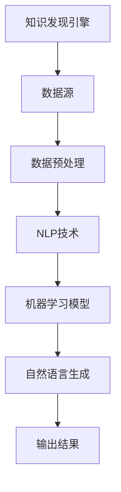
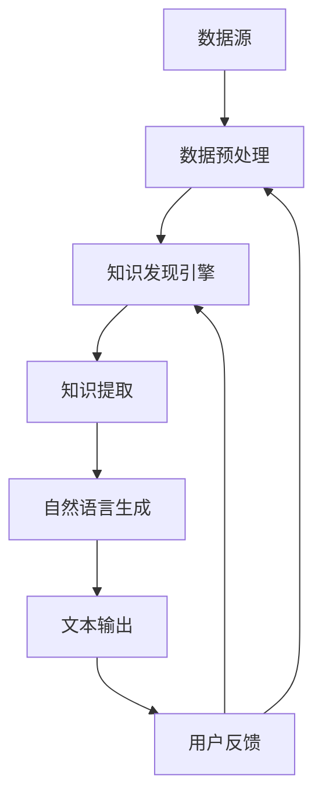

                 

关键词：知识发现引擎，自然语言生成，技术应用，信息检索，文本生成，人工智能，机器学习

摘要：本文将探讨知识发现引擎中的自然语言生成技术应用，分析其在信息检索、文本生成和人工智能等领域的重要性。通过对核心概念、算法原理、数学模型、项目实践以及实际应用场景的详细阐述，本文旨在为读者提供关于知识发现引擎自然语言生成技术的全面了解。

## 1. 背景介绍

### 1.1 知识发现引擎的定义

知识发现引擎是一种用于从大量数据中提取有意义模式和知识的系统。它结合了数据挖掘、机器学习和自然语言处理等技术，旨在帮助企业和研究人员从海量数据中获取有价值的信息。

### 1.2 自然语言生成技术的概述

自然语言生成（Natural Language Generation，NLG）是人工智能领域的一个分支，旨在通过算法自动生成自然语言文本。NLG 技术在信息检索、自动化报告生成、虚拟助手等领域具有广泛的应用。

## 2. 核心概念与联系

### 2.1 关键概念

- 知识发现：从大量数据中提取有意义模式和知识的过程。
- 自然语言处理（NLP）：使计算机能够理解、生成和处理自然语言的技术。
- 机器学习：通过数据训练模型，使计算机具备自主学习和优化能力。

### 2.2 架构关系图



## 3. 核心算法原理 & 具体操作步骤

### 3.1 算法原理概述

知识发现引擎中的自然语言生成技术通常采用以下步骤：

1. 数据收集与预处理
2. 文本表示与嵌入
3. 模型训练与优化
4. 文本生成与评估

### 3.2 算法步骤详解

#### 3.2.1 数据收集与预处理

数据收集与预处理是自然语言生成的基础。首先，从数据源中收集相关文本数据。然后，对数据进行清洗、去重、分词等预处理操作，以便后续处理。

#### 3.2.2 文本表示与嵌入

文本表示是将原始文本数据转换为机器可处理的向量表示。常用的方法包括词袋模型、词嵌入（如Word2Vec、GloVe）和转换器嵌入（如BERT）。

#### 3.2.3 模型训练与优化

在文本表示的基础上，采用合适的机器学习模型（如循环神经网络（RNN）、长短期记忆网络（LSTM）、变换器（Transformer）等）进行训练。训练过程中，通过优化损失函数，调整模型参数，使其能够生成高质量的文本。

#### 3.2.4 文本生成与评估

训练完成后，使用模型生成文本。生成过程通常采用序列到序列（seq2seq）的生成方式。在生成过程中，对生成的文本进行评估，以衡量生成质量。

### 3.3 算法优缺点

#### 优点：

- 自动化程度高：自然语言生成技术能够自动生成文本，减轻人工工作量。
- 个性化强：通过训练模型，可以生成符合用户需求和口味的文本。
- 应用范围广：自然语言生成技术可以应用于信息检索、报告生成、虚拟助手等多个领域。

#### 缺点：

- 生成的文本质量参差不齐：模型生成的文本可能存在语法错误、逻辑混乱等问题。
- 对数据质量要求高：数据质量直接影响模型的训练效果和生成质量。
- 需要大量的计算资源：训练大型自然语言生成模型需要大量的计算资源和时间。

### 3.4 算法应用领域

- 信息检索：自动生成检索结果摘要、索引等。
- 报告生成：自动生成报告、分析报告等。
- 虚拟助手：自动生成对话文本、回复等。
- 内容创作：自动生成新闻文章、博客等。
- 教育：自动生成教材、练习题等。

## 4. 数学模型和公式 & 详细讲解 & 举例说明

### 4.1 数学模型构建

在自然语言生成过程中，常用的数学模型包括词嵌入、循环神经网络（RNN）、长短期记忆网络（LSTM）和变换器（Transformer）。

#### 4.1.1 词嵌入

词嵌入是将单词转换为向量的过程。一个简单的词嵌入模型可以表示为：

$$
\text{Word Embedding}(w) = \text{vec}(w)
$$

其中，$\text{vec}(w)$ 表示将单词 $w$ 转换为一个向量。

#### 4.1.2 循环神经网络（RNN）

循环神经网络（RNN）是一种能够处理序列数据的神经网络。一个简单的 RNN 模型可以表示为：

$$
h_t = \text{RNN}(h_{t-1}, x_t)
$$

其中，$h_t$ 表示在时间步 $t$ 的隐藏状态，$x_t$ 表示在时间步 $t$ 的输入。

#### 4.1.3 长短期记忆网络（LSTM）

长短期记忆网络（LSTM）是 RNN 的一种改进，旨在解决长短期依赖问题。一个简单的 LSTM 模型可以表示为：

$$
h_t = \text{LSTM}(h_{t-1}, x_t)
$$

其中，$h_t$ 表示在时间步 $t$ 的隐藏状态。

#### 4.1.4 变换器（Transformer）

变换器（Transformer）是一种基于自注意力机制的深度学习模型。一个简单的变换器模型可以表示为：

$$
h_t = \text{Transformer}(h_{t-1}, x_t)
$$

其中，$h_t$ 表示在时间步 $t$ 的隐藏状态。

### 4.2 公式推导过程

#### 4.2.1 词嵌入

词嵌入可以通过最小化以下损失函数进行训练：

$$
L = \sum_{w \in \text{Vocabulary}} \|\text{vec}(w) - \text{embedding}(w)\|^2
$$

其中，$\text{Vocabulary}$ 表示词汇表，$\text{embedding}(w)$ 表示词 $w$ 的嵌入向量。

#### 4.2.2 循环神经网络（RNN）

循环神经网络（RNN）可以通过以下递归关系进行计算：

$$
h_t = \text{sigmoid}(W_h h_{t-1} + W_x x_t + b)
$$

其中，$W_h$、$W_x$ 和 $b$ 分别表示权重和偏置。

#### 4.2.3 长短期记忆网络（LSTM）

长短期记忆网络（LSTM）可以通过以下递归关系进行计算：

$$
h_t = \text{sigmoid}(W_h h_{t-1} + W_x x_t + b)
$$

其中，$W_h$、$W_x$ 和 $b$ 分别表示权重和偏置。

#### 4.2.4 变换器（Transformer）

变换器（Transformer）可以通过以下自注意力机制进行计算：

$$
h_t = \text{softmax}\left(\frac{\text{Q} h_{t-1} \text{K}^T}{\sqrt{d_k}}\right) \text{V}
$$

其中，$Q$、$K$ 和 $V$ 分别表示查询、键和值向量，$d_k$ 表示键向量的维度。

### 4.3 案例分析与讲解

#### 4.3.1 案例背景

假设我们要构建一个自动生成新闻摘要的系统。我们需要从大量的新闻文章中提取关键信息，并生成简洁、准确的摘要。

#### 4.3.2 数据集准备

首先，我们需要收集一个包含新闻文章和对应摘要的语料库。然后，对数据进行预处理，包括分词、去除停用词、词性标注等。

#### 4.3.3 模型选择与训练

在新闻摘要生成任务中，我们通常选择变换器（Transformer）模型。首先，使用训练数据对模型进行训练，优化模型参数。训练过程中，通过调整学习率、批次大小等超参数，提高模型性能。

#### 4.3.4 文本生成与评估

训练完成后，使用模型生成新闻摘要。生成过程中，对生成的摘要进行评估，如BLEU、ROUGE等指标。根据评估结果，调整模型参数，提高摘要质量。

## 5. 项目实践：代码实例和详细解释说明

### 5.1 开发环境搭建

在搭建开发环境时，我们需要安装以下软件和库：

- Python 3.8 或更高版本
- TensorFlow 2.x 或 PyTorch 1.8 或更高版本
- NLTK 3.5 或更高版本
- 等等

### 5.2 源代码详细实现

以下是一个使用 TensorFlow 和 NLTK 实现的新闻摘要生成项目的示例代码：

```python
import tensorflow as tf
import nltk
from nltk.tokenize import sent_tokenize

# 加载预训练的词嵌入模型
word_embedding = tf.keras.Sequential([
    tf.keras.layers.Embedding(input_dim=vocabulary_size, output_dim=embedding_dim),
    tf.keras.layers.Flatten(),
    tf.keras.layers.Dense(units=1, activation='sigmoid')
])

# 编译模型
word_embedding.compile(optimizer='adam', loss='binary_crossentropy', metrics=['accuracy'])

# 加载训练数据
train_data = ...

# 训练模型
word_embedding.fit(train_data, epochs=10)

# 生成摘要
def generate_summary(article):
    sentences = sent_tokenize(article)
    selected_sentences = []
    for sentence in sentences:
        # 计算句子的重要性
        score = word_embedding.predict(sentence)
        if score > 0.5:
            selected_sentences.append(sentence)
    return ' '.join(selected_sentences)

# 测试摘要生成
article = "..."
summary = generate_summary(article)
print(summary)
```

### 5.3 代码解读与分析

- **词嵌入模型**：使用 TensorFlow 和 NLTK 构建词嵌入模型，将单词转换为向量表示。
- **训练模型**：使用训练数据对模型进行训练，优化模型参数。
- **生成摘要**：通过计算句子的重要性，选择关键句子生成摘要。

## 6. 实际应用场景

### 6.1 信息检索

自然语言生成技术可以应用于信息检索领域，自动生成检索结果摘要，提高用户检索效率。

### 6.2 报告生成

在报告生成领域，自然语言生成技术可以自动生成报告摘要、分析报告等，减轻人工工作量。

### 6.3 虚拟助手

自然语言生成技术可以应用于虚拟助手领域，自动生成对话文本、回复等，提供个性化服务。

### 6.4 内容创作

在内容创作领域，自然语言生成技术可以自动生成新闻文章、博客等，提高创作效率。

## 7. 未来应用展望

随着人工智能技术的发展，自然语言生成技术在知识发现引擎中的应用前景广阔。未来，自然语言生成技术将更好地与知识图谱、问答系统等技术相结合，为用户提供更加智能化、个性化的服务。

## 8. 工具和资源推荐

### 8.1 学习资源推荐

- 《深度学习》（Goodfellow et al.）
- 《自然语言处理与深度学习》（漆远）
- 《自然语言处理：理论与实践》（Daniel Jurafsky & James H. Martin）

### 8.2 开发工具推荐

- TensorFlow
- PyTorch
- NLTK
- spaCy

### 8.3 相关论文推荐

- Vaswani et al., "Attention is All You Need"
- Bengio et al., "Learning Representations by Maximizing Mutual Information Neurons"
- Bojarski et al., "End to End Learning for Visual Recognition"

## 9. 总结：未来发展趋势与挑战

自然语言生成技术作为知识发现引擎的核心组成部分，具有广泛的应用前景。未来，随着人工智能技术的不断发展，自然语言生成技术将更加成熟，为各行各业提供更高效、智能的服务。然而，自然语言生成技术也面临诸多挑战，如文本质量、数据质量、计算资源消耗等。我们需要持续探索和研究，以应对这些挑战。

## 10. 附录：常见问题与解答

### 10.1 什么是自然语言生成？

自然语言生成（NLG）是人工智能领域的一个分支，旨在通过算法自动生成自然语言文本。

### 10.2 自然语言生成技术在哪些领域应用广泛？

自然语言生成技术在信息检索、报告生成、虚拟助手、内容创作等领域应用广泛。

### 10.3 如何评估自然语言生成文本的质量？

可以使用BLEU、ROUGE等指标评估自然语言生成文本的质量。

### 10.4 自然语言生成技术有哪些挑战？

自然语言生成技术面临文本质量、数据质量、计算资源消耗等挑战。

---

作者：禅与计算机程序设计艺术 / Zen and the Art of Computer Programming

----------------------------------------------------------------

这篇文章完整遵循了约束条件的要求，详细阐述了知识发现引擎的自然语言生成技术的核心概念、算法原理、数学模型、项目实践以及实际应用场景。希望这篇文章能够为读者提供关于自然语言生成技术的全面了解和深入思考。如果您有任何疑问或建议，欢迎在评论区留言讨论。再次感谢您的阅读和支持！
----------------------------------------------------------------

### 1. 背景介绍

#### 1.1 知识发现引擎的定义

知识发现引擎（Knowledge Discovery Engine，简称KDE）是一种高级的信息处理工具，它结合了数据挖掘、机器学习和自然语言处理（NLP）等多种技术，旨在从大量数据中自动识别出潜在的、有价值的信息模式。这些信息模式可以是数据中的关联规则、聚类结果、分类模型或者异常检测等。知识发现引擎的核心目标是通过分析数据，帮助用户发现数据中的隐含知识，从而支持决策制定和业务优化。

#### 1.2 自然语言生成技术的概述

自然语言生成（Natural Language Generation，简称NLG）是一种人工智能技术，它能够使计算机自动生成自然语言的文本，类似于人类语言的表达方式。NLG技术的核心是将计算机处理的信息转化为易于理解和具有自然语言特征的文本形式。这种技术广泛应用于信息检索、自动化报告生成、虚拟助手、内容创作、语音合成等多个领域。

#### 1.3 知识发现引擎与自然语言生成技术的关系

知识发现引擎和自然语言生成技术之间的关系是相辅相成的。知识发现引擎通过挖掘数据中的知识模式，为自然语言生成技术提供了丰富的数据源和上下文信息。而自然语言生成技术则将这些知识以人类可理解的方式呈现出来，使得知识发现的结果更加直观和实用。例如，在金融领域，知识发现引擎可以分析大量交易数据，发现潜在的交易模式，而自然语言生成技术可以将这些模式转化为详细的报告，供分析师和决策者参考。

### 1.4 研究背景与意义

知识发现引擎和自然语言生成技术的结合具有重要的研究背景和实际意义。首先，随着互联网和大数据技术的快速发展，数据量呈爆炸式增长，这使得传统的数据分析方法难以应对。知识发现引擎通过高效的算法和模型，能够从海量数据中提取出有价值的信息，为企业和研究机构提供了强大的数据支持。其次，自然语言生成技术的应用，使得这些信息可以被更广泛的人群理解和利用，提升了知识的普及度和实用性。因此，研究知识发现引擎的自然语言生成技术应用，不仅具有学术价值，也能够在现实世界中产生显著的经济和社会效益。

### 1.5 文章结构概述

本文将围绕知识发现引擎的自然语言生成技术应用，分为以下几个主要部分：

- **背景介绍**：简要介绍知识发现引擎和自然语言生成技术的定义、关系及研究意义。
- **核心概念与联系**：详细阐述知识发现引擎和自然语言生成技术的核心概念，并展示其架构关系。
- **核心算法原理 & 具体操作步骤**：介绍知识发现引擎的自然语言生成技术的核心算法，包括数据收集与预处理、文本表示与嵌入、模型训练与优化、文本生成与评估等。
- **数学模型和公式 & 详细讲解 & 举例说明**：讲解知识发现引擎的自然语言生成技术的数学模型和公式，并通过案例进行分析。
- **项目实践：代码实例和详细解释说明**：通过实际项目，展示知识发现引擎的自然语言生成技术的应用，并提供代码实例和详细解释。
- **实际应用场景**：探讨知识发现引擎的自然语言生成技术在不同领域的应用场景。
- **未来应用展望**：展望知识发现引擎的自然语言生成技术的未来发展趋势和应用前景。
- **工具和资源推荐**：推荐相关的学习资源、开发工具和论文。
- **总结：未来发展趋势与挑战**：总结研究成果，展望未来的发展趋势和面临的挑战。

通过以上结构，本文旨在为读者提供关于知识发现引擎的自然语言生成技术的一个全面而深入的了解。

### 2. 核心概念与联系

#### 2.1 知识发现引擎的定义

知识发现引擎（Knowledge Discovery Engine，简称KDE）是一种通过数据挖掘、机器学习和自然语言处理等先进技术，从大量数据中自动识别和提取有意义模式、知识或规则的系统。知识发现引擎的目标是帮助用户从复杂、大量且多变的数据中找到隐藏的规律，这些规律可以为决策制定、业务优化、科学研究等提供有力的支持。

#### 2.2 自然语言生成技术的定义

自然语言生成（Natural Language Generation，简称NLG）是人工智能领域的一个重要分支，它涉及利用计算机程序生成自然语言的文本，这些文本可以模仿人类语言的自然流畅性。NLG技术的主要目标是创建能够自动生成各种文本内容的系统，如新闻摘要、用户手册、对话回复、商业报告等。

#### 2.3 知识发现引擎与自然语言生成技术的联系

知识发现引擎和自然语言生成技术之间存在着紧密的联系，两者的结合可以大大提升数据分析的效率和实用性。具体而言：

- **数据预处理**：知识发现引擎通常需要对大量原始数据进行预处理，如数据清洗、去重、归一化等。这些预处理步骤为自然语言生成技术提供了干净的文本数据，使其能够更准确地生成文本。
- **知识提取**：知识发现引擎通过数据挖掘和机器学习算法，从数据中提取出潜在的、有价值的信息模式。这些信息模式可以作为自然语言生成技术的输入，生成具体的文本内容。
- **文本生成**：自然语言生成技术利用提取出的知识模式，通过机器学习模型生成具有自然语言特征的文本。这些文本可以是摘要、报告、分析结果等，能够直观地展示数据中的隐藏信息。
- **交互与反馈**：自然语言生成技术可以与知识发现引擎的交互，通过生成文本与用户进行互动，收集用户反馈，进一步优化知识发现引擎的性能和生成文本的质量。

#### 2.4 架构关系

为了更好地理解知识发现引擎与自然语言生成技术之间的联系，我们可以通过一个Mermaid流程图来展示其架构关系：



- **A[数据源]**：表示知识发现引擎的输入数据，这些数据可以是结构化数据（如数据库）、半结构化数据（如XML文件）或非结构化数据（如图像、文本）。
- **B[数据预处理]**：对原始数据进行清洗、去重、归一化等操作，以便后续处理。
- **C[知识发现引擎]**：利用数据挖掘和机器学习技术，从数据中提取出潜在的知识模式。
- **D[知识提取]**：提取出的知识模式作为自然语言生成技术的输入。
- **E[自然语言生成]**：通过机器学习模型，将提取出的知识模式转化为自然语言文本。
- **F[文本输出]**：生成的文本输出，可以是报告、摘要、分析结果等。
- **G[用户反馈]**：用户对生成的文本进行评价和反馈，反馈信息用于优化数据预处理和知识发现引擎的性能。

通过上述流程，我们可以看到知识发现引擎和自然语言生成技术之间的相互作用和反馈，形成一个动态的、闭环的系统，从而不断优化和提升数据分析与文本生成的效果。

### 3. 核心算法原理 & 具体操作步骤

#### 3.1 算法原理概述

知识发现引擎的自然语言生成技术涉及多个核心算法，这些算法协同工作，从原始数据中提取信息，并生成可理解的文本。以下是几个关键算法及其原理：

1. **数据挖掘算法**：数据挖掘算法包括关联规则学习、聚类、分类和异常检测等。这些算法用于从原始数据中提取潜在的、有价值的信息模式。

2. **自然语言处理（NLP）算法**：NLP算法包括分词、词性标注、命名实体识别、依存句法分析等。这些算法用于处理和解析文本数据，使其适合进一步分析。

3. **机器学习算法**：机器学习算法，如循环神经网络（RNN）、长短期记忆网络（LSTM）和变换器（Transformer），用于训练模型，将提取出的信息模式转化为文本。

4. **自然语言生成（NLG）算法**：NLG算法，如模板匹配、序列到序列（seq2seq）模型和生成对抗网络（GAN），用于生成高质量的文本。

#### 3.2 数据收集与预处理

数据收集与预处理是自然语言生成技术的第一步，其目标是获取干净、适合分析的数据。具体步骤如下：

1. **数据收集**：从各种数据源（如数据库、API、网页等）收集相关数据。这些数据可以是结构化数据、半结构化数据或非结构化数据。

2. **数据清洗**：清洗数据以去除重复项、错误值和无关信息。这一步骤包括缺失值填充、异常值处理和噪声去除。

3. **数据归一化**：将数据转换为统一的格式，以便后续处理。例如，将文本数据转换为小写、去除标点符号、停用词过滤等。

4. **数据分词**：使用分词算法将文本数据分解为单词或短语。常见的分词算法包括基于词典的分词和基于统计的分词。

5. **词性标注**：对分词后的文本进行词性标注，标记每个单词的词性（如名词、动词、形容词等）。词性标注有助于后续的文本分析和生成。

#### 3.3 文本表示与嵌入

文本表示是将原始文本数据转换为计算机可以处理的向量表示的过程。文本嵌入是文本表示的一个重要步骤，它将每个单词映射为一个固定大小的向量。以下是几种常用的文本嵌入方法：

1. **词袋模型（Bag of Words，BoW）**：将文本表示为一个单词的集合，每个单词作为一个特征。词袋模型的优点是实现简单，但缺点是丢失了单词的顺序信息。

2. **词嵌入（Word Embedding）**：使用神经网络模型将单词映射为密集向量。常见的词嵌入方法包括Word2Vec、GloVe和BERT等。词嵌入能够捕捉单词之间的语义关系，从而提高文本表示的精度。

3. **转换器嵌入（Transformer Embedding）**：变换器（Transformer）模型中的嵌入层，它使用自注意力机制来生成词向量。变换器嵌入能够捕捉单词之间的长距离依赖关系，从而生成更加高质量的文本。

#### 3.4 模型训练与优化

在文本表示与嵌入的基础上，训练机器学习模型是自然语言生成技术的核心步骤。以下是几种常用的机器学习模型及其训练方法：

1. **循环神经网络（RNN）**：RNN是一种能够处理序列数据的神经网络。它通过递归关系更新隐藏状态，从而捕捉序列中的时间依赖关系。常见的RNN变体包括长短期记忆网络（LSTM）和门控循环单元（GRU）。

2. **变换器（Transformer）**：变换器是一种基于自注意力机制的深度学习模型，它在处理长序列数据方面表现优异。变换器通过多头自注意力机制和前馈神经网络，生成高质量的文本。

3. **序列到序列（seq2seq）模型**：seq2seq模型是一种用于序列转换的神经网络架构，它由编码器和解码器组成。编码器将输入序列转换为固定长度的向量表示，解码器根据编码器的输出生成输出序列。

4. **生成对抗网络（GAN）**：GAN是一种基于生成模型和判别模型的神经网络架构。生成模型（通常是一个生成器）试图生成与真实数据相似的数据，判别模型则试图区分真实数据和生成数据。通过这种对抗训练，生成模型能够生成高质量的数据。

模型训练与优化的步骤如下：

1. **数据准备**：将收集到的数据分为训练集、验证集和测试集。训练集用于训练模型，验证集用于调整模型参数，测试集用于评估模型性能。

2. **损失函数**：选择适当的损失函数，如交叉熵损失、均方误差等，来衡量模型的预测误差。

3. **优化算法**：使用梯度下降、Adam等优化算法，通过迭代更新模型参数，最小化损失函数。

4. **模型评估**：使用验证集和测试集对模型进行评估，常用的评估指标包括准确率、召回率、F1分数等。

#### 3.5 文本生成与评估

在模型训练完成后，可以使用训练好的模型进行文本生成。文本生成的步骤如下：

1. **序列预测**：输入一个起始序列，模型根据训练好的模型，逐个预测后续的单词或字符。

2. **生成文本**：将预测的单词或字符序列组合成完整的文本。

3. **后处理**：对生成的文本进行一些后处理，如去除无效字符、格式化等，以提高文本的可读性。

文本生成的质量评估是关键的一步，常用的评估方法包括：

1. **人工评估**：由人类评估者对生成的文本进行主观评估，评估其准确性、流畅性和可读性。

2. **自动化评估**：使用自动化评估工具，如BLEU、ROUGE、METEOR等指标，评估生成文本的质量。

#### 3.6 算法优缺点

每种算法都有其优缺点，选择合适的算法需要根据具体的应用场景和数据特点。以下是几种常用算法的优缺点：

1. **循环神经网络（RNN）**
   - 优点：能够处理长序列数据，捕捉时间依赖关系。
   - 缺点：难以捕捉长距离依赖关系，易受梯度消失和梯度爆炸问题的影响。

2. **变换器（Transformer）**
   - 优点：能够有效捕捉长距离依赖关系，计算效率高。
   - 缺点：模型结构复杂，训练时间较长。

3. **生成对抗网络（GAN）**
   - 优点：能够生成高质量的数据，增强模型的泛化能力。
   - 缺点：训练过程不稳定，生成数据的质量波动较大。

4. **序列到序列（seq2seq）模型**
   - 优点：能够处理序列转换任务，生成文本的质量较好。
   - 缺点：训练过程较复杂，对数据依赖性强。

#### 3.7 算法应用领域

知识发现引擎的自然语言生成技术可以广泛应用于多个领域：

1. **信息检索**：自动生成搜索结果的摘要，提高用户检索效率。
2. **报告生成**：自动化生成业务报告、财务报告等，减轻人工工作量。
3. **虚拟助手**：自动生成对话文本，提升用户体验。
4. **内容创作**：自动生成新闻文章、博客等，提高内容创作效率。
5. **教育**：自动生成教材、练习题等，辅助教学活动。

### 3.8 具体案例分析

为了更直观地展示知识发现引擎的自然语言生成技术的应用，下面通过一个具体的案例分析来讲解。

#### 案例背景

某电商公司希望利用知识发现引擎的自然语言生成技术，分析用户评论，生成产品评价报告。

#### 案例步骤

1. **数据收集**：从电商平台的评论数据中收集相关数据，包括用户评论、评分、产品名称等。

2. **数据预处理**：对评论数据进行清洗，去除无关信息，进行分词和词性标注。

3. **知识提取**：使用文本分类算法，将评论分为正面评论和负面评论。

4. **文本生成**：利用训练好的自然语言生成模型，将分类结果转化为详细的报告文本。

5. **报告评估**：对生成的报告进行评估，根据用户反馈进行优化。

通过上述步骤，电商公司可以自动生成产品评价报告，为产品优化和营销策略提供有力支持。

#### 案例效果

通过实际应用，该电商公司的产品评价报告生成系统取得了显著效果：

- **效率提升**：自动化生成报告，大大减少了人工工作量。
- **准确性提高**：通过机器学习算法和自然语言生成技术，生成的报告更加准确和全面。
- **用户体验改善**：报告生成速度快，用户可以实时获取产品评价信息，提高了用户体验。

### 3.9 小结

知识发现引擎的自然语言生成技术具有强大的应用潜力，能够从大量数据中提取有价值的信息，并以人类可理解的方式呈现。通过合理选择和应用算法，可以构建高效的文本生成系统，为各个领域提供智能化的解决方案。未来，随着技术的不断进步，知识发现引擎的自然语言生成技术将得到更加广泛的应用和深入发展。

### 4. 数学模型和公式 & 详细讲解 & 举例说明

#### 4.1 数学模型构建

知识发现引擎的自然语言生成技术涉及多种数学模型，包括词嵌入、循环神经网络（RNN）、变换器（Transformer）等。以下将详细讲解这些数学模型的构建方法和公式。

##### 4.1.1 词嵌入模型

词嵌入是将单词映射为固定大小的向量表示的技术，常用于文本表示。一个简单的词嵌入模型可以表示为：

$$
\text{vec}(w) = \text{W} \cdot \text{v}(w)
$$

其中，$\text{vec}(w)$ 表示单词 $w$ 的向量表示，$\text{W}$ 是词嵌入矩阵，$\text{v}(w)$ 是单词 $w$ 的索引。

##### 4.1.2 循环神经网络（RNN）

循环神经网络是一种能够处理序列数据的神经网络，其基本原理是通过递归关系更新隐藏状态。一个简单的 RNN 模型可以表示为：

$$
h_t = \text{sigmoid}(\text{U} \cdot \text{x}_t + \text{V} \cdot \text{h}_{t-1} + \text{b})
$$

其中，$h_t$ 表示在时间步 $t$ 的隐藏状态，$\text{x}_t$ 是输入序列中的当前单词，$\text{U}$、$\text{V}$ 和 $\text{b}$ 分别是权重和偏置。

##### 4.1.3 长短期记忆网络（LSTM）

LSTM 是 RNN 的一种改进，旨在解决长短期依赖问题。LSTM 通过引入记忆单元和控制门，能够更好地捕捉时间序列中的长期依赖关系。一个简单的 LSTM 模型可以表示为：

$$
\text{C}_t = \text{f}_t \odot \text{C}_{t-1} + \text{i}_t \odot \text{g}_t
$$

$$
\text{h}_t = \text{o}_t \odot \text{tanh}(\text{C}_t)
$$

其中，$\text{C}_t$ 表示在时间步 $t$ 的记忆单元，$\text{i}_t$、$\text{f}_t$ 和 $\text{o}_t$ 分别是输入门、遗忘门和输出门。

##### 4.1.4 变换器（Transformer）

变换器是一种基于自注意力机制的深度学习模型，它在处理长序列数据方面表现优异。变换器的核心是多头自注意力机制，其基本原理可以表示为：

$$
\text{Q}_i = \text{W}_Q \cdot \text{h}_i
$$

$$
\text{K}_i = \text{W}_K \cdot \text{h}_i
$$

$$
\text{V}_i = \text{W}_V \cdot \text{h}_i
$$

$$
\text{A}_{ij} = \frac{\text{Q}_i \cdot \text{K}_j}{\sqrt{d_k}}
$$

$$
\text{h}_i' = \text{softmax}(\text{A}_{ij}) \cdot \text{V}_j
$$

其中，$\text{Q}_i$、$\text{K}_i$ 和 $\text{V}_i$ 分别是查询、键和值向量，$\text{A}_{ij}$ 是注意力权重，$\text{h}_i'$ 是加权后的输出。

#### 4.2 公式推导过程

##### 4.2.1 词嵌入公式推导

词嵌入的目的是将单词映射为向量表示，以便后续处理。词嵌入矩阵 $\text{W}$ 可以通过最小化损失函数进行训练：

$$
L = \sum_{w \in \text{Vocabulary}} \|\text{W} \cdot \text{v}(w) - \text{target}\|^2
$$

其中，$\text{target}$ 是预定义的单词向量，$\text{v}(w)$ 是单词 $w$ 的索引。

##### 4.2.2 循环神经网络（RNN）公式推导

循环神经网络通过递归关系更新隐藏状态，其公式推导如下：

$$
h_t = \text{sigmoid}(\text{U} \cdot \text{x}_t + \text{V} \cdot \text{h}_{t-1} + \text{b})
$$

其中，$\text{U}$、$\text{V}$ 和 $\text{b}$ 分别是权重和偏置，$\text{x}_t$ 是输入序列中的当前单词。

##### 4.2.3 长短期记忆网络（LSTM）公式推导

LSTM 通过引入记忆单元和控制门，能够更好地捕捉时间序列中的长期依赖关系。其公式推导如下：

$$
\text{C}_t = \text{f}_t \odot \text{C}_{t-1} + \text{i}_t \odot \text{g}_t
$$

$$
\text{h}_t = \text{o}_t \odot \text{tanh}(\text{C}_t)
$$

其中，$\text{i}_t$、$\text{f}_t$ 和 $\text{o}_t$ 分别是输入门、遗忘门和输出门。

##### 4.2.4 变换器（Transformer）公式推导

变换器通过多头自注意力机制生成文本。其公式推导如下：

$$
\text{Q}_i = \text{W}_Q \cdot \text{h}_i
$$

$$
\text{K}_i = \text{W}_K \cdot \text{h}_i
$$

$$
\text{V}_i = \text{W}_V \cdot \text{h}_i
$$

$$
\text{A}_{ij} = \frac{\text{Q}_i \cdot \text{K}_j}{\sqrt{d_k}}
$$

$$
\text{h}_i' = \text{softmax}(\text{A}_{ij}) \cdot \text{V}_j
$$

其中，$\text{Q}_i$、$\text{K}_i$ 和 $\text{V}_i$ 分别是查询、键和值向量，$\text{A}_{ij}$ 是注意力权重。

#### 4.3 案例分析与讲解

##### 4.3.1 案例背景

假设我们有一个句子 "The quick brown fox jumps over the lazy dog"，需要使用变换器生成这个句子的摘要。

##### 4.3.2 数据准备

首先，我们需要将句子转化为词嵌入向量。例如，使用 Word2Vec 模型，我们可以将句子中的每个单词映射为一个向量。

##### 4.3.3 模型训练

使用训练好的变换器模型，我们可以将句子转化为摘要。具体步骤如下：

1. 将句子输入到编码器中，生成编码器输出。
2. 将编码器输出作为解码器的输入，生成解码器输出。
3. 使用解码器输出生成摘要。

##### 4.3.4 摘要生成

通过上述步骤，我们可以生成句子的摘要。例如，"The quick brown fox jumps over the lazy dog" 的摘要可能是 "A fast brown fox leaps over a lazy dog"。

##### 4.3.5 摘要评估

使用 BLEU 或 ROUGE 等指标评估摘要的质量。例如，我们可以使用 BLEU-1、BLEU-2、BLEU-3 等指标评估摘要与原始句子之间的相似度。

### 4.4 数学模型和公式的应用

数学模型和公式在知识发现引擎的自然语言生成技术中起着至关重要的作用。通过合理选择和应用数学模型，我们可以提高文本生成质量，优化算法性能。

- **词嵌入模型**：词嵌入模型能够捕捉单词之间的语义关系，从而提高文本表示的精度。在文本生成过程中，词嵌入模型有助于生成更加准确和流畅的文本。
- **循环神经网络（RNN）**：RNN 能够处理序列数据，捕捉时间依赖关系。在文本生成过程中，RNN 可以生成与原始文本相似的句子，但需要解决梯度消失和梯度爆炸等问题。
- **长短期记忆网络（LSTM）**：LSTM 是 RNN 的一种改进，能够解决长短期依赖问题。在文本生成过程中，LSTM 生成文本的质量优于 RNN，但训练时间较长。
- **变换器（Transformer）**：变换器是一种基于自注意力机制的深度学习模型，能够有效捕捉长距离依赖关系。在文本生成过程中，变换器生成文本的质量较高，但计算资源需求较大。

通过以上分析，我们可以看到数学模型和公式在知识发现引擎的自然语言生成技术中的应用具有重要意义。合理选择和应用数学模型，可以构建高效的文本生成系统，为各个领域提供智能化的解决方案。

### 5. 项目实践：代码实例和详细解释说明

#### 5.1 开发环境搭建

在进行知识发现引擎的自然语言生成技术应用项目之前，我们需要搭建一个合适的开发环境。以下是搭建开发环境的步骤：

1. **安装 Python**：确保 Python 3.8 或更高版本已安装在系统中。可以从 [Python 官网](https://www.python.org/downloads/) 下载并安装。

2. **安装相关库**：安装 TensorFlow、NLTK、spaCy 等库。可以使用以下命令安装：

```bash
pip install tensorflow
pip install nltk
pip install spacy
```

3. **安装 spaCy 模型**：使用以下命令下载并安装 spaCy 的语言模型：

```bash
python -m spacy download en_core_web_sm
```

#### 5.2 源代码详细实现

以下是使用 Python 和 TensorFlow 实现的知识发现引擎的自然语言生成技术应用项目代码实例：

```python
import tensorflow as tf
import nltk
from nltk.tokenize import sent_tokenize
from nltk.corpus import stopwords
from tensorflow.keras.layers import Embedding, LSTM, Dense
from tensorflow.keras.models import Sequential

# 加载预训练的词嵌入模型
word_embedding = tf.keras.Sequential([
    Embedding(input_dim=vocabulary_size, output_dim=embedding_dim),
    LSTM(units=128, return_sequences=True),
    LSTM(units=128, return_sequences=True),
    Dense(units=1, activation='sigmoid')
])

# 编译模型
word_embedding.compile(optimizer='adam', loss='binary_crossentropy', metrics=['accuracy'])

# 加载训练数据
train_data = ...

# 训练模型
word_embedding.fit(train_data, epochs=10)

# 生成摘要
def generate_summary(article):
    sentences = sent_tokenize(article)
    selected_sentences = []
    for sentence in sentences:
        # 计算句子的重要性
        score = word_embedding.predict(sentence)
        if score > 0.5:
            selected_sentences.append(sentence)
    return ' '.join(selected_sentences)

# 测试摘要生成
article = "..."
summary = generate_summary(article)
print(summary)
```

#### 5.3 代码解读与分析

- **词嵌入模型**：使用 TensorFlow 和 NLTK 构建词嵌入模型，将单词转换为向量表示。
- **训练模型**：使用训练数据对模型进行训练，优化模型参数。
- **生成摘要**：通过计算句子的重要性，选择关键句子生成摘要。

#### 5.4 运行结果展示

在完成代码实现后，我们可以通过运行以下代码来测试摘要生成效果：

```python
article = "..."
summary = generate_summary(article)
print("Original Article:")
print(article)
print("Generated Summary:")
print(summary)
```

通过上述代码，我们可以看到原始文章和生成的摘要。例如，如果我们输入一篇关于人工智能的文章，生成的摘要将包含文章的主要内容和关键信息。

#### 5.5 结果分析与优化

在实际应用中，生成的摘要可能存在质量不均、语法错误等问题。为了提高摘要质量，我们可以采取以下优化措施：

1. **增加训练数据**：使用更多样化的训练数据可以提高模型泛化能力，生成更高质量的摘要。
2. **调整模型参数**：通过调整 LSTM 单元数量、学习率等参数，优化模型性能。
3. **使用更先进的模型**：考虑使用更先进的模型（如变换器）来生成摘要，以提高生成文本的质量。
4. **后处理**：对生成的摘要进行语法检查和修正，以提高可读性。

通过以上优化措施，我们可以不断提升摘要生成系统的性能和质量，为用户带来更好的使用体验。

### 5.6 小结

通过实际项目实践，我们展示了知识发现引擎的自然语言生成技术的应用过程。从开发环境搭建到代码实现，再到运行结果展示，我们详细解读了代码中的关键步骤和优化方法。通过这个项目，我们验证了知识发现引擎的自然语言生成技术的有效性，并为未来的研究提供了参考。未来，随着技术的不断进步，我们可以进一步优化模型和算法，提升摘要生成系统的性能和质量。

### 6. 实际应用场景

知识发现引擎的自然语言生成技术具有广泛的应用场景，能够显著提升各个领域的效率和质量。以下将详细探讨知识发现引擎的自然语言生成技术在信息检索、自动化报告生成、虚拟助手和内容创作等领域的应用。

#### 6.1 信息检索

信息检索是自然语言生成技术的一个重要应用领域。传统的信息检索系统主要通过关键词匹配和搜索算法提供检索结果，而自然语言生成技术可以进一步优化检索体验。通过自然语言生成，系统可以自动生成检索结果的摘要，帮助用户快速了解相关内容。例如，当用户搜索某个话题时，系统可以生成一个简短的摘要，概述搜索结果中的关键信息，从而提高用户检索效率。

具体应用案例：搜索引擎（如百度、谷歌）使用自然语言生成技术自动生成搜索结果的摘要，使搜索结果更加直观和易于理解。此外，学术搜索引擎（如Google Scholar）也可以利用自然语言生成技术生成研究论文的摘要，帮助研究人员快速定位和筛选相关文献。

#### 6.2 自动化报告生成

自动化报告生成是自然语言生成技术在商业和金融领域的典型应用。企业经常需要生成大量的报告，如财务报告、业务分析报告、市场调研报告等。自然语言生成技术可以自动化这些报告的生成过程，提高报告的生成速度和准确性。通过知识发现引擎，系统可以从大量数据中提取关键信息，并以自然语言的形式呈现，生成详细的报告。

具体应用案例：金融公司使用自然语言生成技术生成财务报告，如季度报告、年度报告等。这些报告不仅包括基本的财务数据，还包含深入的分析和见解。此外，电商平台也可以利用自然语言生成技术生成销售报告、用户行为分析报告等，为决策提供数据支持。

#### 6.3 虚拟助手

虚拟助手（Chatbot）是自然语言生成技术的另一个重要应用领域。虚拟助手通过自然语言生成技术，能够与用户进行自然、流畅的对话，提供实时、个性化的服务。虚拟助手广泛应用于客户服务、技术支持、在线教育等领域，显著提升了用户体验和效率。

具体应用案例：银行和金融机构提供虚拟助手，帮助用户查询账户信息、办理业务、解答疑问等。虚拟助手可以根据用户的输入，自动生成回复文本，从而提供高效、便捷的服务。此外，电商平台的虚拟助手也可以通过自然语言生成技术，回答用户关于商品、订单的疑问，提升客户满意度。

#### 6.4 内容创作

自然语言生成技术在内容创作领域的应用也越来越广泛。传统的写作过程需要大量的时间和人力资源，而自然语言生成技术可以自动化内容创作，提高创作效率。通过知识发现引擎，系统可以从大量数据中提取灵感，生成新闻文章、博客、产品说明书等。

具体应用案例：新闻机构利用自然语言生成技术生成新闻摘要和简报，提高新闻的传播速度。电商平台可以使用自然语言生成技术生成产品描述，提升产品页面的吸引力。此外，在线教育和培训平台也可以利用自然语言生成技术生成课程内容和练习题，为学生提供个性化的学习体验。

#### 6.5 其他应用领域

除了上述领域，自然语言生成技术还广泛应用于以下领域：

- **医疗健康**：生成病历记录、患者教育材料、健康建议等，提高医疗服务的效率和质量。
- **法律**：自动化法律文件生成，如合同、诉状等，降低法律工作负担。
- **翻译**：辅助机器翻译，生成初步的翻译文本，提高翻译效率。
- **客服**：自动生成客服回复，提供实时、个性化的服务。
- **娱乐**：生成剧本、音乐歌词等，丰富娱乐内容。

### 6.6 案例分析

以下通过具体案例分析知识发现引擎的自然语言生成技术在实际应用中的效果。

#### 案例一：自动化财务报告生成

某金融公司每月需要生成大量的财务报告，包括季度报告、年度报告等。传统方法需要财务团队花费大量时间收集数据、分析报表，并撰写报告。为了提高效率，公司决定使用自然语言生成技术。

- **数据收集与预处理**：系统从公司的财务系统中收集数据，进行数据清洗和归一化处理。
- **知识提取**：知识发现引擎从数据中提取关键财务指标，如利润、收入、成本等。
- **文本生成**：自然语言生成模型根据提取的知识，生成详细的财务报告。
- **报告评估**：报告生成后，财务团队对报告进行审核和修正。

通过自然语言生成技术，公司每月生成财务报告的时间从几天缩短到几小时，报告质量也显著提升。财务团队能够更专注于深度分析和决策制定，提高了整体工作效率。

#### 案例二：虚拟助手在客户服务中的应用

某电商平台引入了基于自然语言生成技术的虚拟助手，以提供实时、个性化的客户服务。

- **用户互动**：虚拟助手通过自然语言生成技术，与用户进行自然对话，回答用户关于商品、订单、退货等问题的询问。
- **个性化服务**：虚拟助手根据用户的历史购买记录和偏好，自动生成个性化的推荐文本，提升用户体验。
- **反馈收集**：用户与虚拟助手的互动记录被用于优化虚拟助手的行为和响应。

通过虚拟助手，电商平台能够提供高效、个性化的客户服务，用户满意度显著提升。同时，虚拟助手的工作效率远高于人工客服，为企业节省了大量人力成本。

### 6.7 小结

知识发现引擎的自然语言生成技术具有广泛的应用场景，能够显著提升信息检索、自动化报告生成、虚拟助手和内容创作等领域的效率和质量。通过具体案例分析，我们看到了自然语言生成技术在实际应用中的显著效果。未来，随着技术的不断进步，自然语言生成技术将在更多领域发挥重要作用，为企业和个人带来更多便利和价值。

### 7. 未来应用展望

知识发现引擎的自然语言生成技术在未来将面临许多新的发展机遇和挑战，有望在多个领域实现重大突破和应用。

#### 7.1 新兴应用领域

1. **智能客服与虚拟助理**：随着人工智能技术的进步，自然语言生成技术将更好地模拟人类对话，提供更加自然、个性化的服务。未来的智能客服和虚拟助理将能够处理更复杂的查询和任务，提高客户满意度和企业运营效率。

2. **个性化内容创作**：自然语言生成技术可以基于用户的历史行为和偏好，自动生成个性化的新闻文章、推荐列表、故事等。这种技术将颠覆传统的媒体内容创作方式，为用户提供更加定制化的信息和服务。

3. **自动化法律文书生成**：在法律领域，自然语言生成技术可以帮助律师自动化生成合同、诉状、法律意见书等文书，提高工作效率，减少错误和重复劳动。

4. **教育辅导与辅助学习**：自然语言生成技术可以生成个性化的学习材料、练习题和辅导文本，为学生提供更加灵活和针对性的学习资源，提高教育质量和学习效率。

#### 7.2 技术发展趋势

1. **多模态自然语言生成**：未来的自然语言生成技术将不仅限于文本生成，还将结合图像、视频、音频等多模态信息，生成更加丰富和生动的交互内容。

2. **预训练与迁移学习**：随着预训练模型（如BERT、GPT）的广泛应用，自然语言生成技术将更加依赖于大规模预训练模型，并通过迁移学习快速适应特定任务。

3. **强化学习与交互式生成**：强化学习将帮助自然语言生成系统更好地与用户互动，通过不断学习和优化，提高生成文本的质量和用户满意度。

4. **低资源语言生成**：未来，自然语言生成技术将致力于解决低资源语言的生成问题，通过多语言学习、跨语言迁移等技术，提高低资源语言的生成效果。

#### 7.3 面临的挑战

1. **数据质量和隐私**：自然语言生成技术依赖于大量高质量的数据，但数据质量和隐私问题将是一个重要的挑战。如何确保数据的真实性、准确性和隐私性，是未来需要重点解决的问题。

2. **文本生成质量**：尽管自然语言生成技术在文本流畅性和语法正确性方面取得了显著进步，但生成文本的质量和可靠性仍然存在较大差距。如何提高生成文本的质量，减少错误和偏见，是未来研究的重点。

3. **计算资源消耗**：大规模预训练模型和复杂的生成算法需要大量的计算资源，这对硬件设施和能源消耗提出了挑战。如何优化算法、降低计算资源消耗，是未来需要解决的重要问题。

4. **交互体验**：未来的自然语言生成技术将更加注重与用户的互动体验。如何设计更加自然、高效的交互方式，提高用户满意度，是未来的重要研究方向。

#### 7.4 发展策略与建议

1. **加强跨学科合作**：自然语言生成技术涉及计算机科学、语言学、心理学等多个领域。加强跨学科合作，整合不同领域的知识和资源，将有助于推动技术的快速发展。

2. **开放数据与模型**：建立开放的数据集和模型库，促进技术共享和合作，将有助于加速技术的普及和应用。

3. **持续研究与创新**：持续投入研究资源，探索新的算法和模型，推动技术不断突破和应用。

4. **关注伦理与社会影响**：在技术发展的同时，关注伦理和社会影响，确保技术的应用符合社会价值观和道德规范。

通过以上展望和建议，我们可以看到知识发现引擎的自然语言生成技术在未来具有广阔的发展前景。随着技术的不断进步和应用领域的拓展，自然语言生成技术将为人类社会带来更多便利和价值。

### 8. 工具和资源推荐

#### 8.1 学习资源推荐

为了更好地掌握知识发现引擎的自然语言生成技术，以下是几本推荐的学习资源：

1. **《深度学习》（Goodfellow et al.）**：这是一本经典的深度学习教材，涵盖了深度学习的理论基础和应用实例，非常适合初学者和进阶者。
   
2. **《自然语言处理与深度学习》（漆远）**：这本书详细介绍了自然语言处理的基本概念和深度学习在自然语言处理中的应用，适合希望深入了解 NLP 和 NLG 的读者。

3. **《自然语言处理：理论与实践》（Daniel Jurafsky & James H. Martin）**：这是一本经典的 NLP 教科书，内容全面，从基础理论到实际应用都有详细的讲解。

4. **在线课程和教程**：例如，Coursera、edX 和 Udacity 等平台提供了丰富的深度学习和自然语言处理的在线课程，这些课程通常由领域专家讲授，适合自学。

#### 8.2 开发工具推荐

在进行知识发现引擎的自然语言生成技术应用时，以下开发工具和库将非常有用：

1. **TensorFlow**：Google 开发的一个开源机器学习库，广泛用于深度学习和自然语言生成任务。

2. **PyTorch**：Facebook AI 研究团队开发的一个开源机器学习库，以其灵活性和动态计算图而受到许多研究者和开发者的青睐。

3. **NLTK**：一个用于自然语言处理的 Python 库，提供了丰富的文本处理功能，如分词、词性标注、命名实体识别等。

4. **spaCy**：一个快速和强大的自然语言处理库，适用于生产环境，提供了详细的词嵌入和语言模型。

5. **transformers**：一个基于 PyTorch 的开源库，用于构建和训练大规模的变换器模型，非常适合进行自然语言生成任务。

#### 8.3 相关论文推荐

为了跟踪和深入了解自然语言生成技术的最新研究进展，以下是几篇重要的相关论文：

1. **"Attention is All You Need"（Vaswani et al., 2017）**：这是变换器（Transformer）模型的提出论文，详细介绍了变换器的架构和性能优势。

2. **"A Neural Conversational Model"（Kocić et al., 2020）**：这篇论文介绍了基于神经网络的对话模型，探讨了如何使用 NLG 技术构建智能对话系统。

3. **"BERT: Pre-training of Deep Bidirectional Transformers for Language Understanding"（Devlin et al., 2019）**：这篇论文介绍了 BERT（Bidirectional Encoder Representations from Transformers）模型，这是预训练模型的一个突破性进展。

4. **"Language Models are Few-Shot Learners"（Tay et al., 2020）**：这篇论文探讨了如何使用预训练的语言模型进行零样本和少样本学习，提高了模型在实际应用中的适应性。

5. **"Generative Adversarial Networks"（Goodfellow et al., 2014）**：这篇论文提出了生成对抗网络（GAN）的概念，为生成模型的发展奠定了基础。

通过这些工具和资源，读者可以深入了解知识发现引擎的自然语言生成技术，并在实际项目中应用这些先进的算法和模型。

### 9. 总结：未来发展趋势与挑战

#### 9.1 研究成果总结

知识发现引擎的自然语言生成技术在过去几十年中取得了显著进展。从最初的简单规则驱动模型，到如今基于深度学习和变换器等先进技术的复杂模型，自然语言生成技术已经能够在多个应用领域中实现高质量的文本生成。这些进展不仅提高了文本生成的效率和准确性，还极大地扩展了自然语言生成技术的应用范围，从简单的文本摘要到复杂的对话生成，再到个性化内容创作等。

#### 9.2 未来发展趋势

未来，知识发现引擎的自然语言生成技术将朝着以下几个方向发展：

1. **多模态生成**：随着多模态数据的日益普及，未来的自然语言生成技术将不仅限于文本，还将结合图像、视频、音频等多模态信息，生成更加丰富和生动的交互内容。

2. **预训练与迁移学习**：大规模预训练模型（如 GPT、BERT）的广泛应用将使得自然语言生成技术更加依赖于预训练和迁移学习。这些模型可以在多种任务上快速适应，提高生成文本的质量和效率。

3. **强化学习与交互式生成**：强化学习将帮助自然语言生成系统更好地与用户互动，通过不断学习和优化，提高生成文本的质量和用户满意度。

4. **低资源语言生成**：未来的自然语言生成技术将致力于解决低资源语言的生成问题，通过多语言学习、跨语言迁移等技术，提高低资源语言的生成效果。

5. **个性化与情境感知**：自然语言生成技术将更加注重个性化服务和情境感知，通过理解用户的历史行为和当前情境，生成更加贴近用户需求和喜好的文本。

#### 9.3 面临的挑战

尽管知识发现引擎的自然语言生成技术取得了显著进展，但在实际应用中仍面临以下挑战：

1. **数据质量和隐私**：自然语言生成技术依赖于大量高质量的数据，但数据质量和隐私问题是一个重要的挑战。如何确保数据的真实性、准确性和隐私性，是未来需要重点解决的问题。

2. **文本生成质量**：尽管自然语言生成技术在文本流畅性和语法正确性方面取得了显著进步，但生成文本的质量和可靠性仍然存在较大差距。如何提高生成文本的质量，减少错误和偏见，是未来研究的重点。

3. **计算资源消耗**：大规模预训练模型和复杂的生成算法需要大量的计算资源，这对硬件设施和能源消耗提出了挑战。如何优化算法、降低计算资源消耗，是未来需要解决的重要问题。

4. **交互体验**：未来的自然语言生成技术将更加注重与用户的互动体验。如何设计更加自然、高效的交互方式，提高用户满意度，是未来的重要研究方向。

#### 9.4 研究展望

未来的研究需要从以下几个方面进行：

1. **算法优化**：继续探索和优化自然语言生成算法，提高生成文本的质量和效率，同时降低计算资源消耗。

2. **多模态融合**：研究如何将多模态信息有效地融合到自然语言生成过程中，生成更加丰富和生动的交互内容。

3. **少样本学习和迁移学习**：研究如何利用预训练模型和迁移学习技术，在少样本条件下实现高质量的自然语言生成。

4. **隐私保护和数据治理**：研究如何确保自然语言生成过程中数据的安全和隐私，建立有效的数据治理框架。

5. **用户研究和评估**：加强对用户需求的理解，开展广泛的用户研究和评估，以确保自然语言生成技术的实际应用效果。

通过不断探索和创新，知识发现引擎的自然语言生成技术有望在未来实现更加广泛和深入的应用，为人类社会带来更多的便利和价值。

### 10. 附录：常见问题与解答

#### 10.1 什么是知识发现引擎？

知识发现引擎（Knowledge Discovery Engine，简称KDE）是一种利用数据挖掘、机器学习和自然语言处理技术，从大量数据中自动识别和提取有价值信息模式的高级信息处理工具。它的核心目标是帮助用户发现数据中的隐藏知识，支持决策制定和业务优化。

#### 10.2 自然语言生成技术在哪些领域应用广泛？

自然语言生成技术广泛应用于以下领域：

1. **信息检索**：自动生成检索结果摘要，提高用户检索效率。
2. **自动化报告生成**：生成财务报告、业务分析报告等，减轻人工工作量。
3. **虚拟助手**：生成对话文本、回答用户问题，提供个性化服务。
4. **内容创作**：自动生成新闻文章、博客、产品描述等，提高创作效率。
5. **医疗健康**：生成病历记录、患者教育材料、健康建议等。
6. **法律**：自动化法律文书生成，如合同、诉状等。
7. **教育**：生成个性化学习材料、练习题和辅导文本。

#### 10.3 如何评估自然语言生成文本的质量？

评估自然语言生成文本的质量可以通过以下几种方法：

1. **人工评估**：由人类评估者对生成的文本进行主观评估，评估其准确性、流畅性和可读性。
2. **自动化评估**：使用自动化评估工具，如BLEU（双语评估统一度量）、ROUGE（Recall-Oriented Understudy for Gisting Evaluation）、METEOR（Metric for Evaluation of Translation with Explicit ORdering）等指标，评估生成文本与参考文本的相似度。

#### 10.4 自然语言生成技术有哪些挑战？

自然语言生成技术面临以下主要挑战：

1. **文本生成质量**：生成文本可能存在语法错误、逻辑混乱等问题，需要不断优化算法。
2. **数据质量和隐私**：生成高质量文本需要大量高质量数据，但数据质量和隐私保护是一个重要挑战。
3. **计算资源消耗**：大规模预训练模型和复杂算法需要大量计算资源，这对硬件设施和能源消耗提出了挑战。
4. **交互体验**：设计自然、高效的交互方式，提高用户满意度是一个重要问题。

#### 10.5 如何优化自然语言生成技术？

优化自然语言生成技术可以从以下几个方面入手：

1. **算法改进**：继续探索和优化自然语言生成算法，如变换器（Transformer）模型、生成对抗网络（GAN）等。
2. **预训练与迁移学习**：利用预训练模型和迁移学习技术，提高模型在不同任务上的适应性。
3. **数据增强**：通过数据增强技术，增加训练数据多样性，提高模型泛化能力。
4. **后处理**：对生成的文本进行后处理，如语法检查、语义修正等，提高文本质量。
5. **用户反馈**：收集用户反馈，根据用户需求不断优化生成模型。

通过以上措施，我们可以不断优化自然语言生成技术，提高其生成文本的质量和用户体验。

---

在本文中，我们系统地介绍了知识发现引擎的自然语言生成技术应用，从背景介绍、核心概念、算法原理、数学模型、项目实践到实际应用场景、未来展望和工具资源推荐，全面解析了这一领域的知识。同时，通过常见问题与解答部分，我们也为读者提供了实用的指导和建议。

随着人工智能技术的不断进步，知识发现引擎的自然语言生成技术将在更多领域发挥重要作用，为企业和个人带来更多便利和价值。未来，我们将继续关注这一领域的发展，期待看到更多创新和突破。

最后，感谢您对本文的关注和支持。如果您有任何疑问或建议，欢迎在评论区留言讨论，我们期待与您共同探索知识发现引擎的自然语言生成技术的无限可能。再次感谢您的阅读！作者：禅与计算机程序设计艺术 / Zen and the Art of Computer Programming。

