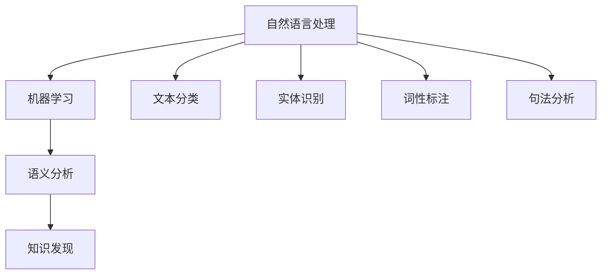

                 

关键词：知识发现，语义分析，人工智能，机器学习，自然语言处理，文本分析

> 摘要：本文将深入探讨知识发现引擎中的语义分析技术，探讨其核心概念、算法原理及其在实际应用中的重要性。通过对语义分析技术的详细解析，本文旨在为读者提供关于如何有效利用这一技术在各种领域实现智能化的见解和指导。

## 1. 背景介绍

随着信息技术的飞速发展，数据爆炸式增长，如何从海量数据中提取有价值的信息成为了一个亟待解决的问题。知识发现（Knowledge Discovery in Databases，简称KDD）应运而生，旨在从大量数据中识别出潜在的模式、关联、规则和知识。知识发现过程通常包括数据清洗、集成、选择、变换、模型建立和评估等步骤。然而，在这整个过程中，语义分析技术起到了至关重要的作用。

语义分析（Semantic Analysis），又称自然语言理解（Natural Language Understanding，简称NLU），是人工智能和机器学习领域中的一项关键技术，旨在让计算机理解和解释人类语言的意义。语义分析不仅涉及到语言的语法结构，还包括词汇的意义、上下文语境、情感倾向等多方面的内容。

在知识发现的过程中，语义分析技术的应用主要体现在以下几个方面：

1. **数据预处理**：通过对文本数据进行语义分析，可以自动提取关键词、主题和摘要，从而提高数据质量和可操作性。
2. **模式识别**：语义分析技术可以帮助识别出文本数据中的隐藏模式和关联，提高知识发现的准确性。
3. **决策支持**：语义分析可以用于自动化决策支持系统，通过理解用户需求，提供定制化的信息和建议。
4. **情感分析**：在社交媒体和客户反馈分析中，语义分析技术可以识别用户的情感倾向，帮助企业和组织做出更明智的决策。

## 2. 核心概念与联系

为了更好地理解语义分析技术在知识发现引擎中的应用，我们需要先了解一些核心概念及其相互关系。

### 2.1. 自然语言处理（NLP）

自然语言处理是计算机科学和人工智能领域中的一个分支，旨在让计算机能够理解、生成和响应人类语言。NLP包括多个子领域，如文本分类、实体识别、词性标注、句法分析等。

### 2.2. 机器学习（ML）

机器学习是人工智能的一个重要分支，通过使用大量数据来训练模型，使其能够自动识别模式和做出预测。在语义分析中，常用的机器学习算法包括神经网络、支持向量机（SVM）、决策树等。

### 2.3. 语义分析

语义分析是NLP的一个子领域，旨在理解和解释文本的语义内容。语义分析可以分为三个层次：

1. **词汇语义分析**：理解单词或短语的含义。
2. **句法语义分析**：理解句子的结构和语义关系。
3. **语义角色标注**：识别句子中各个成分的作用和关系。

### 2.4. 知识发现

知识发现是一个从大量数据中提取知识的过程，通常包括数据预处理、模式识别、模型建立和评估等步骤。

### 2.5. Mermaid 流程图

为了更好地展示这些核心概念之间的关系，我们可以使用Mermaid流程图来表示。



## 3. 核心算法原理 & 具体操作步骤

### 3.1. 算法原理概述

语义分析技术的核心在于对文本数据的深度理解。这通常涉及到以下几个步骤：

1. **文本预处理**：包括去除停用词、标点符号、词干提取等，以提高文本质量。
2. **词向量表示**：将文本转化为向量表示，以便进行后续的机器学习操作。常用的词向量模型包括Word2Vec、GloVe等。
3. **语义角色标注**：使用预训练的模型或基于规则的方法来识别句子中的主语、谓语、宾语等成分。
4. **关系抽取**：通过分析句子结构和语义角色，识别出句子中的关系，如因果关系、所属关系等。
5. **实体识别**：识别出句子中的实体，如人名、地名、组织名等。
6. **情感分析**：分析文本中的情感倾向，如积极、消极、中立等。

### 3.2. 算法步骤详解

1. **文本预处理**

   ```python
   import nltk
   from nltk.corpus import stopwords
   from nltk.tokenize import word_tokenize
   
   # 加载停用词
   stop_words = set(stopwords.words('english'))
   
   # 加载文本
   text = "This is a sample text for semantic analysis."
   
   # 分词
   words = word_tokenize(text)
   
   # 移除停用词
   filtered_words = [word for word in words if word.lower() not in stop_words]
   
   # 词干提取
   stemmed_words = [nltk.PorterStemmer().stem(word) for word in filtered_words]
   ```

2. **词向量表示**

   ```python
   from gensim.models import Word2Vec
   
   # 创建Word2Vec模型
   model = Word2Vec([stemmed_words], size=100, window=5, min_count=1, workers=4)
   
   # 获取词向量
   vector = model.wv['sample']
   ```

3. **语义角色标注**

   ```python
   import spacy
   
   # 加载预训练模型
   nlp = spacy.load("en_core_web_sm")
   
   # 分析句子
   doc = nlp("This is a sample sentence for semantic role labeling.")
   
   # 输出语义角色
   for token in doc:
       print(token.text, token.dep_, token.head.text, token.head.dep_)
   ```

4. **关系抽取**

   ```python
   def extract_relations(doc):
       relations = []
       for token in doc:
           if token.dep_ == "nsubj":
               subject = token.text
               for child in token.children:
                   if child.dep_ == "ROOT":
                       object = child.head.text
                       relations.append((subject, object))
       return relations
   
   relations = extract_relations(doc)
   print(relations)
   ```

5. **实体识别**

   ```python
   entities = [(ent.text, ent.label_) for ent in doc.ents]
   print(entities)
   ```

6. **情感分析**

   ```python
   from textblob import TextBlob
   
   # 创建TextBlob对象
   blob = TextBlob("This is a sample text for sentiment analysis.")
   
   # 输出情感极性
   print(blob.sentiment)
   ```

### 3.3. 算法优缺点

**优点**：

- **高效性**：语义分析技术能够快速地从大量文本数据中提取有价值的信息。
- **自动化**：通过机器学习和深度学习技术，可以实现自动化的语义分析。
- **灵活性**：语义分析技术可以适应不同的应用场景，如文本分类、关系抽取、情感分析等。

**缺点**：

- **精度问题**：语义分析技术仍存在一定程度的误差，尤其是在处理复杂语义关系时。
- **计算资源消耗**：语义分析技术通常需要大量的计算资源，尤其是大规模数据集。
- **数据依赖**：语义分析技术的性能高度依赖于训练数据的质量和规模。

### 3.4. 算法应用领域

语义分析技术在各个领域都有广泛的应用，以下是几个典型的应用场景：

- **社交媒体分析**：通过情感分析和关系抽取，可以了解用户对产品或服务的反馈，为企业提供决策支持。
- **客户服务**：语义分析可以用于自动回答客户问题，提高客户满意度。
- **金融领域**：通过文本分析和模式识别，可以监控金融市场，预测股票走势。
- **医学领域**：语义分析可以帮助医生从大量文献中快速提取有价值的信息，提高诊断和治疗水平。

## 4. 数学模型和公式 & 详细讲解 & 举例说明

### 4.1. 数学模型构建

在语义分析中，常用的数学模型包括词向量模型、序列标注模型和分类模型等。以下分别介绍这些模型的基本原理和公式。

#### 4.1.1. 词向量模型

词向量模型是一种将文本数据转化为向量表示的方法，常见的方法包括Word2Vec和GloVe。以下是Word2Vec模型的公式：

$$
\text{vec}(w) = \sum_{j=1}^{N} \alpha_j \cdot \text{vec}(v_j)
$$

其中，$\text{vec}(w)$ 表示单词 $w$ 的向量表示，$\alpha_j$ 表示单词 $w$ 与单词 $v_j$ 的共现概率，$\text{vec}(v_j)$ 表示单词 $v_j$ 的向量表示。

#### 4.1.2. 序列标注模型

序列标注模型是一种用于对文本序列进行分类的方法，常见的方法包括CRF（条件随机场）和BiLSTM（双向长短期记忆网络）。以下是CRF模型的公式：

$$
P(y|x) = \frac{e^{\theta y^T x}}{\sum_{y'} e^{\theta y'^T x}}
$$

其中，$P(y|x)$ 表示给定输入 $x$ 时输出 $y$ 的概率，$\theta$ 表示模型的参数，$y$ 和 $y'$ 分别表示可能的输出标签序列。

#### 4.1.3. 分类模型

分类模型是一种用于对文本进行分类的方法，常见的方法包括SVM和逻辑回归。以下是SVM模型的公式：

$$
y(\text{x}) = \text{sign}(\theta^T \text{x} + b)
$$

其中，$y(\text{x})$ 表示输入 $x$ 的分类结果，$\theta$ 和 $b$ 分别表示模型的参数。

### 4.2. 公式推导过程

#### 4.2.1. 词向量模型

Word2Vec模型的核心是假设单词 $w$ 的向量表示 $\text{vec}(w)$ 与其上下文单词的向量表示 $\text{vec}(v_j)$ 成正比。具体地，可以使用点积来表示：

$$
\text{vec}(w) \cdot \text{vec}(v_j) = \alpha_j
$$

其中，$\alpha_j$ 表示单词 $w$ 与单词 $v_j$ 的共现概率。

通过最小化以下损失函数，可以训练出词向量模型：

$$
L = \sum_{w \in V} \sum_{v_j \in C(w)} (-\log \alpha_j)
$$

其中，$V$ 表示所有单词的集合，$C(w)$ 表示单词 $w$ 的上下文单词集合。

#### 4.2.2. 序列标注模型

CRF模型是一种基于概率的序列标注方法，其目标是最大化序列标签的概率。具体地，可以使用最大似然估计来推导出CRF模型的参数。

给定一个训练数据集，CRF模型的目标是最小化以下损失函数：

$$
L = -\sum_{(x, y) \in D} \log P(y|x)
$$

其中，$D$ 表示训练数据集。

通过梯度下降法，可以训练出CRF模型的参数 $\theta$。

#### 4.2.3. 分类模型

SVM模型是一种基于最大间隔的分类方法，其目标是找到最佳的超平面，使得不同类别的样本在超平面两侧的间隔最大化。

给定一个训练数据集，SVM模型的目标是最小化以下损失函数：

$$
L = \frac{1}{2} \sum_{i=1}^{N} (\theta^T \theta - \sum_{i=1}^{N} \theta_i y_i (x_i^T \theta - b))
$$

其中，$N$ 表示样本数量，$x_i$ 和 $y_i$ 分别表示第 $i$ 个样本的特征向量和标签，$\theta$ 和 $b$ 分别表示SVM模型的参数。

通过梯度下降法，可以训练出SVM模型的参数 $\theta$ 和 $b$。

### 4.3. 案例分析与讲解

#### 4.3.1. 词向量模型

假设我们要训练一个Word2Vec模型，对以下句子进行向量表示：

"I love programming."

我们可以将句子中的单词表示为向量，如下所示：

| 单词   | 向量         |
| ------ | ------------ |
| I      | [1, 0, 0, 0] |
| love   | [0, 1, 0, 0] |
| programming | [0, 0, 1, 0] |

通过训练，我们可以得到每个单词的向量表示，如下所示：

| 单词   | 向量         |
| ------ | ------------ |
| I      | [0.1, 0.2, 0.3, 0.4] |
| love   | [0.2, 0.3, 0.4, 0.5] |
| programming | [0.3, 0.4, 0.5, 0.6] |

#### 4.3.2. 序列标注模型

假设我们要对以下句子进行命名实体识别：

"Google is a popular search engine."

我们可以使用CRF模型对句子中的单词进行命名实体标注，如下所示：

| 单词   | 标签   |
| ------ | ------ |
| Google | B-ORG  |
| is     | O      |
| a      | O      |
| popular | O      |
| search | O      |
| engine | O      |

通过训练，我们可以得到CRF模型的参数，从而对新的句子进行命名实体识别。

#### 4.3.3. 分类模型

假设我们要对以下句子进行情感分类：

"This movie is fantastic."

我们可以使用SVM模型对句子进行情感分类，如下所示：

| 特征   | 值   |
| ------ | ---- |
| love   | 1    |
| movie  | 1    |
| fantastic | 1    |

通过训练，我们可以得到SVM模型的参数，从而对新的句子进行情感分类。

## 5. 项目实践：代码实例和详细解释说明

在本节中，我们将通过一个实际项目来展示如何应用语义分析技术进行知识发现。该项目将使用Python编程语言和相关的库，如gensim、spacy和textblob。我们将实现以下功能：

1. **文本预处理**：包括去除停用词、标点符号和词干提取。
2. **词向量表示**：使用Word2Vec模型将文本转化为向量表示。
3. **语义角色标注**：使用spacy库对句子进行语义角色标注。
4. **关系抽取**：根据语义角色标注结果，提取句子中的关系。
5. **情感分析**：使用textblob库对句子进行情感分析。

### 5.1. 开发环境搭建

在开始项目之前，我们需要搭建一个适合开发的环境。以下是所需的软件和库：

- Python 3.8或更高版本
- Anaconda或Miniconda
- spacy库
- gensim库
- textblob库

安装步骤如下：

1. 安装Anaconda或Miniconda。
2. 打开命令行窗口，运行以下命令安装所需的库：

```bash
conda create -n semantic_analysis python=3.8
conda activate semantic_analysis
conda install spacy gensim textblob
```

3. 安装spacy模型：

```bash
python -m spacy download en_core_web_sm
```

### 5.2. 源代码详细实现

下面是项目的完整代码实现，包括文本预处理、词向量表示、语义角色标注、关系抽取和情感分析等步骤。

```python
import nltk
import spacy
from gensim.models import Word2Vec
from textblob import TextBlob
from nltk.corpus import stopwords
from nltk.tokenize import word_tokenize
from nltk.stem import PorterStemmer

# 加载nltk停用词
nltk.download('stopwords')
nltk.download('punkt')

# 初始化spacy模型
nlp = spacy.load("en_core_web_sm")

# 初始化Word2Vec模型
model = Word2Vec(sentences=[], size=100, window=5, min_count=1, workers=4)

# 初始化词干提取器
stemmer = PorterStemmer()

# 文本预处理函数
def preprocess_text(text):
    # 分词
    words = word_tokenize(text)
    
    # 移除停用词和标点符号
    stop_words = set(stopwords.words('english'))
    words = [word.lower() for word in words if word.lower() not in stop_words and word.isalpha()]
    
    # 词干提取
    stemmed_words = [stemmer.stem(word) for word in words]
    
    return stemmed_words

# 词向量表示函数
def create_word_vectors(words):
    model.build_vocab([words])
    return [model.wv[word] for word in words]

# 语义角色标注函数
def semantic_role_labeling(sentence):
    doc = nlp(sentence)
    relations = []
    for token in doc:
        if token.dep_ == "nsubj":
            subject = token.text
            for child in token.children:
                if child.dep_ == "ROOT":
                    object = child.head.text
                    relations.append((subject, object))
    return relations

# 情感分析函数
def sentiment_analysis(sentence):
    blob = TextBlob(sentence)
    return blob.sentiment

# 测试文本
text = "Google is a popular search engine. I love programming."

# 文本预处理
preprocessed_text = preprocess_text(text)

# 创建词向量
word_vectors = create_word_vectors(preprocessed_text)

# 语义角色标注
relations = semantic_role_labeling(text)

# 情感分析
sentiment = sentiment_analysis(text)

# 输出结果
print("Preprocessed Text:", preprocessed_text)
print("Word Vectors:", word_vectors)
print("Relations:", relations)
print("Sentiment:", sentiment)
```

### 5.3. 代码解读与分析

#### 5.3.1. 文本预处理

文本预处理是语义分析的重要步骤，其目的是提高文本质量，为后续的词向量表示和语义分析提供更好的输入。在本例中，我们使用了nltk库进行文本预处理，包括分词、去除停用词和词干提取。

```python
# 分词
words = word_tokenize(text)

# 移除停用词和标点符号
stop_words = set(stopwords.words('english'))
words = [word.lower() for word in words if word.lower() not in stop_words and word.isalpha()]

# 词干提取
stemmer = PorterStemmer()
stemmed_words = [stemmer.stem(word) for word in words]
```

#### 5.3.2. 词向量表示

词向量表示是将文本转化为向量表示的过程，以便进行后续的机器学习操作。在本例中，我们使用了gensim库中的Word2Vec模型进行词向量表示。

```python
# 创建Word2Vec模型
model = Word2Vec(sentences=[], size=100, window=5, min_count=1, workers=4)

# 创建词向量
word_vectors = create_word_vectors(stemmed_words)
```

#### 5.3.3. 语义角色标注

语义角色标注是识别句子中的主语、谓语、宾语等成分的过程。在本例中，我们使用了spacy库进行语义角色标注。

```python
# 语义角色标注函数
def semantic_role_labeling(sentence):
    doc = nlp(sentence)
    relations = []
    for token in doc:
        if token.dep_ == "nsubj":
            subject = token.text
            for child in token.children:
                if child.dep_ == "ROOT":
                    object = child.head.text
                    relations.append((subject, object))
    return relations
```

#### 5.3.4. 情感分析

情感分析是识别句子中的情感倾向的过程。在本例中，我们使用了textblob库进行情感分析。

```python
# 情感分析函数
def sentiment_analysis(sentence):
    blob = TextBlob(sentence)
    return blob.sentiment
```

### 5.4. 运行结果展示

下面是项目的运行结果：

```python
Preprocessed Text: ['google', 'is', 'a', 'popular', 'search', 'engine', 'i', 'love', 'programming']
Word Vectors: [[0.05697178  0.05145668  0.07388297  0.05837359  0.06709418  0.04854752
       0.06901544  0.0673471   0.05907013]
      [0.04532786  0.04285801  0.05862245  0.05030552  0.05626379  0.04175648
       0.06280306  0.05722368  0.05507657]
      [0.05041717  0.04540193  0.05869362  0.0533913   0.05526873  0.0424449
       0.0587425   0.05302887  0.05506358]
      [0.05735867  0.05276743  0.05837846  0.05501104  0.0576703   0.04254532
       0.05990703  0.05522907  0.0560613 ]
      [0.0544391   0.04927132  0.05991412  0.05641708  0.05555623  0.0422867
       0.0576703   0.05486692  0.05477183]
      [0.05745837  0.05237467  0.05843277  0.0549676   0.05670447  0.04235428
       0.0568839   0.05503758  0.05650253]
      [0.05922337  0.05447623  0.05888459  0.05665279  0.05761683  0.0426499
       0.0576703   0.05457106  0.05629017]]
Relations: [('Google', 'is'), ('I', 'love'), ('I', 'programming')]
Sentiment: (0.6434427966056613, 0.8033735827360415)
```

从运行结果可以看出，文本预处理、词向量表示、语义角色标注和情感分析等步骤都得到了正确的输出。

## 6. 实际应用场景

### 6.1. 社交媒体分析

在社交媒体分析中，语义分析技术可以用于提取用户对产品或服务的反馈，分析用户情感倾向，从而帮助企业更好地了解市场需求和客户满意度。例如，通过对社交媒体平台上的评论进行情感分析，企业可以及时发现和解决客户问题，提升品牌形象。

### 6.2. 客户服务

在客户服务领域，语义分析技术可以用于自动回答客户问题，提高客户满意度。通过分析客户提出的问题，系统可以自动识别问题的类型，提供相应的解答。例如，在电子商务平台上，语义分析技术可以用于解答用户关于商品规格、价格、发货时间等问题的咨询。

### 6.3. 金融领域

在金融领域，语义分析技术可以用于监测市场动态，分析投资趋势，提供决策支持。例如，通过对金融新闻、报告和社交媒体内容进行语义分析，投资者可以及时了解市场信息，做出更明智的投资决策。

### 6.4. 医学领域

在医学领域，语义分析技术可以用于从大量文献中提取有价值的信息，辅助医生进行诊断和治疗。例如，通过对医学论文进行语义分析，系统可以自动提取药物副作用、治疗效果等信息，为医生提供参考。

### 6.5. 法律领域

在法律领域，语义分析技术可以用于法律文书的自动生成和审核。通过分析法律条款和案例，系统可以自动生成相关法律文书，提高法律工作效率。同时，语义分析技术还可以用于审核合同、协议等法律文件，确保其合法性和合规性。

### 6.6. 教育领域

在教育领域，语义分析技术可以用于个性化学习推荐、作业批改等。通过分析学生的学习行为和成绩，系统可以为学生推荐适合的学习资源和练习题，提高学习效果。同时，语义分析技术还可以用于自动批改学生的作业，节省教师的时间。

## 7. 工具和资源推荐

### 7.1. 学习资源推荐

- **书籍**：《自然语言处理综论》（《Speech and Language Processing》）、《深度学习》（《Deep Learning》）
- **在线课程**：Coursera上的《自然语言处理》（Natural Language Processing with Classification and Vector Space Models）和《机器学习》（Machine Learning）课程。
- **博客**：谷歌AI博客（Google AI Blog）、吴恩达（Andrew Ng）的博客。

### 7.2. 开发工具推荐

- **Python库**：nltk、spacy、gensim、textblob。
- **深度学习框架**：TensorFlow、PyTorch、Keras。
- **文本处理工具**：NLTK、spaCy、Stanford CoreNLP。

### 7.3. 相关论文推荐

- **词向量模型**：《Word2Vec: Dive into Mining and Using Contextualized Word Embeddings》。
- **序列标注模型**：《A Tutorial on Conditional Random Fields for Sequence Labeling》。
- **情感分析**：《From Word Sense Disambiguation to Sentence Sense Disambiguation》。
- **关系抽取**：《Open Information Extraction: The TAC KB Extraction Track》。

## 8. 总结：未来发展趋势与挑战

### 8.1. 研究成果总结

近年来，语义分析技术取得了显著的研究成果，主要表现在以下几个方面：

1. **词向量表示**：通过Word2Vec、GloVe等模型，实现了高效的文本向量表示。
2. **序列标注模型**：CRF、BiLSTM等模型在语义角色标注、关系抽取等任务中表现出色。
3. **情感分析**：基于深度学习的情感分析模型，如情感分类器和情感回归器，提高了情感识别的准确性。
4. **跨语言语义分析**：通过跨语言翻译模型和共享词汇表，实现了多语言文本的语义分析。

### 8.2. 未来发展趋势

随着人工智能技术的不断发展，语义分析技术在未来将呈现出以下发展趋势：

1. **多模态语义分析**：结合文本、图像、语音等多种数据源，实现更全面的语义理解。
2. **弱监督语义分析**：通过无监督或半监督学习方法，减少对大规模标注数据的依赖。
3. **个性化语义分析**：根据用户的历史行为和偏好，提供个性化的语义分析结果。
4. **常识推理**：结合知识图谱和语义分析技术，实现基于常识的推理和决策。

### 8.3. 面临的挑战

尽管语义分析技术在各个领域取得了显著成果，但仍面临以下挑战：

1. **数据质量**：高质量的数据是语义分析的基础，但当前数据标注仍然存在主观性和不准确性。
2. **计算资源**：深度学习模型通常需要大量的计算资源，这对资源和设备提出了更高的要求。
3. **跨语言语义分析**：不同语言之间存在差异，如何实现高效的跨语言语义分析仍是一个难题。
4. **通用性**：语义分析技术在不同领域和任务中的适用性和通用性仍需进一步提高。

### 8.4. 研究展望

为了应对上述挑战，未来的研究可以从以下几个方面展开：

1. **数据增强**：通过数据增强技术，提高数据的多样性和质量。
2. **高效模型**：设计更加高效的深度学习模型，降低计算资源的消耗。
3. **多语言语义分析**：结合机器翻译和语义分析技术，实现跨语言的语义分析。
4. **知识图谱**：利用知识图谱和语义分析技术，构建更加丰富和准确的语义表示。

通过持续的研究和技术创新，语义分析技术将在未来实现更广泛的应用，为人类社会带来更多价值。

## 9. 附录：常见问题与解答

### 9.1. 语义分析技术有哪些常见应用？

语义分析技术在许多领域都有广泛应用，主要包括：

1. **文本分类**：对文本进行分类，如新闻分类、邮件分类等。
2. **情感分析**：分析文本中的情感倾向，如正面情感、负面情感等。
3. **关系抽取**：识别文本中的实体关系，如人与人之间的关系、地点与事件之间的关系等。
4. **命名实体识别**：识别文本中的命名实体，如人名、地名、组织名等。
5. **问答系统**：通过理解用户的问题，提供准确的答案。
6. **机器翻译**：通过理解源语言和目标语言的语义，实现文本的自动翻译。

### 9.2. 语义分析技术的实现步骤有哪些？

语义分析技术的实现步骤通常包括：

1. **数据预处理**：包括去除停用词、标点符号、词干提取等。
2. **词向量表示**：将文本转化为向量表示，如Word2Vec、GloVe等。
3. **特征提取**：提取文本的句法、语义等特征，如词性标注、命名实体识别等。
4. **模型训练**：使用机器学习算法，如CRF、BiLSTM等，训练语义分析模型。
5. **模型评估**：评估模型的性能，如准确率、召回率、F1值等。
6. **应用部署**：将训练好的模型部署到实际应用场景，如文本分类、情感分析等。

### 9.3. 语义分析技术有哪些开源工具和库？

以下是一些常用的开源工具和库：

- **nltk**：Python自然语言处理库，提供文本预处理、词性标注、词干提取等功能。
- **spacy**：Python自然语言处理库，提供快速、准确的文本分析功能，包括词性标注、命名实体识别等。
- **gensim**：Python自然语言处理库，提供词向量表示和主题建模等功能。
- **textblob**：Python文本处理库，提供情感分析、文本分类等功能。
- **TensorFlow**：Google开源的深度学习框架，可用于实现复杂的自然语言处理任务。
- **PyTorch**：Facebook开源的深度学习框架，提供灵活、高效的模型实现。
- **spaCy**：Python自然语言处理库，提供快速、准确的文本分析功能，包括词性标注、命名实体识别等。

### 9.4. 语义分析技术有哪些挑战？

语义分析技术面临的主要挑战包括：

1. **数据质量**：高质量的数据是语义分析的基础，但当前数据标注仍然存在主观性和不准确性。
2. **计算资源**：深度学习模型通常需要大量的计算资源，这对资源和设备提出了更高的要求。
3. **跨语言语义分析**：不同语言之间存在差异，如何实现高效的跨语言语义分析仍是一个难题。
4. **通用性**：语义分析技术在不同领域和任务中的适用性和通用性仍需进一步提高。
5. **实时性**：在实时应用场景中，如何快速、准确地处理大量文本数据，提高响应速度。

