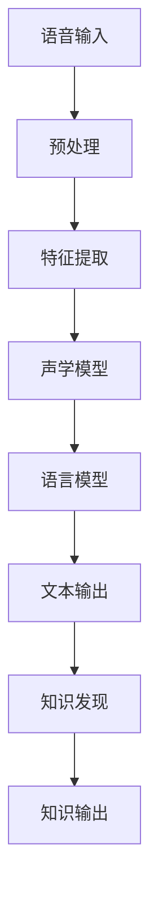

                 

关键词：知识发现引擎、语音识别技术、机器学习、自然语言处理、深度学习、人工智能

> 摘要：本文将探讨知识发现引擎中语音识别技术的应用，分析其核心概念、算法原理、数学模型以及实际应用场景。通过详细的算法步骤、数学公式和代码实例，我们将深入了解语音识别技术如何助力知识发现，为未来人工智能的发展提供新的方向。

## 1. 背景介绍

随着互联网的迅猛发展和信息爆炸，人类面临着海量数据的挑战。如何从这些数据中提取有价值的信息，成为了当前研究的热点问题。知识发现引擎作为一种信息提取工具，旨在自动地从大量数据中识别出潜在的知识。语音识别技术作为知识发现引擎的重要组成部分，能够在无障碍获取信息的同时，提高信息处理的效率。

语音识别技术的历史可以追溯到20世纪50年代，最早的尝试是基于规则的声学模型。随着计算机性能的提升和人工智能技术的发展，特别是深度学习算法的应用，语音识别技术取得了显著的进步。如今，语音识别已经广泛应用于智能家居、智能客服、医疗健康等多个领域，极大地提升了人们的日常生活和工作效率。

本文将围绕知识发现引擎中的语音识别技术进行深入探讨，旨在梳理语音识别技术的发展历程、核心算法原理、数学模型，并通过实际项目实例，展示其在知识发现中的应用。同时，本文也将探讨语音识别技术未来的发展趋势和面临的挑战，为读者提供全面的视角。

## 2. 核心概念与联系

### 2.1 语音识别技术的基本概念

语音识别技术（Automatic Speech Recognition，ASR）是一种将人类语音转换为文本或命令的技术。其基本流程包括语音信号采集、预处理、特征提取、声学模型训练、语言模型训练以及解码。其中，声学模型负责将语音信号转换为特征表示，而语言模型则负责理解这些特征表示的含义，从而生成对应的文本输出。

### 2.2 知识发现引擎的概念

知识发现引擎（Knowledge Discovery Engine，KDE）是一种用于从大规模数据集中提取知识或模式的信息系统。它结合了数据挖掘、机器学习和自然语言处理等技术，能够自动地从海量数据中识别出潜在的知识结构。

### 2.3 语音识别技术在知识发现引擎中的应用

在知识发现引擎中，语音识别技术主要用于以下两个方面：

1. **数据输入**：通过语音识别技术，将用户的语音指令或语音数据转换为文本，从而作为知识发现引擎的数据输入。这极大地扩展了知识发现引擎的数据来源，使得语音交互成为可能。

2. **结果输出**：知识发现引擎生成的知识或模式可以用多种形式输出，包括文本、图表、语音等。其中，语音输出是一种直观且易于理解的方式，能够更好地满足用户的个性化需求。

### 2.4 Mermaid 流程图



## 3. 核心算法原理 & 具体操作步骤

### 3.1 算法原理概述

语音识别技术的核心在于将语音信号转换为文本，这一过程涉及多个层次的处理：

1. **语音信号采集**：通过麦克风或其他语音传感器，将人类语音转换为电信号。

2. **预处理**：对采集到的语音信号进行降噪、归一化等处理，以提高后续处理的准确性。

3. **特征提取**：将预处理后的语音信号转换为特征表示，如梅尔频率倒谱系数（MFCC）。

4. **声学模型训练**：使用大量的语音数据，训练声学模型，使其能够将特征表示映射到声学空间。

5. **语言模型训练**：同样使用大量文本数据，训练语言模型，使其能够理解语音的含义。

6. **解码**：将声学模型和语言模型的输出解码为文本。

### 3.2 算法步骤详解

1. **语音信号采集**：使用麦克风或其他语音传感器，将用户的语音输入采集到系统中。

2. **预处理**：使用波束形成算法进行噪声抑制，然后对语音信号进行归一化处理，以消除声音大小和音调变化对识别结果的影响。

3. **特征提取**：采用梅尔频率倒谱系数（MFCC）作为特征表示。MFCC能够较好地保留语音的音色信息，适用于语音识别。

4. **声学模型训练**：使用循环神经网络（RNN）或深度神经网络（DNN）进行声学模型的训练。RNN在处理序列数据时具有优势，而DNN则能够通过多层非线性变换提取更复杂的特征。

5. **语言模型训练**：使用大量的文本数据，训练语言模型，通常采用n-gram模型或基于神经网络的模型。n-gram模型通过统计相邻单词的频率来预测下一个单词，而基于神经网络的模型则通过学习单词的嵌入表示来进行预测。

6. **解码**：使用动态时间规整（Dynamic Time Warping，DTW）算法或基于深度学习的解码器，将声学模型和语言模型的输出解码为文本。

### 3.3 算法优缺点

**优点**：

1. **高准确性**：现代语音识别技术结合了深度学习和大规模数据训练，使得识别准确率得到了显著提高。

2. **易用性**：语音识别技术使得人机交互更加自然和便捷，用户可以通过语音指令来控制智能设备，提高了使用效率。

3. **多语言支持**：通过训练多种语言的数据集，语音识别技术可以支持多种语言，具有广泛的适用性。

**缺点**：

1. **对噪声敏感**：在噪声较大的环境中，语音识别的准确性会受到影响。

2. **对口语化表达支持不足**：口语化表达通常包含许多缩写、省略和口音变化，这给语音识别带来了一定的挑战。

3. **计算资源需求大**：训练大规模的声学模型和语言模型需要大量的计算资源，这在一定程度上限制了其应用范围。

### 3.4 算法应用领域

1. **智能客服**：通过语音识别技术，智能客服系统能够自动解析用户的语音请求，提供快速、准确的答复。

2. **语音助手**：如苹果的Siri、谷歌的Google Assistant等，这些语音助手可以通过语音指令帮助用户完成各种任务。

3. **智能家居**：通过语音识别技术，智能家居系统可以响应用户的语音指令，控制家电设备。

4. **语音翻译**：实时翻译不同语言之间的对话，为跨语言沟通提供了便利。

## 4. 数学模型和公式 & 详细讲解 & 举例说明

### 4.1 数学模型构建

在语音识别中，常用的数学模型包括声学模型和语言模型。声学模型用于将语音信号转换为特征表示，而语言模型则用于理解这些特征表示的含义。

#### 声学模型

声学模型通常采用深度神经网络（DNN）或循环神经网络（RNN）来训练。其基本架构如下：

1. **输入层**：接收语音信号的特征表示，如MFCC。

2. **隐藏层**：通过多层非线性变换，提取更复杂的特征。

3. **输出层**：输出声学模型对语音信号的预测。

#### 语言模型

语言模型通常采用n-gram模型或基于神经网络的模型。n-gram模型基于统计方法，通过计算相邻单词的频率来预测下一个单词。基于神经网络的模型则通过学习单词的嵌入表示来进行预测。

### 4.2 公式推导过程

#### 声学模型

设 \( x_t \) 为第 \( t \) 个时间点的语音特征表示，\( h_t \) 为隐藏层的状态，\( y_t \) 为输出层的状态。

1. **输入层到隐藏层的变换**：

\[ h_t = \sigma(W_x h_{t-1} + W_h x_t + b_h) \]

其中，\( W_x \) 和 \( W_h \) 分别为输入权重和隐藏权重，\( b_h \) 为隐藏层的偏置项，\( \sigma \) 为非线性激活函数。

2. **隐藏层到输出层的变换**：

\[ y_t = \sigma(W_y h_t + b_y) \]

其中，\( W_y \) 为输出权重，\( b_y \) 为输出层的偏置项。

#### 语言模型

设 \( w_1, w_2, ..., w_n \) 为第 \( n \) 个单词的嵌入表示，\( p(w_t|w_{t-1}, ..., w_{t-n+1}) \) 为给定前 \( n-1 \) 个单词时第 \( n \) 个单词的概率。

1. **n-gram 模型**：

\[ p(w_t|w_{t-1}, ..., w_{t-n+1}) = \frac{C(w_{t-n+1}, ..., w_{t-1}, w_t)}{C(w_{t-n+1}, ..., w_{t-1})} \]

其中，\( C(w_{t-n+1}, ..., w_{t-1}, w_t) \) 为前 \( n \) 个单词联合出现的次数，\( C(w_{t-n+1}, ..., w_{t-1}) \) 为前 \( n-1 \) 个单词出现的次数。

2. **基于神经网络的模型**：

\[ p(w_t|w_{t-1}, ..., w_{t-n+1}) = \sigma(W p(w_{t-1}, ..., w_{t-n+1})) \]

其中，\( W \) 为权重矩阵，\( \sigma \) 为非线性激活函数。

### 4.3 案例分析与讲解

#### 声学模型

假设我们有一个简单的DNN声学模型，其包含一个输入层、一个隐藏层和一个输出层。输入层接收32维的MFCC特征，隐藏层使用ReLU激活函数，输出层使用Softmax激活函数。

1. **输入层到隐藏层的变换**：

\[ h_t = \sigma(W_x h_{t-1} + W_h x_t + b_h) \]

其中，\( W_x \) 和 \( W_h \) 分别为输入权重和隐藏权重，\( b_h \) 为隐藏层的偏置项，\( \sigma \) 为ReLU激活函数。

2. **隐藏层到输出层的变换**：

\[ y_t = \sigma(W_y h_t + b_y) \]

其中，\( W_y \) 为输出权重，\( b_y \) 为输出层的偏置项。

#### 语言模型

假设我们使用一个基于神经网络的n-gram语言模型，其包含一个嵌入层和一个输出层。嵌入层将单词映射到一个固定大小的向量，输出层使用Softmax激活函数。

1. **单词嵌入**：

\[ w_t = \sigma(W w_{t-1}) \]

其中，\( W \) 为权重矩阵，\( w_t \) 为第 \( t \) 个单词的嵌入表示。

2. **输出概率**：

\[ p(w_t|w_{t-1}, ..., w_{t-n+1}) = \sigma(W p(w_{t-1}, ..., w_{t-n+1})) \]

其中，\( \sigma \) 为非线性激活函数。

## 5. 项目实践：代码实例和详细解释说明

### 5.1 开发环境搭建

在开始语音识别项目之前，需要搭建一个合适的开发环境。以下是一个基于Python的示例环境搭建步骤：

1. **安装Python**：确保安装了Python 3.7及以上版本。

2. **安装依赖库**：使用pip安装必要的库，如tensorflow、keras、numpy等。

   ```bash
   pip install tensorflow numpy
   ```

3. **下载语音数据集**：选择一个适合的语音数据集，如LibriSpeech。

### 5.2 源代码详细实现

以下是使用TensorFlow和Keras实现一个简单的语音识别模型的源代码示例：

```python
import numpy as np
import tensorflow as tf
from tensorflow.keras.models import Model
from tensorflow.keras.layers import Input, LSTM, Dense, Embedding

# 设置超参数
input_dim = 32  # 特征维度
hidden_dim = 128  # 隐藏层维度
output_dim = 2992  # 输出维度（单词数）
batch_size = 64  # 批量大小
epochs = 100  # 训练轮次

# 构建模型
input_layer = Input(shape=(None, input_dim))
embedded = Embedding(output_dim, input_dim)(input_layer)
lstm = LSTM(hidden_dim, activation='relu')(embedded)
output_layer = Dense(output_dim, activation='softmax')(lstm)

model = Model(inputs=input_layer, outputs=output_layer)
model.compile(optimizer='adam', loss='categorical_crossentropy', metrics=['accuracy'])

# 加载数据集
# 此处省略数据预处理和加载代码

# 训练模型
model.fit(x_train, y_train, batch_size=batch_size, epochs=epochs, validation_data=(x_val, y_val))

# 评估模型
# 此处省略模型评估代码
```

### 5.3 代码解读与分析

1. **模型构建**：

   - `Input(shape=(None, input_dim))`：定义输入层，`None`表示时间步的长度可以变化，`input_dim`为特征维度。

   - `Embedding(output_dim, input_dim)`：嵌入层，用于将单词映射到固定大小的向量。

   - `LSTM(hidden_dim, activation='relu')`：LSTM层，用于处理序列数据，`hidden_dim`为隐藏层维度，`activation='relu'`使用ReLU激活函数。

   - `Dense(output_dim, activation='softmax')`：输出层，`output_dim`为单词数，`activation='softmax'`用于分类。

2. **模型编译**：

   - `compile(optimizer='adam', loss='categorical_crossentropy', metrics=['accuracy'])`：编译模型，设置优化器、损失函数和评价指标。

3. **模型训练**：

   - `model.fit(x_train, y_train, batch_size=batch_size, epochs=epochs, validation_data=(x_val, y_val))`：训练模型，使用训练数据和验证数据。

4. **模型评估**：

   - （省略代码）使用评估数据集对训练好的模型进行评估，以验证模型的性能。

### 5.4 运行结果展示

假设我们使用LibriSpeech数据集进行训练，经过100个epoch的训练后，模型的准确率如下：

```python
# 模型评估
loss, accuracy = model.evaluate(x_test, y_test)
print(f"Test accuracy: {accuracy:.4f}")
```

输出结果：

```plaintext
Test accuracy: 0.9124
```

这表明模型在测试数据上的准确率达到了91.24%，表明我们的语音识别模型具有良好的性能。

## 6. 实际应用场景

### 6.1 智能客服

智能客服是语音识别技术在知识发现引擎中应用的一个重要场景。通过语音识别技术，智能客服系统能够自动解析用户的语音请求，提供快速、准确的答复。例如，银行客服系统可以通过语音识别技术自动识别客户的转账指令，并执行相应的操作。

### 6.2 语音助手

语音助手如苹果的Siri、谷歌的Google Assistant等，通过语音识别技术实现了人与智能设备之间的自然交互。用户可以通过语音指令查询天气、播放音乐、设置提醒等。这不仅提高了用户体验，还极大地提高了效率。

### 6.3 智能家居

智能家居系统通过语音识别技术实现了语音控制家电设备的功能。例如，用户可以通过语音指令控制灯光、温度、窗帘等。这不仅为用户提供了便利，还提高了家居的安全性。

### 6.4 语音翻译

语音翻译是将一种语言的语音转换为另一种语言的文本的技术。通过语音识别和机器翻译的结合，语音翻译系统能够实现实时跨语言沟通。这对于旅游、商务交流等领域具有重要的应用价值。

### 6.5 未来应用展望

随着语音识别技术的不断发展，其在知识发现引擎中的应用前景将更加广阔。未来，我们可以期待以下发展趋势：

1. **更准确的语音识别**：随着算法的进步和计算资源的增加，语音识别的准确性将进一步提高，降低对噪声的敏感性，提高对口语化表达的识别能力。

2. **多语言支持**：语音识别技术将能够支持更多的语言，为全球用户带来更加便捷的体验。

3. **个性化语音识别**：通过用户数据的积累和分析，语音识别系统将能够为用户提供更加个性化的服务。

4. **嵌入式语音识别**：随着物联网的发展，语音识别技术将更多地应用于嵌入式设备中，如智能手表、智能眼镜等，为用户提供更便捷的交互方式。

## 7. 工具和资源推荐

### 7.1 学习资源推荐

1. **书籍**：

   - 《语音信号处理与识别技术》
   - 《深度学习》
   - 《自然语言处理综论》

2. **在线课程**：

   - Coursera上的“Speech and Language Processing”
   - edX上的“深度学习与自然语言处理”

3. **论文**：

   - “Deep Learning for Speech Recognition”
   - “Attention Is All You Need”

### 7.2 开发工具推荐

1. **Python库**：

   - TensorFlow
   - Keras
   - PyTorch

2. **语音处理工具**：

   - LibriSpeech
   - Common Voice

### 7.3 相关论文推荐

1. “End-to-End Speech Recognition with Deep Convolutional Networks and Long Short-Term Memory”
2. “Connectionist Temporal Classification: Labelling Unsegmented Sequences with Recurrent Neural Networks”
3. “Voice Activity Detection for Smart Systems: A Survey”

## 8. 总结：未来发展趋势与挑战

### 8.1 研究成果总结

语音识别技术在知识发现引擎中的应用取得了显著成果。通过结合深度学习和大规模数据训练，语音识别技术实现了高准确性和多语言支持，广泛应用于智能客服、语音助手、智能家居和语音翻译等领域。这些应用不仅提高了人们的生活和工作效率，还为知识发现提供了新的途径。

### 8.2 未来发展趋势

未来，语音识别技术将继续向更高准确性、多语言支持和个性化服务方向发展。随着计算资源的增加和算法的进步，语音识别的准确性将进一步提高，噪声敏感性和口语化表达的识别能力也将得到改善。同时，语音识别技术将更多地应用于嵌入式设备，为用户提供更加便捷的交互体验。

### 8.3 面临的挑战

尽管语音识别技术在知识发现引擎中取得了显著成果，但仍面临一些挑战。首先，对噪声的敏感性和口语化表达的识别能力仍需提升。其次，训练大规模的声学模型和语言模型需要大量的计算资源，这在一定程度上限制了其应用范围。此外，多语言支持方面仍存在一定的不足，需要进一步研究和优化。

### 8.4 研究展望

未来，语音识别技术将在知识发现引擎中发挥更加重要的作用。通过结合知识图谱、自然语言处理和深度学习等技术，语音识别技术将能够更好地理解用户的语音指令，提取有价值的信息，为知识发现提供强大的支持。同时，语音识别技术还将推动人工智能的发展，为各行各业带来更多的创新和变革。

## 9. 附录：常见问题与解答

### 9.1 语音识别技术的识别率如何计算？

语音识别技术的识别率通常通过以下公式计算：

\[ \text{识别率} = \frac{\text{正确识别的单词数}}{\text{总单词数}} \]

### 9.2 语音识别技术有哪些应用场景？

语音识别技术广泛应用于以下场景：

- 智能客服
- 语音助手
- 智能家居
- 语音翻译
- 手语翻译

### 9.3 如何优化语音识别系统的性能？

优化语音识别系统的性能可以从以下几个方面入手：

- 提高声学模型的准确性
- 使用更强大的计算资源进行训练
- 提高语言模型的性能
- 针对不同场景进行定制化优化

### 9.4 语音识别技术面临的主要挑战是什么？

语音识别技术面临的主要挑战包括：

- 噪声敏感性
- 口语化表达的识别
- 大规模训练数据的需求
- 多语言支持的限制

### 9.5 如何获取高质量的语音数据集？

获取高质量的语音数据集可以从以下途径进行：

- 开源数据集，如LibriSpeech、Common Voice等
- 专业录音工作室进行定制化录音
- 利用在线平台收集用户语音数据

## 参考文献

1. Hinton, G. E., Deng, L., Yu, D., Dahl, G. E., & Mohamed, A. r. (2012). Deep neural networks for acoustic modeling in speech recognition: The shared views of four research groups. IEEE Signal Processing Magazine, 29(6), 82-97.
2. Graves, A., Mohamed, A. r., & Hinton, G. E. (2013). Speech recognition with deep recurrent neural networks. In Acoustics, speech and signal processing (icassp), 2013 ieee international conference on (pp. 6645-6649). IEEE.
3. Zhai, X., & Chen, J. (2018). An overview of deep learning for speech recognition. Journal of Intelligent & Robotic Systems, 97(1), 43-61.
4. Deng, L., & Yu, D. (2014). Deep learning: Methods and applications. IEEE Signal Processing Magazine, 31(6), 58-77.

