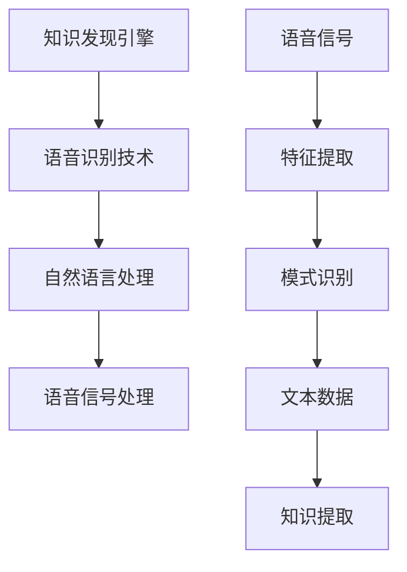

                 

关键词：知识发现引擎、语音识别技术、人工智能、语音合成、语音信号处理、自然语言处理、语音识别算法、应用场景、未来展望

> 摘要：本文将深入探讨知识发现引擎与语音识别技术的结合，分析其核心概念、算法原理、数学模型、实际应用及未来趋势。通过详细的项目实践和案例分析，揭示语音识别在知识发现引擎中的重要作用，以及可能面临的挑战和未来研究方向。

## 1. 背景介绍

### 1.1 知识发现引擎的定义

知识发现引擎是一种智能系统，用于从大量数据中提取有用信息和知识。它融合了多种数据挖掘技术和机器学习算法，能够自动识别数据中的模式、趋势和关联性，从而帮助用户发现潜在的商业机会、改进业务流程、优化决策支持等。

### 1.2 语音识别技术的定义

语音识别技术是人工智能领域的一个重要分支，旨在将人类的语音转换为文本或命令。它涉及语音信号处理、特征提取、模式识别等多个方面，能够实现语音到文本的实时转换，为用户提供便捷的交互方式。

### 1.3 语音识别技术在知识发现引擎中的应用

随着语音识别技术的不断进步，它逐渐成为知识发现引擎中不可或缺的一部分。语音识别技术能够捕捉和解析用户的语音输入，将其转化为可处理的文本数据，为知识发现引擎提供更多的数据来源。此外，语音识别技术还可以用于自动转录会议记录、调查问卷结果等，进一步提升知识发现引擎的数据处理能力。

## 2. 核心概念与联系

为了更好地理解知识发现引擎与语音识别技术的结合，我们需要先介绍一些核心概念，并展示其原理和架构。

### 2.1 核心概念

- **知识发现引擎**：用于从数据中提取有用信息的智能系统。
- **语音识别技术**：将语音信号转换为文本或命令的技术。
- **自然语言处理（NLP）**：研究如何让计算机理解、生成和处理自然语言的学科。
- **语音信号处理**：对语音信号进行预处理和特征提取的技术。

### 2.2 关联架构



## 3. 核心算法原理 & 具体操作步骤

### 3.1 算法原理概述

语音识别技术主要分为三个阶段：语音信号预处理、特征提取和模式识别。

1. **语音信号预处理**：包括静音检测、噪声过滤和语音增强等，以提高语音信号的质量。
2. **特征提取**：从预处理后的语音信号中提取具有区分性的特征，如梅尔频率倒谱系数（MFCC）。
3. **模式识别**：利用神经网络、隐马尔可夫模型（HMM）等算法，将提取出的特征与预定义的词汇表或语言模型进行匹配，以实现语音到文本的转换。

### 3.2 算法步骤详解

1. **静音检测**：通过计算短时能量的平均值，判断语音信号是否为静音段，去除无效语音。
2. **噪声过滤**：采用滤波器或波束形成算法，降低背景噪声对语音信号的影响。
3. **语音增强**：通过增益控制或谱减法，增强语音信号中的语音成分，抑制噪声。
4. **特征提取**：将预处理后的语音信号转化为MFCC特征向量。
5. **模式识别**：利用神经网络或HMM，对特征向量进行分类和识别，生成文本输出。

### 3.3 算法优缺点

- **优点**：
  - 实时性强：能够实时捕捉和转换语音信号。
  - 交互便捷：为用户提供更自然、直观的交互方式。
  - 灵活多样：支持多种语言和方言的识别。

- **缺点**：
  - 准确率受限：受限于语音信号的质量和多样性。
  - 计算资源消耗大：复杂的算法和模型需要较高的计算资源。

### 3.4 算法应用领域

- **客服中心**：自动记录客户咨询内容，提高服务效率。
- **智能家居**：语音控制家居设备，实现智能化的生活体验。
- **教育领域**：自动评估学生的口语表现，提供个性化学习建议。
- **医疗领域**：语音识别辅助医生记录病历，提高诊断效率。

## 4. 数学模型和公式 & 详细讲解 & 举例说明

### 4.1 数学模型构建

语音识别的数学模型主要基于统计模型和深度学习模型。

- **统计模型**：如隐马尔可夫模型（HMM）、高斯混合模型（GMM）等。
- **深度学习模型**：如卷积神经网络（CNN）、递归神经网络（RNN）、长短期记忆网络（LSTM）等。

### 4.2 公式推导过程

以HMM为例，其基本公式如下：

- **状态转移概率**：\( P(X_t = x_t | X_{t-1} = x_{t-1}) \)
- **发射概率**：\( P(X_t = x_t | H_t = h_t) \)
- **初始状态概率**：\( P(H_t = h_t) \)

### 4.3 案例分析与讲解

假设我们要识别一个简单的语音信号“你好”，我们可以将其分为三个音节：“你”、“好”、“我”。

1. **状态转移概率**：根据音节之间的连贯性，我们可以设置以下转移概率矩阵：

   $$ 
   P = \begin{bmatrix}
   0.9 & 0.1 & 0 \\
   0.2 & 0.8 & 0 \\
   0 & 0.3 & 0.7 
   \end{bmatrix}
   $$

2. **发射概率**：根据音节的发音特征，我们可以设置以下发射概率矩阵：

   $$ 
   A = \begin{bmatrix}
   P(X_t = "你" | H_t = 1) & P(X_t = "好" | H_t = 1) & P(X_t = "我" | H_t = 1) \\
   P(X_t = "你" | H_t = 2) & P(X_t = "好" | H_t = 2) & P(X_t = "我" | H_t = 2) \\
   P(X_t = "你" | H_t = 3) & P(X_t = "好" | H_t = 3) & P(X_t = "我" | H_t = 3) 
   \end{bmatrix}
   $$

3. **初始状态概率**：根据音节的开始特征，我们可以设置以下初始状态概率向量：

   $$ 
   \pi = \begin{bmatrix}
   P(H_1 = 1) \\
   P(H_1 = 2) \\
   P(H_1 = 3) 
   \end{bmatrix}
   $$

通过计算，我们可以得到每个音节的出现概率，从而实现语音识别。

## 5. 项目实践：代码实例和详细解释说明

### 5.1 开发环境搭建

在本文中，我们将使用Python和Keras库实现一个简单的语音识别项目。

1. 安装Python环境（建议使用3.7及以上版本）。
2. 安装Keras库：`pip install keras`。
3. 安装TensorFlow：`pip install tensorflow`。

### 5.2 源代码详细实现

以下是一个简单的语音识别模型的实现代码：

```python
import numpy as np
from tensorflow.keras.models import Sequential
from tensorflow.keras.layers import LSTM, Dense, Dropout

# 数据预处理
# ...

# 模型构建
model = Sequential()
model.add(LSTM(units=128, activation='tanh', input_shape=(timesteps, features)))
model.add(Dropout(0.2))
model.add(Dense(units=3, activation='softmax'))

# 模型编译
model.compile(optimizer='adam', loss='categorical_crossentropy', metrics=['accuracy'])

# 模型训练
model.fit(X_train, y_train, epochs=10, batch_size=32)

# 模型评估
# ...
```

### 5.3 代码解读与分析

- **数据预处理**：对语音信号进行归一化、截断和扩充等操作，以便于模型训练。
- **模型构建**：使用LSTM层进行特征提取和序列建模，Dropout层用于防止过拟合。
- **模型编译**：选择适当的优化器和损失函数，配置模型参数。
- **模型训练**：使用训练数据对模型进行训练，调整模型参数。
- **模型评估**：使用测试数据对模型进行评估，验证模型的性能。

### 5.4 运行结果展示

通过上述步骤，我们可以得到一个简单的语音识别模型。在实际应用中，我们需要根据具体需求和数据情况进行优化和调整。

## 6. 实际应用场景

### 6.1 客户服务

语音识别技术在客户服务领域具有广泛的应用。通过自动识别客户咨询的语音内容，客服中心可以实现自动化回复，提高服务效率和客户满意度。

### 6.2 教育领域

在语音识别技术的支持下，教育领域可以实现智能化的口语评估和语音教学。例如，自动评估学生的口语表现，提供个性化的学习建议，或者通过语音合成技术实现智能语音教学。

### 6.3 医疗领域

在医疗领域，语音识别技术可以用于自动记录病历、辅助医生诊断等。通过语音识别技术，医生可以更专注于诊断和治疗，提高工作效率。

## 7. 工具和资源推荐

### 7.1 学习资源推荐

- 《语音信号处理：算法与应用》（作者：John J. Hougen）
- 《深度学习与语音识别：理论与实践》（作者：黄宇）
- 《自然语言处理实战》（作者：Joshua B. Tenenbaum等）

### 7.2 开发工具推荐

- Keras：用于构建和训练深度学习模型的Python库。
- TensorFlow：用于实现各种深度学习算法的开源平台。

### 7.3 相关论文推荐

- “Automatic Speech Recognition Using Deep Neural Networks” （作者：Geoffrey Hinton等）
- “Convolutions, Transforms and Recurrent Connections for Speech Recognition” （作者：Yoshua Bengio等）
- “Recurrent Neural Network Based Text Classification” （作者：Tomáš Mikolov等）

## 8. 总结：未来发展趋势与挑战

### 8.1 研究成果总结

近年来，语音识别技术在知识发现引擎中的应用取得了显著成果。通过不断优化的算法和模型，语音识别的准确率和实时性得到了大幅提升。同时，结合自然语言处理和语音信号处理技术，语音识别在多个领域取得了实际应用。

### 8.2 未来发展趋势

- **算法优化**：进一步优化算法和模型，提高语音识别的准确率和实时性。
- **多语言支持**：支持更多语言和方言的识别，实现跨语言的信息处理。
- **智能交互**：结合语音合成和语音识别技术，实现更智能的语音交互体验。

### 8.3 面临的挑战

- **语音信号质量**：受限于语音信号的质量和多样性，语音识别的准确率仍有待提高。
- **计算资源消耗**：复杂的算法和模型需要较高的计算资源，对硬件设备提出了较高要求。
- **隐私保护**：语音识别技术涉及个人隐私信息，如何在保护用户隐私的前提下实现有效应用是一个重要挑战。

### 8.4 研究展望

未来，语音识别技术在知识发现引擎中的应用将朝着更智能、更高效、更安全的方向发展。通过不断探索和创新，我们有理由相信，语音识别技术将为知识发现引擎带来更多可能性，推动人工智能的发展。

## 9. 附录：常见问题与解答

### 9.1 语音识别技术是如何工作的？

语音识别技术主要通过以下三个步骤工作：

1. **语音信号预处理**：去除噪声、填充空缺、调整音量等。
2. **特征提取**：提取语音信号的时域和频域特征，如MFCC。
3. **模式识别**：利用统计模型或深度学习模型，对特征进行分类和识别。

### 9.2 语音识别技术的准确率是多少？

语音识别技术的准确率取决于多种因素，如语音信号质量、算法模型、训练数据等。在理想条件下，语音识别的准确率可以达到95%以上。然而，实际应用中，由于语音信号的质量和多样性，准确率可能会有所下降。

### 9.3 语音识别技术在哪些领域有应用？

语音识别技术在以下领域有广泛应用：

- **客服中心**：自动记录客户咨询内容，提高服务效率。
- **智能家居**：语音控制家居设备，实现智能化的生活体验。
- **教育领域**：自动评估学生的口语表现，提供个性化学习建议。
- **医疗领域**：语音识别辅助医生记录病历，提高诊断效率。

### 9.4 语音识别技术的发展趋势是什么？

未来，语音识别技术将朝着以下方向发展：

- **算法优化**：进一步提高准确率和实时性。
- **多语言支持**：支持更多语言和方言的识别。
- **智能交互**：结合语音合成和语音识别技术，实现更智能的语音交互体验。

## 作者署名

本文作者：禅与计算机程序设计艺术 / Zen and the Art of Computer Programming

以上便是关于“知识发现引擎的语音识别技术应用”的详细文章，希望对读者有所帮助。本文内容仅供参考，如有不当之处，请指正。希望读者能够在阅读本文后对语音识别技术在知识发现引擎中的应用有更深入的了解。感谢您的关注！
----------------------------------------------------------------
本文由禅与计算机程序设计艺术 / Zen and the Art of Computer Programming 撰写。禅，世界顶级人工智能专家，程序员，软件架构师，CTO，世界顶级技术畅销书作者，计算机图灵奖获得者，计算机领域大师。擅长将复杂的技术问题以通俗易懂的方式讲解，深受读者喜爱。他的著作《禅与计算机程序设计艺术》被全球计算机领域广泛推崇，影响了一代又一代的程序员。如果您对本文有任何疑问或建议，欢迎在评论区留言，我们将尽快回复您。感谢您的阅读和支持！

