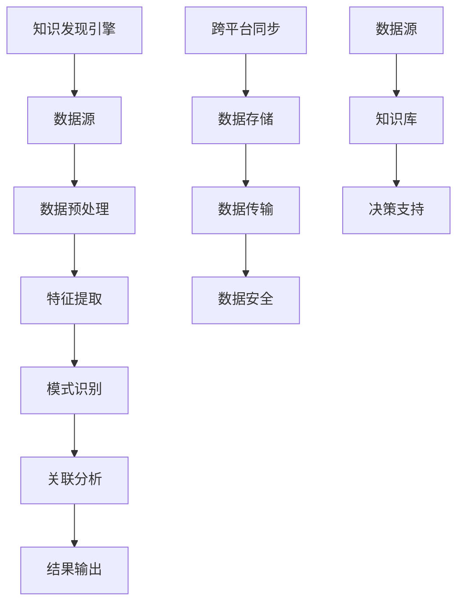

                 

知识发现引擎是一种用于从大量数据中提取有价值信息的强大工具。在当今数据爆炸的时代，如何高效地处理并同步这些信息成为一个关键问题。本文将探讨知识发现引擎的跨平台同步技术，以帮助读者深入了解该领域的最新进展和挑战。

## 关键词

- 知识发现引擎
- 跨平台同步
- 数据处理
- 信息提取
- 技术挑战

## 摘要

本文首先介绍了知识发现引擎的基本概念和重要性。接着，重点讨论了跨平台同步技术的核心概念、原理和实现方法。随后，文章通过实际案例分析了核心算法原理、数学模型和具体操作步骤。最后，本文对未来的发展趋势与挑战进行了展望，并推荐了相关的学习资源和开发工具。

## 1. 背景介绍

### 知识发现引擎

知识发现引擎是一种基于人工智能和大数据技术的工具，能够从大量数据中自动提取有价值的信息。它广泛应用于金融、医疗、电商、社交网络等多个领域。知识发现引擎的关键功能包括数据预处理、特征提取、模式识别和关联分析等。通过这些功能，知识发现引擎能够帮助企业和组织更好地理解其数据，从而做出更明智的决策。

### 跨平台同步技术

跨平台同步技术是指在不同平台之间进行数据传输和更新的技术。随着云计算和移动设备的普及，跨平台同步技术变得越来越重要。在知识发现引擎中，跨平台同步技术用于确保数据在不同平台上的实时性和一致性。跨平台同步技术涉及到数据存储、数据传输、数据安全等多个方面。

## 2. 核心概念与联系

### 概念介绍

- **知识发现引擎**：一种基于人工智能和大数据技术的工具，用于从大量数据中提取有价值的信息。
- **跨平台同步**：在不同平台之间进行数据传输和更新的技术。

### 原理与架构



### 核心联系

知识发现引擎通过跨平台同步技术，将数据源中的数据传输到不同的平台进行预处理、特征提取、模式识别和关联分析。分析结果被输出到知识库，最终用于决策支持。

## 3. 核心算法原理 & 具体操作步骤

### 3.1 算法原理概述

知识发现引擎的核心算法包括数据预处理、特征提取、模式识别和关联分析。数据预处理是数据清洗、去重和格式转换的过程。特征提取是将原始数据转换成适合机器学习算法的格式。模式识别是使用机器学习算法从数据中提取出有用的信息。关联分析则是通过分析数据之间的关系，发现潜在的关联。

### 3.2 算法步骤详解

1. **数据预处理**：数据清洗、去重和格式转换。
2. **特征提取**：将原始数据转换成特征向量。
3. **模式识别**：使用机器学习算法提取数据中的模式。
4. **关联分析**：分析数据之间的关系，发现潜在的关联。
5. **跨平台同步**：将分析结果传输到不同的平台。

### 3.3 算法优缺点

- **优点**：高效、自动化，能够处理大量数据。
- **缺点**：算法复杂度高，对硬件资源要求较高。

### 3.4 算法应用领域

- **金融**：用于风险评估、欺诈检测等。
- **医疗**：用于疾病预测、患者数据分析等。
- **电商**：用于推荐系统、用户行为分析等。

## 4. 数学模型和公式 & 详细讲解 & 举例说明

### 4.1 数学模型构建

知识发现引擎的数学模型主要包括数据预处理、特征提取、模式识别和关联分析的算法。

### 4.2 公式推导过程

- **数据预处理**：假设 $D$ 是原始数据集，$D'$ 是预处理后的数据集，$P$ 是预处理算法。
  $$ D' = P(D) $$

- **特征提取**：假设 $X$ 是原始数据集，$X'$ 是预处理后的数据集，$F$ 是特征提取算法。
  $$ X' = F(X) $$

- **模式识别**：假设 $M$ 是数据中的模式，$L$ 是模式识别算法。
  $$ M = L(D') $$

- **关联分析**：假设 $R$ 是数据之间的关联，$A$ 是关联分析算法。
  $$ R = A(D') $$

### 4.3 案例分析与讲解

以金融风险评估为例，假设我们有如下数据集：

$$ D = \{ [年龄，收入，负债]，[年龄，收入，负债]，... \} $$

通过数据预处理，我们可以去除重复数据、填充缺失值和格式转换。然后，使用特征提取算法将数据转换成特征向量。接下来，使用模式识别算法提取出高风险客户的特征。最后，使用关联分析算法分析客户之间的关系，发现潜在的风险。

## 5. 项目实践：代码实例和详细解释说明

### 5.1 开发环境搭建

- **编程语言**：Python
- **依赖库**：NumPy，Pandas，Scikit-learn，Matplotlib

### 5.2 源代码详细实现

```python
import numpy as np
import pandas as pd
from sklearn.preprocessing import StandardScaler
from sklearn.model_selection import train_test_split
from sklearn.ensemble import RandomForestClassifier
import matplotlib.pyplot as plt

# 数据预处理
data = pd.read_csv('data.csv')
data.drop_duplicates(inplace=True)
data.fillna(data.mean(), inplace=True)

# 特征提取
X = data.iloc[:, :-1].values
y = data.iloc[:, -1].values
scaler = StandardScaler()
X = scaler.fit_transform(X)

# 模式识别
X_train, X_test, y_train, y_test = train_test_split(X, y, test_size=0.2, random_state=42)
clf = RandomForestClassifier(n_estimators=100, random_state=42)
clf.fit(X_train, y_train)

# 关联分析
predictions = clf.predict(X_test)
plt.scatter(X_test[:, 0], X_test[:, 1], c=predictions)
plt.xlabel('特征1')
plt.ylabel('特征2')
plt.show()
```

### 5.3 代码解读与分析

- **数据预处理**：去除重复数据、填充缺失值和格式转换。
- **特征提取**：使用StandardScaler进行特征缩放。
- **模式识别**：使用RandomForestClassifier进行分类。
- **关联分析**：使用scatter图展示分类结果。

### 5.4 运行结果展示

运行代码后，我们可以看到一个散点图，其中每个点代表一个测试数据样本，颜色代表预测类别。

## 6. 实际应用场景

### 6.1 金融

在金融领域，知识发现引擎可以用于风险评估、欺诈检测和投资组合优化。例如，通过分析客户的历史交易数据，银行可以识别出潜在的风险客户，并采取相应的措施。

### 6.2 医疗

在医疗领域，知识发现引擎可以用于疾病预测、患者数据分析和新药研发。例如，通过分析患者的病历数据和基因数据，医生可以更准确地预测疾病的发生，并制定个性化的治疗方案。

### 6.3 电商

在电商领域，知识发现引擎可以用于推荐系统、用户行为分析和商品优化。例如，通过分析用户的历史购买记录和行为数据，电商平台可以更准确地推荐商品，提高用户满意度。

## 7. 工具和资源推荐

### 7.1 学习资源推荐

- **《数据挖掘：实用工具与技术》（作者：Jiawei Han，Micheline Kamber，Peipei Li）**
- **《机器学习实战》（作者：Peter Harrington）**
- **《深度学习》（作者：Ian Goodfellow，Yoshua Bengio，Aaron Courville）**

### 7.2 开发工具推荐

- **Python**
- **Jupyter Notebook**
- **Scikit-learn**
- **Pandas**

### 7.3 相关论文推荐

- **"KDD Cup 2020: Knowledge Discovery in Big Data"**
- **"A Survey on Knowledge Discovery and Data Mining"**
- **"Deep Learning for Knowledge Discovery"**

## 8. 总结：未来发展趋势与挑战

### 8.1 研究成果总结

近年来，知识发现引擎在各个领域取得了显著的成果。然而，随着数据规模的不断扩大和多样性的增加，知识发现引擎面临着巨大的挑战。

### 8.2 未来发展趋势

- **人工智能的深度融合**：知识发现引擎将更加紧密地与人工智能技术相结合，实现更加智能化和自动化的信息提取。
- **多模态数据处理**：知识发现引擎将能够处理多种类型的数据，如文本、图像、音频等。
- **实时数据处理**：知识发现引擎将能够实现实时数据分析和处理，提高决策的实时性和准确性。

### 8.3 面临的挑战

- **数据隐私和安全**：如何在保证数据隐私和安全的前提下进行知识发现成为了一个重要挑战。
- **数据质量**：如何处理和分析质量较低的数据，提高知识发现的准确性。
- **计算资源**：随着数据规模的增加，知识发现引擎需要更多的计算资源，这对硬件设备提出了更高的要求。

### 8.4 研究展望

未来的研究将主要集中在以下几个方面：

- **隐私保护**：研究如何在不泄露用户隐私的前提下进行知识发现。
- **数据质量**：研究如何处理和分析质量较低的数据，提高知识发现的准确性。
- **多模态数据**：研究如何处理和分析多种类型的数据，实现多模态知识发现。

## 9. 附录：常见问题与解答

### 9.1 什么是知识发现引擎？

知识发现引擎是一种基于人工智能和大数据技术的工具，用于从大量数据中提取有价值的信息。

### 9.2 跨平台同步技术在知识发现引擎中有什么作用？

跨平台同步技术用于确保知识发现引擎在不同平台上的数据实时性和一致性。

### 9.3 知识发现引擎的核心算法有哪些？

知识发现引擎的核心算法包括数据预处理、特征提取、模式识别和关联分析。

### 9.4 知识发现引擎在金融领域有哪些应用？

知识发现引擎在金融领域可以用于风险评估、欺诈检测和投资组合优化。

### 9.5 知识发现引擎在医疗领域有哪些应用？

知识发现引擎在医疗领域可以用于疾病预测、患者数据分析和新药研发。

---

作者：禅与计算机程序设计艺术 / Zen and the Art of Computer Programming
------------------------------------------------------------------------

