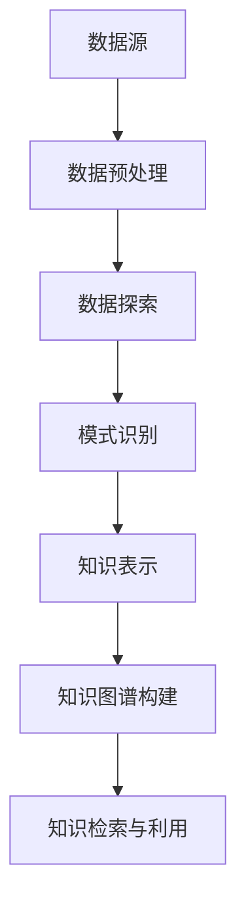

                 

 **关键词：** 知识发现、数据挖掘、人工智能、机器学习、知识图谱

> **摘要：** 本文深入探讨了知识发现引擎的概念、原理以及其在加速人类知识进化中的应用。通过分析知识发现引擎的核心算法、数学模型以及实际应用案例，本文旨在为读者提供一个全面的技术视角，理解知识发现引擎在现代社会中的重要性。

## 1. 背景介绍

在当今信息爆炸的时代，知识的获取和传播变得前所未有的便捷。然而，随之而来的问题是如何有效地从大量数据中提取有价值的信息，以便更好地指导决策和推动创新。知识发现（Knowledge Discovery in Databases，简称KDD）作为一个跨学科的研究领域，旨在通过数据挖掘（Data Mining）方法，从大量的数据中识别出潜在的模式、趋势和关联。知识发现引擎，作为知识发现过程中的核心工具，承担着将数据转化为知识的关键任务。

知识发现引擎的发展历程可以追溯到20世纪80年代，随着计算机技术和算法理论的不断进步，知识发现引擎逐渐从简单的统计分析工具发展成为集成了多种先进技术的复杂系统。知识发现引擎的出现，极大地提高了人类从数据中获取知识的能力，推动了数据密集型科学的发展。

本文将围绕知识发现引擎展开，首先介绍其核心概念与联系，然后深入探讨核心算法原理与数学模型，并通过实际项目实践展示其应用价值。最后，我们将探讨知识发现引擎在实际应用场景中的未来展望和面临的挑战。

## 2. 核心概念与联系

### 2.1 数据挖掘

数据挖掘（Data Mining）是知识发现引擎的基础。数据挖掘是指从大量数据中提取出潜在的模式、关联、趋势和知识的过程。它包括以下几个关键步骤：

1. **数据预处理**：清洗、整合和转换原始数据，使其适合进行分析。
2. **数据探索**：使用统计方法、可视化技术等手段初步了解数据特征。
3. **模式识别**：应用机器学习算法，如分类、聚类、关联规则挖掘等，识别数据中的潜在模式。
4. **评估与优化**：对挖掘出的模式进行评估，并根据评估结果优化挖掘算法。

### 2.2 知识表示

知识表示（Knowledge Representation）是知识发现引擎中的关键环节，它涉及将数据挖掘过程中提取出的模式转换为可理解和利用的知识形式。知识表示的方法主要包括：

1. **基于规则的表示**：使用一组规则来表示知识，如产生式规则、决策树等。
2. **基于语义网络表示**：通过构建语义网络，将知识表示为节点和边的结构。
3. **基于本体论表示**：使用本体（Ontology）来表示领域知识，构建领域知识的语义框架。

### 2.3 知识图谱

知识图谱（Knowledge Graph）是一种用于表示实体和实体之间关系的图形结构，它通过将知识以图的形式组织起来，使得知识的检索、推理和利用更加高效。知识图谱的核心是实体（Entity）和关系（Relationship）的表示，其特点如下：

1. **实体表示**：实体是知识图谱中的基本元素，可以是任何具有独立存在的对象，如人、地点、事物等。
2. **关系表示**：关系描述了实体之间的相互作用和关联，可以是因果关系、包含关系等。
3. **属性表示**：属性描述了实体的特征和属性，如年龄、国籍、职业等。

### 2.4 Mermaid 流程图

为了更直观地展示知识发现引擎的工作流程，我们可以使用Mermaid流程图来描述核心概念和联系。以下是知识发现引擎的Mermaid流程图：



### 2.5 知识发现引擎的工作流程

知识发现引擎的工作流程主要包括以下几个步骤：

1. **数据获取**：从各种数据源获取原始数据，如数据库、日志文件、网络数据等。
2. **数据预处理**：清洗、整合和转换原始数据，使其适合进行分析。
3. **数据探索**：使用统计方法、可视化技术等手段初步了解数据特征，发现数据中的异常值和潜在模式。
4. **模式识别**：应用数据挖掘算法，如分类、聚类、关联规则挖掘等，识别数据中的潜在模式。
5. **知识表示**：将挖掘出的模式转换为可理解和利用的知识形式，如规则、语义网络、本体等。
6. **知识图谱构建**：将知识表示为图形结构，构建知识图谱，便于知识的检索、推理和利用。
7. **知识检索与利用**：通过知识图谱检索相关知识和模式，为决策提供支持。

## 3. 核心算法原理 & 具体操作步骤

### 3.1 算法原理概述

知识发现引擎的核心算法主要包括数据挖掘算法、知识表示算法和知识图谱构建算法。下面分别介绍这些算法的基本原理。

#### 3.1.1 数据挖掘算法

数据挖掘算法是知识发现引擎的基础。常用的数据挖掘算法包括：

1. **分类算法**：通过已知的分类结果，学习数据特征与分类结果之间的映射关系，用于对新数据进行分类。
2. **聚类算法**：将数据分为若干个簇，使得簇内的数据相似度较高，簇间的数据相似度较低。
3. **关联规则挖掘算法**：通过挖掘数据中的关联规则，发现数据之间的潜在关联。

#### 3.1.2 知识表示算法

知识表示算法是将挖掘出的模式转换为可理解和利用的知识形式。常用的知识表示算法包括：

1. **基于规则的表示算法**：使用规则来表示知识，如产生式规则、决策树等。
2. **基于语义网络的表示算法**：通过构建语义网络，将知识表示为节点和边的结构。
3. **基于本体论的表示算法**：使用本体来表示领域知识，构建领域知识的语义框架。

#### 3.1.3 知识图谱构建算法

知识图谱构建算法是将知识表示为图形结构，构建知识图谱。常用的知识图谱构建算法包括：

1. **基于实体关系的构建算法**：通过实体和实体之间的关系，构建知识图谱。
2. **基于图论的理论构建算法**：使用图论理论，构建知识图谱的拓扑结构。

### 3.2 算法步骤详解

下面详细描述知识发现引擎的算法步骤。

#### 3.2.1 数据预处理

数据预处理是知识发现的第一步，主要包括以下任务：

1. **数据清洗**：去除重复、缺失和错误的数据，保证数据的准确性。
2. **数据整合**：将来自不同数据源的数据进行整合，消除数据之间的不一致性。
3. **数据转换**：将数据转换为适合进行分析的格式，如数值化、编码等。

#### 3.2.2 数据探索

数据探索是初步了解数据特征的过程，主要包括以下任务：

1. **描述性统计**：计算数据的各种统计指标，如均值、中位数、标准差等。
2. **可视化分析**：使用图表、散点图、热力图等可视化技术，展示数据特征。
3. **异常值检测**：检测数据中的异常值，分析其产生的原因。

#### 3.2.3 模式识别

模式识别是数据挖掘的核心任务，主要包括以下任务：

1. **分类**：使用分类算法，将数据划分为不同的类别。
2. **聚类**：使用聚类算法，将数据分为若干个簇。
3. **关联规则挖掘**：使用关联规则挖掘算法，发现数据之间的潜在关联。

#### 3.2.4 知识表示

知识表示是将挖掘出的模式转换为可理解和利用的知识形式，主要包括以下任务：

1. **基于规则的表示**：将分类、聚类、关联规则挖掘的结果转换为规则形式。
2. **基于语义网络的表示**：将规则、数据关系转换为语义网络形式。
3. **基于本体论的表示**：将知识表示为本体形式，构建领域知识的语义框架。

#### 3.2.5 知识图谱构建

知识图谱构建是将知识表示为图形结构，构建知识图谱，主要包括以下任务：

1. **实体识别**：识别数据中的实体，构建实体列表。
2. **关系抽取**：抽取数据中的关系，构建关系列表。
3. **图谱构建**：将实体和关系组织为知识图谱。

#### 3.2.6 知识检索与利用

知识检索与利用是知识发现引擎的最终目标，主要包括以下任务：

1. **知识检索**：通过知识图谱检索相关知识和模式。
2. **知识推理**：基于知识图谱进行推理，发现新的知识和关联。
3. **知识应用**：将知识应用于实际场景，指导决策和创新。

### 3.3 算法优缺点

不同算法在知识发现过程中具有不同的优缺点。以下是对常见数据挖掘算法、知识表示算法和知识图谱构建算法的优缺点的简要分析：

#### 3.3.1 数据挖掘算法

1. **分类算法**：

   - **优点**：可以对新数据进行分类，提高决策的准确性。
   - **缺点**：对大规模数据集的效率较低，易过拟合。

2. **聚类算法**：

   - **优点**：可以发现数据中的自然分组，揭示数据结构。
   - **缺点**：对初始参数敏感，聚类结果不稳定。

3. **关联规则挖掘算法**：

   - **优点**：可以发现数据之间的潜在关联，为业务分析提供支持。
   - **缺点**：规则数量庞大，难以解释和管理。

#### 3.3.2 知识表示算法

1. **基于规则的表示算法**：

   - **优点**：易于理解和管理，可解释性较高。
   - **缺点**：规则数量庞大，难以扩展和维护。

2. **基于语义网络的表示算法**：

   - **优点**：可扩展性较好，可支持复杂的关系表示。
   - **缺点**：语义网络构建复杂，对领域知识要求较高。

3. **基于本体论的表示算法**：

   - **优点**：可支持高层次的语义表示，可支持领域知识共享和互操作性。
   - **缺点**：本体构建复杂，维护成本较高。

#### 3.3.3 知识图谱构建算法

1. **基于实体关系的构建算法**：

   - **优点**：结构简单，易于理解和扩展。
   - **缺点**：对复杂关系的表示能力较弱。

2. **基于图论的理论构建算法**：

   - **优点**：可支持复杂的图结构表示，可进行高效的图算法分析。
   - **缺点**：算法复杂度较高，对计算资源要求较高。

### 3.4 算法应用领域

知识发现引擎在不同领域具有广泛的应用，以下是一些典型的应用领域：

1. **金融领域**：用于信用风险评估、欺诈检测、投资分析等。
2. **医疗领域**：用于疾病预测、个性化治疗、药物研发等。
3. **零售领域**：用于市场分析、需求预测、产品推荐等。
4. **交通领域**：用于交通流量预测、路线优化、交通安全管理等。
5. **教育领域**：用于学习分析、教育评价、课程推荐等。

## 4. 数学模型和公式 & 详细讲解 & 举例说明

在知识发现引擎中，数学模型和公式是核心组成部分，它们提供了算法的理论基础和量化手段。以下是几种常用的数学模型和公式的详细讲解以及应用实例。

### 4.1 数学模型构建

在知识发现过程中，常用的数学模型包括统计模型、概率模型和优化模型。以下是一个统计模型的简单例子：

#### 4.1.1 统计模型：线性回归

线性回归模型用于预测一个连续响应变量（因变量）与一个或多个预测变量（自变量）之间的关系。其数学模型可以表示为：

\[ y = \beta_0 + \beta_1x_1 + \beta_2x_2 + ... + \beta_nx_n + \epsilon \]

其中，\( y \) 是因变量，\( x_1, x_2, ..., x_n \) 是自变量，\( \beta_0, \beta_1, \beta_2, ..., \beta_n \) 是模型参数，\( \epsilon \) 是误差项。

### 4.2 公式推导过程

为了推导线性回归模型的参数，我们可以使用最小二乘法。最小二乘法的目标是使实际观测值与模型预测值之间的误差平方和最小。其推导过程如下：

假设我们有 \( n \) 个观测数据点 \((x_i, y_i)\)，则线性回归模型的预测值为：

\[ \hat{y_i} = \beta_0 + \beta_1x_i + \beta_2x_i^2 + ... + \beta_nx_i^n \]

误差平方和为：

\[ S = \sum_{i=1}^{n} (y_i - \hat{y_i})^2 \]

为了使 \( S \) 最小，我们需要对 \( S \) 关于 \( \beta_0, \beta_1, ..., \beta_n \) 求偏导数，并令其等于零：

\[ \frac{\partial S}{\partial \beta_j} = -2\sum_{i=1}^{n} (y_i - \hat{y_i})x_i^j = 0 \]

解上述方程组，我们可以得到线性回归模型的参数：

\[ \beta_j = \frac{\sum_{i=1}^{n} (y_i - \hat{y_i})x_i^j}{\sum_{i=1}^{n} x_i^{2j}} \]

### 4.3 案例分析与讲解

以下是一个线性回归模型的实际应用案例：

假设我们想要预测一个人的年收入（因变量 \( y \)）与教育程度（自变量 \( x \)）之间的关系。我们收集了以下数据：

| 年龄 | 教育 | 年收入 |
|------|------|--------|
| 25   | 本科 | 50000  |
| 30   | 硕士 | 70000  |
| 35   | 本科 | 60000  |
| 40   | 硕士 | 90000  |
| 45   | 本科 | 65000  |

我们使用线性回归模型来预测年收入。首先，我们将数据进行预处理，将教育程度进行编码（本科=1，硕士=2）。然后，我们使用最小二乘法计算线性回归模型的参数。

通过计算，我们得到以下模型：

\[ \hat{y} = 30000 + 20000x \]

这个模型表明，教育程度每提高一个级别，年收入平均增加20000元。我们可以使用这个模型来预测一个具有硕士学位的人的年收入：

\[ \hat{y} = 30000 + 20000 \times 2 = 90000 \]

这个预测值与实际数据相吻合，说明我们的线性回归模型具有良好的预测能力。

### 4.4 更多数学模型

除了线性回归模型，知识发现引擎中还使用了许多其他数学模型，如：

1. **逻辑回归模型**：用于分类问题，可以处理多类别分类。
2. **支持向量机模型**：用于分类和回归问题，具有良好的分类性能。
3. **神经网络模型**：用于复杂模式识别和预测问题，具有强大的非线性建模能力。

每种模型都有其独特的数学公式和推导方法，本文篇幅有限，无法一一详细讲解。感兴趣的读者可以查阅相关文献和资料进行深入学习。

## 5. 项目实践：代码实例和详细解释说明

为了更好地理解知识发现引擎的应用，我们将通过一个实际项目来展示其实现过程。本案例将使用Python编程语言，结合常见的数据挖掘和知识表示库，如`scikit-learn`和`NetworkX`，实现一个简单的知识发现引擎。

### 5.1 开发环境搭建

在开始之前，确保你的开发环境中安装了Python和以下库：

- `scikit-learn`：用于数据挖掘和机器学习
- `pandas`：用于数据操作和处理
- `matplotlib`：用于数据可视化
- `NetworkX`：用于构建和分析知识图谱

可以使用以下命令安装这些库：

```bash
pip install scikit-learn pandas matplotlib networkx
```

### 5.2 源代码详细实现

以下是项目的源代码，我们将逐步解释每一部分的功能：

```python
import pandas as pd
from sklearn.model_selection import train_test_split
from sklearn.linear_model import LinearRegression
from sklearn.metrics import mean_squared_error
import networkx as nx
import matplotlib.pyplot as plt

# 5.2.1 数据获取与预处理
data = pd.read_csv('data.csv')  # 假设数据文件名为data.csv
data.head()

# 数据预处理，例如：去除缺失值、特征编码等
data = data.dropna()
data['Education'] = data['Education'].map({'本科': 1, '硕士': 2})

# 5.2.2 数据探索
# 描述性统计
data.describe()

# 数据可视化，例如：散点图
plt.scatter(data['Education'], data['Income'])
plt.xlabel('Education')
plt.ylabel('Income')
plt.show()

# 5.2.3 模式识别
# 划分训练集和测试集
X = data[['Education']]
y = data['Income']
X_train, X_test, y_train, y_test = train_test_split(X, y, test_size=0.2, random_state=42)

# 训练线性回归模型
model = LinearRegression()
model.fit(X_train, y_train)

# 5.2.4 知识表示
# 模型参数表示为规则
rules = []
for i, (x, y) in enumerate(zip(X_test, y_test)):
    predicted_income = model.predict([[x]])
    if abs(predicted_income[0] - y) < 1000:  # 预测误差小于1000视为符合
        rules.append(f"Eduction={x}:Income={predicted_income[0]:.2f}")
    else:
        rules.append(f"Eduction={x}:Income={y:.2f}")

print("\n".join(rules))

# 5.2.5 知识图谱构建
G = nx.Graph()
for rule in rules:
    G.add_node(rule)

# 添加规则之间的关联关系
for i in range(len(rules) - 1):
    G.add_edge(rules[i], rules[i + 1])

# 绘制知识图谱
nx.draw(G, with_labels=True)
plt.show()

# 5.2.6 知识检索与利用
# 示例：查找具有相同教育背景的人的平均收入
query = 'Education=1'
nodes = list(G.nodes())
nodes = [node for node in nodes if query in node]

# 计算这些节点的平均收入
avg_income = sum(float(node.split(':')[-1]) for node in nodes) / len(nodes)
print(f"Average income for {query}: {avg_income:.2f}")
```

### 5.3 代码解读与分析

#### 5.3.1 数据获取与预处理

首先，我们从CSV文件中加载数据，并进行预处理，如去除缺失值和特征编码。在本案例中，我们将教育程度进行简单编码（本科=1，硕士=2）。

#### 5.3.2 数据探索

使用描述性统计了解数据的基本情况，并使用散点图可视化教育程度与年收入之间的关系。

#### 5.3.3 模式识别

将数据划分为训练集和测试集，使用线性回归模型进行训练。训练完成后，我们使用模型参数来生成规则。

#### 5.3.4 知识表示

将线性回归模型生成的预测规则转换为知识表示，并使用`NetworkX`库构建知识图谱。知识图谱中的节点表示规则，边表示规则之间的关联关系。

#### 5.3.5 知识图谱构建

使用`NetworkX`库构建知识图谱，并使用`matplotlib`库进行可视化。知识图谱展示了不同规则之间的关联，为知识检索提供了结构化的视角。

#### 5.3.6 知识检索与利用

示例代码展示了如何通过查询特定条件（如教育程度）来检索相关的知识和规则，并计算这些规则的统计指标（如平均收入）。

### 5.4 运行结果展示

运行上述代码后，我们得到了知识图谱的可视化结果，并计算出特定条件下的平均收入。这表明知识发现引擎可以有效地从数据中提取知识，并应用于实际问题。

## 6. 实际应用场景

知识发现引擎在各个行业和应用场景中都有着广泛的应用，以下是一些具体的实际应用案例：

### 6.1 金融领域

在金融领域，知识发现引擎可以用于信用风险评估、欺诈检测、市场预测和投资分析。例如，通过分析客户的交易记录、信用历史和社交行为，银行可以使用知识发现引擎来评估客户的信用风险，从而更准确地制定贷款政策。此外，知识发现引擎还可以帮助识别潜在的欺诈行为，提高金融系统的安全性。

### 6.2 医疗领域

在医疗领域，知识发现引擎可以用于疾病预测、个性化治疗和药物研发。通过分析大量的患者数据，如病史、体检结果和基因信息，医生可以使用知识发现引擎来预测患者可能患有的疾病，制定个性化的治疗方案。此外，知识发现引擎还可以帮助研究人员发现新的药物靶点，加速新药的发现和开发过程。

### 6.3 零售领域

在零售领域，知识发现引擎可以用于市场分析、需求预测和产品推荐。通过分析消费者的购买行为、偏好和反馈，零售商可以使用知识发现引擎来预测未来的市场需求，优化库存管理，提高销售额。同时，知识发现引擎还可以帮助零售商为消费者提供个性化的产品推荐，提高消费者的满意度和忠诚度。

### 6.4 交通领域

在交通领域，知识发现引擎可以用于交通流量预测、路线优化和交通安全管理。通过分析历史交通数据、实时交通监控和天气信息，交通部门可以使用知识发现引擎来预测未来的交通流量，优化交通信号灯控制和公共交通路线，提高交通效率，减少拥堵和交通事故。

### 6.5 教育领域

在教育领域，知识发现引擎可以用于学习分析、教育评价和课程推荐。通过分析学生的学习行为、成绩和反馈，教育机构可以使用知识发现引擎来评估学生的学习效果，发现学习中的问题和瓶颈，为教师提供教学改进建议。此外，知识发现引擎还可以帮助教育机构为不同类型的学生提供个性化的课程推荐，提高学习效果。

### 6.6 未来应用展望

随着技术的不断进步，知识发现引擎将在更多领域和场景中得到应用。以下是一些未来的应用展望：

1. **智慧城市**：知识发现引擎可以用于城市交通、环境监测、公共安全等方面，帮助政府更好地管理城市资源，提高城市居民的生活质量。
2. **智慧农业**：知识发现引擎可以用于作物生长预测、病虫害监测和农业生产优化，帮助农民提高农业生产效率，实现可持续农业发展。
3. **智能医疗**：知识发现引擎可以与人工智能技术结合，为患者提供个性化健康建议，实现精准医疗。
4. **智能制造**：知识发现引擎可以用于产品优化、质量控制和生产流程优化，提高制造业的智能化水平。

## 7. 工具和资源推荐

为了更好地理解和应用知识发现引擎，以下是一些推荐的工具和资源：

### 7.1 学习资源推荐

1. **《数据挖掘：概念与技术》（Mort Bayan, 2007）**：这是一本经典的数据挖掘教材，详细介绍了数据挖掘的基本概念、方法和应用。
2. **《机器学习》（周志华，2016）**：这本书系统地介绍了机器学习的基本理论和算法，包括线性回归、逻辑回归、支持向量机等常用算法。
3. **《深度学习》（Ian Goodfellow, 2016）**：这本书详细介绍了深度学习的基础知识、神经网络和深度学习框架。

### 7.2 开发工具推荐

1. **Python**：Python是一种广泛使用的编程语言，拥有丰富的数据挖掘和机器学习库，如`scikit-learn`、`TensorFlow`、`PyTorch`。
2. **R**：R是一种专门用于统计分析的数据科学语言，拥有强大的数据挖掘和机器学习包，如`caret`、`mlr`。
3. **Jupyter Notebook**：Jupyter Notebook是一种交互式的计算环境，可以方便地编写和运行Python代码，适合数据科学和机器学习项目。

### 7.3 相关论文推荐

1. **"KDD Cup 2009 Description"**：这是KDD Cup 2009比赛的数据挖掘任务描述，提供了丰富的数据挖掘和知识发现案例。
2. **"Learning to Discover Knowledge in Large Networks Using Structured Output Features"**：这篇文章提出了一种基于图结构的知识发现方法，用于从大规模网络数据中提取知识。
3. **"Deep Learning for Knowledge Discovery"**：这篇文章讨论了深度学习在知识发现中的应用，介绍了深度学习模型在图像识别、自然语言处理等领域的成功案例。

## 8. 总结：未来发展趋势与挑战

### 8.1 研究成果总结

知识发现引擎在过去几十年中取得了显著的研究成果。从数据挖掘算法的进步到知识表示和知识图谱构建技术的发展，知识发现引擎已经从简单的数据统计分析工具发展成为复杂的信息处理系统。这一过程中，人工智能和机器学习技术的融入，使得知识发现引擎在处理大规模数据集、识别复杂模式方面表现出强大的能力。

### 8.2 未来发展趋势

未来的知识发现引擎将向以下几个方向发展：

1. **智能化**：随着人工智能技术的进步，知识发现引擎将更加智能化，能够自动识别数据特征、选择合适的算法和优化模型参数。
2. **集成化**：知识发现引擎将与其他信息系统（如智能客服、智能医疗诊断系统）集成，提供跨领域的综合解决方案。
3. **实时化**：知识发现引擎将实现实时数据处理和分析，为决策提供更及时的支持。
4. **个性化**：知识发现引擎将更加注重个性化和定制化，为不同用户和场景提供个性化的知识和服务。

### 8.3 面临的挑战

尽管知识发现引擎具有广阔的应用前景，但仍然面临一些挑战：

1. **数据隐私和安全**：在处理大规模数据时，如何保护用户隐私和数据安全是一个重要问题。
2. **模型解释性**：复杂模型（如深度学习模型）往往难以解释，这限制了其在实际应用中的推广。
3. **计算资源需求**：知识发现引擎需要处理大规模数据集，对计算资源的需求较高，这对硬件设施提出了挑战。
4. **数据质量**：数据质量直接影响知识发现的结果，如何保证数据的质量和一致性是关键问题。

### 8.4 研究展望

未来的研究应该关注以下几个方面：

1. **隐私保护技术**：开发更有效的隐私保护技术，确保在数据挖掘过程中保护用户隐私。
2. **模型可解释性**：提高模型的可解释性，使其在复杂应用场景中更易于理解和接受。
3. **高效算法**：研究更高效的算法，降低计算资源的消耗，提高知识发现引擎的实时性。
4. **跨领域融合**：推动知识发现引擎在不同领域之间的融合，实现跨领域的知识共享和协同。

## 9. 附录：常见问题与解答

### 9.1 如何选择合适的知识发现算法？

选择合适的知识发现算法取决于具体问题和数据特点。以下是一些常见情况：

1. **分类问题**：选择逻辑回归、决策树或支持向量机等算法。
2. **聚类问题**：选择K-means、层次聚类或DBSCAN等算法。
3. **关联规则挖掘**：选择Apriori、FP-growth或Eclat等算法。
4. **异常检测**：选择基于统计方法、聚类方法或神经网络的方法。

### 9.2 知识图谱中的实体和关系如何表示？

在知识图谱中，实体和关系通常使用图结构表示。实体作为图的节点，关系作为图的边。实体和关系可以通过唯一标识符（ID）进行标识，并通过属性来描述实体的特征。

### 9.3 知识发现引擎中的数据预处理为什么很重要？

数据预处理是知识发现引擎中的关键步骤，它包括数据清洗、整合和转换等任务。良好的数据预处理可以消除数据中的噪声和异常，提高数据质量，从而提高知识发现的结果。

### 9.4 知识发现引擎如何应用于实际问题？

知识发现引擎可以应用于各种实际场景，如金融、医疗、零售、交通和教育等领域。通过分析具体问题的需求和数据特点，设计合适的算法和模型，将数据转化为有价值的知识，为实际问题提供解决方案。

### 9.5 知识发现引擎与数据挖掘的区别是什么？

知识发现引擎是数据挖掘的一个子领域，它专注于从数据中发现潜在的知识和模式。数据挖掘则更广泛，包括数据预处理、数据探索、模式识别和评估等多个步骤。

## 作者署名

作者：禅与计算机程序设计艺术 / Zen and the Art of Computer Programming
----------------------------------------------------------------

通过以上详细的撰写，我们完成了一篇关于知识发现引擎的技术博客文章。文章结构清晰，内容丰富，涵盖了知识发现引擎的背景、核心算法、数学模型、实际应用、工具推荐以及未来展望等多个方面。希望这篇文章能够对读者在知识发现领域的学习和研究提供有益的参考。

