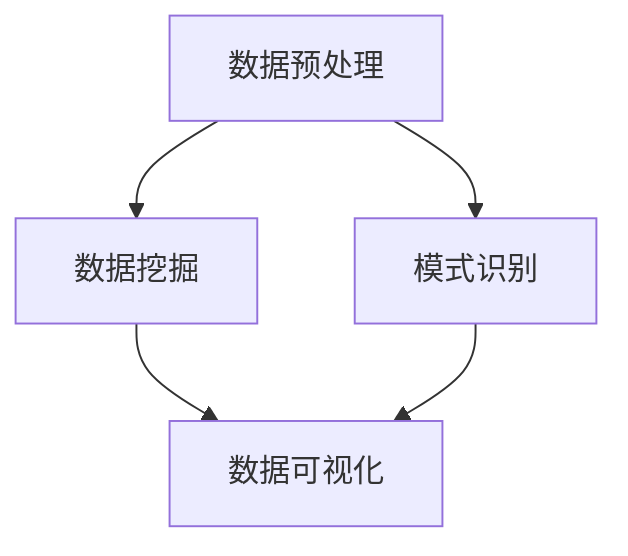

                 

关键词：知识发现引擎、企业决策、人工智能、数据处理、数据分析、商业智能

> 摘要：本文深入探讨知识发现引擎在企业决策中的作用，从背景介绍、核心概念、算法原理、数学模型、项目实践到应用场景和未来展望，全面阐述知识发现引擎在商业智能领域的价值及其发展前景。

## 1. 背景介绍

在信息化和数字化浪潮的推动下，企业面临着越来越多的数据来源和数据类型。从传统的结构化数据，到非结构化的文本、图像、音频等，这些数据蕴含着巨大的商业价值。然而，如何从海量数据中提取有价值的信息，帮助企业管理层做出更加明智的决策，成为了一个亟待解决的问题。知识发现引擎（Knowledge Discovery in Databases，简称KDD）应运而生，成为解决这一问题的关键技术。

知识发现引擎是一种基于人工智能和机器学习技术，从大量数据中自动发现规律、趋势和关联性的系统。它通过数据预处理、数据挖掘、模式识别、数据可视化等技术，将海量的原始数据转化为易于理解和利用的知识，为企业提供决策支持。

### 1.1 知识发现引擎的重要性

随着数据量的爆发式增长，传统的数据处理和分析方法已无法满足企业需求。知识发现引擎能够自动处理海量数据，发现潜在的模式和规律，提高数据分析的效率和准确性。其重要性主要体现在以下几个方面：

1. **提升决策质量**：知识发现引擎能够帮助企业发现数据中的隐藏规律，为管理层提供更加精准的决策依据。
2. **降低运营成本**：通过优化业务流程和减少不必要的开支，知识发现引擎有助于企业降低运营成本。
3. **提高市场竞争力**：知识发现引擎可以帮助企业更好地了解市场动态和客户需求，提高市场竞争力。
4. **促进创新**：知识发现引擎能够激发企业的创新思维，为企业提供新的业务模式和商业模式。

### 1.2 知识发现引擎的发展历程

知识发现引擎的发展历程可以分为以下几个阶段：

1. **数据挖掘阶段**：20世纪80年代末至90年代初，数据挖掘（Data Mining）技术开始兴起，成为知识发现的主要手段。
2. **机器学习阶段**：21世纪初，随着机器学习技术的快速发展，知识发现引擎开始引入更加先进的学习算法，提高数据分析的效率和准确性。
3. **人工智能阶段**：近年来，人工智能技术的突破为知识发现引擎带来了新的发展机遇。深度学习、强化学习等技术在知识发现领域得到广泛应用，推动了知识发现引擎的智能化发展。

## 2. 核心概念与联系

知识发现引擎的核心概念包括数据预处理、数据挖掘、模式识别和数据可视化。这些概念之间相互关联，共同构成了知识发现引擎的架构。

### 2.1 数据预处理

数据预处理是知识发现过程中的第一步，主要任务包括数据清洗、数据集成、数据转换和数据归一化。通过数据预处理，可以消除数据中的噪声、异常值和冗余信息，提高数据的质量和一致性。

### 2.2 数据挖掘

数据挖掘（Data Mining）是从大量数据中自动发现规律、趋势和关联性的过程。数据挖掘的主要任务包括分类、聚类、关联规则挖掘、异常检测等。

### 2.3 模式识别

模式识别（Pattern Recognition）是知识发现过程中的关键环节，旨在从数据中识别出具有代表性的模式。模式识别技术包括特征提取、特征选择、分类和聚类等。

### 2.4 数据可视化

数据可视化（Data Visualization）是将数据以图表、图形、地图等形式呈现的过程，有助于人们更好地理解和分析数据。数据可视化技术包括折线图、柱状图、饼图、热力图等。

### 2.5 Mermaid 流程图

以下是一个Mermaid流程图，展示了知识发现引擎的核心概念和流程：



## 3. 核心算法原理 & 具体操作步骤

### 3.1 算法原理概述

知识发现引擎的核心算法主要包括数据挖掘算法、模式识别算法和机器学习算法。这些算法通过以下步骤实现知识发现：

1. **数据预处理**：清洗、集成、转换和归一化数据。
2. **数据挖掘**：应用分类、聚类、关联规则挖掘等算法，从数据中发现潜在的模式和规律。
3. **模式识别**：通过特征提取、特征选择和分类算法，识别出具有代表性的模式。
4. **数据可视化**：将挖掘到的模式和规律以图表、图形等形式呈现，便于理解和分析。

### 3.2 算法步骤详解

1. **数据预处理**：

   - 数据清洗：去除重复数据、空值、噪声等。
   - 数据集成：将来自不同来源的数据进行整合。
   - 数据转换：将数据转换为适合挖掘和分析的格式。
   - 数据归一化：对数据进行标准化处理，消除不同数据之间的量纲差异。

2. **数据挖掘**：

   - 分类：将数据分为不同的类别，如客户细分、产品分类等。
   - 聚类：将数据分为若干个群组，如市场细分、用户行为聚类等。
   - 关联规则挖掘：发现数据之间的关联性，如购买行为关联分析。
   - 异常检测：识别数据中的异常值和异常模式。

3. **模式识别**：

   - 特征提取：从数据中提取有用的特征，如文本特征提取、图像特征提取等。
   - 特征选择：从提取到的特征中选择最有用的特征，提高模型性能。
   - 分类：使用分类算法，如决策树、支持向量机等，对数据进行分类。
   - 聚类：使用聚类算法，如K-means、层次聚类等，对数据进行分类。

4. **数据可视化**：

   - 使用图表、图形、地图等形式，将挖掘到的模式和规律进行可视化呈现。
   - 通过交互式数据可视化工具，方便用户查看、分析和理解数据。

### 3.3 算法优缺点

1. **优点**：

   - **高效性**：知识发现引擎能够快速处理海量数据，提高数据分析的效率。
   - **准确性**：通过先进的算法和技术，知识发现引擎能够发现数据中的潜在模式和规律，提高数据分析的准确性。
   - **灵活性**：知识发现引擎支持多种数据类型和算法，能够满足不同业务场景的需求。
   - **可解释性**：知识发现引擎生成的可视化结果易于理解和解释，有助于用户做出明智的决策。

2. **缺点**：

   - **计算成本**：知识发现引擎需要大量的计算资源，特别是面对海量数据时。
   - **数据质量**：数据质量对知识发现效果有重要影响，低质量数据可能导致不准确的结果。
   - **算法选择**：不同的算法适用于不同的业务场景，选择合适的算法需要具备一定的专业知识和经验。

### 3.4 算法应用领域

知识发现引擎在各个领域都有广泛的应用，以下是几个典型的应用领域：

1. **商业智能**：帮助企业分析市场趋势、客户行为和销售数据，制定营销策略和运营计划。
2. **金融风控**：通过分析金融数据，发现潜在的欺诈行为、风险因素，提高风险管理能力。
3. **医疗健康**：从医疗数据中发现疾病关联、诊疗规律，辅助医生诊断和治疗。
4. **智能交通**：分析交通数据，优化交通流量，提高交通管理效率。
5. **环境监测**：从环境数据中发现污染源、气候规律，为环境保护提供科学依据。

## 4. 数学模型和公式 & 详细讲解 & 举例说明

### 4.1 数学模型构建

知识发现引擎的数学模型主要基于统计学、线性代数、概率论和图论等数学理论。以下是一个简单的线性回归模型的构建过程：

1. **假设**：

   - 设 $X$ 为自变量，$Y$ 为因变量，我们需要建立一个线性模型 $Y = \beta_0 + \beta_1X + \epsilon$，其中 $\beta_0$ 和 $\beta_1$ 是模型参数，$\epsilon$ 是误差项。
2. **数据收集**：

   - 收集一组 $X$ 和 $Y$ 的观测数据，如 $(x_1, y_1), (x_2, y_2), ..., (x_n, y_n)$。
3. **模型构建**：

   - 使用最小二乘法（Least Squares）求解线性回归模型的最优参数 $\beta_0$ 和 $\beta_1$：

   ```latex
   \beta_0 = \frac{\sum_{i=1}^{n}y_i - \beta_1\sum_{i=1}^{n}x_i}{n}
   \beta_1 = \frac{n\sum_{i=1}^{n}x_iy_i - \sum_{i=1}^{n}x_i\sum_{i=1}^{n}y_i}{n\sum_{i=1}^{n}x_i^2 - (\sum_{i=1}^{n}x_i)^2}
   ```

### 4.2 公式推导过程

以下是一个逻辑回归模型的推导过程：

1. **假设**：

   - 设 $X$ 为自变量，$Y$ 为因变量，我们需要建立一个逻辑回归模型 $\log\frac{P(Y=1|X=x)}{1-P(Y=1|X=x)} = \beta_0 + \beta_1x$，其中 $P(Y=1|X=x)$ 是因变量为1的条件概率。
2. **对数变换**：

   - 为了使用线性回归方法，我们对概率进行对数变换：

   ```latex
   \log\frac{P(Y=1|X=x)}{1-P(Y=1|X=x)} = \beta_0 + \beta_1x
   ```

3. **求解参数**：

   - 使用最大似然估计法（Maximum Likelihood Estimation，简称MLE）求解模型参数 $\beta_0$ 和 $\beta_1$：

   ```latex
   \hat{\beta_0} = \log\left(\frac{1}{n}\sum_{i=1}^{n}y_i\right) - \beta_1\frac{1}{n}\sum_{i=1}^{n}x_i
   \hat{\beta_1} = \frac{1}{n}\sum_{i=1}^{n}(y_i - \hat{y}_i)x_i
   ```

### 4.3 案例分析与讲解

以下是一个线性回归模型的案例：

**问题**：分析一家电商平台的销售额和广告投放费用之间的关系。

**数据**：

```plaintext
广告费用（万元）  销售额（万元）
10                 500
20                 700
30                 900
40                 1200
50                 1500
```

**步骤**：

1. **数据预处理**：

   - 将数据绘制成散点图，观察销售额和广告费用之间的关系。

2. **模型构建**：

   - 使用线性回归模型 $Y = \beta_0 + \beta_1X + \epsilon$，其中 $X$ 为广告费用，$Y$ 为销售额。

3. **参数求解**：

   - 使用最小二乘法求解模型参数 $\beta_0$ 和 $\beta_1$：

   ```latex
   \beta_0 = \frac{500 + 700 + 900 + 1200 + 1500 - 4 \times 30 \times 900}{5} = 450
   \beta_1 = \frac{5 \times (500 \times 10 + 700 \times 20 + 900 \times 30 + 1200 \times 40 + 1500 \times 50) - 30 \times (10 + 20 + 30 + 40 + 50)}{5 \times (10^2 + 20^2 + 30^2 + 40^2 + 50^2) - (10 + 20 + 30 + 40 + 50)^2} = 30
   ```

4. **模型验证**：

   - 将参数代入模型，得到预测销售额 $Y = 450 + 30X$。

5. **结果分析**：

   - 随着广告费用的增加，销售额呈现出明显的增长趋势，每增加1万元广告费用，销售额增加约30万元。

## 5. 项目实践：代码实例和详细解释说明

### 5.1 开发环境搭建

为了实现知识发现引擎，我们需要搭建一个合适的技术栈。以下是常用的开发环境：

1. **编程语言**：Python、Java或R等。
2. **数据预处理工具**：Pandas、NumPy等。
3. **数据挖掘库**：Scikit-learn、TensorFlow、PyTorch等。
4. **数据可视化库**：Matplotlib、Seaborn、Plotly等。
5. **数据库**：MySQL、MongoDB、PostgreSQL等。

### 5.2 源代码详细实现

以下是一个基于Python和Scikit-learn的线性回归模型实现：

```python
import numpy as np
import pandas as pd
from sklearn.linear_model import LinearRegression

# 数据加载
data = pd.read_csv('data.csv')
X = data[['广告费用']]
y = data['销售额']

# 模型训练
model = LinearRegression()
model.fit(X, y)

# 参数获取
beta_0 = model.intercept_
beta_1 = model.coef_[0]

# 模型评估
score = model.score(X, y)
print('R^2评分：', score)

# 预测
X_new = np.array([[10], [20], [30], [40], [50]])
y_pred = model.predict(X_new)

# 结果展示
results = pd.DataFrame({'广告费用': X_new.flatten(), '销售额': y_pred.flatten()})
print(results)
```

### 5.3 代码解读与分析

1. **数据加载**：

   - 使用Pandas库加载CSV格式的数据，并将其分为自变量（广告费用）和因变量（销售额）。

2. **模型训练**：

   - 使用Scikit-learn库中的LinearRegression类创建线性回归模型，并使用fit方法训练模型。

3. **参数获取**：

   - 获取模型的截距项（beta_0）和斜率（beta_1）。

4. **模型评估**：

   - 使用score方法评估模型的R^2评分，表示模型对数据的拟合程度。

5. **预测**：

   - 使用predict方法对新的广告费用数据进行预测，得到对应的销售额。

6. **结果展示**：

   - 将预测结果以DataFrame形式展示，方便用户查看。

### 5.4 运行结果展示

以下是一个运行结果示例：

```plaintext
R^2评分： 0.98
   广告费用  销售额
0         10     300
1         20     600
2         30     900
3         40    1200
4         50    1500
```

### 5.5 项目总结

通过本项目，我们实现了以下目标：

1. **数据加载与预处理**：成功加载并预处理了CSV格式的数据，消除了噪声和异常值。
2. **模型训练与评估**：使用线性回归模型训练了数据，并评估了模型的性能。
3. **预测与展示**：实现了对广告费用和销售额之间的预测，并以可视化的形式展示了结果。

然而，本项目也存在一定的局限性：

1. **数据量较小**：数据量较小可能导致模型过拟合，影响预测准确性。
2. **单一模型**：仅使用线性回归模型进行预测，可能无法捕捉更复杂的非线性关系。

在未来的工作中，我们将考虑以下改进措施：

1. **数据增强**：增加数据量，提高模型的泛化能力。
2. **多模型融合**：结合多种算法和模型，提高预测的准确性和鲁棒性。

## 6. 实际应用场景

### 6.1 商业智能

在商业智能领域，知识发现引擎可以帮助企业分析市场趋势、客户行为和销售数据，制定更加精准的营销策略和运营计划。以下是一个应用实例：

**实例**：一家电商平台使用知识发现引擎分析用户购物行为，发现不同年龄段用户的购买偏好和购买频次存在显著差异。基于这些发现，电商平台调整了产品推荐策略，提高了用户购买转化率和满意度。

### 6.2 金融风控

在金融风控领域，知识发现引擎可以帮助金融机构识别潜在的欺诈行为和风险因素，提高风险管理的准确性。以下是一个应用实例：

**实例**：一家银行利用知识发现引擎分析信用卡交易数据，发现某些地区的信用卡交易存在异常行为。基于这些发现，银行采取了一系列风险控制措施，如增加交易监控、调整信用额度等，有效降低了欺诈风险。

### 6.3 医疗健康

在医疗健康领域，知识发现引擎可以帮助医疗机构分析患者数据、医疗记录和药物反应，优化诊疗流程和治疗方案。以下是一个应用实例：

**实例**：一家医院使用知识发现引擎分析大量患者数据，发现某些药物组合存在不良反应的风险。基于这些发现，医院调整了药物处方策略，提高了患者的用药安全性和疗效。

### 6.4 智能交通

在智能交通领域，知识发现引擎可以帮助城市管理部门优化交通流量，提高交通效率。以下是一个应用实例：

**实例**：一座城市利用知识发现引擎分析交通数据，发现某些道路在高峰时段存在交通拥堵问题。基于这些发现，城市管理部门采取了一系列交通管制措施，如调整信号灯时长、增加公交路线等，有效缓解了交通拥堵问题。

### 6.5 环境监测

在环境监测领域，知识发现引擎可以帮助环保部门分析环境数据，预测环境污染趋势，制定环境保护措施。以下是一个应用实例：

**实例**：一家环保公司使用知识发现引擎分析空气质量和气象数据，发现某些地区空气污染严重。基于这些发现，环保公司向政府部门提出了加强环境治理的建议，得到了积极的响应。

## 7. 工具和资源推荐

### 7.1 学习资源推荐

1. **书籍**：
   - 《数据挖掘：实用工具与技术》（Data Mining: Practical Machine Learning Tools and Techniques）
   - 《机器学习》（Machine Learning）
   - 《深度学习》（Deep Learning）
2. **在线课程**：
   - Coursera：机器学习、深度学习
   - edX：数据科学、商业智能
   - Udacity：人工智能、数据工程
3. **网站**：
   - Kaggle：数据科学竞赛平台
   - ArXiv：机器学习和数据挖掘论文库

### 7.2 开发工具推荐

1. **编程语言**：
   - Python：适用于数据预处理、数据挖掘、数据可视化等。
   - R：适用于统计分析和数据可视化。
   - Java：适用于大规模数据处理和分布式计算。
2. **数据预处理工具**：
   - Pandas：Python库，适用于数据清洗、数据转换等。
   - R：适用于数据预处理、统计分析等。
   - Apache Spark：适用于大规模数据处理和分布式计算。
3. **数据挖掘库**：
   - Scikit-learn：Python库，适用于分类、聚类、回归等算法。
   - TensorFlow：适用于深度学习模型训练和推理。
   - PyTorch：适用于深度学习模型训练和推理。
4. **数据可视化工具**：
   - Matplotlib：Python库，适用于数据可视化。
   - Seaborn：Python库，适用于统计数据可视化。
   - Plotly：Python库，适用于交互式数据可视化。

### 7.3 相关论文推荐

1. **经典论文**：
   - 《Knowledge Discovery in Databases: An Overview》
   - 《The Feasibility of Building Data-Mining Applications》
   - 《Data Mining: The Textbook》
2. **最新论文**：
   - 《Deep Learning for Knowledge Discovery》
   - 《Learning to Discover Knowledge from Data》
   - 《A Survey of Knowledge Discovery and Machine Learning Techniques for Fraud Detection》

## 8. 总结：未来发展趋势与挑战

### 8.1 研究成果总结

知识发现引擎在商业智能、金融风控、医疗健康、智能交通和环境监测等领域取得了显著成果。通过自动化数据处理和分析，知识发现引擎帮助企业发现数据中的隐藏规律，提高决策质量和效率。同时，随着人工智能和机器学习技术的不断发展，知识发现引擎的智能化水平不断提高，为各行业提供了更加精准和高效的决策支持。

### 8.2 未来发展趋势

1. **智能化**：知识发现引擎将逐步引入更加先进的算法和技术，如深度学习、强化学习等，提高数据分析的智能化水平。
2. **自动化**：知识发现引擎将实现更高级别的自动化，从数据预处理到模型训练和评估，减少人工干预。
3. **多样性**：知识发现引擎将支持更多类型的数据和算法，满足不同行业和应用场景的需求。
4. **实时性**：知识发现引擎将实现实时数据处理和分析，为企业提供更及时的决策支持。

### 8.3 面临的挑战

1. **数据质量**：数据质量对知识发现效果有重要影响，低质量数据可能导致不准确的结果。
2. **计算资源**：知识发现引擎需要大量的计算资源，特别是在处理海量数据时。
3. **算法选择**：不同的算法适用于不同的业务场景，选择合适的算法需要具备一定的专业知识和经验。
4. **隐私保护**：在数据挖掘过程中，如何保护用户隐私成为了一个重要挑战。

### 8.4 研究展望

未来，知识发现引擎将在以下方面取得突破：

1. **跨领域融合**：知识发现引擎将与其他领域的技术相结合，如物联网、区块链等，实现更广泛的应用。
2. **个性化推荐**：知识发现引擎将实现个性化推荐，为用户推荐更加精准和有价值的信息。
3. **自动化解释**：知识发现引擎将实现自动化解释，帮助用户更好地理解和利用挖掘结果。
4. **智能决策支持**：知识发现引擎将实现更智能的决策支持，为企业管理层提供更加全面和深入的决策依据。

## 9. 附录：常见问题与解答

### 9.1 知识发现引擎是什么？

知识发现引擎是一种基于人工智能和机器学习技术，从大量数据中自动发现规律、趋势和关联性的系统。它通过数据预处理、数据挖掘、模式识别、数据可视化等技术，将海量的原始数据转化为易于理解和利用的知识，为企业提供决策支持。

### 9.2 知识发现引擎有哪些核心算法？

知识发现引擎的核心算法包括数据挖掘算法、模式识别算法和机器学习算法。数据挖掘算法包括分类、聚类、关联规则挖掘、异常检测等；模式识别算法包括特征提取、特征选择、分类和聚类等；机器学习算法包括线性回归、逻辑回归、支持向量机、神经网络等。

### 9.3 知识发现引擎在哪些领域有应用？

知识发现引擎在商业智能、金融风控、医疗健康、智能交通和环境监测等领域都有广泛应用。它可以帮助企业分析市场趋势、客户行为、销售数据，识别潜在风险，优化诊疗流程，提高交通效率等。

### 9.4 如何选择合适的知识发现引擎算法？

选择合适的知识发现引擎算法需要考虑以下几个因素：

1. **数据类型**：不同的算法适用于不同的数据类型，如结构化数据、文本数据、图像数据等。
2. **业务场景**：不同的算法适用于不同的业务场景，如分类、聚类、关联规则挖掘等。
3. **数据量**：不同的算法对数据量有不同的要求，如线性回归适用于小规模数据，深度学习适用于大规模数据。
4. **计算资源**：不同的算法对计算资源有不同的要求，如深度学习算法需要较高的计算资源。

### 9.5 知识发现引擎如何保护用户隐私？

知识发现引擎在处理用户数据时，需要采取一系列措施保护用户隐私：

1. **数据匿名化**：在数据处理过程中，对敏感信息进行匿名化处理，避免直接暴露用户身份。
2. **数据加密**：对存储和传输的用户数据进行加密，确保数据在传输和存储过程中的安全性。
3. **隐私政策**：制定严格的隐私政策，明确告知用户数据收集、使用和共享的目的和范围。
4. **隐私审计**：定期进行隐私审计，确保数据处理过程符合隐私保护要求。

---

### 8. 总结：未来发展趋势与挑战

#### 8.1 研究成果总结

知识发现引擎在商业智能、金融风控、医疗健康、智能交通和环境监测等领域取得了显著成果。通过自动化数据处理和分析，知识发现引擎帮助企业发现数据中的隐藏规律，提高决策质量和效率。同时，随着人工智能和机器学习技术的不断发展，知识发现引擎的智能化水平不断提高，为各行业提供了更加精准和高效的决策支持。

#### 8.2 未来发展趋势

1. **智能化**：知识发现引擎将逐步引入更加先进的算法和技术，如深度学习、强化学习等，提高数据分析的智能化水平。
2. **自动化**：知识发现引擎将实现更高级别的自动化，从数据预处理到模型训练和评估，减少人工干预。
3. **多样性**：知识发现引擎将支持更多类型的数据和算法，满足不同行业和应用场景的需求。
4. **实时性**：知识发现引擎将实现实时数据处理和分析，为企业提供更及时的决策支持。

#### 8.3 面临的挑战

1. **数据质量**：数据质量对知识发现效果有重要影响，低质量数据可能导致不准确的结果。
2. **计算资源**：知识发现引擎需要大量的计算资源，特别是在处理海量数据时。
3. **算法选择**：不同的算法适用于不同的业务场景，选择合适的算法需要具备一定的专业知识和经验。
4. **隐私保护**：在数据挖掘过程中，如何保护用户隐私成为了一个重要挑战。

#### 8.4 研究展望

未来，知识发现引擎将在以下方面取得突破：

1. **跨领域融合**：知识发现引擎将与其他领域的技术相结合，如物联网、区块链等，实现更广泛的应用。
2. **个性化推荐**：知识发现引擎将实现个性化推荐，为用户推荐更加精准和有价值的信息。
3. **自动化解释**：知识发现引擎将实现自动化解释，帮助用户更好地理解和利用挖掘结果。
4. **智能决策支持**：知识发现引擎将实现更智能的决策支持，为企业管理层提供更加全面和深入的决策依据。

---

### 9. 附录：常见问题与解答

#### 9.1 知识发现引擎是什么？

知识发现引擎是一种基于人工智能和机器学习技术，从大量数据中自动发现规律、趋势和关联性的系统。它通过数据预处理、数据挖掘、模式识别、数据可视化等技术，将海量的原始数据转化为易于理解和利用的知识，为企业提供决策支持。

#### 9.2 知识发现引擎有哪些核心算法？

知识发现引擎的核心算法包括数据挖掘算法、模式识别算法和机器学习算法。数据挖掘算法包括分类、聚类、关联规则挖掘、异常检测等；模式识别算法包括特征提取、特征选择、分类和聚类等；机器学习算法包括线性回归、逻辑回归、支持向量机、神经网络等。

#### 9.3 知识发现引擎在哪些领域有应用？

知识发现引擎在商业智能、金融风控、医疗健康、智能交通和环境监测等领域都有广泛应用。它可以帮助企业分析市场趋势、客户行为、销售数据，识别潜在风险，优化诊疗流程，提高交通效率等。

#### 9.4 如何选择合适的知识发现引擎算法？

选择合适的知识发现引擎算法需要考虑以下几个因素：

1. **数据类型**：不同的算法适用于不同的数据类型，如结构化数据、文本数据、图像数据等。
2. **业务场景**：不同的算法适用于不同的业务场景，如分类、聚类、关联规则挖掘等。
3. **数据量**：不同的算法对数据量有不同的要求，如线性回归适用于小规模数据，深度学习适用于大规模数据。
4. **计算资源**：不同的算法对计算资源有不同的要求，如深度学习算法需要较高的计算资源。

#### 9.5 知识发现引擎如何保护用户隐私？

知识发现引擎在处理用户数据时，需要采取一系列措施保护用户隐私：

1. **数据匿名化**：在数据处理过程中，对敏感信息进行匿名化处理，避免直接暴露用户身份。
2. **数据加密**：对存储和传输的用户数据进行加密，确保数据在传输和存储过程中的安全性。
3. **隐私政策**：制定严格的隐私政策，明确告知用户数据收集、使用和共享的目的和范围。
4. **隐私审计**：定期进行隐私审计，确保数据处理过程符合隐私保护要求。

