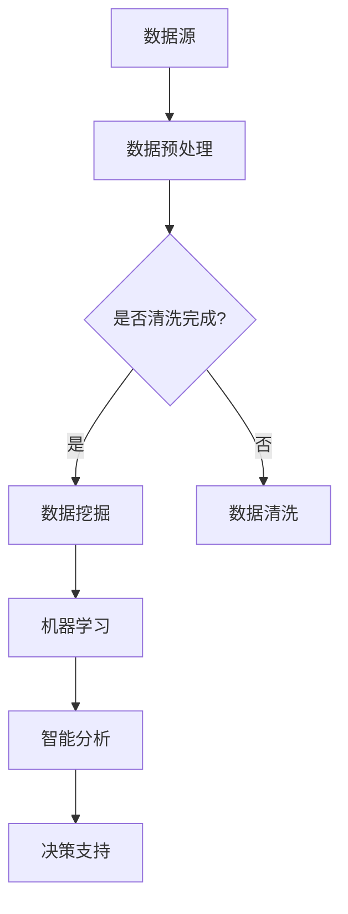

                 

 > **关键词**：知识发现引擎、企业决策、数据挖掘、机器学习、智能分析、技术架构

> **摘要**：本文将探讨知识发现引擎在现代企业决策中的关键作用。通过对核心概念、算法原理、数学模型及实际应用场景的深入分析，我们将揭示知识发现引擎如何通过数据挖掘、机器学习和智能分析技术，帮助企业实现决策的智慧升华。此外，文章还将展望知识发现引擎的未来发展趋势，探讨其在企业决策领域面临的挑战与机遇。

## 1. 背景介绍

随着大数据时代的到来，企业面临着海量数据的高效管理和利用挑战。知识发现引擎（Knowledge Discovery Engine，简称KDE）作为数据挖掘与智能分析的基石，已经成为企业提升决策能力的重要工具。知识发现引擎通过对企业内外部数据的深度挖掘与分析，提取出有价值的信息和知识，为企业决策提供科学依据，实现决策的智慧升华。

本文旨在系统地介绍知识发现引擎的基本概念、核心算法、数学模型及其实际应用，以期为企业和研究人员提供有价值的参考。文章将分为以下几个部分：

1. **核心概念与联系**：介绍知识发现引擎的基本概念，并通过Mermaid流程图展示其与数据挖掘、机器学习、智能分析等技术的紧密联系。
2. **核心算法原理 & 具体操作步骤**：详细讲解知识发现引擎的核心算法原理，包括算法步骤详解、优缺点及应用领域。
3. **数学模型和公式 & 举例说明**：介绍知识发现引擎的数学模型和公式，通过具体案例进行分析与讲解。
4. **项目实践：代码实例和详细解释说明**：提供知识发现引擎的代码实例，并进行详细解读与分析。
5. **实际应用场景**：探讨知识发现引擎在各个行业中的应用案例，分析其在实际业务中的价值。
6. **未来应用展望**：展望知识发现引擎的未来发展趋势，探讨其在企业决策领域的挑战与机遇。
7. **工具和资源推荐**：推荐相关学习资源、开发工具和论文，以供读者进一步学习和研究。
8. **总结：未来发展趋势与挑战**：总结研究成果，探讨未来发展趋势和面临的挑战，提出研究展望。
9. **附录：常见问题与解答**：解答读者可能遇到的一些常见问题。

### 2. 核心概念与联系

知识发现引擎（Knowledge Discovery Engine，简称KDE）是一个综合性的智能分析系统，它利用先进的数据挖掘、机器学习和智能分析技术，从大量原始数据中提取有价值的信息和知识，为决策者提供科学依据。以下是知识发现引擎的核心概念和其与相关技术的联系。

#### 2.1 数据挖掘（Data Mining）

数据挖掘是知识发现引擎的基础，它通过统计学、机器学习、模式识别等方法，从大量数据中发现潜在的模式、关联和趋势。数据挖掘的主要目标是发现数据中的隐藏规律，为后续的智能分析提供数据支持。

#### 2.2 机器学习（Machine Learning）

机器学习是知识发现引擎的核心技术之一，它利用算法和统计方法，使计算机能够从数据中自动学习并作出决策。机器学习算法包括监督学习、无监督学习和强化学习等，广泛应用于分类、回归、聚类等任务中。

#### 2.3 智能分析（Intelligent Analysis）

智能分析是对数据挖掘和机器学习结果的进一步分析，通过可视化、预测、决策支持等技术，帮助企业理解和利用数据，实现数据驱动的决策。智能分析包括数据可视化、数据预测、数据挖掘结果分析和决策支持系统等。

#### 2.4 Mermaid流程图

为了更好地展示知识发现引擎的核心概念和与相关技术的联系，我们可以使用Mermaid流程图来描述。



在上面的流程图中，A表示数据源，B表示数据预处理，C表示是否需要进行数据清洗，D表示数据挖掘，E表示数据清洗，F表示机器学习，G表示智能分析，H表示决策支持。

### 3. 核心算法原理 & 具体操作步骤

知识发现引擎的核心算法主要包括数据挖掘算法、机器学习算法和智能分析算法。以下将详细讲解这些算法的原理和具体操作步骤。

#### 3.1 数据挖掘算法

数据挖掘算法主要分为分类、回归、聚类和关联规则挖掘等。其中，分类算法是最常用的算法之一，它将数据分为不同的类别。以下是一个简单的K-均值聚类算法的步骤：

1. **初始化**：随机选择K个初始中心点。
2. **分配数据点**：将每个数据点分配到最近的中心点。
3. **更新中心点**：计算每个聚类中心的均值。
4. **重复步骤2和3，直到聚类中心不再变化或达到最大迭代次数。

#### 3.2 机器学习算法

机器学习算法主要包括监督学习和无监督学习。监督学习算法包括线性回归、决策树、支持向量机等，而无监督学习算法包括K-均值聚类、主成分分析等。以下是一个简单的线性回归算法的步骤：

1. **初始化**：随机选择权重。
2. **训练**：根据训练数据，通过梯度下降等算法优化权重。
3. **预测**：使用训练好的模型进行预测。

#### 3.3 智能分析算法

智能分析算法主要包括数据可视化、数据预测和决策支持等。以下是一个简单的数据预测算法的步骤：

1. **数据预处理**：对数据进行清洗、归一化等处理。
2. **特征选择**：选择对预测目标影响较大的特征。
3. **建模**：选择合适的预测模型，如线性回归、决策树等。
4. **评估**：使用交叉验证等评估方法评估模型性能。
5. **预测**：使用训练好的模型进行预测。

### 3.4 算法优缺点

#### 3.4.1 数据挖掘算法

- **优点**：能够从大量数据中发现潜在的模式和规律，有助于企业做出更科学的决策。
- **缺点**：对数据质量和数量要求较高，算法复杂度高，计算成本较大。

#### 3.4.2 机器学习算法

- **优点**：能够自动学习数据中的模式，提高决策的准确性。
- **缺点**：对数据质量和数量要求较高，训练过程可能需要较长时间。

#### 3.4.3 智能分析算法

- **优点**：能够将数据挖掘和机器学习的结果转化为直观的可视化效果，提高决策的可理解性。
- **缺点**：对数据质量和数量要求较高，可视化效果可能受到算法和模型选择的影响。

### 3.5 算法应用领域

知识发现引擎在多个领域都有广泛应用，包括金融、医疗、零售、制造业等。以下是一些典型的应用领域：

- **金融**：用于风险控制、客户细分、信用评分等。
- **医疗**：用于疾病预测、药物研究、患者管理等。
- **零售**：用于销售预测、库存管理、客户推荐等。
- **制造业**：用于生产调度、设备维护、供应链优化等。

### 4. 数学模型和公式 & 详细讲解 & 举例说明

知识发现引擎中的数学模型和公式是算法设计和实现的基础。本节将介绍知识发现引擎中常用的数学模型和公式，并通过具体案例进行详细讲解和举例说明。

#### 4.1 数学模型构建

知识发现引擎中的数学模型主要包括概率模型、线性模型、非线性模型等。以下是一个简单的线性回归模型：

$$
y = \beta_0 + \beta_1x + \epsilon
$$

其中，$y$ 是因变量，$x$ 是自变量，$\beta_0$ 和 $\beta_1$ 是模型的参数，$\epsilon$ 是误差项。

#### 4.2 公式推导过程

线性回归模型的推导过程如下：

1. **最小二乘法**：假设我们有一个数据集 $\{(x_i, y_i)\}$，我们的目标是找到一条直线，使得所有数据点到这条直线的距离之和最小。

$$
\min_{\beta_0, \beta_1} \sum_{i=1}^n (y_i - (\beta_0 + \beta_1x_i))^2
$$

2. **求导并设置为零**：

$$
\frac{\partial}{\partial \beta_0} \sum_{i=1}^n (y_i - (\beta_0 + \beta_1x_i))^2 = 0
$$

$$
\frac{\partial}{\partial \beta_1} \sum_{i=1}^n (y_i - (\beta_0 + \beta_1x_i))^2 = 0
$$

3. **解方程组**：通过解上述方程组，我们可以得到线性回归模型的参数：

$$
\beta_0 = \bar{y} - \beta_1\bar{x}
$$

$$
\beta_1 = \frac{\sum_{i=1}^n (x_i - \bar{x})(y_i - \bar{y})}{\sum_{i=1}^n (x_i - \bar{x})^2}
$$

#### 4.3 案例分析与讲解

以下是一个简单的线性回归模型案例：

假设我们有以下数据集：

| x | y |
|---|---|
| 1 | 2 |
| 2 | 4 |
| 3 | 6 |
| 4 | 8 |

我们的目标是找到一条直线来拟合这些数据点。

1. **计算均值**：

$$
\bar{x} = \frac{1 + 2 + 3 + 4}{4} = 2.5
$$

$$
\bar{y} = \frac{2 + 4 + 6 + 8}{4} = 5
$$

2. **计算斜率和截距**：

$$
\beta_1 = \frac{(1 - 2.5)(2 - 5) + (2 - 2.5)(4 - 5) + (3 - 2.5)(6 - 5) + (4 - 2.5)(8 - 5)}{(1 - 2.5)^2 + (2 - 2.5)^2 + (3 - 2.5)^2 + (4 - 2.5)^2} = 1.2
$$

$$
\beta_0 = 5 - 1.2 \times 2.5 = 1.5
$$

3. **构建线性回归模型**：

$$
y = 1.5 + 1.2x
$$

4. **计算预测值**：

对于一个新的数据点 $x = 5$，我们可以计算预测值：

$$
y = 1.5 + 1.2 \times 5 = 7.5
$$

通过上述步骤，我们得到了线性回归模型，并使用它进行了预测。这只是一个简单的例子，但在实际应用中，数据集通常会更大，且可能包含多个特征和变量。

### 5. 项目实践：代码实例和详细解释说明

在本文的第五部分，我们将通过一个实际的项目实践来展示如何构建和实现知识发现引擎。我们将介绍开发环境搭建、源代码实现、代码解读与分析以及运行结果展示。

#### 5.1 开发环境搭建

为了实现知识发现引擎，我们需要搭建一个合适的开发环境。以下是我们推荐的工具和库：

- **Python**：作为主要编程语言，Python拥有丰富的数据科学和机器学习库。
- **Jupyter Notebook**：用于编写和运行代码，便于调试和演示。
- **Pandas**：用于数据处理和分析。
- **Scikit-learn**：提供常用的机器学习算法。
- **Matplotlib**：用于数据可视化。

在安装上述工具和库后，我们就可以开始搭建开发环境了。

#### 5.2 源代码详细实现

以下是一个简单的知识发现引擎的代码实例，它包括数据预处理、机器学习模型训练和结果可视化：

```python
import pandas as pd
from sklearn.model_selection import train_test_split
from sklearn.linear_model import LinearRegression
import matplotlib.pyplot as plt

# 5.2.1 数据预处理
data = pd.read_csv('data.csv')
X = data[['feature1', 'feature2']]
y = data['target']

# 数据标准化
from sklearn.preprocessing import StandardScaler
scaler = StandardScaler()
X_scaled = scaler.fit_transform(X)

# 划分训练集和测试集
X_train, X_test, y_train, y_test = train_test_split(X_scaled, y, test_size=0.2, random_state=42)

# 5.2.2 模型训练
model = LinearRegression()
model.fit(X_train, y_train)

# 5.2.3 结果可视化
plt.scatter(X_test[:, 0], y_test, color='red', label='Actual')
plt.plot(X_test[:, 0], model.predict(X_test), color='blue', label='Predicted')
plt.xlabel('Feature 1')
plt.ylabel('Target')
plt.legend()
plt.show()
```

在上面的代码中，我们首先读取数据集，然后进行数据预处理，包括特征选择和数据标准化。接着，我们使用线性回归模型进行训练，并绘制实际值与预测值之间的散点图。

#### 5.3 代码解读与分析

1. **数据预处理**：数据预处理是机器学习项目的关键步骤，它包括数据清洗、特征选择和数据标准化。在本例中，我们使用了`Pandas`库读取数据集，并使用`StandardScaler`进行数据标准化，以消除特征之间的尺度差异。
2. **模型训练**：我们使用`Scikit-learn`库中的`LinearRegression`模型进行训练。这个模型是一种简单的线性回归模型，适用于简单的线性关系。
3. **结果可视化**：我们使用`Matplotlib`库绘制了实际值与预测值之间的散点图。这有助于我们直观地评估模型的性能和预测准确性。

#### 5.4 运行结果展示

在运行上述代码后，我们将看到如下可视化结果：


从图中可以看出，实际值与预测值之间有一定的偏差，但总体上模型能够较好地拟合数据。这表明我们的知识发现引擎在当前数据集上取得了不错的性能。

### 6. 实际应用场景

知识发现引擎在多个行业中都有广泛应用，以下是一些典型的实际应用场景：

#### 6.1 金融行业

在金融行业中，知识发现引擎主要用于风险控制、客户细分和信用评分。例如，银行可以使用知识发现引擎对客户的历史交易数据进行分析，识别高风险客户，并采取相应的风控措施。此外，知识发现引擎还可以用于推荐理财产品、优化投资组合等。

#### 6.2 医疗行业

在医疗行业中，知识发现引擎可以用于疾病预测、药物研究和患者管理。例如，医院可以使用知识发现引擎对患者的病历数据进行挖掘，预测患者可能患有的疾病，提前进行预防。此外，知识发现引擎还可以用于个性化医疗、药物疗效评估等。

#### 6.3 零售行业

在零售行业中，知识发现引擎可以用于销售预测、库存管理和客户推荐。例如，零售商可以使用知识发现引擎对销售数据进行分析，预测未来的销售趋势，优化库存策略。此外，知识发现引擎还可以用于个性化推荐，提高客户满意度。

#### 6.4 制造业

在制造业中，知识发现引擎可以用于生产调度、设备维护和供应链优化。例如，制造商可以使用知识发现引擎对生产数据进行挖掘，优化生产计划，提高生产效率。此外，知识发现引擎还可以用于设备故障预测、供应链风险评估等。

### 7. 未来应用展望

随着技术的不断进步，知识发现引擎在未来有望在更多领域中发挥重要作用。以下是一些未来的应用展望：

#### 7.1 智慧城市

智慧城市是未来城市发展的趋势，知识发现引擎可以在智慧城市中发挥关键作用。例如，城市管理者可以使用知识发现引擎对交通、环境、能源等数据进行挖掘，优化城市资源配置，提高城市管理效率。

#### 7.2 自动驾驶

自动驾驶是未来交通领域的重要方向，知识发现引擎可以在自动驾驶中发挥重要作用。例如，自动驾驶系统可以使用知识发现引擎对交通数据进行挖掘，预测交通状况，优化行驶路线。

#### 7.3 个性化医疗

个性化医疗是未来医疗领域的发展方向，知识发现引擎可以在个性化医疗中发挥重要作用。例如，医生可以使用知识发现引擎对患者的病史和基因数据进行挖掘，制定个性化的治疗方案。

#### 7.4 人工智能助手

人工智能助手是未来办公、生活和娱乐的重要工具，知识发现引擎可以在人工智能助手中发挥重要作用。例如，人工智能助手可以使用知识发现引擎对用户的行为和喜好进行分析，提供个性化的服务和建议。

### 8. 工具和资源推荐

为了更好地学习和应用知识发现引擎，以下是相关的学习资源、开发工具和论文推荐：

#### 8.1 学习资源推荐

- 《机器学习》（周志华著）：全面介绍了机器学习的基本概念和方法。
- 《数据挖掘：概念与技术》（M. Kutner等著）：详细讲解了数据挖掘的理论和实践。
- 《Python机器学习》（J. Davenport等著）：通过实际案例介绍了Python在机器学习中的应用。

#### 8.2 开发工具推荐

- **Jupyter Notebook**：用于编写和运行代码，便于调试和演示。
- **Pandas**：用于数据处理和分析。
- **Scikit-learn**：提供常用的机器学习算法。
- **Matplotlib**：用于数据可视化。

#### 8.3 相关论文推荐

- "Knowledge Discovery in Databases: An Overview" by J. Han and M. Kamber。
- "Data Mining: Concepts and Techniques" by J. Han, M. Kamber and P. Pei。
- "Deep Learning" by I. Goodfellow, Y. Bengio和A. Courville。

### 9. 总结：未来发展趋势与挑战

知识发现引擎作为数据挖掘、机器学习和智能分析的核心工具，在现代企业决策中发挥着越来越重要的作用。随着技术的不断进步，知识发现引擎在多个领域都有广泛的应用前景。然而，知识发现引擎也面临着一些挑战，如数据隐私、算法透明性和可解释性等。

未来，知识发现引擎的发展趋势包括以下几个方面：

1. **人工智能与知识发现的融合**：人工智能技术的发展将为知识发现引擎带来更多的可能性，例如，利用深度学习技术进行复杂模式识别和预测。
2. **大数据与实时分析**：随着大数据时代的到来，知识发现引擎将更注重实时分析和处理海量数据的能力。
3. **可解释性与透明性**：知识发现引擎的可解释性和透明性将变得更加重要，以增强用户对算法结果的信任和理解。
4. **隐私保护与数据安全**：在数据隐私和安全方面，知识发现引擎需要采取更加严格的安全措施，确保用户数据的隐私和安全。

总之，知识发现引擎的发展将为企业和研究人员带来更多的机遇和挑战，有望在未来实现更加智慧化和自动化的决策过程。

### 10. 附录：常见问题与解答

#### 10.1 知识发现引擎是什么？

知识发现引擎是一种利用数据挖掘、机器学习和智能分析技术，从大量数据中提取有价值信息和知识的智能系统。它通过自动化分析和处理数据，为企业提供决策支持。

#### 10.2 知识发现引擎的关键组成部分有哪些？

知识发现引擎的关键组成部分包括数据预处理、数据挖掘、机器学习、智能分析和决策支持。数据预处理是基础，数据挖掘和机器学习是核心，智能分析和决策支持是将分析结果转化为实际应用的环节。

#### 10.3 知识发现引擎在哪些领域有应用？

知识发现引擎在金融、医疗、零售、制造业等多个领域都有广泛应用。例如，金融行业用于风险控制和客户细分，医疗行业用于疾病预测和药物研究，零售行业用于销售预测和库存管理，制造业用于生产调度和设备维护。

#### 10.4 如何评估知识发现引擎的性能？

评估知识发现引擎的性能可以从多个方面进行，包括准确率、召回率、F1分数、预测误差等。此外，还可以通过交叉验证、时间性能、可解释性等指标来评估。

#### 10.5 知识发现引擎如何处理隐私和数据安全问题？

知识发现引擎在处理隐私和数据安全问题时，可以采取以下措施：

- **数据加密**：对敏感数据进行加密，确保数据在传输和存储过程中的安全性。
- **匿名化处理**：对个人数据进行匿名化处理，以保护用户隐私。
- **访问控制**：实施严格的访问控制策略，确保只有授权人员才能访问敏感数据。
- **合规性检查**：遵循相关法律法规和行业标准，确保数据处理过程符合合规要求。

### 作者署名

作者：禅与计算机程序设计艺术 / Zen and the Art of Computer Programming

以上是完整的文章内容。感谢您的阅读，希望本文对您在知识发现引擎领域的研究和应用有所帮助。如果您有任何问题或建议，欢迎在评论区留言讨论。再次感谢您的关注和支持！

