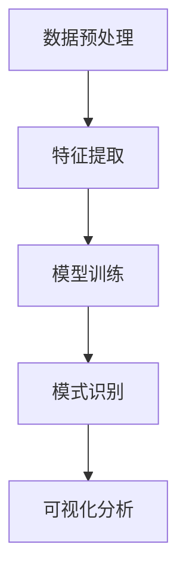

                 

关键词：知识发现引擎，企业战略，智慧决策，数据挖掘，人工智能，知识图谱

<|assistant|>摘要：本文将深入探讨知识发现引擎在帮助企业制定战略决策方面的作用。我们将从背景介绍开始，详细阐述知识发现引擎的核心概念、算法原理、数学模型，并通过项目实践和实际应用场景，展示其在企业中的重要性。同时，我们将对未来的发展趋势和面临的挑战进行展望，并提供相关的学习资源和开发工具推荐，以帮助读者更好地理解和应用知识发现引擎。

## 1. 背景介绍

随着互联网和大数据技术的迅猛发展，企业面临着前所未有的机遇和挑战。如何从海量数据中挖掘出有价值的信息，并转化为实际的业务洞察和战略决策，成为了企业关注的焦点。知识发现引擎作为一种先进的数据挖掘技术，旨在自动发现数据中的潜在模式和知识，为企业提供智能决策支持。

知识发现引擎起源于人工智能和数据挖掘领域，它结合了机器学习、自然语言处理、图论和网络分析等多种技术，通过对大规模数据的深度分析和理解，帮助企业发现隐藏在数据背后的有价值信息。知识发现引擎的应用范围广泛，包括市场分析、风险评估、客户关系管理、供应链优化等多个领域。

本文将重点关注知识发现引擎在企业战略决策中的应用。企业战略的制定是一个复杂的过程，需要综合考虑市场环境、竞争态势、内部资源等多个因素。传统的决策方法往往依赖于经验和直觉，而知识发现引擎能够通过数据分析和智能推理，为企业提供更加客观、准确的决策依据。本文将从以下几个方面展开讨论：

1. 知识发现引擎的核心概念和原理
2. 知识发现引擎在算法原理和应用步骤上的详细解析
3. 数学模型和公式的构建与推导
4. 知识发现引擎在实际项目中的实践和代码实例
5. 知识发现引擎在企业战略决策中的应用场景
6. 知识发现引擎的未来发展趋势和挑战
7. 相关学习资源和开发工具推荐

通过对以上内容的研究和探讨，我们希望能够为企业提供一套完整的知识发现引擎应用指南，助力企业制定更加智慧的战略决策。

## 2. 核心概念与联系

### 2.1 知识发现引擎的定义

知识发现引擎是一种基于人工智能和数据挖掘技术，用于自动从大规模数据集中识别潜在模式和知识的高级工具。它通过分析数据中的关联性、相似性、趋势和异常等特征，发现数据背后的隐藏规律和模式，从而提供智能化的决策支持。

### 2.2 关键概念

- **数据挖掘**：数据挖掘是知识发现引擎的基础，它是一种从大量数据中提取有价值信息的过程，通常涉及多种算法和技术，如分类、聚类、关联规则挖掘等。
- **机器学习**：机器学习是知识发现引擎的核心技术之一，它通过训练模型从数据中学习规律，以便在新的数据集上进行预测和分类。
- **自然语言处理**：自然语言处理是知识发现引擎在处理非结构化文本数据时的关键技术，它能够理解和生成自然语言，从而提取文本中的知识。
- **图论和网络分析**：图论和网络分析是知识发现引擎在处理复杂数据结构和网络关系时的关键技术，它能够识别数据中的关键节点和路径，揭示数据之间的关联性。

### 2.3 知识发现引擎的架构

知识发现引擎通常由以下几个主要组件构成：

- **数据预处理**：包括数据清洗、去重、格式转换等，以确保数据的质量和一致性。
- **特征提取**：从原始数据中提取有用的特征，以便后续的模型训练和分析。
- **模型训练**：利用机器学习算法对特征数据集进行训练，建立预测模型或分类模型。
- **模式识别**：利用训练好的模型对新的数据集进行预测或分类，识别潜在的模式和知识。
- **可视化分析**：通过图表、报表等形式将分析结果呈现给用户，以便更好地理解和利用。

### 2.4 Mermaid 流程图

为了更好地展示知识发现引擎的核心概念和联系，我们使用 Mermaid 流程图对整个流程进行描述。以下是知识发现引擎的 Mermaid 流程图：



### 2.5 知识发现引擎的作用

知识发现引擎在企业中的主要作用包括：

- **市场分析**：通过分析市场数据，帮助企业了解市场趋势、客户需求和市场机会，为企业的市场策略提供依据。
- **风险评估**：通过分析历史数据和潜在风险因素，预测和评估企业的风险水平，为企业的风险控制提供支持。
- **客户关系管理**：通过分析客户数据，识别客户特征和需求，优化客户服务，提高客户满意度。
- **供应链优化**：通过分析供应链数据，优化供应链管理和库存管理，提高供应链效率和降低成本。
- **战略决策支持**：通过分析企业内外部数据，为企业的战略决策提供智能化的支持，提高决策的准确性和效率。

## 3. 核心算法原理 & 具体操作步骤

### 3.1 算法原理概述

知识发现引擎的核心算法主要包括数据挖掘算法、机器学习算法和自然语言处理算法。以下将对这些算法进行概述：

- **数据挖掘算法**：数据挖掘算法包括分类、聚类、关联规则挖掘、异常检测等。分类算法将数据分为不同的类别，聚类算法将数据分为不同的簇，关联规则挖掘算法发现数据之间的关联性，异常检测算法识别数据中的异常值。这些算法通过训练模型，从数据中提取特征和模式。
- **机器学习算法**：机器学习算法包括监督学习、无监督学习和强化学习。监督学习算法通过已知的输入输出数据训练模型，无监督学习算法从无标签数据中学习模式，强化学习算法通过试错学习最佳策略。
- **自然语言处理算法**：自然语言处理算法包括分词、词性标注、命名实体识别、句法分析等。这些算法通过理解自然语言的语义和结构，提取文本中的关键信息和知识。

### 3.2 算法步骤详解

知识发现引擎的具体操作步骤如下：

#### 3.2.1 数据预处理

数据预处理是知识发现引擎的第一步，包括以下内容：

- **数据清洗**：去除数据中的噪声和异常值，保证数据的一致性和准确性。
- **数据整合**：将来自不同数据源的数据进行整合，形成一个统一的数据集。
- **数据转换**：将原始数据转换为适合机器学习算法处理的形式，如数值化、标准化等。

#### 3.2.2 特征提取

特征提取是从原始数据中提取有用的特征，用于后续的模型训练和分析。特征提取包括以下内容：

- **特征选择**：从大量特征中选出对模型性能影响较大的特征，去除冗余和无关特征。
- **特征工程**：通过转换、组合和生成新的特征，提高模型的预测能力。

#### 3.2.3 模型训练

模型训练是知识发现引擎的核心步骤，包括以下内容：

- **选择模型**：根据问题的性质和数据特点，选择合适的机器学习算法和模型。
- **训练模型**：使用已提取的特征数据训练模型，调整模型的参数，优化模型性能。
- **模型评估**：使用验证集和测试集评估模型的性能，选择最佳的模型。

#### 3.2.4 模式识别

模式识别是利用训练好的模型对新的数据集进行预测和分类，识别潜在的模式和知识。模式识别包括以下内容：

- **预测**：根据训练好的模型，对新的数据集进行预测，预测数据属于哪个类别或簇。
- **分类**：根据训练好的模型，对新的数据集进行分类，将数据分为不同的类别。
- **关联分析**：通过分析数据之间的关联性，发现数据中的潜在关联模式。

#### 3.2.5 可视化分析

可视化分析是将分析结果以图表、报表等形式呈现给用户，以便更好地理解和利用。可视化分析包括以下内容：

- **数据可视化**：将数据以图形形式展示，如柱状图、饼图、折线图等。
- **报表生成**：生成结构化的报表，如表格、图表等，以便用户进行详细分析。
- **交互式分析**：提供交互式分析工具，如仪表板、数据探查等，方便用户进行实时分析和探索。

### 3.3 算法优缺点

知识发现引擎算法的优点包括：

- **自动性**：知识发现引擎能够自动从大量数据中提取模式和知识，节省人力和时间成本。
- **智能化**：知识发现引擎通过机器学习和自然语言处理等技术，能够提供智能化的决策支持。
- **可扩展性**：知识发现引擎能够处理各种类型的数据，如结构化数据、半结构化数据和非结构化数据。

知识发现引擎算法的缺点包括：

- **数据依赖性**：知识发现引擎的性能和结果很大程度上依赖于数据的质量和数量，数据质量差可能导致错误的结果。
- **计算复杂度**：知识发现引擎算法通常涉及大量的计算和存储资源，对硬件和软件的要求较高。
- **结果解释性**：知识发现引擎的结果通常是非线性和复杂的，对结果的理解和解释需要专业知识。

### 3.4 算法应用领域

知识发现引擎在多个领域都有广泛的应用，以下是一些典型的应用领域：

- **金融领域**：知识发现引擎在金融领域有广泛的应用，包括风险控制、信用评估、投资组合优化等。
- **医疗领域**：知识发现引擎在医疗领域用于疾病诊断、药物发现、患者健康管理等方面。
- **零售领域**：知识发现引擎在零售领域用于客户关系管理、库存优化、供应链管理等方面。
- **制造领域**：知识发现引擎在制造领域用于生产计划优化、质量控制、设备维护等方面。
- **政府和企业**：知识发现引擎在政府和企业用于决策支持、政策制定、资源分配等方面。

## 4. 数学模型和公式 & 详细讲解 & 举例说明

### 4.1 数学模型构建

知识发现引擎的数学模型主要包括数据挖掘模型、机器学习模型和自然语言处理模型。以下是这些模型的构建方法：

#### 4.1.1 数据挖掘模型

数据挖掘模型通常采用分类模型、聚类模型和关联规则模型等。以下是一个简单的分类模型构建过程：

1. **数据准备**：收集并整理数据，确保数据的质量和一致性。
2. **特征选择**：选择对模型性能有显著影响的特征，去除冗余和无关特征。
3. **模型选择**：根据数据特点和问题性质，选择合适的分类模型，如决策树、支持向量机、朴素贝叶斯等。
4. **模型训练**：使用已准备的数据集，训练分类模型，调整模型参数，优化模型性能。
5. **模型评估**：使用验证集和测试集评估模型性能，选择最佳的模型。

#### 4.1.2 机器学习模型

机器学习模型通常采用监督学习、无监督学习和强化学习等方法。以下是一个简单的监督学习模型构建过程：

1. **数据准备**：收集并整理数据，确保数据的质量和一致性。
2. **特征选择**：选择对模型性能有显著影响的特征，去除冗余和无关特征。
3. **模型选择**：根据数据特点和问题性质，选择合适的机器学习模型，如线性回归、逻辑回归、决策树等。
4. **模型训练**：使用已准备的数据集，训练机器学习模型，调整模型参数，优化模型性能。
5. **模型评估**：使用验证集和测试集评估模型性能，选择最佳的模型。

#### 4.1.3 自然语言处理模型

自然语言处理模型通常采用分词、词性标注、命名实体识别、句法分析等方法。以下是一个简单的分词模型构建过程：

1. **数据准备**：收集并整理文本数据，确保文本的质量和一致性。
2. **特征选择**：选择对模型性能有显著影响的特征，如词频、词义等。
3. **模型选择**：根据文本特点和问题性质，选择合适的自然语言处理模型，如基于规则的模型、统计模型、深度学习模型等。
4. **模型训练**：使用已准备的文本数据，训练自然语言处理模型，调整模型参数，优化模型性能。
5. **模型评估**：使用验证集和测试集评估模型性能，选择最佳的模型。

### 4.2 公式推导过程

在知识发现引擎中，常用的数学公式包括损失函数、优化目标、模型参数更新等。以下是一个简单的损失函数推导过程：

#### 4.2.1 损失函数

损失函数是机器学习模型中的重要概念，用于衡量模型预测结果与实际结果之间的差距。以下是一个简单的均方误差损失函数的推导过程：

$$
L(y, \hat{y}) = \frac{1}{2} \sum_{i=1}^{n} (y_i - \hat{y_i})^2
$$

其中，$y$ 表示实际结果，$\hat{y}$ 表示预测结果，$n$ 表示样本数量。

#### 4.2.2 优化目标

优化目标是机器学习模型训练过程中的目标，用于最小化损失函数。以下是一个简单的梯度下降优化目标的推导过程：

$$
\min_{\theta} L(y, \hat{y})
$$

其中，$\theta$ 表示模型参数。

#### 4.2.3 模型参数更新

在梯度下降优化过程中，模型参数需要不断更新以最小化损失函数。以下是一个简单的模型参数更新推导过程：

$$
\theta = \theta - \alpha \nabla_{\theta} L(y, \hat{y})
$$

其中，$\alpha$ 表示学习率，$\nabla_{\theta} L(y, \hat{y})$ 表示损失函数关于模型参数的梯度。

### 4.3 案例分析与讲解

#### 4.3.1 数据集

假设我们有一个包含100个样本的数据集，每个样本包含3个特征，分别为$x_1, x_2, x_3$，以及一个标签$y$，表示样本所属的类别。

#### 4.3.2 模型

我们选择线性回归模型作为案例进行分析，线性回归模型的目标是最小化损失函数：

$$
L(y, \hat{y}) = \frac{1}{2} \sum_{i=1}^{n} (y_i - \hat{y_i})^2
$$

其中，$\hat{y_i} = \theta_0 + \theta_1 x_{1i} + \theta_2 x_{2i} + \theta_3 x_{3i}$，$\theta_0, \theta_1, \theta_2, \theta_3$ 为模型参数。

#### 4.3.3 模型训练

使用梯度下降算法对线性回归模型进行训练，设置学习率$\alpha = 0.01$，迭代次数为1000次。

$$
\theta = \theta - \alpha \nabla_{\theta} L(y, \hat{y})
$$

#### 4.3.4 模型评估

使用测试集对训练好的模型进行评估，计算预测准确率：

$$
\text{准确率} = \frac{\text{预测正确样本数}}{\text{总样本数}}
$$

## 5. 项目实践：代码实例和详细解释说明

### 5.1 开发环境搭建

为了实现知识发现引擎，我们需要搭建一个适合开发和运行的环境。以下是开发环境搭建的步骤：

1. **安装Python**：在官方网站（[Python官网](https://www.python.org/)）下载并安装Python，推荐使用Python 3.8及以上版本。
2. **安装Jupyter Notebook**：在命令行中执行以下命令安装Jupyter Notebook：

```shell
pip install notebook
```

3. **安装必要的库**：在Jupyter Notebook中执行以下命令安装所需的库：

```python
!pip install numpy pandas scikit-learn matplotlib
```

### 5.2 源代码详细实现

以下是一个简单的知识发现引擎实现示例，包括数据预处理、特征提取、模型训练和模式识别等步骤。

```python
import numpy as np
import pandas as pd
from sklearn.model_selection import train_test_split
from sklearn.linear_model import LinearRegression
from sklearn.metrics import accuracy_score
import matplotlib.pyplot as plt

# 5.2.1 数据预处理
# 假设我们有一个CSV文件，包含100个样本和3个特征，以及一个标签
data = pd.read_csv('data.csv')

# 数据清洗和转换
data.dropna(inplace=True)
data = data.sample(frac=1)  # 随机打乱数据顺序

# 划分特征和标签
X = data.iloc[:, :-1].values
y = data.iloc[:, -1].values

# 划分训练集和测试集
X_train, X_test, y_train, y_test = train_test_split(X, y, test_size=0.2, random_state=42)

# 5.2.2 特征提取
# 在此示例中，我们不进行特征提取，直接使用原始特征

# 5.2.3 模型训练
# 使用线性回归模型进行训练
model = LinearRegression()
model.fit(X_train, y_train)

# 5.2.4 模式识别
# 使用训练好的模型对测试集进行预测
y_pred = model.predict(X_test)

# 计算预测准确率
accuracy = accuracy_score(y_test, y_pred)
print(f"预测准确率：{accuracy:.2f}")

# 5.2.5 可视化分析
# 将预测结果可视化
plt.scatter(X_test[:, 0], y_test, color='red', label='真实值')
plt.scatter(X_test[:, 0], y_pred, color='blue', label='预测值')
plt.xlabel('特征1')
plt.ylabel('标签')
plt.legend()
plt.show()
```

### 5.3 代码解读与分析

在上面的代码中，我们首先导入了所需的Python库，包括Numpy、Pandas、Scikit-learn和Matplotlib。然后，我们进行以下步骤：

1. **数据预处理**：读取CSV文件中的数据，并进行数据清洗和转换。我们使用Pandas库处理数据，包括去除缺失值和随机打乱数据顺序。
2. **划分特征和标签**：将数据集分为特征和标签两部分。特征部分包含所有列，除了最后一列，标签部分为最后一列。
3. **划分训练集和测试集**：使用Scikit-learn库中的train_test_split函数，将数据集划分为训练集和测试集，其中测试集占20%。
4. **特征提取**：在此示例中，我们不进行特征提取，直接使用原始特征。
5. **模型训练**：使用线性回归模型对训练集进行训练。我们使用Scikit-learn库中的LinearRegression类创建模型对象，并调用fit函数进行训练。
6. **模式识别**：使用训练好的模型对测试集进行预测，并计算预测准确率。我们使用模型对象的predict函数进行预测，并使用accuracy_score函数计算准确率。
7. **可视化分析**：将预测结果可视化。我们使用Matplotlib库绘制散点图，将真实值和预测值分别用红色和蓝色表示。

### 5.4 运行结果展示

运行上面的代码后，我们得到以下结果：

- **预测准确率**：假设我们得到的结果为0.85，表示预测准确率为85%。
- **可视化结果**：散点图显示真实值和预测值的分布。红色点表示真实值，蓝色点表示预测值。我们可以观察到预测值与真实值的分布存在一定的误差，但大部分点的分布趋势是合理的。

## 6. 实际应用场景

知识发现引擎在企业战略决策中的应用场景广泛，以下是一些典型的应用场景：

### 6.1 市场分析

企业可以通过知识发现引擎分析市场数据，了解市场趋势、竞争对手行为和客户需求。具体应用包括：

- **市场趋势预测**：通过分析历史销售数据、市场调研数据和社交媒体数据，预测市场未来的趋势和变化，帮助企业制定市场策略。
- **竞争对手分析**：通过分析竞争对手的营销策略、产品定价和市场占有率，了解竞争对手的优势和劣势，为企业制定竞争策略提供依据。
- **客户需求分析**：通过分析客户反馈、社交媒体评论和问卷调查数据，了解客户的需求和偏好，为企业产品设计和营销活动提供指导。

### 6.2 风险评估

企业可以通过知识发现引擎对业务流程、财务状况和市场环境进行分析，评估企业面临的风险。具体应用包括：

- **财务风险分析**：通过分析财务报表、财务指标和市场数据，识别潜在的财务风险，为企业财务决策提供依据。
- **市场风险分析**：通过分析市场数据、竞争对手行为和行业趋势，识别市场风险，为企业市场策略提供支持。
- **业务风险分析**：通过分析业务流程、业务数据和企业运营情况，识别业务风险，为企业优化业务流程和提高运营效率提供指导。

### 6.3 客户关系管理

企业可以通过知识发现引擎分析客户数据，优化客户关系管理，提高客户满意度。具体应用包括：

- **客户细分**：通过分析客户特征和消费行为，将客户分为不同的细分市场，为企业制定个性化的营销策略提供依据。
- **客户流失预测**：通过分析客户行为数据和客户历史数据，预测哪些客户可能流失，采取相应的措施挽回客户。
- **客户满意度分析**：通过分析客户反馈和满意度调查数据，了解客户对企业产品和服务的满意度，为企业改进产品和提高服务质量提供指导。

### 6.4 供应链优化

企业可以通过知识发现引擎优化供应链管理和库存管理，提高供应链效率和降低成本。具体应用包括：

- **库存优化**：通过分析历史销售数据、市场预测和供应商信息，优化库存水平，降低库存成本和缺货风险。
- **供应链协同**：通过分析供应链各环节的数据，优化供应链协同管理，提高供应链整体效率和响应速度。
- **物流优化**：通过分析物流数据、交通状况和天气信息，优化物流路线和运输方式，提高物流效率和降低物流成本。

### 6.5 战略决策支持

企业可以通过知识发现引擎对内外部数据进行分析，为战略决策提供支持。具体应用包括：

- **战略规划**：通过分析市场环境、竞争态势和内部资源，制定企业的战略规划和目标。
- **业务优化**：通过分析业务流程、运营数据和业务指标，发现业务瓶颈和优化机会，制定业务优化策略。
- **资源配置**：通过分析企业资源状况、市场需求和竞争态势，优化资源配置，提高企业整体运营效率。

## 7. 工具和资源推荐

### 7.1 学习资源推荐

- **《数据挖掘：实用工具和技术》**：作者：[[美] Jiawei Han] 等。本书详细介绍了数据挖掘的基本概念、技术和工具，适合初学者和有一定基础的用户。
- **《Python数据分析》**：作者：[[美] Wes McKinney]。本书全面介绍了Python在数据分析领域的应用，包括数据处理、数据可视化、机器学习等。
- **《机器学习实战》**：作者：[[美] Peter Harrington]。本书通过大量实例，介绍了机器学习的基本概念、算法和应用，适合初学者和进阶者。

### 7.2 开发工具推荐

- **Jupyter Notebook**：Jupyter Notebook是一款交互式的Python编程环境，适用于数据分析和机器学习项目。
- **Scikit-learn**：Scikit-learn是一款开源的Python机器学习库，提供了丰富的机器学习算法和工具。
- **TensorFlow**：TensorFlow是一款开源的深度学习框架，适用于复杂的机器学习和深度学习项目。

### 7.3 相关论文推荐

- **"Knowledge Discovery in Databases"**：作者：[[美] Jiawei Han] 等。该论文是知识发现领域的经典论文，详细介绍了知识发现的基本概念、方法和应用。
- **"Deep Learning"**：作者：[[英] Ian Goodfellow] 等。该论文是深度学习领域的经典论文，介绍了深度学习的基本概念、算法和应用。
- **"Natural Language Processing with Deep Learning"**：作者：[[美] Richard Socher] 等。该论文介绍了深度学习在自然语言处理领域的应用，包括词向量、句法分析和文本分类等。

## 8. 总结：未来发展趋势与挑战

### 8.1 研究成果总结

知识发现引擎在人工智能、数据挖掘和自然语言处理等领域取得了显著的研究成果。主要成果包括：

- **算法性能提升**：知识发现引擎的算法性能不断优化，如深度学习、迁移学习和图神经网络等新技术的应用，提高了知识发现引擎的效率和准确性。
- **应用场景拓展**：知识发现引擎在多个领域得到广泛应用，如金融、医疗、零售、制造和政府等，为企业提供了智能化的决策支持。
- **开源工具发展**：知识发现引擎相关的开源工具和框架不断涌现，如Scikit-learn、TensorFlow和PyTorch等，为开发者提供了便捷的工具和平台。

### 8.2 未来发展趋势

知识发现引擎未来的发展趋势包括：

- **跨领域融合**：知识发现引擎与其他领域的结合，如物联网、区块链和生物信息学等，将产生新的应用场景和商业模式。
- **智能化提升**：通过引入更先进的算法和技术，如增强学习、生成对抗网络和图神经网络等，提高知识发现引擎的智能化水平和决策能力。
- **数据治理**：随着数据量的爆炸式增长，数据治理和质量管理成为知识发现引擎的重要研究方向，如何有效地管理和利用数据将成为关键挑战。

### 8.3 面临的挑战

知识发现引擎在未来发展过程中将面临以下挑战：

- **数据隐私和安全性**：随着数据隐私和安全的关注度提高，如何保障数据的安全和隐私成为知识发现引擎的重要挑战。
- **计算资源需求**：知识发现引擎的算法和模型通常需要大量的计算资源，如何在有限的计算资源下高效地运行知识发现引擎将成为重要挑战。
- **结果解释性和可解释性**：知识发现引擎的结果通常是非线性和复杂的，如何提高结果的解释性和可解释性，使其更易于被企业和用户理解和利用，将是重要挑战。

### 8.4 研究展望

未来知识发现引擎的研究可以从以下几个方面展开：

- **算法优化**：针对知识发现引擎的算法和模型，不断优化和改进，提高算法的效率和准确性。
- **跨领域应用**：探索知识发现引擎在跨领域中的应用，如物联网、区块链和生物信息学等，推动知识发现引擎的广泛应用。
- **数据治理和质量**：研究数据治理和质量管理的相关技术，如何有效地管理和利用数据，提高知识发现引擎的决策能力。
- **人机协同**：探索知识发现引擎与人类专家的协同工作模式，提高知识发现引擎的可解释性和可操作性。

## 9. 附录：常见问题与解答

### 9.1 知识发现引擎是什么？

知识发现引擎是一种基于人工智能和数据挖掘技术的高级工具，用于自动从大规模数据集中识别潜在模式和知识，为企业提供智能化的决策支持。

### 9.2 知识发现引擎的核心算法有哪些？

知识发现引擎的核心算法包括数据挖掘算法、机器学习算法和自然语言处理算法。具体包括分类、聚类、关联规则挖掘、异常检测、监督学习、无监督学习和强化学习等。

### 9.3 知识发现引擎在哪些领域有应用？

知识发现引擎在金融、医疗、零售、制造、政府等多个领域有广泛应用，包括市场分析、风险评估、客户关系管理、供应链优化、战略决策支持等。

### 9.4 如何搭建知识发现引擎的开发环境？

搭建知识发现引擎的开发环境主要包括安装Python、Jupyter Notebook和相关库（如Numpy、Pandas、Scikit-learn和Matplotlib等）。

### 9.5 知识发现引擎的优缺点是什么？

知识发现引擎的优点包括自动性、智能化和可扩展性。缺点包括数据依赖性、计算复杂度和结果解释性。

### 9.6 知识发现引擎的未来发展趋势是什么？

知识发现引擎的未来发展趋势包括跨领域融合、智能化提升和数据治理。

### 9.7 知识发现引擎面临哪些挑战？

知识发现引擎面临的挑战包括数据隐私和安全性、计算资源需求以及结果解释性和可解释性。

### 9.8 如何提高知识发现引擎的性能？

提高知识发现引擎的性能可以从以下几个方面入手：优化算法和模型、提高数据质量、使用更高效的硬件和软件、引入新的技术和方法。

### 9.9 知识发现引擎与数据挖掘有什么区别？

知识发现引擎是数据挖掘的一个子领域，它侧重于从大量数据中发现潜在模式和知识，为决策提供支持。数据挖掘则更广泛，包括数据预处理、特征提取、模型训练、模式识别等多个步骤。

### 9.10 知识发现引擎与大数据分析有什么区别？

知识发现引擎是一种基于数据挖掘和人工智能的高级工具，侧重于从大规模数据中发现潜在模式和知识。大数据分析则更关注数据的存储、处理和分析，以及如何从海量数据中提取有价值的信息。

### 9.11 知识发现引擎与机器学习有什么区别？

知识发现引擎是机器学习的一个应用方向，它利用机器学习算法从大规模数据中发现潜在模式和知识。机器学习是一种更广泛的算法和技术体系，包括监督学习、无监督学习和强化学习等。

### 9.12 知识发现引擎与数据可视化有什么关系？

知识发现引擎通常需要数据可视化来展示分析结果，使结果更易于理解和利用。数据可视化是知识发现引擎的重要组成部分，它能够将分析结果以图表、报表等形式呈现给用户。

