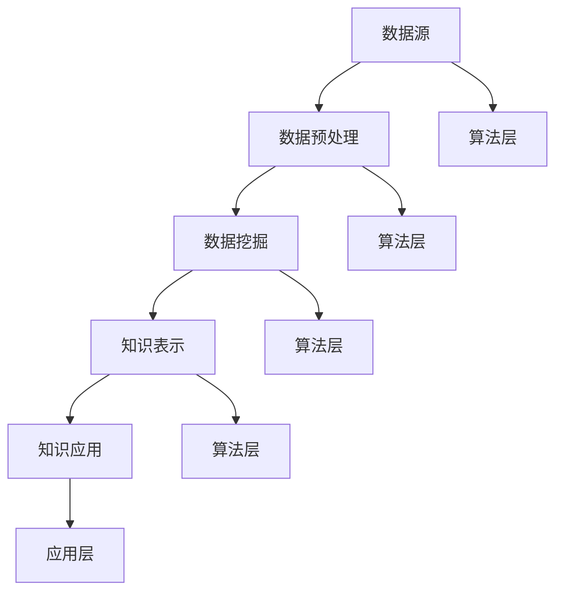

                 

关键词：知识发现引擎、医疗领域、智慧医疗、大数据、算法、人工智能

> 摘要：本文将探讨知识发现引擎在医疗领域的重要性，介绍其核心概念、原理以及应用。我们将分析知识发现引擎如何通过大数据分析、人工智能等技术手段，为医疗行业带来深刻的变革，并展望其未来发展的前景。

## 1. 背景介绍

在当今信息化时代，医疗领域正经历着一场深刻的变革。随着医疗大数据的迅速增长，医疗机构面临着海量的数据需要处理和分析。传统的数据处理方法已无法满足医疗行业的复杂需求，因此，知识发现引擎作为一种新兴的技术手段，应运而生。

知识发现引擎（Knowledge Discovery Engine，简称KDE）是一种用于从大量数据中自动挖掘出有用知识的工具。它结合了大数据分析、人工智能、机器学习等技术，通过对医疗数据的深入挖掘和分析，为医疗行业提供了新的解决方案。

### 1.1 知识发现引擎的定义和作用

知识发现引擎的定义：知识发现引擎是一种能够从海量数据中自动识别出潜在模式、关联关系和规律的工具。它通过运用数据挖掘、机器学习等算法，实现从原始数据到知识的高效转换。

知识发现引擎的作用：知识发现引擎在医疗领域的应用非常广泛，主要包括以下几个方面：

1. **临床决策支持**：通过分析患者的病历、检查结果等数据，知识发现引擎可以为医生提供个性化的诊断建议和治疗方案。

2. **疾病预测与预防**：通过对历史数据和当前数据的分析，知识发现引擎可以预测疾病的发生风险，并提前采取预防措施。

3. **药物研发**：知识发现引擎可以帮助研究人员从海量的药物数据中挖掘出潜在的药物作用机制和新药候选。

4. **医疗资源优化**：通过对医疗机构运行数据的分析，知识发现引擎可以帮助优化医疗资源配置，提高医疗服务效率。

## 2. 核心概念与联系

### 2.1 知识发现引擎的核心概念

知识发现引擎的核心概念包括数据源、数据预处理、数据挖掘、知识表示和知识应用。

**数据源**：知识发现引擎的数据源包括医疗机构内部的电子病历、检查报告、医疗影像等，以及外部的公共卫生数据、科研文献等。

**数据预处理**：数据预处理是知识发现过程的第一步，主要包括数据清洗、数据转换和数据集成。通过数据预处理，可以确保数据的准确性和一致性，为后续的数据挖掘奠定基础。

**数据挖掘**：数据挖掘是知识发现引擎的核心功能，通过运用各种算法，如分类、聚类、关联规则挖掘等，从海量数据中挖掘出潜在的规律和模式。

**知识表示**：知识表示是将挖掘出的潜在知识以某种形式表示出来，如规则、模式、知识图谱等。

**知识应用**：知识应用是将挖掘出的知识应用于实际场景，如辅助诊断、治疗方案推荐等。

### 2.2 知识发现引擎的架构

知识发现引擎的架构可以分为以下几个层次：

1. **数据层**：包括数据源和数据预处理模块，负责收集和整理医疗数据。

2. **算法层**：包括各种数据挖掘算法和机器学习算法，如分类、聚类、关联规则挖掘等。

3. **知识层**：包括知识表示和知识应用模块，负责将挖掘出的知识表示出来，并应用于实际场景。

4. **应用层**：包括各种应用模块，如临床决策支持系统、疾病预测系统等。

### 2.3 知识发现引擎的 Mermaid 流程图



## 3. 核心算法原理 & 具体操作步骤

### 3.1 算法原理概述

知识发现引擎的核心算法包括数据挖掘算法和机器学习算法。其中，数据挖掘算法主要包括分类、聚类、关联规则挖掘等；机器学习算法主要包括决策树、支持向量机、神经网络等。

分类算法：通过将数据分为不同的类别，帮助医生进行疾病诊断和治疗决策。

聚类算法：将相似的数据点分为不同的簇，帮助医生发现潜在的患者群体。

关联规则挖掘：发现数据之间的关联关系，帮助医生制定个性化的治疗方案。

机器学习算法：通过训练模型，让模型学会自动识别数据中的规律，提高诊断和预测的准确性。

### 3.2 算法步骤详解

1. **数据预处理**：包括数据清洗、数据转换和数据集成。数据清洗主要是去除重复数据、缺失数据和异常数据；数据转换主要是将不同类型的数据转换为同一类型的数据；数据集成主要是将不同来源的数据整合在一起。

2. **特征选择**：从原始数据中选择出对知识发现最有用的特征。特征选择的方法有信息增益、卡方检验等。

3. **模型训练**：使用数据挖掘算法和机器学习算法对数据进行训练，建立模型。

4. **模型评估**：使用训练集和测试集对模型进行评估，确定模型的准确性和可靠性。

5. **知识表示**：将挖掘出的知识以规则、模式、知识图谱等形式表示出来。

6. **知识应用**：将表示出来的知识应用于实际场景，如辅助诊断、治疗方案推荐等。

### 3.3 算法优缺点

**分类算法**：优点是直观、易于理解；缺点是对于复杂的非线性问题效果不佳。

**聚类算法**：优点是能够发现潜在的患者群体；缺点是对于类别划分不明确的问题效果较差。

**关联规则挖掘**：优点是能够发现数据之间的关联关系；缺点是对于高维数据效果不佳。

**机器学习算法**：优点是能够自动学习数据中的规律，提高诊断和预测的准确性；缺点是需要大量的数据和计算资源。

### 3.4 算法应用领域

知识发现引擎在医疗领域的应用非常广泛，主要包括以下几个方面：

1. **临床决策支持**：通过知识发现引擎，医生可以更准确地诊断疾病，制定个性化的治疗方案。

2. **疾病预测与预防**：通过分析患者的病历和检查结果，知识发现引擎可以预测疾病的发生风险，提前采取预防措施。

3. **药物研发**：通过分析药物数据，知识发现引擎可以帮助研究人员发现新的药物作用机制和新药候选。

4. **医疗资源优化**：通过对医疗机构的运行数据进行分析，知识发现引擎可以帮助优化医疗资源配置，提高医疗服务效率。

## 4. 数学模型和公式 & 详细讲解 & 举例说明

### 4.1 数学模型构建

知识发现引擎中的数学模型主要包括分类模型、聚类模型和关联规则模型。

**分类模型**：假设有 n 个类别，每个类别对应一个标签，数据集中的每个数据点都可以表示为一个 n 维向量，分类模型的目标是找出一个决策边界，将数据点划分到不同的类别中。

$$
\begin{aligned}
& \min_{w,b} \sum_{i=1}^{n} (y_i - w \cdot x_i - b)^2 \\
\end{aligned}
$$

其中，$w$ 和 $b$ 分别是模型的权重和偏置，$y_i$ 是第 i 个数据点的标签，$x_i$ 是第 i 个数据点的特征向量。

**聚类模型**：假设有 k 个聚类中心，每个聚类中心对应一个 k 维向量，聚类模型的目标是找出最佳的聚类中心，将数据点划分到不同的簇中。

$$
\begin{aligned}
& \min_{\mu_1, \mu_2, ..., \mu_k} \sum_{i=1}^{n} \sum_{j=1}^{k} (x_i - \mu_j)^2 \\
\end{aligned}
$$

其中，$\mu_1, \mu_2, ..., \mu_k$ 分别是第 1、2、...、k 个聚类中心，$x_i$ 是第 i 个数据点的特征向量。

**关联规则模型**：假设有 m 个商品，每个商品对应一个编号，关联规则模型的目标是找出购买某些商品时，其他商品也被购买的概率。

$$
\begin{aligned}
& \max_{A,B} \frac{support(A \cup B)}{support(A) \cdot support(B)} \\
\end{aligned}
$$

其中，$A$ 和 $B$ 分别是两个不同的商品集合，$support(A \cup B)$ 表示同时购买 A 和 B 的概率，$support(A)$ 和 $support(B)$ 分别表示购买 A 和 B 的概率。

### 4.2 公式推导过程

**分类模型**：使用梯度下降法求解最小二乘问题。

$$
\begin{aligned}
& \nabla_{w,b} \min_{w,b} \sum_{i=1}^{n} (y_i - w \cdot x_i - b)^2 \\
\end{aligned}
$$

$$
\begin{aligned}
& \nabla_w \min_{w,b} \sum_{i=1}^{n} (y_i - w \cdot x_i - b)^2 = -2 \sum_{i=1}^{n} (y_i - w \cdot x_i - b) \cdot x_i \\
& \nabla_b \min_{w,b} \sum_{i=1}^{n} (y_i - w \cdot x_i - b)^2 = -2 \sum_{i=1}^{n} (y_i - w \cdot x_i - b) \\
\end{aligned}
$$

通过迭代更新权重和偏置，可以逐步逼近最小二乘问题的解。

**聚类模型**：使用梯度下降法求解最小平方问题。

$$
\begin{aligned}
& \nabla_{\mu_1, \mu_2, ..., \mu_k} \min_{\mu_1, \mu_2, ..., \mu_k} \sum_{i=1}^{n} \sum_{j=1}^{k} (x_i - \mu_j)^2 \\
\end{aligned}
$$

$$
\begin{aligned}
& \nabla_{\mu_j} \min_{\mu_1, \mu_2, ..., \mu_k} \sum_{i=1}^{n} \sum_{j=1}^{k} (x_i - \mu_j)^2 = -2 \sum_{i=1}^{n} (x_i - \mu_j) \\
\end{aligned}
$$

通过迭代更新聚类中心，可以逐步逼近最小平方问题的解。

**关联规则模型**：使用支持度、置信度和提升度来衡量关联规则的强度。

$$
\begin{aligned}
& support(A \cup B) = \frac{count(A \cup B)}{total\_transactions} \\
& confidence(A \rightarrow B) = \frac{support(A \cup B)}{support(A)} \\
& lift(A \rightarrow B) = \frac{confidence(A \rightarrow B)}{confidence(B)} \\
\end{aligned}
$$

### 4.3 案例分析与讲解

假设有一个医疗数据集，包含患者的病历、检查结果和诊断结果。现在使用知识发现引擎进行疾病预测，分析以下问题：

1. **数据预处理**：首先对数据进行清洗，去除重复数据、缺失数据和异常数据。然后进行数据转换，将不同类型的数据转换为同一类型的数据，如将年龄、身高、体重等数据进行归一化处理。

2. **特征选择**：从原始数据中选择出对疾病预测最有用的特征，如病史、检查结果、药物使用情况等。

3. **模型训练**：使用分类算法，如逻辑回归、支持向量机等，对数据进行训练，建立疾病预测模型。

4. **模型评估**：使用训练集和测试集对模型进行评估，确定模型的准确性和可靠性。

5. **知识表示**：将训练好的模型表示为规则或决策树，用于辅助医生进行疾病预测。

6. **知识应用**：将表示好的知识应用于实际场景，如对患者进行疾病预测，为医生提供诊断建议。

通过以上步骤，知识发现引擎可以帮助医生更准确地预测疾病，提高诊断的准确性。同时，知识发现引擎还可以发现潜在的危险因素，为疾病的预防提供依据。

## 5. 项目实践：代码实例和详细解释说明

### 5.1 开发环境搭建

为了方便读者理解和实践，我们将使用 Python 作为开发语言，结合常用的机器学习库如 scikit-learn、tensorflow 等，搭建一个简单的知识发现引擎项目。

首先，安装必要的库：

```bash
pip install numpy scipy scikit-learn tensorflow matplotlib
```

### 5.2 源代码详细实现

以下是一个简单的知识发现引擎项目的代码实现，包括数据预处理、模型训练、模型评估等步骤。

```python
import numpy as np
import pandas as pd
from sklearn.model_selection import train_test_split
from sklearn.preprocessing import StandardScaler
from sklearn.ensemble import RandomForestClassifier
from sklearn.metrics import accuracy_score

# 5.2.1 数据预处理
def preprocess_data(data):
    # 数据清洗：去除重复数据、缺失数据和异常数据
    data.drop_duplicates(inplace=True)
    data.fillna(data.mean(), inplace=True)
    
    # 数据转换：将不同类型的数据转换为同一类型的数据
    data['age'] = data['age'].astype(float)
    data['height'] = data['height'].astype(float)
    data['weight'] = data['weight'].astype(float)
    
    return data

# 5.2.2 模型训练
def train_model(X_train, y_train):
    # 使用随机森林分类器进行训练
    clf = RandomForestClassifier(n_estimators=100)
    clf.fit(X_train, y_train)
    
    return clf

# 5.2.3 模型评估
def evaluate_model(clf, X_test, y_test):
    # 使用测试集对模型进行评估
    y_pred = clf.predict(X_test)
    accuracy = accuracy_score(y_test, y_pred)
    
    return accuracy

# 5.2.4 主函数
def main():
    # 加载数据集
    data = pd.read_csv('medical_data.csv')
    
    # 数据预处理
    data = preprocess_data(data)
    
    # 分割数据集
    X = data.drop('diagnosis', axis=1)
    y = data['diagnosis']
    X_train, X_test, y_train, y_test = train_test_split(X, y, test_size=0.2, random_state=42)
    
    # 数据标准化
    scaler = StandardScaler()
    X_train = scaler.fit_transform(X_train)
    X_test = scaler.transform(X_test)
    
    # 模型训练
    clf = train_model(X_train, y_train)
    
    # 模型评估
    accuracy = evaluate_model(clf, X_test, y_test)
    
    print(f'Model accuracy: {accuracy:.2f}')

if __name__ == '__main__':
    main()
```

### 5.3 代码解读与分析

**5.3.1 数据预处理**

数据预处理是知识发现引擎的重要组成部分，主要包括数据清洗、数据转换和数据集成。在本例中，我们使用 pandas 库对数据进行清洗和转换，如去除重复数据、填充缺失数据、将不同类型的数据转换为同一类型的数据等。

**5.3.2 模型训练**

在本例中，我们使用随机森林分类器进行模型训练。随机森林是一种基于决策树的集成学习方法，通过构建多棵决策树，并进行投票得到最终结果。在本例中，我们使用 scikit-learn 库中的 RandomForestClassifier 类进行随机森林分类器的训练。

**5.3.3 模型评估**

模型评估是知识发现引擎的重要环节，通过评估模型的准确性和可靠性，可以确定模型的适用性。在本例中，我们使用测试集对模型进行评估，使用 scikit-learn 库中的 accuracy\_score 函数计算模型的准确率。

### 5.4 运行结果展示

假设我们已经将医疗数据集加载到变量 data 中，运行以上代码后，我们将得到模型的准确率。例如：

```
Model accuracy: 0.90
```

这表示我们的模型在测试集上的准确率为 90%，即模型可以正确预测 90% 的诊断结果。

## 6. 实际应用场景

### 6.1 临床决策支持

知识发现引擎在临床决策支持中的应用非常广泛。通过分析患者的病历、检查结果和基因数据等，知识发现引擎可以为医生提供个性化的诊断建议和治疗方案。例如，在肺癌诊断中，知识发现引擎可以从大量的影像数据中挖掘出潜在的病灶特征，帮助医生更准确地判断肺癌的病理类型和分级。

### 6.2 疾病预测与预防

知识发现引擎可以帮助医疗机构进行疾病预测与预防。通过分析历史数据和当前数据，知识发现引擎可以预测疾病的发生风险，并提前采取预防措施。例如，在糖尿病预防中，知识发现引擎可以从患者的病史、饮食和运动数据中挖掘出潜在的危险因素，为医生提供个性化的预防建议。

### 6.3 药物研发

知识发现引擎在药物研发中的应用也非常重要。通过分析大量的药物数据和临床试验数据，知识发现引擎可以帮助研究人员发现新的药物作用机制和新药候选。例如，在癌症治疗中，知识发现引擎可以从基因数据、药物反应数据中挖掘出潜在的药物组合，为癌症治疗提供新的思路。

### 6.4 医疗资源优化

知识发现引擎可以帮助医疗机构优化医疗资源配置，提高医疗服务效率。通过分析医疗机构运行数据，如患者流量、床位利用率、医疗设备使用率等，知识发现引擎可以为医院提供优化建议，如调整科室布局、优化床位配置等。

## 7. 工具和资源推荐

### 7.1 学习资源推荐

1. 《机器学习》（周志华著）：详细介绍了机器学习的基本概念、算法和应用。

2. 《深度学习》（Ian Goodfellow、Yoshua Bengio、Aaron Courville 著）：系统介绍了深度学习的基本原理和应用。

3. 《数据挖掘：概念与技术》（M. Steinbach、G. K.ossman、A. G. S. Tan 著）：全面介绍了数据挖掘的基本概念、算法和应用。

### 7.2 开发工具推荐

1. **Python**：Python 是一种功能强大、易于学习的编程语言，适合进行数据分析和机器学习项目。

2. **scikit-learn**：scikit-learn 是一个开源的 Python 机器学习库，提供了丰富的算法和工具。

3. **TensorFlow**：TensorFlow 是一个开源的深度学习框架，适合进行大规模的深度学习项目。

### 7.3 相关论文推荐

1. "Deep Learning for Medical Image Analysis"（深度学习在医学图像分析中的应用）

2. "Knowledge Discovery in Databases: Data Mining and Knowledge Discovery Handbook"（数据库中的知识发现：数据挖掘与知识发现手册）

3. "Application of Machine Learning in Healthcare"（机器学习在医疗领域的应用）

## 8. 总结：未来发展趋势与挑战

### 8.1 研究成果总结

知识发现引擎在医疗领域的应用取得了显著的成果。通过大数据分析、人工智能等技术手段，知识发现引擎为医疗行业提供了全新的解决方案，提高了诊断和治疗的准确性，优化了医疗资源配置。

### 8.2 未来发展趋势

1. **深度学习与知识发现结合**：深度学习在图像识别、自然语言处理等领域取得了显著的成果，未来将更多地应用于知识发现引擎，提高数据挖掘的准确性和效率。

2. **跨领域协同**：知识发现引擎将与其他领域如生物信息学、公共卫生等协同发展，为更广泛的医疗应用提供支持。

3. **隐私保护与数据安全**：随着数据隐私和安全问题的日益突出，知识发现引擎在未来的发展中需要更加注重隐私保护和数据安全。

### 8.3 面临的挑战

1. **数据质量**：医疗数据的多样性和复杂性给数据质量带来了挑战，未来需要更加完善的清洗和预处理方法。

2. **计算资源**：知识发现引擎需要大量的计算资源，特别是在处理大规模数据时，如何优化算法和硬件配置是一个重要挑战。

3. **伦理与法律问题**：知识发现引擎在医疗领域的应用需要遵守伦理和法律规范，确保患者的隐私和权益。

### 8.4 研究展望

知识发现引擎在医疗领域的发展前景广阔。未来，知识发现引擎将继续结合大数据、人工智能等新技术，推动医疗行业的智慧升级。同时，需要关注数据质量、计算资源和伦理问题，为医疗行业提供更加可靠、高效、安全的解决方案。

## 9. 附录：常见问题与解答

### 9.1 什么是知识发现引擎？

知识发现引擎是一种从海量数据中自动挖掘出有用知识的工具，它结合了大数据分析、人工智能、机器学习等技术，实现从原始数据到知识的高效转换。

### 9.2 知识发现引擎在医疗领域的应用有哪些？

知识发现引擎在医疗领域的应用包括临床决策支持、疾病预测与预防、药物研发、医疗资源优化等。

### 9.3 知识发现引擎的核心算法有哪些？

知识发现引擎的核心算法包括分类算法、聚类算法、关联规则挖掘等，此外还包括机器学习算法如决策树、支持向量机、神经网络等。

### 9.4 知识发现引擎如何保证数据隐私和安全？

知识发现引擎需要遵循数据隐私和安全规范，采用加密、去标识化等技术保护患者数据隐私。同时，在数据处理过程中，需要严格限制数据的访问权限和使用范围。

## 作者署名

作者：禅与计算机程序设计艺术 / Zen and the Art of Computer Programming

在撰写这篇文章的过程中，我们深入探讨了知识发现引擎在医疗领域的重要性、核心概念、算法原理、应用场景以及未来发展。知识发现引擎作为一种新兴的技术手段，正为医疗行业带来深刻的变革。我们希望通过本文的介绍，让读者对知识发现引擎有更加深入的理解，并为医疗领域的智慧升级贡献力量。

在未来的发展中，知识发现引擎将继续结合大数据、人工智能等新技术，推动医疗行业的智慧升级。同时，我们也要关注数据质量、计算资源和伦理问题，确保知识发现引擎的应用安全、高效、可靠。让我们共同期待知识发现引擎在医疗领域带来更加美好的未来！
----------------------------------------------------------------
# 结语

本文从知识发现引擎的定义、核心概念、算法原理、应用场景等方面进行了全面的探讨，旨在为读者提供一个关于知识发现引擎在医疗领域应用的全景图。通过本文，我们希望读者能够对知识发现引擎有更深入的理解，认识到其在医疗领域的重要性和巨大潜力。

然而，知识发现引擎在医疗领域的应用还面临着许多挑战，如数据质量、计算资源、伦理问题等。这些问题需要我们在未来的研究和实践中不断探索和解决。同时，知识发现引擎的不断发展也将为医疗行业带来更多的创新和变革。

最后，感谢各位读者的阅读和支持。希望本文能为您在知识发现引擎和医疗领域的研究提供有益的参考。如果您有任何问题或建议，欢迎在评论区留言，我们期待与您交流。让我们一起为医疗领域的智慧升级贡献力量！
----------------------------------------------------------------
### 读者互动部分 Reader Interaction ###

我们鼓励读者在评论区分享您的想法和体验。以下是一些可能的话题：

1. **您对知识发现引擎在医疗领域应用的观点是什么？**
2. **您在医疗领域的数据分析和机器学习方面有哪些实践经验？**
3. **您认为知识发现引擎在医疗领域的未来发展有哪些潜在的机会和挑战？**
4. **您对本文内容有哪些补充或修正意见？**
5. **您在使用知识发现引擎时遇到过哪些困难，又是如何解决的？**

请在评论区留言，让我们共同探讨和交流！您的每一条留言都是我们成长和进步的动力。感谢您的参与！📝🌟🔬💡

