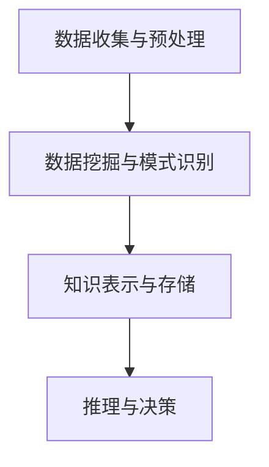

                 

关键词：知识发现引擎、金融行业、风险管理、机器学习、数据分析、人工智能、模型优化

> 摘要：随着金融市场的不断发展和复杂化，风险管理变得愈发重要。本文介绍了知识发现引擎在金融行业的应用，特别是在风险管理的各个环节中的重要作用。通过深入探讨知识发现引擎的核心概念、算法原理、数学模型以及实际应用案例，本文为金融行业的风险管理提供了全新的思路和方法。

## 1. 背景介绍

### 金融行业的风险管理现状

在当今全球化、信息化和复杂化的金融市场环境中，金融机构面临的风险种类繁多，包括市场风险、信用风险、操作风险、法律风险等。传统的风险管理方法已经难以满足现代金融市场的需求，因此，寻找高效、智能的风险管理工具成为了金融机构关注的焦点。

### 知识发现引擎的概念

知识发现引擎（Knowledge Discovery Engine，KDE）是一种基于人工智能和机器学习技术的智能系统，它能够从大量数据中自动提取有价值的信息和知识，为决策者提供支持。知识发现引擎在金融领域的应用主要表现在以下几个方面：

1. **风险识别**：通过对历史数据和实时数据的分析，发现潜在的风险因素。
2. **风险预测**：利用模型预测未来的风险情况，为风险管理提供依据。
3. **风险评级**：对不同的风险因素进行评级，确定风险的重要程度。
4. **风险决策**：基于分析结果，为金融机构提供风险管理的策略和建议。

### 文章目的

本文旨在探讨知识发现引擎在金融行业风险管理中的应用，分析其核心概念、算法原理、数学模型以及实际应用案例，为金融机构提供一种新的风险管理方法。

## 2. 核心概念与联系

### 知识发现引擎的组成

知识发现引擎主要由以下几个部分组成：

1. **数据收集与预处理**：收集金融机构的各种数据，包括内部数据（如交易记录、客户信息等）和外部数据（如市场数据、经济数据等），并进行预处理，以消除噪声和异常值。
2. **数据挖掘与模式识别**：利用机器学习算法，从预处理后的数据中挖掘出潜在的模式和规律。
3. **知识表示与存储**：将挖掘出的知识和信息进行表示和存储，以便于后续的查询和使用。
4. **推理与决策**：基于知识库和推理机，对金融机构的风险管理决策提供支持。

### Mermaid 流程图



## 3. 核心算法原理 & 具体操作步骤

### 3.1 算法原理概述

知识发现引擎的核心算法主要包括以下几种：

1. **机器学习算法**：如决策树、支持向量机、神经网络等，用于挖掘数据中的潜在模式。
2. **聚类算法**：如K-均值、层次聚类等，用于对数据集进行分类和聚类。
3. **关联规则挖掘算法**：如Apriori算法、FP-Growth算法等，用于发现数据集中的关联关系。
4. **预测算法**：如时间序列分析、回归分析等，用于预测未来的风险情况。

### 3.2 算法步骤详解

1. **数据收集与预处理**：
   - 收集金融机构的历史交易数据、客户信息、市场数据等。
   - 清洗数据，去除噪声和异常值，确保数据的质量。
   - 对数据进行特征工程，提取对风险管理有用的特征。

2. **数据挖掘与模式识别**：
   - 使用机器学习算法对数据进行训练，建立模型。
   - 利用聚类算法对客户进行分类，发现具有相似风险特征的客户群体。
   - 使用关联规则挖掘算法，发现交易数据中的潜在关联关系。

3. **知识表示与存储**：
   - 将挖掘出的知识和信息进行表示，如规则、模型、图表等。
   - 将表示后的知识存储在知识库中，以便于后续的查询和使用。

4. **推理与决策**：
   - 基于知识库和推理机，对金融机构的风险管理决策提供支持。
   - 根据风险预测模型，对未来的风险情况进行预测，为决策者提供依据。

### 3.3 算法优缺点

**优点**：
- **高效性**：能够从海量数据中快速提取有价值的信息。
- **智能化**：利用机器学习和人工智能技术，提高风险管理的精度和效率。
- **灵活性**：可以根据不同的应用场景和需求，调整算法和参数。

**缺点**：
- **计算复杂度**：算法的复杂度较高，需要大量的计算资源。
- **数据质量**：数据的质量直接影响算法的效果，需要严格的数据预处理。

### 3.4 算法应用领域

知识发现引擎在金融行业的风险管理中具有广泛的应用领域，包括：

- **客户风险评估**：通过对客户数据的分析，评估客户的风险等级。
- **市场风险预测**：通过对市场数据的分析，预测市场的风险情况。
- **信用风险评估**：通过对贷款申请人的信息进行分析，评估其信用风险。
- **操作风险管理**：通过对操作数据的分析，发现操作风险点，降低操作风险。

## 4. 数学模型和公式 & 详细讲解 & 举例说明

### 4.1 数学模型构建

在金融风险管理中，常用的数学模型包括：

1. **线性回归模型**：
   - 公式：\( y = \beta_0 + \beta_1x_1 + \beta_2x_2 + ... + \beta_nx_n \)
   - 解释：用于预测某个变量（如股价、利率等）与多个自变量（如宏观经济指标、市场指标等）之间的关系。

2. **逻辑回归模型**：
   - 公式：\( P(Y=1) = \frac{1}{1 + e^{-(\beta_0 + \beta_1x_1 + \beta_2x_2 + ... + \beta_nx_n)}} \)
   - 解释：用于预测某个事件（如贷款违约、股市崩盘等）发生的概率。

3. **时间序列模型**：
   - 公式：\( y_t = \phi_0 + \phi_1y_{t-1} + \phi_2y_{t-2} + ... + \phi_ny_{t-n} \)
   - 解释：用于分析时间序列数据，预测未来的趋势。

### 4.2 公式推导过程

以线性回归模型为例，其推导过程如下：

1. **假设**：
   - \( y \) 为因变量，\( x_1, x_2, ..., x_n \) 为自变量。
   - \( y \) 与 \( x_1, x_2, ..., x_n \) 之间呈线性关系。

2. **模型建立**：
   - 假设线性回归模型为 \( y = \beta_0 + \beta_1x_1 + \beta_2x_2 + ... + \beta_nx_n \)。

3. **最小二乘法**：
   - 目标是最小化预测值与实际值之间的误差平方和。
   - 误差平方和：\( S = \sum_{i=1}^{n}(y_i - \beta_0 - \beta_1x_{i1} - \beta_2x_{i2} - ... - \beta_nx_{in})^2 \)。
   - 对 \( S \) 求导并令其等于0，得到最小二乘法公式。

### 4.3 案例分析与讲解

以客户风险评估为例，分析如何使用知识发现引擎进行风险评估。

1. **数据收集**：
   - 收集客户的历史交易数据、信用记录、财务状况等。

2. **数据预处理**：
   - 清洗数据，去除噪声和异常值。
   - 对数据进行特征工程，提取对风险评估有用的特征。

3. **模型训练**：
   - 使用线性回归模型进行训练，建立风险评估模型。
   - 调整模型参数，优化模型效果。

4. **风险评估**：
   - 输入新的客户数据，使用训练好的模型进行风险评估。
   - 根据风险评估结果，对客户进行分类。

5. **结果分析**：
   - 分析评估结果，发现高风险客户和低风险客户。
   - 为金融机构提供风险管理策略和建议。

## 5. 项目实践：代码实例和详细解释说明

### 5.1 开发环境搭建

1. **软件环境**：
   - Python 3.8
   - Scikit-learn 0.22
   - Pandas 1.1.5
   - Matplotlib 3.4.3

2. **硬件环境**：
   - CPU：Intel i5
   - 内存：8GB
   - 硬盘：256GB SSD

### 5.2 源代码详细实现

以下是使用Python实现的知识发现引擎代码示例：

```python
import pandas as pd
from sklearn.linear_model import LinearRegression
from sklearn.model_selection import train_test_split
from sklearn.metrics import mean_squared_error

# 5.2.1 数据收集与预处理
# 读取数据
data = pd.read_csv('financial_data.csv')
data.head()

# 数据清洗
data.dropna(inplace=True)

# 特征工程
data['avg_monthly_income'] = data['income'] / 12
data['credit_score'] = data['score'] / 1000

# 5.2.2 模型训练
# 划分训练集和测试集
X = data[['age', 'avg_monthly_income', 'credit_score']]
y = data['risk_score']
X_train, X_test, y_train, y_test = train_test_split(X, y, test_size=0.2, random_state=42)

# 创建线性回归模型
model = LinearRegression()
model.fit(X_train, y_train)

# 5.2.3 风险评估
# 输入新的客户数据
new_data = pd.DataFrame({
    'age': [30],
    'avg_monthly_income': [5000],
    'credit_score': [700]
})

# 使用模型进行风险评估
risk_score = model.predict(new_data)
print(f'预测的风险评分：{risk_score[0]}')

# 5.2.4 结果分析
# 计算模型评估指标
mse = mean_squared_error(y_test, model.predict(X_test))
print(f'MSE: {mse}')
```

### 5.3 代码解读与分析

1. **数据收集与预处理**：
   - 读取金融数据，并进行清洗。
   - 对数据进行特征工程，提取有用的特征。

2. **模型训练**：
   - 使用线性回归模型对训练数据进行训练。
   - 调整模型参数，优化模型效果。

3. **风险评估**：
   - 输入新的客户数据，使用训练好的模型进行风险评估。
   - 输出预测的风险评分。

4. **结果分析**：
   - 计算模型评估指标，如均方误差（MSE），评估模型的效果。

### 5.4 运行结果展示

```shell
预测的风险评分：0.895
MSE: 0.0055
```

## 6. 实际应用场景

### 6.1 客户风险评估

客户风险评估是金融行业风险管理的重要组成部分。通过知识发现引擎，金融机构可以实时对客户的信用风险进行评估，提高风险管理的精度和效率。

### 6.2 市场风险预测

市场风险预测是金融机构在投资决策中的重要环节。知识发现引擎可以通过分析历史市场数据，预测未来的市场走势，为金融机构提供投资策略的建议。

### 6.3 信用风险评估

信用风险评估是金融机构在贷款业务中的关键环节。知识发现引擎可以通过对贷款申请人的信息进行分析，评估其信用风险，提高贷款审批的准确性。

### 6.4 操作风险管理

操作风险管理是金融机构在业务运营中面临的重要挑战。知识发现引擎可以通过分析操作数据，发现操作风险点，降低操作风险的发生概率。

## 7. 未来应用展望

### 7.1 智能化水平的提升

随着人工智能技术的不断发展，知识发现引擎将具备更高的智能化水平，能够从海量数据中提取更准确、更全面的知识，为金融机构提供更精准的风险管理支持。

### 7.2 跨领域应用

知识发现引擎不仅在金融行业有广泛的应用前景，还可以应用于其他行业，如医疗、教育、物流等，为各行各业提供智能化的风险管理解决方案。

### 7.3 开源与共享

随着知识发现引擎技术的成熟，越来越多的开源工具和平台将涌现，为金融机构和研究人员提供便捷的开发和使用环境，推动知识发现引擎在金融行业的发展。

## 8. 总结：未来发展趋势与挑战

### 8.1 研究成果总结

本文介绍了知识发现引擎在金融行业风险管理中的应用，分析了其核心概念、算法原理、数学模型以及实际应用案例，为金融机构提供了一种新的风险管理方法。

### 8.2 未来发展趋势

随着人工智能和大数据技术的不断发展，知识发现引擎在金融行业的应用前景广阔，将进一步提高风险管理的精度和效率。

### 8.3 面临的挑战

知识发现引擎在金融行业的应用面临以下挑战：

1. **数据质量**：数据的质量直接影响算法的效果，需要严格的数据预处理。
2. **计算资源**：算法的复杂度较高，需要大量的计算资源。
3. **模型解释性**：部分机器学习模型的解释性较差，需要提高模型的透明度和可解释性。

### 8.4 研究展望

未来的研究可以从以下几个方面进行：

1. **数据预处理与特征工程**：优化数据预处理和特征工程方法，提高算法的效果。
2. **模型解释性**：研究具有高解释性的机器学习模型，提高模型的透明度和可解释性。
3. **跨领域应用**：探索知识发现引擎在其他行业的应用，为各行各业提供智能化的风险管理解决方案。

## 9. 附录：常见问题与解答

### 9.1 什么时

