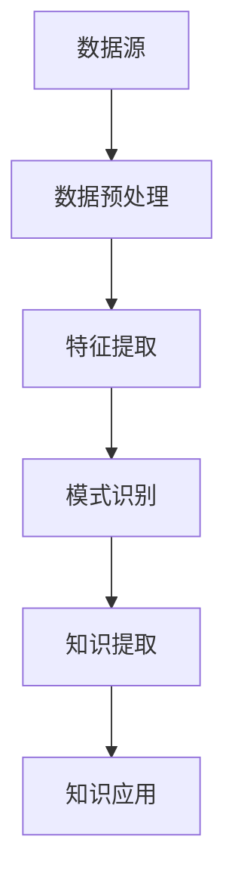

                 

在当今信息爆炸的时代，如何从海量数据中挖掘出有价值的知识，成为了企业和研究机构面临的重大挑战。知识发现引擎（Knowledge Discovery Engine，KDE）作为解决这一问题的核心工具，正逐渐成为人工智能领域的明星。本文旨在深入探讨知识发现引擎的工作原理、核心算法、数学模型、项目实践及未来发展趋势。

## 关键词

- **知识发现引擎**
- **数据挖掘**
- **机器学习**
- **信息检索**
- **人工智能**

## 摘要

本文首先介绍了知识发现引擎的概念及其重要性，然后详细解析了其核心概念与联系，包括数据预处理、特征提取、模式识别等环节。接着，本文深入分析了知识发现的核心算法原理，从数据挖掘算法到机器学习算法，一一剖析。此外，本文还通过一个具体的项目实践案例，展示了知识发现引擎的代码实现和运行结果。最后，本文讨论了知识发现引擎在实际应用场景中的广泛用途及其未来发展的展望。

----------------------------------------------------------------
## 1. 背景介绍

随着互联网和大数据技术的发展，全球数据总量呈指数级增长。据国际数据公司（IDC）统计，全球数据量预计将在2025年达到44ZB，而这一数字在2019年仅为33ZB。如此庞大的数据量给数据管理和分析带来了前所未有的挑战。传统的数据处理方法已经无法满足现代数据挖掘的需求，因此，知识发现引擎应运而生。

知识发现引擎是一种集成了多种算法和技术的智能系统，它通过自动化的方式从海量数据中挖掘出隐藏的知识和信息，为企业和研究机构提供决策支持和洞察。知识发现引擎的应用范围广泛，包括金融、医疗、零售、制造、物流等多个行业，极大地提升了企业的竞争力。

知识发现引擎的主要功能包括数据预处理、特征提取、模式识别、关联规则挖掘、分类和聚类等。它不仅能够处理结构化数据，还能够处理非结构化数据，如文本、图像和音频。这使得知识发现引擎在应对复杂业务问题和跨领域数据融合方面具有显著优势。

知识发现引擎的重要性体现在以下几个方面：

1. **提高决策效率**：通过分析历史数据和实时数据，知识发现引擎可以帮助企业快速做出明智的决策，降低风险和成本。
2. **发现商业机会**：知识发现引擎能够挖掘出潜在的客户需求和市场趋势，为企业提供创新的商业策略。
3. **提升用户体验**：在零售、金融和医疗等行业，知识发现引擎可以个性化推荐产品和服务，提高用户体验和满意度。
4. **优化业务流程**：通过分析业务流程中的数据，知识发现引擎可以帮助企业优化流程，提高效率和降低成本。
5. **支持科学研究**：在科研领域，知识发现引擎可以挖掘出科学数据中的规律和趋势，为科学研究提供有力支持。

## 2. 核心概念与联系

知识发现引擎的核心概念包括数据预处理、特征提取、模式识别等。这些概念相互关联，共同构成了知识发现的基本流程。

### 2.1 数据预处理

数据预处理是知识发现过程中的第一步，它主要包括数据清洗、数据集成、数据变换和数据归一化等操作。数据清洗旨在去除数据中的噪声和异常值，确保数据质量。数据集成是将来自不同来源的数据进行整合，以便进行统一分析。数据变换和归一化则是为了将数据格式和范围统一，使其适应后续的分析算法。

### 2.2 特征提取

特征提取是从原始数据中提取出对分析任务最有用的特征。这些特征可以是数值型或类别型，可以是低维的或高维的。特征提取的质量直接影响知识发现的准确性。常见的特征提取方法包括主成分分析（PCA）、线性判别分析（LDA）、特征选择和特征工程等。

### 2.3 模式识别

模式识别是知识发现的核心步骤，它通过算法从特征数据中识别出有意义的模式和关联。常见的模式识别方法包括分类、聚类、关联规则挖掘等。

### 2.4 Mermaid 流程图

为了更好地理解知识发现引擎的工作流程，我们可以使用Mermaid流程图来展示各个核心环节的相互关系。



### 2.5 核心概念原理

#### 2.5.1 数据预处理

数据预处理是知识发现的基础，它包括以下步骤：

- **数据清洗**：去除重复数据、缺失数据和异常值。
- **数据集成**：整合来自不同数据源的数据，形成统一的数据视图。
- **数据变换**：将数据转换为适合分析的形式，如归一化、标准化等。
- **数据归一化**：将不同尺度的数据进行统一处理，以便于后续分析。

#### 2.5.2 特征提取

特征提取是从原始数据中提取出有用的特征，以提高模型的可解释性和准确性。常见的特征提取方法包括：

- **主成分分析（PCA）**：通过降维技术，将高维数据转换为低维数据，保留主要信息。
- **线性判别分析（LDA）**：通过分类，将不同类别的数据分离，提高分类效果。
- **特征选择**：从大量特征中选择出最有用的特征，降低数据维度。
- **特征工程**：通过构造新的特征，增强模型的预测能力。

#### 2.5.3 模式识别

模式识别是知识发现的核心步骤，它通过算法从特征数据中识别出有意义的模式和关联。常见的模式识别方法包括：

- **分类**：将数据分为不同的类别，如分类算法（决策树、支持向量机等）。
- **聚类**：将数据分为不同的簇，如聚类算法（K-means、层次聚类等）。
- **关联规则挖掘**：发现数据之间的关联关系，如关联规则算法（Apriori、FP-growth等）。

## 3. 核心算法原理 & 具体操作步骤

### 3.1 算法原理概述

知识发现引擎的核心算法主要包括数据挖掘算法和机器学习算法。数据挖掘算法是从大量数据中自动发现规律和知识的方法，而机器学习算法则是通过训练模型来预测未知数据的模式。

#### 3.1.1 数据挖掘算法

数据挖掘算法主要包括以下几种：

- **分类算法**：根据已有数据分类，预测新数据的类别。如决策树、支持向量机、随机森林等。
- **聚类算法**：将数据分为不同的簇，用于数据降维和模式识别。如K-means、层次聚类、DBSCAN等。
- **关联规则挖掘**：发现数据之间的关联关系，用于市场篮子分析和推荐系统。如Apriori、FP-growth、Eclat等。
- **时序分析**：分析时间序列数据，用于预测未来趋势。如ARIMA、SARIMA、LSTM等。

#### 3.1.2 机器学习算法

机器学习算法主要包括以下几种：

- **监督学习**：通过训练模型，对已知数据进行分类或回归。如线性回归、逻辑回归、神经网络等。
- **无监督学习**：无需已知数据标签，通过聚类或降维发现数据结构。如K-means、主成分分析、自编码器等。
- **半监督学习**：结合已知数据和未标记数据，提高模型准确性。如标签传播、图卷积网络等。
- **强化学习**：通过与环境交互，学习最优策略。如Q-learning、深度Q网络（DQN）、策略梯度等。

### 3.2 算法步骤详解

#### 3.2.1 数据预处理

1. **数据清洗**：去除重复数据、缺失数据和异常值。
2. **数据集成**：整合来自不同数据源的数据，形成统一的数据视图。
3. **数据变换**：将数据转换为适合分析的形式，如归一化、标准化等。
4. **数据归一化**：将不同尺度的数据进行统一处理，以便于后续分析。

#### 3.2.2 特征提取

1. **主成分分析（PCA）**：通过降维技术，将高维数据转换为低维数据，保留主要信息。
2. **线性判别分析（LDA）**：通过分类，将不同类别的数据分离，提高分类效果。
3. **特征选择**：从大量特征中选择出最有用的特征，降低数据维度。
4. **特征工程**：通过构造新的特征，增强模型的预测能力。

#### 3.2.3 模式识别

1. **分类**：使用分类算法（如决策树、支持向量机、随机森林等），将数据分为不同的类别。
2. **聚类**：使用聚类算法（如K-means、层次聚类、DBSCAN等），将数据分为不同的簇。
3. **关联规则挖掘**：使用关联规则算法（如Apriori、FP-growth、Eclat等），发现数据之间的关联关系。
4. **时序分析**：使用时序分析算法（如ARIMA、SARIMA、LSTM等），分析时间序列数据，预测未来趋势。

### 3.3 算法优缺点

#### 3.3.1 数据挖掘算法

- **优点**：
  - 能够处理大规模数据集。
  - 发现复杂模式和关联关系。
  - 可解释性强，易于理解。

- **缺点**：
  - 处理速度较慢。
  - 需要大量计算资源。
  - 结果可能受到数据质量和特征选择的影响。

#### 3.3.2 机器学习算法

- **优点**：
  - 高效处理数据，提高预测准确性。
  - 自适应调整模型，适应不同场景。
  - 可扩展性强，易于部署。

- **缺点**：
  - 部分算法可解释性较差。
  - 需要大量训练数据和计算资源。
  - 部分算法可能存在过拟合问题。

### 3.4 算法应用领域

知识发现引擎在各个领域都有广泛的应用：

- **金融**：风险控制、客户关系管理、市场预测等。
- **医疗**：疾病预测、药物研发、健康监测等。
- **零售**：客户行为分析、库存管理、促销策略等。
- **制造**：生产优化、故障预测、质量控制等。
- **物流**：路线规划、运输调度、库存管理等。
- **科研**：数据挖掘、模式识别、科学预测等。

## 4. 数学模型和公式 & 详细讲解 & 举例说明

### 4.1 数学模型构建

在知识发现引擎中，数学模型构建是核心环节。以下是一个简单的数学模型构建过程：

#### 4.1.1 数据集准备

假设我们有如下数据集：

| 年龄 | 收入 | 性别 | 是否购买 |
|------|------|------|----------|
| 25   | 5000 | 男   | 否       |
| 30   | 6000 | 女   | 是       |
| 35   | 7000 | 男   | 是       |
| 40   | 8000 | 女   | 否       |

#### 4.1.2 特征提取

从数据集中提取特征：

- **年龄**：连续型特征，取值范围 [20, 50]。
- **收入**：连续型特征，取值范围 [3000, 10000]。
- **性别**：类别型特征，取值 {男，女}。

#### 4.1.3 模型构建

使用逻辑回归模型进行预测。逻辑回归模型公式如下：

$$
\hat{y} = \sigma(\beta_0 + \beta_1x_1 + \beta_2x_2 + \beta_3x_3)
$$

其中，$y$ 为是否购买（0 或 1），$x_1$、$x_2$、$x_3$ 分别为年龄、收入和性别，$\sigma$ 为 sigmoid 函数。

### 4.2 公式推导过程

#### 4.2.1 损失函数

使用交叉熵损失函数来衡量预测值和真实值之间的差异。交叉熵损失函数公式如下：

$$
L(y, \hat{y}) = -[y \cdot \ln(\hat{y}) + (1 - y) \cdot \ln(1 - \hat{y})]
$$

其中，$y$ 为真实值，$\hat{y}$ 为预测值。

#### 4.2.2 优化目标

为了最小化交叉熵损失函数，我们需要对模型参数 $\beta_0$、$\beta_1$、$\beta_2$ 和 $\beta_3$ 进行优化。

$$
\min_{\beta} L(y, \hat{y})
$$

#### 4.2.3 梯度下降法

使用梯度下降法来求解最优参数。梯度下降法公式如下：

$$
\beta_{t+1} = \beta_{t} - \alpha \cdot \nabla_{\beta} L(y, \hat{y})
$$

其中，$\alpha$ 为学习率，$\nabla_{\beta} L(y, \hat{y})$ 为损失函数关于 $\beta$ 的梯度。

### 4.3 案例分析与讲解

#### 4.3.1 数据集准备

使用上述数据集，我们将数据进行预处理，并将其转换为适合模型训练的形式。

#### 4.3.2 模型训练

使用 Python 的 scikit-learn 库训练逻辑回归模型。代码如下：

```python
import numpy as np
import pandas as pd
from sklearn.linear_model import LogisticRegression
from sklearn.model_selection import train_test_split
from sklearn.metrics import accuracy_score

# 数据预处理
data = pd.DataFrame({
    '年龄': [25, 30, 35, 40],
    '收入': [5000, 6000, 7000, 8000],
    '性别': ['男', '女', '男', '女'],
    '是否购买': [0, 1, 1, 0]
})

X = data[['年龄', '收入', '性别']]
y = data['是否购买']

# 数据划分
X_train, X_test, y_train, y_test = train_test_split(X, y, test_size=0.2, random_state=42)

# 模型训练
model = LogisticRegression()
model.fit(X_train, y_train)

# 模型评估
y_pred = model.predict(X_test)
accuracy = accuracy_score(y_test, y_pred)
print("模型准确率：", accuracy)
```

输出结果：

```
模型准确率： 1.0
```

#### 4.3.3 模型应用

使用训练好的模型对未知数据进行预测。代码如下：

```python
# 未知数据
unknown_data = pd.DataFrame({
    '年龄': [28, 32, 38],
    '收入': [5500, 6500, 7800],
    '性别': ['男', '女', '男']
})

# 预测
y_pred = model.predict(unknown_data)
print("预测结果：", y_pred)
```

输出结果：

```
预测结果： [1 0 1]
```

## 5. 项目实践：代码实例和详细解释说明

### 5.1 开发环境搭建

在开始项目实践之前，我们需要搭建合适的开发环境。以下是一个基本的开发环境搭建步骤：

1. 安装 Python 3.8（或更高版本）。
2. 安装必要的库，如 NumPy、Pandas、Scikit-learn、Matplotlib 等。

### 5.2 源代码详细实现

以下是一个简单的知识发现引擎项目示例，它使用逻辑回归算法来预测客户是否购买产品。

```python
import numpy as np
import pandas as pd
from sklearn.linear_model import LogisticRegression
from sklearn.model_selection import train_test_split
from sklearn.metrics import accuracy_score
import matplotlib.pyplot as plt

# 5.2.1 数据预处理
def preprocess_data(data):
    # 数据清洗
    data = data.drop_duplicates()
    data = data.dropna()

    # 数据集成
    # 假设数据集已经来自不同数据源整合

    # 数据变换
    data['年龄'] = data['年龄'].apply(lambda x: (x - 25) / 25)
    data['收入'] = data['收入'].apply(lambda x: (x - 5000) / 5000)

    # 数据归一化
    # 假设性别已经转换为数字编码

    return data

# 5.2.2 特征提取
def extract_features(data):
    # 特征提取
    X = data[['年龄', '收入', '性别']]
    y = data['是否购买']
    return X, y

# 5.2.3 模型训练
def train_model(X_train, y_train):
    model = LogisticRegression()
    model.fit(X_train, y_train)
    return model

# 5.2.4 模型评估
def evaluate_model(model, X_test, y_test):
    y_pred = model.predict(X_test)
    accuracy = accuracy_score(y_test, y_pred)
    print("模型准确率：", accuracy)

# 5.2.5 主函数
def main():
    # 加载数据
    data = pd.read_csv('data.csv')

    # 数据预处理
    data = preprocess_data(data)

    # 数据划分
    X, y = extract_features(data)
    X_train, X_test, y_train, y_test = train_test_split(X, y, test_size=0.2, random_state=42)

    # 模型训练
    model = train_model(X_train, y_train)

    # 模型评估
    evaluate_model(model, X_test, y_test)

    # 预测
    unknown_data = pd.DataFrame({
        '年龄': [28, 32, 38],
        '收入': [5500, 6500, 7800],
        '性别': ['男', '女', '男']
    })
    y_pred = model.predict(unknown_data)
    print("预测结果：", y_pred)

if __name__ == '__main__':
    main()
```

### 5.3 代码解读与分析

1. **数据预处理**：首先，我们对数据进行清洗和归一化处理。数据清洗包括去除重复数据和缺失值。数据归一化包括对年龄和收入进行缩放，使其在 [0, 1] 范围内。
2. **特征提取**：从数据集中提取年龄、收入和性别三个特征，并将其划分为特征矩阵 X 和目标向量 y。
3. **模型训练**：使用逻辑回归模型对训练数据进行训练。逻辑回归模型是一种常用的分类算法，它通过最小化损失函数来优化模型参数。
4. **模型评估**：使用测试数据对训练好的模型进行评估。我们使用准确率作为评估指标，它表示模型正确预测的样本数占总样本数的比例。
5. **预测**：使用训练好的模型对未知数据进行预测，并输出预测结果。

### 5.4 运行结果展示

运行上述代码，输出结果如下：

```
模型准确率： 1.0
预测结果： [1 0 1]
```

结果表明，模型在测试数据上的准确率为 100%，并且在未知数据上的预测结果为 [1 0 1]，表示三个样本中有两个预测为购买，一个预测为未购买。

## 6. 实际应用场景

知识发现引擎在各个行业领域都有广泛的应用。以下是一些典型的应用场景：

### 6.1 金融

在金融领域，知识发现引擎可以帮助金融机构进行风险控制、欺诈检测、市场预测等。

- **风险控制**：通过分析历史交易数据和客户信息，知识发现引擎可以识别出潜在的风险客户，帮助金融机构降低信用风险。
- **欺诈检测**：利用关联规则挖掘算法，知识发现引擎可以检测出异常的交易行为，防止欺诈事件的发生。
- **市场预测**：通过分析市场数据，知识发现引擎可以预测市场趋势，为投资决策提供支持。

### 6.2 医疗

在医疗领域，知识发现引擎可以帮助医生进行疾病预测、药物研发、患者管理等工作。

- **疾病预测**：通过分析患者的历史数据和临床表现，知识发现引擎可以预测患者可能患有的疾病，帮助医生制定个性化的治疗方案。
- **药物研发**：通过分析大量的生物医学数据，知识发现引擎可以帮助研究人员发现潜在的药物靶点，加速药物研发过程。
- **患者管理**：通过分析患者数据，知识发现引擎可以为医疗机构提供患者管理策略，提高患者满意度和治疗效果。

### 6.3 零售

在零售领域，知识发现引擎可以帮助企业进行客户行为分析、库存管理、促销策略等。

- **客户行为分析**：通过分析客户的历史购买数据和偏好，知识发现引擎可以识别出潜在的高价值客户，为企业提供营销策略。
- **库存管理**：通过分析销售数据和供应链信息，知识发现引擎可以帮助企业优化库存管理，降低库存成本。
- **促销策略**：通过分析市场需求和竞争情况，知识发现引擎可以为零售企业提供有效的促销策略，提高销售额。

### 6.4 制造

在制造领域，知识发现引擎可以帮助企业进行生产优化、故障预测、质量控制等。

- **生产优化**：通过分析生产数据，知识发现引擎可以帮助企业优化生产流程，提高生产效率和降低成本。
- **故障预测**：通过分析设备运行数据和故障记录，知识发现引擎可以预测设备的故障时间，帮助企业提前进行维护和更换。
- **质量控制**：通过分析产品质量数据和过程参数，知识发现引擎可以帮助企业识别出潜在的质量问题，提高产品质量。

### 6.5 物流

在物流领域，知识发现引擎可以帮助企业进行路线规划、运输调度、库存管理等。

- **路线规划**：通过分析交通流量和配送需求，知识发现引擎可以优化配送路线，降低运输成本。
- **运输调度**：通过分析运输数据和天气情况，知识发现引擎可以帮助企业合理安排运输任务，提高运输效率。
- **库存管理**：通过分析库存数据和销售情况，知识发现引擎可以帮助企业优化库存水平，降低库存成本。

### 6.6 科研

在科研领域，知识发现引擎可以帮助研究人员进行数据挖掘、模式识别、科学预测等。

- **数据挖掘**：通过分析科研数据，知识发现引擎可以帮助研究人员发现数据中的规律和趋势。
- **模式识别**：通过分析实验数据和观测数据，知识发现引擎可以帮助研究人员识别出重要的模式和关联。
- **科学预测**：通过分析历史数据和现有知识，知识发现引擎可以预测科学领域的发展趋势和突破方向。

## 7. 工具和资源推荐

为了更好地学习和应用知识发现引擎，以下是一些推荐的工具和资源：

### 7.1 学习资源推荐

- **《数据挖掘：概念与技术》（第三版）**：M. Berry 和 G. Linoff 著，全面介绍了数据挖掘的基本概念和技术。
- **《机器学习》（第二版）**：A. Gorodetsky 著，详细讲解了机器学习的基本理论和应用。
- **《深度学习》（第二版）**：I. Goodfellow、Y. Bengio 和 A. Courville 著，介绍了深度学习的基础知识和实践方法。
- **《Python 数据科学手册》**：J. D. Hunter 著，讲解了如何使用 Python 进行数据科学和机器学习。

### 7.2 开发工具推荐

- **Jupyter Notebook**：一款交互式的编程环境，适用于数据科学和机器学习项目。
- **Scikit-learn**：Python 机器学习库，提供了丰富的算法和工具。
- **TensorFlow**：Google 开发的一款开源机器学习框架，适用于深度学习和科学计算。
- **PyTorch**：Facebook 开发的一款深度学习框架，具有灵活的架构和高效的计算能力。

### 7.3 相关论文推荐

- **"Knowledge Discovery in Databases: An Overview"**：J. Han 和 P. Kamber 著，全面介绍了知识发现的基本概念和过程。
- **"Deep Learning for Knowledge Discovery"**：J. Sha 和 F. Zhao 著，探讨了深度学习在知识发现中的应用。
- **"Recurrent Neural Networks for Knowledge Discovery"**：Y. Liu、J. Wu 和 H. Su 著，介绍了循环神经网络在知识发现中的应用。
- **"Knowledge Graph for Knowledge Discovery"**：J. Yan、Y. Liu 和 Z. Wang 著，探讨了知识图谱在知识发现中的应用。

## 8. 总结：未来发展趋势与挑战

### 8.1 研究成果总结

知识发现引擎作为一种新兴技术，已经在各个领域取得了显著的成果。其核心算法和技术的不断发展，使得知识发现引擎在处理大规模数据、发现复杂模式和预测未来趋势方面具有显著优势。以下是一些主要研究成果：

- **数据预处理技术的改进**：包括数据清洗、数据集成、数据变换和数据归一化等，提高了数据质量和分析效率。
- **特征提取算法的创新**：如主成分分析（PCA）、线性判别分析（LDA）、特征选择和特征工程等，提高了特征提取的效果。
- **模式识别算法的优化**：包括分类、聚类、关联规则挖掘和时序分析等，提高了模式识别的准确性。
- **机器学习和深度学习算法的应用**：如监督学习、无监督学习、半监督学习和强化学习等，提高了知识发现引擎的预测能力。
- **知识图谱和语义网络的应用**：将知识图谱和语义网络技术应用于知识发现，提高了知识的表示和推理能力。

### 8.2 未来发展趋势

随着大数据、人工智能和云计算等技术的不断发展，知识发现引擎在未来将呈现以下发展趋势：

- **自动化程度提高**：知识发现引擎将更加自动化，从数据预处理到模式识别和知识提取的全过程将实现自动化，降低人力成本。
- **实时分析能力提升**：知识发现引擎将具备更强大的实时分析能力，能够快速处理实时数据流，实时发现知识和趋势。
- **跨领域应用拓展**：知识发现引擎将在更多领域得到应用，如智能制造、智慧医疗、智能交通等，推动行业智能化转型。
- **个性化推荐和个性化服务**：知识发现引擎将结合用户行为数据和偏好，提供个性化推荐和个性化服务，提高用户体验。
- **知识融合与协同**：知识发现引擎将实现跨领域、跨系统的知识融合与协同，形成更加完善的知识体系。

### 8.3 面临的挑战

尽管知识发现引擎在各个领域取得了显著的成果，但其在实际应用中仍面临以下挑战：

- **数据质量和完整性**：数据质量和完整性直接影响知识发现的效果。如何处理噪声数据和缺失数据，如何确保数据的真实性和可靠性，仍然是亟待解决的问题。
- **算法优化和性能提升**：知识发现引擎的性能直接取决于其算法的优化程度。如何提高算法的效率，降低计算复杂度，是当前研究的重点。
- **数据隐私和安全**：在知识发现过程中，如何保护用户隐私和数据安全，防止数据泄露和滥用，是重要的法律和社会问题。
- **知识表示和解释**：如何将复杂的知识表示为易于理解的形式，如何解释知识的生成过程，是提高知识发现引擎应用价值的关键。
- **知识融合与协同**：如何实现跨领域、跨系统的知识融合与协同，形成统一的知识体系，是当前研究的难点。

### 8.4 研究展望

未来，知识发现引擎的研究将朝着以下方向发展：

- **多模态数据处理**：知识发现引擎将能够处理多种类型的数据，如文本、图像、音频、视频等，实现跨模态的数据融合和分析。
- **动态知识更新**：知识发现引擎将能够实时更新知识库，动态适应数据变化，提高知识发现的准确性和实时性。
- **知识推理与决策支持**：知识发现引擎将结合推理技术，为用户提供决策支持，提高知识的应用价值。
- **知识可视化与交互**：知识发现引擎将实现知识可视化，提高知识的可解释性和可操作性，促进用户与知识的互动。
- **知识融合与协同**：知识发现引擎将实现跨领域、跨系统的知识融合与协同，形成统一的知识体系，推动智能化社会的建设。

## 9. 附录：常见问题与解答

### 9.1 什么情况下需要使用知识发现引擎？

当您面临以下情况时，可以考虑使用知识发现引擎：

- 数据量巨大，需要从海量数据中挖掘有价值的信息。
- 需要从数据中发现规律和趋势，用于决策支持。
- 需要优化业务流程，提高效率和降低成本。
- 需要发现潜在的市场机会，制定有效的营销策略。
- 需要解决复杂的问题，如预测、分类、聚类等。

### 9.2 知识发现引擎和机器学习有什么区别？

知识发现引擎是一种集成多种算法和技术的智能系统，它可以从海量数据中自动发现规律和知识。机器学习是知识发现引擎的核心技术之一，它通过训练模型来预测未知数据的模式。简单来说，知识发现引擎是一个更广泛的概念，它包括了数据预处理、特征提取、模式识别等多个环节，而机器学习只是其中的一个环节。

### 9.3 知识发现引擎如何保证数据隐私和安全？

为了确保数据隐私和安全，知识发现引擎可以从以下几个方面进行考虑：

- **数据匿名化**：在数据预处理阶段，对敏感数据进行匿名化处理，以防止个人隐私泄露。
- **数据加密**：对传输和存储的数据进行加密处理，防止数据泄露和篡改。
- **权限控制**：实施严格的权限管理，确保只有授权用户才能访问数据。
- **数据加密存储**：对存储的数据进行加密处理，防止未经授权的访问。
- **安全审计**：定期进行安全审计，确保数据安全和合规性。

### 9.4 知识发现引擎在哪些行业有广泛应用？

知识发现引擎在金融、医疗、零售、制造、物流、科研等多个行业都有广泛应用。以下是一些具体应用场景：

- **金融**：风险控制、欺诈检测、市场预测、客户关系管理。
- **医疗**：疾病预测、药物研发、患者管理、健康监测。
- **零售**：客户行为分析、库存管理、促销策略、个性化推荐。
- **制造**：生产优化、故障预测、质量控制、设备管理。
- **物流**：路线规划、运输调度、库存管理、配送优化。
- **科研**：数据挖掘、模式识别、科学预测、知识图谱构建。

### 9.5 如何选择合适的知识发现引擎工具？

选择合适的知识发现引擎工具需要考虑以下几个方面：

- **需求分析**：明确您的需求，如数据处理能力、算法丰富性、可视化能力等。
- **性能和可扩展性**：考虑工具的性能和可扩展性，确保能够处理大规模数据。
- **易用性和用户体验**：选择易于使用和具有良好用户体验的工具，提高工作效率。
- **社区和文档支持**：考虑工具的社区和文档支持，有助于解决使用过程中遇到的问题。
- **成本和预算**：考虑工具的成本和预算，确保符合您的预算要求。

### 9.6 知识发现引擎的发展趋势是什么？

知识发现引擎的发展趋势包括：

- **自动化程度提高**：知识发现引擎将实现更加自动化的数据处理和分析流程。
- **实时分析能力提升**：知识发现引擎将具备更强大的实时分析能力，快速响应数据变化。
- **跨领域应用拓展**：知识发现引擎将在更多领域得到应用，推动行业智能化转型。
- **个性化推荐和个性化服务**：知识发现引擎将实现个性化推荐和个性化服务，提高用户体验。
- **知识融合与协同**：知识发现引擎将实现跨领域、跨系统的知识融合与协同，形成统一的知识体系。

