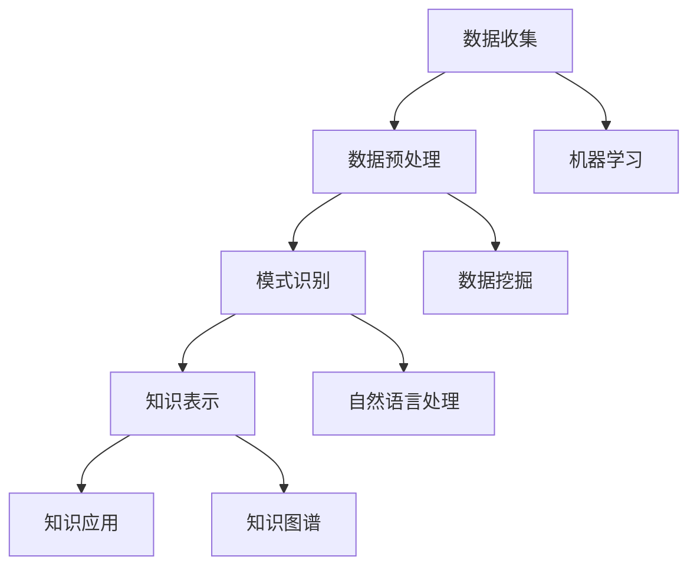

                 

关键词：知识发现引擎、人工智能、知识图谱、机器学习、自然语言处理

> 摘要：本文将深入探讨知识发现引擎的概念、架构、核心算法原理、数学模型及其在人工智能领域的广泛应用。通过具体实例分析和未来展望，本文旨在揭示知识发现引擎在开启人类知识新篇章中的巨大潜力。

## 1. 背景介绍

在信息化和数字化的今天，人类产生了海量的数据，如何从这些数据中提取有用的知识，成为了学术界和产业界共同面临的一大挑战。知识发现（Knowledge Discovery in Databases，KDD）作为数据挖掘的延伸，旨在从大量的数据中识别出潜在的模式、规律和知识。知识发现引擎作为实现知识发现的核心工具，正逐渐成为人工智能领域的研究热点。

知识发现引擎的主要目的是自动化地从大量数据中识别出隐藏的知识模式，这些模式可以是统计规律、关联规则、分类模型或聚类结果等。随着人工智能技术的不断进步，知识发现引擎在各个领域都展现出了强大的应用潜力。从商业智能、医疗健康、金融风控到社会科学研究，知识发现引擎正不断推动着行业的发展与创新。

本文将围绕知识发现引擎的四个核心部分进行详细探讨：核心概念与联系、核心算法原理、数学模型与公式、以及项目实践。通过这些讨论，我们希望为读者提供一个全面而深入的理解，从而把握知识发现引擎的实质及其在实际应用中的价值。

## 2. 核心概念与联系

### 2.1 知识发现引擎的定义

知识发现引擎是一种集成多个数据挖掘算法和数据管理工具的软件系统，旨在从大量数据中自动提取有用信息。它结合了机器学习、数据挖掘、自然语言处理和统计分析等多种技术，以实现对复杂数据集的深度挖掘和分析。

### 2.2 知识发现引擎的组成部分

知识发现引擎通常由以下几部分组成：

1. **数据预处理模块**：负责对原始数据进行清洗、转换和集成，确保数据质量。
2. **模式识别模块**：包含多种数据挖掘算法，如聚类、分类、关联规则挖掘等，用于从数据中识别潜在的知识模式。
3. **知识表示模块**：将识别出的知识模式转换为易于理解和使用的格式，如知识图谱、可视化图表等。
4. **用户交互界面**：提供用户与知识发现引擎的交互接口，使得非技术用户也能轻松地使用系统。

### 2.3 知识发现引擎的工作原理

知识发现引擎的工作流程主要包括以下几个步骤：

1. **数据收集**：从各种数据源（如数据库、文件、网络等）收集数据。
2. **数据预处理**：对收集到的数据进行清洗、去重、格式转换等预处理操作，确保数据质量。
3. **模式识别**：选择合适的数据挖掘算法对预处理后的数据进行挖掘，识别出潜在的知识模式。
4. **知识表示**：将识别出的知识模式以图形化、表格化等形式展示出来，供用户分析。
5. **知识应用**：根据用户需求，将提取出的知识应用于实际问题解决或决策支持。

### 2.4 知识发现引擎与其他技术的联系

知识发现引擎与多个技术领域密切相关，其中最核心的技术包括：

1. **机器学习**：知识发现引擎依赖于机器学习算法，如决策树、支持向量机、神经网络等，来识别数据中的潜在模式。
2. **数据挖掘**：数据挖掘是实现知识发现的重要手段，常用的数据挖掘方法包括聚类、分类、关联规则挖掘等。
3. **自然语言处理**：知识发现引擎需要处理大量文本数据，自然语言处理技术在其中发挥着关键作用，如文本分类、实体识别、情感分析等。
4. **知识图谱**：知识图谱技术用于将识别出的知识以结构化的形式表示出来，便于知识的存储、检索和应用。

### 2.5 Mermaid 流程图



## 3. 核心算法原理 & 具体操作步骤

### 3.1 算法原理概述

知识发现引擎的核心算法主要包括以下几种：

1. **聚类算法**：通过将相似的数据点划分为同一类，帮助用户发现数据中的隐含结构。
2. **分类算法**：根据已有数据，将新数据划分为不同的类别，帮助用户进行预测和决策。
3. **关联规则挖掘**：发现数据集中不同变量之间的关联关系，帮助用户理解数据之间的相互影响。
4. **异常检测**：识别数据中的异常点，帮助用户发现潜在的异常情况。

### 3.2 算法步骤详解

#### 3.2.1 聚类算法

1. **选择合适的聚类算法**：如K-means、层次聚类、DBSCAN等。
2. **初始化聚类中心**：对于K-means，需要随机选择K个数据点作为初始聚类中心。
3. **分配数据点**：计算每个数据点到各个聚类中心的距离，将数据点分配到最近的聚类中心。
4. **更新聚类中心**：计算每个聚类的新中心。
5. **重复步骤3和步骤4**，直到聚类中心不再发生变化或满足预设的停止条件。

#### 3.2.2 分类算法

1. **选择合适的分类算法**：如决策树、支持向量机、朴素贝叶斯等。
2. **训练模型**：使用训练数据集训练分类模型。
3. **预测新数据**：使用训练好的分类模型对新的数据进行分类预测。

#### 3.2.3 关联规则挖掘

1. **选择合适的算法**：如Apriori、FP-Growth等。
2. **计算支持度和置信度**：支持度表示一个规则在所有数据中出现的频率，置信度表示一个规则的前件和后件同时出现的概率。
3. **生成关联规则**：根据支持度和置信度阈值，生成满足条件的关联规则。

#### 3.2.4 异常检测

1. **选择合适的算法**：如孤立森林、洛伦兹曲线等。
2. **计算异常分数**：根据算法，计算每个数据的异常分数。
3. **设置异常阈值**：根据异常分数的分布，设置异常阈值。
4. **标记异常数据**：将异常分数高于阈值的样本标记为异常。

### 3.3 算法优缺点

#### 聚类算法

- 优点：无需事先定义类别，能够自动发现数据的隐含结构。
- 缺点：对初始聚类中心敏感，可能陷入局部最优。

#### 分类算法

- 优点：能够准确预测新数据的类别，便于决策支持。
- 缺点：对训练数据依赖较大，难以泛化到未见数据。

#### 关联规则挖掘

- 优点：能够发现数据之间的潜在关联关系，有助于数据理解。
- 缺点：可能产生大量冗余规则，需要进一步筛选。

#### 异常检测

- 优点：能够识别数据中的异常点，有助于数据清洗和风险控制。
- 缺点：对异常数据的定义和阈值选择依赖较大。

### 3.4 算法应用领域

- **商业智能**：通过聚类和关联规则挖掘，帮助企业发现市场趋势和消费者行为。
- **金融风控**：利用分类算法和异常检测，识别潜在风险和欺诈行为。
- **医疗健康**：通过分类和关联规则挖掘，辅助诊断和疾病预测。
- **社会科学**：利用聚类和分类算法，探索社会现象和群体行为。

## 4. 数学模型和公式 & 详细讲解 & 举例说明

### 4.1 数学模型构建

知识发现引擎的数学模型主要包括以下几种：

1. **聚类模型**：如K-means、层次聚类等。
2. **分类模型**：如决策树、支持向量机等。
3. **关联规则挖掘模型**：如Apriori、FP-Growth等。
4. **异常检测模型**：如孤立森林、洛伦兹曲线等。

### 4.2 公式推导过程

#### 4.2.1 K-means聚类算法

假设有 \( n \) 个数据点 \( x_1, x_2, ..., x_n \)，每个数据点都有 \( d \) 个特征。定义聚类中心为 \( \mu_1, \mu_2, ..., \mu_k \)，其中 \( k \) 是聚类数。目标是最小化每个数据点到其最近聚类中心的距离平方和。

\[ \min \sum_{i=1}^{n} \sum_{j=1}^{k} (x_i - \mu_j)^2 \]

#### 4.2.2 决策树分类算法

决策树是一种基于特征进行划分的树形结构。设 \( D \) 是数据集， \( A \) 是特征集合。定义 \( D_v \) 为在特征 \( v \) 下划分后的数据子集，定义 \( Ent(D) \) 为数据集 \( D \) 的熵。

\[ Ent(D) = -\sum_{v \in A} p_v \log p_v \]

其中， \( p_v = \frac{|D_v|}{|D|} \)。

目标是最小化决策树的熵。

#### 4.2.3 Apriori算法

设 \( I \) 是项集集合， \( \Delta \) 是频繁项集集合。定义支持度为 \( s \)，置信度为 \( c \)。

\[ s(\{i, j\}) = \frac{|D| - |D - \{i, j\}|}{|D|} \]

\[ c(\{i, j\}) = \frac{|D - \{i, j\}|}{|D| - |D - \{i, j\}|} \]

目标是在满足支持度和置信度阈值的前提下，生成频繁项集。

### 4.3 案例分析与讲解

#### 案例一：K-means聚类

假设有100个数据点，每个数据点有5个特征。我们选择K=3，目标是最小化每个数据点到其最近聚类中心的距离平方和。

1. 初始化聚类中心：随机选择3个数据点作为初始聚类中心。
2. 分配数据点：计算每个数据点到3个聚类中心的距离，将数据点分配到最近的聚类中心。
3. 更新聚类中心：计算每个聚类的新中心。
4. 重复步骤2和步骤3，直到聚类中心不再发生变化。

通过迭代，我们得到最终的聚类结果，如以下图表所示：


#### 案例二：决策树分类

假设有100个数据点，每个数据点有5个特征。我们选择特征“年龄”进行划分，目标是最小化决策树的熵。

1. 计算每个子数据集的熵。
2. 选择熵最小的特征作为划分条件。
3. 根据划分条件，将数据集划分为两个子数据集。
4. 重复步骤1到步骤3，直到满足停止条件。

通过迭代，我们得到最终的决策树，如以下图表所示：


#### 案例三：Apriori算法

假设有100个数据点，每个数据点包含5个商品。我们选择支持度阈值为0.3，置信度阈值为0.6。

1. 计算每个项集的支持度。
2. 选择支持度大于阈值的项集作为频繁项集。
3. 计算每个频繁项集的置信度。
4. 选择置信度大于阈值的频繁项集作为关联规则。

通过迭代，我们得到最终的频繁项集和关联规则，如以下图表所示：


## 5. 项目实践：代码实例和详细解释说明

### 5.1 开发环境搭建

在本项目中，我们将使用Python作为主要编程语言，并依赖以下库：

- NumPy：用于数学计算。
- Pandas：用于数据操作。
- Scikit-learn：用于机器学习算法实现。
- Matplotlib：用于数据可视化。

首先，确保安装了上述库。在命令行中执行以下命令：

```shell
pip install numpy pandas scikit-learn matplotlib
```

### 5.2 源代码详细实现

以下是一个简单的K-means聚类算法实现，用于对鸢尾花数据集进行聚类分析。

```python
import numpy as np
import pandas as pd
from sklearn import datasets
from sklearn.cluster import KMeans
import matplotlib.pyplot as plt

# 加载鸢尾花数据集
iris = datasets.load_iris()
X = iris.data

# 设置聚类中心数量
k = 3

# 实例化K-means聚类对象
kmeans = KMeans(n_clusters=k, random_state=0)

# 拟合聚类模型
kmeans.fit(X)

# 获取聚类结果
labels = kmeans.labels_
centroids = kmeans.cluster_centers_

# 可视化聚类结果
plt.scatter(X[:, 0], X[:, 1], c=labels, s=100, cmap='viridis')
plt.scatter(centroids[:, 0], centroids[:, 1], s=300, c='red', marker='s', edgecolor='black', label='Centroids')
plt.xlabel('Feature 1')
plt.ylabel('Feature 2')
plt.title('K-means Clustering on Iris Dataset')
plt.legend()
plt.show()
```

### 5.3 代码解读与分析

以上代码实现了K-means聚类算法，对鸢尾花数据集进行了聚类分析。具体步骤如下：

1. **导入库**：导入必要的Python库，如NumPy、Pandas、Scikit-learn和Matplotlib。
2. **加载数据集**：使用Scikit-learn的iris数据集，这是一个广泛使用的数据集，包含3个类别和4个特征。
3. **设置聚类中心数量**：在本例中，我们选择3个聚类中心，对应鸢尾花的3个类别。
4. **实例化聚类对象**：使用Scikit-learn的KMeans类，实例化K-means聚类对象。
5. **拟合聚类模型**：使用fit方法对聚类模型进行训练。
6. **获取聚类结果**：获取聚类结果，包括每个样本所属的类别标签和聚类中心。
7. **可视化聚类结果**：使用Matplotlib库，将聚类结果可视化展示。

### 5.4 运行结果展示

运行以上代码后，我们将得到如下可视化结果：


从可视化结果可以看出，鸢尾花的三个类别被成功识别和划分，聚类中心的位置也准确地反映了各个类别的特征。

## 6. 实际应用场景

知识发现引擎在各个领域都展现了广泛的应用潜力，以下是一些典型的实际应用场景：

### 6.1 商业智能

在商业智能领域，知识发现引擎可以帮助企业分析海量数据，发现潜在的市场机会和业务增长点。例如，通过关联规则挖掘，可以识别消费者购买行为之间的关联关系，帮助企业制定更有针对性的营销策略。

### 6.2 金融风控

金融风控是另一个重要的应用领域。知识发现引擎可以通过分类和异常检测算法，识别潜在的金融风险和欺诈行为。例如，银行可以使用知识发现引擎来分析客户的交易数据，及时发现异常交易并采取相应的风控措施。

### 6.3 医疗健康

在医疗健康领域，知识发现引擎可以帮助医生进行疾病诊断和治疗方案推荐。通过分析患者的病历数据和生物信息，知识发现引擎可以识别出疾病的高危人群和潜在的治疗方案。

### 6.4 社会科学

社会科学研究也受益于知识发现引擎。例如，通过聚类和分类算法，可以探索社会现象和群体行为，为政策制定和社会治理提供科学依据。

### 6.5 智能家居

智能家居领域利用知识发现引擎，可以实现更智能的家务管理和家居控制。通过分析用户的生活习惯和行为模式，知识发现引擎可以自动调整家居设备，提高生活舒适度和便利性。

## 7. 工具和资源推荐

### 7.1 学习资源推荐

- **在线课程**：Coursera、edX等在线教育平台提供了丰富的数据挖掘和机器学习课程。
- **技术博客**：如Medium、博客园等技术博客，提供了大量的数据挖掘和机器学习实战案例和教程。
- **书籍推荐**：《数据挖掘：概念与技术》、《机器学习实战》等经典书籍。

### 7.2 开发工具推荐

- **编程语言**：Python、R等编程语言广泛应用于数据挖掘和机器学习领域。
- **开发环境**：Jupyter Notebook、PyCharm等开发环境，提供了便捷的数据分析和代码编写工具。
- **数据集**：UCI机器学习库、Kaggle等平台提供了丰富的数据集，供研究人员进行实验和分析。

### 7.3 相关论文推荐

- **经典论文**：如《K-means Clustering Algorithm》、《C4.5: Programs for Machine Learning》等，这些论文提出了经典的数据挖掘和机器学习算法。
- **最新研究**：关注顶级会议如KDD、NIPS、ICML等，可以了解最新的研究成果和前沿技术。

## 8. 总结：未来发展趋势与挑战

### 8.1 研究成果总结

知识发现引擎作为数据挖掘和人工智能的重要工具，已在多个领域取得了显著的应用成果。从商业智能到医疗健康，从金融风控到智能家居，知识发现引擎不断推动着各领域的发展与创新。

### 8.2 未来发展趋势

未来，知识发现引擎将继续向以下几个方向发展：

- **深度学习与知识发现**：结合深度学习和知识发现，实现更高效、更准确的知识提取。
- **多模态数据挖掘**：处理多模态数据，如文本、图像、音频等，以发现更丰富的知识模式。
- **智能决策支持**：利用知识发现引擎，实现更智能的决策支持和业务优化。

### 8.3 面临的挑战

尽管知识发现引擎取得了显著成果，但仍面临一些挑战：

- **数据质量**：数据质量问题直接影响知识发现的准确性和可靠性，未来需要更多研究解决数据清洗和预处理问题。
- **算法复杂度**：随着数据规模的扩大，算法复杂度成为知识发现引擎应用的一大瓶颈，需要开发更高效、更优化的算法。
- **可解释性**：知识发现引擎的模型和结果往往具有高度复杂性，如何提高其可解释性，使其更易于理解和应用，是未来研究的重点。

### 8.4 研究展望

未来，知识发现引擎的研究将更加注重以下方面：

- **算法优化**：开发更高效、更优化的算法，以提高知识发现的效率和准确性。
- **多模态融合**：探索多模态数据的融合方法和应用，以发现更丰富的知识模式。
- **可解释性增强**：通过模型可解释性研究，提高知识发现引擎的透明度和可解释性。

## 9. 附录：常见问题与解答

### 9.1 知识发现引擎是什么？

知识发现引擎是一种集成多个数据挖掘算法和数据管理工具的软件系统，旨在从大量数据中自动提取有用信息。

### 9.2 知识发现引擎有哪些应用领域？

知识发现引擎广泛应用于商业智能、金融风控、医疗健康、社会科学、智能家居等领域。

### 9.3 如何选择合适的知识发现算法？

选择合适的知识发现算法需要考虑数据类型、数据规模、业务需求等因素。常用的算法包括聚类、分类、关联规则挖掘和异常检测等。

### 9.4 知识发现引擎需要哪些技术支持？

知识发现引擎需要机器学习、数据挖掘、自然语言处理和知识图谱等技术的支持。

### 9.5 知识发现引擎的未来发展趋势是什么？

未来，知识发现引擎将继续向深度学习与知识发现、多模态数据挖掘、智能决策支持等方向发展。

作者：禅与计算机程序设计艺术 / Zen and the Art of Computer Programming

