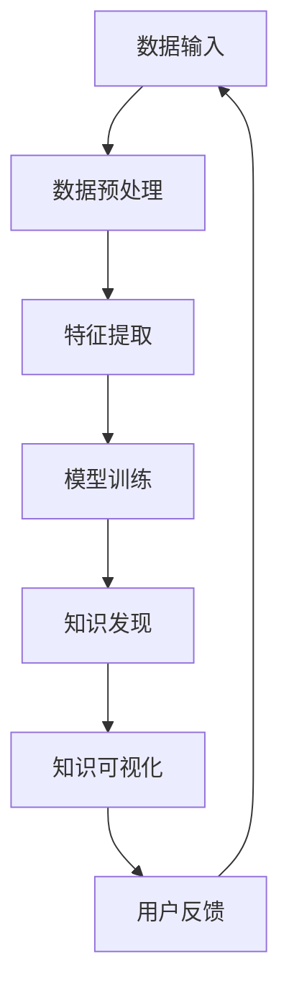

                 

关键词：知识发现、机器学习、数据挖掘、洞见挖掘、人工智能、知识图谱

> 摘要：本文探讨了知识发现引擎的设计与实现，通过深入分析其核心概念、算法原理及数学模型，阐述了如何利用人工智能技术挖掘隐藏在大量知识数据中的洞见。文章还结合实际案例，展示了知识发现引擎在各个领域的应用，并对未来发展趋势与面临的挑战进行了展望。

## 1. 背景介绍

在信息技术飞速发展的时代，海量的知识和数据不断涌现。如何从这些庞大的知识库中提取出有价值的洞见，已经成为一个亟待解决的问题。知识发现引擎作为一种智能化的数据处理工具，旨在帮助人们从大量数据中快速挖掘出潜在的、有趣的、有用的知识模式。

知识发现引擎的核心目标是将无序的数据转化为有序的知识，从而帮助用户更好地理解和利用这些数据。其应用范围非常广泛，涵盖了金融、医疗、零售、教育等多个行业。例如，在金融领域，知识发现引擎可以帮助银行和金融机构分析客户行为，发现潜在的风险和机会；在医疗领域，知识发现引擎可以辅助医生分析病例数据，提高诊断的准确性。

本文将详细介绍知识发现引擎的设计与实现，包括其核心概念、算法原理、数学模型以及实际应用场景。希望通过本文的阐述，能够为读者提供一种全新的视角，理解知识发现引擎的强大功能和应用价值。

## 2. 核心概念与联系

### 2.1 数据挖掘与知识发现

数据挖掘（Data Mining）是指从大量数据中提取出有价值的模式或知识的过程。它是一种跨学科的技术，涵盖了计算机科学、统计学、机器学习等多个领域。

知识发现（Knowledge Discovery）则是在数据挖掘的基础上，进一步提炼和总结数据中的规律和洞见，使其成为用户可以理解和利用的知识。知识发现不仅仅是数据的简单处理，它更强调对数据背后含义的深入挖掘和解释。

数据挖掘和知识发现之间有着密切的联系。数据挖掘是实现知识发现的重要手段，而知识发现则是数据挖掘的最终目标。通过数据挖掘，我们可以从原始数据中发现潜在的模式和规律，然后通过知识发现将这些模式转化为有用的知识，从而更好地指导决策和实践。

### 2.2 知识图谱与语义网络

知识图谱（Knowledge Graph）是一种结构化的知识表示方法，它通过实体和关系来组织知识，使得知识更加直观、易于理解。知识图谱在人工智能领域具有重要的应用价值，它可以用于问答系统、推荐系统、搜索引擎等多个方面。

语义网络（Semantic Network）是一种基于逻辑和关系的知识表示方法，它通过节点和边的形式来表示概念和概念之间的关系。语义网络在知识发现和语义推理中有着广泛的应用。

知识图谱和语义网络之间也有着紧密的联系。知识图谱可以看作是语义网络的一种扩展和实现，它通过更加丰富和复杂的结构来表示知识。同时，语义网络的一些方法和原理也可以被应用到知识图谱中，从而提高其表示和推理能力。

### 2.3 Mermaid 流程图

为了更好地理解知识发现引擎的工作原理和流程，我们可以使用 Mermaid 流程图来展示其核心组件和操作步骤。

下面是一个简单的 Mermaid 流程图示例：



这个流程图展示了知识发现引擎的基本工作流程，包括数据输入、数据预处理、特征提取、模型训练、知识发现、知识可视化和用户反馈等步骤。通过这个流程图，我们可以直观地了解知识发现引擎的运作机制和各个模块之间的关联。

## 3. 核心算法原理 & 具体操作步骤

### 3.1 算法原理概述

知识发现引擎的核心算法主要包括数据挖掘算法、机器学习算法和图论算法等。这些算法共同作用，实现从数据中提取知识、发现洞见的目标。

数据挖掘算法主要负责从原始数据中提取出潜在的模式和规律。常见的算法包括关联规则挖掘、聚类分析、分类分析等。

机器学习算法则用于对提取出的模式进行学习，从而建立预测模型。常见的算法包括决策树、支持向量机、神经网络等。

图论算法则用于对知识图谱进行构建和维护，从而实现知识的组织和表示。常见的算法包括图遍历、图匹配、图嵌入等。

### 3.2 算法步骤详解

下面是知识发现引擎的详细操作步骤：

#### 3.2.1 数据输入

数据输入是知识发现引擎的第一步，它决定了整个引擎的工作质量和效率。知识发现引擎需要从不同的数据源（如数据库、文件、网络等）获取数据，并将其存储在统一的数据仓库中。

#### 3.2.2 数据预处理

数据预处理是数据挖掘的重要步骤，它包括数据清洗、数据转换、数据集成等操作。数据预处理的主要目标是消除数据中的噪声、缺失值和异常值，从而提高数据的质量和一致性。

#### 3.2.3 特征提取

特征提取是将原始数据转化为适合挖掘的特征表示的过程。通过特征提取，我们可以从原始数据中提取出有价值的特征信息，从而提高挖掘算法的性能。

#### 3.2.4 模型训练

模型训练是知识发现引擎的核心步骤，它通过训练数据来建立预测模型。训练模型的过程包括数据预处理、特征选择、模型选择和模型训练等操作。

#### 3.2.5 知识发现

知识发现是知识发现引擎的最终目标，它通过分析训练好的模型，从数据中提取出潜在的、有用的知识模式。常见的知识发现算法包括关联规则挖掘、聚类分析、分类分析等。

#### 3.2.6 知识可视化

知识可视化是将提取出的知识以图形或表格的形式展示给用户，从而帮助用户更好地理解和利用这些知识。知识可视化可以采用多种形式，如知识图谱、热力图、折线图等。

#### 3.2.7 用户反馈

用户反馈是知识发现引擎不断优化和改进的重要途径。通过收集用户对知识的反馈，我们可以调整和优化知识发现算法，提高其准确性和实用性。

### 3.3 算法优缺点

#### 优点

1. **高效性**：知识发现引擎可以处理大量的数据，从而实现快速的知识提取和发现。
2. **灵活性**：知识发现引擎支持多种数据源和多种算法，可以根据具体需求和场景进行灵活调整。
3. **可扩展性**：知识发现引擎具有良好的可扩展性，可以轻松集成新的数据源和算法，从而不断提高其性能和功能。

#### 缺点

1. **复杂性**：知识发现引擎涉及多个技术和算法，实现和优化相对复杂。
2. **准确性**：知识发现引擎的准确性取决于数据质量和算法选择，需要不断优化和改进。
3. **成本**：知识发现引擎需要较高的硬件和软件资源支持，成本较高。

### 3.4 算法应用领域

知识发现引擎的应用领域非常广泛，涵盖了金融、医疗、零售、教育等多个行业。以下是一些典型的应用场景：

1. **金融行业**：知识发现引擎可以帮助银行和金融机构分析客户行为，发现潜在的风险和机会，从而优化业务决策和风险管理。
2. **医疗行业**：知识发现引擎可以辅助医生分析病例数据，提高诊断的准确性，发现新的治疗方法。
3. **零售行业**：知识发现引擎可以帮助零售商分析消费者行为，优化产品推荐和营销策略，提高销售额。
4. **教育行业**：知识发现引擎可以分析学生的学习数据，发现学习规律，为个性化教育提供支持。

## 4. 数学模型和公式 & 详细讲解 & 举例说明

### 4.1 数学模型构建

知识发现引擎的数学模型主要包括数据挖掘模型和机器学习模型。下面分别介绍这两个模型的构建过程。

#### 4.1.1 数据挖掘模型

数据挖掘模型主要通过统计分析方法来挖掘数据中的潜在模式。常见的模型包括关联规则挖掘模型、聚类分析模型、分类分析模型等。

关联规则挖掘模型通常使用Apriori算法或FP-growth算法来构建。这些算法的基本思想是找出数据中的频繁项集，然后从中提取出关联规则。

聚类分析模型通常使用K-means算法或DBSCAN算法来构建。这些算法的基本思想是将数据划分为若干个聚类，使得同一个聚类中的数据点具有较高的相似度。

分类分析模型通常使用决策树、支持向量机、神经网络等算法来构建。这些算法的基本思想是根据输入特征来预测输出标签。

#### 4.1.2 机器学习模型

机器学习模型主要通过机器学习算法来构建。常见的模型包括线性回归、逻辑回归、决策树、随机森林、神经网络等。

线性回归模型的基本思想是通过拟合一条直线来预测输出值。逻辑回归模型的基本思想是通过拟合一个逻辑函数来预测输出概率。

决策树模型的基本思想是通过一系列的决策规则来划分数据，并最终预测输出值。随机森林模型的基本思想是通过构建多棵决策树，并对它们的预测结果进行综合。

神经网络模型的基本思想是通过多层神经元来模拟人脑的神经网络，从而实现复杂的非线性预测。

### 4.2 公式推导过程

下面以线性回归模型为例，介绍其公式推导过程。

线性回归模型的目标是通过拟合一条直线来预测输出值。假设输入特征为\(X\)，输出值为\(Y\)，则线性回归模型可以表示为：

$$Y = \beta_0 + \beta_1 X + \varepsilon$$

其中，\(\beta_0\)和\(\beta_1\)分别为模型的参数，\(\varepsilon\)为误差项。

为了求解参数\(\beta_0\)和\(\beta_1\)，我们可以使用最小二乘法。最小二乘法的思想是使得拟合直线的误差平方和最小。具体推导过程如下：

$$\min \sum_{i=1}^n (Y_i - (\beta_0 + \beta_1 X_i))^2$$

对上式求导并令其等于零，可以得到：

$$\frac{\partial}{\partial \beta_0} \sum_{i=1}^n (Y_i - (\beta_0 + \beta_1 X_i))^2 = 0$$

$$\frac{\partial}{\partial \beta_1} \sum_{i=1}^n (Y_i - (\beta_0 + \beta_1 X_i))^2 = 0$$

经过求解，可以得到：

$$\beta_0 = \bar{Y} - \beta_1 \bar{X}$$

$$\beta_1 = \frac{\sum_{i=1}^n (X_i - \bar{X})(Y_i - \bar{Y})}{\sum_{i=1}^n (X_i - \bar{X})^2}$$

其中，\(\bar{X}\)和\(\bar{Y}\)分别为输入特征和输出值的均值。

### 4.3 案例分析与讲解

下面我们通过一个简单的案例来说明知识发现引擎的数学模型和算法。

假设我们有一个关于学生成绩的数据集，其中包含学生的考试成绩（输入特征）和课程名称（输出值）。我们的目标是利用知识发现引擎来分析学生成绩与课程名称之间的关系。

首先，我们使用线性回归模型来拟合学生成绩与课程名称之间的关系。输入特征为考试成绩，输出值为课程名称。

经过模型训练，我们得到了线性回归模型的参数\(\beta_0\)和\(\beta_1\)。假设\(\beta_0 = 70\)，\(\beta_1 = 0.5\)。

然后，我们使用这个模型来预测某个学生的成绩。假设这个学生的考试成绩为80分，我们可以将考试成绩代入线性回归模型：

$$Y = 70 + 0.5 \times 80 = 110$$

根据线性回归模型的预测，这个学生可能学习的课程名称为“数学”。

通过这个简单的案例，我们可以看到知识发现引擎的数学模型和算法是如何在实际应用中发挥作用的。通过拟合数学模型，我们可以从数据中发现潜在的规律和关系，从而指导实际决策和实践。

## 5. 项目实践：代码实例和详细解释说明

在本节中，我们将通过一个具体的代码实例来展示如何使用Python实现一个简单的知识发现引擎。这个实例将包括数据预处理、特征提取、模型训练以及知识可视化等步骤。

### 5.1 开发环境搭建

在开始之前，我们需要搭建一个Python开发环境。以下是所需的步骤：

1. 安装Python：前往Python官方网站（https://www.python.org/）下载并安装Python 3.8或更高版本。
2. 安装必要的库：使用以下命令安装所需的库：

```bash
pip install numpy pandas matplotlib scikit-learn
```

### 5.2 源代码详细实现

下面是一个简单的知识发现引擎的实现：

```python
import numpy as np
import pandas as pd
import matplotlib.pyplot as plt
from sklearn.model_selection import train_test_split
from sklearn.linear_model import LinearRegression
from sklearn.metrics import mean_squared_error

# 5.2.1 数据加载与预处理
def load_data(file_path):
    data = pd.read_csv(file_path)
    # 假设数据中包含考试成绩和课程名称两列
    X = data[['考试成绩']]
    y = data[['课程名称']]
    return X, y

X, y = load_data('student_scores.csv')

# 将课程名称编码为数字
y_encoded = pd.factorize(y)[0]

# 5.2.2 特征提取
# 在这个简单的例子中，我们只使用考试成绩作为特征
X_train, X_test, y_train, y_test = train_test_split(X, y_encoded, test_size=0.2, random_state=42)

# 5.2.3 模型训练
model = LinearRegression()
model.fit(X_train, y_train)

# 5.2.4 预测与评估
y_pred = model.predict(X_test)
mse = mean_squared_error(y_test, y_pred)
print(f"均方误差: {mse}")

# 5.2.5 知识可视化
plt.scatter(X_test, y_test, c='red', label='实际值')
plt.scatter(X_test, y_pred, c='blue', label='预测值')
plt.xlabel('考试成绩')
plt.ylabel('课程名称')
plt.legend()
plt.show()
```

### 5.3 代码解读与分析

上面的代码实现了一个简单的知识发现引擎，主要分为以下几个步骤：

1. **数据加载与预处理**：我们首先加载了包含考试成绩和课程名称的数据集，并对课程名称进行了编码处理。
2. **特征提取**：在这个例子中，我们只使用了一个特征——考试成绩。
3. **模型训练**：我们使用线性回归模型对训练数据进行拟合。
4. **预测与评估**：使用训练好的模型对测试数据进行预测，并计算均方误差来评估模型的性能。
5. **知识可视化**：我们将实际值和预测值以散点图的形式展示，从而直观地观察模型的效果。

### 5.4 运行结果展示

运行上述代码后，我们将看到一个散点图，其中红色散点表示实际值，蓝色散点表示预测值。通过观察散点图，我们可以直观地看到模型对数据的拟合效果。如果大部分蓝色散点集中在红色散点周围，说明模型具有良好的预测性能。

## 6. 实际应用场景

知识发现引擎在各个领域的应用都非常广泛，下面我们分别介绍几个典型的应用场景。

### 6.1 金融行业

在金融行业，知识发现引擎可以帮助银行和金融机构分析客户行为，识别潜在的风险和机会。例如，通过分析客户的交易记录、信用记录等信息，银行可以识别出可能存在欺诈行为的客户，从而采取相应的预防措施。

此外，知识发现引擎还可以用于风险评估和投资组合优化。通过分析大量的市场数据，银行可以预测市场趋势，为投资决策提供支持。

### 6.2 医疗行业

在医疗行业，知识发现引擎可以辅助医生分析病例数据，提高诊断的准确性。例如，通过分析大量的病例数据，医生可以识别出某些疾病的常见症状和治疗方案，从而提高诊断的准确性。

知识发现引擎还可以用于疾病预测和预防。通过分析患者的健康数据，医生可以预测患者可能患上的疾病，并采取相应的预防措施。

### 6.3 零售行业

在零售行业，知识发现引擎可以帮助零售商分析消费者行为，优化产品推荐和营销策略。例如，通过分析消费者的购买记录和浏览行为，零售商可以识别出潜在的高价值客户，并为其提供个性化的产品推荐。

此外，知识发现引擎还可以用于库存管理和供应链优化。通过分析销售数据和库存数据，零售商可以预测未来的销售趋势，从而优化库存水平，减少库存成本。

### 6.4 教育行业

在教育行业，知识发现引擎可以分析学生的学习数据，为个性化教育提供支持。例如，通过分析学生的学习行为和成绩数据，教师可以识别出学生的学习困难点，并为其提供有针对性的辅导。

知识发现引擎还可以用于课程推荐和学习分析。通过分析学生的学习行为和成绩数据，系统可以推荐适合学生的课程，并分析学生的学习效果，从而优化课程设置。

## 7. 工具和资源推荐

为了更好地学习和使用知识发现引擎，我们推荐以下工具和资源：

### 7.1 学习资源推荐

1. **《数据挖掘：概念与技术》（第三版）**：由Jiawei Han、Micheline Kamber和Peipei Yang合著，这是一本全面介绍数据挖掘技术和应用的书。
2. **《机器学习实战》**：由Peter Harrington著，这本书通过大量的实例和代码，详细介绍了各种机器学习算法的原理和应用。

### 7.2 开发工具推荐

1. **Jupyter Notebook**：Jupyter Notebook是一款强大的交互式计算环境，适用于编写和运行Python代码，非常适合数据科学和机器学习项目。
2. **Scikit-learn**：Scikit-learn是一个开源的Python机器学习库，提供了丰富的机器学习算法和工具，非常适合初学者和专业人士。

### 7.3 相关论文推荐

1. **“Knowledge Discovery in Databases”**：由Jiawei Han、Micheline Kamber和Jian Pei合著，这是一篇经典的综述论文，详细介绍了知识发现的过程和方法。
2. **“An Overview of Statistical Learning Theory”**：由John H. Holland著，这篇论文介绍了统计学习理论的基本概念和方法，对理解机器学习算法具有重要意义。

## 8. 总结：未来发展趋势与挑战

### 8.1 研究成果总结

知识发现引擎作为人工智能和数据挖掘领域的重要工具，已经取得了显著的成果。通过结合多种算法和数学模型，知识发现引擎在多个领域展现出了强大的功能和应用价值。然而，当前的研究仍然存在一些局限性，需要进一步探索和改进。

### 8.2 未来发展趋势

1. **算法优化**：随着计算能力的提升和数据量的增加，对知识发现引擎算法的优化将成为一个重要方向。研究人员将致力于开发更高效、更准确的算法，以应对大规模数据挖掘的需求。
2. **多模态数据挖掘**：未来的知识发现引擎将能够处理多种类型的数据，如文本、图像、音频等，实现多模态数据的综合挖掘和分析。
3. **实时知识发现**：随着物联网和实时数据处理技术的发展，实时知识发现将成为一个重要的研究热点。研究人员将致力于开发实时、高效的知识发现系统，以支持实时决策和监控。
4. **隐私保护**：在处理敏感数据时，隐私保护将成为一个重要的挑战。未来的知识发现引擎将需要具备强大的隐私保护能力，以保护用户的隐私和安全。

### 8.3 面临的挑战

1. **数据质量**：高质量的数据是知识发现成功的关键。未来需要研究如何从大量数据中筛选和清洗出高质量的数据，以提高知识发现的准确性和可靠性。
2. **算法复杂度**：随着数据规模的增加，知识发现算法的复杂度也会不断提高。未来需要研究如何降低算法复杂度，提高知识发现引擎的效率和性能。
3. **可解释性**：知识发现引擎的决策过程往往涉及到复杂的算法和模型。如何提高知识发现引擎的可解释性，使其能够为用户理解和信任，是一个重要的挑战。

### 8.4 研究展望

知识发现引擎在人工智能和数据挖掘领域具有广泛的应用前景。未来，我们需要关注以下几个方面：

1. **跨学科研究**：知识发现引擎的发展需要融合计算机科学、统计学、机器学习、生物学等多个学科的知识，开展跨学科研究，推动知识发现引擎的创新发展。
2. **实际应用**：加强知识发现引擎在实际领域的应用研究，探索其在金融、医疗、零售、教育等行业的应用场景和解决方案。
3. **人才培养**：培养具有跨学科背景和实际应用能力的数据科学家和人工智能工程师，为知识发现引擎的发展提供人才支持。

通过不断的研究和探索，知识发现引擎将发挥出更大的作用，为人类社会的发展带来更多的价值。

## 9. 附录：常见问题与解答

### 9.1 什么是知识发现引擎？

知识发现引擎是一种人工智能工具，它能够从大量的数据中自动识别出潜在的模式和规律，从而帮助人们更好地理解和利用这些数据。

### 9.2 知识发现引擎有哪些应用领域？

知识发现引擎的应用领域非常广泛，包括金融、医疗、零售、教育、制造业等。例如，在金融领域，它可以用于风险管理和客户分析；在医疗领域，它可以用于疾病诊断和患者管理。

### 9.3 知识发现引擎的关键技术是什么？

知识发现引擎的关键技术包括数据挖掘、机器学习、图论、自然语言处理等。这些技术共同作用，实现了从数据中提取知识、发现洞见的目标。

### 9.4 如何评估知识发现引擎的性能？

评估知识发现引擎的性能可以通过多种指标，如准确率、召回率、F1值、均方误差等。这些指标可以帮助我们量化知识发现引擎的性能，并指导进一步的优化和改进。

### 9.5 知识发现引擎与数据挖掘有何区别？

知识发现引擎是数据挖掘的一种实现形式，它更强调对数据背后含义的深入挖掘和解释。数据挖掘则更侧重于从数据中提取出有用的信息，而不一定涉及对数据的深入解释。

### 9.6 知识发现引擎是否能够替代人类专家？

知识发现引擎可以通过自动化和智能化手段提高数据分析和决策的效率，但它并不能完全替代人类专家。在某些领域，人类专家的经验和直觉仍然具有不可替代的价值。知识发现引擎和人类专家的结合将更好地发挥各自的优势。

### 9.7 知识发现引擎的发展趋势是什么？

知识发现引擎的发展趋势包括算法优化、多模态数据挖掘、实时知识发现和隐私保护等方面。未来，知识发现引擎将更加高效、智能，并在更多的领域发挥重要作用。

