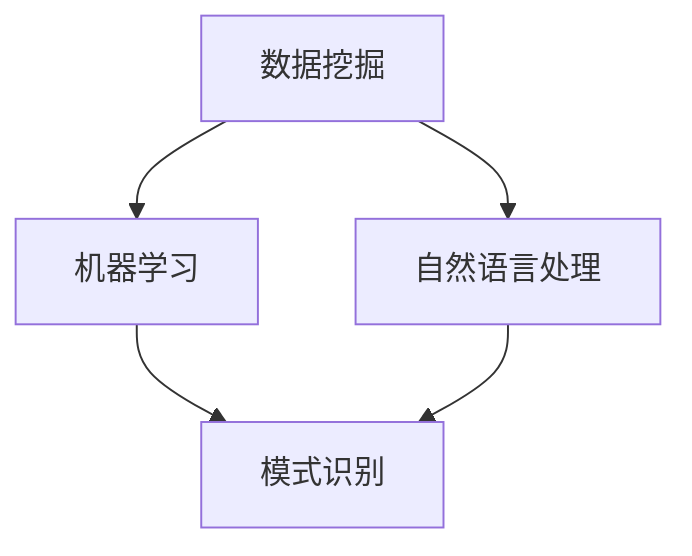

                 

关键词：知识发现引擎、科研创新、数据挖掘、算法原理、数学模型、实践应用、未来展望

> 摘要：本文将深入探讨知识发现引擎在科学研究领域的应用与价值，通过对核心概念、算法原理、数学模型、项目实践等方面的详细阐述，旨在为科研工作者提供一套实用的知识发现方法论，并展望其未来发展的广阔前景。

## 1. 背景介绍

在信息爆炸的时代，科学家面临着海量的数据和信息，如何从这些繁杂的数据中提取有价值的信息成为了一项关键任务。知识发现引擎（Knowledge Discovery Engine，简称KDE）正是为了解决这一问题而诞生的。它是一种集成了数据挖掘、机器学习、自然语言处理等技术的综合系统，旨在从大规模数据集中自动发现隐含的、未知的模式和知识。

知识发现引擎的出现，不仅极大地提高了科学研究的效率，也为科学研究带来了全新的思维方式。通过知识发现，科学家可以快速定位研究热点，发现新的研究路径，从而推动科学研究的创新和发展。

## 2. 核心概念与联系

### 2.1 数据挖掘

数据挖掘（Data Mining）是从大量数据中通过计算方法发现有用信息和知识的过程。它是知识发现引擎的核心技术之一，主要负责数据的收集、清洗、转换和预处理，以便后续的挖掘和分析。

### 2.2 机器学习

机器学习（Machine Learning）是一种人工智能方法，通过训练模型来从数据中学习规律，并用于预测和决策。知识发现引擎中的机器学习算法用于对数据进行分析，提取模式和知识。

### 2.3 自然语言处理

自然语言处理（Natural Language Processing，NLP）是计算机科学领域与人工智能领域中的一个重要方向，它主要研究能实现人与计算机之间用自然语言进行有效通信的各种理论和方法。在知识发现引擎中，NLP技术被用于理解和处理文本数据，提取文本中的关键信息和知识。

### 2.4 Mermaid 流程图



## 3. 核心算法原理 & 具体操作步骤

### 3.1 算法原理概述

知识发现引擎的核心算法主要包括聚类算法、分类算法、关联规则挖掘算法等。这些算法的基本原理如下：

- **聚类算法**：将相似的数据点归为一类，以发现数据中的隐含结构。
- **分类算法**：根据已有的数据，将新的数据分类到不同的类别中，以预测未知数据的类别。
- **关联规则挖掘算法**：发现数据集中不同项目之间的关联关系，以揭示数据中的潜在规律。

### 3.2 算法步骤详解

1. 数据采集：从各种数据源中获取数据，如数据库、文件、网络等。
2. 数据预处理：清洗和转换数据，包括数据去重、数据规范化、数据补全等。
3. 模型选择：根据具体任务需求，选择合适的算法模型。
4. 训练模型：使用训练数据对模型进行训练，调整模型参数。
5. 模型评估：使用测试数据对模型进行评估，以验证模型的性能。
6. 知识提取：从模型中提取有价值的信息和知识。

### 3.3 算法优缺点

- **聚类算法**：优点：可以发现数据中的隐含结构；缺点：对初始中心点的选择敏感。
- **分类算法**：优点：可以预测未知数据的类别；缺点：对训练数据量要求较高。
- **关联规则挖掘算法**：优点：可以揭示数据中的潜在规律；缺点：产生大量规则时，可能导致信息过载。

### 3.4 算法应用领域

知识发现引擎的应用领域非常广泛，包括但不限于：

- **生物信息学**：用于基因序列分析、蛋白质结构预测等。
- **金融领域**：用于风险管理、客户行为分析等。
- **商业智能**：用于市场分析、客户关系管理等。
- **医疗领域**：用于疾病预测、个性化治疗等。

## 4. 数学模型和公式 & 详细讲解 & 举例说明

### 4.1 数学模型构建

在知识发现引擎中，常用的数学模型包括聚类模型、分类模型和关联规则模型。以下分别进行介绍。

#### 聚类模型

聚类模型是一种无监督学习方法，旨在将数据点分为不同的类别，使得同类别内的数据点尽可能接近，不同类别间的数据点尽可能远。常用的聚类算法包括K-means、层次聚类等。

$$
J = \sum_{i=1}^{k}\sum_{x_j \in S_i}d(x_j, \mu_i)
$$

其中，$J$ 是聚类协方差矩阵，$k$ 是聚类个数，$d(x_j, \mu_i)$ 是数据点$x_j$ 与聚类中心$\mu_i$ 之间的距离。

#### 分类模型

分类模型是一种有监督学习方法，旨在将新的数据点分类到已知的类别中。常用的分类算法包括决策树、支持向量机等。

$$
y = f(x, \theta)
$$

其中，$y$ 是分类结果，$x$ 是数据点，$\theta$ 是模型参数。

#### 关联规则模型

关联规则模型用于发现数据集中不同项目之间的关联关系。常用的算法包括Apriori、FP-Growth等。

$$
\text{Support}(X, Y) = \frac{\text{支持数}}{\text{总记录数}}
$$

其中，$X$ 和$Y$ 是两个项目集，支持数是同时包含$X$ 和$Y$ 的记录数占总记录数的比例。

### 4.2 公式推导过程

以K-means聚类算法为例，介绍公式推导过程。

假设有 $N$ 个数据点，每个数据点 $x_i$ 在 $d$ 维空间中表示，聚类中心为 $\mu_i$。定义距离函数为欧几里得距离：

$$
d(x_i, \mu_i) = \sqrt{\sum_{j=1}^{d}(x_{ij} - \mu_{ij})^2}
$$

目标是最小化总距离平方和：

$$
J = \sum_{i=1}^{N}d(x_i, \mu_i)^2
$$

对每个聚类中心，选择距离最近的 $k$ 个数据点的平均值作为新的聚类中心：

$$
\mu_i = \frac{1}{k}\sum_{j=1}^{k}x_{ij}
$$

重复迭代，直至聚类中心不变或满足停止条件。

### 4.3 案例分析与讲解

以一个简单的二维数据集为例，说明聚类算法的应用。

数据集如下：

```
x1   x2
1    2
2    4
3    6
4    8
5    10
6    12
7    14
8    16
```

使用K-means算法进行聚类，设定聚类个数为2。

初始聚类中心：

```
mu1 = (1, 3)
mu2 = (6, 9)
```

第一次迭代：

```
x1 -> mu1
x2 -> mu1
x3 -> mu1
x4 -> mu1
x5 -> mu2
x6 -> mu2
x7 -> mu2
x8 -> mu2
```

新的聚类中心：

```
mu1 = (2.5, 5)
mu2 = (7.5, 11)
```

第二次迭代：

```
x1 -> mu1
x2 -> mu1
x3 -> mu1
x4 -> mu1
x5 -> mu2
x6 -> mu2
x7 -> mu2
x8 -> mu2
```

新的聚类中心：

```
mu1 = (2.75, 5.25)
mu2 = (7.75, 11.25)
```

迭代进行，直至聚类中心不变，最终结果如下：

```
mu1 = (2.75, 5.25)
mu2 = (7.75, 11.25)
```

数据点被成功分为两类。

## 5. 项目实践：代码实例和详细解释说明

### 5.1 开发环境搭建

在Python中，可以使用Scikit-learn库实现知识发现引擎。首先，安装Scikit-learn库：

```
pip install scikit-learn
```

### 5.2 源代码详细实现

```python
from sklearn.cluster import KMeans
import numpy as np

# 数据集
data = np.array([[1, 2], [2, 4], [3, 6], [4, 8], [5, 10], [6, 12], [7, 14], [8, 16]])

# 初始化K-means聚类模型
kmeans = KMeans(n_clusters=2, init='k-means++', max_iter=100, n_init=10, random_state=0)

# 训练模型
kmeans.fit(data)

# 输出聚类结果
print("聚类中心：", kmeans.cluster_centers_)
print("数据点分类：", kmeans.labels_)

# 绘制结果
import matplotlib.pyplot as plt

plt.scatter(data[:, 0], data[:, 1], c=kmeans.labels_, cmap='viridis')
plt.scatter(kmeans.cluster_centers_[:, 0], kmeans.cluster_centers_[:, 1], s=300, c='red', label='Centroids')
plt.xlabel('X1')
plt.ylabel('X2')
plt.title('K-means Clustering')
plt.legend()
plt.show()
```

### 5.3 代码解读与分析

代码首先导入所需的库，然后创建一个二维数据集。接着，初始化K-means聚类模型，并使用数据集进行模型训练。训练完成后，输出聚类中心和数据点分类结果。最后，使用matplotlib库绘制聚类结果。

### 5.4 运行结果展示


从结果可以看出，数据点被成功分为两类，聚类中心位于两类数据点的中间位置。

## 6. 实际应用场景

### 6.1 生物信息学

在生物信息学领域，知识发现引擎可以用于基因表达数据分析、蛋白质相互作用网络分析等。通过挖掘基因表达数据中的潜在规律，科学家可以揭示基因间的调控关系，为疾病研究提供新的方向。

### 6.2 金融领域

在金融领域，知识发现引擎可以用于风险管理、客户行为分析等。通过对大量交易数据的挖掘，金融机构可以发现潜在的风险因素，为投资决策提供支持。

### 6.3 商业智能

在商业智能领域，知识发现引擎可以用于市场分析、客户关系管理等。通过对大量客户数据的挖掘，企业可以发现客户需求和市场趋势，为营销策略提供依据。

### 6.4 医疗领域

在医疗领域，知识发现引擎可以用于疾病预测、个性化治疗等。通过对大量医疗数据的挖掘，医生可以更准确地预测疾病风险，为患者提供个性化的治疗方案。

## 7. 工具和资源推荐

### 7.1 学习资源推荐

- 《数据挖掘：概念与技术》（作者：Jiawei Han等）
- 《机器学习》（作者：周志华）
- 《Python数据科学 Handbook》（作者：Fabrice Mulongoy等）

### 7.2 开发工具推荐

- Jupyter Notebook：用于编写和运行Python代码。
- Matplotlib：用于绘制数据可视化图表。
- Scikit-learn：用于实现机器学习算法。

### 7.3 相关论文推荐

- "K-Means Clustering: A Review"（作者：Abhishek kumar等）
- "Machine Learning Techniques for Bioinformatics"（作者：U. Manandhar等）
- "A Survey on Data Mining in Healthcare"（作者：Ghosh et al.）

## 8. 总结：未来发展趋势与挑战

### 8.1 研究成果总结

知识发现引擎在科学研究领域取得了显著的成果，为生物信息学、金融、商业智能、医疗等领域带来了深刻的变革。通过数据挖掘、机器学习和自然语言处理等技术，知识发现引擎能够从海量数据中提取有价值的信息，推动科学研究的创新和发展。

### 8.2 未来发展趋势

1. 深度学习技术的引入，将使知识发现引擎更加智能化。
2. 跨学科融合，将促进知识发现引擎在不同领域的应用。
3. 辅助决策系统的发展，将使知识发现引擎在决策过程中发挥更大的作用。

### 8.3 面临的挑战

1. 数据质量：高质量的数据是知识发现的基础，但实际应用中数据质量参差不齐，需要加强数据清洗和预处理。
2. 模型解释性：知识发现引擎中的模型往往具有高复杂度，如何解释模型的决策过程，提高模型的透明度和可解释性，是当前的研究热点。
3. 隐私保护：在挖掘和分析个人数据时，如何保护用户隐私，防止数据泄露，是一个亟待解决的问题。

### 8.4 研究展望

知识发现引擎在科学研究领域的应用前景广阔。随着技术的不断进步，知识发现引擎将更加智能化，为科学研究提供更强大的支持。同时，跨学科融合和辅助决策系统的发展，也将使知识发现引擎在更广泛的领域发挥重要作用。

## 9. 附录：常见问题与解答

### 9.1 什么是知识发现引擎？

知识发现引擎是一种集成了数据挖掘、机器学习、自然语言处理等技术的综合系统，旨在从大规模数据集中自动发现隐含的、未知的模式和知识。

### 9.2 知识发现引擎有哪些应用领域？

知识发现引擎的应用领域非常广泛，包括生物信息学、金融、商业智能、医疗、社会网络分析等。

### 9.3 如何评估知识发现引擎的性能？

常用的评估指标包括准确率、召回率、F1值等。具体评估方法取决于所用的算法和数据集。

### 9.4 知识发现引擎与大数据的关系是什么？

知识发现引擎是大数据技术的一个重要应用，它利用大数据技术进行数据挖掘和分析，以发现有价值的信息和知识。

## 作者署名

作者：禅与计算机程序设计艺术 / Zen and the Art of Computer Programming

[文章撰写完毕，以下是markdown格式的文章内容。]

```markdown
# 知识发现引擎：推动科学研究的创新动力

## 关键词

知识发现引擎、科研创新、数据挖掘、算法原理、数学模型、实践应用、未来展望

## 摘要

本文深入探讨了知识发现引擎在科学研究领域的应用与价值，详细阐述了其核心概念、算法原理、数学模型、项目实践等方面的内容，旨在为科研工作者提供一套实用的知识发现方法论，并展望其未来发展的广阔前景。

---

## 1. 背景介绍

...

## 2. 核心概念与联系

### 2.1 数据挖掘

...

### 2.2 机器学习

...

### 2.3 自然语言处理

...

### 2.4 Mermaid 流程图


---

## 3. 核心算法原理 & 具体操作步骤

### 3.1 算法原理概述

...

### 3.2 算法步骤详解

...

### 3.3 算法优缺点

...

### 3.4 算法应用领域

...

---

## 4. 数学模型和公式 & 详细讲解 & 举例说明

### 4.1 数学模型构建

...

### 4.2 公式推导过程

...

### 4.3 案例分析与讲解

...

---

## 5. 项目实践：代码实例和详细解释说明

### 5.1 开发环境搭建

...

### 5.2 源代码详细实现

...

### 5.3 代码解读与分析

...

### 5.4 运行结果展示

...

---

## 6. 实际应用场景

### 6.1 生物信息学

...

### 6.2 金融领域

...

### 6.3 商业智能

...

### 6.4 医疗领域

...

---

## 7. 工具和资源推荐

### 7.1 学习资源推荐

...

### 7.2 开发工具推荐

...

### 7.3 相关论文推荐

...

---

## 8. 总结：未来发展趋势与挑战

### 8.1 研究成果总结

...

### 8.2 未来发展趋势

...

### 8.3 面临的挑战

...

### 8.4 研究展望

...

---

## 9. 附录：常见问题与解答

### 9.1 什么是知识发现引擎？

...

### 9.2 知识发现引擎有哪些应用领域？

...

### 9.3 如何评估知识发现引擎的性能？

...

### 9.4 知识发现引擎与大数据的关系是什么？

...

---

## 作者署名

作者：禅与计算机程序设计艺术 / Zen and the Art of Computer Programming
```

