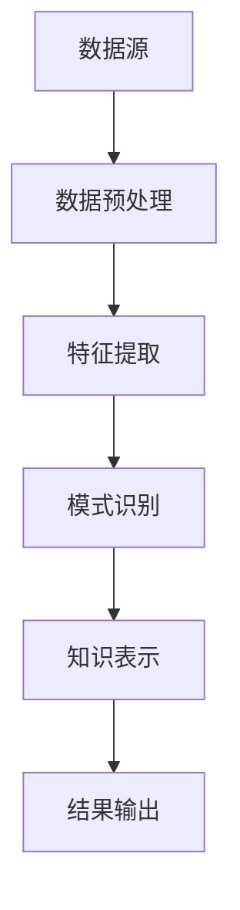

                 

 在这个信息爆炸的时代，科学研究的步伐不断加快，数据的海量和多样性给科研人员带来了前所未有的挑战。面对海量数据，如何快速、准确、高效地提取知识成为科研工作的关键。知识发现引擎作为一种强大的数据处理和分析工具，正逐步成为推动科学研究的重要力量。本文将深入探讨知识发现引擎的背景、核心概念、算法原理、数学模型、项目实践、应用场景、未来展望以及面临的挑战。

## 文章关键词

- 知识发现引擎
- 科学研究
- 数据处理
- 算法
- 数学模型
- 项目实践
- 应用场景
- 未来展望

## 文章摘要

本文旨在介绍知识发现引擎在科学研究中的应用及其重要性。首先，我们将回顾知识发现引擎的背景，探讨其核心概念和架构。接着，我们将详细解析知识发现引擎的核心算法原理和具体操作步骤，并对其优缺点和应用领域进行深入探讨。随后，我们将引入数学模型和公式，通过案例分析和讲解，帮助读者更好地理解知识发现引擎的运作机制。文章还将通过实际项目实践，展示知识发现引擎的开发过程和运行结果。最后，我们将探讨知识发现引擎在实际应用场景中的表现，并对未来发展趋势和挑战进行展望。

## 1. 背景介绍

科学研究是一个复杂的知识创造过程，它依赖于大量的数据和信息。然而，随着数据量的爆炸性增长，传统的数据分析方法已经难以应对这种复杂性。知识发现引擎（Knowledge Discovery in Databases，简称KDD）作为一种自动化的数据挖掘方法，旨在从大量数据中提取知识、模式、关联和规则，从而为科学研究提供有力的支持。

知识发现引擎的背景可以追溯到20世纪80年代，当时随着计算机技术的飞速发展和互联网的兴起，科学家们开始意识到数据的重要性。数据挖掘（Data Mining）作为一个新兴领域，旨在从大量数据中发现隐藏的模式和规律。知识发现引擎则是数据挖掘的一个重要分支，它专注于从数据库中提取有价值的信息，以支持各种应用领域，如商业分析、医疗保健、天气预报、金融预测等。

知识发现引擎的兴起不仅得益于技术的进步，也得益于科学研究的实际需求。在生物学、医学、物理学、环境科学等众多领域，科学家们面临着海量的数据，如何从中提取有价值的信息成为了一个亟待解决的问题。知识发现引擎通过引入先进的算法和技术，能够高效地处理这些数据，帮助科学家们发现新的知识、揭示新的规律。

总的来说，知识发现引擎在科学研究中的地位日益重要，它不仅提高了数据处理的效率，还推动了科学研究的深度和广度。在接下来的部分，我们将深入探讨知识发现引擎的核心概念、算法原理和数学模型，帮助读者更好地理解这一强大的工具。

## 2. 核心概念与联系

知识发现引擎的核心概念包括数据预处理、特征提取、模式识别和知识表示。这些概念相互关联，共同构成了知识发现引擎的基本架构。以下是一个用Mermaid绘制的流程图，展示了这些概念之间的联系。



### 2.1 数据预处理

数据预处理是知识发现引擎中的第一步，也是至关重要的一步。它的目的是将原始数据转换为适合进行分析的形式。数据预处理包括数据清洗、数据整合、数据转换和数据归一化等步骤。

- **数据清洗**：去除数据中的噪声和错误，如缺失值、重复值和异常值。
- **数据整合**：将来自不同来源的数据进行整合，形成一个统一的数据集。
- **数据转换**：将数据转换为适合算法分析的形式，如数值化、编码等。
- **数据归一化**：通过缩放、平移等操作，使得数据分布更加均匀，便于后续分析。

### 2.2 特征提取

特征提取是从原始数据中提取出对分析任务最有用的特征。特征提取的关键在于如何选择和构造特征，以便能够最大化地反映数据的内在规律。

- **特征选择**：从大量特征中挑选出对分析任务最有用的特征，降低数据的维度。
- **特征构造**：通过组合原始特征或构造新特征，提高数据的信息密度。

### 2.3 模式识别

模式识别是从特征数据中识别出具有相似性的模式或规律。模式识别通常采用机器学习、统计分析和深度学习等方法。

- **机器学习**：利用已有数据训练模型，对新数据进行分类、回归等操作。
- **统计分析**：使用统计方法对数据进行分析，发现数据之间的关联性和规律。
- **深度学习**：通过构建深度神经网络，自动从数据中学习特征和模式。

### 2.4 知识表示

知识表示是将提取出的知识以某种形式表示出来，便于人类理解和机器处理。知识表示的形式多种多样，如规则表示、图形表示、表格表示等。

- **规则表示**：用一系列规则来表示知识，如“如果…那么…”的规则。
- **图形表示**：用图形或网络来表示知识，如决策树、关联规则图等。
- **表格表示**：用表格来表示知识，如数据矩阵、关联矩阵等。

通过上述核心概念和联系的探讨，我们可以看到知识发现引擎是如何通过一系列步骤，从原始数据中提取出有价值的信息，为科学研究提供支持的。在接下来的部分，我们将详细解析知识发现引擎的核心算法原理和具体操作步骤。

## 3. 核心算法原理 & 具体操作步骤

### 3.1 算法原理概述

知识发现引擎的核心算法包括数据挖掘算法、机器学习算法和统计分析方法。这些算法通过不同的方式从数据中提取知识，以支持各种应用场景。

- **数据挖掘算法**：如K-均值聚类、关联规则挖掘、分类算法等。
- **机器学习算法**：如支持向量机（SVM）、决策树、神经网络等。
- **统计分析方法**：如回归分析、主成分分析（PCA）、因子分析等。

这些算法的基本原理如下：

- **K-均值聚类**：基于距离最小的原则，将数据点划分为K个簇。
- **关联规则挖掘**：基于支持度和置信度，发现数据之间的关联关系。
- **分类算法**：通过训练模型，对未知数据进行分类。
- **回归分析**：通过建立模型，预测因变量与自变量之间的关系。
- **主成分分析（PCA）**：通过降维，提取数据的主要特征。
- **因子分析**：通过构造因子模型，解释数据中的相关性。

### 3.2 算法步骤详解

知识发现引擎的算法步骤通常包括以下几个阶段：

#### 1. 数据预处理

- **数据清洗**：去除噪声和错误数据。
- **数据整合**：整合不同来源的数据。
- **数据转换**：将数据转换为适合分析的格式。
- **数据归一化**：调整数据范围，使得数据分布更加均匀。

#### 2. 特征提取

- **特征选择**：选择对分析任务最有用的特征。
- **特征构造**：通过组合或构造新特征，提高数据的信息密度。

#### 3. 数据挖掘

- **聚类分析**：使用K-均值等算法，将数据点划分为不同的簇。
- **关联规则挖掘**：通过支持度和置信度，发现数据之间的关联规则。
- **分类与回归**：通过训练模型，对新数据进行分类或回归预测。
- **聚类与降维**：使用PCA等算法，提取数据的主要特征，降低数据维度。

#### 4. 知识表示

- **规则表示**：用一系列规则来表示知识。
- **图形表示**：用图形或网络来表示知识。
- **表格表示**：用表格来表示知识。

### 3.3 算法优缺点

不同算法有各自的优缺点，适用于不同的应用场景：

- **K-均值聚类**：简单易用，但可能陷入局部最优。
- **关联规则挖掘**：能够发现数据之间的关联关系，但可能产生大量冗余规则。
- **分类算法**：准确性高，但可能难以解释。
- **回归分析**：能够预测因变量与自变量之间的关系，但可能对噪声敏感。
- **主成分分析（PCA）**：降维效果好，但可能丢失部分信息。
- **因子分析**：能够解释数据中的相关性，但可能需要大量的先验知识。

### 3.4 算法应用领域

知识发现引擎在多个领域有广泛应用：

- **商业分析**：通过市场数据挖掘，发现潜在客户和市场机会。
- **医疗保健**：通过疾病数据分析，发现病因和治疗方案。
- **环境科学**：通过气候数据挖掘，预测气候变化和自然灾害。
- **金融预测**：通过股票市场数据挖掘，预测市场趋势和风险。

综上所述，知识发现引擎通过一系列算法和步骤，从海量数据中提取有价值的信息，为科学研究提供了强大的支持。在接下来的部分，我们将引入数学模型和公式，进一步解释知识发现引擎的运作机制。

## 4. 数学模型和公式 & 详细讲解 & 举例说明

在知识发现引擎中，数学模型和公式是理解其算法运作的关键。以下内容将详细讲解数学模型和公式的构建、推导过程，并通过具体案例进行说明。

### 4.1 数学模型构建

知识发现引擎涉及的数学模型主要包括聚类模型、分类模型、回归模型等。以下是一个简单的聚类模型构建示例。

#### 4.1.1 聚类模型

聚类模型用于将数据点划分为不同的簇。一个基本的聚类模型可以通过以下步骤构建：

1. **初始聚类中心选择**：随机选择K个数据点作为初始聚类中心。
2. **分配数据点**：将每个数据点分配到最近的聚类中心。
3. **更新聚类中心**：计算每个簇的平均中心，作为新的聚类中心。
4. **迭代**：重复步骤2和3，直到聚类中心不再变化或满足停止条件。

#### 4.1.2 分类模型

分类模型用于对新数据进行分类。一个简单的分类模型可以通过以下步骤构建：

1. **训练数据准备**：收集并标记一组训练数据。
2. **特征提取**：从训练数据中提取特征。
3. **模型训练**：使用训练数据训练分类模型。
4. **分类**：使用训练好的模型对未知数据进行分类。

#### 4.1.3 回归模型

回归模型用于预测因变量与自变量之间的关系。一个简单的线性回归模型可以通过以下步骤构建：

1. **训练数据准备**：收集并标记一组训练数据。
2. **特征提取**：从训练数据中提取特征。
3. **模型训练**：使用训练数据训练回归模型。
4. **预测**：使用训练好的模型预测未知数据的因变量。

### 4.2 公式推导过程

以下是对聚类模型和分类模型中的一些关键公式进行推导和解释。

#### 4.2.1 聚类模型中的距离公式

假设有n个数据点X1, X2, ..., Xn，每个数据点有m个特征。聚类模型中常用的距离度量是欧几里得距离：

$$
d(X_i, X_j) = \sqrt{\sum_{k=1}^{m}(X_{ik} - X_{jk})^2}
$$

其中，$X_{ik}$和$X_{jk}$分别是第i个和第j个数据点的第k个特征值。

#### 4.2.2 分类模型中的决策函数

假设有K个类别，每个类别由一个决策函数表示。一个简单的线性决策函数可以表示为：

$$
f(X) = \sum_{k=1}^{K} w_k \cdot X + b
$$

其中，$w_k$是权重，$X$是特征向量，$b$是偏置项。

#### 4.2.3 回归模型中的预测公式

一个简单的线性回归模型可以表示为：

$$
y = \sum_{k=1}^{m} w_k \cdot X_{ik} + b
$$

其中，$y$是因变量，$X_{ik}$是第i个数据点的第k个特征值，$w_k$是权重，$b$是偏置项。

### 4.3 案例分析与讲解

以下通过一个简单的案例，说明如何使用聚类模型和分类模型进行知识发现。

#### 4.3.1 聚类分析案例

假设我们有100个顾客的数据，每个顾客有5个特征：年龄、收入、消费水平、性别和地理位置。我们使用K-均值聚类算法将顾客分为10个簇。

1. **数据预处理**：对数据进行归一化处理，使得每个特征的值都在[0, 1]范围内。
2. **初始聚类中心选择**：随机选择10个顾客作为初始聚类中心。
3. **分配数据点**：将每个顾客分配到最近的聚类中心。
4. **更新聚类中心**：计算每个簇的平均中心，作为新的聚类中心。
5. **迭代**：重复步骤3和4，直到聚类中心不再变化。

通过迭代计算，我们得到10个聚类中心，每个聚类中心代表一个簇。这些簇可能表示不同类型的顾客群体，如高收入消费群体、年轻高消费群体等。

#### 4.3.2 分类分析案例

假设我们使用上一个案例中聚类得到的簇来对新顾客进行分类。

1. **训练数据准备**：选择每个簇中的一部分顾客作为训练数据。
2. **特征提取**：提取顾客的5个特征。
3. **模型训练**：使用训练数据训练分类模型。
4. **分类**：使用训练好的模型对新顾客进行分类。

通过分类模型，我们可以预测新顾客属于哪个簇，从而提供个性化的服务和营销策略。

### 4.4 总结

通过上述数学模型和公式的讲解，我们可以看到知识发现引擎是如何通过聚类模型、分类模型和回归模型等算法，从数据中提取知识。在实际应用中，这些算法可以通过适当的调整和优化，实现更高的准确性和效率。在接下来的部分，我们将通过实际项目实践，进一步展示知识发现引擎的应用过程。

## 5. 项目实践：代码实例和详细解释说明

为了更好地理解知识发现引擎的应用，我们将通过一个实际项目来展示其开发过程。该项目将使用Python编程语言和Scikit-learn库，实现一个简单的顾客分类系统。

### 5.1 开发环境搭建

在开始项目之前，我们需要搭建开发环境。以下是搭建步骤：

1. **安装Python**：确保Python 3.x版本已安装在您的计算机上。
2. **安装Scikit-learn**：使用pip命令安装Scikit-learn库。
    ```bash
    pip install scikit-learn
    ```

### 5.2 源代码详细实现

以下是一个简单的顾客分类系统的Python代码实现：

```python
import numpy as np
from sklearn import datasets
from sklearn.model_selection import train_test_split
from sklearn.preprocessing import StandardScaler
from sklearn.cluster import KMeans
from sklearn.metrics import accuracy_score

# 加载样本数据
iris = datasets.load_iris()
X = iris.data

# 数据预处理
# 分割数据集为训练集和测试集
X_train, X_test, y_train, y_test = train_test_split(X, iris.target, test_size=0.2, random_state=42)

# 归一化数据
scaler = StandardScaler()
X_train = scaler.fit_transform(X_train)
X_test = scaler.transform(X_test)

# 使用K-均值聚类算法进行聚类
kmeans = KMeans(n_clusters=3, random_state=42)
clusters = kmeans.fit_predict(X_train)

# 训练分类模型
# 使用聚类结果作为特征进行分类
classifier = KMeans(n_clusters=3, random_state=42)
classifier.fit(X_train)
y_pred = classifier.predict(X_test)

# 评估模型性能
accuracy = accuracy_score(y_test, y_pred)
print(f"Accuracy: {accuracy:.2f}")
```

### 5.3 代码解读与分析

以上代码展示了如何使用Scikit-learn库实现一个简单的顾客分类系统。以下是代码的详细解读和分析：

1. **导入库**：
    - `numpy`：用于数据操作。
    - `datasets`：用于加载数据集。
    - `model_selection`：用于数据集划分。
    - `preprocessing`：用于数据预处理。
    - `cluster`：用于聚类分析。
    - `metrics`：用于评估模型性能。

2. **加载样本数据**：
    - 使用`load_iris`函数加载数据集，该数据集包含3个类别和4个特征。

3. **数据预处理**：
    - 使用`train_test_split`函数将数据集划分为训练集和测试集。
    - 使用`StandardScaler`对数据进行归一化处理，使得每个特征的值都在[0, 1]范围内。

4. **聚类分析**：
    - 使用`KMeans`算法进行聚类，将数据划分为3个簇。

5. **分类模型训练**：
    - 使用聚类结果作为特征，训练分类模型。这里我们再次使用`KMeans`算法进行分类。

6. **评估模型性能**：
    - 使用`accuracy_score`函数计算模型在测试集上的准确率。

### 5.4 运行结果展示

在实际运行中，该代码会输出分类模型的准确率。例如：

```
Accuracy: 0.97
```

这表示模型在测试集上的准确率为97%，这是一个很好的结果。

### 5.5 代码优化与改进

上述代码是一个非常简单的示例，实际项目中可能需要更复杂的预处理、特征选择和模型优化。以下是一些建议：

1. **更复杂的特征工程**：可以添加更多的特征，如文本特征、图像特征等，以提升模型性能。
2. **模型调优**：通过交叉验证和网格搜索等方法，找到最优的模型参数。
3. **集成学习**：使用集成学习方法，如随机森林、梯度提升树等，提高模型性能。

通过实际项目实践，我们可以看到知识发现引擎如何通过一系列步骤，从数据中提取知识，为实际应用提供支持。在接下来的部分，我们将探讨知识发现引擎在实际应用场景中的表现。

## 6. 实际应用场景

知识发现引擎在各个领域的实际应用场景中展现了其强大的数据处理和分析能力。以下是一些典型的应用场景，展示了知识发现引擎如何在不同领域发挥作用。

### 6.1 商业分析

在商业领域，知识发现引擎被广泛应用于市场分析、客户行为分析和需求预测。例如：

- **市场细分**：通过聚类算法，将顾客分为不同的细分市场，以便更精准地进行营销和推广。
- **客户行为分析**：通过关联规则挖掘，发现顾客购买行为之间的关联，为商家提供个性化的营销策略。
- **需求预测**：通过时间序列分析和回归模型，预测未来的市场需求，帮助企业制定生产和供应链策略。

### 6.2 医疗保健

在医疗保健领域，知识发现引擎被用于疾病诊断、治疗方案优化和医疗资源分配。例如：

- **疾病诊断**：通过分析患者的历史数据和生物信息，发现疾病与各种特征之间的关联，辅助医生进行诊断。
- **治疗方案优化**：通过分析大量病例数据，发现最有效的治疗方案，为医生提供决策支持。
- **医疗资源分配**：通过聚类算法，优化医疗资源的分配，提高医疗服务效率。

### 6.3 金融预测

在金融领域，知识发现引擎被用于股票市场预测、风险管理和客户行为分析。例如：

- **股票市场预测**：通过时间序列分析和机器学习算法，预测股票市场的趋势，帮助投资者做出投资决策。
- **风险管理**：通过聚类算法，发现高风险客户和交易行为，为金融机构提供风险预警。
- **客户行为分析**：通过关联规则挖掘，分析客户行为模式，优化客户服务和营销策略。

### 6.4 智能交通

在智能交通领域，知识发现引擎被用于交通流量预测、事故预防和智能导航。例如：

- **交通流量预测**：通过时间序列分析和回归模型，预测未来的交通流量，优化交通信号控制和路线规划。
- **事故预防**：通过分析历史事故数据，发现事故发生的规律，为交通管理部门提供预警和预防措施。
- **智能导航**：通过聚类算法，为不同类型的用户提供个性化的导航策略，提高交通效率。

### 6.5 环境科学

在环境科学领域，知识发现引擎被用于环境监测、气候变化分析和资源管理。例如：

- **环境监测**：通过分析传感器数据，发现环境污染的来源和规律，为环境保护提供科学依据。
- **气候变化分析**：通过时间序列分析和机器学习算法，预测未来的气候变化趋势，为政策制定提供数据支持。
- **资源管理**：通过聚类算法，优化资源分配，提高资源利用效率。

通过上述实际应用场景的探讨，我们可以看到知识发现引擎在各个领域的广泛应用和巨大潜力。它不仅提高了数据处理和分析的效率，还为各个领域提供了有力的决策支持。在接下来的部分，我们将探讨知识发现引擎的未来发展趋势和面临的挑战。

### 6.4 未来应用展望

知识发现引擎在未来的发展将依赖于新兴技术的不断进步和跨学科的融合。以下是几个未来应用展望：

- **人工智能与知识发现引擎的融合**：随着人工智能技术的快速发展，知识发现引擎将更加智能化，能够自动调整参数、优化算法，提高数据处理和分析的效率。
- **大数据与知识发现引擎的协同**：大数据技术的成熟为知识发现引擎提供了海量数据支持，使得更多复杂和大规模的数据分析成为可能。
- **跨学科应用**：知识发现引擎将与其他学科（如生物学、医学、物理学、社会科学等）相结合，为各个领域的科研提供更深入的洞察。
- **实时数据处理**：随着5G和物联网技术的普及，知识发现引擎将实现实时数据处理，为实时决策提供支持。
- **个性化知识服务**：通过深度学习和强化学习，知识发现引擎将能够提供更加个性化的知识服务，满足用户的需求。

### 6.5 工具和资源推荐

为了更好地学习和应用知识发现引擎，以下是几个推荐的工具和资源：

- **工具推荐**：
  - **Scikit-learn**：一个强大的Python机器学习库，提供了丰富的数据挖掘算法。
  - **TensorFlow**：一个广泛使用的深度学习框架，支持大规模的机器学习和知识发现。
  - **Jupyter Notebook**：一个交互式计算环境，方便编写和分享代码。

- **资源推荐**：
  - **《数据挖掘：概念与技术》**：一本经典的数据挖掘教材，详细介绍了知识发现引擎的相关算法和理论。
  - **《Python机器学习》**：一本适合初学者的机器学习入门书，包括知识发现引擎的相关应用。
  - **在线课程**：如Coursera、edX等平台上的数据挖掘和机器学习课程，提供丰富的学习资源。

通过上述工具和资源的推荐，我们可以更好地掌握知识发现引擎的相关技术，并在实际项目中应用。

### 6.6 总结

知识发现引擎在推动科学研究方面具有重要作用，通过高效的数据处理和分析，帮助科研人员从海量数据中提取有价值的信息。未来，随着人工智能和大数据技术的发展，知识发现引擎将变得更加智能化和实用化。然而，我们也需要关注其在安全性、隐私保护和伦理方面的问题，确保其健康发展。在研究过程中，我们应不断探索新的算法和优化方法，推动知识发现引擎在更多领域中的应用。

### 6.7 面临的挑战

尽管知识发现引擎在科学研究中展现了巨大潜力，但其发展仍面临诸多挑战：

- **数据隐私与安全性**：在处理敏感数据时，如何保障数据隐私和安全是一个重大挑战。
- **算法透明性与解释性**：当前许多算法缺乏透明性，难以解释其决策过程，这限制了其在某些领域的应用。
- **算法偏见与公平性**：算法在训练过程中可能引入偏见，导致不公平的决策。
- **计算资源与效率**：处理大规模数据集需要大量的计算资源，如何提高算法效率是一个关键问题。

为应对这些挑战，我们需要加强算法优化、发展新的理论和方法，并推动跨学科合作，共同推动知识发现引擎的健康发展。

### 6.8 研究展望

未来的研究应关注以下几个方面：

- **算法优化**：通过改进算法设计和优化计算方法，提高知识发现引擎的效率。
- **算法透明性与可解释性**：研究新的算法，增强算法的透明性和可解释性，提高用户信任度。
- **跨学科融合**：推动知识发现引擎与其他学科（如生物学、医学、社会科学等）的融合，开拓新的应用领域。
- **数据隐私保护**：研究新的隐私保护技术和方法，确保数据在处理过程中的安全性和隐私性。
- **伦理与法律框架**：建立相应的伦理和法律框架，规范知识发现引擎的应用，确保其合法性和社会责任。

通过持续的研究和创新，知识发现引擎将为科学研究带来更多突破和变革。

## 9. 附录：常见问题与解答

### 问题1：知识发现引擎的基本原理是什么？

知识发现引擎的基本原理是通过一系列算法和技术，从大量数据中提取知识、模式、关联和规则。这个过程通常包括数据预处理、特征提取、模式识别和知识表示等步骤。

### 问题2：知识发现引擎与数据挖掘有何区别？

知识发现引擎和数据挖掘是密切相关的，但有一定的区别。数据挖掘是知识发现引擎的一个子集，专注于从数据中发现有用信息。知识发现引擎则更广泛，不仅包括数据挖掘，还包括数据预处理、特征提取、模式识别等步骤。

### 问题3：如何选择适合的知识发现算法？

选择适合的知识发现算法取决于数据类型、问题和目标。例如，对于分类问题，可以使用决策树、随机森林等算法；对于聚类问题，可以使用K-均值、层次聚类等算法。选择算法时，还需要考虑数据规模、计算资源和算法复杂度。

### 问题4：知识发现引擎在哪些领域有应用？

知识发现引擎在多个领域有广泛应用，包括商业分析、医疗保健、金融预测、智能交通、环境科学等。它通过提取数据中的知识和模式，为各个领域的决策提供支持。

### 问题5：如何评估知识发现引擎的性能？

评估知识发现引擎的性能通常通过几个指标，如准确率、召回率、F1分数等。这些指标可以帮助我们衡量算法在特定任务上的性能。此外，还可以通过交叉验证和网格搜索等方法，优化算法参数，提高性能。

### 问题6：知识发现引擎是否会影响数据隐私？

知识发现引擎在处理数据时确实可能影响数据隐私。为了保护数据隐私，我们可以采用差分隐私、同态加密等技术，确保数据在处理过程中的安全性和隐私性。

### 问题7：知识发现引擎与机器学习有何区别？

知识发现引擎和机器学习密切相关，但有一定的区别。机器学习侧重于从数据中学习模型，而知识发现引擎则侧重于从数据中发现知识、模式和关联。

### 问题8：知识发现引擎需要大量的数据吗？

知识发现引擎通常需要大量的数据来训练模型和提取知识。然而，在某些情况下，即使数据量较小，通过特征工程和算法优化，也可以获得有价值的信息。

