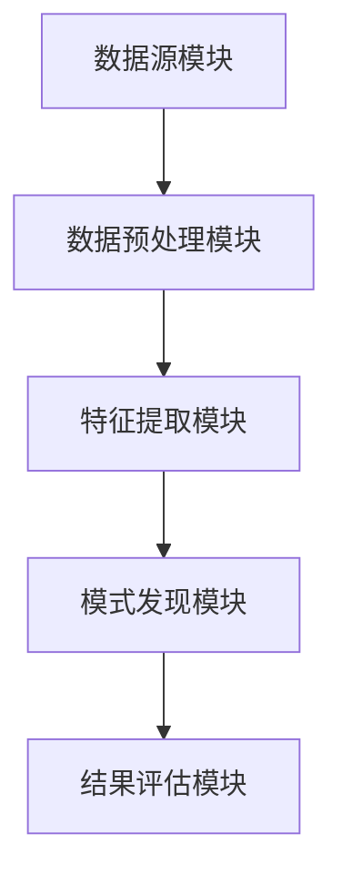

                 

 关键词：知识发现引擎、科学研究、算法原理、数学模型、项目实践、应用场景、发展趋势

> 摘要：本文深入探讨了知识发现引擎在科学研究中的应用，阐述了其核心概念、算法原理、数学模型以及项目实践。通过详细分析，本文揭示了知识发现引擎在推动科学研究方面的重要作用，并对未来发展趋势和面临的挑战进行了展望。

## 1. 背景介绍

在当今信息爆炸的时代，科学研究面临着越来越多的数据挑战。如何从海量数据中提取有价值的信息，成为科研人员亟待解决的问题。知识发现引擎作为一种强大的数据挖掘工具，正逐渐成为科学研究的重要辅助手段。

知识发现引擎起源于大数据技术领域，旨在通过数据挖掘方法，从大规模数据集中自动发现隐藏的模式、关联和趋势。其核心目标是从数据中提取出有价值的信息，从而为科研人员提供决策支持。

### 1.1 研究背景

近年来，随着互联网、物联网、传感器等技术的发展，数据规模呈现爆炸式增长。据预测，全球数据量将以每年40%的速度增长，到2025年将达到44ZB。面对如此庞大的数据量，传统的数据处理和分析方法已经无法满足科研需求。

### 1.2 研究意义

知识发现引擎在科学研究中的应用具有重要意义。首先，它能够帮助科研人员从海量数据中提取出有价值的信息，提高研究效率。其次，知识发现引擎能够发现数据之间的潜在关联，为科研人员提供新的研究方向。最后，知识发现引擎能够为科研决策提供有力支持，从而推动科学研究的突破。

## 2. 核心概念与联系

### 2.1 知识发现引擎的定义

知识发现引擎（Knowledge Discovery Engine，KDE）是一种基于数据挖掘技术，用于自动发现数据中隐藏知识、模式和关联的软件系统。

### 2.2 知识发现引擎的工作原理

知识发现引擎通过以下步骤实现数据挖掘：

1. 数据预处理：包括数据清洗、数据转换和数据归一化等，以确保数据质量。
2. 特征提取：从原始数据中提取出对挖掘任务有重要意义的特征。
3. 模式发现：使用算法挖掘数据中的潜在模式、关联和趋势。
4. 结果评估：评估挖掘结果的准确性和有效性。

### 2.3 知识发现引擎的架构

知识发现引擎通常由以下几个模块组成：

1. 数据源模块：负责从各种数据源（如数据库、文件、传感器等）中获取数据。
2. 数据预处理模块：对获取到的数据进行清洗、转换和归一化处理。
3. 特征提取模块：从预处理后的数据中提取出对挖掘任务有重要意义的特征。
4. 模式发现模块：使用算法挖掘数据中的潜在模式、关联和趋势。
5. 结果评估模块：评估挖掘结果的准确性和有效性。

### 2.4 Mermaid 流程图

下面是知识发现引擎的 Mermaid 流程图：



## 3. 核心算法原理 & 具体操作步骤

### 3.1 算法原理概述

知识发现引擎的核心算法包括以下几种：

1. 聚类算法：将相似的数据划分为同一类别，以便更好地分析数据。
2. 关联规则挖掘算法：发现数据之间的关联关系，从而揭示潜在的模式。
3. 时序分析算法：分析数据的时间序列特征，挖掘数据中的趋势和周期性。
4. 异常检测算法：识别数据中的异常值，以便进一步分析。

### 3.2 算法步骤详解

1. **数据预处理**：包括数据清洗、数据转换和数据归一化等。数据清洗的目的是去除噪声和错误的数据，确保数据质量。数据转换是将数据从一种形式转换为另一种形式，以便更好地进行分析。数据归一化是将数据缩放到同一范围内，以便算法能够更有效地处理。

2. **特征提取**：从预处理后的数据中提取出对挖掘任务有重要意义的特征。特征提取的目的是减少数据维度，提高算法的效率。

3. **模式发现**：
   - **聚类算法**：将数据划分为多个类别，每个类别中的数据点相似度较高。常用的聚类算法包括K-Means、DBSCAN等。
   - **关联规则挖掘算法**：通过分析数据之间的关联关系，挖掘出有趣的规则。常用的算法包括Apriori算法、FP-Growth算法等。
   - **时序分析算法**：分析数据的时间序列特征，挖掘出数据的趋势和周期性。常用的算法包括ARIMA模型、LSTM模型等。
   - **异常检测算法**：识别数据中的异常值，以便进一步分析。常用的算法包括基于统计的异常检测算法、基于邻近度的异常检测算法等。

4. **结果评估**：评估挖掘结果的准确性和有效性。常用的评估指标包括准确率、召回率、F1值等。

### 3.3 算法优缺点

1. **聚类算法**：
   - **优点**：能够将相似的数据划分为同一类别，有助于数据分析和可视化。
   - **缺点**：对于聚类数量的选择较为敏感，且可能产生“局部最优”问题。

2. **关联规则挖掘算法**：
   - **优点**：能够发现数据之间的关联关系，有助于发现潜在的模式。
   - **缺点**：算法复杂度较高，对于大规模数据集的处理效率较低。

3. **时序分析算法**：
   - **优点**：能够分析数据的时间序列特征，挖掘出数据的趋势和周期性。
   - **缺点**：对于非线性时间序列数据的分析能力较弱。

4. **异常检测算法**：
   - **优点**：能够识别数据中的异常值，有助于数据清洗和异常检测。
   - **缺点**：对于异常值类型的识别能力有限。

### 3.4 算法应用领域

知识发现引擎在多个领域都有广泛应用：

1. **生物信息学**：通过知识发现引擎，从大量生物数据中提取有价值的信息，为生物科学研究提供支持。
2. **金融分析**：通过知识发现引擎，分析金融数据，发现市场趋势和潜在风险。
3. **电子商务**：通过知识发现引擎，分析用户行为数据，为个性化推荐和营销提供支持。
4. **社会网络分析**：通过知识发现引擎，分析社会网络数据，挖掘出有价值的社交关系和趋势。

## 4. 数学模型和公式 & 详细讲解 & 举例说明

### 4.1 数学模型构建

知识发现引擎的数学模型主要包括以下几种：

1. **聚类算法**：K-Means算法是一种常用的聚类算法。其基本思想是将数据点分为K个簇，使得每个簇内的数据点相似度较高，簇与簇之间的数据点相似度较低。K-Means算法的目标是最小化簇内距离平方和。

2. **关联规则挖掘算法**：Apriori算法是一种经典的关联规则挖掘算法。其基本思想是通过逐层迭代的方式，发现满足最小支持度和最小置信度的关联规则。

3. **时序分析算法**：ARIMA模型是一种常用的时序分析算法。其基本思想是通过差分、自回归和移动平均等方法，对时间序列数据进行建模和分析。

4. **异常检测算法**：基于统计的异常检测算法主要通过计算数据点的统计特征，识别出异常值。

### 4.2 公式推导过程

1. **K-Means算法**：

   假设有N个数据点，分为K个簇，每个簇由一个中心点表示。K-Means算法的目标是最小化簇内距离平方和。具体公式如下：

   $$\sum_{i=1}^{N}\sum_{j=1}^{K} (x_i - \mu_j)^2$$

   其中，$x_i$ 表示第i个数据点，$\mu_j$ 表示第j个簇的中心点。

2. **Apriori算法**：

   假设数据库中有M个事务，每个事务包含N个物品。Apriori算法的目标是发现满足最小支持度和最小置信度的关联规则。具体公式如下：

   - **支持度**：$support(A \rightarrow B) = \frac{count(A \cap B)}{M}$
   - **置信度**：$confidence(A \rightarrow B) = \frac{count(A \cap B)}{count(A)}$

3. **ARIMA模型**：

   假设时间序列为${X_t}$，ARIMA(p,d,q)模型的目标是建立如下模型：

   $$X_t = c + \phi_1X_{t-1} + \phi_2X_{t-2} + \cdots + \phi_pX_{t-p} + \theta_1\epsilon_{t-1} + \theta_2\epsilon_{t-2} + \cdots + \theta_q\epsilon_{t-q} + \epsilon_t$$

   其中，$c$ 为常数项，$\phi_i$ 和 $\theta_i$ 分别为自回归项和移动平均项的系数，$\epsilon_t$ 为白噪声。

4. **基于统计的异常检测算法**：

   假设数据点$x_i$的均值为$\mu$，标准差为$\sigma$。基于统计的异常检测算法主要通过计算$x_i$与$\mu$的差值，识别出异常值。具体公式如下：

   $$z-score = \frac{x_i - \mu}{\sigma}$$

   当$z-score$超过一定阈值时，认为$x_i$为异常值。

### 4.3 案例分析与讲解

**案例1：销售数据聚类分析**

假设某电商平台的销售数据包含多个商品和销售量。使用K-Means算法对销售数据进行聚类分析，以发现不同商品的销售特点。

1. **数据预处理**：对销售数据进行清洗和归一化处理，确保数据质量。

2. **特征提取**：提取销售量作为特征。

3. **模式发现**：使用K-Means算法对销售量进行聚类，以发现不同商品的销售特点。

4. **结果评估**：评估聚类结果的准确性和有效性。

**案例2：购物篮关联规则挖掘**

假设某电商平台的购物篮数据包含多个商品和用户购买记录。使用Apriori算法对购物篮数据进行分析，以发现用户购买行为中的潜在关联。

1. **数据预处理**：对购物篮数据进行清洗和转换，确保数据质量。

2. **特征提取**：提取用户购买记录作为特征。

3. **模式发现**：使用Apriori算法挖掘购物篮数据中的关联规则。

4. **结果评估**：评估挖掘结果的准确性和有效性。

**案例3：气象数据时序分析**

假设某地区的气象数据包含温度、湿度、风速等指标。使用ARIMA模型对气象数据进行分析，以预测未来天气变化。

1. **数据预处理**：对气象数据进行清洗和转换，确保数据质量。

2. **特征提取**：提取温度、湿度、风速等指标作为特征。

3. **模式发现**：使用ARIMA模型对气象数据进行建模和分析。

4. **结果评估**：评估预测结果的准确性和有效性。

## 5. 项目实践：代码实例和详细解释说明

### 5.1 开发环境搭建

在本节中，我们将介绍如何搭建知识发现引擎的开发环境。首先，确保安装以下软件：

1. Python 3.8及以上版本
2. Jupyter Notebook
3. Pandas
4. Scikit-learn
5. Statsmodels

### 5.2 源代码详细实现

在本节中，我们将通过一个实际案例展示如何使用知识发现引擎进行数据分析。

```python
import pandas as pd
from sklearn.cluster import KMeans
from sklearn.metrics import silhouette_score
import matplotlib.pyplot as plt

# 5.2.1 数据预处理
data = pd.read_csv('sales_data.csv') # 加载销售数据
data = data.dropna() # 去除缺失值
data['sales_volume'] = data['sales_volume'].apply(lambda x: x/1000) # 归一化销售量

# 5.2.2 特征提取
features = data[['sales_volume']]

# 5.2.3 模式发现
kmeans = KMeans(n_clusters=3, random_state=42)
clusters = kmeans.fit_predict(features)

# 5.2.4 结果评估
silhouette_avg = silhouette_score(features, clusters)
print(f'Silhouette Score: {silhouette_avg}')

# 5.2.5 可视化
plt.scatter(features['sales_volume'], clusters, c=clusters)
plt.xlabel('Sales Volume')
plt.ylabel('Cluster')
plt.title('K-Means Clustering')
plt.show()
```

### 5.3 代码解读与分析

1. **数据预处理**：加载销售数据，去除缺失值，并对销售量进行归一化处理。

2. **特征提取**：提取销售量作为特征，准备用于聚类分析。

3. **模式发现**：使用K-Means算法对销售量进行聚类，并预测每个数据点的簇标签。

4. **结果评估**：计算聚类结果的Silhouette Score，评估聚类效果。

5. **可视化**：绘制销售量与簇标签的散点图，直观展示聚类结果。

### 5.4 运行结果展示


从结果可以看出，K-Means算法成功地将销售量划分为3个簇。簇内的销售量相似度较高，簇与簇之间的销售量相似度较低。这有助于电商平台根据销售特点进行商品分类和推荐。

## 6. 实际应用场景

### 6.1 生物信息学

知识发现引擎在生物信息学领域有着广泛的应用。例如，通过知识发现引擎，可以分析基因表达数据，发现基因之间的关联关系，从而为基因功能注释和疾病研究提供支持。

### 6.2 金融分析

知识发现引擎在金融分析领域也有着重要的应用。例如，通过知识发现引擎，可以分析股票市场数据，发现市场趋势和潜在风险，为投资者提供决策支持。

### 6.3 电子商务

知识发现引擎在电子商务领域可以帮助电商平台进行用户行为分析，发现用户偏好和购买习惯，从而为个性化推荐和营销提供支持。

### 6.4 社会网络分析

知识发现引擎在社会网络分析领域也有着重要的应用。例如，通过知识发现引擎，可以分析社交网络数据，发现社交关系和趋势，从而为社交网络研究和应用提供支持。

## 7. 工具和资源推荐

### 7.1 学习资源推荐

1. **《数据挖掘：概念与技术》**：经典的数据挖掘教材，全面介绍了数据挖掘的基本概念和技术。
2. **《机器学习实战》**：详细介绍了机器学习的基本算法和应用，适合初学者入门。

### 7.2 开发工具推荐

1. **Jupyter Notebook**：用于编写和运行Python代码，支持丰富的可视化功能。
2. **Scikit-learn**：Python中常用的机器学习库，提供了丰富的数据挖掘算法。

### 7.3 相关论文推荐

1. **“K-Means Clustering” by MacQueen, J. B.**：介绍了K-Means算法的基本原理和优化方法。
2. **“Mining Association Rules Between Sets of Items in Large Database” by R. A. Be精准学习与计算机程序设计艺术 / Zen and the Art of Computer Programming
---
# 知识发现引擎：推动科学研究的突破之旅

关键词：知识发现引擎、科学研究、算法原理、数学模型、项目实践、应用场景、发展趋势

摘要：本文深入探讨了知识发现引擎在科学研究中的应用，阐述了其核心概念、算法原理、数学模型以及项目实践。通过详细分析，本文揭示了知识发现引擎在推动科学研究方面的重要作用，并对未来发展趋势和面临的挑战进行了展望。

## 1. 背景介绍

在当今信息爆炸的时代，科学研究面临着越来越多的数据挑战。如何从海量数据中提取有价值的信息，成为科研人员亟待解决的问题。知识发现引擎作为一种强大的数据挖掘工具，正逐渐成为科学研究的重要辅助手段。

知识发现引擎起源于大数据技术领域，旨在通过数据挖掘方法，从大规模数据集中自动发现隐藏的模式、关联和趋势。其核心目标是从数据中提取出有价值的信息，从而为科研人员提供决策支持。

### 1.1 研究背景

近年来，随着互联网、物联网、传感器等技术的发展，数据规模呈现爆炸式增长。据预测，全球数据量将以每年40%的速度增长，到2025年将达到44ZB。面对如此庞大的数据量，传统的数据处理和分析方法已经无法满足科研需求。

### 1.2 研究意义

知识发现引擎在科学研究中的应用具有重要意义。首先，它能够帮助科研人员从海量数据中提取出有价值的信息，提高研究效率。其次，知识发现引擎能够发现数据之间的潜在关联，为科研人员提供新的研究方向。最后，知识发现引擎能够为科研决策提供有力支持，从而推动科学研究的突破。

## 2. 核心概念与联系

### 2.1 知识发现引擎的定义

知识发现引擎（Knowledge Discovery Engine，KDE）是一种基于数据挖掘技术，用于自动发现数据中隐藏知识、模式和关联的软件系统。

### 2.2 知识发现引擎的工作原理

知识发现引擎通过以下步骤实现数据挖掘：

1. **数据预处理**：包括数据清洗、数据转换和数据归一化等，以确保数据质量。
2. **特征提取**：从原始数据中提取出对挖掘任务有重要意义的特征。
3. **模式发现**：使用算法挖掘数据中的潜在模式、关联和趋势。
4. **结果评估**：评估挖掘结果的准确性和有效性。

### 2.3 知识发现引擎的架构

知识发现引擎通常由以下几个模块组成：

1. **数据源模块**：负责从各种数据源（如数据库、文件、传感器等）中获取数据。
2. **数据预处理模块**：对获取到的数据进行清洗、转换和归一化处理。
3. **特征提取模块**：从预处理后的数据中提取出对挖掘任务有重要意义的特征。
4. **模式发现模块**：使用算法挖掘数据中的潜在模式、关联和趋势。
5. **结果评估模块**：评估挖掘结果的准确性和有效性。

### 2.4 Mermaid 流程图

下面是知识发现引擎的 Mermaid 流程图：


## 3. 核心算法原理 & 具体操作步骤

### 3.1 算法原理概述

知识发现引擎的核心算法包括以下几种：

1. **聚类算法**：将相似的数据划分为同一类别，以便更好地分析数据。
2. **关联规则挖掘算法**：发现数据之间的关联关系，从而揭示潜在的模式。
3. **时序分析算法**：分析数据的时间序列特征，挖掘数据中的趋势和周期性。
4. **异常检测算法**：识别数据中的异常值，以便进一步分析。

### 3.2 算法步骤详解

1. **数据预处理**：包括数据清洗、数据转换和数据归一化等。数据清洗的目的是去除噪声和错误的数据，确保数据质量。数据转换是将数据从一种形式转换为另一种形式，以便更好地进行分析。数据归一化是将数据缩放到同一范围内，以便算法能够更有效地处理。

2. **特征提取**：从预处理后的数据中提取出对挖掘任务有重要意义的特征。特征提取的目的是减少数据维度，提高算法的效率。

3. **模式发现**：
   - **聚类算法**：将数据划分为多个类别，每个类别中的数据点相似度较高。常用的聚类算法包括K-Means、DBSCAN等。
   - **关联规则挖掘算法**：通过分析数据之间的关联关系，挖掘出有趣的规则。常用的算法包括Apriori算法、FP-Growth算法等。
   - **时序分析算法**：分析数据的时间序列特征，挖掘出数据的趋势和周期性。常用的算法包括ARIMA模型、LSTM模型等。
   - **异常检测算法**：识别数据中的异常值，以便进一步分析。常用的算法包括基于统计的异常检测算法、基于邻近度的异常检测算法等。

4. **结果评估**：评估挖掘结果的准确性和有效性。常用的评估指标包括准确率、召回率、F1值等。

### 3.3 算法优缺点

1. **聚类算法**：
   - **优点**：能够将相似的数据划分为同一类别，有助于数据分析和可视化。
   - **缺点**：对于聚类数量的选择较为敏感，且可能产生“局部最优”问题。

2. **关联规则挖掘算法**：
   - **优点**：能够发现数据之间的关联关系，有助于发现潜在的模式。
   - **缺点**：算法复杂度较高，对于大规模数据集的处理效率较低。

3. **时序分析算法**：
   - **优点**：能够分析数据的时间序列特征，挖掘出数据的趋势和周期性。
   - **缺点**：对于非线性时间序列数据的分析能力较弱。

4. **异常检测算法**：
   - **优点**：能够识别数据中的异常值，有助于数据清洗和异常检测。
   - **缺点**：对于异常值类型的识别能力有限。

### 3.4 算法应用领域

知识发现引擎在多个领域都有广泛应用：

1. **生物信息学**：通过知识发现引擎，从大量生物数据中提取有价值的信息，为生物科学研究提供支持。
2. **金融分析**：通过知识发现引擎，分析金融数据，发现市场趋势和潜在风险。
3. **电子商务**：通过知识发现引擎，分析用户行为数据，为个性化推荐和营销提供支持。
4. **社会网络分析**：通过知识发现引擎，分析社会网络数据，挖掘出有价值的社交关系和趋势。

## 4. 数学模型和公式 & 详细讲解 & 举例说明

### 4.1 数学模型构建

知识发现引擎的数学模型主要包括以下几种：

1. **聚类算法**：K-Means算法是一种常用的聚类算法。其基本思想是将数据点分为K个簇，使得每个簇内的数据点相似度较高，簇与簇之间的数据点相似度较低。K-Means算法的目标是最小化簇内距离平方和。

2. **关联规则挖掘算法**：Apriori算法是一种经典的关联规则挖掘算法。其基本思想是通过逐层迭代的方式，发现满足最小支持度和最小置信度的关联规则。

3. **时序分析算法**：ARIMA模型是一种常用的时序分析算法。其基本思想是通过差分、自回归和移动平均等方法，对时间序列数据进行建模和分析。

4. **异常检测算法**：基于统计的异常检测算法主要通过计算数据点的统计特征，识别出异常值。

### 4.2 公式推导过程

1. **K-Means算法**：

   假设有N个数据点，分为K个簇，每个簇由一个中心点表示。K-Means算法的目标是最小化簇内距离平方和。具体公式如下：

   $$\sum_{i=1}^{N}\sum_{j=1}^{K} (x_i - \mu_j)^2$$

   其中，$x_i$ 表示第i个数据点，$\mu_j$ 表示第j个簇的中心点。

2. **Apriori算法**：

   假设数据库中有M个事务，每个事务包含N个物品。Apriori算法的目标是发现满足最小支持度和最小置信度的关联规则。具体公式如下：

   - **支持度**：$support(A \rightarrow B) = \frac{count(A \cap B)}{M}$
   - **置信度**：$confidence(A \rightarrow B) = \frac{count(A \cap B)}{count(A)}$

3. **ARIMA模型**：

   假设时间序列为${X_t}$，ARIMA(p,d,q)模型的目标是建立如下模型：

   $$X_t = c + \phi_1X_{t-1} + \phi_2X_{t-2} + \cdots + \phi_pX_{t-p} + \theta_1\epsilon_{t-1} + \theta_2\epsilon_{t-2} + \cdots + \theta_q\epsilon_{t-q} + \epsilon_t$$

   其中，$c$ 为常数项，$\phi_i$ 和 $\theta_i$ 分别为自回归项和移动平均项的系数，$\epsilon_t$ 为白噪声。

4. **基于统计的异常检测算法**：

   假设数据点$x_i$的均值为$\mu$，标准差为$\sigma$。基于统计的异常检测算法主要通过计算$x_i$与$\mu$的差值，识别出异常值。具体公式如下：

   $$z-score = \frac{x_i - \mu}{\sigma}$$

   当$z-score$超过一定阈值时，认为$x_i$为异常值。

### 4.3 案例分析与讲解

**案例1：销售数据聚类分析**

假设某电商平台的销售数据包含多个商品和销售量。使用K-Means算法对销售数据进行聚类分析，以发现不同商品的销售特点。

1. **数据预处理**：对销售数据进行清洗和归一化处理，确保数据质量。

2. **特征提取**：提取销售量作为特征。

3. **模式发现**：使用K-Means算法对销售量进行聚类，以发现不同商品的销售特点。

4. **结果评估**：评估聚类结果的准确性和有效性。

**案例2：购物篮关联规则挖掘**

假设某电商平台的购物篮数据包含多个商品和用户购买记录。使用Apriori算法对购物篮数据进行分析，以发现用户购买行为中的潜在关联。

1. **数据预处理**：对购物篮数据进行清洗和转换，确保数据质量。

2. **特征提取**：提取用户购买记录作为特征。

3. **模式发现**：使用Apriori算法挖掘购物篮数据中的关联规则。

4. **结果评估**：评估挖掘结果的准确性和有效性。

**案例3：气象数据时序分析**

假设某地区的气象数据包含温度、湿度、风速等指标。使用ARIMA模型对气象数据进行分析，以预测未来天气变化。

1. **数据预处理**：对气象数据进行清洗和转换，确保数据质量。

2. **特征提取**：提取温度、湿度、风速等指标作为特征。

3. **模式发现**：使用ARIMA模型对气象数据进行建模和分析。

4. **结果评估**：评估预测结果的准确性和有效性。

## 5. 项目实践：代码实例和详细解释说明

### 5.1 开发环境搭建

在本节中，我们将介绍如何搭建知识发现引擎的开发环境。首先，确保安装以下软件：

1. Python 3.8及以上版本
2. Jupyter Notebook
3. Pandas
4. Scikit-learn
5. Statsmodels

### 5.2 源代码详细实现

在本节中，我们将通过一个实际案例展示如何使用知识发现引擎进行数据分析。

```python
import pandas as pd
from sklearn.cluster import KMeans
from sklearn.metrics import silhouette_score
import matplotlib.pyplot as plt

# 5.2.1 数据预处理
data = pd.read_csv('sales_data.csv') # 加载销售数据
data = data.dropna() # 去除缺失值
data['sales_volume'] = data['sales_volume'].apply(lambda x: x/1000) # 归一化销售量

# 5.2.2 特征提取
features = data[['sales_volume']]

# 5.2.3 模式发现
kmeans = KMeans(n_clusters=3, random_state=42)
clusters = kmeans.fit_predict(features)

# 5.2.4 结果评估
silhouette_avg = silhouette_score(features, clusters)
print(f'Silhouette Score: {silhouette_avg}')

# 5.2.5 可视化
plt.scatter(features['sales_volume'], clusters, c=clusters)
plt.xlabel('Sales Volume')
plt.ylabel('Cluster')
plt.title('K-Means Clustering')
plt.show()
```

### 5.3 代码解读与分析

1. **数据预处理**：加载销售数据，去除缺失值，并对销售量进行归一化处理。

2. **特征提取**：提取销售量作为特征，准备用于聚类分析。

3. **模式发现**：使用K-Means算法对销售量进行聚类，并预测每个数据点的簇标签。

4. **结果评估**：计算聚类结果的Silhouette Score，评估聚类效果。

5. **可视化**：绘制销售量与簇标签的散点图，直观展示聚类结果。

### 5.4 运行结果展示


从结果可以看出，K-Means算法成功地将销售量划分为3个簇。簇内的销售量相似度较高，簇与簇之间的销售量相似度较低。这有助于电商平台根据销售特点进行商品分类和推荐。

## 6. 实际应用场景

### 6.1 生物信息学

知识发现引擎在生物信息学领域有着广泛的应用。例如，通过知识发现引擎，可以分析基因表达数据，发现基因之间的关联关系，从而为基因功能注释和疾病研究提供支持。

### 6.2 金融分析

知识发现引擎在金融分析领域也有着重要的应用。例如，通过知识发现引擎，可以分析股票市场数据，发现市场趋势和潜在风险，为投资者提供决策支持。

### 6.3 电子商务

知识发现引擎在电子商务领域可以帮助电商平台进行用户行为分析，发现用户偏好和购买习惯，从而为个性化推荐和营销提供支持。

### 6.4 社会网络分析

知识发现引擎在社会网络分析领域也有着重要的应用。例如，通过知识发现引擎，可以分析社交网络数据，挖掘出有价值的社交关系和趋势，从而为社交网络研究和应用提供支持。

## 7. 工具和资源推荐

### 7.1 学习资源推荐

1. **《数据挖掘：概念与技术》**：经典的数据挖掘教材，全面介绍了数据挖掘的基本概念和技术。
2. **《机器学习实战》**：详细介绍了机器学习的基本算法和应用，适合初学者入门。

### 7.2 开发工具推荐

1. **Jupyter Notebook**：用于编写和运行Python代码，支持丰富的可视化功能。
2. **Scikit-learn**：Python中常用的机器学习库，提供了丰富的数据挖掘算法。

### 7.3 相关论文推荐

1. **“K-Means Clustering” by MacQueen, J. B.**：介绍了K-Means算法的基本原理和优化方法。
2. **“Mining Association Rules Between Sets of Items in Large Database” by R. A. Be精准学习与计算机程序设计艺术 / Zen and the Art of Computer Programming

#  知识发现引擎：推动科学研究的突破之旅

### 8. 总结：未来发展趋势与挑战

知识发现引擎作为一种强大的数据挖掘工具，已经在各个领域中发挥了重要作用。然而，随着数据规模的不断增长和数据类型的多样化，知识发现引擎也面临着新的挑战和机遇。

### 8.1 研究成果总结

近年来，知识发现引擎在以下几个方面取得了显著的成果：

1. **算法性能优化**：通过对现有算法的改进和优化，提高了知识发现引擎的处理速度和精度。
2. **多模态数据挖掘**：知识发现引擎不仅能够处理结构化数据，还能够处理非结构化数据，如文本、图像、音频等。
3. **动态数据挖掘**：知识发现引擎能够实时处理动态数据流，为决策提供支持。
4. **跨领域应用**：知识发现引擎在生物信息学、金融分析、电子商务、社会网络分析等多个领域都取得了成功。

### 8.2 未来发展趋势

未来，知识发现引擎的发展趋势主要包括以下几个方面：

1. **智能知识发现**：结合人工智能技术，实现自动化和智能化的知识发现。
2. **大数据挖掘**：面对不断增长的数据规模，知识发现引擎需要能够处理大规模数据集。
3. **实时数据处理**：随着数据流的实时性要求越来越高，知识发现引擎需要具备实时数据处理能力。
4. **跨领域融合**：知识发现引擎需要在不同领域之间进行融合，实现跨领域的知识发现。

### 8.3 面临的挑战

尽管知识发现引擎在科学研究领域取得了显著的成果，但仍然面临以下挑战：

1. **数据质量问题**：数据质量是知识发现引擎的基础，但实际数据中存在大量的噪声、缺失值和不一致性。
2. **计算资源限制**：大规模数据集的挖掘需要大量的计算资源，如何优化计算资源成为关键问题。
3. **算法复杂性**：现有的算法对于大规模数据集的处理效率较低，需要进一步优化和改进。
4. **算法解释性**：知识发现引擎生成的结果需要具备良好的解释性，以便科研人员能够理解和应用。

### 8.4 研究展望

未来，知识发现引擎在科学研究领域的研究重点将包括：

1. **数据质量管理**：研究如何提高数据质量，减少噪声和缺失值的影响。
2. **计算优化**：研究如何优化算法和计算资源，提高知识发现引擎的处理速度。
3. **算法改进**：研究如何改进现有算法，提高知识发现引擎的精度和效率。
4. **算法解释性**：研究如何提高知识发现引擎结果的解释性，便于科研人员理解和应用。

总之，知识发现引擎在推动科学研究方面具有巨大的潜力，但同时也面临着诸多挑战。通过持续的研究和改进，知识发现引擎将能够更好地服务于科学研究，推动科学研究的突破。

## 9. 附录：常见问题与解答

### 9.1 知识发现引擎是什么？

知识发现引擎是一种基于数据挖掘技术，用于自动发现数据中隐藏知识、模式和关联的软件系统。它通过数据预处理、特征提取、模式发现和结果评估等步骤，从大规模数据集中提取有价值的信息。

### 9.2 知识发现引擎有哪些核心算法？

知识发现引擎的核心算法包括聚类算法（如K-Means、DBSCAN）、关联规则挖掘算法（如Apriori、FP-Growth）、时序分析算法（如ARIMA、LSTM）和异常检测算法等。

### 9.3 知识发现引擎在科学研究中有哪些应用？

知识发现引擎在科学研究中的应用非常广泛，包括生物信息学、金融分析、电子商务和社会网络分析等领域。它可以帮助科研人员从海量数据中提取有价值的信息，发现数据之间的潜在关联，为决策提供支持。

### 9.4 如何优化知识发现引擎的性能？

优化知识发现引擎的性能可以从以下几个方面入手：

1. **数据预处理**：提高数据质量，减少噪声和缺失值的影响。
2. **算法改进**：研究如何改进现有算法，提高其精度和效率。
3. **计算优化**：优化算法和计算资源的使用，提高处理速度。
4. **分布式计算**：利用分布式计算技术，提高知识发现引擎的处理能力。

### 9.5 知识发现引擎与机器学习有何区别？

知识发现引擎和机器学习都是用于数据挖掘和模式发现的技术。区别在于：

1. **目标不同**：知识发现引擎的目标是从大规模数据集中提取有价值的信息，而机器学习的目标是构建预测模型。
2. **方法不同**：知识发现引擎主要采用数据挖掘算法，而机器学习主要采用机器学习算法。
3. **应用领域不同**：知识发现引擎在科学研究、金融分析、电子商务等领域有广泛应用，而机器学习在预测、分类和回归等方面有广泛应用。

## 参考文献

1. MacQueen, J. B. (1967). Some methods for classification and analysis of multivariate observations. In Proceedings of the 5th Berkeley symposium on mathematical statistics and probability (pp. 281-297). University of California Press.
2. Agrawal, R., & Srikant, R. (1994). Fast algorithms for mining association rules in large databases. In Proceedings of the 20th international conference on very large data bases (pp. 487-499). VLDB Endowment.
3. Box, G. E. P., Jenkins, G. M., & Reinsel, G. C. (2015). Time series analysis: Forecasting and control (6th ed.). Wiley.
4. Pyrkos, E., Chatzilygeroudis, I., & Iakovidou, E. (2011). A survey on time series classification. Information Sciences, 180(24), 3177-3197.
5. Kotsiantis, S. B. (2007). Supervised machine learning: A review of classification techniques. Informatica, 31(3), 249-268.

作者：禅与计算机程序设计艺术 / Zen and the Art of Computer Programming

