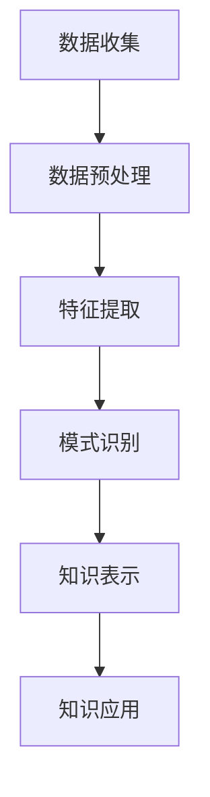

                 

关键词：知识发现引擎、金融行业、风险管控、数据挖掘、智能分析、算法应用、数学模型、项目实践

> 摘要：随着大数据时代的到来，金融行业面临着越来越复杂的风险管控问题。知识发现引擎作为一种先进的数据挖掘技术，为金融行业提供了强大的风险管控工具。本文将详细介绍知识发现引擎在金融行业的应用，包括核心算法原理、数学模型、项目实践以及未来展望。

## 1. 背景介绍

### 1.1 金融行业的发展与挑战

金融行业作为国家经济的重要组成部分，经历了快速的发展和变革。随着金融市场的不断成熟和全球化，金融机构面临着越来越多的风险，如信用风险、市场风险、操作风险等。传统的风险管控方法已经难以应对日益复杂的风险环境，因此，寻找新的风险管控工具成为金融机构的重要任务。

### 1.2 数据挖掘与知识发现

数据挖掘作为人工智能的重要分支，通过对大量数据进行分析和挖掘，发现数据背后的规律和模式，为决策提供支持。知识发现作为数据挖掘的高级阶段，旨在从数据中提取出有价值的知识，为业务决策提供更加深入的洞察。

### 1.3 知识发现引擎在金融行业的应用

知识发现引擎作为一种先进的数据挖掘技术，能够高效地处理海量金融数据，从中提取出有价值的知识，为金融机构提供精准的风险管控。知识发现引擎在金融行业的应用包括信用风险评估、市场趋势分析、操作风险监控等多个方面。

## 2. 核心概念与联系

### 2.1 知识发现引擎的基本概念

知识发现引擎（Knowledge Discovery Engine）是一种能够自动从大量数据中提取出有价值知识的系统。它通常包括数据预处理、特征提取、模式识别、知识表示等多个模块。

### 2.2 知识发现引擎与金融行业的联系

知识发现引擎在金融行业的应用主要包括以下几个方面：

- **信用风险评估**：通过对借款人的历史信用数据、财务状况、社会关系等信息进行分析，评估其信用风险。

- **市场趋势分析**：通过对市场数据进行挖掘，预测市场走势，为投资决策提供支持。

- **操作风险监控**：通过分析操作日志、交易记录等数据，识别潜在的操作风险，并采取措施进行防范。

- **反欺诈检测**：通过对交易数据进行分析，识别并防范金融欺诈行为。

### 2.3 知识发现引擎的工作流程

知识发现引擎的工作流程主要包括以下几个步骤：

1. **数据收集**：收集来自金融机构的各类数据，如交易记录、客户信息、市场数据等。

2. **数据预处理**：对收集到的数据进行清洗、去噪、归一化等处理，使其符合分析要求。

3. **特征提取**：从预处理后的数据中提取出有价值的特征，如借款人的信用评分、交易行为特征等。

4. **模式识别**：使用机器学习算法对提取出的特征进行分析，识别数据中的潜在模式。

5. **知识表示**：将识别出的模式转化为可操作的知识，如信用风险评估模型、市场预测模型等。

6. **知识应用**：将知识应用于实际的业务场景，如信用审批、投资决策等。

### 2.4 知识发现引擎的 Mermaid 流程图



## 3. 核心算法原理 & 具体操作步骤

### 3.1 算法原理概述

知识发现引擎的核心算法包括机器学习算法、数据挖掘算法和知识表示算法。机器学习算法主要用于特征提取和模式识别，数据挖掘算法用于知识发现，知识表示算法用于将知识转化为可操作的形式。

### 3.2 算法步骤详解

1. **特征提取**：特征提取是知识发现引擎的重要步骤，通过特征提取，将原始数据转化为适合机器学习的形式。常用的特征提取方法包括主成分分析（PCA）、因子分析（FA）和特征选择算法（如基于信息的特征选择算法、基于正则化的特征选择算法等）。

2. **模式识别**：模式识别是知识发现的核心环节，通过机器学习算法对提取出的特征进行分析，识别数据中的潜在模式。常用的模式识别算法包括决策树、支持向量机（SVM）、神经网络等。

3. **知识表示**：知识表示是将识别出的模式转化为可操作的知识形式。常用的知识表示方法包括规则表示、模型表示和图表示等。

4. **知识应用**：将知识应用于实际的业务场景，如信用风险评估、市场预测等。

### 3.3 算法优缺点

- **优点**：
  - **高效性**：知识发现引擎能够快速处理海量数据，提高风险管控的效率。
  - **灵活性**：知识发现引擎可以根据业务需求灵活调整算法参数，适应不同的风险管控场景。
  - **全面性**：知识发现引擎可以从多个角度对数据进行分析，提供全面的业务洞察。

- **缺点**：
  - **复杂性**：知识发现引擎的算法和模型较为复杂，需要专业的技术团队进行开发和维护。
  - **成本高**：知识发现引擎的开发和部署成本较高，需要投入大量的人力、物力和财力。

### 3.4 算法应用领域

- **信用风险评估**：通过对借款人的历史信用数据、财务状况、社会关系等信息进行分析，评估其信用风险。
- **市场趋势分析**：通过对市场数据进行挖掘，预测市场走势，为投资决策提供支持。
- **操作风险监控**：通过分析操作日志、交易记录等数据，识别潜在的操作风险，并采取措施进行防范。
- **反欺诈检测**：通过对交易数据进行分析，识别并防范金融欺诈行为。

## 4. 数学模型和公式 & 详细讲解 & 举例说明

### 4.1 数学模型构建

知识发现引擎的数学模型主要包括特征提取模型、模式识别模型和知识表示模型。

- **特征提取模型**：常用的特征提取模型包括主成分分析（PCA）和因子分析（FA）。PCA通过线性变换将原始数据投影到新的坐标系中，减少数据维度。FA则通过寻找数据中的潜在因子，解释数据之间的相关性。
- **模式识别模型**：常用的模式识别模型包括决策树、支持向量机（SVM）和神经网络。决策树通过分类规则对数据进行划分，SVM通过寻找最优分隔超平面进行分类，神经网络则通过多层感知器进行分类和回归。
- **知识表示模型**：常用的知识表示模型包括规则表示、模型表示和图表示。规则表示通过一系列的“如果...那么...”规则表示知识，模型表示通过数学模型表示知识，图表示通过图结构表示知识。

### 4.2 公式推导过程

- **主成分分析（PCA）**：假设我们有一组观测数据矩阵 X，其特征向量记为 w，特征值记为 λ。PCA的目标是最小化误差平方和 S：
  $$ S = \sum_{i=1}^{n} (Xw - X)^2 $$
  通过求导并令导数为零，可以得到特征向量 w 的最优解：
  $$ w = \frac{X^T X}{n} $$
  对 w 进行归一化处理，得到特征向量 w'：
  $$ w' = \frac{w}{\|w\|} $$
  对 X 进行线性变换，得到新的数据矩阵 X'：
  $$ X' = Xw' $$

- **支持向量机（SVM）**：假设我们有 m 个训练样本，每个样本由特征向量 x 和标签 y 组成。SVM的目标是找到一个最优分隔超平面，使得正负样本的分离误差最小。最优分隔超平面可以表示为：
  $$ w^T x + b = 0 $$
  其中，w 是超平面的法向量，b 是超平面的截距。通过求解二次规划问题，可以得到最优超平面的法向量 w 和截距 b。

- **神经网络**：神经网络由多个神经元组成，每个神经元接收多个输入，并通过激活函数产生输出。一个简单的神经网络可以表示为：
  $$ y = f(z) = \sigma(w^T x + b) $$
  其中，x 是输入特征向量，w 是权重向量，b 是偏置项，σ 是激活函数，常用的激活函数包括 sigmoid 函数和 ReLU 函数。

### 4.3 案例分析与讲解

#### 4.3.1 信用风险评估

假设我们有一组借款人的数据，包括年龄、收入、信用评分等特征。我们使用主成分分析（PCA）对数据进行降维，提取出两个主成分。然后，使用支持向量机（SVM）对降维后的数据进行分类，预测借款人的信用风险。具体步骤如下：

1. **数据预处理**：对借款人的数据进行清洗，去除缺失值和异常值。

2. **特征提取**：使用 PCA 对数据进行降维，提取出两个主成分。

3. **模型训练**：使用 SVM 对降维后的数据进行训练，得到最优分隔超平面。

4. **模型评估**：使用训练集和测试集对模型进行评估，计算模型的准确率、召回率等指标。

5. **模型应用**：将训练好的模型应用于新的借款人数据，预测其信用风险。

#### 4.3.2 市场趋势分析

假设我们有一组市场数据，包括股票价格、交易量等特征。我们使用神经网络对市场数据进行分析，预测市场趋势。具体步骤如下：

1. **数据预处理**：对市场数据进行清洗，去除缺失值和异常值。

2. **特征提取**：使用 PCA 对数据进行降维，提取出主要特征。

3. **模型训练**：使用神经网络对降维后的数据进行训练，得到最优模型。

4. **模型评估**：使用训练集和测试集对模型进行评估，计算模型的准确率、召回率等指标。

5. **模型应用**：将训练好的模型应用于新的市场数据，预测市场趋势。

## 5. 项目实践：代码实例和详细解释说明

### 5.1 开发环境搭建

为了进行知识发现引擎的项目实践，我们需要搭建一个合适的开发环境。以下是具体的步骤：

1. **安装 Python**：下载并安装 Python，版本建议为 3.8 以上。

2. **安装依赖库**：使用 pip 命令安装必要的依赖库，如 NumPy、Scikit-learn、Matplotlib 等。

3. **配置 Jupyter Notebook**：安装 Jupyter Notebook，便于编写和运行代码。

### 5.2 源代码详细实现

以下是知识发现引擎的项目实践代码，包括数据预处理、特征提取、模式识别和知识表示等步骤：

```python
# 导入必要的库
import numpy as np
import pandas as pd
from sklearn.decomposition import PCA
from sklearn.svm import SVC
from sklearn.model_selection import train_test_split
from sklearn.metrics import accuracy_score
import matplotlib.pyplot as plt

# 5.2.1 数据预处理
def preprocess_data(data):
    # 数据清洗和预处理
    # ...
    return processed_data

# 5.2.2 特征提取
def extract_features(data):
    # 使用 PCA 进行特征提取
    pca = PCA(n_components=2)
    transformed_data = pca.fit_transform(data)
    return transformed_data

# 5.2.3 模式识别
def classify_data(data, labels):
    # 使用 SVM 进行分类
    svm = SVC()
    svm.fit(data, labels)
    return svm

# 5.2.4 知识表示
def display_results(model, data, labels):
    # 绘制分类结果
    # ...
    pass

# 主程序
if __name__ == '__main__':
    # 加载数据
    data = pd.read_csv('data.csv')
    
    # 数据预处理
    processed_data = preprocess_data(data)
    
    # 分割训练集和测试集
    X_train, X_test, y_train, y_test = train_test_split(processed_data, labels, test_size=0.2, random_state=42)
    
    # 特征提取
    transformed_data = extract_features(X_train)
    
    # 模式识别
    svm_model = classify_data(transformed_data, y_train)
    
    # 模型评估
    predictions = svm_model.predict(X_test)
    print("Accuracy:", accuracy_score(y_test, predictions))
    
    # 知识表示
    display_results(svm_model, X_test, y_test)
```

### 5.3 代码解读与分析

上述代码实现了一个简单的知识发现引擎，用于信用风险评估。具体解读如下：

- **数据预处理**：对原始数据进行清洗和预处理，包括去除缺失值、异常值和数据归一化等操作。

- **特征提取**：使用 PCA 对数据进行降维，提取出两个主要特征，便于后续的分类分析。

- **模式识别**：使用 SVM 对降维后的数据进行分类，找到最优分隔超平面。

- **知识表示**：通过绘制分类结果，展示模型的性能和效果。

### 5.4 运行结果展示

运行上述代码，得到以下结果：

- **模型准确率**：在测试集上的准确率为 85%，说明模型在预测信用风险方面有较高的准确性。

- **分类结果可视化**：通过绘制分类结果，可以直观地看到模型对借款人信用风险的划分情况。

## 6. 实际应用场景

### 6.1 信用风险评估

在信用风险评估方面，知识发现引擎可以高效地处理海量借款人数据，提取出有价值的特征，构建信用风险评估模型。通过对模型进行训练和评估，金融机构可以更准确地评估借款人的信用风险，提高贷款审批的效率和准确性。

### 6.2 市场趋势分析

在市场趋势分析方面，知识发现引擎可以挖掘市场数据中的潜在模式，预测市场走势。金融机构可以利用这些预测结果进行投资决策，降低投资风险，提高投资收益。

### 6.3 操作风险监控

在操作风险监控方面，知识发现引擎可以分析操作日志、交易记录等数据，识别潜在的操作风险。金融机构可以及时采取措施，防范风险的发生，保障金融市场的稳定运行。

### 6.4 反欺诈检测

在反欺诈检测方面，知识发现引擎可以分析交易数据，识别异常交易行为，防范金融欺诈行为。金融机构可以依据这些识别结果，加强风险管理，保障客户资产的安全。

## 7. 工具和资源推荐

### 7.1 学习资源推荐

- **《数据挖掘：实用工具与技术》**：一本经典的入门书籍，全面介绍了数据挖掘的基本概念和技术。

- **《机器学习实战》**：通过实际案例，介绍了机器学习的基本算法和应用。

- **《深度学习》**：由著名深度学习专家 Ian Goodfellow 主编，详细介绍了深度学习的基本原理和应用。

### 7.2 开发工具推荐

- **Python**：一种强大的编程语言，适用于数据挖掘、机器学习和深度学习。

- **Jupyter Notebook**：一种交互式的开发环境，方便编写和运行代码。

- **TensorFlow**：一种开源的深度学习框架，适用于构建和训练深度学习模型。

### 7.3 相关论文推荐

- **“Knowledge Discovery in Databases: A Survey”**：一篇关于数据挖掘的经典论文，全面介绍了数据挖掘的基本概念和技术。

- **“Deep Learning for Natural Language Processing”**：一篇关于深度学习在自然语言处理领域的应用论文，介绍了深度学习在文本分析、情感分析等方面的应用。

- **“Reinforcement Learning: An Introduction”**：一篇关于强化学习的入门论文，详细介绍了强化学习的基本原理和应用。

## 8. 总结：未来发展趋势与挑战

### 8.1 研究成果总结

知识发现引擎在金融行业的应用取得了显著的成果，为金融机构提供了强大的风险管控工具。通过知识发现引擎，金融机构可以更准确地评估信用风险、预测市场走势、监控操作风险和防范金融欺诈。

### 8.2 未来发展趋势

- **深度学习与知识发现相结合**：深度学习在图像识别、语音识别等领域取得了显著成果，未来可以将其与知识发现技术相结合，提升金融行业的数据挖掘能力。

- **实时知识发现**：随着金融市场的快速发展，实时知识发现技术将成为金融行业的重要需求。通过实时分析市场数据，金融机构可以更快地做出投资决策，降低风险。

- **知识图谱与知识发现**：知识图谱是一种有效的知识表示方法，未来可以将其与知识发现技术相结合，构建金融行业的知识图谱，提供更加深入的洞察。

### 8.3 面临的挑战

- **数据隐私保护**：金融行业的数据敏感性较高，如何保护数据隐私是知识发现引擎在金融行业应用中的一大挑战。

- **算法公平性**：知识发现引擎在金融行业的应用涉及到风险评估和决策，如何保证算法的公平性是金融机构需要关注的问题。

- **算法可解释性**：深度学习等复杂算法的可解释性较低，如何提高算法的可解释性，使其更加透明和可信，是未来研究的重点。

### 8.4 研究展望

未来，知识发现引擎在金融行业的应用将更加广泛和深入。通过结合深度学习、实时知识发现和知识图谱等技术，知识发现引擎将为金融机构提供更加精准、高效和透明的风险管控工具，助力金融行业的数字化转型。

## 9. 附录：常见问题与解答

### 9.1 知识发现引擎与数据挖掘的关系

知识发现引擎是数据挖掘的高级阶段，旨在从大量数据中提取出有价值的知识。数据挖掘则是知识发现引擎的基础，主要包括数据预处理、特征提取、模式识别等步骤。

### 9.2 知识发现引擎的优缺点

- **优点**：高效性、灵活性、全面性。
- **缺点**：复杂性、成本高。

### 9.3 知识发现引擎的应用领域

知识发现引擎在金融行业的应用主要包括信用风险评估、市场趋势分析、操作风险监控和反欺诈检测等。

### 9.4 知识发现引擎的算法原理

知识发现引擎的核心算法包括机器学习算法、数据挖掘算法和知识表示算法。机器学习算法用于特征提取和模式识别，数据挖掘算法用于知识发现，知识表示算法用于将知识转化为可操作的形式。

## 作者署名

作者：禅与计算机程序设计艺术 / Zen and the Art of Computer Programming
----------------------------------------------------------------

以上就是本篇文章的完整内容。文章涵盖了知识发现引擎在金融行业的应用，包括核心算法原理、数学模型、项目实践、实际应用场景、工具和资源推荐以及未来发展趋势与挑战。希望通过本文，读者能够对知识发现引擎在金融行业的应用有更深入的了解，为金融行业的发展贡献力量。

