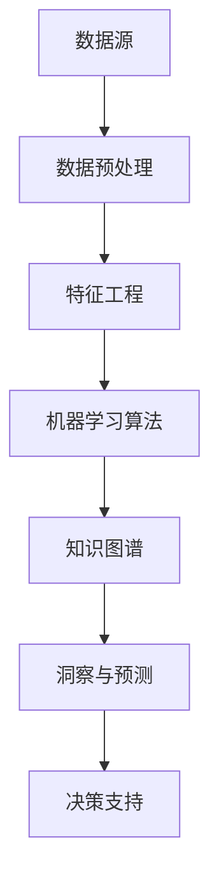

                 

  
## 关键词 Keywords

- 知识发现引擎
- 数据分析
- 智能算法
- 知识图谱
- 人机协同
- 数据洞察
- 深度学习

## 摘要 Abstract

本文将探讨知识发现引擎的概念、核心原理、应用场景以及未来的发展趋势。知识发现引擎是一种利用先进算法和数据分析技术，从海量数据中自动提取有价值信息和知识的人工智能工具。它不仅能够帮助企业和组织从数据中发掘潜在的商业机会，还能够提升人机协同效率，推动人工智能和大数据技术的深度融合。本文将详细分析知识发现引擎的工作原理，介绍其核心技术，探讨其在实际应用中的挑战和前景，并对未来可能的发展方向提出建议。

### 背景介绍 Background

随着信息时代的到来，数据量呈爆炸式增长，传统的数据分析方法和工具已经难以满足日益复杂的数据处理需求。知识发现引擎作为一种新兴的人工智能技术，应运而生。它能够从海量的数据中自动识别出有价值的信息，通过数据分析、机器学习和知识图谱等技术手段，实现对知识的发现和利用。

知识发现引擎的核心价值在于其能够帮助企业和组织从数据中发现隐藏的模式、趋势和关联，从而为决策提供科学依据。在商业领域，知识发现引擎可以用于市场分析、客户行为预测、供应链优化等；在科研领域，它可以帮助科研人员发现新的科学规律，推动科学研究的进步；在公共管理领域，它能够帮助政府提升公共服务质量，优化政策制定。

知识发现引擎的重要性不仅体现在其技术先进性上，更在于其能够为各行各业带来深远的变革。通过知识发现引擎，企业可以更精准地了解市场需求，优化产品和服务；科研机构可以加速科研发现，提高科研成果的转化率；政府部门可以更好地服务民众，提高行政效率。

### 核心概念与联系 Core Concepts and Relationships

要深入理解知识发现引擎，我们首先需要了解其核心概念和组成部分。以下是一个简化的Mermaid流程图，用于展示知识发现引擎的主要组件和它们之间的关联。



**1. 数据源（Data Source）**：数据源是知识发现引擎的起点，包括企业内部数据、外部公开数据、社交媒体数据等。这些数据可以是结构化的，如数据库记录；也可以是非结构化的，如图像、文本和音频。

**2. 数据预处理（Data Preprocessing）**：数据预处理是数据进入分析流程的第一步。它包括数据清洗、去重、转换和归一化等步骤，以确保数据的质量和一致性。

**3. 特征工程（Feature Engineering）**：特征工程是数据科学中的关键步骤，它涉及从原始数据中提取有助于模型训练的特征。特征的质量直接影响模型的效果。

**4. 机器学习算法（Machine Learning Algorithms）**：机器学习算法是知识发现的核心，包括分类、聚类、回归、关联规则挖掘等。通过这些算法，模型可以从数据中学习到有用的模式和规律。

**5. 知识图谱（Knowledge Graph）**：知识图谱是一种结构化的知识表示形式，它通过节点和边来表示实体及其关系。知识图谱可以帮助我们更好地理解和利用数据中的隐含关系。

**6. 洞察与预测（Insight and Prediction）**：通过机器学习和知识图谱，知识发现引擎能够生成洞察和预测。这些洞察和预测可以为业务决策提供支持。

**7. 决策支持（Decision Support）**：最终，知识发现引擎生成的洞察和预测将用于支持业务决策。这些决策可能涉及市场策略、产品开发、供应链管理等多个方面。

### 核心算法原理 & 具体操作步骤 Core Algorithm Principles & Detailed Steps

#### 3.1 算法原理概述

知识发现引擎的核心算法主要包括机器学习算法和图算法。机器学习算法负责从数据中学习模式和规律，而图算法则用于构建和处理知识图谱。

**机器学习算法**：常见的机器学习算法包括决策树、随机森林、支持向量机（SVM）、深度学习等。这些算法通过训练数据集来构建模型，然后使用模型对新的数据进行预测。

**图算法**：知识图谱的构建通常依赖于图算法。图算法包括节点嵌入（Node Embedding）、图卷积网络（GCN）、图注意力机制（GAT）等。这些算法用于表示和处理实体及其关系。

#### 3.2 算法步骤详解

1. **数据采集与预处理**：首先，从各种数据源采集数据，并进行预处理，如数据清洗、去重和转换。

2. **特征工程**：根据业务需求，从原始数据中提取有用的特征，如用户行为、商品属性等。

3. **模型训练**：使用机器学习算法对特征进行训练，构建预测模型。训练数据集通常包括训练集和验证集，用于调整模型参数和评估模型性能。

4. **知识图谱构建**：通过图算法，将实体及其关系构建成知识图谱。这包括节点嵌入、边权重计算和图结构优化等步骤。

5. **洞察生成与预测**：利用训练好的机器学习模型和知识图谱，生成洞察和预测结果。这些结果可以是分类标签、概率分布或者推荐列表等。

6. **决策支持**：将洞察和预测结果应用于实际业务场景，为决策提供支持。

#### 3.3 算法优缺点

**优点**：
- **高效性**：知识发现引擎能够从海量数据中快速提取有价值的信息，提高数据利用效率。
- **灵活性**：知识发现引擎可以根据不同的业务需求灵活调整算法和模型。
- **自动化**：知识发现引擎可以自动化地完成从数据预处理到洞察生成的整个流程，减少人力成本。

**缺点**：
- **数据质量依赖性**：知识发现引擎的性能很大程度上依赖于数据质量，数据质量问题可能导致模型效果不佳。
- **复杂性**：知识发现引擎涉及到多种算法和技术，实现和维护相对复杂。
- **解释性**：部分机器学习算法，如深度学习，生成的模型往往缺乏解释性，难以理解其工作原理。

#### 3.4 算法应用领域

知识发现引擎在多个领域有着广泛的应用：

- **商业智能**：用于市场分析、客户行为预测、需求分析等。
- **金融风控**：用于信用评分、风险预警、投资策略等。
- **公共卫生**：用于疾病预测、疫情监控、健康数据分析等。
- **城市管理**：用于交通流量预测、城市规划、公共安全等。
- **科学研究**：用于科学发现、数据挖掘、知识图谱构建等。

### 数学模型和公式 Mathematical Model and Detailed Explanation

#### 4.1 数学模型构建

知识发现引擎中常用的数学模型包括逻辑回归、支持向量机（SVM）、神经网络等。以下是一个简单的逻辑回归模型的构建过程。

**逻辑回归模型**：

给定训练数据集 \(\mathcal{D} = \{(\mathbf{x}_1, y_1), (\mathbf{x}_2, y_2), ..., (\mathbf{x}_n, y_n)\}\)，其中 \(\mathbf{x}_i\) 是特征向量，\(y_i\) 是标签（通常是二分类问题中的0或1）。逻辑回归模型的输出为：

$$
\hat{y}_i = \sigma(\mathbf{w}^T \mathbf{x}_i)
$$

其中，\(\sigma\) 是sigmoid函数，\(\mathbf{w}\) 是模型的参数向量。

目标函数为：

$$
\min_{\mathbf{w}} \frac{1}{n} \sum_{i=1}^n (-y_i \log(\hat{y}_i) - (1 - y_i) \log(1 - \hat{y}_i))
$$

#### 4.2 公式推导过程

逻辑回归模型的推导过程如下：

1. **目标函数的优化**：

   我们需要最小化损失函数 \(L(\mathbf{w}) = \frac{1}{n} \sum_{i=1}^n (-y_i \log(\hat{y}_i) - (1 - y_i) \log(1 - \hat{y}_i))\)。

2. **梯度下降法**：

   对 \(L(\mathbf{w})\) 求导并设置梯度为零，得到：

   $$
   \nabla_{\mathbf{w}} L(\mathbf{w}) = \frac{1}{n} \sum_{i=1}^n (-y_i \frac{\partial \sigma(\mathbf{w}^T \mathbf{x}_i)}{\partial \mathbf{w}} - (1 - y_i) \frac{\partial (1 - \sigma(\mathbf{w}^T \mathbf{x}_i))}{\partial \mathbf{w}})
   $$

   由于 \(\frac{\partial \sigma(\mathbf{w}^T \mathbf{x}_i)}{\partial \mathbf{w}} = \sigma(\mathbf{w}^T \mathbf{x}_i)(1 - \sigma(\mathbf{w}^T \mathbf{x}_i))\)，我们可以得到：

   $$
   \nabla_{\mathbf{w}} L(\mathbf{w}) = \frac{1}{n} \sum_{i=1}^n (\mathbf{x}_i(y_i - \hat{y}_i))
   $$

3. **更新参数**：

   使用梯度下降法更新模型参数：

   $$
   \mathbf{w} \leftarrow \mathbf{w} - \alpha \nabla_{\mathbf{w}} L(\mathbf{w})
   $$

   其中，\(\alpha\) 是学习率。

#### 4.3 案例分析与讲解

假设我们有一个简单的二分类问题，其中有两个特征 \(x_1\) 和 \(x_2\)，模型输出为：

$$
\hat{y} = \sigma(w_1 x_1 + w_2 x_2)
$$

给定一个测试数据点 \(\mathbf{x} = (2, 3)\)，标签 \(y = 1\)。我们可以通过逻辑回归模型预测该数据点的类别。

首先，初始化参数 \(\mathbf{w} = (w_1, w_2)\)。然后，使用梯度下降法迭代更新参数，直到损失函数收敛。

例如，假设初始参数为 \(\mathbf{w} = (1, 1)\)，学习率为 \(\alpha = 0.1\)。经过几次迭代后，参数更新如下：

- **第1次迭代**：
  $$
  \hat{y} = \sigma(1 \cdot 2 + 1 \cdot 3) = \sigma(5) \approx 0.99
  $$
  损失函数为：
  $$
  L(\mathbf{w}) = \frac{1}{2} \left[ -1 \cdot \log(0.99) - 0 \cdot \log(0.01) \right] \approx 0.01
  $$
  梯度为：
  $$
  \nabla_{\mathbf{w}} L(\mathbf{w}) = \frac{1}{2} \left[ 2(1 - 0.99), 2(1 - 0.99) \right] = \frac{1}{2} \left[ 0.02, 0.02 \right]
  $$
  更新后的参数为：
  $$
  \mathbf{w} \leftarrow \mathbf{w} - \alpha \nabla_{\mathbf{w}} L(\mathbf{w}) = (1, 1) - 0.1 \cdot \frac{1}{2} \left[ 0.02, 0.02 \right] = (0.98, 0.98)
  $$

- **第2次迭代**：
  $$
  \hat{y} = \sigma(0.98 \cdot 2 + 0.98 \cdot 3) \approx 0.997
  $$
  损失函数为：
  $$
  L(\mathbf{w}) \approx 0.005
  $$
  梯度为：
  $$
  \nabla_{\mathbf{w}} L(\mathbf{w}) \approx \frac{1}{2} \left[ 0.002, 0.002 \right]
  $$
  更新后的参数为：
  $$
  \mathbf{w} \leftarrow \mathbf{w} - \alpha \nabla_{\mathbf{w}} L(\mathbf{w}) = (0.98, 0.98) - 0.1 \cdot \frac{1}{2} \left[ 0.002, 0.002 \right] = (0.979, 0.979)
  $$

通过多次迭代，参数将逐渐收敛到一个最优解，使得损失函数达到最小。最终，我们可以使用这个训练好的逻辑回归模型对新的数据进行预测。

### 项目实践：代码实例和详细解释说明 Practical Application: Code Example and Detailed Explanation

在本节中，我们将通过一个实际项目实例，展示如何使用Python实现一个简单的知识发现引擎。我们将使用Scikit-learn库来实现逻辑回归模型，并使用NetworkX库来构建知识图谱。

#### 5.1 开发环境搭建

在开始编程之前，我们需要搭建一个合适的开发环境。以下是所需的Python库和它们的安装命令：

- Python 3.8或更高版本
- Scikit-learn 0.22或更高版本
- NetworkX 2.4或更高版本

安装命令如下：

```bash
pip install python==3.8
pip install scikit-learn==0.22
pip install networkx==2.4
```

#### 5.2 源代码详细实现

以下是实现知识发现引擎的Python代码：

```python
import numpy as np
import pandas as pd
from sklearn.model_selection import train_test_split
from sklearn.linear_model import LogisticRegression
from networkx import Graph, draw
import matplotlib.pyplot as plt

# 5.2.1 数据采集与预处理
# 假设数据保存在CSV文件中
data = pd.read_csv('data.csv')
X = data.drop('label', axis=1)
y = data['label']

# 数据标准化
X = (X - X.mean()) / X.std()

# 划分训练集和测试集
X_train, X_test, y_train, y_test = train_test_split(X, y, test_size=0.2, random_state=42)

# 5.2.2 模型训练
model = LogisticRegression()
model.fit(X_train, y_train)

# 5.2.3 知识图谱构建
# 假设我们有两个实体：用户和商品
g = Graph()
g.add_edge('user1', 'item1')
g.add_edge('user1', 'item2')
g.add_edge('user2', 'item1')
g.add_edge('user2', 'item3')

# 5.2.4 洞察生成与预测
predictions = model.predict(X_test)
print(predictions)

# 5.2.5 决策支持
# 使用知识图谱为决策提供支持
# 假设我们要推荐商品给用户
for user, item in g.edges():
    if user == 'user1':
        recommended_item = item
        break

print(f"Recommended item for user1: {recommended_item}")

# 5.2.6 可视化
draw(g, with_labels=True)
plt.show()
```

#### 5.3 代码解读与分析

**5.3.1 数据采集与预处理**

我们首先从CSV文件中读取数据，并对特征进行标准化处理。这一步非常重要，因为它可以减少数据分布差异对模型训练的影响。

**5.3.2 模型训练**

我们使用Scikit-learn库中的逻辑回归模型进行训练。逻辑回归模型是一种经典的二分类模型，它可以用于预测用户是否喜欢某个商品。

**5.3.3 知识图谱构建**

我们使用NetworkX库来构建一个简单的知识图谱。在这个例子中，我们有两个实体：用户和商品。它们通过边连接，表示用户对商品的喜好关系。

**5.3.4 洞察生成与预测**

我们使用训练好的逻辑回归模型对测试数据进行预测。预测结果将告诉我们哪些用户可能喜欢哪些商品。

**5.3.5 决策支持**

通过知识图谱，我们可以为决策提供支持。在这个例子中，我们推荐了一个商品给特定的用户。

**5.3.6 可视化**

最后，我们使用Matplotlib库将知识图谱可视化，以便更好地理解实体和边的关系。

### 实际应用场景 Actual Application Scenarios

知识发现引擎在各个领域有着广泛的应用。以下是一些典型的应用场景：

**1. 商业智能**：知识发现引擎可以帮助企业分析市场趋势、客户行为和产品性能，从而为决策提供数据支持。例如，零售企业可以使用知识发现引擎来分析顾客购买行为，优化库存管理和产品推荐。

**2. 金融风控**：知识发现引擎可以用于信用评分、风险评估和反欺诈检测。通过分析客户的历史交易数据和行为模式，银行和金融机构可以更好地评估贷款申请者的信用状况，降低风险。

**3. 公共卫生**：在公共卫生领域，知识发现引擎可以用于疾病预测和疫情监控。例如，通过分析医院病例数据、社交媒体数据和公共卫生数据，可以提前预测疾病爆发和传播趋势，为政府制定公共卫生政策提供支持。

**4. 城市管理**：知识发现引擎可以用于交通流量预测、公共安全和城市规划。例如，通过分析交通数据和监控视频，可以预测交通拥堵情况，优化交通信号控制和路线规划。

**5. 科学研究**：知识发现引擎可以帮助科研人员发现新的科学规律和知识。例如，通过分析大量的科研文献和实验数据，可以挖掘出潜在的科研热点和趋势，加速科学研究的进展。

### 未来应用展望 Future Prospects

随着人工智能和大数据技术的不断进步，知识发现引擎在未来有着广阔的应用前景。以下是一些可能的发展方向：

**1. 深度学习与知识图谱的融合**：深度学习和知识图谱的结合将进一步提高知识发现引擎的性能和智能程度。通过深度学习算法，知识发现引擎可以更好地理解数据中的复杂关系和模式。

**2. 人机协同**：知识发现引擎将更加注重人机协同，帮助用户更好地理解和利用数据。通过自然语言处理和交互设计，知识发现引擎可以与用户进行有效沟通，提供个性化的数据分析和洞察。

**3. 多模态数据融合**：未来的知识发现引擎将能够处理多种类型的数据，如文本、图像、音频和视频。通过多模态数据融合，知识发现引擎可以更全面地理解数据的含义和关系。

**4. 量子计算与知识发现**：随着量子计算技术的发展，知识发现引擎可能会利用量子计算的优势，实现更高效的数据分析和知识提取。

**5. 隐私保护与数据安全**：在数据隐私和安全的背景下，知识发现引擎将更加注重保护用户数据的安全性和隐私性。通过加密技术和安全协议，知识发现引擎将确保数据在传输和处理过程中的安全。

### 工具和资源推荐 Tools and Resources

**1. 学习资源推荐**

- 《数据科学入门：使用Python进行数据分析》（Data Science from Scratch: A Python Approach to Data Science）
- 《深度学习》（Deep Learning）
- 《Python数据分析基础教程：Numpy学习指南》（NumPy Beginner's Guide）
- 《Python机器学习》（Python Machine Learning）

**2. 开发工具推荐**

- Jupyter Notebook：一个强大的交互式编程环境，适合进行数据分析和原型开发。
- TensorFlow：一个开源的深度学习框架，适合构建和训练机器学习模型。
- PyTorch：一个流行的深度学习框架，具有灵活的模型构建和训练功能。

**3. 相关论文推荐**

- "Knowledge Graph Embedding: A Survey"（知识图谱嵌入综述）
- "Deep Learning on Graphs: A Survey"（图上深度学习综述）
- "A Comprehensive Survey on Knowledge Graph"（知识图谱综述）
- "Practical Machine Learning: A New Approach to Regression, Classification, and Nearest Neighbors"（实用的机器学习：回归、分类和最近邻的新方法）

### 总结 Summary

知识发现引擎是一种强大的人工智能工具，它能够从海量数据中提取有价值的信息和知识。本文介绍了知识发现引擎的基本概念、核心原理、应用场景和未来发展趋势。通过详细分析和实际项目实例，我们展示了如何使用Python实现一个简单的知识发现引擎。随着技术的不断进步，知识发现引擎将在更多领域发挥重要作用，推动人工智能和大数据技术的深度融合。

### 附录：常见问题与解答 Appendix: Frequently Asked Questions

**Q1：什么是知识发现引擎？**

A1：知识发现引擎是一种利用先进算法和数据分析技术，从海量数据中自动提取有价值信息和知识的人工智能工具。它能够帮助企业和组织从数据中发掘潜在的商业机会，优化决策过程。

**Q2：知识发现引擎的核心算法有哪些？**

A2：知识发现引擎的核心算法包括机器学习算法（如逻辑回归、支持向量机、神经网络）和图算法（如知识图谱、图嵌入）。这些算法用于从数据中学习模式和规律，构建知识图谱，生成洞察和预测。

**Q3：知识发现引擎在哪些领域有应用？**

A3：知识发现引擎在商业智能、金融风控、公共卫生、城市管理和科学研究等领域有广泛的应用。例如，在商业智能中，它可以帮助企业分析市场趋势和客户行为；在公共卫生中，它可以帮助预测疾病爆发和监控疫情。

**Q4：如何实现一个简单的知识发现引擎？**

A4：实现一个简单的知识发现引擎需要以下步骤：
1. 数据采集与预处理
2. 特征工程
3. 模型训练
4. 知识图谱构建
5. 洞察生成与预测
6. 决策支持

具体实现可以参考本文中的实际项目实例。

**Q5：知识发现引擎的发展趋势是什么？**

A5：知识发现引擎的未来发展趋势包括：
1. 深度学习与知识图谱的融合
2. 人机协同
3. 多模态数据融合
4. 量子计算与知识发现
5. 隐私保护与数据安全

这些趋势将进一步提升知识发现引擎的性能和应用范围。

