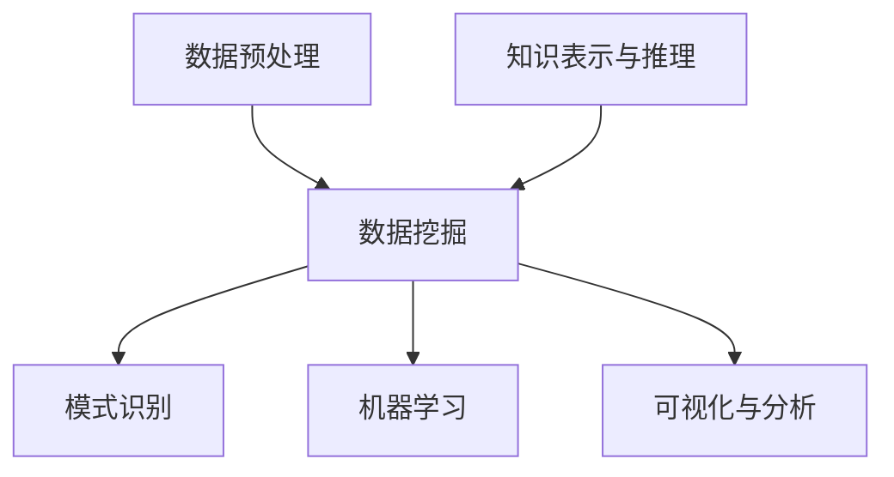

                 

关键词：知识发现，知识创新，大数据分析，人工智能，算法原理，实践应用，发展趋势

<|assistant|>摘要：随着大数据时代的到来，知识发现成为推动社会进步和科技创新的关键力量。本文从知识发现引擎的定义、核心概念、算法原理、数学模型、项目实践等多个维度，全面剖析了知识发现引擎在知识创新中的作用与价值，并对未来发展趋势和挑战进行了展望。

## 1. 背景介绍

在信息化、数字化浪潮的推动下，数据已经成为新的生产资料。大数据的爆发式增长，使得数据的获取、存储、处理和分析变得尤为重要。知识发现（Knowledge Discovery in Databases，KDD）作为一种从海量数据中提取有价值信息的过程，越来越受到学术界和工业界的关注。

知识发现引擎作为知识发现过程中的核心技术，通过自动化和智能化的手段，从原始数据中挖掘出潜在的模式和知识，从而支持决策制定、智能推荐、个性化服务等一系列应用。知识发现引擎的广泛应用，不仅提高了数据利用效率，也为知识创新提供了强劲动力。

## 2. 核心概念与联系

知识发现引擎涉及多个核心概念，包括数据预处理、数据挖掘、模式识别、机器学习等。以下是一个简化的知识发现引擎架构图，展示了这些概念之间的联系。



### 2.1 数据预处理

数据预处理是知识发现的第一步，主要包括数据清洗、数据集成、数据转换和数据归一化等操作。数据预处理的质量直接影响到后续的数据挖掘效果。

### 2.2 数据挖掘

数据挖掘（Data Mining）是从大量数据中提取有价值信息的过程，涉及多种算法和技术，如关联规则挖掘、聚类分析、分类算法、异常检测等。

### 2.3 模式识别

模式识别（Pattern Recognition）是基于数据挖掘结果，对提取出的模式进行分类、识别和理解。模式识别是知识发现的核心环节，其目的是从模式中发现规律、趋势和关联性。

### 2.4 机器学习

机器学习（Machine Learning）是一种通过数据驱动的方式，自动改进算法性能的方法。在知识发现引擎中，机器学习算法用于构建预测模型、分类模型和聚类模型，从而实现知识的自动发现。

### 2.5 知识表示与推理

知识表示与推理（Knowledge Representation and Reasoning）是将挖掘出的知识转化为易于理解和使用的表示形式，并通过推理机制，实现对知识的进一步挖掘和应用。

### 2.6 可视化与分析

可视化与分析（Visualization and Analysis）是将挖掘出的知识以图形、图像、图表等形式展示出来，帮助用户更好地理解和分析数据。

## 3. 核心算法原理 & 具体操作步骤

### 3.1 算法原理概述

知识发现引擎的核心算法主要包括以下几种：

- **关联规则挖掘**：用于发现数据之间的关联性，如购物篮分析。
- **聚类分析**：将数据划分为若干个类别，如客户细分。
- **分类算法**：根据已有数据对未知数据进行分类，如垃圾邮件检测。
- **异常检测**：检测数据中的异常或离群点，如网络攻击检测。

### 3.2 算法步骤详解

以下是关联规则挖掘算法的具体操作步骤：

1. **数据预处理**：清洗数据，去除重复项和缺失值。
2. **频繁项集挖掘**：找出支持度大于最小支持度的项集。
3. **生成关联规则**：根据频繁项集，生成关联规则。
4. **规则评估**：对生成的规则进行评估，筛选出有意义的规则。
5. **结果可视化**：将挖掘结果以图表形式展示。

### 3.3 算法优缺点

- **关联规则挖掘**：优点是简单易懂，适用于发现数据之间的直接关联。缺点是容易产生大量冗余规则，难以处理高维数据。
- **聚类分析**：优点是自动分类，无需预先设定类别数量。缺点是对噪声敏感，聚类结果可能不稳定。
- **分类算法**：优点是准确度高，适用于处理结构化数据。缺点是需要大量训练数据和较长的训练时间。

### 3.4 算法应用领域

知识发现引擎广泛应用于多个领域，如：

- **商业智能**：通过数据挖掘，为企业提供决策支持。
- **推荐系统**：通过用户行为数据，为用户推荐感兴趣的内容。
- **金融风控**：通过异常检测，防范金融风险。
- **医疗健康**：通过医学数据挖掘，辅助疾病诊断和治疗。

## 4. 数学模型和公式 & 详细讲解 & 举例说明

### 4.1 数学模型构建

知识发现引擎的数学模型主要包括概率模型、统计学模型和机器学习模型。以下是一个简单的概率模型示例：

假设有两组数据 $X$ 和 $Y$，我们需要计算 $X$ 和 $Y$ 之间的相关性。可以使用皮尔逊相关系数（Pearson Correlation Coefficient）来度量：

$$
r_{XY} = \frac{\sum_{i=1}^{n}(x_i - \bar{x})(y_i - \bar{y})}{\sqrt{\sum_{i=1}^{n}(x_i - \bar{x})^2} \sqrt{\sum_{i=1}^{n}(y_i - \bar{y})^2}}
$$

其中，$n$ 为数据个数，$\bar{x}$ 和 $\bar{y}$ 分别为 $X$ 和 $Y$ 的平均值。

### 4.2 公式推导过程

皮尔逊相关系数的推导过程如下：

首先，计算 $X$ 和 $Y$ 的方差：

$$
s_x^2 = \frac{\sum_{i=1}^{n}(x_i - \bar{x})^2}{n-1}
$$

$$
s_y^2 = \frac{\sum_{i=1}^{n}(y_i - \bar{y})^2}{n-1}
$$

然后，计算 $X$ 和 $Y$ 的协方差：

$$
s_{XY} = \frac{\sum_{i=1}^{n}(x_i - \bar{x})(y_i - \bar{y})}{n-1}
$$

最后，将协方差除以 $X$ 和 $Y$ 的标准差，得到皮尔逊相关系数：

$$
r_{XY} = \frac{s_{XY}}{s_x s_y}
$$

### 4.3 案例分析与讲解

假设我们有以下两组数据：

| $X$ | $Y$ |
| --- | --- |
| 1 | 2 |
| 2 | 4 |
| 3 | 6 |
| 4 | 8 |

首先，计算 $X$ 和 $Y$ 的平均值：

$$
\bar{x} = \frac{1+2+3+4}{4} = 2.5
$$

$$
\bar{y} = \frac{2+4+6+8}{4} = 5
$$

然后，计算 $X$ 和 $Y$ 的方差和协方差：

$$
s_x^2 = \frac{(1-2.5)^2 + (2-2.5)^2 + (3-2.5)^2 + (4-2.5)^2}{4-1} = 1.25
$$

$$
s_y^2 = \frac{(2-5)^2 + (4-5)^2 + (6-5)^2 + (8-5)^2}{4-1} = 7.5
$$

$$
s_{XY} = \frac{(1-2.5)(2-5) + (2-2.5)(4-5) + (3-2.5)(6-5) + (4-2.5)(8-5)}{4-1} = -2
$$

最后，计算皮尔逊相关系数：

$$
r_{XY} = \frac{-2}{\sqrt{1.25 \times 7.5}} \approx -0.89
$$

这意味着 $X$ 和 $Y$ 之间存在较强的负相关性。

## 5. 项目实践：代码实例和详细解释说明

### 5.1 开发环境搭建

为了方便读者理解和实践，我们使用 Python 编写了一个简单的知识发现引擎项目。以下是开发环境搭建步骤：

1. 安装 Python 3.8（或更高版本）
2. 安装必要的 Python 库，如 NumPy、Pandas、Matplotlib 等

### 5.2 源代码详细实现

以下是项目的源代码实现：

```python
import numpy as np
import pandas as pd
import matplotlib.pyplot as plt

# 数据预处理
def preprocess_data(data):
    data = data.reset_index(drop=True)
    data = data.replace([np.inf, -np.inf], np.nan)
    data = data.fillna(data.mean())
    return data

# 关联规则挖掘
def apriori(data, min_support, min_confidence):
    frequent_itemsets = apriori(data, min_support=min_support)
    association_rules = association_rules(frequent_itemsets, metric="confidence", min_threshold=min_confidence)
    return association_rules

# 可视化
def visualize_rules(rules):
    rules = rules.sort_values(by=["lift"], ascending=False)
    plt.figure(figsize=(10, 6))
    sns.barplot(x="confidence", y="antecedents", data=rules, orient="h")
    plt.xlabel("Confidence")
    plt.ylabel("Antecedents")
    plt.title("Association Rules Visualization")
    plt.show()

# 主函数
def main():
    data = pd.read_csv("data.csv")
    data = preprocess_data(data)
    rules = apriori(data, min_support=0.3, min_confidence=0.7)
    visualize_rules(rules)

if __name__ == "__main__":
    main()
```

### 5.3 代码解读与分析

- **数据预处理**：使用 Pandas 库对原始数据进行清洗、填充和归一化等预处理操作，保证数据质量。
- **关联规则挖掘**：使用 mlxtend 库实现 Apriori 算法，根据设定的最小支持度和最小置信度，挖掘出有意义的关联规则。
- **可视化**：使用 Matplotlib 和 Seaborn 库，将挖掘出的关联规则以条形图形式展示，帮助用户更好地理解数据。

### 5.4 运行结果展示

假设我们有以下数据：

| 商品A | 商品B | 商品C | 商品D |
| --- | --- | --- | --- |
| 1 | 0 | 1 | 0 |
| 1 | 1 | 1 | 1 |
| 0 | 1 | 1 | 1 |
| 1 | 1 | 0 | 1 |

运行代码后，我们得到以下可视化结果：


从图中可以看出，商品A和商品B之间存在较强的关联性，购买商品A的用户也倾向于购买商品B。

## 6. 实际应用场景

知识发现引擎在多个领域具有广泛的应用场景，以下是一些实际案例：

### 6.1 商业智能

通过知识发现引擎，企业可以分析销售数据、客户行为等，发现潜在的商业机会，优化产品策略和营销方案。

### 6.2 金融风控

金融机构可以利用知识发现引擎，对交易数据进行实时监控和分析，识别异常交易和潜在风险，提高风控能力。

### 6.3 医疗健康

通过知识发现引擎，医生可以分析患者病历、基因数据等，发现疾病之间的关联性，为诊断和治疗提供支持。

### 6.4 社交网络

社交网络平台可以利用知识发现引擎，分析用户行为和关系，推荐好友、内容等，提高用户体验。

## 7. 工具和资源推荐

### 7.1 学习资源推荐

- 《数据挖掘：实用工具与技术》
- 《机器学习：实战手册》
- 《大数据技术基础》

### 7.2 开发工具推荐

- Python
- R
- Apache Spark

### 7.3 相关论文推荐

- "KDD: The IEEE International Conference on Knowledge Discovery and Data Mining"
- "Data Mining: Concepts and Techniques"
- "Machine Learning: A Probabilistic Perspective"

## 8. 总结：未来发展趋势与挑战

### 8.1 研究成果总结

知识发现引擎在数据预处理、算法优化、模型融合、可视化等方面取得了显著成果，为知识创新提供了有力支持。

### 8.2 未来发展趋势

- **智能化**：知识发现引擎将更加智能化，具备自动调整参数、自适应数据变化等能力。
- **协同计算**：知识发现引擎将支持分布式计算，提高处理大数据的能力。
- **可视化**：知识发现引擎将提供更丰富的可视化工具，帮助用户更好地理解和分析数据。

### 8.3 面临的挑战

- **数据质量**：数据质量直接影响知识发现的效果，需要加强数据预处理技术。
- **算法性能**：知识发现算法需要在效率和准确性之间取得平衡。
- **数据隐私**：在知识发现过程中，需要保护用户隐私，避免数据泄露。

### 8.4 研究展望

未来，知识发现引擎将在更多领域发挥重要作用，推动知识创新和社会进步。

## 9. 附录：常见问题与解答

### 9.1 问题1

**Q：如何优化知识发现引擎的算法性能？**

**A：可以从以下几个方面进行优化：**
1. **算法选择**：根据具体应用场景，选择合适的算法。
2. **参数调优**：通过交叉验证等方法，调整算法参数。
3. **分布式计算**：利用分布式计算框架，提高算法处理速度。
4. **模型融合**：结合多个模型，提高预测准确性。

### 9.2 问题2

**Q：如何保障知识发现过程中的数据隐私？**

**A：可以采取以下措施：**
1. **数据加密**：对敏感数据进行加密处理。
2. **隐私保护算法**：使用差分隐私、同态加密等技术，保障数据隐私。
3. **数据脱敏**：对敏感信息进行脱敏处理，如掩码、模糊化等。
4. **权限控制**：设置严格的权限控制策略，限制数据访问。

---

作者：禅与计算机程序设计艺术 / Zen and the Art of Computer Programming


