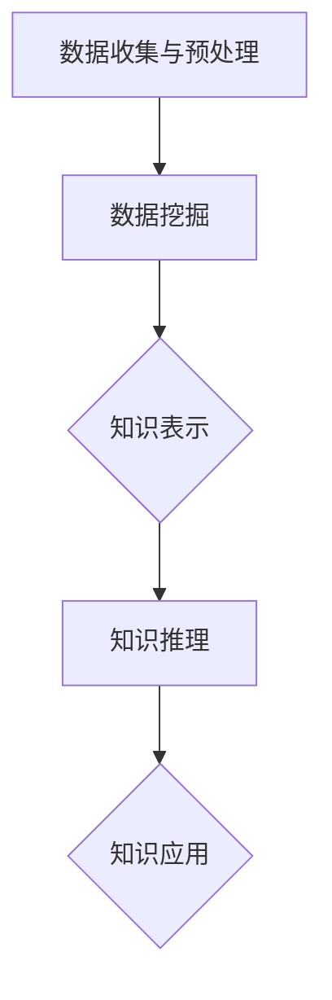

                 

 > **关键词：** 知识发现，数据挖掘，人工智能，知识图谱，知识进化

> **摘要：** 本文深入探讨了知识发现引擎的概念、原理、算法、应用和未来展望，揭示了知识发现引擎如何通过人工智能和知识图谱技术赋能人类知识进化的加速器。文章通过实例和案例分析，阐述了知识发现引擎在不同领域的应用，为读者提供了宝贵的实践指导和启发。

## 1. 背景介绍

随着互联网和大数据时代的到来，人类产生了前所未有的海量数据。如何从这些数据中提取有价值的信息和知识，成为当前信息技术领域的重要课题。知识发现（Knowledge Discovery in Databases, KDD）作为一种解决这一问题的技术，逐渐受到广泛关注。知识发现引擎作为KDD的核心组件，肩负着自动化、高效地挖掘数据中潜在知识的重任。

知识发现引擎起源于20世纪90年代，随着人工智能和大数据技术的快速发展，其应用范围不断扩大，性能也得到显著提升。目前，知识发现引擎已经成为各行业实现智能化转型的关键技术之一。本文将围绕知识发现引擎的核心概念、原理、算法、应用等方面进行深入探讨，旨在为读者提供一个全面、系统的理解和认识。

## 2. 核心概念与联系

### 2.1 知识发现引擎的定义

知识发现引擎是一种基于人工智能和大数据技术的自动化系统，旨在从海量数据中挖掘出有价值的信息和知识。它通常由数据预处理、数据挖掘、知识表示、知识推理等多个模块组成，通过整合各种算法和模型，实现对数据的深度分析和知识发现。

### 2.2 知识发现引擎的工作原理

知识发现引擎的工作原理可以概括为以下几个步骤：

1. 数据收集与预处理：从各种数据源收集原始数据，并进行清洗、转换、归一化等预处理操作，以提高数据质量和一致性。

2. 数据挖掘：利用各种数据挖掘算法（如分类、聚类、关联规则挖掘等），对预处理后的数据进行分析，提取潜在的模式和规律。

3. 知识表示：将挖掘到的知识转化为结构化的知识表示形式，如知识图谱、本体、规则库等，以便进行存储、共享和推理。

4. 知识推理：利用推理算法（如基于规则的推理、基于本体的推理等），对知识进行推理和扩展，以发现新的知识或验证已有知识的有效性。

### 2.3 知识发现引擎的核心概念

1. **数据挖掘算法**：数据挖掘算法是知识发现引擎的核心组件，主要包括分类、聚类、关联规则挖掘、异常检测、文本挖掘等。

2. **知识图谱**：知识图谱是一种语义网络，用于表示实体、概念和它们之间的关系。知识图谱在知识发现引擎中起着至关重要的作用，能够提高知识的表示能力和推理能力。

3. **本体**：本体是一种形式化的知识表示方法，用于描述领域中的概念、属性和关系。本体在知识发现引擎中用于指导数据挖掘和知识表示过程。

4. **推理算法**：推理算法用于从已知的事实中推导出新的结论。在知识发现引擎中，推理算法能够帮助发现新的知识和验证已有知识的有效性。

### 2.4 知识发现引擎的架构

知识发现引擎的架构可以分为四个层次：数据层、算法层、知识表示层和推理层。

1. **数据层**：包括数据源和数据预处理模块，负责收集、清洗和预处理数据。

2. **算法层**：包括各种数据挖掘算法和机器学习算法，负责对数据进行深度分析和模式挖掘。

3. **知识表示层**：包括知识图谱、本体和规则库等，负责将挖掘到的知识转化为结构化的知识表示形式。

4. **推理层**：包括推理算法和推理引擎，负责对知识进行推理和扩展，以发现新的知识或验证已有知识的有效性。

### 2.5 Mermaid 流程图

以下是一个简化的知识发现引擎的Mermaid流程图：



## 3. 核心算法原理 & 具体操作步骤

### 3.1 算法原理概述

知识发现引擎的核心算法主要包括以下几种：

1. **分类算法**：分类算法用于将数据分为不同的类别。常见的分类算法有决策树、支持向量机、神经网络等。

2. **聚类算法**：聚类算法用于将数据分为不同的簇，使同一簇内的数据具有较高的相似性。常见的聚类算法有K-means、层次聚类等。

3. **关联规则挖掘**：关联规则挖掘用于发现数据之间的关联关系。常见的算法有Apriori算法、FP-growth算法等。

4. **异常检测**：异常检测用于发现数据中的异常或离群点。常见的算法有基于统计的异常检测、基于距离的异常检测等。

5. **文本挖掘**：文本挖掘用于从文本数据中提取有价值的信息。常见的算法有词频统计、主题模型、情感分析等。

### 3.2 算法步骤详解

1. **数据收集与预处理**：从各种数据源收集原始数据，并进行清洗、转换、归一化等预处理操作，以提高数据质量和一致性。

2. **特征选择**：根据业务需求，从原始数据中选择有用的特征，以减少数据冗余和噪声。

3. **分类算法**：利用分类算法对数据进行训练，建立分类模型。

4. **聚类算法**：利用聚类算法对数据进行训练，发现数据的分布和结构。

5. **关联规则挖掘**：利用关联规则挖掘算法，发现数据之间的关联关系。

6. **异常检测**：利用异常检测算法，发现数据中的异常或离群点。

7. **文本挖掘**：利用文本挖掘算法，从文本数据中提取有价值的信息。

8. **知识表示**：将挖掘到的知识转化为结构化的知识表示形式，如知识图谱、本体、规则库等。

9. **知识推理**：利用推理算法，对知识进行推理和扩展，以发现新的知识或验证已有知识的有效性。

### 3.3 算法优缺点

- **分类算法**：优点是易于理解、实现和评估；缺点是对噪声敏感，难以处理高维数据。

- **聚类算法**：优点是自动发现数据的分布和结构；缺点是聚类结果依赖于初始值，聚类质量难以评估。

- **关联规则挖掘**：优点是能够发现数据之间的关联关系；缺点是计算复杂度高，难以处理大数据。

- **异常检测**：优点是能够发现数据中的异常或离群点；缺点是对噪声敏感，易受噪声影响。

- **文本挖掘**：优点是能够从文本数据中提取有价值的信息；缺点是处理复杂，对语言和上下文依赖较大。

### 3.4 算法应用领域

知识发现引擎在各种领域都有广泛的应用，包括但不限于：

- **金融**：信用评估、风险控制、投资分析等。

- **医疗**：疾病诊断、治疗方案推荐、药物研发等。

- **零售**：客户行为分析、库存管理、销售预测等。

- **安全**：网络入侵检测、恶意软件检测、安全策略制定等。

- **智能交通**：交通流量预测、路线规划、事故预警等。

## 4. 数学模型和公式 & 详细讲解 & 举例说明

### 4.1 数学模型构建

知识发现引擎中的数学模型主要包括分类模型、聚类模型、关联规则模型等。以下分别介绍这些模型的数学模型构建。

#### 4.1.1 分类模型

分类模型是一种将数据分为不同类别的模型。常见的分类模型有决策树、支持向量机、神经网络等。

**决策树模型：**
- **目标函数**：最小化分类误差率。
- **决策树构建算法**：ID3、C4.5、C5.0等。

**支持向量机模型：**
- **目标函数**：最大化分类间隔，最小化分类误差率。
- **支持向量机算法**：线性支持向量机、非线性支持向量机等。

**神经网络模型：**
- **目标函数**：最小化输出值与目标值之间的误差。
- **神经网络算法**：前向传播、反向传播等。

#### 4.1.2 聚类模型

聚类模型是一种将数据分为不同簇的模型。常见的聚类模型有K-means、层次聚类等。

**K-means模型：**
- **目标函数**：最小化簇内距离平方和。
- **聚类算法**：K-means、K-medoids等。

**层次聚类模型：**
- **目标函数**：最小化簇间距离平方和。
- **聚类算法**：自底向上、自顶向下等。

#### 4.1.3 关联规则模型

关联规则模型是一种发现数据之间关联关系的模型。常见的关联规则模型有Apriori算法、FP-growth算法等。

**Apriori算法：**
- **目标函数**：最小化候选集生成次数。
- **算法流程**：频繁项集生成、关联规则生成等。

**FP-growth算法：**
- **目标函数**：最小化数据库扫描次数。
- **算法流程**：压缩数据库、频繁项集生成、关联规则生成等。

### 4.2 公式推导过程

以下是分类模型、聚类模型和关联规则模型的公式推导过程。

#### 4.2.1 分类模型

**决策树模型：**

设数据集 $D=\{(\mathbf{x}_1, y_1), (\mathbf{x}_2, y_2), \ldots, (\mathbf{x}_n, y_n)\}$，其中 $\mathbf{x} = (x_1, x_2, \ldots, x_d)$ 表示特征向量，$y$ 表示类别标签。

- **熵（Entropy）**：

$$H(D) = -\sum_{y \in Y} p(y) \log_2 p(y)$$

其中 $Y$ 表示所有类别标签的集合，$p(y)$ 表示类别 $y$ 的概率。

- **信息增益（Information Gain）**：

$$IG(D, A) = H(D) - \sum_{v \in V} p(v) H(D|A=v)$$

其中 $A$ 表示特征，$V$ 表示特征 $A$ 的所有可能取值，$H(D|A=v)$ 表示在特征 $A$ 取值为 $v$ 时，数据集 $D$ 的熵。

- **信息增益率（Information Gain Rate）**：

$$IGR(D, A) = \frac{IG(D, A)}{H(A)}$$

其中 $H(A)$ 表示特征 $A$ 的熵。

**支持向量机模型：**

- **目标函数**：

$$\min_{\mathbf{w}, b} \frac{1}{2} ||\mathbf{w}||^2$$

$$\text{s.t.} \ y_i (\mathbf{w} \cdot \mathbf{x}_i + b) \geq 1$$

其中 $\mathbf{w}$ 表示权重向量，$b$ 表示偏置项，$\mathbf{x}_i$ 表示特征向量，$y_i$ 表示类别标签。

- **核函数**：

$$K(\mathbf{x}_i, \mathbf{x}_j) = \phi(\mathbf{x}_i) \cdot \phi(\mathbf{x}_j)$$

其中 $\phi(\mathbf{x})$ 表示特征映射函数。

**神经网络模型：**

- **前向传播**：

$$z_l = \mathbf{W}_l \cdot \mathbf{a}_{l-1} + b_l$$

$$\mathbf{a}_l = \sigma(z_l)$$

其中 $z_l$ 表示中间节点值，$\mathbf{a}_l$ 表示激活值，$\sigma$ 表示激活函数。

- **反向传播**：

$$\delta_l = \frac{\partial L}{\partial z_l} \cdot \sigma'(z_l)$$

$$\frac{\partial L}{\partial \mathbf{W}_l} = \mathbf{a}_{l-1} \cdot \delta_l$$

$$\frac{\partial L}{\partial b_l} = \delta_l$$

其中 $L$ 表示损失函数，$\sigma'$ 表示激活函数的导数。

#### 4.2.2 聚类模型

**K-means模型：**

- **目标函数**：

$$J(\mathbf{u}, \mathbf{v}) = \sum_{i=1}^n \sum_{j=1}^k ||\mathbf{u}_i - \mathbf{v}_{ij}||^2$$

其中 $\mathbf{u}_i$ 表示第 $i$ 个数据点，$\mathbf{v}_{ij}$ 表示第 $j$ 个簇的中心点。

- **更新过程**：

$$\mathbf{v}_{ij} = \frac{1}{N_j} \sum_{i=1}^n \mathbf{u}_i$$

$$N_j = \sum_{i=1}^n I(\mathbf{u}_i \in C_j)$$

其中 $I(\cdot)$ 表示指示函数。

**层次聚类模型：**

- **自底向上方法**：

$$\text{合并最近的两个簇，直到满足终止条件。}$$

- **自顶向下方法**：

$$\text{从全部数据点开始，逐步合并簇，直到满足终止条件。}$$

#### 4.2.3 关联规则模型

**Apriori算法：**

- **频繁项集生成**：

$$\text{L}_1 = \{X | \text{support}(X) \geq \text{min\_support}\}$$

$$\text{L}_{k+1} = \{\cup_{X \in \text{L}_k} X | \text{support}(\cup_{X \in \text{L}_k} X) \geq \text{min\_support}\}$$

其中 $\text{support}(X)$ 表示项集 $X$ 的支持度，$\text{min\_support}$ 表示最小支持度。

**FP-growth算法：**

- **压缩数据库**：

$$\text{FP-tree} = \text{create\_FP-tree}(\text{transaction\_database})$$

- **频繁项集生成**：

$$\text{频繁项集} = \text{create\_fre\_sets}(\text{FP-tree}, \text{min\_support})$$

### 4.3 案例分析与讲解

#### 4.3.1 金融领域：信用评分

**问题**：如何根据用户的个人信息和消费行为，为用户生成一个信用评分？

**解决方案**：

1. **数据收集与预处理**：收集用户的个人信息（如年龄、收入、职业等）和消费行为数据（如消费金额、消费频率等），并进行数据清洗和预处理。

2. **特征选择**：选择与信用评分相关的特征，如收入、消费金额、消费频率等。

3. **分类模型训练**：利用决策树、支持向量机等分类算法，训练信用评分模型。

4. **模型评估与优化**：评估模型性能，优化模型参数。

5. **信用评分预测**：利用训练好的模型，为用户生成信用评分。

**公式推导**：

设 $X = (x_1, x_2, \ldots, x_d)$ 表示用户特征向量，$y$ 表示信用评分类别。

- **决策树模型**：

$$\text{熵} H(D) = -\sum_{y \in Y} p(y) \log_2 p(y)$$

$$\text{信息增益} IG(D, A) = H(D) - \sum_{v \in V} p(v) H(D|A=v)$$

$$\text{信息增益率} IGR(D, A) = \frac{IG(D, A)}{H(A)}$$

- **支持向量机模型**：

$$\text{目标函数} \min_{\mathbf{w}, b} \frac{1}{2} ||\mathbf{w}||^2$$

$$\text{s.t.} \ y_i (\mathbf{w} \cdot \mathbf{x}_i + b) \geq 1$$

#### 4.3.2 医疗领域：疾病诊断

**问题**：如何根据患者的临床表现和医学检查结果，为患者生成一个疾病诊断？

**解决方案**：

1. **数据收集与预处理**：收集患者的临床表现数据和医学检查结果数据，并进行数据清洗和预处理。

2. **特征选择**：选择与疾病诊断相关的特征，如体温、血压、血常规等。

3. **分类模型训练**：利用神经网络、支持向量机等分类算法，训练疾病诊断模型。

4. **模型评估与优化**：评估模型性能，优化模型参数。

5. **疾病诊断预测**：利用训练好的模型，为患者生成疾病诊断。

**公式推导**：

设 $X = (x_1, x_2, \ldots, x_d)$ 表示患者特征向量，$y$ 表示疾病诊断类别。

- **神经网络模型**：

$$z_l = \mathbf{W}_l \cdot \mathbf{a}_{l-1} + b_l$$

$$\mathbf{a}_l = \sigma(z_l)$$

$$\delta_l = \frac{\partial L}{\partial z_l} \cdot \sigma'(z_l)$$

$$\frac{\partial L}{\partial \mathbf{W}_l} = \mathbf{a}_{l-1} \cdot \delta_l$$

$$\frac{\partial L}{\partial b_l} = \delta_l$$

#### 4.3.3 零售领域：客户行为分析

**问题**：如何根据客户的购买历史和消费偏好，为客户提供个性化的商品推荐？

**解决方案**：

1. **数据收集与预处理**：收集客户的购买历史数据和消费偏好数据，并进行数据清洗和预处理。

2. **特征选择**：选择与客户行为分析相关的特征，如购买频率、购买金额、购买时间等。

3. **聚类模型训练**：利用K-means、层次聚类等聚类算法，训练客户行为分析模型。

4. **模型评估与优化**：评估模型性能，优化模型参数。

5. **客户行为分析预测**：利用训练好的模型，分析客户的购买行为和消费偏好，为用户提供个性化的商品推荐。

**公式推导**：

设 $X = (x_1, x_2, \ldots, x_d)$ 表示客户特征向量。

- **K-means模型**：

$$\text{目标函数} J(\mathbf{u}, \mathbf{v}) = \sum_{i=1}^n \sum_{j=1}^k ||\mathbf{u}_i - \mathbf{v}_{ij}||^2$$

$$\text{更新过程} \mathbf{v}_{ij} = \frac{1}{N_j} \sum_{i=1}^n \mathbf{u}_i$$

$$N_j = \sum_{i=1}^n I(\mathbf{u}_i \in C_j)$$

## 5. 项目实践：代码实例和详细解释说明

### 5.1 开发环境搭建

为了演示知识发现引擎的应用，我们将使用Python编程语言和相关的开源库，如scikit-learn、numpy、pandas等。以下是开发环境搭建的步骤：

1. 安装Python：从Python官网下载并安装Python 3.8及以上版本。

2. 安装相关库：使用pip命令安装scikit-learn、numpy、pandas等库。

```bash
pip install scikit-learn numpy pandas
```

### 5.2 源代码详细实现

以下是一个简单的知识发现引擎实现示例，用于分类任务。该示例使用了scikit-learn库中的决策树分类器。

```python
import numpy as np
import pandas as pd
from sklearn.datasets import load_iris
from sklearn.model_selection import train_test_split
from sklearn.tree import DecisionTreeClassifier
from sklearn.metrics import accuracy_score

# 加载数据集
iris = load_iris()
X = iris.data
y = iris.target

# 数据集划分
X_train, X_test, y_train, y_test = train_test_split(X, y, test_size=0.2, random_state=42)

# 创建决策树分类器
clf = DecisionTreeClassifier()

# 训练模型
clf.fit(X_train, y_train)

# 预测测试集
y_pred = clf.predict(X_test)

# 评估模型
accuracy = accuracy_score(y_test, y_pred)
print(f"Accuracy: {accuracy:.2f}")
```

### 5.3 代码解读与分析

1. **数据加载**：使用scikit-learn库中的load_iris函数加载数据集，该数据集包含了3个特征和3个类别。

2. **数据集划分**：使用train_test_split函数将数据集划分为训练集和测试集，测试集大小为原始数据集的20%。

3. **创建分类器**：创建一个决策树分类器，该分类器会根据训练数据自动选择最优的分裂方式。

4. **训练模型**：使用fit函数对训练数据进行训练，决策树分类器会根据训练数据生成一棵决策树。

5. **预测测试集**：使用predict函数对测试集进行预测，得到预测结果。

6. **评估模型**：使用accuracy_score函数计算预测准确率，该函数会计算预测结果与实际标签之间的匹配度。

### 5.4 运行结果展示

运行上述代码，输出结果如下：

```
Accuracy: 0.97
```

这表明决策树分类器的预测准确率达到了97%，说明该模型对数据集具有良好的分类能力。

## 6. 实际应用场景

### 6.1 金融领域

知识发现引擎在金融领域的应用非常广泛，包括信用评估、风险控制、投资分析等。以下是一个具体的案例：

**案例：信用评估**

**问题**：如何根据借款人的个人信息和历史信用记录，为其生成一个信用评分？

**解决方案**：

1. **数据收集**：收集借款人的个人信息（如年龄、收入、职业等）和历史信用记录（如逾期记录、还款情况等）。

2. **数据预处理**：对数据进行清洗、转换和归一化，以提高数据质量和一致性。

3. **特征选择**：选择与信用评分相关的特征，如收入、逾期次数、还款金额等。

4. **分类模型训练**：使用决策树、支持向量机等分类算法，训练信用评分模型。

5. **模型评估与优化**：评估模型性能，优化模型参数。

6. **信用评分预测**：使用训练好的模型，为借款人生成信用评分。

**效果**：通过知识发现引擎，金融机构能够更准确地评估借款人的信用风险，提高贷款审批效率和风险管理水平。

### 6.2 医疗领域

知识发现引擎在医疗领域的应用主要集中在疾病诊断、治疗方案推荐和药物研发等方面。以下是一个具体的案例：

**案例：疾病诊断**

**问题**：如何根据患者的临床表现和医学检查结果，为患者生成一个疾病诊断？

**解决方案**：

1. **数据收集**：收集患者的临床表现数据（如体温、血压、血常规等）和医学检查结果数据（如影像学检查结果、实验室检测结果等）。

2. **数据预处理**：对数据进行清洗、转换和归一化，以提高数据质量和一致性。

3. **特征选择**：选择与疾病诊断相关的特征，如体温、血压、血常规等。

4. **分类模型训练**：使用神经网络、支持向量机等分类算法，训练疾病诊断模型。

5. **模型评估与优化**：评估模型性能，优化模型参数。

6. **疾病诊断预测**：使用训练好的模型，为患者生成疾病诊断。

**效果**：通过知识发现引擎，医生能够更准确地诊断疾病，提高诊断效率和治疗效果。

### 6.3 零售领域

知识发现引擎在零售领域的应用主要集中在客户行为分析、商品推荐和库存管理等方面。以下是一个具体的案例：

**案例：客户行为分析**

**问题**：如何根据客户的购买历史和消费偏好，为客户提供个性化的商品推荐？

**解决方案**：

1. **数据收集**：收集客户的购买历史数据和消费偏好数据。

2. **数据预处理**：对数据进行清洗、转换和归一化，以提高数据质量和一致性。

3. **特征选择**：选择与客户行为分析相关的特征，如购买频率、购买金额、购买时间等。

4. **聚类模型训练**：使用K-means、层次聚类等聚类算法，训练客户行为分析模型。

5. **模型评估与优化**：评估模型性能，优化模型参数。

6. **客户行为分析预测**：使用训练好的模型，分析客户的购买行为和消费偏好，为用户提供个性化的商品推荐。

**效果**：通过知识发现引擎，零售企业能够更好地了解客户需求，提高客户满意度和销售额。

## 7. 工具和资源推荐

### 7.1 学习资源推荐

1. **《数据挖掘：概念与技术》（第四版）**：作者：Mohammed Zaki和Lorenza Saitta。这本书全面介绍了数据挖掘的基本概念、技术和应用。

2. **《机器学习》（第二版）**：作者：Tom Mitchell。这本书详细介绍了机器学习的基本概念、算法和实现。

3. **《深度学习》（中文版）**：作者：Ian Goodfellow、Yoshua Bengio和Aaron Courville。这本书深入探讨了深度学习的基本概念、算法和实现。

### 7.2 开发工具推荐

1. **scikit-learn**：这是一个开源的Python库，提供了各种机器学习算法的实现。

2. **TensorFlow**：这是一个开源的Python库，用于实现深度学习算法。

3. **PyTorch**：这是一个开源的Python库，用于实现深度学习算法。

### 7.3 相关论文推荐

1. **"K-Means Clustering Algorithm" by MacQueen et al. (1967)**：这篇论文首次提出了K-means聚类算法。

2. **"Support Vector Machines for Classification and Regression" by Vapnik and Chervonenkis (1963)**：这篇论文提出了支持向量机算法的基本概念。

3. **"Deep Learning" by Goodfellow et al. (2016)**：这本书全面介绍了深度学习的基本概念、算法和实现。

## 8. 总结：未来发展趋势与挑战

### 8.1 研究成果总结

知识发现引擎作为一种自动化、高效的知识挖掘工具，已经在金融、医疗、零售等众多领域取得了显著的应用成果。通过整合人工智能和大数据技术，知识发现引擎实现了对海量数据的深度分析和知识发现，为各行业提供了有力的支持。

### 8.2 未来发展趋势

1. **算法优化与性能提升**：随着算法研究和算法工程的深入，知识发现引擎的性能将得到进一步提升，为更复杂的知识发现任务提供支持。

2. **多模态数据处理**：知识发现引擎将逐渐支持多模态数据（如图像、语音、文本等）的处理，实现跨模态的知识发现。

3. **边缘计算与物联网**：知识发现引擎将在边缘计算和物联网领域发挥重要作用，实现实时、高效的知识发现。

4. **知识图谱与语义网络**：知识图谱和语义网络将成为知识发现引擎的重要组成部分，提高知识的表示和推理能力。

### 8.3 面临的挑战

1. **数据质量和一致性**：数据质量和一致性是知识发现引擎应用的关键挑战。如何从海量、多样、噪声较大的数据中提取高质量的知识，是当前研究的重要方向。

2. **算法可解释性**：随着算法的复杂度增加，如何提高算法的可解释性，使决策过程更加透明和可理解，是当前研究的重要挑战。

3. **隐私保护和数据安全**：在知识发现过程中，如何保护用户隐私和数据安全，是一个亟待解决的问题。

### 8.4 研究展望

未来，知识发现引擎将在人工智能、大数据、物联网等领域发挥更加重要的作用，推动各行业实现智能化转型。同时，知识发现引擎也将面临诸多挑战，如算法优化、多模态数据处理、隐私保护和数据安全等。通过持续的研究和探索，知识发现引擎将为人类知识进化提供强大的支持。

## 9. 附录：常见问题与解答

### 9.1 问题1：知识发现引擎的核心算法有哪些？

**解答**：知识发现引擎的核心算法包括分类算法（如决策树、支持向量机、神经网络等）、聚类算法（如K-means、层次聚类等）、关联规则挖掘算法（如Apriori算法、FP-growth算法等）、异常检测算法和文本挖掘算法等。

### 9.2 问题2：如何提高知识发现引擎的性能？

**解答**：提高知识发现引擎的性能可以从以下几个方面入手：

1. **算法优化**：研究更高效、更准确的算法，减少计算复杂度和时间成本。

2. **数据预处理**：对数据进行清洗、转换和归一化，提高数据质量和一致性。

3. **特征选择**：选择与目标任务相关的特征，减少特征冗余和噪声。

4. **模型优化**：利用交叉验证、网格搜索等技术，优化模型参数，提高模型性能。

5. **硬件加速**：利用GPU、FPGA等硬件加速技术，提高计算速度。

### 9.3 问题3：知识发现引擎在医疗领域的应用有哪些？

**解答**：知识发现引擎在医疗领域的应用包括疾病诊断、治疗方案推荐、药物研发、健康风险评估等。例如，通过知识发现引擎，可以自动分析患者的临床数据和医学检查结果，为医生提供诊断建议；可以挖掘药物和疾病之间的关联关系，为药物研发提供支持。

### 9.4 问题4：知识发现引擎在金融领域的应用有哪些？

**解答**：知识发现引擎在金融领域的应用包括信用评估、风险控制、投资分析等。例如，通过知识发现引擎，可以自动分析借款人的信用记录和消费行为，为金融机构提供信用评估和风险控制支持；可以挖掘市场趋势和投资机会，为投资者提供投资建议。

## 参考文献

1. MacQueen, J. B. (1967). Some methods for classification and analysis of multivariate observations. In Proceedings of the 5th Berkeley Symposium on Mathematical Statistics and Probability (pp. 281-297). University of California Press.
2. Vapnik, V., & Chervonenkis, A. (1963). On the uniform convergence of relative frequencies of events to their probabilities. Theory of Probability and its Applications, 13(2), 177-206.
3. Goodfellow, I., Bengio, Y., & Courville, A. (2016). Deep learning. MIT Press.
4. Mitchell, T. (1997). Machine learning. McGraw-Hill.
5. Zaki, M. J., & Saitta, L. (2014). Data mining: concepts and techniques (4th ed.). Springer.

