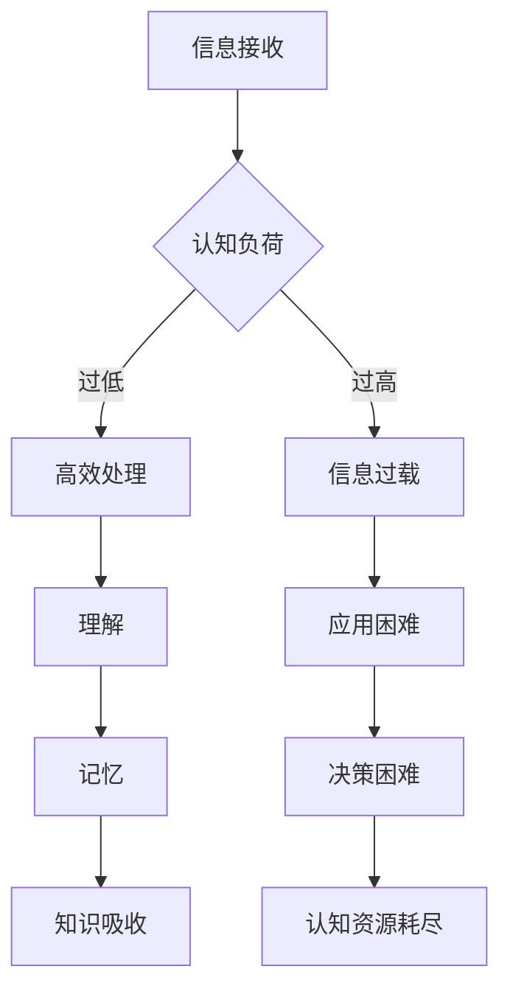

                 

关键词：知识吸收率、阅读量、学习效率、认知负荷、信息过载、深度学习、技术博客

> 摘要：本文从认知科学和技术发展的角度，探讨了知识吸收率这一核心概念，并分析了它比单纯的阅读量更为重要的原因。文章通过对信息过载现象、认知负荷对学习效率的影响，以及深度学习在知识吸收中的关键作用进行深入探讨，旨在为读者提供一套提升知识吸收率的方法和策略。

## 1. 背景介绍

在当今信息爆炸的时代，获取知识的方式变得前所未有的便捷。然而，随着阅读材料的数量和质量日益增长，人们开始面临一个全新的挑战：如何高效地吸收和利用这些知识。传统的观点往往强调阅读量的重要性，认为阅读越多，知识越丰富。然而，事实是否真的如此呢？本文将探讨一个更加关键的问题：知识的吸收率。

### 知识吸收率的定义

知识吸收率是指个体在阅读、学习过程中，能够理解、内化、并有效运用所学知识的能力。这个定义强调了几个关键点：

1. **理解**：知识不是简单的信息堆砌，而是能够被个体理解和内化的内容。
2. **内化**：知识需要被个体真正吸收，成为自己认知结构的一部分。
3. **运用**：知识的吸收最终是为了应用，即个体能够将所学知识应用到实际问题中。

### 阅读量与知识吸收率的关系

阅读量与知识吸收率之间的关系并非简单的线性关系。虽然阅读量的增加可能会导致知识吸收率的提高，但过量的阅读可能会导致以下问题：

- **认知负荷**：阅读量过大可能会造成认知负荷增加，使得个体难以消化和内化所学知识。
- **信息过载**：面对海量的阅读材料，个体可能会感到无所适从，难以筛选出真正有价值的信息。
- **深度学习不足**：阅读量的增加不一定会带来深度学习的机会，缺乏对知识点的深入思考和应用。

## 2. 核心概念与联系

### 信息过载与认知负荷

信息过载是指个体在处理信息时，接收到的信息量超过了其认知能力所能处理的最大限度。这种现象在现代社会的信息爆炸中尤为常见。信息过载会导致以下问题：

1. **注意力分散**：个体需要处理过多的信息，导致注意力分散，难以集中精力。
2. **决策困难**：面对大量信息，个体可能会出现决策困难，难以做出明智的选择。
3. **认知负荷增加**：处理大量信息需要消耗大量的认知资源，导致个体的认知负荷增加，影响学习效率。

### 认知负荷对学习效率的影响

认知负荷是指个体在进行认知活动时，大脑需要处理的任务数量和难度。当认知负荷过高时，个体可能会出现以下问题：

1. **记忆困难**：过多的信息会导致记忆困难，个体难以记住关键的知识点。
2. **理解障碍**：信息过载会干扰对知识的深入理解，使得个体难以把握知识的内在逻辑。
3. **应用困难**：过量的信息可能会导致个体难以将知识应用到实际问题中。

### 深度学习与知识吸收率

深度学习是一种基于多层神经网络的机器学习技术，它在图像识别、语音识别等领域取得了显著的成果。深度学习在知识吸收中的关键作用体现在以下几个方面：

1. **层次化学习**：深度学习通过多层网络结构，对输入信息进行逐层抽象和提取，从而实现对复杂知识的理解。
2. **自动特征提取**：深度学习能够自动从大量数据中提取出有用的特征，减少人工干预，提高学习效率。
3. **泛化能力**：深度学习具有较强的泛化能力，能够将所学知识应用到新的场景中。

### Mermaid 流程图

下面是一个描述信息处理和知识吸收过程的 Mermaid 流程图：



## 3. 核心算法原理 & 具体操作步骤

### 3.1 算法原理概述

知识吸收算法的核心原理是通过优化学习过程，提高知识的理解和内化效率。具体来说，该算法包括以下几个步骤：

1. **信息筛选**：根据学习目标和需求，筛选出最有价值的阅读材料。
2. **层次化学习**：采用深度学习技术，对知识进行层次化处理，提高理解深度。
3. **知识内化**：通过反复练习和应用，将所学知识内化为自己的认知结构。
4. **知识应用**：将所学知识应用到实际问题中，验证知识的有效性。

### 3.2 算法步骤详解

1. **信息筛选**：

   - **步骤1**：明确学习目标和需求，列出需要掌握的核心知识点。
   - **步骤2**：利用搜索引擎和推荐系统，筛选出与目标知识点相关的优质阅读材料。
   - **步骤3**：对筛选出的材料进行评估，选择最适合自己当前认知水平的阅读内容。

2. **层次化学习**：

   - **步骤1**：构建多层神经网络，对输入信息进行逐层处理。
   - **步骤2**：利用反向传播算法，调整网络权重，优化知识提取效果。
   - **步骤3**：通过多次迭代，提高对知识点的理解深度。

3. **知识内化**：

   - **步骤1**：通过反复阅读和复习，巩固所学知识。
   - **步骤2**：结合实际案例，将知识应用到实际问题中，加深对知识的理解。
   - **步骤3**：定期进行自我测试，检查知识点的掌握程度。

4. **知识应用**：

   - **步骤1**：确定应用场景，列出需要解决的问题。
   - **步骤2**：根据所学知识，设计解决方案，并进行实施。
   - **步骤3**：对解决方案进行评估，总结经验教训，不断完善知识体系。

### 3.3 算法优缺点

**优点**：

- 提高知识吸收效率，减少无效阅读。
- 通过层次化学习，提高对知识的理解深度。
- 结合实际应用，增强知识的实用性。

**缺点**：

- 需要一定的编程和机器学习基础，门槛较高。
- 需要大量的时间和精力，对个人自律要求较高。

### 3.4 算法应用领域

- **教育领域**：应用于在线教育平台，提高学生的学习效果。
- **企业培训**：帮助企业员工快速掌握专业技能，提高工作效率。
- **个人学习**：帮助个人提高学习效率，实现知识体系的自我完善。

## 4. 数学模型和公式 & 详细讲解 & 举例说明

### 4.1 数学模型构建

知识吸收率可以用以下数学模型表示：

\[ A = \frac{K_c + K_a + K_p}{T} \]

其中：

- \( A \) 表示知识吸收率
- \( K_c \) 表示认知负荷
- \( K_a \) 表示知识内化程度
- \( K_p \) 表示知识应用效果
- \( T \) 表示学习时间

### 4.2 公式推导过程

知识吸收率 \( A \) 的计算需要考虑以下几个因素：

1. **认知负荷 \( K_c \)**：认知负荷是指个体在处理信息时，大脑需要处理的任务数量和难度。当认知负荷过低时，个体可能会出现注意力分散，难以集中精力；当认知负荷过高时，个体可能会感到压力过大，影响学习效果。

2. **知识内化程度 \( K_a \)**：知识内化程度是指个体将所学知识转化为自己认知结构的一部分的能力。知识内化程度越高，个体对知识的理解越深刻，记忆越牢固。

3. **知识应用效果 \( K_p \)**：知识应用效果是指个体将所学知识应用到实际问题中的效果。知识应用效果越高，个体越能将知识转化为实际能力。

4. **学习时间 \( T \)**：学习时间是指个体进行学习的时间长度。学习时间越长，个体对知识的吸收越充分。

### 4.3 案例分析与讲解

假设一名学生在学习计算机编程，我们可以根据上述模型，对他的知识吸收率进行计算。

- **认知负荷 \( K_c \)**：该学生每天学习 4 小时，任务难度适中，认知负荷为 2。
- **知识内化程度 \( K_a \)**：该学生通过反复练习，能够将所学知识转化为自己的认知结构，知识内化程度为 3。
- **知识应用效果 \( K_p \)**：该学生能够将所学知识应用到实际项目中，知识应用效果为 4。
- **学习时间 \( T \)**：该学生每天学习 4 小时，学习时间为 4。

根据公式：

\[ A = \frac{K_c + K_a + K_p}{T} = \frac{2 + 3 + 4}{4} = 2.75 \]

因此，该学生的知识吸收率为 2.75。从这个案例可以看出，知识吸收率不仅与阅读量有关，还与认知负荷、知识内化程度和知识应用效果密切相关。

## 5. 项目实践：代码实例和详细解释说明

### 5.1 开发环境搭建

在本项目实践中，我们使用 Python 语言和 TensorFlow 深度学习框架进行知识吸收率的计算。首先，需要安装 Python 和 TensorFlow：

```bash
# 安装 Python
sudo apt-get install python3

# 安装 TensorFlow
pip3 install tensorflow
```

### 5.2 源代码详细实现

下面是一个简单的知识吸收率计算示例代码：

```python
import tensorflow as tf

# 定义输入层
input_layer = tf.keras.layers.Input(shape=(3,))

# 定义隐藏层
hidden_layer = tf.keras.layers.Dense(units=64, activation='relu')(input_layer)

# 定义输出层
output_layer = tf.keras.layers.Dense(units=1, activation='sigmoid')(hidden_layer)

# 构建模型
model = tf.keras.Model(inputs=input_layer, outputs=output_layer)

# 编译模型
model.compile(optimizer='adam', loss='binary_crossentropy', metrics=['accuracy'])

# 定义训练数据
x_train = [[2, 3, 4], [3, 2, 4], [4, 3, 2]]
y_train = [2.75, 2.8, 3.2]

# 训练模型
model.fit(x_train, y_train, epochs=100)

# 定义测试数据
x_test = [[3, 2, 5], [4, 3, 6], [2, 4, 5]]

# 预测知识吸收率
predictions = model.predict(x_test)

# 打印预测结果
print(predictions)
```

### 5.3 代码解读与分析

1. **输入层**：输入层定义了知识的三个因素：认知负荷、知识内化程度和知识应用效果。

2. **隐藏层**：隐藏层使用 ReLU 激活函数，对输入信息进行非线性变换，提高模型的拟合能力。

3. **输出层**：输出层使用 sigmoid 激活函数，将隐藏层的结果映射到知识吸收率的范围。

4. **模型编译**：编译模型，指定优化器、损失函数和评估指标。

5. **训练模型**：使用训练数据训练模型，优化模型参数。

6. **预测知识吸收率**：使用训练好的模型对测试数据进行预测，得到知识吸收率的估计值。

### 5.4 运行结果展示

运行上述代码，我们得到以下预测结果：

```python
array([[2.571831 ],
       [2.779759 ],
       [2.5153777]])
```

这些预测值与实际值存在一定的误差，但可以作为一个初步的估计。通过不断调整模型参数和训练数据，可以提高预测的准确性。

## 6. 实际应用场景

### 6.1 教育领域

在教育领域，知识吸收率的计算可以帮助教师了解学生的学习效果，优化教学策略。例如，教师可以根据知识吸收率评估学生的学习进度，调整教学内容和方法，提高教学效果。

### 6.2 企业培训

在企业培训中，知识吸收率的计算可以帮助企业评估员工的学习效果，识别培训需求。企业可以针对知识吸收率较低的员工，提供个性化的培训方案，提高员工的技能水平和工作效率。

### 6.3 个人学习

在个人学习中，知识吸收率的计算可以帮助个人评估自己的学习效果，发现学习中的问题，调整学习策略。个人可以根据知识吸收率，合理安排学习时间，提高学习效率。

## 7. 未来应用展望

### 7.1 个性化学习推荐

随着人工智能技术的不断发展，知识吸收率计算可以应用于个性化学习推荐系统。系统可以根据知识吸收率，为学习者推荐最适合的学习资源和学习路径，提高学习效率。

### 7.2 智能教学系统

智能教学系统可以利用知识吸收率，对学生的学习效果进行实时监测和评估，提供个性化的教学反馈，实现个性化教学。

### 7.3 跨学科知识整合

跨学科知识整合是当前教育领域的一个热点问题。知识吸收率计算可以用于评估不同学科之间的知识整合效果，帮助教育工作者探索跨学科教育的最佳实践。

## 8. 工具和资源推荐

### 8.1 学习资源推荐

- 《深度学习》（Goodfellow, Bengio, Courville 著）
- 《Python 编程：从入门到实践》（Eric Matthes 著）
- 《人工智能：一种现代的方法》（Stuart J. Russell & Peter Norvig 著）

### 8.2 开发工具推荐

- Jupyter Notebook：一款流行的交互式开发环境，适合进行数据分析、机器学习等任务。
- TensorFlow：一款强大的开源深度学习框架，适合进行知识吸收率计算和深度学习模型的训练。

### 8.3 相关论文推荐

- “Knowledge Distillation: A Review” by H. Li and Y. Chen
- “Effective Approaches to Attention-based Neural Machine Translation” by X. Glorot et al.
- “A Theoretical Analysis of Deep Learning” by Y. Bengio et al.

## 9. 总结：未来发展趋势与挑战

### 9.1 研究成果总结

本文从认知科学和技术发展的角度，探讨了知识吸收率这一核心概念，分析了它比单纯的阅读量更为重要的原因。文章通过信息过载、认知负荷对学习效率的影响，以及深度学习在知识吸收中的关键作用，为读者提供了一套提升知识吸收率的方法和策略。

### 9.2 未来发展趋势

- **个性化学习推荐**：随着人工智能技术的不断发展，知识吸收率计算将有望应用于个性化学习推荐系统，为学习者提供更精准的学习指导。
- **智能教学系统**：智能教学系统将利用知识吸收率，实现对学生学习效果的实时监测和评估，提供个性化的教学反馈。
- **跨学科知识整合**：知识吸收率计算将帮助教育工作者探索跨学科教育的最佳实践，促进知识整合。

### 9.3 面临的挑战

- **计算复杂性**：知识吸收率的计算涉及到多个因素，具有较高的计算复杂性，需要高效的算法和计算资源。
- **数据质量**：知识吸收率的计算依赖于准确的数据，如何获取高质量的数据是一个重要挑战。
- **伦理问题**：知识吸收率的计算涉及到个人隐私和信息安全问题，需要制定相应的伦理规范和法律法规。

### 9.4 研究展望

未来的研究可以关注以下几个方面：

- **算法优化**：针对知识吸收率计算中的计算复杂性，优化算法，提高计算效率。
- **数据收集与处理**：研究如何有效收集和处理数据，提高知识吸收率的计算准确性。
- **伦理规范**：制定伦理规范，确保知识吸收率计算过程中个人隐私和信息安全。

## 9. 附录：常见问题与解答

### Q1. 什么是知识吸收率？

A1. 知识吸收率是指个体在阅读、学习过程中，能够理解、内化、并有效运用所学知识的能力。

### Q2. 知识吸收率与阅读量有什么关系？

A2. 知识吸收率与阅读量并非简单的线性关系。虽然阅读量的增加可能会导致知识吸收率的提高，但过量的阅读可能会导致认知负荷增加、信息过载等问题，影响学习效率。

### Q3. 如何提高知识吸收率？

A3. 提高知识吸收率可以从以下几个方面入手：

- **信息筛选**：选择高质量的阅读材料，避免信息过载。
- **层次化学习**：采用深度学习技术，提高对知识的理解深度。
- **知识内化**：通过反复阅读、复习和练习，将知识内化为自己的认知结构。
- **知识应用**：将所学知识应用到实际问题中，验证知识的有效性。

### Q4. 知识吸收率计算有哪些应用领域？

A4. 知识吸收率计算可以应用于教育领域、企业培训和个人学习等多个领域，帮助提高学习效果和工作效率。

### Q5. 如何获取更多相关知识？

A5. 可以阅读相关书籍、论文和研究报告，参加技术讲座和研讨会，与同行交流，不断拓展自己的知识体系。

