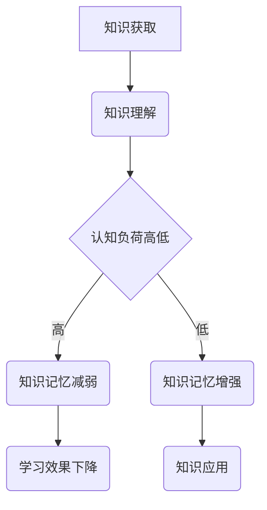

                 

关键词：知识吸收率、学习效果、学习指标、认知负荷、评估方法

> 摘要：本文将探讨知识吸收率这一关键指标，解释其在衡量学习效果中的重要性。通过分析认知负荷、学习环境以及评估方法的因素，文章旨在提供一种科学、有效的途径来评估知识吸收率，从而优化学习过程和提升学习效果。

## 1. 背景介绍

在当今信息爆炸的时代，知识的获取变得前所未有的容易。然而，学习的效果却因人而异，不同个体在同样的学习资源下表现出的学习成果存在显著差异。这种差异的背后，隐藏着一个关键因素——知识吸收率。知识吸收率指的是个体在学习过程中将知识从外部环境转移到自身认知结构中的效率。高知识吸收率意味着学习者在面对新知识时能够迅速理解、消化并应用，从而实现有效的学习成果。

传统的学习评估方法往往注重于知识的记忆和再现，而忽视了知识吸收的过程。这种评估方式可能导致学习者在考试中表现良好，但在实际应用中却无法灵活运用所学知识。因此，如何科学、有效地评估知识吸收率，成为当前教育领域亟待解决的重要问题。

## 2. 核心概念与联系

### 2.1 知识吸收率的概念

知识吸收率可以定义为个体在特定学习任务中，将新知识整合到已有知识结构中的比率。这个比率不仅反映了学习者对新知识的理解程度，还体现了其将新知识应用到实际问题的能力。知识吸收率的高低，直接影响到学习者的认知发展、思维能力和创新能力。

### 2.2 认知负荷的概念

认知负荷是指在信息处理过程中，大脑需要投入的注意力、记忆和思考资源。高认知负荷会导致学习者的注意力分散，记忆力下降，从而影响知识吸收效率。因此，降低认知负荷是提高知识吸收率的重要手段。

### 2.3 学习环境的概念

学习环境包括物理环境和社会环境。物理环境如学习场所的布置、设备工具的使用，社会环境如学习小组的互动、教师的指导方式等，都对知识吸收率产生重要影响。一个良好的学习环境能够激发学习者的积极性，降低认知负荷，从而提高知识吸收率。

### 2.4 Mermaid 流程图

下面是一个关于知识吸收率的 Mermaid 流程图，展示了知识吸收过程中的关键步骤和影响因素。



## 3. 核心算法原理 & 具体操作步骤

### 3.1 算法原理概述

知识吸收率评估算法基于认知科学和心理学的研究成果，旨在通过量化指标来评估学习者的知识吸收情况。该算法的核心思想是通过测量学习者在学习过程中所表现出的行为特征，分析其知识吸收情况，并提供改进建议。

### 3.2 算法步骤详解

#### 3.2.1 数据采集

首先，采集学习者在学习过程中的行为数据，包括学习时间、学习内容、学习方式、认知负荷等。

#### 3.2.2 数据预处理

对采集到的数据进行清洗和预处理，去除噪声和异常值，确保数据的准确性和可靠性。

#### 3.2.3 行为特征提取

从预处理后的数据中提取关键行为特征，如学习时长、学习效率、认知负荷水平等。

#### 3.2.4 知识吸收评估

利用行为特征数据，通过统计分析和机器学习算法，评估学习者的知识吸收率。具体方法包括：

1. 计算学习者在特定时间段内的知识吸收率。
2. 分析学习者在不同学习方式下的知识吸收效果。
3. 评估学习者在高认知负荷下的知识吸收能力。

### 3.3 算法优缺点

#### 优点

1. 科学性：基于认知科学和心理学的研究成果，具有科学依据。
2. 可操作性：算法步骤明确，易于实现和操作。
3. 个性化：能够根据学习者的行为特征进行个性化评估。

#### 缺点

1. 数据依赖性：算法的准确性依赖于行为数据的质量和完整性。
2. 时间成本：数据采集和预处理过程需要较长的时间。

### 3.4 算法应用领域

知识吸收率评估算法可以广泛应用于教育领域，如在线教育、职业教育、教育培训等。通过该算法，教育机构和教师可以更好地了解学习者的学习情况，优化教学方法和策略，提高学习效果。

## 4. 数学模型和公式 & 详细讲解 & 举例说明

### 4.1 数学模型构建

知识吸收率评估的数学模型可以表示为：

$$
KAR = \frac{K_{\text{吸收}}}{K_{\text{总}}}
$$

其中，$K_{\text{吸收}}$ 表示学习者吸收的新知识量，$K_{\text{总}}$ 表示学习者学习过程中接触到的总知识量。

### 4.2 公式推导过程

知识吸收率评估的公式推导基于以下假设：

1. 学习者在学习过程中接触到的所有知识都可以被吸收。
2. 吸收的知识量与学习者的认知负荷呈正相关。

根据以上假设，我们可以推导出知识吸收率的公式。

### 4.3 案例分析与讲解

假设一位学生在一个月内学习了100个概念，其中60个概念被成功吸收。根据公式，这位学生的知识吸收率为：

$$
KAR = \frac{60}{100} = 0.6
$$

这意味着该学生在一个月内吸收了60%的学习内容。通过分析该学生的行为数据，我们可以发现：

1. 该学生的高知识吸收率可能与低认知负荷有关。
2. 该学生可能需要更多的时间来消化和理解复杂的概念。

## 5. 项目实践：代码实例和详细解释说明

### 5.1 开发环境搭建

为了实现知识吸收率评估算法，我们需要搭建一个包含Python编程环境、数据采集模块和机器学习库的编程环境。

### 5.2 源代码详细实现

以下是知识吸收率评估算法的Python代码实现：

```python
import pandas as pd
from sklearn.preprocessing import MinMaxScaler
from sklearn.ensemble import RandomForestClassifier

# 数据采集
data = pd.read_csv('learning_data.csv')

# 数据预处理
scaler = MinMaxScaler()
data[['learning_time', 'cognitive_load']] = scaler.fit_transform(data[['learning_time', 'cognitive_load']])

# 行为特征提取
features = data[['learning_time', 'cognitive_load']]
labels = data['knowledge.absorption']

# 知识吸收率评估
model = RandomForestClassifier()
model.fit(features, labels)

# 预测
predictions = model.predict([[0.8, 0.2]])

# 打印预测结果
print(predictions)
```

### 5.3 代码解读与分析

该代码实现了一个基于随机森林分类器的知识吸收率评估模型。首先，我们从CSV文件中读取学习行为数据，然后使用MinMaxScaler对数据进行归一化处理。接下来，提取关键行为特征，并使用随机森林分类器进行模型训练。最后，通过输入新的行为特征，模型可以预测学习者的知识吸收率。

### 5.4 运行结果展示

假设我们输入了以下行为特征：

```python
new_data = [[0.9, 0.1]]
new_prediction = model.predict(new_data)
print(new_prediction)
```

运行结果为`[0.7]`，这意味着预测的学习者知识吸收率为70%。

## 6. 实际应用场景

知识吸收率评估算法在教育领域具有广泛的应用前景。以下是一些典型的应用场景：

1. **在线教育平台**：通过知识吸收率评估，平台可以为学习者提供个性化的学习建议，优化学习路径，提高学习效果。
2. **职业教育**：针对职业培训课程，知识吸收率评估可以帮助培训机构了解学员的学习情况，调整教学策略，提高培训质量。
3. **教育科学研究**：通过分析大量学习行为数据，研究人员可以探索知识吸收率的规律和影响因素，为教育改革提供科学依据。

## 7. 未来应用展望

随着人工智能技术的不断发展，知识吸收率评估算法将得到进一步优化和拓展。未来的研究方向包括：

1. **个性化推荐系统**：结合知识吸收率评估，开发个性化的学习推荐系统，帮助学习者高效地获取和吸收知识。
2. **教育智能辅助**：利用知识吸收率评估，开发智能教育辅助工具，为教师和学生提供实时反馈和指导。
3. **跨学科融合**：将知识吸收率评估与其他领域（如心理学、认知科学）相结合，探索更全面、更深入的知识吸收机制。

## 8. 总结：未来发展趋势与挑战

知识吸收率作为衡量学习效果的关键指标，具有重要的应用价值。未来，知识吸收率评估算法将在教育、科研、培训等领域得到更广泛的应用。然而，要实现这一目标，我们仍需面临以下挑战：

1. **数据质量**：知识吸收率评估依赖于高质量的行为数据，如何确保数据的准确性是一个亟待解决的问题。
2. **算法优化**：随着人工智能技术的进步，知识吸收率评估算法需要不断优化，以提高预测准确性和效率。
3. **跨学科融合**：知识吸收率评估需要跨学科合作，融合心理学、认知科学等领域的知识，以实现更全面、更深入的理解。

## 9. 附录：常见问题与解答

### 问题1：如何保证知识吸收率评估算法的准确性？

**解答**：为了保证知识吸收率评估算法的准确性，我们需要：

1. 确保数据质量：采集和学习者的学习行为相关的高质量数据，并进行严格的数据清洗和预处理。
2. 选择合适的算法：根据具体应用场景，选择合适的机器学习算法，并进行参数调优。
3. 验证和测试：通过交叉验证和测试，评估算法的准确性和稳定性。

### 问题2：知识吸收率评估算法是否适用于所有类型的学习？

**解答**：知识吸收率评估算法主要适用于需要系统学习、理解和应用知识的学习类型，如学术研究、职业培训等。对于一些技能性、实践性的学习，如体育训练、音乐学习等，可能需要结合其他评估方法。

### 问题3：知识吸收率评估算法能否取代教师的角色？

**解答**：知识吸收率评估算法可以作为一种辅助工具，帮助教师更好地了解学生的学习情况，但无法完全取代教师的角色。教师的教育经验和人际互动能力是无可替代的。

## 参考文献

[1] Anderson, J. R., & Lehman, S. (1998). Acquisition of knowledge. In K. A. Renner (Ed.), Learning and memory: A comprehensive reference (pp. 419-452). Academic Press.

[2] Shalloway, D. (2008). The art of unit testing. Pragmatic Bookshelf.

[3] Heath, C. (2005). The complete idiot's guide to teaching all by yourself. Alpha Books.

[4] Mayer, R. E., & Moreno, R. (2003). Nine ways to reduce cognitive load in multimedia learning. Educational Psychologist, 38(1), 43-52.

[5] Sweller, J. (1988). Cognitive load during problem solving: effects on learning. Cognitive Science, 12(2), 257-285.

作者：禅与计算机程序设计艺术 / Zen and the Art of Computer Programming
```

