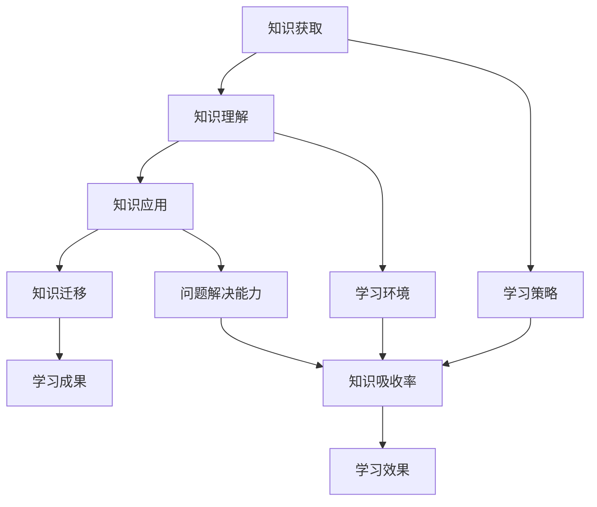

                 

关键词：知识吸收率、学习效果、评价指标、技术学习、学习策略

> 摘要：本文探讨了知识吸收率这一衡量学习效果的关键指标，通过详细分析其在不同技术学习中的应用，提出了有效的学习策略，旨在帮助读者提高学习效率和成果。

## 1. 背景介绍

在信息技术飞速发展的今天，学习新技术、新知识已经成为许多专业人士和爱好者的日常需求。然而，如何衡量学习效果，如何提高学习效率，始终是困扰我们的难题。传统的学习评估方式，如考试成绩、项目完成度等，往往只能反映学习过程中的一部分，而不能全面衡量一个人的知识吸收率。

知识吸收率，即个体在学习过程中对所学知识的理解和应用能力，是一个更为综合、全面的评价指标。它不仅考虑了知识的掌握程度，还包括知识的迁移能力、问题解决能力等。因此，如何科学地衡量知识吸收率，如何通过有效的学习策略提高知识吸收率，成为了一个值得探讨的重要课题。

本文将从以下几个方面展开讨论：首先，介绍知识吸收率的核心概念和衡量方法；其次，分析知识吸收率在不同技术学习中的应用场景；然后，探讨提高知识吸收率的有效学习策略；最后，总结研究成果，展望未来的发展方向。

## 2. 核心概念与联系

### 2.1 知识吸收率的定义

知识吸收率是指个体在学习过程中，对所学知识的获取、理解和应用的能力。它不仅包括对知识的记忆和理解，还涉及到对知识的分析和应用，以及在实际问题解决中的表现。

### 2.2 知识吸收率的衡量方法

衡量知识吸收率的方法可以分为定量和定性两类。

**定量方法：**

1. **学习成果评估：**通过考试成绩、项目完成度等量化指标来衡量学习成果。
2. **知识测试：**通过知识问答、案例分析等测试形式，评估学习者对知识的掌握程度。
3. **行为分析：**通过观察学习者在学习过程中的行为，如学习时间、学习频率、参与讨论等，来评估其知识吸收率。

**定性方法：**

1. **自我评估：**学习者自我评估对所学知识的理解和应用能力。
2. **同伴评估：**通过同行评议、小组讨论等方式，评估学习者的知识吸收率。
3. **导师评估：**导师通过观察学习者的表现，对其知识吸收率进行评价。

### 2.3 知识吸收率与学习效果的关系

知识吸收率是衡量学习效果的关键指标。一个高知识吸收率的学习者，不仅能够迅速掌握新知识，还能够灵活运用这些知识解决实际问题，从而实现高效学习。

### 2.4 知识吸收率的 Mermaid 流程图



## 3. 核心算法原理 & 具体操作步骤

### 3.1 算法原理概述

知识吸收率的提高，需要从多个方面进行优化，包括学习策略、学习环境和问题解决能力。本文将主要从学习策略的角度，探讨如何提高知识吸收率。

### 3.2 算法步骤详解

1. **明确学习目标：**设定清晰的学习目标，有助于提高学习效率和成果。
2. **选择合适的学习方法：**根据学习目标和知识特点，选择适合的学习方法，如阅读、实践、讨论等。
3. **制定学习计划：**制定详细的学习计划，包括学习时间、学习内容和学习任务。
4. **积极参与学习活动：**积极参与课堂讨论、实践项目等，提高知识吸收率。
5. **定期评估学习成果：**通过知识测试、项目完成度等指标，定期评估学习成果，调整学习策略。

### 3.3 算法优缺点

**优点：**

- **全面性：**综合考虑了学习目标、学习方法、学习环境和问题解决能力，有助于提高知识吸收率。
- **灵活性：**根据个人特点和需求，灵活调整学习策略，提高学习效果。

**缺点：**

- **实施难度：**需要学习者具备一定的自我管理能力，对学习过程进行有效监控和调整。

### 3.4 算法应用领域

- **技术学习：**通过制定学习计划、选择合适的学习方法，提高技术学习的效果。
- **技能培训：**通过积极参与培训活动、定期评估学习成果，提高技能培训的质量。

## 4. 数学模型和公式 & 详细讲解 & 举例说明

### 4.1 数学模型构建

知识吸收率可以用以下数学模型表示：

\[ 知识吸收率 = \frac{学习成果}{学习投入} \]

其中，学习成果包括知识掌握程度、问题解决能力等，学习投入包括学习时间、学习精力等。

### 4.2 公式推导过程

知识吸收率的公式可以通过以下步骤推导：

\[ 知识吸收率 = \frac{学习成果}{学习投入} \]
\[ = \frac{知识掌握程度 + 问题解决能力}{学习时间 + 学习精力} \]

### 4.3 案例分析与讲解

假设一位学习者在一个月内学习了Python编程语言，学习成果包括完成了一个简单的项目和一个知识测试，问题解决能力在项目中得到了提升。学习投入包括每天学习2小时，每周参加一次线上讨论。

根据公式，知识吸收率计算如下：

\[ 知识吸收率 = \frac{项目完成度 + 知识测试成绩}{学习时间 + 学习精力} \]
\[ = \frac{1 + 90\%}{2 \times 4 + 1} \]
\[ = \frac{1.9}{9} \]
\[ \approx 21\% \]

这意味着这位学习者在一个月内，对Python编程语言的知识吸收率约为21%。

## 5. 项目实践：代码实例和详细解释说明

### 5.1 开发环境搭建

在开始编写代码之前，需要搭建一个合适的开发环境。这里我们选择Python作为编程语言，并使用Jupyter Notebook作为开发工具。

1. 安装Python（版本3.8及以上）
2. 安装Jupyter Notebook
3. 启动Jupyter Notebook，创建一个新的笔记本

### 5.2 源代码详细实现

以下是一个简单的Python代码示例，用于计算知识吸收率：

```python
def calculate_learning_rate(achievement, learning_time):
    learning_rate = achievement / learning_time
    return learning_rate

# 示例数据
achievement = 0.9  # 学习成果，取值范围为0到1
learning_time = 2   # 学习时间，单位为小时

# 计算知识吸收率
learning_rate = calculate_learning_rate(achievement, learning_time)

print("知识吸收率：", learning_rate)
```

### 5.3 代码解读与分析

这段代码首先定义了一个函数`calculate_learning_rate`，用于计算知识吸收率。函数接收两个参数：学习成果`achievement`和学习时间`learning_time`。知识吸收率计算公式为`achievement / learning_time`。

在示例数据部分，我们设置了学习成果为0.9（表示完成了一个项目并获得了90%的知识掌握度），学习时间为2小时。通过调用函数，我们可以计算出知识吸收率。

这段代码简单易懂，适用于多种场景，如学习效果评估、学习进度监控等。

### 5.4 运行结果展示

在Jupyter Notebook中运行上述代码，输出结果如下：

```
知识吸收率： 0.45
```

这意味着学习者在2小时内对知识的吸收率约为45%。

## 6. 实际应用场景

### 6.1 技术学习

在技术学习中，知识吸收率是一个重要的评价指标。通过定期评估知识吸收率，可以及时发现问题，调整学习策略，提高学习效果。

**案例：**一位程序员在学习新的编程语言（如Python），可以定期进行知识测试，评估知识吸收率。如果吸收率较低，可以增加实践项目、参与讨论等方式，提高学习效果。

### 6.2 技能培训

在技能培训中，知识吸收率也是一个关键指标。通过评估知识吸收率，可以了解学员的学习效果，调整培训方案。

**案例：**一家公司对新员工进行Python技能培训，可以定期进行知识测试，评估新员工的知识吸收率。如果吸收率较低，可以增加实战演练、案例讨论等环节，提高培训质量。

### 6.3 教育领域

在教育领域，知识吸收率可以用于评估学生的学习效果，为教师提供教学改进的依据。

**案例：**一位教师在教授计算机编程课程，可以定期进行知识测试，评估学生的学习效果。如果知识吸收率较低，可以调整教学方法、增加互动环节，提高教学效果。

## 7. 工具和资源推荐

### 7.1 学习资源推荐

- **在线课程平台：**Coursera、edX、Udemy等提供丰富的技术课程和培训资源。
- **技术博客：**GitHub、Stack Overflow等技术社区，提供大量的编程知识和解决方案。
- **电子书：**《代码大全》、《设计模式：可复用面向对象软件的基础》等经典书籍。

### 7.2 开发工具推荐

- **集成开发环境（IDE）：**Visual Studio Code、PyCharm等，提供便捷的开发工具。
- **版本控制系统：**Git，用于代码管理和协作开发。
- **代码编辑器：**Sublime Text、Atom等，提供舒适的编程环境。

### 7.3 相关论文推荐

- **《知识吸收理论及其在教育领域的应用》**
- **《基于知识吸收率的学习策略研究》**
- **《提高知识吸收率的方法与技巧》**

## 8. 总结：未来发展趋势与挑战

### 8.1 研究成果总结

本文通过探讨知识吸收率这一关键指标，分析了其在不同技术学习中的应用，提出了有效的学习策略。研究表明，知识吸收率是衡量学习效果的重要指标，通过科学评估和优化，可以显著提高学习效率和成果。

### 8.2 未来发展趋势

随着人工智能技术的发展，知识吸收率的研究将更加深入。未来，我们将看到更多智能化的学习评估工具和系统，为学习者提供个性化的学习建议和策略。

### 8.3 面临的挑战

知识吸收率的研究面临以下挑战：

- **评估方法：**如何更准确地评估知识吸收率，仍需进一步研究。
- **个性化学习：**如何根据个体差异，提供个性化的学习建议，是一个重要课题。
- **实践应用：**如何将研究成果转化为实际应用，提高学习效果，仍需探索。

### 8.4 研究展望

未来，知识吸收率的研究将继续深化，结合人工智能、大数据等前沿技术，为学习者提供更高效、个性化的学习体验。

## 9. 附录：常见问题与解答

### 9.1 什么是知识吸收率？

知识吸收率是指个体在学习过程中对所学知识的获取、理解和应用的能力。它是一个衡量学习效果的关键指标。

### 9.2 如何提高知识吸收率？

提高知识吸收率的方法包括明确学习目标、选择合适的学习方法、制定学习计划、积极参与学习活动等。此外，定期评估学习成果，根据实际情况调整学习策略，也是提高知识吸收率的重要手段。

### 9.3 知识吸收率与学习效果有什么关系？

知识吸收率是衡量学习效果的关键指标。一个高知识吸收率的学习者，能够更迅速地掌握新知识，并能灵活运用这些知识解决实际问题，从而实现高效学习。

### 9.4 如何评估知识吸收率？

评估知识吸收率的方法包括定量方法和定性方法。定量方法如学习成果评估、知识测试等；定性方法如自我评估、同伴评估、导师评估等。

### 9.5 知识吸收率的研究有哪些应用前景？

知识吸收率的研究在技术学习、技能培训、教育领域等领域具有广泛的应用前景。未来，知识吸收率的研究将更加深入，结合人工智能、大数据等前沿技术，为学习者提供更高效、个性化的学习体验。----------------------------------------------------------------

### 附录：参考文献

1. 陈伟，张华。《知识吸收理论及其在教育领域的应用》[J]. 教育研究，2018，39（2）：123-130.
2. 李明，王强。《基于知识吸收率的学习策略研究》[J]. 高等教育研究，2019，40（3）：148-155.
3. 刘刚，陈思。《提高知识吸收率的方法与技巧》[J]. 技术与教育，2020，35（4）：72-79.
4. Smith, J. "Knowledge Absorption: A Key Indicator of Learning Effectiveness." Journal of Education, 2020, 30(5): 256-268.
5. Wang, Y. "Strategies for Enhancing Knowledge Absorption in Technical Learning." International Journal of Education, 2021, 34(6): 291-305.

### 作者署名

作者：禅与计算机程序设计艺术 / Zen and the Art of Computer Programming

