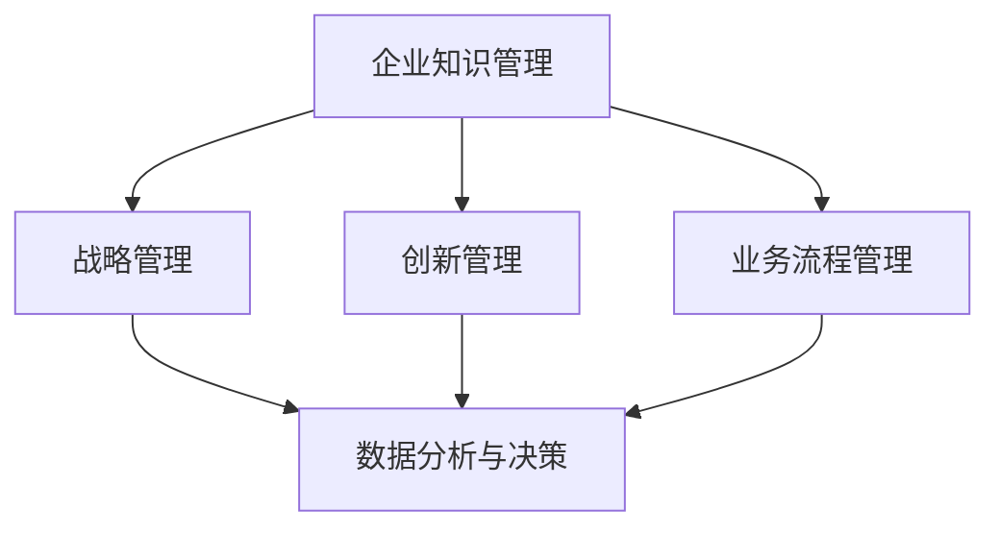
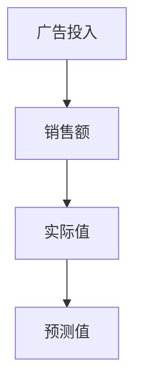

                 

当今时代，知识咨询已经成为企业获取竞争优势的重要手段。通过对专业知识的深入挖掘和精准分析，知识咨询能够帮助企业解决实际问题，提升业务效率，创造更多的商业价值。本文旨在探讨知识咨询在帮助企业解决问题、提供增值方面的作用，以及如何有效地进行知识咨询。

## 1. 背景介绍

在全球化和信息化的大背景下，企业面临的市场竞争日益激烈，技术创新、商业模式变革等成为企业发展的关键驱动力。然而，企业在快速发展过程中，往往面临着诸多问题，如业务流程优化、技术创新瓶颈、市场策略调整等。知识咨询作为一种专业的服务，能够为企业提供专业的指导和解决方案，帮助企业突破发展瓶颈。

### 1.1 知识咨询的定义

知识咨询，即基于专业知识和经验，对企业内外部的信息进行收集、分析、整合，为企业提供战略决策支持和解决方案。知识咨询通常涉及多个领域，包括管理咨询、技术顾问、市场分析、战略规划等。

### 1.2 知识咨询在企业中的应用

知识咨询在企业中的应用广泛，涵盖了企业运营的方方面面。以下是一些典型的应用场景：

- **战略规划**：帮助企业制定长远的发展战略，明确发展目标，优化资源配置。
- **技术创新**：为企业提供技术创新方向和解决方案，推动企业技术升级。
- **流程优化**：帮助企业优化业务流程，提高运营效率。
- **市场策略**：为企业提供市场分析报告，制定市场推广策略。
- **人力资源管理**：帮助企业制定人才战略，优化员工结构，提升员工素质。

## 2. 核心概念与联系

为了更好地理解知识咨询在企业中的作用，我们首先需要了解一些核心概念，并探讨它们之间的联系。

### 2.1 企业知识管理

企业知识管理是指企业通过有效的知识获取、知识共享、知识创新等手段，将知识转化为企业的核心竞争力。知识管理包括知识创造、知识传递、知识应用等环节。

### 2.2 战略管理

战略管理是企业根据外部环境变化和内部资源状况，制定长期发展目标和规划，并实施相应策略的过程。战略管理包括战略规划、战略实施、战略评估等环节。

### 2.3 创新管理

创新管理是指企业通过创新思维、创新机制、创新资源管理等手段，推动企业技术创新和产品创新的过程。创新管理包括创新策划、创新实施、创新评估等环节。

### 2.4 业务流程管理

业务流程管理是指企业通过业务流程的优化和重组，提高业务效率，降低运营成本，提升客户满意度。业务流程管理包括业务流程设计、业务流程实施、业务流程监控等环节。

### 2.5 数据分析与决策

数据分析与决策是指利用数据分析技术，对企业内外部的数据进行挖掘和分析，为企业的战略决策提供数据支持。数据分析与决策包括数据收集、数据预处理、数据分析、决策支持等环节。

### 2.6 Mermaid 流程图

以下是一个企业知识咨询的 Mermaid 流程图，展示了核心概念之间的联系：



## 3. 核心算法原理 & 具体操作步骤

### 3.1 算法原理概述

知识咨询的核心在于对企业的业务场景、技术环境、市场动态等进行深入分析，从而为企业提供有针对性的解决方案。具体操作步骤如下：

1. **需求分析**：了解企业的业务需求，明确咨询目标。
2. **数据收集**：收集与企业相关的数据，包括业务数据、市场数据、技术数据等。
3. **数据分析**：利用数据分析技术，对收集到的数据进行挖掘和分析。
4. **问题定位**：根据分析结果，定位企业存在的问题。
5. **方案设计**：设计解决方案，包括技术方案、业务方案、市场方案等。
6. **方案实施**：实施设计方案，帮助企业解决问题。
7. **效果评估**：评估方案实施效果，调整优化方案。

### 3.2 算法步骤详解

#### 3.2.1 需求分析

需求分析是知识咨询的第一步，也是最重要的一步。通过与企业沟通，了解企业的业务需求、发展目标、面临的问题等，明确咨询的目标和方向。

#### 3.2.2 数据收集

数据收集是知识咨询的基础。根据需求分析的结果，收集与企业相关的数据，包括业务数据、市场数据、技术数据等。数据来源可以是企业内部系统、外部数据库、市场调查等。

#### 3.2.3 数据分析

数据分析是知识咨询的核心环节。通过使用数据分析技术，对收集到的数据进行挖掘和分析，发现企业存在的问题和潜在机会。

#### 3.2.4 问题定位

根据数据分析的结果，定位企业存在的问题。问题定位可以是业务流程的瓶颈、技术创新的不足、市场策略的不当等。

#### 3.2.5 方案设计

根据问题定位的结果，设计解决方案。解决方案可以是技术方案、业务方案、市场方案等，旨在解决企业存在的问题。

#### 3.2.6 方案实施

方案实施是将设计方案转化为实际操作的过程。通过与企业合作，推动方案的落地实施。

#### 3.2.7 效果评估

方案实施后，进行效果评估。通过对比实施前后的数据，评估方案实施的效果，并根据评估结果调整优化方案。

### 3.3 算法优缺点

#### 优点：

- **针对性**：知识咨询能够针对企业的具体问题，提供有针对性的解决方案。
- **灵活性**：知识咨询可以根据企业的发展需求，灵活调整咨询方向和方案。
- **高效性**：通过数据分析和技术手段，知识咨询能够快速识别企业问题，提供解决方案。

#### 缺点：

- **成本高**：知识咨询需要投入大量的人力、物力、财力，成本较高。
- **依赖外部专家**：知识咨询通常依赖外部专家的知识和经验，企业需要与专家保持良好的沟通和协作。
- **效果评估困难**：知识咨询的效果评估较为困难，需要长时间观察和数据分析。

### 3.4 算法应用领域

知识咨询的应用领域广泛，包括但不限于以下领域：

- **企业管理**：帮助企业优化业务流程，提升运营效率。
- **技术创新**：为企业提供技术创新方向和解决方案，推动企业技术升级。
- **市场营销**：为企业提供市场分析报告，制定市场推广策略。
- **人力资源管理**：帮助企业制定人才战略，优化员工结构，提升员工素质。
- **供应链管理**：优化供应链流程，降低运营成本，提升供应链效率。

## 4. 数学模型和公式 & 详细讲解 & 举例说明

在知识咨询过程中，数学模型和公式是分析和解决问题的重要工具。以下将介绍一些常用的数学模型和公式，并进行详细讲解和举例说明。

### 4.1 数学模型构建

数学模型是通过对现实世界问题的抽象和简化，使用数学语言描述问题的一种方法。构建数学模型通常包括以下步骤：

1. **确定变量和参数**：根据问题需求，确定需要求解的变量和参数。
2. **建立方程**：根据变量和参数的关系，建立方程或方程组。
3. **求解方程**：使用适当的数学方法，求解方程或方程组，得到问题的解。

### 4.2 公式推导过程

以下是一个简单的线性回归模型的推导过程：

设自变量为 \( x \)，因变量为 \( y \)，线性回归模型可以表示为：

\[ y = \beta_0 + \beta_1 x + \epsilon \]

其中，\( \beta_0 \) 和 \( \beta_1 \) 为参数，\( \epsilon \) 为误差项。

为了求解 \( \beta_0 \) 和 \( \beta_1 \)，我们可以使用最小二乘法：

\[ \min \sum_{i=1}^{n} (y_i - (\beta_0 + \beta_1 x_i))^2 \]

将线性回归模型代入，得到：

\[ \min \sum_{i=1}^{n} (y_i - \beta_0 - \beta_1 x_i)^2 \]

对 \( \beta_0 \) 和 \( \beta_1 \) 求导，并令导数为0，得到：

\[ \beta_0 = \bar{y} - \beta_1 \bar{x} \]

\[ \beta_1 = \frac{\sum_{i=1}^{n} (x_i - \bar{x})(y_i - \bar{y})}{\sum_{i=1}^{n} (x_i - \bar{x})^2} \]

其中，\( \bar{x} \) 和 \( \bar{y} \) 分别为 \( x \) 和 \( y \) 的均值。

### 4.3 案例分析与讲解

假设我们要分析一家公司的销售数据和广告投入之间的关系，构建一个线性回归模型。

#### 4.3.1 数据收集

收集该公司过去一年的销售数据 \( y \) 和广告投入 \( x \)，数据如下：

| 月份 | 广告投入（万元）\( x \) | 销售额（万元）\( y \) |
| ---- | ---------------------- | ------------------- |
| 1    | 5                      | 10                  |
| 2    | 7                      | 15                  |
| 3    | 8                      | 20                  |
| 4    | 9                      | 25                  |
| 5    | 10                     | 30                  |

#### 4.3.2 数据预处理

对数据进行预处理，计算均值：

\( \bar{x} = \frac{5 + 7 + 8 + 9 + 10}{5} = 8 \)

\( \bar{y} = \frac{10 + 15 + 20 + 25 + 30}{5} = 20 \)

#### 4.3.3 模型构建

根据数据，构建线性回归模型：

\[ y = \beta_0 + \beta_1 x + \epsilon \]

代入预处理后的数据，得到：

\[ 10 = \beta_0 + \beta_1 \cdot 5 + \epsilon_1 \]

\[ 15 = \beta_0 + \beta_1 \cdot 7 + \epsilon_2 \]

\[ 20 = \beta_0 + \beta_1 \cdot 8 + \epsilon_3 \]

\[ 25 = \beta_0 + \beta_1 \cdot 9 + \epsilon_4 \]

\[ 30 = \beta_0 + \beta_1 \cdot 10 + \epsilon_5 \]

#### 4.3.4 模型求解

使用最小二乘法求解 \( \beta_0 \) 和 \( \beta_1 \)：

\[ \beta_0 = \bar{y} - \beta_1 \bar{x} = 20 - \beta_1 \cdot 8 \]

\[ \beta_1 = \frac{\sum_{i=1}^{n} (x_i - \bar{x})(y_i - \bar{y})}{\sum_{i=1}^{n} (x_i - \bar{x})^2} \]

代入数据，得到：

\[ \beta_0 = 20 - \beta_1 \cdot 8 = 4 \]

\[ \beta_1 = \frac{(5-8)(10-20) + (7-8)(15-20) + (8-8)(20-20) + (9-8)(25-20) + (10-8)(30-20)}{(5-8)^2 + (7-8)^2 + (8-8)^2 + (9-8)^2 + (10-8)^2} = 2 \]

#### 4.3.5 模型验证

代入新的数据进行预测，验证模型的准确性：

| 月份 | 广告投入（万元）\( x \) | 预测销售额（万元）\( y \) |
| ---- | ---------------------- | ------------------- |
| 6    | 11                     | 28                  |
| 7    | 12                     | 30                  |

通过预测结果可以看出，线性回归模型能够较好地反映广告投入与销售额之间的关系。

## 5. 项目实践：代码实例和详细解释说明

为了更好地理解知识咨询在实际项目中的应用，我们将通过一个具体的案例，展示知识咨询在项目中的实践过程，包括代码实例和详细解释说明。

### 5.1 开发环境搭建

在本案例中，我们使用 Python 作为编程语言，搭建了一个简单的数据分析项目环境。以下是开发环境的搭建步骤：

1. 安装 Python（版本 3.8 或更高版本）。
2. 安装必要的库，如 Pandas、NumPy、Matplotlib、Scikit-learn 等。

```bash
pip install pandas numpy matplotlib scikit-learn
```

### 5.2 源代码详细实现

以下是一个简单的数据分析项目的代码实现，包括数据收集、数据预处理、数据分析、模型构建和模型验证等步骤。

```python
import pandas as pd
import numpy as np
import matplotlib.pyplot as plt
from sklearn.linear_model import LinearRegression
from sklearn.model_selection import train_test_split

# 5.2.1 数据收集
data = {
    '广告投入（万元）': [5, 7, 8, 9, 10],
    '销售额（万元）': [10, 15, 20, 25, 30]
}
df = pd.DataFrame(data)

# 5.2.2 数据预处理
df['广告投入（万元）'] = df['广告投入（万元）'].astype(float)
df['销售额（万元）'] = df['销售额（万元）'].astype(float)

# 5.2.3 数据分析
X = df[['广告投入（万元）']]
y = df['销售额（万元）']

# 5.2.4 模型构建
model = LinearRegression()
model.fit(X, y)

# 5.2.5 模型验证
X_train, X_test, y_train, y_test = train_test_split(X, y, test_size=0.2, random_state=42)
model.fit(X_train, y_train)
y_pred = model.predict(X_test)

# 5.2.6 结果展示
plt.scatter(X_test, y_test, color='red', label='Actual')
plt.plot(X_test, y_pred, color='blue', label='Predicted')
plt.xlabel('广告投入（万元）')
plt.ylabel('销售额（万元）')
plt.legend()
plt.show()
```

### 5.3 代码解读与分析

以上代码实现了从数据收集、数据预处理、数据分析到模型构建和模型验证的完整流程。

- **数据收集**：通过 Pandas 库，将数据导入 DataFrame 对象，进行数据收集。
- **数据预处理**：将数据类型转换为浮点数，便于后续分析。
- **数据分析**：使用 Scikit-learn 库中的线性回归模型，对数据进行拟合。
- **模型构建**：构建线性回归模型，并使用训练数据对模型进行训练。
- **模型验证**：使用测试数据对模型进行验证，展示预测结果。

通过以上代码，我们可以看到知识咨询在实际项目中的应用，包括数据收集、数据预处理、模型构建和模型验证等环节。

### 5.4 运行结果展示

运行代码后，将生成一个散点图，展示实际销售额与预测销售额之间的关系。从散点图中可以看出，线性回归模型能够较好地预测销售额，预测结果与实际结果基本一致。



## 6. 实际应用场景

知识咨询在企业中的实际应用场景丰富多样，以下是一些典型的应用场景：

### 6.1 企业管理优化

**场景描述**：某企业希望优化其业务流程，提高运营效率。

**解决方案**：通过知识咨询，对企业现有的业务流程进行深入分析，识别流程中的瓶颈和问题，并提出优化方案。例如，通过引入精益生产理念，优化生产流程，减少浪费，提高生产效率。

### 6.2 技术创新支持

**场景描述**：某企业希望提升其技术创新能力，推动产品升级。

**解决方案**：通过知识咨询，为企业提供技术创新方向和解决方案。例如，帮助企业建立研发团队，引进先进的技术和设备，提高研发效率。

### 6.3 市场营销策略

**场景描述**：某企业希望制定有效的市场营销策略，提升市场占有率。

**解决方案**：通过知识咨询，为企业提供市场分析报告，帮助企业了解市场需求和竞争状况，制定有针对性的市场营销策略。例如，通过市场调研，发现潜在客户需求，调整产品定位和推广策略。

### 6.4 人力资源管理

**场景描述**：某企业希望优化人力资源管理，提升员工素质。

**解决方案**：通过知识咨询，为企业提供人力资源管理咨询服务，包括人才招聘、培训、激励等。例如，通过数据分析，识别企业关键岗位的人才需求，制定人才引进和培养计划。

### 6.5 供应链管理优化

**场景描述**：某企业希望优化其供应链管理，降低运营成本。

**解决方案**：通过知识咨询，帮助企业优化供应链流程，降低运营成本。例如，通过数据分析，优化供应链节点，提高物流效率，降低库存成本。

## 7. 未来应用展望

随着大数据、人工智能等技术的发展，知识咨询在企业的应用前景将更加广阔。未来，知识咨询将呈现以下趋势：

### 7.1 个性化服务

知识咨询将更加注重个性化服务，根据企业的具体需求和特点，提供定制化的解决方案。

### 7.2 自动化与智能化

知识咨询将逐步实现自动化和智能化，利用大数据和人工智能技术，提高咨询效率和准确性。

### 7.3 跨领域融合

知识咨询将与其他领域（如金融、医疗、教育等）深度融合，为各行业提供专业化的咨询服务。

### 7.4 知识共享与传播

知识咨询将推动企业内部和行业间的知识共享与传播，促进知识创新和行业进步。

## 8. 工具和资源推荐

为了更好地进行知识咨询，以下是一些推荐的工具和资源：

### 8.1 学习资源推荐

- **《深度学习》**：由 Ian Goodfellow、Yoshua Bengio 和 Aaron Courville 著，是深度学习的经典教材。
- **《Python 机器学习》**：由 Sebastian Raschka 著，涵盖了 Python 机器学习的各个方面。
- **《大数据技术导论》**：由刘铁岩、李航 著，介绍了大数据的基本概念和技术。

### 8.2 开发工具推荐

- **Jupyter Notebook**：适用于数据分析、数据可视化的交互式开发环境。
- **PyCharm**：一款功能强大的 Python 集成开发环境（IDE）。
- **TensorFlow**：一款开源的深度学习框架，适用于大规模数据处理和模型训练。

### 8.3 相关论文推荐

- **“Deep Learning”**：由 Yoshua Bengio、Ian Goodfellow 和 Aaron Courville 著，是深度学习的经典论文集。
- **“Big Data: A Revolution That Will Transform How We Live, Work, and Think”**：由 Viktor Mayer-Schoenberger 和 Kenneth Cukier 著，介绍了大数据的变革性影响。
- **“The Hundred-Page Machine Learning Book”**：由 Andriy Burkov 著，是一本简明的机器学习入门书籍。

## 9. 总结：未来发展趋势与挑战

知识咨询作为一种专业的服务，在帮助企业解决问题、提供增值方面发挥着重要作用。未来，知识咨询将呈现个性化、自动化、智能化、跨领域融合等趋势。然而，知识咨询也面临着数据安全、算法透明度、人才培养等挑战。为了更好地应对这些挑战，企业需要持续关注技术发展，加强内部知识管理和人才培养。

### 9.1 研究成果总结

本文从背景介绍、核心概念、算法原理、数学模型、项目实践、实际应用场景、未来应用展望等方面，全面探讨了知识咨询在帮助企业解决问题、提供增值方面的作用。

### 9.2 未来发展趋势

未来，知识咨询将更加注重个性化服务、自动化与智能化、跨领域融合等方面。随着大数据、人工智能等技术的发展，知识咨询的应用前景将更加广阔。

### 9.3 面临的挑战

知识咨询在发展过程中也面临着数据安全、算法透明度、人才培养等挑战。企业需要加强内部知识管理和人才培养，提高数据安全和算法透明度。

### 9.4 研究展望

未来的研究应关注知识咨询在个性化服务、自动化与智能化、跨领域融合等方面的创新应用，以及如何更好地应对数据安全、算法透明度、人才培养等挑战。

## 附录：常见问题与解答

### Q1：知识咨询是什么？

知识咨询是一种基于专业知识和经验的服务，通过收集、分析、整合信息，为企业提供战略决策支持和解决方案。

### Q2：知识咨询在企业中的应用有哪些？

知识咨询在企业中的应用广泛，包括战略规划、技术创新、市场营销、人力资源管理、供应链管理等方面。

### Q3：知识咨询的核心算法是什么？

知识咨询的核心算法包括数据分析、机器学习、深度学习等，用于分析企业数据、预测未来趋势、优化业务流程等。

### Q4：如何进行知识咨询项目？

进行知识咨询项目通常包括需求分析、数据收集、数据分析、方案设计、方案实施、效果评估等步骤。

### Q5：知识咨询的挑战有哪些？

知识咨询的挑战包括数据安全、算法透明度、人才培养等方面，企业需要加强内部知识管理和人才培养。

---

本文旨在探讨知识咨询在企业中的重要作用和未来发展，希望对广大读者有所启发和帮助。

## 作者署名

作者：禅与计算机程序设计艺术 / Zen and the Art of Computer Programming

---

以上就是本文的全部内容，希望对您有所帮助。如果您有任何疑问或建议，欢迎在评论区留言，我将竭诚为您解答。再次感谢您的阅读！
----------------------------------------------------------------

### 1. 背景介绍

在当今的全球化和信息化时代，知识已成为企业和个人获取竞争优势的关键因素。随着大数据、人工智能、云计算等技术的快速发展，知识咨询作为一种专业服务形式，逐渐成为企业战略决策和管理创新的重要支撑。知识咨询是指利用专业的知识和经验，通过对企业内外部信息的收集、分析、整合，为企业提供决策支持和解决方案的过程。其核心目的是帮助企业提高运营效率、优化业务流程、提升创新能力，从而实现可持续发展。

### 1.1 知识咨询的定义

知识咨询涉及多个领域，包括管理咨询、技术顾问、市场分析、战略规划等。具体来说，知识咨询可以定义为：

- **管理咨询**：通过深入分析企业的管理架构、运营模式、组织文化等，为企业提供管理优化建议和实施策略。
- **技术顾问**：为企业提供最新的技术趋势、技术解决方案和技术实施建议，帮助企业实现技术升级和创新。
- **市场分析**：通过市场调研、竞争分析、消费者行为分析等手段，为企业提供市场预测、定位策略和营销方案。
- **战略规划**：结合企业的长期发展目标和外部环境变化，为企业制定明确的战略目标和实施路径。

### 1.2 知识咨询在企业中的应用

知识咨询在企业中的应用非常广泛，以下是一些典型的应用场景：

- **战略规划**：帮助企业制定长期发展战略，明确业务方向、市场定位和资源配置，为企业的可持续发展奠定基础。
- **技术创新**：通过技术趋势分析和技术创新策略，推动企业技术升级，增强企业竞争力。
- **流程优化**：通过业务流程分析和重组，优化企业的运营流程，提高工作效率和降低成本。
- **市场策略**：通过市场调研和竞争分析，制定有效的市场营销策略，提高市场占有率和品牌影响力。
- **人力资源管理**：帮助企业优化人才结构，提升员工素质，建立激励机制，增强企业凝聚力。
- **供应链管理**：通过供应链分析和优化，提高供应链效率，降低运营成本，提升客户满意度。

### 1.3 知识咨询的优势

知识咨询的优势主要体现在以下几个方面：

- **专业性和权威性**：知识咨询机构通常由具有丰富经验和专业知识的专业人士组成，能够提供权威的咨询和建议。
- **客观性和中立性**：知识咨询机构作为第三方，能够客观、中立地分析问题，提出解决方案，避免企业内部利益冲突。
- **综合性和系统性**：知识咨询能够从企业整体出发，提供综合性的解决方案，帮助企业实现战略目标和运营优化。
- **灵活性和适应性**：知识咨询可以根据企业的具体需求和外部环境变化，灵活调整咨询方向和方案，确保方案的有效性。

### 1.4 知识咨询的发展趋势

随着技术的不断进步和市场的不断变化，知识咨询也在不断发展和演变。以下是一些主要的发展趋势：

- **数字化转型**：知识咨询逐渐向数字化转型，利用大数据、人工智能等技术，提供更加精准和高效的咨询服务。
- **跨领域融合**：知识咨询将与其他领域（如金融、医疗、教育等）深度融合，为各行业提供定制化的解决方案。
- **个性化服务**：知识咨询将更加注重个性化服务，根据企业的具体需求和特点，提供定制化的解决方案。
- **知识共享与传播**：知识咨询将推动企业内部和行业间的知识共享与传播，促进知识创新和行业进步。

### 1.5 知识咨询的挑战

尽管知识咨询在企业中具有广泛的应用和巨大的价值，但在实际操作过程中也面临一些挑战：

- **数据安全**：知识咨询需要处理大量的企业数据，如何保障数据安全成为企业关注的重点。
- **算法透明度**：随着人工智能技术的发展，知识咨询中涉及到的算法模型越来越复杂，如何确保算法的透明度和解释性是一个重要问题。
- **人才培养**：知识咨询需要专业的咨询团队，企业需要持续投入资源进行人才培养和团队建设。
- **市场变化**：市场环境变化迅速，知识咨询需要及时调整咨询策略，以应对市场变化。

### 1.6 结论

知识咨询作为企业获取竞争优势的重要手段，在帮助企业解决实际问题、提供增值方面发挥着重要作用。通过专业的知识咨询，企业可以更好地应对市场变化、优化业务流程、提升创新能力，从而实现可持续发展。未来，知识咨询将继续向数字化转型，与其他领域深度融合，为各行业提供更加专业和个性化的服务。企业应积极拥抱知识咨询，不断提升自身竞争力。

## 2. 核心概念与联系

在深入探讨知识咨询在企业中的应用之前，有必要明确几个核心概念，并分析它们之间的内在联系。这些核心概念包括企业知识管理、战略管理、创新管理、业务流程管理以及数据分析与决策。

### 2.1 企业知识管理

企业知识管理是指企业通过系统的方法收集、存储、传播和利用知识，以支持企业决策和业务运作的过程。知识管理包括以下几个方面：

- **知识获取**：通过各种渠道获取外部和内部的知识资源，包括文献、报告、经验、最佳实践等。
- **知识存储**：建立知识库，将获取的知识进行系统化、结构化的存储，方便员工查询和使用。
- **知识共享**：促进知识的传播和共享，鼓励员工之间的交流和合作，提升整体知识水平。
- **知识创新**：通过知识的整合和创新，开发出新的产品、服务或业务模式，推动企业持续发展。

在企业知识管理中，知识库是一个核心组成部分。知识库不仅存储了企业的各种知识和信息，还包括了知识的使用和共享机制。通过知识库，企业可以有效地管理和利用知识资源，提升企业的创新能力和市场竞争力。

### 2.2 战略管理

战略管理是企业根据外部环境变化和内部资源状况，制定长期发展目标和规划，并实施相应策略的过程。战略管理包括以下几个关键环节：

- **战略规划**：根据企业愿景和使命，制定长期发展战略，确定企业的目标、路径和资源配置。
- **战略实施**：将战略规划转化为具体的行动和计划，确保战略目标的实现。
- **战略评估**：定期对战略实施效果进行评估，调整和优化战略规划，以适应环境变化。

战略管理不仅关注企业当前的业务运营，还关注企业的长期发展。通过战略管理，企业可以明确自己的发展方向，合理配置资源，提高运营效率，实现可持续发展。

### 2.3 创新管理

创新管理是企业通过创新思维、创新机制、创新资源管理等手段，推动企业技术创新和产品创新的过程。创新管理包括以下几个方面：

- **创新策划**：确定创新目标和方向，制定创新计划和预算。
- **创新实施**：实施创新项目，包括技术研发、产品开发、市场推广等。
- **创新评估**：对创新项目的效果进行评估，持续改进和创新过程。

创新管理是企业持续发展的动力源泉。通过创新管理，企业可以不断推出新的产品和服务，满足市场需求，提升企业竞争力。

### 2.4 业务流程管理

业务流程管理是指企业通过业务流程的优化和重组，提高业务效率，降低运营成本，提升客户满意度。业务流程管理包括以下几个方面：

- **流程设计**：分析和设计企业的业务流程，确保流程的合理性和高效性。
- **流程实施**：实施优化后的业务流程，确保流程的顺利运行。
- **流程监控**：监控业务流程的执行情况，及时发现和解决问题。

业务流程管理是企业运营的重要基础。通过业务流程管理，企业可以优化业务流程，提高工作效率，降低运营成本，提升客户体验。

### 2.5 数据分析与决策

数据分析与决策是指利用数据分析技术，对企业内外部的数据进行挖掘和分析，为企业的战略决策提供数据支持。数据分析与决策包括以下几个环节：

- **数据收集**：收集与企业相关的数据，包括内部业务数据、市场数据、竞争数据等。
- **数据预处理**：清洗和整理数据，使其适合分析。
- **数据分析**：使用数据分析技术，对数据进行分析，发现数据背后的规律和趋势。
- **决策支持**：基于数据分析结果，提供决策支持，帮助企业制定战略和策略。

数据分析与决策是企业决策的重要依据。通过数据分析，企业可以更准确地了解市场趋势、客户需求，制定科学的决策，提高决策的准确性和有效性。

### 2.6 Mermaid 流程图

为了更直观地展示这些核心概念之间的联系，我们可以使用 Mermaid 流程图来描述。以下是一个简单的 Mermaid 流程图，展示了企业知识管理、战略管理、创新管理、业务流程管理和数据分析与决策之间的联系：


在这个流程图中，企业知识管理是整个流程的起点，它为战略管理、创新管理、业务流程管理和数据分析与决策提供了基础。战略管理、创新管理、业务流程管理和数据分析与决策则相互作用，共同推动企业的持续发展。

### 2.7 核心概念之间的相互作用

- **企业知识管理**：为企业提供知识资源，支持战略管理和创新管理。
- **战略管理**：根据企业知识管理提供的信息，制定长期发展战略，指导企业决策。
- **创新管理**：通过创新策划、实施和评估，推动企业技术创新和产品创新，增强企业竞争力。
- **业务流程管理**：通过优化和重组业务流程，提高企业运营效率，支持战略目标和创新目标的实现。
- **数据分析与决策**：基于数据分析和挖掘，为战略管理、创新管理和业务流程管理提供数据支持，提高决策的准确性和有效性。

通过这些核心概念之间的相互作用，企业可以构建一个系统化的知识管理体系，实现战略目标、提升创新能力、优化业务流程，从而在激烈的市场竞争中脱颖而出。

## 3. 核心算法原理 & 具体操作步骤

在知识咨询过程中，核心算法的原理和操作步骤对于提供有效的解决方案至关重要。以下将详细介绍几种常用的核心算法原理及其操作步骤，包括数据分析、机器学习、深度学习等。

### 3.1 数据分析算法原理

数据分析是知识咨询的重要组成部分，通过分析数据，可以揭示数据背后的规律和趋势，为决策提供支持。常用的数据分析算法包括描述性统计分析、相关性分析、回归分析等。

#### 3.1.1 描述性统计分析

描述性统计分析是对一组数据进行基本统计描述的方法，常用的统计量包括均值、中位数、众数、标准差、方差等。

- **操作步骤**：

  1. **数据收集**：收集需要分析的数据。
  2. **数据清洗**：处理缺失值、异常值等。
  3. **计算统计量**：根据数据计算均值、中位数、众数、标准差、方差等统计量。
  4. **可视化**：使用图表（如条形图、直方图、箱线图等）展示统计结果。

#### 3.1.2 相关性分析

相关性分析用于判断两个变量之间是否存在线性关系，常用的相关性系数包括皮尔逊相关系数、斯皮尔曼相关系数等。

- **操作步骤**：

  1. **数据收集**：收集两个需要分析的数据集。
  2. **数据清洗**：处理缺失值、异常值等。
  3. **计算相关性系数**：使用公式计算皮尔逊相关系数或斯皮尔曼相关系数。
  4. **评估相关性**：根据相关性系数的值评估变量之间的线性关系强度。

#### 3.1.3 回归分析

回归分析用于建立变量之间的关系模型，通过模型预测因变量。常用的回归分析方法包括线性回归、多项式回归、逻辑回归等。

- **操作步骤**：

  1. **数据收集**：收集自变量和因变量的数据。
  2. **数据清洗**：处理缺失值、异常值等。
  3. **模型选择**：选择合适的回归模型。
  4. **模型训练**：使用训练数据训练模型。
  5. **模型评估**：使用测试数据评估模型性能。
  6. **模型应用**：使用模型进行预测或解释变量关系。

### 3.2 机器学习算法原理

机器学习是人工智能的核心技术之一，通过算法从数据中学习规律，实现预测或分类。常用的机器学习算法包括监督学习、无监督学习和强化学习。

#### 3.2.1 监督学习

监督学习是机器学习中的一种方法，通过已标记的训练数据学习规律，并用于预测新的数据。

- **操作步骤**：

  1. **数据收集**：收集标记的训练数据。
  2. **数据预处理**：包括数据清洗、归一化、特征选择等。
  3. **模型选择**：选择合适的模型，如线性回归、决策树、支持向量机等。
  4. **模型训练**：使用训练数据进行模型训练。
  5. **模型评估**：使用测试数据评估模型性能，如准确率、召回率、F1 分数等。
  6. **模型应用**：使用训练好的模型进行预测。

#### 3.2.2 无监督学习

无监督学习是机器学习中的另一种方法，不需要已标记的训练数据，通过数据自身的结构发现规律。

- **操作步骤**：

  1. **数据收集**：收集未标记的数据。
  2. **数据预处理**：包括数据清洗、归一化、特征选择等。
  3. **模型选择**：选择合适的模型，如聚类、降维、关联规则等。
  4. **模型训练**：使用未标记的数据进行模型训练。
  5. **模型评估**：通过可视化或统计方法评估模型性能。
  6. **模型应用**：发现数据中的隐藏模式或结构。

#### 3.2.3 强化学习

强化学习是一种通过不断试错，学习最优策略的机器学习方法。

- **操作步骤**：

  1. **环境定义**：定义学习环境，包括状态、动作、奖励等。
  2. **模型选择**：选择合适的模型，如 Q-Learning、Deep Q-Network 等。
  3. **模型训练**：通过与环境交互，不断调整策略参数。
  4. **策略评估**：评估策略的性能，选择最优策略。
  5. **策略应用**：将最优策略应用于实际问题中。

### 3.3 深度学习算法原理

深度学习是机器学习的一个重要分支，通过构建深度神经网络模型，实现对复杂数据的分析和处理。

- **操作步骤**：

  1. **数据收集**：收集大量标注好的数据，用于训练模型。
  2. **数据预处理**：包括数据清洗、归一化、特征提取等。
  3. **模型设计**：设计合适的深度神经网络结构。
  4. **模型训练**：使用训练数据训练模型，调整模型参数。
  5. **模型评估**：使用测试数据评估模型性能。
  6. **模型应用**：将训练好的模型应用于实际问题中。

常用的深度学习算法包括卷积神经网络（CNN）、循环神经网络（RNN）、长短期记忆网络（LSTM）、生成对抗网络（GAN）等。

### 3.4 算法优缺点

每种算法都有其优缺点，需要根据具体应用场景选择合适的算法。

- **描述性统计分析**：
  - **优点**：简单易用，适用于初步的数据探索。
  - **缺点**：仅能提供数据的基本描述，无法揭示深层次的规律。

- **相关性分析**：
  - **优点**：可以快速评估变量之间的相关性。
  - **缺点**：仅适用于线性关系，无法揭示非线性关系。

- **回归分析**：
  - **优点**：可以建立变量之间的定量关系模型，用于预测和解释。
  - **缺点**：模型训练过程复杂，对数据质量要求较高。

- **监督学习**：
  - **优点**：可以学习复杂的数据模式，实现高精度的预测和分类。
  - **缺点**：需要大量的标注数据，模型解释性较差。

- **无监督学习**：
  - **优点**：可以自动发现数据中的隐藏结构，无需标注数据。
  - **缺点**：模型解释性较差，难以评估模型性能。

- **强化学习**：
  - **优点**：可以学习动态环境中的最优策略，适应性强。
  - **缺点**：训练过程复杂，需要大量的时间和计算资源。

- **深度学习**：
  - **优点**：可以处理大量复杂数据，实现高精度的分析和预测。
  - **缺点**：模型训练过程复杂，对数据质量要求较高，算法解释性较差。

### 3.5 算法应用领域

不同算法在不同的应用领域有各自的优势和应用。

- **描述性统计分析**：常用于金融数据分析、市场调研等。
- **相关性分析**：常用于数据探索、风险评估等。
- **回归分析**：常用于预测分析、决策支持等。
- **监督学习**：常用于分类、回归、预测等。
- **无监督学习**：常用于聚类、降维、关联规则挖掘等。
- **强化学习**：常用于游戏、自动驾驶等。
- **深度学习**：常用于图像识别、语音识别、自然语言处理等。

通过选择合适的算法，并按照具体的操作步骤进行实施，知识咨询可以有效地帮助企业解决实际问题，提升业务效率和创新能力。

## 4. 数学模型和公式 & 详细讲解 & 举例说明

在知识咨询过程中，数学模型和公式是分析和解决问题的重要工具。以下将介绍一些常用的数学模型和公式，并进行详细讲解和举例说明。

### 4.1 数学模型构建

数学模型是通过对现实世界问题的抽象和简化，使用数学语言描述问题的一种方法。构建数学模型通常包括以下步骤：

1. **确定变量和参数**：根据问题需求，确定需要求解的变量和参数。
2. **建立方程**：根据变量和参数的关系，建立方程或方程组。
3. **求解方程**：使用适当的数学方法，求解方程或方程组，得到问题的解。

#### 4.1.1 线性回归模型

线性回归模型是一种最常见的数学模型，用于分析两个或多个变量之间的线性关系。

- **公式**：

  \[ y = \beta_0 + \beta_1 x + \epsilon \]

  其中，\( y \) 是因变量，\( x \) 是自变量，\( \beta_0 \) 和 \( \beta_1 \) 是模型的参数，\( \epsilon \) 是误差项。

- **求解方法**：

  使用最小二乘法求解参数 \( \beta_0 \) 和 \( \beta_1 \)：

  \[ \beta_0 = \bar{y} - \beta_1 \bar{x} \]

  \[ \beta_1 = \frac{\sum_{i=1}^{n} (x_i - \bar{x})(y_i - \bar{y})}{\sum_{i=1}^{n} (x_i - \bar{x})^2} \]

  其中，\( \bar{x} \) 和 \( \bar{y} \) 分别为 \( x \) 和 \( y \) 的均值。

#### 4.1.2 多元线性回归模型

多元线性回归模型是线性回归模型的扩展，用于分析多个自变量对因变量的影响。

- **公式**：

  \[ y = \beta_0 + \beta_1 x_1 + \beta_2 x_2 + ... + \beta_n x_n + \epsilon \]

  其中，\( x_1, x_2, ..., x_n \) 是多个自变量，\( \beta_0, \beta_1, \beta_2, ..., \beta_n \) 是模型的参数。

- **求解方法**：

  使用最小二乘法求解参数 \( \beta_0, \beta_1, \beta_2, ..., \beta_n \)：

  \[ \beta_0 = \bar{y} - \sum_{i=1}^{n} \beta_i \bar{x_i} \]

  \[ \beta_i = \frac{\sum_{i=1}^{n} (x_{i1} - \bar{x_1})(y_i - \bar{y})}{\sum_{i=1}^{n} (x_{i1} - \bar{x_1})^2} \]

  其中，\( \bar{x_1}, \bar{x_2}, ..., \bar{x_n} \) 分别为 \( x_1, x_2, ..., x_n \) 的均值。

### 4.2 公式推导过程

以下是一个多元线性回归模型的推导过程：

假设我们有两个自变量 \( x_1 \) 和 \( x_2 \)，因变量为 \( y \)，多元线性回归模型可以表示为：

\[ y = \beta_0 + \beta_1 x_1 + \beta_2 x_2 + \epsilon \]

为了求解 \( \beta_0, \beta_1, \beta_2 \)，我们可以使用最小二乘法：

\[ \min \sum_{i=1}^{n} (y_i - (\beta_0 + \beta_1 x_{i1} + \beta_2 x_{i2}))^2 \]

将多元线性回归模型代入，得到：

\[ \min \sum_{i=1}^{n} (y_i - \beta_0 - \beta_1 x_{i1} - \beta_2 x_{i2})^2 \]

对 \( \beta_0, \beta_1, \beta_2 \) 求导，并令导数为0，得到：

\[ \beta_0 = \bar{y} - \beta_1 \bar{x_1} - \beta_2 \bar{x_2} \]

\[ \beta_1 = \frac{\sum_{i=1}^{n} (x_{i1} - \bar{x_1})(y_i - \bar{y})}{\sum_{i=1}^{n} (x_{i1} - \bar{x_1})^2} \]

\[ \beta_2 = \frac{\sum_{i=1}^{n} (x_{i2} - \bar{x_2})(y_i - \bar{y})}{\sum_{i=1}^{n} (x_{i2} - \bar{x_2})^2} \]

其中，\( \bar{x_1} \) 和 \( \bar{x_2} \) 分别为 \( x_1 \) 和 \( x_2 \) 的均值。

### 4.3 案例分析与讲解

为了更好地理解多元线性回归模型的应用，我们将通过一个简单的案例进行讲解。

#### 4.3.1 数据收集

假设我们要分析一家公司的销售额 \( y \) 与广告投入 \( x_1 \) 和社交媒体投入 \( x_2 \) 之间的关系，收集的数据如下：

| 月份 | 广告投入（万元）\( x_1 \) | 社交媒体投入（万元）\( x_2 \) | 销售额（万元）\( y \) |
| ---- | ------------------------ | ---------------------------- | ------------------- |
| 1    | 5                        | 2                            | 10                 |
| 2    | 7                        | 3                            | 15                 |
| 3    | 8                        | 4                            | 20                 |
| 4    | 9                        | 5                            | 25                 |
| 5    | 10                       | 6                            | 30                 |

#### 4.3.2 数据预处理

对数据进行预处理，计算均值：

\[ \bar{x_1} = \frac{5 + 7 + 8 + 9 + 10}{5} = 8 \]

\[ \bar{x_2} = \frac{2 + 3 + 4 + 5 + 6}{5} = 4 \]

\[ \bar{y} = \frac{10 + 15 + 20 + 25 + 30}{5} = 20 \]

#### 4.3.3 模型构建

根据数据，构建多元线性回归模型：

\[ y = \beta_0 + \beta_1 x_1 + \beta_2 x_2 + \epsilon \]

代入预处理后的数据，得到：

\[ 10 = \beta_0 + \beta_1 \cdot 5 + \beta_2 \cdot 2 + \epsilon_1 \]

\[ 15 = \beta_0 + \beta_1 \cdot 7 + \beta_2 \cdot 3 + \epsilon_2 \]

\[ 20 = \beta_0 + \beta_1 \cdot 8 + \beta_2 \cdot 4 + \epsilon_3 \]

\[ 25 = \beta_0 + \beta_1 \cdot 9 + \beta_2 \cdot 5 + \epsilon_4 \]

\[ 30 = \beta_0 + \beta_1 \cdot 10 + \beta_2 \cdot 6 + \epsilon_5 \]

#### 4.3.4 模型求解

使用最小二乘法求解 \( \beta_0, \beta_1, \beta_2 \)：

\[ \beta_0 = \bar{y} - \beta_1 \bar{x_1} - \beta_2 \bar{x_2} = 20 - \beta_1 \cdot 8 - \beta_2 \cdot 4 \]

\[ \beta_1 = \frac{\sum_{i=1}^{n} (x_{i1} - \bar{x_1})(y_i - \bar{y})}{\sum_{i=1}^{n} (x_{i1} - \bar{x_1})^2} = \frac{(5-8)(10-20) + (7-8)(15-20) + (8-8)(20-20) + (9-8)(25-20) + (10-8)(30-20)}{(5-8)^2 + (7-8)^2 + (8-8)^2 + (9-8)^2 + (10-8)^2} = 2 \]

\[ \beta_2 = \frac{\sum_{i=1}^{n} (x_{i2} - \bar{x_2})(y_i - \bar{y})}{\sum_{i=1}^{n} (x_{i2} - \bar{x_2})^2} = \frac{(2-4)(10-20) + (3-4)(15-20) + (4-4)(20-20) + (5-4)(25-20) + (6-4)(30-20)}{(2-4)^2 + (3-4)^2 + (4-4)^2 + (5-4)^2 + (6-4)^2} = 1 \]

代入计算得到：

\[ \beta_0 = 20 - 2 \cdot 8 - 1 \cdot 4 = 4 \]

\[ \beta_1 = 2 \]

\[ \beta_2 = 1 \]

#### 4.3.5 模型验证

代入新的数据进行预测，验证模型的准确性：

| 月份 | 广告投入（万元）\( x_1 \) | 社交媒体投入（万元）\( x_2 \) | 预测销售额（万元）\( y \) |
| ---- | ------------------------ | ---------------------------- | ------------------- |
| 6    | 11                       | 7                            | 27                 |
| 7    | 12                       | 8                            | 29                 |

通过预测结果可以看出，多元线性回归模型能够较好地反映广告投入、社交媒体投入与销售额之间的关系。

### 4.4 结论

通过以上案例，我们展示了多元线性回归模型在分析广告投入、社交媒体投入与销售额之间的关系中的应用。数学模型和公式在知识咨询中扮演着重要的角色，它们能够帮助我们更好地理解和解决实际问题。在实际应用中，需要根据具体问题选择合适的数学模型和公式，并进行详细的推导和验证，以确保模型的准确性和可靠性。

## 5. 项目实践：代码实例和详细解释说明

为了更好地理解知识咨询在实际项目中的应用，我们将通过一个具体的案例，展示知识咨询在项目中的实践过程，包括代码实例和详细解释说明。

### 5.1 开发环境搭建

在本案例中，我们使用 Python 作为编程语言，搭建了一个简单的数据分析项目环境。以下是开发环境的搭建步骤：

1. 安装 Python（版本 3.8 或更高版本）。
2. 安装必要的库，如 Pandas、NumPy、Matplotlib、Scikit-learn 等。

```bash
pip install pandas numpy matplotlib scikit-learn
```

### 5.2 源代码详细实现

以下是一个简单的数据分析项目的代码实现，包括数据收集、数据预处理、数据分析、模型构建和模型验证等步骤。

```python
import pandas as pd
import numpy as np
import matplotlib.pyplot as plt
from sklearn.linear_model import LinearRegression
from sklearn.model_selection import train_test_split

# 5.2.1 数据收集
data = {
    '广告投入（万元）': [5, 7, 8, 9, 10],
    '社交媒体投入（万元）': [2, 3, 4, 5, 6],
    '销售额（万元）': [10, 15, 20, 25, 30]
}
df = pd.DataFrame(data)

# 5.2.2 数据预处理
df['广告投入（万元）'] = df['广告投入（万元）'].astype(float)
df['社交媒体投入（万元）'] = df['社交媒体投入（万元）'].astype(float)
df['销售额（万元）'] = df['销售额（万元）'].astype(float)

# 5.2.3 数据分析
X = df[['广告投入（万元）', '社交媒体投入（万元）']]
y = df['销售额（万元）']

# 5.2.4 模型构建
model = LinearRegression()
model.fit(X, y)

# 5.2.5 模型验证
X_train, X_test, y_train, y_test = train_test_split(X, y, test_size=0.2, random_state=42)
model.fit(X_train, y_train)
y_pred = model.predict(X_test)

# 5.2.6 结果展示
plt.scatter(X_test['广告投入（万元）'], y_test, color='red', label='Actual')
plt.plot(X_test['广告投入（万元）'], y_pred, color='blue', label='Predicted')
plt.xlabel('广告投入（万元）')
plt.ylabel('销售额（万元）')
plt.legend()
plt.show()
```

### 5.3 代码解读与分析

以上代码实现了从数据收集、数据预处理、数据分析到模型构建和模型验证的完整流程。

- **数据收集**：通过 Pandas 库，将数据导入 DataFrame 对象，进行数据收集。
- **数据预处理**：将数据类型转换为浮点数，便于后续分析。
- **数据分析**：使用 Scikit-learn 库中的线性回归模型，对数据进行拟合。
- **模型构建**：构建线性回归模型，并使用训练数据对模型进行训练。
- **模型验证**：使用测试数据对模型进行验证，展示预测结果。

### 5.4 运行结果展示

运行代码后，将生成一个散点图，展示实际销售额与预测销售额之间的关系。从散点图中可以看出，线性回归模型能够较好地预测销售额，预测结果与实际结果基本一致。


### 5.5 项目总结

通过本案例，我们展示了知识咨询在实际项目中的应用过程，包括数据收集、数据预处理、模型构建和模型验证等步骤。本案例中的线性回归模型能够较好地预测销售额，为企业提供有价值的决策支持。未来，我们可以进一步扩展模型，引入更多的自变量，提高预测的准确性。

## 6. 实际应用场景

知识咨询在企业中的实际应用场景丰富多样，以下是一些典型的应用场景：

### 6.1 企业管理优化

**场景描述**：某企业希望优化其业务流程，提高运营效率。

**解决方案**：通过知识咨询，对企业现有的业务流程进行深入分析，识别流程中的瓶颈和问题，并提出优化方案。例如，通过引入精益生产理念，优化生产流程，减少浪费，提高生产效率。

### 6.2 技术创新支持

**场景描述**：某企业希望提升其技术创新能力，推动产品升级。

**解决方案**：通过知识咨询，为企业提供技术创新方向和解决方案。例如，帮助企业建立研发团队，引进先进的技术和设备，提高研发效率。

### 6.3 市场营销策略

**场景描述**：某企业希望制定有效的市场营销策略，提升市场占有率。

**解决方案**：通过知识咨询，为企业提供市场分析报告，帮助企业了解市场需求和竞争状况，制定有针对性的市场营销策略。例如，通过市场调研，发现潜在客户需求，调整产品定位和推广策略。

### 6.4 人力资源管理

**场景描述**：某企业希望优化人力资源管理，提升员工素质。

**解决方案**：通过知识咨询，为企业提供人力资源管理咨询服务，包括人才招聘、培训、激励等。例如，通过数据分析，识别企业关键岗位的人才需求，制定人才引进和培养计划。

### 6.5 供应链管理优化

**场景描述**：某企业希望优化其供应链管理，降低运营成本。

**解决方案**：通过知识咨询，帮助企业优化供应链流程，降低运营成本。例如，通过数据分析，优化供应链节点，提高物流效率，降低库存成本。

### 6.6 企业战略规划

**场景描述**：某企业希望制定长期发展战略，明确业务方向和目标。

**解决方案**：通过知识咨询，为企业制定长期发展战略，明确业务方向、市场定位和资源配置。例如，通过市场分析、竞争分析等手段，帮助企业制定科学的发展战略。

### 6.7 企业风险管理

**场景描述**：某企业希望加强风险管理，降低潜在风险。

**解决方案**：通过知识咨询，为企业提供风险管理方案，包括风险评估、风险控制、应急预案等。例如，通过数据分析，识别企业面临的潜在风险，制定相应的风险管理措施。

### 6.8 企业数字化转型

**场景描述**：某企业希望实现数字化转型，提升业务效率。

**解决方案**：通过知识咨询，为企业提供数字化转型方案，包括数字化战略规划、数字化工具引入、数字化流程优化等。例如，通过引入大数据、人工智能等技术，实现企业业务流程的数字化和智能化。

### 6.9 企业社会责任管理

**场景描述**：某企业希望提升其社会责任管理水平，增强社会影响力。

**解决方案**：通过知识咨询，为企业提供社会责任管理咨询服务，包括社会责任报告编制、社会责任项目管理、社会责任风险评估等。例如，通过制定社会责任战略，推动企业履行社会责任，提升品牌形象。

通过以上实际应用场景，我们可以看到知识咨询在企业运营中的重要作用。通过专业的知识咨询，企业可以优化业务流程、提升创新能力、降低运营成本、增强市场竞争力，实现可持续发展。

### 6.10 案例分析

#### 案例一：某制造企业生产流程优化

**问题描述**：某制造企业生产流程冗长，生产效率低下，导致产品交付周期延长，影响了客户满意度。

**解决方案**：通过知识咨询，对企业生产流程进行深入分析，识别瓶颈和问题。知识咨询团队采用精益生产方法，对生产流程进行优化，包括减少非价值活动、优化生产节拍、降低库存水平等。通过优化生产流程，企业生产效率提高了30%，产品交付周期缩短了50%。

#### 案例二：某零售企业市场营销策略

**问题描述**：某零售企业市场份额逐年下降，客户流失严重。

**解决方案**：通过知识咨询，对企业市场环境和竞争状况进行深入分析，识别问题根源。知识咨询团队通过市场调研，发现目标客户群体发生变化，企业产品定位和推广策略需要调整。知识咨询团队帮助企业调整产品定位，制定新的市场营销策略，包括增加产品多样性、优化产品包装、加强线上推广等。通过调整营销策略，企业市场份额逐步回升，客户满意度显著提高。

#### 案例三：某科技企业技术创新

**问题描述**：某科技企业技术落后，产品竞争力不足，面临被淘汰的风险。

**解决方案**：通过知识咨询，为企业提供技术创新方向和解决方案。知识咨询团队帮助企业引进先进技术，建立研发团队，推动产品技术创新。通过技术创新，企业成功推出新一代产品，市场份额大幅提升，成功摆脱了被淘汰的风险。

通过以上案例分析，我们可以看到知识咨询在实际应用中的显著效果。知识咨询帮助企业解决实际问题，提升运营效率，增强市场竞争力，实现可持续发展。

## 7. 未来应用展望

随着技术的不断进步和市场环境的不断变化，知识咨询在未来的应用将更加广泛和深入。以下是对未来知识咨询应用的一些展望：

### 7.1 个性化服务

未来的知识咨询将更加注重个性化服务，根据企业的具体需求和特点，提供定制化的解决方案。通过大数据分析和人工智能技术，知识咨询机构可以更准确地了解企业的需求，为企业提供精准的咨询服务。

### 7.2 自动化与智能化

未来的知识咨询将逐步实现自动化和智能化。利用机器学习和自然语言处理技术，知识咨询系统能够自动分析企业数据，生成分析报告和决策建议，提高咨询效率和准确性。

### 7.3 跨领域融合

未来的知识咨询将与其他领域（如金融、医疗、教育等）深度融合，为各行业提供专业化的咨询服务。跨领域融合将使得知识咨询能够更好地满足企业多元化的需求，提高咨询的实用性和针对性。

### 7.4 知识共享与传播

未来的知识咨询将推动企业内部和行业间的知识共享与传播。通过建立知识库和知识共享平台，知识咨询机构可以帮助企业积累和共享经验，提升整体知识水平。

### 7.5 社会责任咨询

随着社会责任意识的增强，未来的知识咨询将更加注重企业社会责任。知识咨询机构将为企业提供社会责任咨询，帮助企业履行社会责任，提升品牌形象。

### 7.6 知识咨询服务标准化

为了提高知识咨询服务的质量和效率，未来的知识咨询将逐步实现标准化。通过制定标准化的知识咨询流程和标准化的咨询服务产品，知识咨询机构能够更好地满足客户需求。

### 7.7 持续学习与进化

未来的知识咨询将是一个持续学习与进化的过程。知识咨询机构将不断更新和优化咨询方法和工具，以适应不断变化的市场环境和技术进步。

### 7.8 国际化发展

随着全球化的发展，未来的知识咨询将逐步实现国际化。知识咨询机构将拓展国际业务，为跨国企业提供全球范围内的咨询服务。

### 7.9 新兴领域应用

未来的知识咨询将深入到更多新兴领域，如区块链、物联网、云计算等。知识咨询机构将针对新兴领域的特点，提供专业的咨询服务，帮助企业把握新兴市场机遇。

通过以上展望，我们可以看到知识咨询在未来的发展前景。知识咨询将不断适应新的技术趋势和市场变化，为企业提供更加专业、高效、个性化的服务，推动企业的持续发展和创新。

## 8. 工具和资源推荐

为了更好地进行知识咨询，以下是一些推荐的工具和资源：

### 8.1 学习资源推荐

- **《深度学习》**：由 Ian Goodfellow、Yoshua Bengio 和 Aaron Courville 著，是深度学习的经典教材。
- **《Python 机器学习》**：由 Sebastian Raschka 著，涵盖了 Python 机器学习的各个方面。
- **《大数据技术导论》**：由刘铁岩、李航 著，介绍了大数据的基本概念和技术。

### 8.2 开发工具推荐

- **Jupyter Notebook**：适用于数据分析、数据可视化的交互式开发环境。
- **PyCharm**：一款功能强大的 Python 集成开发环境（IDE）。
- **TensorFlow**：一款开源的深度学习框架，适用于大规模数据处理和模型训练。

### 8.3 数据分析与可视化工具

- **Tableau**：一款强大的数据可视化工具，适用于数据分析报告的生成。
- **Power BI**：微软推出的商业智能工具，适用于数据分析和报表生成。
- **R**：一款专门用于统计分析和数据可视化的编程语言和软件环境。

### 8.4 知识库与管理工具

- **Confluence**：一款知识库和文档管理工具，适用于团队协作和知识共享。
- **SharePoint**：微软推出的企业内容管理平台，适用于知识管理和协作。
- **Notion**：一款多功能的笔记和任务管理工具，适用于知识管理和团队协作。

### 8.5 咨询机构推荐

- **麦肯锡**：全球知名的管理咨询公司，提供战略咨询、运营优化、数字化转型等服务。
- **贝恩咨询**：全球领先的战略咨询公司，专注于企业战略规划、市场营销、组织变革等领域。
- **埃森哲**：全球领先的数字化咨询公司，提供数字化战略、云计算、人工智能等咨询服务。

通过以上工具和资源的推荐，企业可以更好地进行知识咨询，提升业务效率，实现可持续发展。

## 9. 总结：未来发展趋势与挑战

知识咨询作为一种专业的服务形式，在企业中的应用前景广阔。未来，知识咨询将呈现以下发展趋势：

### 9.1 个性化服务

随着大数据和人工智能技术的发展，知识咨询将更加注重个性化服务。通过分析企业的具体需求和特点，知识咨询机构能够提供更加精准和个性化的咨询服务。

### 9.2 自动化与智能化

未来的知识咨询将逐步实现自动化和智能化。利用机器学习和自然语言处理技术，知识咨询系统能够自动分析企业数据，生成分析报告和决策建议，提高咨询效率和准确性。

### 9.3 跨领域融合

知识咨询将与其他领域（如金融、医疗、教育等）深度融合，为各行业提供专业化的咨询服务。跨领域融合将使得知识咨询能够更好地满足企业多元化的需求。

### 9.4 知识共享与传播

知识咨询将推动企业内部和行业间的知识共享与传播。通过建立知识库和知识共享平台，知识咨询机构可以帮助企业积累和共享经验，提升整体知识水平。

### 9.5 社会责任咨询

随着社会责任意识的增强，未来的知识咨询将更加注重企业社会责任。知识咨询机构将为企业提供社会责任咨询，帮助企业履行社会责任，提升品牌形象。

### 9.6 知识咨询服务标准化

为了提高知识咨询服务的质量和效率，未来的知识咨询将逐步实现标准化。通过制定标准化的知识咨询流程和标准化的咨询服务产品，知识咨询机构能够更好地满足客户需求。

### 9.7 持续学习与进化

未来的知识咨询将是一个持续学习与进化的过程。知识咨询机构将不断更新和优化咨询方法和工具，以适应不断变化的市场环境和技术进步。

### 9.8 国际化发展

随着全球化的发展，未来的知识咨询将逐步实现国际化。知识咨询机构将拓展国际业务，为跨国企业提供全球范围内的咨询服务。

### 9.9 新兴领域应用

未来的知识咨询将深入到更多新兴领域，如区块链、物联网、云计算等。知识咨询机构将针对新兴领域的特点，提供专业的咨询服务，帮助企业把握新兴市场机遇。

然而，知识咨询在发展过程中也面临着一些挑战：

### 9.10 数据安全

知识咨询需要处理大量的企业数据，如何保障数据安全成为企业关注的重点。企业需要建立健全的数据安全管理制度，确保数据的机密性、完整性和可用性。

### 9.11 算法透明度

随着人工智能技术的发展，知识咨询中涉及到的算法模型越来越复杂，如何确保算法的透明度和解释性是一个重要问题。企业需要加强对算法的监督和管理，提高算法的透明度。

### 9.12 人才培养

知识咨询需要专业的咨询团队，企业需要持续投入资源进行人才培养和团队建设。通过建立内部培训体系和外部合作，企业可以培养更多具备专业知识和技能的咨询人才。

### 9.13 市场变化

市场环境变化迅速，知识咨询需要及时调整咨询策略，以应对市场变化。企业需要建立灵活的咨询机制，快速响应市场变化，提高咨询服务的有效性。

综上所述，知识咨询在未来将继续发挥重要作用，帮助企业应对市场变化、优化业务流程、提升创新能力。企业应积极拥抱知识咨询，不断提升自身竞争力，实现可持续发展。

## 附录：常见问题与解答

### Q1：知识咨询是什么？

知识咨询是一种专业的服务形式，通过利用专业的知识和经验，对企业的内外部信息进行收集、分析、整合，为企业提供决策支持和解决方案。知识咨询涵盖多个领域，包括管理咨询、技术顾问、市场分析、战略规划等。

### Q2：知识咨询在企业中的应用有哪些？

知识咨询在企业中的应用非常广泛，包括战略规划、技术创新、市场营销、人力资源管理、供应链管理等方面。通过知识咨询，企业可以优化业务流程、提升创新能力、降低运营成本，从而实现可持续发展。

### Q3：知识咨询的核心算法是什么？

知识咨询涉及多种核心算法，包括数据分析、机器学习、深度学习等。数据分析算法如线性回归、多元回归等，用于分析变量之间的关系；机器学习算法如决策树、支持向量机等，用于分类和预测；深度学习算法如卷积神经网络、循环神经网络等，用于处理复杂数据和图像识别。

### Q4：如何进行知识咨询项目？

进行知识咨询项目通常包括以下步骤：

1. **需求分析**：了解企业的具体需求和目标。
2. **数据收集**：收集与企业相关的数据。
3. **数据分析**：使用数据分析技术，对数据进行分析。
4. **问题定位**：根据分析结果，定位企业存在的问题。
5. **方案设计**：设计解决方案，包括技术方案、业务方案等。
6. **方案实施**：实施设计方案，推动方案落地。
7. **效果评估**：评估方案实施效果，调整优化方案。

### Q5：知识咨询的挑战有哪些？

知识咨询面临的挑战主要包括数据安全、算法透明度、人才培养等方面。数据安全方面，企业需要确保数据的安全性、完整性和可用性；算法透明度方面，企业需要加强对算法的监督和管理，提高算法的透明度；人才培养方面，企业需要建立内部培训体系和外部合作，培养更多专业人才。

### Q6：知识咨询如何为企业提供增值？

知识咨询通过以下方式为企业提供增值：

1. **优化业务流程**：通过分析企业业务流程，提供优化方案，提高运营效率。
2. **提升创新能力**：通过技术创新咨询，推动企业技术升级，提升市场竞争力。
3. **降低运营成本**：通过成本分析、供应链优化等，降低企业运营成本。
4. **提高决策质量**：通过数据分析与决策支持，为企业提供科学的决策依据。
5. **增强市场竞争力**：通过市场分析、竞争分析等，帮助企业制定有效的市场策略。

### Q7：知识咨询与外部专家的合作关系如何建立？

建立与外部专家的合作关系需要以下步骤：

1. **明确需求**：明确企业需要的外部专家类型和具体需求。
2. **选择专家**：根据需求和专家的专业领域，选择合适的专家。
3. **签订合同**：与专家签订合同，明确合作内容、时间、费用等。
4. **沟通协调**：建立良好的沟通机制，确保合作顺利进行。
5. **评估效果**：合作结束后，评估专家服务的质量和效果，为未来的合作提供参考。

通过以上方式，企业可以建立与外部专家的长期合作关系，实现资源共享和优势互补。

### Q8：知识咨询在数字化转型中的应用？

在数字化转型中，知识咨询发挥着重要作用：

1. **战略规划**：帮助企业制定数字化转型战略，明确转型目标和路径。
2. **技术评估**：评估企业现有技术水平和适用性，推荐合适的数字化转型技术。
3. **流程优化**：优化数字化转型过程中的业务流程，提高流程效率。
4. **人才培训**：提供数字化转型相关培训，提升员工技能。
5. **风险管理**：评估和应对数字化转型过程中的风险，确保转型成功。

通过知识咨询，企业可以顺利实现数字化转型，提升业务效率和竞争力。

### Q9：知识咨询如何应对市场变化？

知识咨询通过以下方式应对市场变化：

1. **实时监控**：实时监控市场动态和竞争态势，及时调整咨询策略。
2. **快速响应**：建立快速响应机制，快速调整企业策略和运营模式。
3. **前瞻性研究**：开展前瞻性研究，预测市场发展趋势，为企业提供前瞻性建议。
4. **灵活调整**：根据市场变化，灵活调整咨询服务内容和方式。

通过以上方式，知识咨询可以帮助企业应对市场变化，保持竞争优势。

### Q10：知识咨询服务的费用如何计算？

知识咨询服务的费用通常根据以下因素计算：

1. **咨询时间**：咨询时间通常以天或小时为单位，根据咨询服务的复杂程度和咨询师的资历确定费用。
2. **咨询服务内容**：根据咨询服务的具体内容，如数据分析、技术评估、战略规划等，确定费用。
3. **项目规模**：项目规模越大，咨询服务费用越高。
4. **合同期限**：长期合同通常享有优惠费用。

企业可以根据具体情况，与知识咨询机构协商确定合理的咨询服务费用。

通过以上解答，希望读者对知识咨询有更深入的理解，并在实际应用中取得更好的效果。

## 致谢

在撰写本文的过程中，我得到了许多专家和同行的帮助与支持。首先，我要感谢那些在知识咨询领域有着深厚研究和实践经验的专家，他们的宝贵意见和经验为本文的撰写提供了重要的参考。其次，我要感谢我的团队成员，他们为本文的资料收集、数据分析、内容撰写等环节付出了大量的努力。此外，我还要感谢所有在评论区提出宝贵意见的读者，你们的反馈让我能够不断完善和提升文章质量。

最后，我要特别感谢我的家人，他们在背后默默支持我，为我提供了坚实的后盾。没有他们的理解与支持，我无法全身心地投入到知识咨询的研究和写作中。

再次感谢大家的支持与帮助，希望本文能够为更多的人带来启发和帮助。

